#  《七天读懂宏观经济学》读书笔记 -- 概要

## 一、什么是宏观经济学？（用大白话解释）
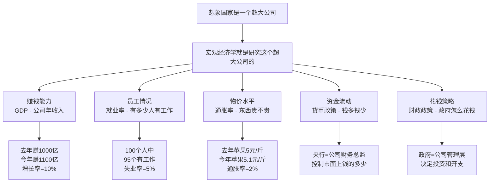

## 二、GDP到底是什么？（从零开始理解）

### 2.1 GDP的大白话解释

**GDP = 国内生产总值 = 一个国家一年内创造的所有财富总和**

#### 生活化理解：
想象你们村一年内：
- 老王种地收获了1000斤大米，卖了2000元
- 老李开小店，卖出商品赚了5000元  
- 老张当木匠，做家具赚了3000元
- 小明当老师，工资收入4000元

**你们村的GDP = 2000 + 5000 + 3000 + 4000 = 14000元**

### 2.2 GDP的三种计算方法详解

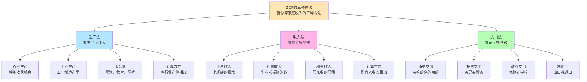


#### 方法一：生产法（看生产）
**公式：GDP = 第一产业产值 + 第二产业产值 + 第三产业产值**

| 产业分类 | 包含内容 | 举例 | 假设产值（万亿元） |
|---------|----------|------|------------------|
| 第一产业 | 农林牧渔 | 种粮食、养猪、捕鱼 | 8 |
| 第二产业 | 工业制造 | 造汽车、盖房子、发电 | 40 |
| 第三产业 | 服务业 | 教育、医疗、银行、餐饮 | 52 |
| **总计** | **GDP** | **全部加起来** | **100** |

#### 方法二：收入法（看收入）
**公式：GDP = 劳动报酬 + 生产税净额 + 固定资产折旧 + 营业盈余**

| 收入类型 | 大白话解释 | 生活例子 | 占比 |
|---------|-----------|----------|------|
| 劳动报酬 | 打工人的工资 | 你的月薪5000元 | 50% |
| 生产税净额 | 政府收的各种税 | 买东西交的增值税 | 15% |
| 固定资产折旧 | 设备老化损耗 | 你的电脑用旧了贬值 | 15% |
| 营业盈余 | 企业赚的利润 | 老板赚到的钱 | 20% |

#### 方法三：支出法（看花钱）
**公式：GDP = C + I + G + (X-M)**

| 符号 | 中文名称 | 大白话解释 | 具体包含 | 举例 |
|------|----------|-----------|----------|------|
| C | 消费支出 | 老百姓花钱买东西 | 吃穿住行、娱乐 | 买菜、买衣服、看电影 |
| I | 投资支出 | 企业花钱买设备 | 厂房、机器、住房 | 工厂买新机器 |
| G | 政府支出 | 政府花钱办事 | 公务员工资、基建 | 修高速公路 |
| X-M | 净出口 | 出口减去进口 | 贸易差额 | 卖给外国100，买进50，净出口=50 |

### 2.3 GDP计算实例（用数字说话）

**假设小明国2023年的经济数据：**

| 支出类型 | 金额（万亿元） | 占GDP比重 | 具体解释 |
|---------|---------------|-----------|----------|
| 消费(C) | 60 | 60% | 全国人民买吃的穿的用的 |
| 投资(I) | 25 | 25% | 企业买设备，个人买房 |
| 政府支出(G) | 12 | 12% | 政府修路、办学校、发工资 |
| 净出口(X-M) | 3 | 3% | 出口30万亿，进口27万亿 |
| **GDP总计** | **100** | **100%** | **一年创造的财富总和** |

### 2.4 GDP增长率的含义

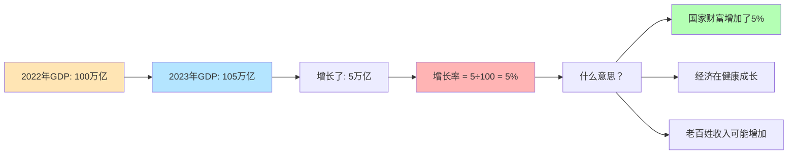


**GDP增长率判断标准：**

| 增长率范围 | 经济状况 | 生活感受 | 举例说明 |
|-----------|----------|----------|----------|
| 8%以上 | 高速增长 | 工作好找，收入增长快 | 中国2000-2010年 |
| 5-8% | 中高速增长 | 生活稳步改善 | 中国近几年 |
| 2-5% | 中速增长 | 生活缓慢改善 | 美国欧洲正常年份 |
| 0-2% | 低速增长 | 生活改善很慢 | 日本近20年 |
| 负增长 | 经济衰退 | 失业增加，收入下降 | 2020年疫情期间 |

## 三、通胀率详解（为什么东西会涨价？）

### 3.1 通胀的大白话解释

**通胀 = 通货膨胀 = 钱变毛了，东西变贵了**

#### 生活化理解：
- 2000年：一碗面条2元
- 2010年：一碗面条8元  
- 2020年：一碗面条15元
- **这就是通胀！同样的东西，需要更多钱才能买到**

### 3.2 通胀的计算方法

**公式：通胀率 = (今年价格 - 去年价格) ÷ 去年价格 × 100%**

#### 实际计算例子：

| 商品 | 2022年价格 | 2023年价格 | 涨幅 | 通胀贡献 |
|------|-----------|-----------|------|----------|
| 猪肉 | 20元/斤 | 22元/斤 | 10% | 权重15%，贡献1.5% |
| 汽油 | 7元/升 | 7.7元/升 | 10% | 权重10%，贡献1.0% |
| 房租 | 3000元/月 | 3150元/月 | 5% | 权重20%，贡献1.0% |
| 手机 | 3000元/台 | 2800元/台 | -6.7% | 权重5%，贡献-0.33% |
| **加权平均** | - | - | **3.17%** | **2023年通胀率** |

### 3.3 失业率详解（为什么有人找不到工作？）

**失业率 = 失业人数 ÷ 劳动力总数 × 100%**

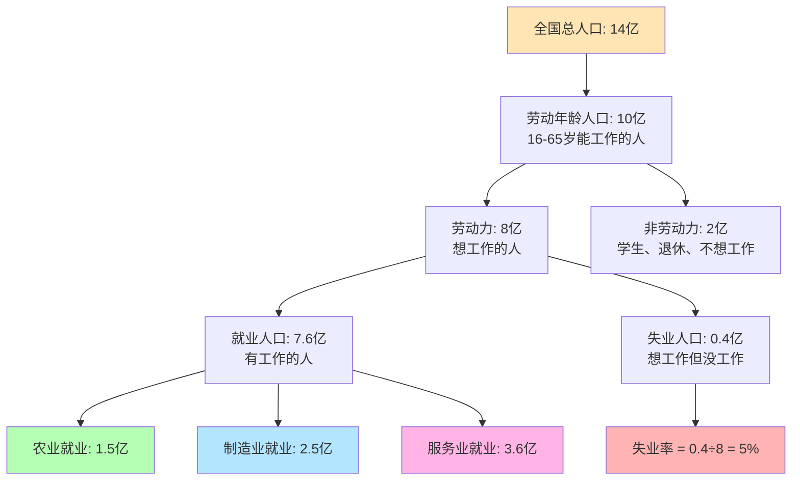

## 四、货币政策详解（央行如何控制经济？）

### 4.1 货币政策的大白话解释

**央行 = 银行的银行 = 管理全国钱的机构**

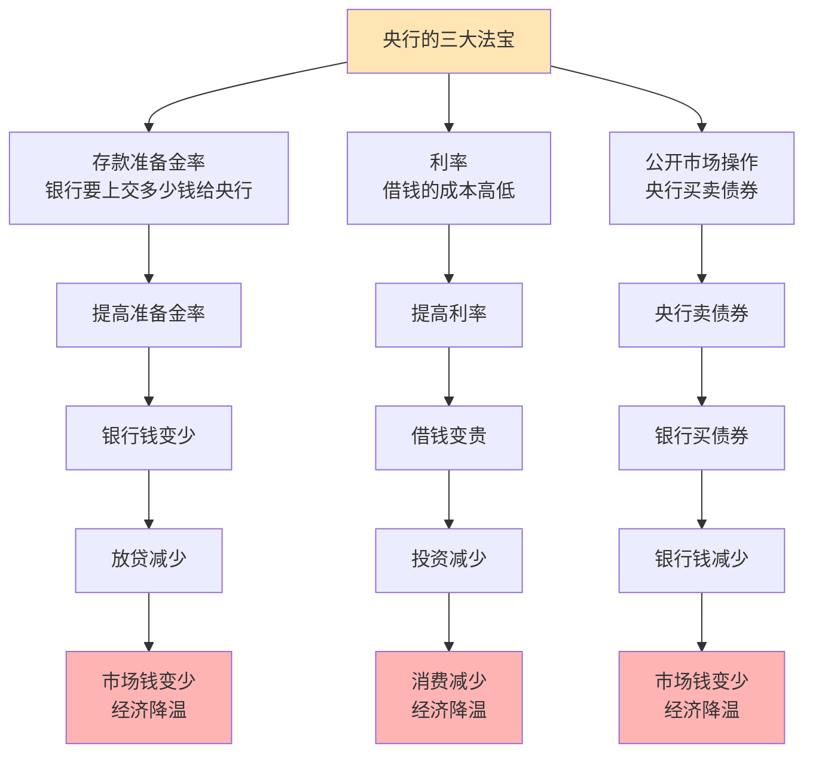

### 4.2 货币政策工具详细解析

| 政策工具 | 操作方式 | 效果 | 生活例子 | 使用时机 |
|---------|----------|------|----------|----------|
| **存款准备金率** | 从20%降到15% | 银行多了5%资金放贷 | 银行有更多钱借给你买房 | 经济下滑时刺激 |
| **利率** | 从5%降到3% | 借钱成本降低 | 房贷月供从5000降到4000 | 促进投资消费 |
| **公开市场操作** | 央行买入1000亿债券 | 向市场投放1000亿流动性 | 市场上钱多了，银行更愿意放贷 | 精确调节资金量 |

### 4.3 货币政策传导机制（钱是怎么流到你手里的？）

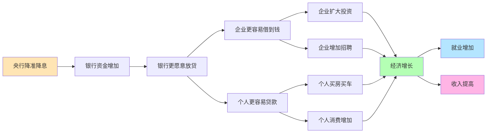
## 五、财政政策详解（政府如何花钱影响经济？）

### 5.1 财政政策的基本概念

**财政政策 = 政府通过花钱和收税来调节经济**

#### 两大类型：
1. **扩张性财政政策**：多花钱，少收税 → 刺激经济
2. **紧缩性财政政策**：少花钱，多收税 → 给经济降温

### 5.2 财政政策工具对比

| 政策类型 | 政府支出 | 税收政策 | 经济效果 | 生活影响 | 使用场景 |
|---------|----------|----------|----------|----------|----------|
| **扩张性** | 大搞基建，增加投资 | 减税降费 | 刺激增长 | 就业增加，收入提高 | 经济衰退时 |
| **紧缩性** | 削减支出，控制投资 | 增税 | 抑制过热 | 就业减少，负担加重 | 经济过热时 |
| **中性** | 维持正常水平 | 税收稳定 | 保持稳定 | 生活平稳 | 经济正常时 |

### 5.3 财政政策实施案例

#### 2008年金融危机时的应对：

| 政策措施 | 投入金额 | 具体内容 | 预期效果 |
|---------|----------|----------|----------|
| **四万亿投资计划** | 4万亿元 | 修铁路、建机场、城市基建 | 创造就业，带动投资 |
| **汽车购置税减半** | 减税300亿 | 1.6L以下车辆税率5% | 刺激汽车消费 |
| **家电下乡补贴** | 补贴200亿 | 农民买家电补贴13% | 扩大农村消费 |
| **总计效果** | 约5万亿 | GDP增长率保持8%以上 | 成功应对危机 |

## 六、经济周期详解（经济为什么有起伏？）

### 6.1 经济周期的四个阶段

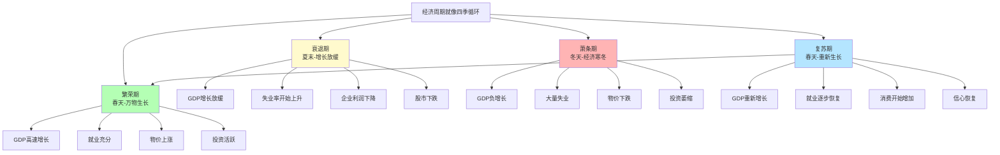

### 6.2 各阶段的具体表现

| 经济阶段 | GDP增长率 | 失业率 | 通胀率 | 股市表现 | 老百姓感受 |
|---------|-----------|--------|--------|----------|-----------|
| **繁荣期** | 8%以上 | 3%以下 | 3-5% | 持续上涨 | 工作好找，收入增长，消费旺盛 |
| **衰退期** | 2-5% | 5-8% | 1-3% | 开始下跌 | 工作不好找，收入增长放缓 |
| **萧条期** | 负增长 | 10%以上 | 0%或负 | 大幅下跌 | 大量失业，收入下降，不敢消费 |
| **复苏期** | 3-6% | 逐步下降 | 1-2% | 缓慢上涨 | 就业改善，收入开始增长 |

## 七、国际经济关系（中国与世界的经济往来）

### 7.1 国际贸易基础概念

**国际贸易 = 国家间的买卖生意**

#### 基本概念解释：

| 概念 | 定义 | 举例说明 | 对中国的意义 |
|------|------|----------|-------------|
| **出口** | 卖东西给外国 | 中国制造的手机卖到美国 | 赚取外汇，增加就业 |
| **进口** | 从外国买东西 | 中国从澳大利亚买铁矿石 | 获得资源，满足需求 |
| **贸易顺差** | 出口>进口 | 2023年中国出口3.4万亿美元，进口2.6万亿 | 外汇储备增加 |
| **贸易逆差** | 进口>出口 | 美国每年逆差8000亿美元 | 外汇储备减少 |

### 7.2 汇率的影响（人民币升值贬值意味着什么？）

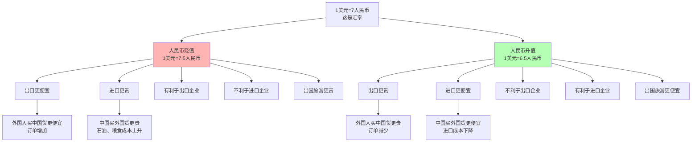

### 7.3 汇率变化的生活影响

**具体例子：**

| 场景 | 人民币贬值时 | 人民币升值时 |
|------|-------------|-------------|
| **出国旅游** | 1万元只能换1333美元（更贵） | 1万元能换1538美元（更便宜） |
| **海淘购物** | 100美元商品要750元（更贵） | 100美元商品要650元（更便宜） |
| **留学费用** | 学费生活费负担更重 | 学费生活费负担减轻 |
| **工厂出口** | 外国客户订单增加 | 外国客户订单减少 |
| **进口企业** | 原材料成本上升 | 原材料成本下降 |

## 八、实用的经济分析框架

### 8.1 如何判断经济形势？

**经济体检表（月度观察指标）**

| 指标类别 | 具体指标 | 正常范围 | 观察要点 | 数据来源 |
|---------|----------|----------|----------|----------|
| **增长指标** | GDP增长率 | 5-7% | 是否稳定增长 | 统计局季度数据 |
| **就业指标** | 失业率 | 3-5% | 是否充分就业 | 统计局月度数据 |
| **价格指标** | CPI同比 | 2-3% | 通胀是否温和 | 统计局月度数据 |
| **货币指标** | M2增长率 | 8-12% | 流动性是否合理 | 央行月度数据 |
| **外贸指标** | 出口增长率 | 5-10% | 外需是否稳定 | 海关总署月度 |

### 8.2 经济政策预测框架

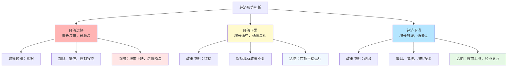

## 九、学习进阶路线图

### 9.1 零基础7天学习计划

| 天数 | 学习重点 | 具体内容 | 学习目标 | 检验方式 |
|------|----------|----------|----------|----------|
| **第1天** | 基础概念 | GDP、CPI、失业率是什么 | 理解三大核心指标 | 能解释给朋友听 |
| **第2天** | 货币政策 | 央行如何调控经济 | 了解利率、准备金 | 能预测政策影响 |
| **第3天** | 财政政策 | 政府如何花钱调经济 | 明白税收、支出作用 | 能分析财政政策 |
| **第4天** | 经济周期 | 为什么经济有起伏 | 识别经济周期阶段 | 能判断当前阶段 |
| **第5天** | 通胀原理 | 为什么会通胀通缩 | 理解价格变动原因 | 能预测通胀趋势 |
| **第6天** | 国际经济 | 汇率、贸易如何影响生活 | 了解开放经济影响 | 能分析汇率影响 |
| **第7天** | 综合应用 | 如何分析经济形势 | 形成分析框架 | 能独立分析经济 |

### 9.2 实战练习题

#### 练习1：GDP计算
**题目**：某国2023年数据如下：
- 消费支出：50万亿元
- 投资支出：20万亿元  
- 政府支出：15万亿元
- 出口：10万亿元
- 进口：5万亿元

**请计算：**
1. 该国GDP是多少？
2. 各项支出占GDP比重？

**答案**：
- GDP = 50 + 20 + 15 + (10-5) = 90万亿元
- 消费占比 = 50/90 = 55.6%
- 投资占比 = 20/90 = 22.2%
- 政府占比 = 15/90 = 16.7%
- 净出口占比 = 5/90 = 5.6%

#### 练习2：通胀计算
**题目**：2022年某商品篮子价格100元，2023年价格105元，求通胀率？

**答案**：通胀率 = (105-100)/100 × 100% = 5%

### 9.3 新闻阅读指南

**如何读懂经济新闻？**

| 新闻关键词 | 经济含义 | 可能影响 | 关注要点 |
|-----------|----------|----------|----------|
| "央行降准" | 释放流动性 | 利好股市房市 | 降准幅度和时间 |
| "CPI上涨" | 通胀压力 | 可能加息 | 上涨幅度和原因 |
| "PMI回落" | 制造业景气度下降 | 经济放缓信号 | 是否跌破50 |
| "外贸增长" | 出口形势好转 | 利好经济 | 增长是否可持续 |
| "失业率上升" | 就业压力加大 | 可能刺激政策 | 上升幅度和原因 |

## 十、常见误区澄清

### 10.1 经济学常见错误理解

| 错误观点 | 正确理解 | 举例说明 |
|---------|----------|----------|
| "GDP越高越好" | GDP要看质量，不只看数量 | 环境污染换来的GDP不可持续 |
| "通胀都是坏事" | 温和通胀是健康的 | 2-3%通胀说明经济有活力 |
| "政府不应该干预经济" | 适度干预是必要的 | 2008年不救市后果更严重 |
| "贸易顺差越大越好" | 过大顺差会带来压力 | 可能导致汇率升值压力 |
| "利率越低越好" | 利率要适中 | 过低可能引发资产泡沫 |

---


# 核心经济指标体系

### 货币供应量指标详解（M0、M1、M2）

#### 什么是货币供应量？
**货币供应量 = 市场上流通的钱有多少 = 经济的血液循环**
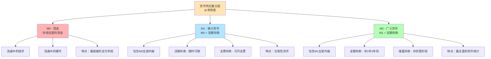
#### M0、M1、M2的具体含义和实际数据

| 指标 | 中文名称 | 包含内容 | 生活化理解 | 2023年中国数据 | 经济意义 |
|------|----------|----------|-----------|---------------|----------|
| **M0** | 流通中现金 | 纸币+硬币 | 你钱包里的现金 | 约10万亿元 | 反映现金使用情况 |
| **M1** | 狭义货币供应量 | M0+活期存款 | 随时能花的钱 | 约70万亿元 | 反映短期流动性 |
| **M2** | 广义货币供应量 | M1+定期存款等 | 所有形式的钱 | 约290万亿元 | 反映总体流动性 |

#### 货币供应量增长率的经济含义
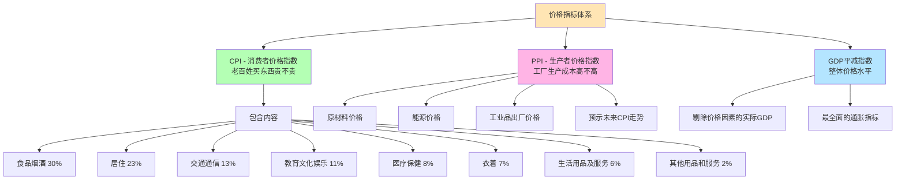
### 2.3 其他重要宏观经济指标

#### A. 价格指标体系


#### B. 就业指标体系
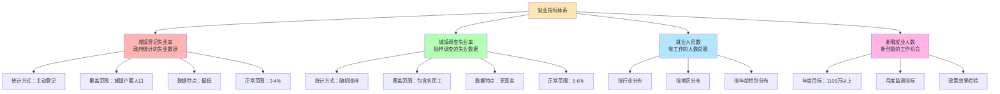

#### C. 投资和消费指标
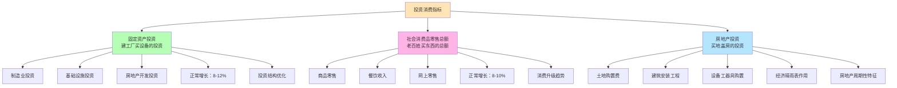

#### D. 对外贸易指标
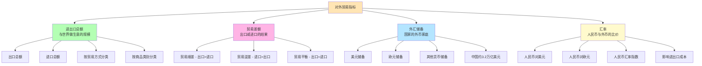

#### E. 金融市场指标
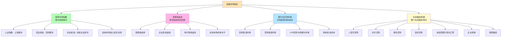

#### F. 先行指标和同步指标
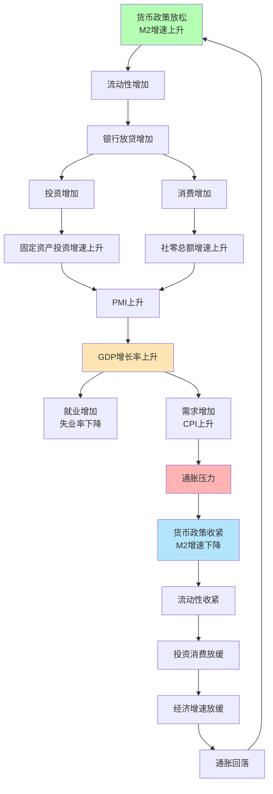

### 2.4 重要指标数据监测表

| 指标分类 | 具体指标 | 正常范围 | 监测频率 | 数据来源 | 关注要点 |
|---------|----------|----------|----------|----------|----------|
| **增长指标** | GDP增长率 | 5-7% | 季度 | 国家统计局 | 是否稳定增长 |
| **价格指标** | CPI同比 | 2-3% | 月度 | 国家统计局 | 通胀是否温和 |
|  | PPI同比 | 0-3% | 月度 | 国家统计局 | 生产成本压力 |
| **货币指标** | M2增长率 | 8-12% | 月度 | 央行 | 流动性是否合理 |
|  | M1增长率 | 5-10% | 月度 | 央行 | 短期流动性 |
|  | M0增长率 | 3-8% | 月度 | 央行 | 现金使用情况 |
| **就业指标** | 城镇调查失业率 | 5-6% | 月度 | 国家统计局 | 就业是否充分 |
|  | 新增就业人数 | 1100万/年 | 月度累计 | 人社部 | 就业创造能力 |
| **投资消费** | 固定资产投资增速 | 8-12% | 月度累计 | 国家统计局 | 投资是否活跃 |
|  | 社零总额增速 | 8-10% | 月度 | 国家统计局 | 消费는否强劲 |
| **对外贸易** | 进出口增长率 | 5-10% | 月度 | 海关总署 | 外需是否稳定 |
|  | 贸易差额 | 顺差3000-5000亿美元/年 | 月度 | 海关总署 | 贸易结构 |
| **先行指标** | 制造业PMI | 50以上 | 月度 | 统计局+物流联合会 | 制造业景气度 |
|  | 服务业PMI | 50以上 | 月度 | 统计局+物流联合会 | 服务业景气度 |

### 2.5 各指标之间的关联关系


### 2.6 实际应用：如何读懂经济数据发布

#### 每月经济数据发布时间表

| 发布时间 | 发布指标 | 重要程度 | 市场影响 | 关注要点 |
|---------|----------|----------|----------|----------|
| **每月9-10日** | CPI、PPI | ★★★★★ | 影响货币政策预期 | 是否超出预期，结构变化 |
| **每月15日左右** | M0、M1、M2 | ★★★★ | 影响流动性预期 | 增速变化，结构变化 |
| **每月15日左右** | 社零、固投、工业增加值 | ★★★★★ | 反映经济增长动能 | 增速是否稳定 |
| **每月月底** | PMI制造业指数 | ★★★★ | 先行指标，预测经济 | 是否在50以上 |
| **季度后15日** | GDP数据 | ★★★★★ | 最重要的增长指标 | 是否达到预期目标 |

#### 数据解读框架
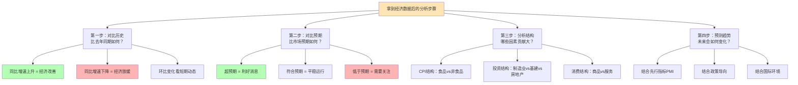

## 三、货币政策传导机制详解（补充M0、M1、M2的作用）

### 3.1 货币政策如何通过M0、M1、M2传导
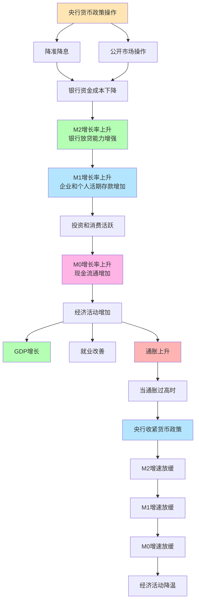

### 3.2 M0、M1、M2增长率的经济信号

| M2与M1增速差 | 经济含义 | 政策信号 | 投资建议 |
|-------------|----------|----------|----------|
| **M2>>M1** | 钱存在银行，投资消费不活跃 | 可能进一步宽松 | 关注政策刺激后的机会 |
| **M2≈M1** | 流动性传导顺畅 | 政策效果正常 | 均衡配置 |
| **M1>M2** | 投资消费非常活跃，经济过热 | 可能收紧政策 | 注意风险控制 |

### 3.3 真实案例分析

#### 2020年疫情期间的货币数据变化：

| 时间 | M2增速 | M1增速 | M0增速 | 经济背景 | 政策应对 |
|------|--------|--------|--------|----------|----------|
| 2020年2月 | 8.8% | 4.8% | 10.9% | 疫情爆发，经济停摆 | 降准释放1.2万亿 |
| 2020年5月 | 11.1% | 6.8% | 9.5% | 复工复产，政策发力 | 继续宽松货币政策 |
| 2020年12月 | 10.1% | 8.6% | 9.2% | 经济恢复，流动性充裕 | 政策回归中性 |

**解读：**
- M2增速从8.8%快速上升到11.1%，说明央行大量投放流动性
- M1增速从4.8%上升到8.6%，说明流动性逐步传导到实体经济
- M0增速保持高位，反映现金需求和经济活动恢复

## 四、完整的宏观经济监测仪表盘
```mermaid
graph TB
    A[宏观经济监测仪表盘] --> B[增长动力<br/>经济是否健康增长]
    A --> C[价格水平<br/>通胀是否可控]
    A --> D[就业状况<br/>民生是否稳定]
    A --> E[流动性<br/>资金是否充裕]
    A --> F[外部均衡<br/>对外贸易是否稳定]
    
    B --> B1[GDP增长率: 目标5-7%]
    B --> B2[工业增加值: 目标6-8%]
    B --> B3[PMI制造业: 高于50]
    B --> B4[固定资产投资: 目标8-12%]
    
    C --> C1[CPI同比: 目标3%以内]
    C --> C2[PPI同比: 目标5%以内]
    C --> C3[核心CPI: 目标2%左右]
    
    D --> D1[城镇调查失业率: 5.5%以内]
    D --> D2[新增就业: 1100万以上]
    D --> D3[居民收入增长: 与GDP同步]
    
    E --> E1[M2增长率: 8-12%]
    E --> E2[社融增速: 10-13%]
    E --> E3[10年国债收益率: 2.5-3.5%]
    
    F --> F1[出口增长: 5-10%]
    F --> F2[贸易顺差: 合理区间]
    F --> F3[外汇储备: 3万亿美元以上]
    
    style A fill:#FFE5B4
    style B fill:#B4FFB4
    style C fill:#FFB4E5
    style D fill:#B4E5FF
    style E fill:#FFFACD
    style F fill:#E5FFE5
```

## 五、实战应用：建立你的经济分析框架

### 5.1 经济数据追踪清单

**月度必看指标（按重要性排序）：**

| 排名 | 指标名称 | 发布时间 | 重要性 | 看什么 | 正常范围 |
|------|----------|----------|--------|--------|----------|
| 1 | CPI同比增长率 | 每月9-10日 | ★★★★★ | 通胀压力 | 2-3% |
| 2 | M2货币供应量增速 | 每月15日 | ★★★★★ | 流动性松紧 | 8-12% |
| 3 | 社会消费品零售总额 | 每月15日 | ★★★★★ | 消费活力 | 8-10% |
| 4 | 固定资产投资累计增速 | 每月15日 | ★★★★★ | 投资动力 | 8-12% |
| 5 | 制造业PMI | 月末最后一天 | ★★★★ | 制造业景气度 | >50 |
| 6 | 城镇调查失业率 | 每月15日 | ★★★★ | 就业状况 | <5.5% |
| 7 | 进出口增长率 | 每月8-10日 | ★★★★ | 外贸形势 | 5-10% |
| 8 | PPI同比增长率 | 每月9-10日 | ★★★ | 上游价格压力 | 0-3% |
| 9 | M1货币供应量增速 | 每月15日 | ★★★ | 短期流动性 | 5-10% |
| 10 | 工业增加值增速 | 每月15日 | ★★★ | 工业生产 | 6-8% |

### 5.2 经济形势研判框架
```mermaid
graph TB
    A[收到经济数据后的判断流程] --> B[步骤1: 单个指标分析]
    B --> C[步骤2: 多指标交叉验证]
    C --> D[步骤3: 趋势判断]
    D --> E[步骤4: 政策预期]
    E --> F[步骤5: 投资建议]
    
    B --> B1[同比：与去年同期比]
    B --> B2[环比：与上月比]
    B --> B3[与预期比：市场预期vs实际]
    B --> B4[与目标比：政策目标vs实际]
    
    C --> C1[增长指标：GDP、工业增加值、投资、消费]
    C --> C2[价格指标：CPI、PPI]
    C --> C3[货币指标：M0、M1、M2]
    C --> C4[就业指标：失业率、新增就业]
    
    D --> D1[连续3个月数据看趋势]
    D --> D2[先行指标PMI的指向]
    D --> D3[结构性变化分析]
    
    E --> E1[数据强劲 → 政策可能收紧]
    E --> E2[数据疲软 → 政策可能放松]
    E --> E3[数据平稳 → 政策保持现状]
    
    F --> F1[股市：政策预期影响]
    F --> F2[债市：利率预期影响]
    F --> F3[房市：货币政策影响]
    F --> F4[汇市：内外利差影响]
    
    style A fill:#FFE5B4
    style B fill:#B4FFB4
    style C fill:#B4E5FF
    style D fill:#FFB4E5
    style E fill:#FFFACD
    style F fill:#E5FFE5
```

### 5.3 实战练习：分析一组真实数据

**2023年12月中国主要经济数据：**

| 指标 | 实际值 | 同比增速 | 市场预期 | 前值 | 分析 |
|------|--------|----------|----------|------|------|
| GDP增长率 | - | 5.2%（全年） | 5.2% | - | ✓ 符合预期，完成目标 |
| CPI同比 | - | -0.3% | -0.4% | -0.5% | ⚠️ 通缩风险，但好于预期 |
| PPI同比 | - | -2.7% | -2.8% | -3.0% | ⚠️ 工业品价格下跌，但跌幅收窄 |
| M2增速 | - | 9.7% | 10.0% | 10.0% | ⚠️ 流动性充裕但增速放缓 |
| 社零增速 | - | 7.4% | 7.6% | 10.1% | ⚠️ 消费恢复偏慢 |
| 固投增速 | - | 3.0% | 2.9% | 2.9% | ⚠️ 投资增长较慢但略好于预期 |
| PMI制造业 | 49.0 | - | 49.1 | 49.4 | ❌ 连续收缩，景气度不足 |

**综合分析：**
- **增长动力：** GDP完成目标，但投资消费动力不足
- **价格水平：** 面临通缩压力，需要刺激需求
- **流动性：** M2增速较高，但实体经济感受不强
- **政策预期：** 可能进一步宽松，刺激内需

## 六、总结与建议

通过补充M0、M1、M2等重要货币指标以及其他关键宏观经济指标，我们现在有了一个完整的经济分析框架。**记住这个口诀：**
```mermaid
graph TB
    A[宏观经济分析口诀<br/>看懂中国经济必备] --> B[三个增长看动力<br/>GDP、投资、消费]
    A --> C[三个价格看通胀<br/>CPI、PPI、GDP平减指数]
    A --> D[三个货币看流动性<br/>M0、M1、M2]
    A --> E[三个就业看民生<br/>失业率、新增就业、收入增长]
    A --> F[三个外贸看开放<br/>进出口、贸易差额、汇率]
    
    B --> B1[GDP增长率：国家体检表]
    B --> B2[固投增速：未来生产力]
    B --> B3[社零增速：当前购买力]
    
    C --> C1[CPI：老百姓感受]
    C --> C2[PPI：企业成本压力]
    C --> C3[GDP平减指数：整体价格]
    
    D --> D1[M0：现金流通]
    D --> D2[M1：短期流动性]
    D --> D3[M2：总体流动性]
    
    E --> E1[调查失业率：真实就业]
    E --> E2[新增就业：创造能力]
    E --> E3[收入增长：生活改善]
    
    F --> F1[进出口：外需强弱]
    F --> F2[贸易差额：外汇收支]
    F --> F3[汇率：国际竞争力]
    
    style A fill:#FFE5B4
    style B fill:#B4FFB4
    style C fill:#FFB4E5
    style D fill:#B4E5FF
    style E fill:#FFFACD
    style F fill:#E5FFE5
```
**建议的学习路径：**
1. **第1周：** 重点掌握GDP、CPI、M2三大核心指标
2. **第2周：** 学会看懂月度经济数据发布
3. **第3周：** 建立指标间的关联思维
4. **第4周：** 开始独立分析经济形势和政策预期


---


# 《七天读懂宏观经济学》详细读书笔记

## 第一天：宏观经济学基础概念

### 宏观经济学的核心使命

**定义深度解析**：
宏观经济学不只是研究"大"的经济现象，更是研究经济系统的整体行为规律。就像医生不能只看某个器官，必须了解整个人体的运作机制一样。

**生活化类比**：
- 微观经济学 = 研究每棵树的生长
- 宏观经济学 = 研究整片森林的生态系统

### GDP深度解析

#### 1. GDP的三种算法详解

**① 生产法（各行业增加值法）**
```
GDP = 农业增加值 + 工业增加值 + 服务业增加值
```

**实际案例**：2022年中国GDP构成
- 第一产业（农业）：4.8万亿元（4.9%）
- 第二产业（工业）：48.3万亿元（39.9%）
- 第三产业（服务业）：66.8万亿元（55.2%）

**② 收入法（要素收入法）**
```
GDP = 工资 + 利润 + 租金 + 利息 + 税收
```

**生活例子**：
假设你买了一杯10元的咖啡：
- 咖啡师工资：3元
- 店铺租金：2元
- 原料成本：2元
- 老板利润：2元
- 政府税收：1元
总计10元就是这杯咖啡对GDP的贡献

**③ 支出法（最终需求法）**
```
GDP = C（消费）+ I（投资）+ G（政府支出）+ (X-M)（净出口）
```

**中国2022年数据示例**：
- 消费（C）：61万亿元（50.5%）
- 投资（I）：57万亿元（47.2%）
- 政府支出（G）：20万亿元（16.6%）
- 净出口（X-M）：4万亿元（3.3%）

#### 2. GDP的局限性

**不能反映的重要方面**：

**① 收入分配问题**
- 案例：卡塔尔人均GDP超过6万美元，但贫富差距巨大
- 中国：沿海与内陆地区GDP差异显著

**② 生活质量问题**
- 案例：不丹提出"国民幸福指数"（GNH）替代GDP
- 欧洲一些国家工作时间短、休假多，GDP增长慢但生活满意度高

**③ 环境成本问题**
- 案例：某地区因重工业发展GDP快速增长，但空气污染严重，治理成本巨大
- 绿色GDP概念：GDP - 环境成本 = 真实发展水平

### 经济周期深度分析

#### 1. 经济周期的四个阶段

**① 繁荣期（Peak）**
特征表现：
- GDP增长率达到高点（通常>7%）
- 失业率降至最低点（<4%）
- 通胀开始抬头（>3%）
- 股市估值偏高，投资情绪乐观

**历史案例**：
- 美国1999-2000年：互联网泡沫时期
  - GDP增长率：4.1%
  - 失业率：3.9%
  - 纳斯达克指数创历史新高

- 中国2007年：经济过热期
  - GDP增长率：14.2%
  - CPI涨幅：4.8%
  - 上证指数突破6000点

**② 衰退期（Recession）**
技术定义：连续两个季度GDP负增长

**典型表现**：
- 企业利润下降，裁员增加
- 消费者信心指数下滑
- 股市大幅下跌
- 银行放贷更加谨慎

**经典案例**：
- 2008年全球金融危机
  - 美国GDP萎缩2.5%
  - 失业率从5%飙升至10%
  - 道琼斯指数从14000点跌至6500点
  - 房价下跌30-50%

- 2020年新冠疫情冲击
  - 全球GDP萎缩3.1%
  - 美国Q2 GDP环比年化萎缩31.4%
  - 航空、旅游、餐饮业重创

**③ 萧条期（Trough）**
特征：经济触底，各项指标最差

**大萧条案例（1929-1933）**：
- 美国GDP累计下降27%
- 失业率高达25%
- 股市跌幅达89%
- 银行倒闭9000多家
- 影响：全球贸易萎缩25%

**④ 复苏期（Recovery）**
特征：经济开始回暖，但还未恢复到原有水平

**复苏的典型路径**：
1. 政府刺激政策出台
2. 市场信心逐步恢复
3. 就业率开始改善
4. 消费和投资逐步回升

**案例**：中国2009年"四万亿"刺激计划
- 背景：应对全球金融危机冲击
- 措施：大规模基础设施投资
- 效果：2009年GDP仍增长9.4%，率先复苏

#### 2. 经济周期的成因

**① 外部冲击理论**
- 技术革命：蒸汽机→电力→计算机→互联网→AI
- 资源价格波动：1973年石油危机，油价从3美元涨到12美元
- 自然灾害：日本大地震对全球供应链的冲击

**② 内在波动理论**
- 投资波动：企业投资决策的集中性
- 库存周期：企业根据预期调整库存水平
- 心理因素：投资者情绪的羊群效应

**实际案例**：中国的"猪周期"
- 2019年：非洲猪瘟导致生猪存栏量下降40%
- 2020年：猪肉价格上涨110%，推高CPI
- 2021年：产能恢复，猪肉价格下跌30%
- 影响：农业GDP、农民收入、通胀水平

---

## 第二天：通货膨胀与通货紧缩

### 通货膨胀深度分析

#### 1. 通胀的分类与特征

**① 按程度分类**

**温和通胀（2-3%）**
- 特征：价格稳步上涨，经济健康增长
- 案例：美国2010-2019年，年均通胀2.1%
- 好处：刺激消费（今天不买明天更贵），促进投资

**高通胀（10-20%）**
- 特征：价格快速上涨，经济开始失控
- 案例：1970年代美国"滞胀"
  - 1979年通胀率达13.3%
  - 同时失业率达7.1%
  - 经济增长停滞

**恶性通胀（>50%）**
- 特征：货币体系崩溃，物价飞涨
- 历史案例：
  - 德国魏玛共和国（1923年）：通胀率达3.25×10⁶%
  - 津巴布韦（2008年）：通胀率达231,000,000%
  - 委内瑞拉（2018年）：通胀率达1,000,000%

**② 按成因分类**

**需求拉动型通胀（Demand-Pull）**
原理：总需求 > 总供给

**经典案例**：中国房地产市场（2016-2017年）
- 背景：棚改货币化安置释放大量购房需求
- 过程：
  - 政府发放货币补偿约2.5万亿元
  - 大量资金涌入三四线城市
  - 房价平均上涨20-50%
- 后果：房地产过热，居民杠杆率快速上升

**成本推动型通胀（Cost-Push）**
原理：生产成本上升推高产品价格

**案例分析**：2021-2022年全球通胀
成本上升因素：
- 原油：从40美元/桶涨到130美元/桶
- 天然气：欧洲价格上涨10倍
- 芯片短缺：汽车生产成本上升15%
- 运费：集装箱运费上涨5倍

影响传导：
```
原材料涨价 → 生产成本上升 → 出厂价格上涨 → 消费价格上涨
```

**货币供应量过多型通胀**
原理：流通中货币太多，"钱多了，东西相对便宜了"

**量化宽松案例**：美国2008-2014年QE政策
- QE1（2008年）：购买1.75万亿美元证券
- QE2（2010年）：再购买6000亿美元国债
- QE3（2012年）：每月购买850亿美元证券
- 结果：货币供应量增长3倍，推高资产价格

#### 2. 通胀的测量指标

**① CPI（消费者价格指数）**
构成（中国）：
- 食品烟酒：28.1%
- 居住：23.4%
- 交通通信：13.6%
- 教育文化娱乐：10.9%
- 医疗保健：8.8%
- 其他用品：7.5%
- 衣着：6.2%
- 生活用品：1.5%

**实际计算例子**：
假设某城市2022年vs 2021年价格变化：
- 食品：+8%（权重30%）
- 住房：+5%（权重30%）
- 交通：+12%（权重15%）
- 其他：+3%（权重25%）

CPI涨幅 = 8%×30% + 5%×30% + 12%×15% + 3%×25% = 6.45%

**② PPI（生产者价格指数）**
意义：反映生产端成本压力，领先于CPI

**案例**：2021年中国PPI与CPI的分化
- PPI同比增长：最高达13.5%
- CPI同比增长：维持在1%左右
- 原因：上游原材料涨价向下游传导不畅
- 影响：制造业企业利润被压缩

#### 3. 通胀的影响分析

**① 对不同群体的影响**

**债务人 vs 债权人**
- 债务人受益：实际债务负担减轻
- 债权人受损：实际收益下降

**具体案例**：
假设张三2020年借款100万买房，固定利率4%：
- 如果通胀率3%：实际利率 = 4% - 3% = 1%
- 如果通胀率6%：实际利率 = 4% - 6% = -2%（负利率！）

**固定收入者 vs 灵活收入者**
- 退休人员、政府员工等固定收入者受损更大
- 企业家、销售人员等收入能随通胀调整的群体受损较小

**② 对经济行为的影响**

**消费行为改变**
- 提前消费：担心未来涨价
- 囤积行为：购买耐用品和保值品
- 替代消费：用便宜商品替代昂贵商品

**投资行为改变**
- 实物资产受青睐：房产、黄金、商品
- 现金持有减少：存银行相当于亏钱
- 股市结构分化：有定价权的公司受益

### 通货紧缩深度分析

#### 1. 通缩的成因与机制

**① 需求不足型通缩**
原理：消费和投资需求持续疲弱

**日本"失去的20年"案例**：
时间轴：
- 1991年：房地产泡沫破裂
- 1992-1993年：银行坏账激增
- 1995年开始：物价持续下跌
- 1998-2013年：年均通缩1%

恶性循环：
```
资产价格下跌 → 银行惜贷 → 企业投资减少 → 失业增加 
→ 消费减少 → 需求不足 → 物价下跌 → 预期更加悲观
```

**② 供给过剩型通缩**
原理：生产能力远超市场需求

**中国钢铁行业案例（2015年）**：
- 产能：12亿吨
- 需求：8亿吨
- 产能过剩：30%以上
- 结果：钢价跌至成本线以下，行业亏损

**③ 技术进步型通缩**
原理：技术进步提高效率，降低生产成本

**IT产品价格案例**：
- 1981年IBM PC：3000美元
- 2021年同等性能电脑：300美元
- 40年价格下降90%，但这是好的通缩

#### 2. 通缩的危害

**① 债务通缩螺旋**
机制：物价下跌 → 实际债务负担加重 → 破产增加 → 银行坏账增加 → 信贷收缩 → 经济进一步萎缩

**1930年代美国大萧条**：
- 1929-1933年：物价下降25%
- 农产品价格下降50%
- 农民实际债务负担翻倍
- 银行倒闭9000家

**② 流动性陷阱**
现象：即使央行降息至零，也无法刺激经济

**日本案例**：
- 1995年开始降息，1999年降至0.5%
- 2001年实施零利率政策
- 2013年开始负利率政策
- 但经济增长依然疲弱

#### 3. 应对通缩的政策工具

**① 货币政策**
- 量化宽松（QE）
- 负利率政策
- 前瞻性指引

**② 财政政策**
- 扩大政府支出
- 减税降费
- 转移支付

**③ 结构性改革**
- 去产能、去库存
- 提高生产效率
- 鼓励创新

---

## 第三天：失业与就业

### 失业类型深度分析

#### 1. 摩擦性失业

**定义扩展**：由于劳动力市场信息不完全、搜寻匹配需要时间而产生的短期失业。

**产生机制**：
```
员工离职/毕业 → 搜寻新工作 → 面试匹配 → 找到合适工作
```
这个过程通常需要2-6个月。

**现实案例分析**：

**大学生就业**：
- 2022年中国高校毕业生1076万人
- 平均求职时间：3-4个月
- 主要原因：
  - 期望与现实不匹配
  - 地域偏好（想留在一二线城市）
  - 行业选择迷茫
  - 技能与需求不对接

**互联网行业跳槽**：
- 平均跳槽周期：2-3年
- 跳槽期间空档：1-3个月
- 原因：寻找更好的发展机会和薪酬

**减少摩擦性失业的方法**：
1. **信息平台建设**：
   - 政府：建立公共就业服务平台
   - 市场：招聘网站、猎头公司
   - 案例：智联招聘、Boss直聘等平台日活超千万

2. **技能培训**：
   - 职业技能提升：适应岗位要求
   - 求职技能培训：简历制作、面试技巧

#### 2. 结构性失业

**定义深化**：由于经济结构变化导致劳动力技能与岗位需求不匹配的失业。

**产生背景**：
- 技术进步淘汰旧岗位
- 产业升级转移
- 国际贸易冲击
- 政策调整影响

**详细案例分析**：

**① 煤炭行业去产能（2016-2018年）**
背景：
- 全国煤炭产能严重过剩
- 环保要求提高
- 能源结构调整

影响：
- 关闭煤矿超过1000座
- 涉及职工约130万人
- 主要集中在山西、内蒙古、河南等地

政府应对：
- 设立1000亿元专项资金
- 提供技能培训和转岗安置
- 支持发展接续产业

结果：
- 90%以上职工得到妥善安置
- 煤炭价格企稳回升
- 行业效益明显改善

**② 传统零售业转型**
冲击因素：
- 电商快速发展：网购渗透率从10%提升到25%
- 移动支付普及：支付方式变革
- 新零售模式：线上线下融合

受影响岗位：
- 传统收银员：自助收银设备普及
- 导购员：线上客服、直播带货兴起
- 仓管员：自动化仓储普及

转型路径：
- 技能升级：学习数字化工具
- 岗位转换：从线下转向线上
- 行业转移：进入新兴服务业

**③ 制造业智能化改造**
案例：富士康工厂自动化
- 2011年：员工130万人
- 2021年：员工80万人，但产值翻倍
- 变化：引入10万台机器人

影响分析：
- 消失岗位：简单组装工
- 新增岗位：机器人操作员、维护工程师
- 技能要求：从体力劳动转向技术操作

#### 3. 周期性失业

**机制分析**：
```
经济衰退 → 需求下降 → 企业订单减少 → 产能利用率下降 
→ 裁员降薪 → 失业率上升 → 消费能力下降 → 需求进一步萎缩
```

**历史案例对比**：

**① 2008年金融危机**
美国失业率变化：
- 2007年：5.0%
- 2008年：5.8%
- 2009年：9.3%
- 2010年：9.6%（峰值）
- 2017年：4.4%（恢复到危机前水平）

行业影响差异：
- 建筑业：失业率从7.5%升至27.1%
- 制造业：失业率从4.5%升至17.2%
- 教育医疗：失业率相对稳定（3-6%）

**② 2020年新冠疫情**
美国失业率急剧变化：
- 2020年2月：3.5%
- 2020年4月：14.8%（史上第二高）
- 2021年底：3.9%（快速恢复）

行业冲击分析：
- 餐饮住宿：失业率达39.3%
- 艺术娱乐：失业率达47.6%
- 信息技术：失业率仅升至5.5%

恢复速度差异：
- 白领岗位：6个月基本恢复
- 服务业岗位：18个月才恢复
- 原因：远程工作能力不同

### 自然失业率深度解析

#### 1. 理论基础

**定义精确化**：在劳动力市场达到均衡时的失业率，由结构性和摩擦性失业构成。

**计算公式**：
```
自然失业率 = 摩擦性失业率 + 结构性失业率
```

**各国对比**：
- 美国：4.0-5.0%
- 欧元区：6.0-8.0%
- 日本：2.5-3.0%
- 中国：4.0-5.5%（官方目标）

#### 2. 影响因素分析

**① 劳动力市场制度**
案例对比：
- 美国：就业保护较松，自然失业率相对较低
- 法国：就业保护严格，自然失业率较高
- 原因：严格保护降低企业招聘意愿

**② 失业保险制度**
机制：保险水平过高 → 降低求职积极性 → 拉长失业时间

数据对比：
- 美国：失业保险替代率40-50%，平均领取26周
- 德国：失业保险替代率60-67%，可领取12-24个月
- 影响：德国自然失业率高于美国1-2个百分点

**③ 劳动力流动性**
影响因素：
- 户籍制度：中国城乡二元结构影响
- 住房成本：高房价降低跨地区流动意愿
- 文化语言：国际间流动障碍

### 就业政策深度分析

#### 1. 积极就业政策

**① 技能培训政策**
德国"双元制"职业教育：
- 模式：企业实习（70%）+ 学校教育（30%）
- 覆盖：60%的中学毕业生选择职业教育
- 效果：青年失业率仅7%（欧盟平均15%）
- 启示：产教融合是关键

**中国职业技能提升行动（2019-2021年）**：
- 目标：培训5000万人次
- 投入：1000亿元专项资金
- 重点：新兴产业、现代服务业
- 成果：实际培训8300万人次

**② 创业支持政策**
以色列创业生态：
- 政府作用：提供启动资金和税收优惠
- 军队贡献：培养技术人才
- 风投发达：人均风投额全球第一
- 结果：高科技企业密度全球最高

中国"双创"政策效果：
- 新增市场主体：年均超过2000万户
- 带动就业：每年新增1300万个岗位
- 独角兽企业：数量全球第二

#### 2. 反周期就业政策

**① 财政刺激创造就业**
罗斯福新政就业项目（1933-1939年）：
- 公共工程振兴署（PWA）：修建公路、桥梁、机场
- 平民保护团（CCC）：300万青年参与环保项目
- 就业振兴署（WPA）：提供850万个工作岗位
- 效果：失业率从25%降至17%

中国应对疫情就业政策（2020年）：
- 减税降费：2.6万亿元
- 稳岗补贴：惠及8700万职工
- 灵活就业：支持新就业形态
- 效果：城镇调查失业率从6.2%降至5.2%

**② 货币政策间接促进就业**
美联储就业双重使命：
- 价格稳定 + 充分就业
- 政策工具：通过利率影响投资和就业
- 实践：2008年后长期超低利率政策

效果追踪：
- 2009年：失业率10.0%，联邦基金利率0-0.25%
- 2017年：失业率4.4%，开始加息
- 机制：低利率 → 促进投资 → 创造就业

---

## 第四天：货币政策

### 货币政策工具深度解析

#### 1. 存款准备金率政策

**机制原理详解**：
银行必须向央行上缴部分资金作为准备金，这部分资金不能用于放贷。

**计算示例**：
假设某银行吸收存款1000亿元：
- 准备金率20%时：上缴200亿元，可放贷800亿元
- 准备金率降至18%时：上缴180亿元，可放贷820亿元
- 释放流动性：20亿元

**中国存准率政策历史**：

**2008年金融危机前后对比**：
- 2007年底：大型银行存准率15.5%（抑制流动性过剩）
- 2008年12月：下调至15.5%→13.5%（应对危机）
- 2009年：继续下调至15.5%（刺激经济）
- 释放资金：约2万亿元

**2014-2016年定向降准**：
- 目的：支持小微企业和三农
- 措施：符合条件的银行可享受0.5-1.5%的优惠
- 创新：从"大水漫灌"转向"精准滴灌"

**国际对比**：
- 美国：无法定存款准备金率要求（2020年3月取消）
- 欧元区：1%
- 日本：0.05-1.3%
- 中国：目前大型银行11.5%，中小银行9.5%

#### 2. 利率政策深度分析

**① 利率传导机制**
```
央行基准利率 → 银行间利率 → 银行存贷利率 → 企业融资成本 
→ 投资决策 → 总需求 → 经济增长/通胀
```

**② 实际案例：美联储利率政策**

**2008-2015年零利率时代**：
- 背景：金融危机冲击严重
- 政策：联邦基金利率降至0-0.25%
- 持续时间：7年
- 配套措施：三轮量化宽松
- 效果：经济逐步复苏，失业率从10%降至5%

**2015-2018年加息周期**：
- 加息路径：9次加息，从0.25%升至2.5%
- 背景：经济复苏，通胀回升
- 影响：美元走强，新兴市场资本外流
- 全球影响：其他央行被迫跟进加息

**2019-2020年重新降息**：
- 2019年：预防性降息3次
- 2020年：疫情冲击，紧急降息至0-0.25%
- 配套：无限量化宽松
- 影响：全球流动性泛滥，资产价格暴涨

**③ 中国利率市场化进程**

**历史演进**：
- 1996年：放开银行间同业拆借利率
- 2004年：放开贷款利率上限
- 2012年：扩大存贷利率浮动区间
- 2015年：取消存款利率上限
- 2019年：LPR改革，建立市场化利率形成机制

**LPR机制详解**：
- 报价银行：18家银行每月20日报价
- 计算方式：去掉最高和最低报价，算术平均
- 传导路径：MLF利率 → LPR → 贷款利率
- 意义：打破贷款利率隐性下限

#### 3. 公开市场操作

**① 操作方式详解**

**正回购（回收流动性）**：
- 操作：央行卖出债券，银行用资金购买
- 到期：银行收回本金和利息，央行收回债券
- 效果：银行资金减少，市场流动性收紧

**逆回购（投放流动性）**：
- 操作：央行买入债券，向银行投放资金
- 到期：央行收回本金和利息，银行收回债券
- 效果：银行资金增加，市场流动性宽松

**② 中国公开市场操作实践**

**常用工具组合**：
- 逆回购：期限7天、14天、28天
- MLF（中期借贷便利）：期限3个月、6个月、1年
- SLF（常备借贷便利）：期限1-3个月
- TMLF（定向中期借贷便利）：期限1年，支持小微企业

**2020年疫情期间操作**：
- 2月3日：投放1.2万亿元流动性（史上单日最大规模）
- 全年累计：净投放流动性超过5万亿元
- 配套措施：下调OMO利率30个基点
- 效果：银行间利率大幅下降，缓解流动性紧张

#### 4. 创新型货币政策工具

**① 量化宽松（QE）**

**日本经验（2001年率先实施）**：
- 背景：陷入通缩陷阱，传统货币政策失效
- 做法：大量购买国债，增加银行超额准备金
- 规模：基础货币从60万亿日元增加到100万亿日元
- 效果：有限，经济仍长期低迷

**美国QE政策详解**：
- QE1（2008.11-2010.3）：购买1.75万亿美元MBS和国债
- QE2（2010.11-2011.6）：购买6000亿美元长期国债
- QE3（2012.9-2014.10）：每月购买850亿美元证券
- 总规模：美联储资产负债表从9000亿美元扩张到4.5万亿美元

**欧洲QE（2015-2018年）**：
- 规模：每月购买600-800亿欧元债券
- 创新：购买企业债券和资产支持证券
- 挑战：各国国债收益率差异大

**② 负利率政策**

**实施国家/地区**：
- 丹麦（2012年）：首个实施负利率的央行
- 欧央行（2014年）：存款便利利率-0.5%
- 日本（2016年）：政策利率-0.1%
- 瑞士、瑞典等也实施负利率

**传导机制**：
```
央行负利率 → 银行向央行存钱要付费 → 银行更愿意放贷 
→ 市场利率下降 → 刺激投资消费
```

**实际效果评估**：
- 正面：降低了市场利率，支撑了经济
- 负面：银行利润受损，储蓄者利益受损
- 争议：是否真正有效刺激经济增长

### 货币政策传导机制

#### 1. 利率传导渠道

**理论路径**：
```
央行利率变化 → 市场利率变化 → 投资成本变化 → 投资需求变化 
→ 总需求变化 → GDP和通胀变化
```

**实证分析：房地产市场**
中国房贷利率与房价关系（2015-2021年）：
- 2015年：5次降息，房贷利率从6.15%降至4.9%
- 2016-2017年：房价上涨20-30%
- 2018-2021年：利率回升至5.2-5.8%
- 2021年底：房价涨幅回落至3-5%

**传导阻滞因素**：
- 银行风险偏好：经济下行时惜贷
- 企业融资需求：投资回报率预期低
- 监管政策影响：房地产调控政策

#### 2. 信贷传导渠道

**银行资本充足率影响**：
```
央行宽松政策 → 银行准备金减少 → 银行可贷资金增加 
→ 信贷投放增加 → 流动性增加 → 经济刺激
```

**2009年中国信贷投放案例**：
- 政策：4万亿刺激计划 + 适度宽松货币政策
- 效果：新增贷款9.6万亿元（同比增长31.7%）
- 结构：基建和房地产占比超过60%
- 后果：资产价格快速上涨，产能过剩加剧

#### 3. 汇率传导渠道

**机制**：
```
本币利率下降 → 资本外流 → 本币贬值 → 出口竞争力提升 
→ 净出口增加 → 经济增长
```

**日本安倍经济学案例（2012-2015年）**：
- 政策：超宽松货币政策 + 财政刺激
- 汇率变化：日元从80日元/美元贬值至125日元/美元
- 出口影响：汽车、电子产品出口大幅增长
- GDP效果：年均增长1.2%，摆脱通缩

#### 4. 资产价格传导渠道

**财富效应机制**：
```
央行宽松 → 股市债市上涨 → 居民财富增加 → 消费倾向上升 
→ 消费需求增加 → 经济增长
```

**美国股市财富效应测算**：
- 经验数据：股市每上涨1美元，消费增加3-5美分
- 2009-2019年：道指从6500点涨至28000点
- 财富增加：家庭财富净值增加约20万亿美元
- 消费贡献：对GDP增长贡献约0.3-0.5个百分点/年

### 货币政策的局限性

#### 1. 流动性陷阱

**理论描述**：
当利率降至极低水平时，继续增加货币供应量对刺激经济的效果微乎其微。

**日本实例（1990年代至今）**：
- 现象：利率接近零，但经济增长乏力
- 原因：
  - 企业投资意愿低：预期回报率低
  - 居民储蓄偏好强：人口老龄化影响
  - 银行惜贷：不良资产负担重

**货币政策失效表现**：
- 基础货币大幅增加，但M2增速缓慢
- 银行超额准备金大量堆积
- 投资和消费对利率变化不敏感

#### 2. 时滞问题

**政策时滞构成**：
1. **认知时滞**：发现经济问题需要时间（2-3个月）
2. **决策时滞**：制定政策需要时间（1-2个月）
3. **执行时滞**：政策实施需要时间（1个月）
4. **效应时滞**：产生效果需要时间（6-18个月）

**2008年危机应对时间线**：
- 2007年8月：次贷危机爆发（问题出现）
- 2007年9月：美联储首次降息（开始应对）
- 2008年3月：贝尔斯登倒闭（危机加剧）
- 2008年9月：雷曼倒闭（全面爆发）
- 2009年3月：股市见底（政策显效）
- 总时滞：约18个月

#### 3. 结构性问题

**货币政策的盲区**：
- 无法解决供给侧问题：技术落后、产能过剩
- 无法直接影响收入分配：可能加剧贫富差距
- 无法解决制度性问题：产权保护、营商环境

**中国供给侧结构性改革启示**：
- 背景：2012年后经济增速持续下滑
- 货币政策困境：宽松政策效果递减，副作用增大
- 解决方案：供给侧改革（去产能、去库存、去杠杆、降成本、补短板）
- 效果：经济质量提升，增长更可持续

---

## 第五天：财政政策

### 财政政策工具深度解析

#### 1. 政府支出政策

**① 政府支出的分类与特点**

**按经济性质分类**：

**消费性支出**：
- 定义：政府运行和提供公共服务的支出
- 包括：公务员工资、政府机构运行费用
- 特点：刚性强，难以调整
- 占比：中国约占一般公共预算支出的15%

**投资性支出**：
- 定义：政府用于基础设施和公共投资的支出
- 包括：道路、桥梁、学校、医院建设
- 特点：调节性强，可作为逆周期调节工具
- 占比：中国约占35%

**转移性支出**：
- 定义：政府向个人和企业的转移支付
- 包括：社会保障、失业救济、企业补贴
- 特点：再分配功能强，自动稳定器作用
- 占比：中国约占50%

**② 政府支出乘数效应详解**

**基础理论**：
```
政府支出增加1元 → 收入增加1元 → 消费增加MPC元 
→ 再次带动收入增加MPC元 → 消费增加MPC²元 → ...
```

**乘数公式**：
```
支出乘数 = 1 / (1 - MPC) = 1 / MPS
```
其中MPC为边际消费倾向，MPS为边际储蓄倾向

**实际测算案例**：

**中国4万亿刺激计划（2008-2010年）**：
- 总投资：4万亿元
- 资金来源：
  - 中央财政：1.18万亿元
  - 地方政府：1.25万亿元  
  - 银行信贷：1.57万亿元
- 投向结构：
  - 铁路公路机场：1.5万亿元（37.5%）
  - 地震灾后重建：1万亿元（25%）
  - 农村民生工程：0.37万亿元（9.25%）
  - 保障性住房：0.28万亿元（7%）
  - 其他：0.85万亿元（21.25%）

**效果评估**：
- GDP增长：2009年增长9.4%，2010年增长10.6%
- 就业保障：新增就业岗位超过900万个
- 基础设施：高铁里程从零增长到3.8万公里
- 副作用：地方债务激增，产能过剩加剧

**国际对比**：
- 美国（2009年）：7870亿美元刺激计划，乘数约1.4
- 日本（1990年代）：多次财政刺激，乘数约0.6-1.0
- 德国（2009年）：500亿欧元刺激，乘数约1.2

**③ 不同类型支出的乘数差异**

**基础设施投资**：
- 乘数：1.5-2.0
- 原因：带动上下游产业链，就业效果明显
- 案例：高铁建设带动钢铁、水泥、机械制造等行业

**社会保障转移支付**：
- 乘数：1.2-1.5
- 原因：低收入群体消费倾向高
- 案例：美国食品券计划，每1美元支出带动1.7美元GDP增长

**税收减免**：
- 乘数：0.6-1.0
- 原因：部分资金被储蓄，消费增加有限
- 案例：布什减税计划，乘数约0.8

#### 2. 税收政策深度分析

**① 税收体系结构**

**中国税收结构（2021年）**：
- 增值税：39.4%（5.8万亿元）
- 企业所得税：22.3%（3.3万亿元）
- 个人所得税：8.1%（1.2万亿元）
- 消费税：8.9%（1.3万亿元）
- 关税：1.7%（0.25万亿元）
- 其他：19.6%

**美国税收结构对比**：
- 个人所得税：50.1%
- 工薪税：35.6%
- 企业所得税：9.7%
- 其他：4.6%

**② 减税政策案例分析**

**中国营改增（2012-2018年）**：
- 背景：消除重复征税，促进服务业发展
- 过程：
  - 2012年：在上海试点交通运输业和部分现代服务业
  - 2013年：试点扩大到全国
  - 2016年：全面推开，覆盖建筑业、房地产业、金融业、生活服务业
- 减税效果：累计减税超过2.1万亿元
- 经济影响：
  - 服务业占GDP比重从45%提升到55%
  - 新增市场主体年均增长15%
  - 促进了产业分工细化

**美国特朗普减税法案（2017年）**：
- 主要内容：
  - 企业所得税：从35%降至21%
  - 个人所得税：最高税率从39.6%降至37%
  - 海外利润汇回税：一次性优惠税率
- 减税规模：10年约1.5万亿美元
- 短期效果：
  - 2018年GDP增长2.9%，超过预期
  - 企业投资增长6.2%
  - 失业率降至3.7%，为50年最低
- 争议：
  - 财政赤字扩大
  - 主要受益者为高收入群体
  - 长期增长效果存疑

**③ 税收的自动稳定器功能**

**机制原理**：
```
经济繁荣 → 收入增加 → 税收增加 → 可支配收入相对减少 → 自动降温
经济衰退 → 收入减少 → 税收减少 → 可支配收入相对增加 → 自动刺激
```

**累进税制的稳定效果**：
假设某人年收入变化：
- 繁荣期：收入从10万元增至15万元
  - 税率从20%升至25%
  - 税后收入从8万元增至11.25万元
  - 收入增长50%，税后收入仅增长40.6%

- 衰退期：收入从10万元降至7万元
  - 税率从20%降至15%
  - 税后收入从8万元降至5.95万元
  - 收入下降30%，税后收入仅下降25.6%

**实际数据验证**：
美国2008年金融危机期间：
- GDP下降4.3%
- 联邦个人所得税下降15.7%
- 自动稳定器贡献：缓解经济下滑约0.8个百分点

#### 3. 财政赤字与债务管理

**① 赤字率的国际比较与标准**

**欧盟马斯特里赫特标准**：
- 财政赤字/GDP ≤ 3%
- 政府债务/GDP ≤ 60%

**各国赤字率对比（2021年）**：
- 美国：12.4%（疫情特殊年份）
- 日本：7.5%
- 德国：4.2%
- 法国：6.5%
- 英国：10.9%
- 中国：3.1%（含地方政府专项债）

**② 债务可持续性分析**

**债务动态方程**：
```
债务率变化 = (利率 - 增长率) × 现有债务率 + 基本赤字率
```

**案例分析：日本债务问题**：
- 现状：政府债务/GDP超过260%（全球最高）
- 可持续因素：
  - 低利率：10年期国债收益率仅0.1%
  - 内债为主：90%以上由国内投资者持有
  - 经常账户盈余：对外净资产充足
- 风险因素：
  - 人口老龄化：社保支出刚性增长
  - 经济增长乏力：名义GDP增长接近零
  - 央行货币化：日银购买超过50%的国债

**③ 地方政府债务分析**

**中国地方债发展历程**：
- 2009年：4万亿刺激下地方融资平台快速扩张
- 2014年：新《预算法》允许地方政府发债
- 2015年：启动地方债务置换，降低融资成本
- 2018年：严格控制隐性债务增量

**地方债务结构（2021年底）**：
- 显性债务：28.5万亿元
  - 一般债券：13.9万亿元
  - 专项债券：14.6万亿元
- 隐性债务：估计10-15万亿元
  - 融资平台债务
  - PPP等或有负债

**风险控制措施**：
- 限额管理：人大审批债务限额
- 分类管理：一般债务和专项债务分开
- 风险预警：建立债务风险评估机制
- 问责机制：终身问责，倒查责任

### 财政政策的挤出效应

#### 1. 理论机制

**完全挤出模型**：
```
政府支出增加 → 货币需求增加 → 利率上升 → 私人投资减少 
→ 总需求不变（完全挤出）
```

**部分挤出模型**：
在现实中，由于货币供应量可以调整，通常只发生部分挤出。

#### 2. 实证研究

**美国经验数据**：
- 政府支出增加1美元：
  - 短期：私人投资减少0.2-0.4美元
  - 长期：私人投资减少0.5-0.8美元

**影响因素**：
1. **经济周期阶段**：
   - 衰退期：挤出效应较小（资源闲置）
   - 繁荣期：挤出效应较大（资源竞争激烈）

2. **货币政策配合**：
   - 紧缩货币政策：挤出效应大
   - 宽松货币政策：挤出效应小

3. **政府支出类型**：
   - 基础设施投资：挤出效应小，甚至有挤入效应
   - 政府消费：挤出效应大

#### 3. 中国的特殊情况

**挤入效应案例**：
- 高铁建设：带动沿线房地产和商业投资
- 产业园区：吸引私人企业入驻
- 基础设施：降低私人企业运营成本

**原因分析**：
- 基础设施供给不足，政府投资具有互补性
- 国有企业和民营企业在不同领域各有优势
- 政府投资改善投资环境，提高私人投资回报率

---


## 第六天：国际贸易与汇率 - 为什么各国要做生意？

### 6.1 国际贸易基础理论 - 专业分工的智慧

#### 比较优势理论：为什么"术业有专攻"？

**绝对优势 vs 比较优势**

想象一下，李雷和韩梅梅两个人：
- 李雷：1小时能做10个汉堡或5件衣服
- 韩梅梅：1小时能做6个汉堡或4件衣服

**绝对优势分析**：
李雷在两样产品上都比韩梅梅厉害（绝对优势），是不是韩梅梅就没有存在价值了？

**比较优势的神奇之处**：
- 李雷做汉堡的机会成本：1个汉堡 = 0.5件衣服
- 李雷做衣服的机会成本：1件衣服 = 2个汉堡
- 韩梅梅做汉堡的机会成本：1个汉堡 = 0.67件衣服  
- 韩梅梅做衣服的机会成本：1件衣服 = 1.5个汉堡

**结论**：李雷应该专门做汉堡（机会成本更低），韩梅梅应该专门做衣服！

**实际效果对比**：

*不合作时*（各自工作8小时，一半时间做汉堡，一半做衣服）：
- 李雷：40个汉堡 + 20件衣服
- 韩梅梅：24个汉堡 + 16件衣服
- 总计：64个汉堡 + 36件衣服

*合作分工时*（李雷专做汉堡，韩梅梅专做衣服）：
- 李雷：80个汉堡
- 韩梅梅：32件衣服
- 如果李雷用30个汉堡换韩梅梅的15件衣服

*合作后的结果*：
- 李雷：50个汉堡 + 15件衣服（比之前多10个汉堡，少5件衣服，但可以用多出的汉堡换更多衣服）
- 韩梅梅：30个汉堡 + 17件衣服（比之前多6个汉堡和1件衣服）

**现实中的例子**：
- 中国：制造业有比较优势（劳动力丰富，成本低）
- 德国：高端机械有比较优势（技术先进，工艺精湛）
- 沙特：石油有比较优势（资源丰富）
- 新加坡：金融服务有比较优势（地理位置优越，制度完善）

#### 现代贸易理论的发展

**要素禀赋理论（赫克歇尔-俄林模型）**

通俗解释：每个国家都有自己的"家底"，应该发挥自己的优势。

**实例说明**：
- **中国**：劳动力丰富 → 出口劳动密集型产品（纺织品、玩具、电子组装）
- **澳大利亚**：土地和矿产丰富 → 出口农产品（牛肉、小麦）和矿产品（铁矿石、煤炭）
- **日本**：资本和技术丰富 → 出口资本密集型产品（汽车、精密仪器）
- **印度**：人力资本丰富 → 出口服务（软件外包、客服中心）

**新贸易理论：规模经济的力量**

*传统观点*：各国因为禀赋不同而贸易
*新观点*：即使禀赋相同，也能因为规模经济而贸易

**实例：汽车工业**
- 德国专门生产奔驰、宝马（豪华车）
- 日本专门生产丰田、本田（经济实用车）
- 美国专门生产福特、雪佛兰（皮卡、SUV）

即使三国都有技术和资本，但通过专业化生产不同类型的汽车，每个国家都能实现规模经济，降低成本，然后相互出口，消费者得到更多选择。

### 6.2 贸易政策工具 - 政府的"工具箱"

#### 关税政策：给进口商品"加价"

**关税的作用机制**

假设美国对中国钢铁征收25%关税：

*征收关税前*：
- 中国钢铁价格：4000元/吨
- 美国国内钢铁价格：5000元/吨
- 美国消费者当然选择便宜的中国钢铁

*征收25%关税后*：
- 中国钢铁到美国的价格：4000×1.25=5000元/吨
- 美国国内钢铁价格：5000元/吨
- 现在两者价格相同，美国消费者可能选择本国钢铁

**关税的多重效应**：

1. **保护效应**：美国钢铁企业受到保护，可能增产、雇佣更多工人
2. **收入效应**：美国政府获得关税收入（如果还有人买中国钢铁的话）
3. **消费效应**：美国消费者选择减少，可能买到更贵或质量稍差的产品
4. **贸易创造/转移效应**：可能转向从其他国家（如巴西）进口钢铁

**现实案例：中美贸易战**
- 2018-2019年，美国对中国商品加征关税
- 中国对美国农产品、汽车加征反制关税
- 结果：两国消费者都承担了更高成本，贸易转向其他国家

#### 非关税壁垒：更"隐蔽"的保护

**配额制度：限量供应**

*例子*：美国每年只允许进口10万辆日本汽车
- 结果：日本车在美国变得稀缺，价格上涨
- 日本厂商转而生产更高端车型（既然数量有限，就卖贵一点的）
- 这实际上推动了雷克萨斯、英菲尼迪等豪华品牌的诞生

**技术性贸易壁垒：以"安全"之名**

*例子1*：欧盟的汽车排放标准
- 表面上是环保要求，实际上让很多美国、中国汽车难以进入欧盟市场
- 欧洲汽车企业早就按这个标准设计，有先发优势

*例子2*：中国的网络安全审查
- 外国互联网公司需要通过复杂的审查程序
- 实际上保护了中国本土互联网企业的发展空间

**反倾销措施：防止"恶意低价"**

*实例*：欧盟对中国光伏产品反倾销
- 背景：中国光伏产品价格大幅下降，欧洲企业难以竞争
- 欧盟指控：中国政府补贴企业，以低于成本价出口（倾销）
- 措施：对中国光伏产品征收反倾销税
- 影响：中国企业转向其他市场，或在欧洲设厂

### 6.3 汇率制度与汇率决定 - 货币的"身价"

#### 汇率制度：固定 vs 浮动

**固定汇率制：承诺不变**

*港币的例子*：
- 1983年起，港币与美元挂钩：7.8港币=1美元
- 香港金管局承诺维持这个汇率
- 如果市场上港币需求增加，港币要升值，金管局就卖出港币买入美元
- 如果港币需求减少，要贬值，金管局就买入港币卖出美元

*优点*：
- 汇率稳定，便于国际贸易和投资
- 控制通胀（进口商品价格稳定）

*缺点*：
- 需要大量外汇储备
- 货币政策失去独立性（利率必须跟随美国）
- 如果基本面恶化，维持固定汇率成本巨大

**浮动汇率制：市场决定**

*人民币的例子*：
- 2005年前：固定盯住美元（8.28人民币=1美元）
- 2005年后：参考一篮子货币的管理浮动
- 2015年"811汇改"后：更多由市场供求决定

*市场供求如何影响汇率*：
- 中国出口商品到美国，获得美元，需要换成人民币 → 美元供给增加，人民币需求增加 → 人民币升值
- 美国投资者看好中国股市，需要人民币买股票 → 人民币需求增加 → 人民币升值
- 中国企业到海外投资，需要用人民币换美元 → 人民币供给增加，美元需求增加 → 人民币贬值

#### 汇率决定理论：为什么汇率会变？

**购买力平价理论：一价定律**

*基本思路*：同样的商品在不同国家，考虑汇率后价格应该相同

*麦当劳巨无霸指数*：
- 美国巨无霸：5.5美元
- 中国巨无霸：24元人民币
- 按购买力平价：1美元=24/5.5=4.36人民币
- 实际汇率（2023年）：1美元≈7.2人民币
- 结论：人民币被低估了约40%

*为什么会有偏差*：
- 服务成本不同（中国人工便宜）
- 消费习惯不同（中国人可能不常吃麦当劳）
- 运输成本、税收等因素

**利率平价理论：资金流向收益高的地方**

*例子*：
- 美国利率：2%
- 中国利率：4%
- 如果汇率不变，大家都会把钱存到中国
- 结果：对人民币需求增加，人民币升值
- 升值多少？理论上升值2%，这样考虑汇率风险后，两国存款收益相等

*现实情况更复杂*：
- 2022年美联储大幅加息，美元走强
- 资金从新兴市场流向美国
- 新兴市场货币普遍贬值

### 6.4 国际收支与汇率政策 - 一国的"账本"

#### 国际收支平衡表：国家的进出账

**经常账户：日常买卖**

*中国的例子*（简化数字）：
- 货物贸易：出口手机、服装等 +3000亿美元，进口石油、芯片等 -2000亿美元，净出口 +1000亿美元
- 服务贸易：中国人出国旅游、留学 -300亿美元，外国人来华旅游、中国软件出口 +100亿美元，净出口 -200亿美元
- 投资收益：中国对外投资收益 +50亿美元，外国在华投资收益 -100亿美元，净收益 -50亿美元
- 经常账户余额：1000-200-50 = +750亿美元（顺差）

**资本和金融账户：投资往来**

*继续中国的例子*：
- 外国直接投资流入：苹果在华建厂 +200亿美元
- 中国对外直接投资：比亚迪在美国建厂 -100亿美元
- 证券投资：外国人买中国股票债券 +300亿美元，中国人买美国股票 -200亿美元
- 其他投资（银行借贷等）：+50亿美元
- 资本和金融账户余额：200-100+300-200+50 = +250亿美元

**总平衡**：
经常账户(+750) + 资本账户(+250) = +1000亿美元
这意味着中国外汇储备增加1000亿美元

#### 汇率政策的两难选择

**不可能三角理论**：
一个国家不能同时实现：
1. 固定汇率
2. 独立的货币政策  
3. 资本自由流动

*香港的选择*：
- 选择了固定汇率 + 资本自由流动
- 放弃了独立货币政策（利率跟随美国）

*中国的选择*：
- 选择了独立货币政策 + 相对固定的汇率
- 限制了资本流动（外汇管制）

*美国的选择*：
- 选择了独立货币政策 + 资本自由流动
- 放弃了固定汇率（美元浮动）

**汇率政策的现实考量**

*例子：2015年中国股灾后的汇率政策*
- 背景：股市暴跌，投资者信心不足，资本外流
- 两难：如果让人民币自由贬值，可能引发恐慌性贬值；如果强行维持汇率，外汇储备会快速消耗
- 政策选择：适度贬值 + 加强资本管制 + 动用外汇储备维稳
- 结果：汇率相对稳定，但外汇储备从4万亿美元降到3万亿美元

## 第七天：经济增长与发展 - 国家如何变富？

### 7.1 经济增长理论 - 增长的秘密

#### 新古典增长模型（索洛模型）- 增长的基本逻辑

**基本思路**：经济增长来自三个源泉
1. 资本积累（盖更多工厂、买更多设备）
2. 劳动力增长（人口增长、更多人工作）
3. 技术进步（更先进的生产方法）

**用开餐厅来理解索洛模型**

*假设你开了一家餐厅*：
- 资本(K)：桌椅、厨具、装修等
- 劳动(L)：厨师、服务员等
- 技术(A)：做菜技术、管理方法等
- 产出(Y)：每天能服务多少顾客

**资本边际收益递减的例子**：
- 第1张桌子：让你从0个顾客增加到10个顾客（增加10个）
- 第2张桌子：从10个顾客增加到18个顾客（增加8个）
- 第3张桌子：从18个顾客增加到24个顾客（增加6个）
- ...
- 第10张桌子：可能只增加1个顾客

*为什么收益递减*？
- 空间有限，桌子太多会拥挤
- 厨师数量没增加，做菜速度跟不上
- 顾客总数有限

**稳态均衡的含义**

*餐厅的例子*：
- 每年赚的钱一部分用来维修设备（折旧）
- 一部分用来买新设备（投资）
- 当投资刚好等于折旧时，餐厅规模不再扩大，达到稳态

*国家层面*：
- 每年GDP的一部分用于储蓄投资
- 一部分用于替换老化的基础设施
- 当两者相等时，经济规模稳定

**条件收敛：穷国增长更快**

*餐厅比较*：
- 已有10张桌子的成熟餐厅：再加1张桌子，收益很小
- 只有1张桌子的新餐厅：再加1张桌子，收益很大

*国家比较*：
- 美国：人均GDP 6万美元，再增长很难
- 越南：人均GDP 4000美元，有很大增长空间
- 这就是为什么发展中国家往往增长更快

**技术进步：长期增长的唯一动力**

*餐厅的技术进步*：
- 引入更高效的厨具
- 改进菜谱和流程
- 使用点餐APP提高效率
- 这些让同样的厨师和设备能服务更多顾客

*国家的技术进步*：
- 工业革命：蒸汽机、电力、内燃机
- 信息革命：计算机、互联网、人工智能
- 这些让同样的工人和设备能生产更多产品

#### 内生增长理论 - 增长可以自我维持

**AK模型：规模报酬不递减**

*传统观点*：投资越多，回报越少（边际收益递减）
*新观点*：在某些情况下，投资越多，回报可能越大

*实例：硅谷的网络效应*
- 第一家科技公司：孤单，难找人才和资金
- 十家科技公司：开始有集聚效应
- 一百家科技公司：人才流动，知识溢出，风投云集
- 一千家科技公司：完整生态系统，创新层出不穷

*每增加一家公司，不仅自己受益，还让所有其他公司受益*

**人力资本模型：教育的力量**

*个人层面的例子*：
- 小明只有小学文化：月薪3000元
- 小明读完大学：月薪8000元
- 小明读完研究生：月薪15000元
- 教育不仅提高了小明的收入，还让他能创造更多价值

*国家层面的例子*：
- 韩国1960年代：主要靠廉价劳动力
- 韩国大力发展教育，提高国民素质
- 现在：三星、LG等高科技企业引领世界

**研发模型：创新的内生性**

*传统观点*：技术进步是外生的（从天上掉下来）
*新观点*：技术进步是企业和政府投资研发的结果

*制药行业的例子*：
- 研发一款新药需要投入数十亿美元
- 成功的新药可以带来数百亿美元收入
- 利润激励更多企业投入研发
- 形成良性循环

*国家创新系统*：
- 政府：基础研究投入（大学、科研院所）
- 企业：应用研究投入（研发中心）
- 风投：为创新提供资金
- 知识产权保护：保护创新者利益

### 7.2 发展经济学视角 - 为什么有些国家富，有些国家穷？

#### 发展阶段理论：国家成长的轨迹

**罗斯托发展阶段论：像人的成长过程**

1. **传统社会阶段（婴儿期）**
   - *特征*：以农业为主，技术变化缓慢，社会结构稳定
   - *例子*：中世纪的欧洲，改革开放前的中国农村
   - *生活方式*：靠天吃饭，大部分人务农，很少有剩余产品

2. **起飞前提阶段（青少年期）**
   - *特征*：科学技术开始发展，新思想涌现，资本开始积累
   - *例子*：18世纪的英国，19世纪的日本明治维新
   - *关键变化*：教育普及，交通改善，政府职能转变

3. **起飞阶段（青年期）**
   - *特征*：工业化快速发展，投资率大幅提高
   - *例子*：1960-1990年代的韩国、台湾，1980-2010年代的中国
   - *数据特征*：投资率从5%提高到10%以上，制造业快速发展

4. **走向成熟阶段（壮年期）**
   - *特征*：技术广泛应用，产业结构多元化
   - *例子*：现在的德国、日本
   - *标志*：不再依赖某几个产业，技术创新能力强

5. **大众消费阶段（中年期）**
   - *特征*：收入水平高，消费需求多样化，服务业占主导
   - *例子*：美国、北欧国家
   - *生活特征*：大部分家庭拥有汽车、住房等耐用品

#### 发展陷阱：成长路上的"坑"

**中等收入陷阱：从打工仔到老板的困难转型**

*个人类比*：
- 初级阶段：小李在工厂当工人，靠体力赚钱，月薪5000元
- 中级阶段：小李当了班组长，月薪15000元
- 困境：要想继续升职加薪，需要学习管理、技术，但很辛苦
- 陷阱：如果不努力学习，可能一直停留在班组长位置

*国家层面的例子*：

**拉美国家（阿根廷、巴西）**：
- 1960-1980年代：靠出口农产品和简单制造业，收入快速增长
- 1980年代后：面临发达国家技术竞争，发展中国家成本竞争
- 问题：技术创新不足，产业升级缓慢，陷入中等收入陷阱

**成功案例（韩国）**：
- 1960年代：出口纺织品、假发等劳动密集型产品
- 1970年代：发展钢铁、化工等重工业
- 1980年代：发展汽车、家电等技术密集型产业
- 1990年代后：发展半导体、智能手机等高科技产业

**中国的挑战**：
- 过去：靠廉价劳动力和土地，成为"世界工厂"
- 现在：劳动力成本上升，环境约束加强
- 未来：需要向创新驱动转型，发展高端制造和服务业

**贫困陷阱：恶性循环的可怕**

*个人层面*：
- 穷人家的孩子没钱上学 → 没有技能 → 只能做低薪工作 → 没钱供下一代上学 → 循环往复

*国家层面*：
- 穷国没钱投资基础设施 → 生产成本高，效率低 → 经济增长慢 → 没钱投资 → 循环往复

*非洲某些国家的例子*：
- 缺乏基础教育 → 人力资本低
- 缺乏基础设施 → 运输成本高
- 政治不稳定 → 投资者不敢来
- 经济结构单一 → 依赖原材料出口
- 一旦原材料价格下跌，整个经济崩溃

*如何打破贫困陷阱*：
- 外部援助：世界银行、联合国等提供资金
- 教育投资：提高人力资本
- 基础设施：修路、通电、通网
- 制度建设：法治、反腐、产权保护

### 7.3 可持续发展 - 既要绿水青山，也要金山银山

#### 环境与增长：能否兼得？

**环境库兹涅茨曲线：先污染后治理？**

*理论解释*：
- 穷的时候：为了吃饱饭，顾不上环境
- 富裕一些：开始有能力治理环境，也更重视生活质量
- 很富裕时：环境质量成为奢侈品，愿意花钱保护

*现实例子*：

**伦敦的空气质量**：
- 19世纪：工业革命时期，伦敦烟雾弥漫，被称为"雾都"
- 1952年：伦敦大雾事件，数千人死亡
- 1960年代后：随着收入提高，开始大力治理空气污染
- 现在：空气质量大幅改善

**中国的环境治理**：
- 1980-2000年代：为了快速发展经济，环境污染严重
- 2010年代后：随着收入水平提高，开始重视环境保护
- "绿水青山就是金山银山"：不再单纯追求GDP增长
- 政策转变：关停污染企业，发展绿色产业

**但曲线不是必然的**：
- 有些国家可能一直贫困，没机会治理环境
- 有些污染是不可逆的（物种灭绝、气候变化）
- 最好的策略：从一开始就走绿色发展道路

**绿色GDP：重新定义发展**

*传统GDP的问题*：
- 只算产出，不算环境成本
- 砍掉一片森林，GDP增加（木材销售）
- 但失去的生态价值没有计算

*绿色GDP的思路*：
GDP - 环境成本 = 绿色GDP

*举例说明*：
- A市传统GDP：1000亿元
- 但造成空气污染，治理成本：50亿元
- 造成水污染，治理成本：30亿元  
- 森林砍伐，生态损失：20亿元
- A市绿色GDP：1000-50-30-20=900亿元

#### 包容性增长：让所有人分享发展成果

**收入分配：蛋糕做大了，如何分？**

*基尼系数的通俗理解*：
- 0：完全平等（大家收入一样）
- 1：完全不平等（一个人拿走所有收入）
- 0.4：国际警戒线

*现实例子*：
- 北欧国家（挪威、丹麦）：基尼系数约0.25，比较平等
- 美国：基尼系数约0.48，不平等较严重
- 中国：基尼系数约0.47，需要关注

*收入不平等的影响*：

**负面影响**：
- 社会不稳定：穷人可能仇富，社会矛盾加剧
- 消费不足：富人边际消费倾向低，穷人想消费但没钱
- 人力资本浪费：穷人家孩子上不起学，人才被埋没
- 政治影响：富人影响政策，可能不利于整体发展

**正面作用**：
- 激励机制：收入差距激励人们努力工作、创新
- 资本积累：富人储蓄率高，为投资提供资金
- 风险承担：富人更愿意承担创业风险

*政策平衡*：既要保持激励，又要避免过度不平等

**中国的共同富裕目标**：
- 不是平均主义：不是大家收入完全一样
- 橄榄型社会：中等收入群体占大多数
- 具体措施：
  - 提高低收入者收入（最低工资、技能培训）
  - 扩大中等收入群体（教育、创业支持）
  - 调节高收入（税收、慈善）

### 7.4 数字经济与新增长动力 - 新时代的增长引擎

#### 数字化转型：从原子到比特

**数字基础设施：新时代的"铁公基"**

*传统基础设施vs数字基础设施*：

**传统基础设施**：
- 铁路：运输货物和人员
- 公路：连接各地交通
- 电力：为工厂和家庭供电
- 水利：农业灌溉和防洪

**数字基础设施**：
- 5G网络：超高速数据传输，延迟极低
- 数据中心：存储和处理海量数据
- 云计算：按需提供计算资源
- 物联网：万物互联，实时感知

*5G的实际应用例子*：
- **自动驾驶**：车辆需要毫秒级响应，4G延迟100毫秒，5G只需1毫秒
- **远程手术**：医生在北京为新疆患者做手术，需要实时操控
- **工业互联网**：工厂设备实时监控，预测性维护

**数字产业化：比特世界的财富创造**

*例子：短视频行业的崛起*
- **抖音（字节跳动）**：2023年全球收入超过1000亿美元
- **就业创造**：主播、MCN机构、内容制作、算法工程师等
- **产业链**：手机厂商、直播设备、电商配送等
- **社会影响**：改变了娱乐方式、营销模式、消费习惯

*数字产业的特点*：
- **边际成本接近零**：一个软件开发出来，复制给一万个用户几乎不增加成本
- **网络效应强**：用户越多，平台价值越大（微信、淘宝）
- **赢者通吃**：往往只有前几名能生存（搜索引擎、社交媒体）

**产业数字化：传统行业的新生**

*制造业的数字化改造*：

**海尔的数字化工厂**：
- 传统模式：大批量标准化生产，库存高，响应慢
- 数字化后：用户在线定制 → 系统自动排产 → 机器人生产 → 直接配送
- 效果：库存降低50%，交付时间从30天缩短到7天

*农业的数字化*：
- **精准农业**：无人机监测作物，卫星定位施肥
- **智能养殖**：传感器监测牲畜健康，自动投喂
- **农产品电商**：农民直播卖货，减少中间环节

*服务业的数字化*：
- **教育**：在线课程、AI辅导、虚拟实验室
- **医疗**：远程诊断、AI读片、电子病历
- **金融**：移动支付、网络银行、智能投顾

#### 创新驱动发展：从模仿到引领

**全要素生产率：效率提升的秘密**

*什么是全要素生产率*：
简单说，就是同样的人和设备，能生产出更多更好的产品。

*餐厅的例子*：
- 同样5个厨师、10张桌子
- 引入点餐APP：顾客自助点餐，服务员效率提高
- 改进后厨流程：减少等待时间，翻台率提高
- 使用智能设备：自动炒菜机，品质稳定，速度更快
- 结果：日营业额从1万元提高到1.5万元

*国家层面的例子*：
- **日本1960-1990年代**：通过精益生产、质量管理等，大幅提高生产效率
- **美国1990年代**：信息技术革命，生产率大幅提升
- **中国现在**：从依靠投资拉动转向创新驱动，提高全要素生产率

**创新生态系统：1+1>2的协同效应**

*硅谷的创新生态*：
- **大学**：斯坦福、伯克利培养人才，提供基础研究
- **大企业**：苹果、谷歌提供资金、市场、技术积累
- **风险投资**：红杉资本等为创业公司提供资金
- **创业服务**：孵化器、加速器、法律会计服务
- **政府支持**：税收优惠、知识产权保护、基础设施

*中国的创新生态建设*：
- **深圳**：从"山寨之都"到"创新之城"
  - 华为、腾讯、大疆等龙头企业
  - 完善的电子产业链
  - 包容的创新文化
  
- **杭州**：电商和数字经济中心
  - 阿里巴巴带动整个生态
  - 政府"最多跑一次"改革
  - 良好的生活环境吸引人才

**知识产权保护：创新者的保护伞**

*为什么需要知识产权保护*：
如果创新成果随便被模仿，谁还愿意投资研发？

*专利制度的作用*：
- 给发明者一定时间的垄断权（通常20年）
- 作为交换，发明者必须公开技术细节
- 专利到期后，大家都可以使用

*实际例子*：
- **制药行业**：新药研发成本巨大，专利保护让企业有动力投资
- **华为5G专利**：华为在5G领域有大量专利，其他公司使用需要付费
- **山寨问题**：早期中国企业大量模仿，现在随着创新能力提升，越来越重视知识产权

## 总结与思考：从理论到实践

### 宏观经济学核心框架：理解经济的"GPS"

#### 短期分析框架：解决当下问题

**IS-LM模型：货币与商品的双重平衡**

*用简单例子理解*：
假设经济是一个城市，有两个重要市场：

**商品市场（IS曲线）**：
- 人们买房子、汽车、食物等实物商品
- 利率低 → 贷款便宜 → 买房买车的人多 → 需求旺盛
- 利率高 → 贷款昂贵 → 大家不愿意消费投资 → 需求低迷

**货币市场（LM曲线）**：
- 人们需要现金进行交易和储蓄
- 收入高 → 交易需求大 → 需要更多现金 → 利率上升
- 央行增加货币供应 → 现金充裕 → 利率下降

*政策含义*：
- **财政政策**：政府增加支出 → IS曲线右移 → 收入增加但利率上升
- **货币政策**：央行降息 → LM曲线下移 → 收入增加且利率下降

*2008年金融危机的应对*：
- 美国政府：大幅增加财政支出（财政刺激）
- 美联储：降息至接近零（货币宽松）
- 双管齐下，经济逐步复苏

**AD-AS模型：供给与需求的宏观版本**

*菜市场 vs 整个经济*：

**菜市场**：
- 需求增加（人多了）→ 菜价上涨 → 菜贩多进货
- 供给增加（菜多了）→ 菜价下降 → 消费者买得更多

**整个经济**：
- 总需求增加 → 价格水平上涨 → 企业增加产量
- 总供给增加 → 价格水平下降 → 消费者购买力增强

*疫情期间的例子*：
- **需求冲击**：封锁措施 → 消费减少 → 总需求下降 → 经济衰退
- **供给冲击**：工厂停工 → 供应链断裂 → 总供给下降 → 通胀压力
- **政策应对**：各国政府大规模财政刺激，央行大幅降息

**菲利普斯曲线：失业与通胀的跷跷板**

*传统观点*：失业和通胀不能同时存在
- 经济好 → 失业率低 → 工人要求加薪 → 通胀上升
- 经济差 → 失业率高 → 工人不敢要求加薪 → 通胀下降

*1970年代的"滞胀"打破了这个规律*：
- 石油危机 → 成本推动通胀 → 同时失业率也很高
- 传统理论无法解释这种现象

*现代理解*：
- **短期**：菲利普斯曲线关系依然存在
- **长期**：通胀主要由货币政策决定，与失业无关
- **供给冲击**：可能导致通胀和失业同时上升

#### 长期分析框架：理解发展趋势

**经济增长模型：财富积累的逻辑**

*个人财富积累 vs 国家财富积累*：

**个人层面**：
- 工作赚钱（劳动收入）
- 钱生钱（资本收入）  
- 学习技能（人力资本提升）
- 财富 = 劳动 + 资本 + 技能

**国家层面**：
- 人民工作（劳动投入）
- 投资建设（资本积累）
- 技术进步（生产力提升）
- GDP = 劳动 + 资本 + 技术

*中国改革开放的增长奇迹*：
- **劳动**：大量农村人口进入工业
- **资本**：高储蓄率，大量基础设施投资
- **技术**：引进外资，学习先进技术
- **制度**：市场化改革，激发活力

### 政策制定的基本原则：工具箱的使用方法

#### 认识政策目标的层次性

**最终目标：我们想要什么？**
1. **充分就业**：大部分想工作的人都能找到工作
2. **物价稳定**：通胀率保持在合理水平（通常2-3%）
3. **经济增长**：GDP持续稳定增长
4. **国际收支平衡**：对外贸易和资本流动基本平衡

*这四个目标有时会冲突*：
- 刺激经济增长可能推高通胀
- 控制通胀可能增加失业
- 追求贸易平衡可能影响增长

**中介目标：通过什么实现？**
- **货币供应量**：控制市场上的钱多钱少
- **利率水平**：影响借贷成本和投资决策
- **汇率水平**：影响进出口和资本流动

**操作目标：具体怎么操作？**
- **基础货币**：央行直接控制的货币投放
- **短期利率**：央行可以直接调节的利率
- **外汇干预**：买卖外汇影响汇率

*例子：央行如何控制通胀*
1. **目标**：把通胀率从5%降到3%
2. **中介目标**：提高利率，减少货币供应
3. **操作**：提高存款准备金率，公开市场卖出债券
4. **传导**：银行资金减少 → 贷款利率上升 → 投资消费减少 → 通胀下降

#### 不同政策工具的适用场景

**财政政策：政府的钱袋子**

*适合解决的问题*：
- **需求不足**：经济衰退时，政府增加支出刺激需求
- **结构性问题**：通过税收和支出调节收入分配
- **长期发展**：基础设施投资，教育医疗投入

*2020年疫情期间的财政政策*：
- **美国**：直接给每人发钱（现金补贴）
- **中国**：减税降费，加大基建投资
- **欧洲**：就业保障计划，保护企业和工人

*财政政策的局限*：
- **时滞**：从决策到实施需要时间
- **挤出效应**：政府借钱可能推高利率，挤出私人投资
- **债务风险**：过度依赖财政刺激可能导致债务危机

**货币政策：央行的工具箱**

*适合解决的问题*：
- **短期波动**：熨平经济周期，保持价格稳定
- **流动性危机**：金融市场出现恐慌时提供流动性
- **汇率稳定**：通过利率影响资本流动

*2008年金融危机的货币政策*：
- **降息**：美联储把利率降到接近零
- **量化宽松**：直接购买债券，向市场投放流动性
- **前瞻指导**：承诺长期保持低利率，稳定预期

*货币政策的局限*：
- **零利率下限**：利率不能无限降低
- **推绳子效应**：企业和个人不愿意借钱时，降息无效
- **资产泡沫**：过度宽松可能推高股市、房市泡沫

**汇率政策：对外的平衡器**

*适合解决的问题*：
- **外部冲击**：应对国际资本流动冲击
- **贸易失衡**：通过汇率调整改善贸易结构
- **金融稳定**：防范汇率急剧波动的金融风险

*人民币汇率政策的演变*：
- **2005年前**：固定盯住美元，为出口创造稳定环境
- **2005-2015年**：渐进升值，缓解贸易摩擦压力
- **2015年后**：更加灵活，双向波动成为常态

### 当前经济形势的理解框架：新时代的新挑战

#### 全球化的新变化

**贸易保护主义的抬头**

*背景*：
- 全球化让一些人受益，但也让一些人失去工作
- 发达国家制造业工人收入停滞，归咎于国际贸易
- 民粹主义政治家利用这种情绪，推行保护主义政策

*实例*：
- **特朗普时期**：对中国商品加征关税，重谈NAFTA
- **英国脱欧**：部分原因是对欧盟一体化的反感
- **印度**：提高关税，推行"印度制造"

*经济学分析*：
- **短期**：保护主义可能保护部分就业，但消费者承担更高成本
- **长期**：阻碍技术进步和效率提升，整体福利下降
- **全球**：各国相互报复，全球贸易萎缩，所有人受损

**金融风险的全球传染**

*2008年的教训*：
- 美国房贷危机 → 华尔街投行倒闭 → 全球信贷紧缩 → 世界经济衰退
- 金融全球化让风险传播更快更广

*疫情期间的新现象*：
- 美联储大规模放水 → 全球流动性泛滥 → 新兴市场资产泡沫
- 美联储加息 → 资本回流美国 → 新兴市场货币贬值、债务危机

*政策含义*：
- 需要国际协调，共同应对系统性风险
- 各国需要建立宏观审慎政策，防范金融风险

#### 技术进步的双刃剑效应

**人工智能对就业的影响**

*乐观观点*：
- 历史上每次技术革命都创造了更多就业
- AI会消除重复性工作，但创造更多创造性工作
- 人类可以专注于AI无法替代的工作

*悲观观点*：
- 这次不同，AI可能替代大部分认知工作
- 调整速度可能跟不上技术变化速度
- 可能出现大规模技术性失业

*现实观察*：
- **被替代的工作**：银行出纳、收费员、简单客服等
- **新创造的工作**：AI训练师、数据分析师、网络主播等
- **关键在于教育**：需要培养适应新技术的技能

**数字鸿沟问题**

*城乡数字鸿沟*：
- 城市：5G网络覆盖，在线教育、远程办公普及
- 农村：网络基础设施落后，数字技能不足
- 结果：城乡发展差距可能进一步扩大

*代际数字鸿沟*：
- 年轻人：数字原住民，熟练使用各种APP
- 老年人：难以适应数字化生活，可能被边缘化
- 疫情期间：健康码、在线挂号等让老年人生活困难

*政策应对*：
- 加强数字基础设施建设
- 提供数字技能培训
- 保留传统服务方式，兼顾不同群体需求

#### 气候变化的经济约束

**碳达峰、碳中和的挑战**

*什么是碳中和*：
排放的二氧化碳 = 吸收的二氧化碳（通过植树、技术等方式）

*对经济的影响*：
- **能源结构调整**：从煤炭、石油转向太阳能、风能
- **产业结构变化**：高耗能行业面临淘汰压力
- **投资机会**：清洁能源、节能技术成为新增长点

*中国的承诺与挑战*：
- **目标**：2030年前碳达峰，2060年前碳中和
- **挑战**：中国还在工业化进程中，能源消费仍在增长
- **机遇**：可以跨越发达国家的高碳发展阶段，直接进入低碳时代

*实际例子*：
- **新能源汽车**：特斯拉、比亚迪等快速发展
- **光伏产业**：中国企业在全球市场占主导地位
- **钢铁行业**：面临减产压力，但推动了技术升级

### 新时代的政策思考：高质量发展的新路径

#### 供给侧结构性改革：从供给端发力

**传统宏观调控 vs 供给侧改革**

*传统思路*：经济不好 → 刺激需求 → 放水、降息、增加支出
*供给侧思路*：经济不好的根本原因是供给结构有问题 → 改善供给质量和效率

*中国的实践*：
- **去产能**：淘汰钢铁、煤炭等过剩产能
- **去库存**：消化房地产库存
- **去杠杆**：降低企业债务率
- **降成本**：减税降费，降低企业负担
- **补短板**：加强基础设施、科技创新投入

*效果*：
- 传统产业效率提升
- 新兴产业快速发展
- 经济增长质量改善

#### 双循环发展格局：内外并重的新策略

**什么是双循环**？
- **内循环**：以国内大循环为主体，依靠内需推动发展
- **外循环**：国内国际双循环相互促进，继续参与全球分工

*为什么提出双循环*？
- **外部环境变化**：逆全球化趋势，贸易保护主义抬头
- **内部发展需要**：中国已成为世界第二大经济体，有能力依靠内需
- **风险防范**：减少对外部市场的过度依赖

*具体措施*：
- **扩大内需**：提高居民收入，改善消费环境
- **产业升级**：从"中国制造"到"中国创造"
- **区域协调**：促进城乡、区域协调发展
- **开放合作**：继续扩大对外开放，但不依赖出口

*实际例子*：
- **消费升级**：从买得到转向买得好，服务消费快速增长
- **产业链自主**：在关键领域减少对外依赖（芯片、高端装备）
- **新基建**：5G、数据中心等为数字经济提供基础

#### 共同富裕：在发展中促进公平

**不是平均主义的共同富裕**

*错误理解*：共同富裕就是平均分配，大家收入一样
*正确理解*：在做大蛋糕的同时，让更多人分享发展成果

*橄榄型社会结构*：
- 高收入群体：占少数，但要承担更多社会责任
- 中等收入群体：占大多数，是社会稳定的基础
- 低收入群体：占少数，要通过各种方式帮助其增收

*实现路径*：
1. **提高低收入群体收入**
   - 提高最低工资标准
   - 加强职业技能培训
   - 完善社会保障体系

2. **扩大中等收入群体**
   - 支持创业创新
   - 改善教育质量
   - 促进社会流动

3. **调节过高收入**
   - 完善税收制度
   - 规范资本市场
   - 鼓励慈善捐赠

*浙江的探索*：
- 作为共同富裕示范区，探索缩小收入差距的有效途径
- 发展民营经济，提供更多就业机会
- 加强公共服务，提高生活质量

### 学习宏观经济学的现实意义

#### 个人层面：更好的人生决策

**投资决策：顺势而为**

*理解经济周期的价值*：
- **经济扩张期**：股市、房市通常表现较好，可以适当增加风险资产
- **经济收缩期**：保守投资，增加现金和债券比例
- **通胀期**：实物资产（房产、股票）通常能保值增值
- **通缩期**：现金和债券的实际购买力上升

*实际例子*：
- **2008年金融危机**：理解危机的人在股市低点买入，后来获得丰厚回报
- **2020年疫情**：理解货币宽松政策的人适当加杠杆，获得了资产升值收益
- **当前环境**：理解加息周期的人会控制债务，避免利率风险

**职业规划：把握时代脉搏**

*传统行业 vs 新兴行业*：
- **衰落行业**：传统制造业、煤炭钢铁等，就业机会减少
- **成长行业**：人工智能、新能源、生物医药等，人才需求旺盛
- **转型行业**：金融、教育、医疗等，需要适应数字化转型

*技能要求的变化*：
- **重复性技能**：容易被机器替代，价值下降
- **创造性技能**：难以被替代，价值上升
- **复合型技能**：既懂技术又懂业务的人才最受欢迎

**消费决策：理性面对价格波动**

*通胀预期的影响*：
- 如果预期通胀率上升，可以适当提前消费大件商品
- 如果预期通胀率下降，可以推迟非必需消费

*利率变化的影响*：
- 利率上升时，延迟消费的机会成本上升，适合储蓄
- 利率下降时，借贷成本降低，适合贷款消费（如买房）

#### 社会层面：理性参与公共讨论

**政策理解：不被舆论误导**

*常见误解及澄清*：

**误解1**："政府应该让房价大幅下跌"
*经济学分析*：房价急跌可能引发金融危机，影响整体经济稳定
*政策目标*：控制房价过快上涨，保持市场稳定

**误解2**："央行印钞就是掠夺百姓财富"
*经济学分析*：适度的货币增长是经济发展的需要，关键是要与经济增长匹配
*政策实际*：央行货币政策主要目标是稳定物价和促进就业

**误解3**："贸易逆差就是吃亏了"
*经济学分析*：贸易是互利的，逆差意味着获得了更多商品和服务
*实际情况*：美国对中国有贸易逆差，但美国消费者享受了廉价商品

**风险识别：提前防范危机**

*个人层面的风险*：
- **债务风险**：过度借贷，特别是在利率上升周期
- **投资风险**：盲目跟风，不了解投资品的基本面
- **职业风险**：从事夕阳行业，没有及时转型

*社会层面的风险*：
- **资产泡沫**：房价、股价脱离基本面过度上涨
- **金融风险**：银行不良贷款率上升，影子银行风险
- **外部风险**：贸易战、汇率急剧波动等

