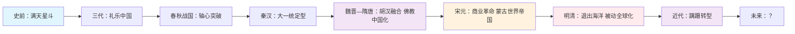

# 《万古江河：中国历史文化的转折与开展》读书笔记

> **作者**：许倬云（1930— ），中国台湾"中央研究院"院士，匹兹堡大学荣休教授  
> **出版**：2006年（繁体初版），2017年（简体增订版）  
> **体裁**：中国通史 / 历史文化比较

---

## 第一部分：总体归纳

### 全书核心框架速览

| # | 核心命题 | 核心观点 | ⭐ 重要性 |
|---|---------|---------|----------|
| 1 | **全球史视野下的中国** | 中国历史不是孤立演进的，而是始终在与外部世界的互动中形成、变化和发展 | ⭐⭐⭐⭐⭐ |
| 2 | **"万古江河"的隐喻** | 中国文化如长江大河，源头众多、汇聚成流、奔涌向前，而非单一源头的线性演进 | ⭐⭐⭐⭐⭐ |
| 3 | **"中国的中国→东亚的中国→世界的中国"** | 中国经历了三次自我定位的根本转变，每一次都重新定义了"何为中国" | ⭐⭐⭐⭐⭐ |
| 4 | **比较文明的方法论** | 每个历史阶段都与同期两河、埃及、希腊罗马、印度、伊斯兰、欧洲文明横向比较 | ⭐⭐⭐⭐ |
| 5 | **下层社会与日常生活** | 突破帝王将相叙事，关注普通人衣食住行、信仰习俗、经济活动 | ⭐⭐⭐⭐ |
| 6 | **文化融合而非单向传播** | 中国文化是多元融合的产物——胡汉交融、儒道释合流、中外互通 | ⭐⭐⭐⭐ |
| 7 | **长期结构性视角** | 从新石器时代到20世纪，以万年为尺度观察文明兴衰与结构变迁 | ⭐⭐⭐⭐⭐ |
| 8 | **开放则兴、封闭则衰的历史律** | 两千年证据反复验证：中国每一次辉煌都发生在开放时期，每一次衰落都与封闭同步 | ⭐⭐⭐⭐ |

### 全书结构总览

| 章节 | 时间范围 | 核心主题 | 中国的定位 |
|------|---------|---------|------------|
| 第一章 | 史前—公元前2000年 | 多元起源，"满天星斗" | 雏形孕育期 |
| 第二章 | 夏商周（三代） | 青铜礼器、宗法封建、天命转移 | 中国的中国（成形） |
| 第三章 | 春秋战国—秦汉 | 轴心突破、大一统、外儒内法 | 中国的中国（成熟） |
| 第四章 | 魏晋—隋唐 | 胡汉融合、佛教中国化、欧亚互动 | 东亚的中国 |
| 第五章 | 唐宋 | 平民社会、商业革命、技术与科举 | 东亚的中国（高峰） |
| 第六章 | 宋元 | 理学、蒙古帝国、海运与贸易 | 东亚的中国→世界的中国（过渡） |
| 第七章 | 明清 | 朝贡体系、白银全球化、闭关锁国 | 世界的中国（被动应对） |
| 第八章 | 19—20世纪 | 西力冲击、革命与转型 | 世界的中国（重建） |

---

## 第二部分：逐章详细总结

### 第一章：古代以前——中国地区考古略说

**核心论点**：中国文明的起源不是"中原中心、一元扩散"的单线叙事，而是"满天星斗"式的多元并存、长期互动、逐渐融合的过程。

**详细展开**：

许倬云开篇即颠覆了传统通史的"中原中心论"。他援引考古学成果——尤其是苏秉琦的"满天星斗说"——指出在新石器时代晚期（约公元前5000—前2000年），中国大地上并存着多个独立发展的文化区系：中原的仰韶文化、山东的大汶口—龙山文化、长江下游的良渚文化、辽西的红山文化、四川的三星堆（虽年代稍晚，但指向独立起源）等。这些文化区系各有自己的器物群、建筑形式、葬俗和社会结构，彼此之间的交流网络（玉石之路、贝币流通）远比传统叙事承认的更早、更密集。

许倬云特别强调了两个常被忽视的要点：

**第一，地理环境的多样性决定了文化多元性**。中国地形三级阶梯——青藏高原、第二阶梯的黄土高原/蒙古高原/云贵高原、第三阶梯的东部平原——造成了农业模式的根本差异：黄河流域的粟作农业、长江领域的稻作农业、北方草原的游牧模式。这三种生业模式之间的互补与冲突，构成了中国历史上农耕—游牧关系的主轴。许倬云指出，传统叙事把"中原农耕"等同于"中国"，本质上是把一半的中国历史排除在外。

**第二，"中国"作为一个文化概念，是长期融合的产物，不是原始基因**。许倬云用"滚雪球"比喻：最初各文化区系独立发展，然后在碰撞中互相吸纳（如良渚的玉琮制度被中原吸收，龙山时代的蛋壳陶技术传播至长江流域），最终在二里头（夏？）时期初步形成具有共同特征的"中国互动圈"。但这个"中国"仍然是文化意义上的，不是政治意义上的，更不是一个有清晰边界的"国家"。

本章的另一重要贡献是**把"为什么中国文明没有像古埃及、两河文明那样中断"这一老问题，转化为"中国文明是如何在连续中完成多次重构的"**。许倬云的答案：正是因为源头多元，才有足够的内部多样性来消化外部冲击，每一次"危机"都变成了"融合"的机会。这与欧洲文明"希腊→罗马→中世纪→现代"的断裂式演进形成鲜明对比。

**关键洞察**：

1. **"中原中心论"是政治叙事，不是考古事实**。如果你脑海里的中国历史始于"黄河中下游的夏朝"，你需要彻底重置认知框架——中国文明的"起点"不是一个点，而是一个多元并存的文化网络。
2. **地理决定生业，生业决定社会结构**。理解中国历史的第一把钥匙是地形图，不是帝王世系表。许倬云反复强调：不读懂三级阶梯，就读不懂中国的农耕—游牧关系、南北差异、统一与分裂的周期性。
3. **"连续性"不等于"一成不变"**。中国文明是唯一没有中断的古文明，但"没有中断"不等于"没有变化"——恰恰是因为它能够不断吸纳新元素（胡人、佛教、游牧技术），才维持了文化内核的连续性。这是"以变求不变"的高级生存策略。

**行动清单**：

- [ ] 找一幅"中国新石器时代文化遗址分布图"，对照三级阶梯地形图，建立空间感
- [ ] 阅读苏秉琦《中国文明起源新探》，深入理解"满天星斗说"的学术背景
- [ ] 下次有人跟你说"中华文明五千年一脉相承"，你可以问他：你说的"中华文明"是指哪个文化区系？

---

### 第二章：中国文化的黎明——夏、商、周

**核心论点**：从二里头（夏？）到西周，是中国文化"底层操作系统"的安装期——青铜礼器制度、宗法封建、天命观、农耕为本，这四根支柱在此期定型，影响中国三千年。

**详细展开**：

本章覆盖夏、商、周三代（约公元前2000—前771年），但许倬云的重心不在"王朝更替"的政治史，而在"中国文化基因"的形成机制。他用了大量篇幅讨论三个问题：

**第一个问题：二里头到底是夏还是商？** 许倬云采取了一种审慎但富有启发性的立场：二里头（偃师，河南）是"中国互动圈"首次出现政治—文化核心的考古证据，无论它叫"夏"还是"商"，它代表了"中原模式"的确立——以大型宫殿建筑、青铜礼器、玉器等级制度、有规划的城市布局为标志的"文明国家"形态。二里头的青铜冶铸技术（虽然器物以礼器为主，武器和工具较少）表明它已经掌握了资源动员和专业技术分工的能力，这是"国家"区别于"酋邦"的关键标志。

**第二个问题：商文明的"巫觋性格"是什么？** 许倬云花了相当篇幅分析商代甲骨卜辞和青铜器的宗教意义。商人的世界观是"上帝—祖先—活人"的三层沟通结构，商王通过占卜（甲骨）与祖先和上帝沟通，这种"绝地天通"的垄断权是王权合法性的核心。许倬云指出，这种"巫觋政治"在周代被"天命观"取代——周人不再靠"能通神"来论证统治合法性，而是靠"有德"才能"受天命"。这是中国文化从"宗教性"向"道德性"转型的关键一步，也是儒家"德治"思想的远源。

**第三个问题：封建与宗法如何塑造了中国人的社会关系？** 西周建立的"封建+宗法"双重结构，许倬云认为是中国文化最重要的制度创新之一。封建解决了"如何治理一个地缘辽阔的王朝"的问题（周天子—诸侯—卿大夫—士，层层分封）；宗法解决了"如何在没有公证处和户口本的时代确认血缘继承"的问题（嫡长子继承制、大小宗区分、丧服制度）。这两者合在一起，把"政治关系"和"血缘关系"完全叠合——你的政治地位取决于你的血缘位置，你的血缘位置决定了你的政治义务。这种"家国同构"的结构，许倬云指出，是中国人"集体主义"和"权威尊重"的文化根源，也是后来帝国时代"皇权—官僚"体制的心理基础。

本章最精彩的部分是对**西周青铜器"礼制化"**的分析。商代青铜器（如后母戊鼎）强调的是"通神"和"威慑"，器物形制多样、纹饰狞厉（饕餮纹）；西周青铜器则高度标准化（列鼎制度：天子九鼎、诸侯七鼎、大夫五鼎……），纹饰转向环带纹、窃曲纹等抽象几何图案，功能从"通神"转向"序伦"——用器物等级来固化社会等级。许倬云认为，这一转变深刻反映了周人"以德代力"的政治哲学：统治不靠吓唬人，靠建立一套所有人都认同的"礼"。

**关键洞察**：

1. **"天命观"是中国文化最伟大的思想发明**。它把政治合法性从"血统"（商王是神的后代）转移到"道德"（周人有德才能受天命，失德就会失天命）。这是中国历史上第一次出现"统治者可以被替换"的理论——为后来的"汤武革命论"和儒家的"民本思想"埋下了伏笔。
2. **封建≠分封，宗法≠父系社会**。西周的封建是"授民授疆土"的武装殖民，宗法是"用血缘关系来运行国家机器"——这两者合在一起，使得中国在公元前1000年就完成了"国家与社会"的深度整合，比欧洲早了将近两千年。
3. **青铜礼器是中国的"宪法"**。在文字不普及、法律不成文的年代，鼎簋觚爵这些器物的组合、数量、形制，就是"谁是什么等级、能做什么、不能做什么"的明文规定。读懂青铜礼器，就读懂了西周的"宪法"。

**行动清单**：

- [ ] 如果有机会参观国家博物馆或上博，重点看二里头出土的青铜爵、商代后母戊鼎、西周列鼎，感受从"通神"到"序伦"的器物变化
- [ ] 读《左传》"僖公二十四年"富辰谏周襄王一段话，理解宗法封建在春秋时代人眼中的意义
- [ ] 思考一个问题：今天中国人的"家国情怀"和"尊卑有序"观念，能否追溯到西周宗法封建？

---

### 第三章：中国的中国——春秋、战国与秦汉的转变

**核心论点**：公元前771—前221年的"轴心时代"突破，奠定了中国文化的思想底层；秦始皇的统一和汉武帝的"外儒内法"，完成了从"封建"到"郡县"的制度转型，从此"中国"不再是一个文化圈，而是一个政治实体。

**详细展开**：

这是全书最重头的一章，许倬云用极其雄辩的笔触，把春秋战国到秦汉的六百年，描述为"中国文化的轴心突破期"——几乎在同一时期（公元前6—前3世纪），希腊出现了苏格拉底—柏拉图—亚里士多德，以色列出现了犹太先知，印度出现了佛陀，中国出现了孔子—老子—墨子—孟子—荀子—韩非子。雅斯贝尔斯称之为"轴心时代"——人类首次以理性反思的方式，系统性地回答"人应该如何生活""社会应该如何组织""政治应该如何运行"。

许倬云重点关注了**三个结构性转变**：

**第一个转变：从"封建礼乐"到"诸子争鸣"的思想突破**。西周封建宗法制度在春秋时期（前771—前453年）逐渐解体——铁器普及导致生产力上升，诸侯国内部出现了超越血缘关系的"官僚化"倾向（如郡县制雏形、成文法公布、私田取代井田）；外部则表现为诸侯争霸、"礼乐征伐自诸侯出"。这种"旧秩序解体、新秩序未立"的真空期，恰恰为思想突破提供了土壤。许倬云特别强调：诸子百家的出现，不是几个天才人物灵光一现，而是"士"这个新兴社会群体（脱离了血缘束缚、靠知识和才能吃饭的专业人士）在寻找"天下大乱怎么办"的答案。儒家给出了"回到周礼+以德治国"的方案，道家给出了"无为而治+小国寡民"的方案，墨家给出了"兼爱非攻+实用技术"的方案，法家给出了"严刑峻法+中央集权"的方案——这些方案之间的辩论和竞争，构成了中国政治思想的基本问题域，直到今天仍然没有完全解决。

**第二个转变：从"封建"到"郡县"的国家形态重构**。秦始皇统一六国（前221年）不只是"灭了六个国家"，而是彻底废除了运行了数百年的封建宗法制度，建立了一个全新的政治架构：郡县制（中央直接任命地方官，无世袭）、三公九卿制（官僚分工）、统一度量衡和文字、驰道和直道（基础设施一体化）。许倬云指出，秦始皇的真正创新不在于"统一"（战国中期趋势已定），而在于"如何用非血缘的、专业化的官僚体系来运行一个超大型国家"——这是人类历史上第一个成功的"现代国家"原型，比欧洲绝对主义王权早了1800年。但秦制的致命缺陷是"只有暴力，没有合法性叙述"——它用"法"来代替"礼"，但法家只解决了"如何统治"，没有解决"凭什么你可以统治"。这个合法性空缺，被汉代儒家补上了。

**第三个转变：汉武帝的"外儒内法"——中国政治的终极模板**。许倬云用"外儒内法"四个字概括了汉武帝时期（前141—前87年在位）的政治架构：表面上是"独尊儒术"——用儒家经典来论证皇权的合法性（天子是"天子"，统治依据是"天命"，但天命的条件是"有德"，而"德"的标准由儒家解释）；实际上是"法家内核"——中央集权、严刑峻法、郡县体制、官僚考核，这些都是法家的遗产。这种"儒家提供合法性叙述+法家提供统治技术"的组合，许倬云认为是中国两千年帝制的"操作系统"，直到1905年科举废除才真正开始松动。

本章的另一大亮点是**对秦汉"平民社会"兴起的分析**。许倬云指出，封建宗法制度解体后，原来的"血缘—身份"绑定被打碎，社会流动性大幅增加——战国四公子（孟尝君、平原君、信陵君、春申君）的门客中有大量"布衣"（平民），秦汉的军功爵制更是让普通士兵可以通过战场上的表现获得社会地位和土地。这种"平民社会"的出现，许倬云认为是中国能够维持大一统的重要社会基础——当所有人都有可能"上升"时，人们对"中央政权"的认同度就会提高，分裂的动机会减弱。这与欧洲的封建等级社会（贵族—僧侣—农奴，几乎没有流动性）形成了鲜明对比。

**关键洞察**：

1. **"轴心突破"不是偶然的**。当旧秩序解体、新兴士人阶层崛起、各诸侯国竞相招揽人才这三者同时出现时，思想大爆发是必然的。今天的中国是否在经历第二次"轴心突破"？值得深思。
2. **秦始皇被严重低估了**。他不只是"统一了六国"，而是发明了"现代国家"的基本架构——官僚制、郡县制、标准化、基础设施建设。西方学者（如福山）认为秦始皇是中国政治制度的真正奠基人，这个结论比"暴君"的标签准确得多。
3. **"外儒内法"是中国政治的最高智慧**。它解决了"合法性"和"有效性"的双重问题——儒家让统治看起来"正当"，法家让统治真正"有效"。理解了中国政治的"外儒内法"结构，就理解了两千年的中国政治史。

**行动清单**：

- [ ] 重读《论语》和《韩非子》各选章，体会"儒家说什么"和"法家说什么"之间的张力
- [ ] 找一幅"秦朝三十六郡图"，感受第一个大一统帝国的疆域概念
- [ ] 思考：今天的"依法治国"和"以德治国"并提，是否有"外儒内法"的影子？

---

### 第四章：东亚的中国——魏晋到隋唐

**核心论点**：魏晋到隋唐（公元220—907年）是中国历史上最剧烈的"外来冲击—内部重组"周期——五胡乱华带来了深刻的胡汉融合，佛教中国化完成了精神世界的重构，隋唐帝国在吸收了游牧民族军事活力和佛教精神资源后，建立了当时世界上最有活力的文明体。

**详细展开**：

这一章覆盖了近七百年的历史，许倬云的叙述线索非常清晰：**"中国"在这段时间里，从"汉人中国"变成了"东亚中国"**——文化边界扩大了，血统混合了，宗教多元了，国际地位上升了。

**第一部分：魏晋南北朝的"大熔炉"（220—589年）**。

许倬云花了大量笔墨描述"五胡乱华"的真实含义。传统汉人叙事把这段历史描述为"汉文明的差点断绝"，但许倬云完全翻转了这个视角——他认为五胡入主中原，实际上是"中国"这个概念的一次大规模扩容：

- **血统层面**：匈奴、鲜卑、羯、氐、羌五个主要游牧族群大规模迁入中原，与汉人通婚融合。到北魏孝文帝改革（484年）时，"汉化"已经是不可逆转的趋势——鲜卑贵族改汉姓、穿汉服、说汉语、与汉人通婚。许倬云指出，今天中国北方人的基因里，至少有30—40%的游牧民族成分——"纯种汉人"在生物学意义上是不存在的。
- **制度层面**：游牧民族的"部落兵制"（兵民合一、部族作战）被北魏—北周—隋—唐一路继承下来，演变为著名的"府兵制"——这是唐代军事强大的根本原因。同时，游牧民族的"可汗"观念（最高领袖不靠血统靠能力）也部分瓦解了汉人的"嫡长子继承制"迷信——唐太宗李世民、武则天，都是这个"能力导向"逻辑的受益者。
- **文化层面**：许倬云特别强调了"北朝文化"对隋唐的影响——北朝的石窟艺术（云冈、龙门、敦煌）、北朝的律令格式（唐律的直接源头）、北朝的均田制（北魏孝文帝推行，唐代完善），都是从"胡人中国"传给"汉人中国"的遗产。

**第二部分：佛教的中国化——中国精神世界的重构**。

许倬云认为，佛教传入中国（约公元1世纪）并完成中国化（约公元10世纪），是中国文化史上仅次于"轴心突破"的第二次思想大革命。他重点分析了**佛教如何改变中国人的精神世界**：

- **来世与轮回观念的引入**：中国传统思想（儒道）基本上只关注"此世"——儒家讲"修身齐家治国平天下"，都是现世的事；道家讲"长生久视"，也是现世的延长。佛教带来了"三世"（过去、现在、未来）和"六道轮回"的观念，第一次给了中国人一个完整的"生死观"和"道德报应论"——你这辈子的遭遇是前世造的业，你这辈子的行为决定下辈子的去向。这种观念与儒家的"祖先崇拜"和"现世伦理"激烈碰撞，最终融合成中国特色的"孝道佛教"（地藏菩萨"地狱不空，誓不成佛"就是典型的中国化表达）。
- **寺院经济与印刷术**：许倬云特别指出，佛教寺院是中古时期中国最重要的"知识生产中心"——抄经、译经、藏书、教育（寺院办学校）、医疗（寺院办医院）、慈善（寺院办救济）。更重要的是，为了大规模复制佛经，中国人发明了雕版印刷术（唐代中期）——这直接催生了后来的科举考试标准化、儒家经典普及化、宋明理学的"书籍革命"。
- **禅宗的革命性**：许倬云认为禅宗是"佛教中国化"的最高成就——它把印度佛教的"繁琐哲学"和"偶像崇拜"全部抛弃，主张"明心见性、顿悟成佛"，"挑水砍柴，无非妙道"。这种极端简化的修行方式，使得佛教真正走进了普通中国人的精神世界，也为后来宋明理学"消化吸收"佛教资源提供了接口。

**第三部分：隋唐帝国的"世界主义"**。

许倬云用"东亚的中国"来形容隋唐（581—907年）——这不仅仅是一个强大的中国王朝，而是一个以中国为中心、辐射整个东亚的国际秩序：

- **长安是当时的世界首都**：许倬云描述了一座令人震撼的国际化都市——人口超过100万（同时期君士坦丁堡约50万、巴格达约30万），居民中有突厥人、回鹘人、粟特人、波斯人、日本人、朝鲜人、印度人、阿拉伯人；街道上有景教（基督教聂斯脱利派）教堂、祆教（琐罗亚斯德教）寺庙、清真寺、佛教寺院并存；西市的胡姬酒肆里，你可以听到粟特语、波斯语、日语、朝鲜语混杂交谈。这种"世界主义"的程度，直到1000年后的大航海时代才在欧洲重现。
- **朝贡体系 vs. 殖民主义**：许倬云特别强调，唐代的"东亚秩序"不是欧洲式的殖民主义——它没有在朝鲜、日本、越南派驻总督，没有掠夺当地资源，而是通过"朝贡—册封"的礼仪性交换，建立了一个以中国为中心的"文化—经济圈"。从这个意义上说，唐代的"东亚中国"更像是一个"文化超级大国"，而不是"领土帝国"。

**关键洞察**：

1. **"五胡乱华"是中国文明的"升级补丁"，不是"病毒"**。没有游牧民族的军事制度、血缘混合、文化输入，隋唐不可能那么强大。今天讨论"中华民族"时，必须承认：这个"中华民族"从基因到文化，都是胡汉融合的产物。
2. **佛教改变了中国人的"时间观"和"生死观"**。在佛教传入之前，中国人的时间是循环的（朝代更替），生死是断裂的（人死如灯灭，靠子孙祭祀维持存在）。佛教带来了线性时间（因果报应、三世轮回）和连续生死（轮回转世），这深刻影响了中国的文学、艺术、民间信仰，甚至语言表达（"缘分""报应""轮回"这些词都是佛教带给中国的）。
3. **隋唐的"世界主义"是中国历史上唯一一次真正的"全球化"**。长安的国际化程度，直到今天的中国也没有完全重现。这提示我们："开放"不是舶来品，而是中国历史最辉煌时期的常态。

**行动清单**：

- [ ] 如果有机会，去洛阳龙门石窟和敦煌莫高窟，亲眼看看佛教中国化的视觉证据
- [ ] 读《大唐西域记》（玄奘口述，辩机整理），感受唐代中国人的"世界视野"
- [ ] 思考：如果今天的中国要重建"世界主义"的文化吸引力，应该从隋唐吸取什么经验？

---

### 第五章：亚洲的中国——宋、辽、金、西夏与元的多元帝国

**核心论点**：从唐宋过渡（约907—960年）到元朝统一（1279年），中国经历了从"东亚的中国"向"亚洲的中国"的转型——宋代的商业革命和技术创新使中国成为当时世界上最富裕、最先进的经济体；蒙古帝国的建立则第一次把中国纳入了一个横跨欧亚的世界帝国，中国的"世界性"达到了前所未有的高度。

**详细展开**：

这一章的叙事跨度约370年，许倬云把它划分为两个截然不同的子时期：**宋代的中国（960—1279年）**和**蒙古帝国时代的中国（1271—1368年）**。这两个时期的中国，一个偏安南方、经济文化高度发达；一个横跨欧亚、军事政治极度扩张——但它们共同构成了"亚洲的中国"这个历史定位。

**第一部分：宋代——中国的"早期现代化"时期**。

许倬云对宋代的评价极高，他认为宋代（尤其是北宋，960—1127年）是中国最接近"早期现代化"的历史时期——如果不是蒙古入侵打断了这一进程，中国可能会以完全不同的路径进入近代世界。他给出了四个关键证据：

**① 商业革命与城市化**：宋代是中国历史上第一个"商业驱动"的朝代——打破了对市场（市）的时间和空间限制（唐代市场只能在"市"内、日落前交易；宋代取消了这些限制，出现了夜市、瓦舍、商铺沿街开设的格局）。城市化率达到了历史峰值——北宋汴京（开封）人口超过130万，南宋临安（杭州）人口超过150万，都是当时世界上最大的城市。许倬云特别指出，宋代的"镇"不再是军事据点，而是商业集散地——这是中国"市镇经济"的真正起源。

**② 技术创新的爆发**：许倬云列举了一长串宋代的技术突破——活字印刷（毕昇，1040年代）、火药武器化（北宋末期已用于战争）、指南针用于航海（南宋）、水运仪象台（苏颂，1088年，世界上第一座水力天文钟）、焦炭炼铁（宋代钢铁产量估计为每年15万吨，是英国工业革命前全球铁产量的三倍）。这些技术突破的背后，是"知识生产—技术创新—商业应用"链条的形成——活字印刷降低了书籍成本，书籍普及提高了识字率，识字率提高扩大了技术人才的供给，这是一个正向循环。

**③ 科举制度的成熟与平民社会的确立**：宋代是科举制度真正走向公平、开放、规模化的时期——王安石变法（1069—1076年）期间，科举取消了"门第限制"，任何人（理论上）都可以通过考试进入官僚体系。许倬云指出，宋代的"平民社会"比欧洲早了约600年（欧洲直到工业革命后才真正打破贵族垄断）。这带来了两个深远影响：一是社会流动性大增，"朝为田舍郎，暮登天子堂"成为现实；二是"士大夫精神"的形成——这些通过考试上来的平民出身的官员，对国家有强烈的认同感（因为他们的人生完全依赖于这个制度），这构成了后来中国"士大夫治国"传统的核心。

**④ 理学的思想革命**：朱熹（1130—1200年）集大成的理学，许倬云认为是中国思想史上的第三次大突破（前两次是轴心时代的诸子百家和佛教中国化）。理学的核心贡献是**把儒家从"政治意识形态"提升为"完整的宇宙论—伦理学体系"**——它用"理—气—性—命"的形而上学框架，解释了"人为何有道德""宇宙如何运行""政治秩序如何与自然秩序对应"等根本问题。许倬云特别指出，理学后来被批评为"束缚人性"，但它的原始动机是极其革命性的——它主张"人人皆可为尧舜"（道德潜力人人平等），"格物致知"（通过研究自然来认识道德真理）——这与欧洲启蒙运动的"理性—平等—进步"理念有惊人的相似之处，只是它出现的时间比欧洲早了500年。

**第二部分：蒙古帝国——中国的"世界时刻"**。

许倬云对元朝（1271—1368年）的叙述，采取了与汉族中心主义叙事完全不同的视角——他把元朝定义为**中国第一次（也是唯一一次）成为"世界帝国"核心的时期**。

- **横跨欧亚的和平**：蒙古帝国在巅峰时期（约1290年代）覆盖了从朝鲜半岛到波兰、从西伯利亚到埃及的广阔疆域，建立了人类历史上连续的陆地帝国。许倬云特别强调"Pax Mongolica"（蒙古和平）——因为整个欧亚大陆都在蒙古控制之下，丝绸之路重新开通，安全性大幅提高，商队可以从威尼斯一直走到元大都（北京）。马可·波罗（1254—1324年）之所以能来到中国并在中国生活17年，正是因为"蒙古和平"提供了前所未有的旅行安全。
- **中国的"全球化"**：许倬云指出，元朝是中国历史上最"国际化"的朝代——色目人（中亚、西亚人）在元朝政府中担任要职（如波斯人在天文历法机构、阿拉伯人在军事工业）；大都（北京）和泉州（当时世界最大的港口）有大量外国居民；基督教（景教和天主教）、伊斯兰教、犹太教、琐罗亚斯德教在中国自由传播；中国的四大发明（造纸、印刷、火药、指南针）通过阿拉伯人传到了欧洲，直接催生了欧洲文艺复兴和地理大发现。
- **但是……**：许倬云也毫不避讳地指出元朝的黑暗面——种族等级制度（蒙古人→色目人→汉人→南人）、科举中断（1315年才恢复，且录取名额极少）、儒士地位下降（"九儒十丐"）。这种"国际化"是以牺牲汉文化的主导地位为代价的——许倬云认为，这正是为什么元朝只维持了97年就灭亡了：它始终没有解决"如何让一个游牧帝国有效治理一个农耕文明"这个问题。

**关键洞察**：

1. **宋代是中国最接近"自发进入近代"的历史时期**。商业革命、技术创新、平民社会、理性精神——这些"现代化"的要素在宋代都已经出现，只是被蒙古入侵打断了。这提示我们："现代化"不是欧洲人的专利，中国有自己的"早期现代化"路径。
2. **蒙古帝国是中国的"世界史时刻"**。在此之前，中国虽然是东亚大国，但与欧洲、伊斯兰世界基本隔绝；在此之后，中国真正进入了"世界历史"的叙事。没有蒙古帝国，马可·波罗不会来中国，四大发明不会传到欧洲，世界历史的进程可能会完全不同。
3. **"国际化"不等于"文化融合"**。元朝虽然极度国际化，但蒙古统治者始终没有真正融入汉文化——他们保持了自己的语言、习俗、宗教信仰，把汉人当作"被统治者"而不是"同胞"。这种"国际化而不融合"的模式，许倬云认为是一个重要的历史教训——真正的"世界主义"必须建立在文化相互尊重的基础上。

**行动清单**：

- [ ] 读《梦溪笔谈》（沈括）或《天工开物》（宋应星，虽是明代但记录了很多宋代技术），感受宋代的技术创新精神
- [ ] 找一幅"蒙古帝国极盛时期疆域图"，直观感受"世界帝国"的规模
- [ ] 思考：如果蒙古帝国没有灭亡，世界历史会如何演进？中国会成为全球秩序的天然领导者吗？

---

### 第六章：进入世界体系——明、清的反应与挫折

**核心论点**：明清时期（1368—1911年）是中国从"亚洲的中国"转向"世界的中国"的关键过渡期——明代前期（永乐年间）还有能力主动走向世界（郑和下西洋），但宣德年间突然"退出海洋"；清代则在"康乾盛世"的表象下，错过了第一次工业革命，最终在鸦片战争中被迫以最痛苦的方式进入世界体系。

**详细展开**：

这是全书最具反思性的一章。许倬云以极其沉重的笔触，描述了中国在明清两代如何**主动放弃了成为世界领导者的机会**，然后又**被动地、屈辱地被迫融入世界体系**。他把这个五百年分为三个节点来叙述：

**第一个节点：郑和下西洋（1405—1433年）——中国"退出世界"的时刻**。

许倬云用了整整一节来讨论这个中国历史最大的"如果"——如果明代没有在1433年（宣德八年）终止下西洋，世界历史会如何改写？

- **郑和做了什么**：在28年里，郑和七次下西洋，率领当时世界上最庞大的舰队（最大的宝船长44丈、宽18丈，约合137米×56米，排水量估计超过8000吨；整个舰队有200多艘船、2.7万人），到达了东南亚、印度洋、阿拉伯半岛、东非海岸。与后来欧洲人的"地理大发现"相比，郑和比哥伦布（1492年）早了87年，比达·伽马（1498年）早了93年，舰队规模是哥伦布舰队的上百倍。
- **为什么终止**：许倬云分析了三种主流解释——①财政负担说（下西洋耗资巨大，国库不堪重负）；②倭寇威胁说（东南沿海倭寇猖獗，需要把资源用于海防）；③儒家意识形态说（儒家士大夫认为"奇技淫巧"和"海外扩张"不符合"王道"，中国应该专注于内部治理，而不是对外掠夺）。许倬云认为第三种解释最深刻——它反映了中国文明的一个深层缺陷：**缺乏"扩张性"的意识形态**。欧洲人的扩张有基督教传教和金银掠夺的双重动力；中国人对"朝贡体系"之外的世界根本不感兴趣。
- **后果**：1433年之后，明朝不仅终止了下西洋，还实行了"海禁"政策（片板不许下海）——这直接导致了中国海洋能力的退化、东南沿海走私贸易的泛滥（倭寇的本质是"海禁逼出来的走私集团"）、以及后来欧洲人来到东亚时，中国已经完全没有海上力量来保护自己。许倬云说了一句非常沉重的话："**1433年，中国主动退出了正在形成的世界体系；450年后，世界体系以炮舰的方式强行把中国拉了回来——这就是鸦片战争的深层历史逻辑。**"

**第二个节点：白银全球化与明代的"被动现代化"**。

许倬云指出，虽然明代在政治上"闭关锁国"，但在经济上却被动地融入了正在形成的全球贸易体系——关键在于**白银**。

- **明代的"白银化"**：明初用纸币（宝钞）和铜钱，但纸币很快贬值崩溃，铜钱供给不足。到明代中期（约1500年后），中国经济越来越依赖白银作为货币——而中国自己不产白银，全部需要进口。这就把中国卷入了一个正在形成的"全球白银循环"：西班牙人在美洲（秘鲁、墨西哥）开采白银 → 运到马尼拉 → 中国商人用丝绸、瓷器、茶叶交换白银 → 白银流入中国 → 中国成为世界白银的"黑洞"（估计全球约1/3—1/2的白银在明代流入了中国）。
- **全球联系的建立**：许倬云特别强调，虽然明代官方实行"海禁"，但民间贸易网络已经把中国、东南亚、日本、印度、伊斯兰世界、欧洲（通过马尼拉大帆船贸易）连接成了一个整体。利玛窦（Matteo Ricci，1552—1610年）之所以能进入中国并在中国传教成功，正是因为"白银全球化"带来的中欧经济联系——他被中国人需要的，不是他的宗教，而是他带来的"西学"（天文、数学、地理、火炮技术）。
- **但是……**：这种"被动现代化"是非常脆弱的——它建立在白银进口的基础上，而白银进口依赖于全球贸易体系的稳定。当17世纪中期全球白银供给减少（西班牙在美洲的银矿产量下降）、小冰期导致农业歉收、明朝政府财政破产时，明帝国就崩溃了（1644年）。许倬云认为，明代的灭亡不是简单的"农民起义"或"满清入关"，而是**全球第一次系统性危机（17世纪危机）在中国的一个表现**——这再次证明：从明代开始，中国已经不可能"独善其身"了。

**第三个节点：清朝的"停滞的盛世"**。

许倬云对清代（1644—1911年）的评价极为复杂——他认为"康乾盛世"（1681—1796年）是中国传统社会的"最后辉煌"，但也正是这个"盛世"，让中国错过了最关键的转型窗口。

- **"康乾盛世"的成就**：领土扩张（平定准噶尔、收复台湾、征服西藏、将新疆纳入直接管辖）、人口增长（从约1亿增加到约4亿）、农业生产率提高（美洲作物——玉米、番薯、马铃薯——的引进）、文化整理（《四库全书》）。
- **"康乾盛世"的代价**：许倬云用了一个尖锐的对比——**同一时期（18世纪），欧洲正在经历启蒙运动、科学革命、工业革命、美国独立、法国大革命；而中国正在经历文字狱、闭关锁国、重农抑商、科举僵化**。乾隆皇帝（1711—1799年）在1793年接待英国马戛尔尼使团时，骄傲地告诉英国人："天朝物产丰盈，无所不有，原不藉外夷货物以通有无"——这句话被许倬云称为"中国历史上最昂贵的一句话"，因为它完美概括了中国统治者在最关键的历史转折点上表现出的无知和傲慢。
- **为什么没有工业革命**：许倬云讨论了著名的"Needham Question"（李约瑟难题）——为什么科学革命和工业革命发生在欧洲，而不是中国？他给出了一个综合答案：① 中国的"大一统"体制过于稳定，缺乏欧洲那种"国家间竞争"带来的创新压力；② 科举制度把最聪明的大脑都吸引到了"做官"这个赛道上，而不是"搞科研"或"办企业"；③ 清代的"重农抑商"政策和行会制度，严重压抑了商业资本向产业资本的转化；④ 最重要的——**清代没有"扩张性"的意识形态，也没有"进步"的观念**。欧洲人有"进步"观念（未来比过去好，人类可以控制自然），中国人没有——中国文化本质上是"循环时间观"（朝代更替、治乱循环），没有"历史是线性进步"的概念。

**关键洞察**：

1. **1433年是中国历史的"最大转折点"**。——如果郑和下西洋没有终止，中国可能会建立人类历史上第一个真正的"海洋帝国"，世界体系会以中国为中心展开，后来的鸦片战争根本不会发生。但这个"如果"没有发生——因为中国的文化基因里缺乏"扩张"和"进步"的观念。
2. **"闭关锁国"不是防御策略，而是认知缺陷**。——明清的统治者不是"故意"闭关锁国，他们是真的觉得外界不值得关注。"天朝上国"心态的本质，是一种深刻的认知局限——你不知道你不知道的东西。
3. **"李约瑟难题"的真正答案**：不是"中国人不聪明"，而是"中国的制度和文化不鼓励创新"。——当最聪明的人都在读四书五经考科举，而不是做实验、办企业、搞发明时，科学革命不可能发生。

**行动清单**：

- [ ] 读《万历十五年》（黄仁宇），理解明代政治体制的深层缺陷
- [ ] 找一幅"1430年的世界"地图（郑和最后一次下西洋的时间），对比当时中国与欧洲的技术和海军力量，感受"历史的遗憾"
- [ ] 思考：今天的中国已经重新融入世界体系，我们是否克服了"天朝上国"的认知缺陷？

---

### 第七章：百年蹒跚——中国近代的挫折与转型

**核心论点**：从鸦片战争（1840年）到20世纪末，中国经历了一百五十年的"蹒跚"——不是匀速的"进步"，而是反复的挫折、试错、失败、再出发。许倬云把这段历史描述为"一个古老文明如何学会做一个现代国家"的艰难过程，核心命题是：**中国如何既保持文化连续性，又完成现代性转型？**

**详细展开**：

这是全书最后一章，也是情感浓度最高的一章。许倬云以一位经历了中国现代转型全程的知识分子的深沉目光，梳理了从鸦片战争到20世纪末的中国近代史。他的叙述线索不是"政治事件编年"，而是**"中国如何应对西方冲击"的四种反应模式**：

**第一种反应模式："器物层面的应对"（1860年代—1890年代）——洋务运动**。

- **背景**：第二次鸦片战争（1856—1860年）后，清廷中的有识之士（奕䜣、曾国藩、李鸿章、左宗棠、张之洞）认识到"西人长技"不仅在于"船坚炮利"，还在于工业制造能力。于是发起"洋务运动"——开办军工企业（江南制造局、福州船政局）、建立新式海军（北洋水师）、派遣留学生（容闳带领的"幼童留美"计划）。
- **为什么失败**：许倬云指出，洋务运动失败的根本原因，不是"技术不够先进"，而是"制度不匹配"——你可以在封建帝制下造出先进的军舰，但你无法在封建帝制下建立一支现代化的海军（北洋水师的指挥官是满洲贵族，不是专业军人；经费被慈禧太后挪去修颐和园；舰队之间互不配合）。1894—1895年的中日甲午战争，北洋水师全军覆没，标志着"器物层面改革"的彻底失败。
- **深刻教训**："中学为体，西学为用"的模式行不通——你可以买来西方的枪炮，但买不来产生枪炮的制度和思想。这是中国近代化第一课。

**第二种反应模式："制度层面的应对"（1898年—1911年）——戊戌变法与辛亥革命**。

- **戊戌变法（1898年）**：甲午战败后，光绪皇帝在康有为、梁启超推动下，尝试进行政治制度改革——开国会、立宪法、废八股、练新军、办新式学堂。但变法只持续了103天（"百日维新"），就被慈禧太后发动的戊戌政变镇压了。许倬云认为，戊戌变法的失败不是"保守派太强大"，而是**改革派对自己的力量估计过高、对改革的复杂性估计不足**——他们试图在一个绝对君主制国家里，用一道道圣旨来完成宪政转型，这本身就是一个不可能的任务。
- **辛亥革命（1911年）**：戊戌变法失败后，革命派（孙中山、黄兴等人）认识到"改良"行不通，必须"革命"。1911年10月10日武昌起义爆发，1912年1月1日中华民国成立，2月12日溥仪退位——中国两千多年的帝制就此终结。但许倬云指出，辛亥革命只完成了"推翻帝制"这个negative task（否定性任务），没有完成"建立现代国家"这个positive task（肯定性任务）——辛亥革命后，中国陷入了军阀割据（1916—1928年）、国民党一党专政（1928—1949年）、抗日战争（1937—1945年）的连续动荡，始终没有建立起一个稳定、有效、有合法性的现代国家。

**第三种反应模式："文化层面的应对"（1915年—1920年代）——新文化运动**。

- **背景**：辛亥革命后，中国的政治转型一再失败，知识分子开始反思：是不是中国文化本身有问题？1915年，陈独秀创办《新青年》杂志，发起"新文化运动"——口号是"民主"与"科学"（德先生与赛先生），目标是"打倒孔家店"（批判儒家伦理）、提倡白话文（让文化走向大众）、倡导个性解放（反对封建礼教）。
- **贡献与代价**：许倬云认为，新文化运动是中国现代转型中最深刻的一次"自我批判"——它把中国的问题从"技术问题""制度问题"提升到了"文化问题"的高度：中国的落后，不仅仅是因为没有坚船利炮或宪政制度，而是因为中国的文化基因里缺乏"科学精神"和"民主意识"。但新文化运动的代价也是巨大的——它造成了"传统中断"和"文化虚无主义"，使得好几代中国人对自己的文化产生了深刻的自我怀疑。这种自我怀疑，许倬云指出，直到今天也没有完全愈合。

**第四种反应模式："综合重建"（1949年至今）——中华人民共和国的国家建设**。

许倬云在这里采取了极其审慎的叙述方式——他毕竟是"中国台湾'中央研究院'院士"，对1949年后的中国大陆叙述必须兼顾学术严谨和政治敏感。但他的核心观点是清晰的：**1949年中华人民共和国的成立，标志着中国现代国家建设的"第三阶段"——在经历了洋务运动（器物）、戊戌—辛亥（制度）、新文化运动（文化）的三重失败后，中国共产党通过武装革命和土地改革，完成了"社会动员"这个中国现代转型的最关键任务**。

- **土地改革的意义**：许倬云认为，土地改革（1950—1952年）是中国现代转型中最重要的一步——它彻底摧毁了延续两千多年的地主—佃农关系，把农民从"依附性臣民"变成了"国家的平等成员"。这为后来的工业化提供了两个关键条件：一是农业剩余可以由国家直接调配（不再经过地主阶层），二是农民获得了平等的土地权利，对国家产生了强烈的认同感。
- **工业化的成就与代价**：许倬云承认，1949年后中国的工业化取得了巨大成就（建立了完整的工业体系、拥有了核武器、发射了人造卫星），但代价也是巨大的——大跃进（1958—1960年）导致的大饥荒、文化大革命的十年动荡，都是"激进现代化"的惨痛教训。
- **改革开放（1978年至今）**：许倬云认为，邓小平的改革开放是中国现代转型的"第四次尝试"——它结合了"市场机制"和"国家能力"，在保持政治稳定的前提下，实现了人类历史上最大规模的减贫和经济增长。但许倬云也指出，改革开放带来的新问题（贫富差距、环境污染、腐败、价值真空）还没有得到很好的解决——中国的现代转型，还没有完成。

**许倬云的最终判断**：

> "这一百五十年，中国是在蹒跚中前行的。我们打破了旧秩序，但还没有完全建立新秩序；我们学会了制造现代武器，但还没有完全学会如何与现代世界相处；我们恢复了经济活力，但还没有完全找到文化自信。中国的现代转型，是一项尚未完成的事业。"

**关键洞察**：

1. **"冲击—反应"模式不是全部真相**。——中国对西方冲击的反应，不是简单的"被动应对"，而是有主动探索、有试错、有创造性转化的复杂过程。理解中国近代史，不能只用"屈辱—反抗"的二元框架。
2. **"现代转型"是整体性的，不能只改一部分**。——洋务运动只改器物、戊戌变法只改制度、新文化运动只改文化，都失败了。真正的现代转型必须是"器物—制度—文化"的三位一体改革。
3. **中国的现代转型还没有完成**。——经济崛起不等于现代化完成。当中国解决了"挨打"和"挨饿"的问题后，"挨骂"（文化软实力不足、价值吸引力不够）的问题还没有解决。这是今天中国面临的核心挑战。

**行动清单**：

- [ ] 重读蒋廷黻《中国近代史》或徐中约《中国近代史》，建立更系统的近代史框架
- [ ] 思考：你自己的生活，哪些地方是"传统中国的遗产"，哪些地方是"现代转型的产物"？
- [ ] 讨论：中国的现代转型，还需要多长时间才能完成？下一阶段的重点任务是什么？

---

## 第三部分：核心思想体系

### 一、哲学三层次结构

许倬云在《万古江河》中展开的历史观，可以结构化地归纳为三个层次：

```mermaid
graph TD
    A[第一层：事实层<br/>"发生了什么？"] --> B[第二层：解释层<br/>"为什么发生？"]
    B --> C[第三层：意义层<br/>"这对今天意味着什么？"]
    
    A1[多元起源的考古事实] --> A
    A2[胡汉融合的民族事实] --> A
    A3[开放—封闭的周期性事实] --> A
    
    B1[地理决定论：三级阶梯] --> B
    B2[文明互动论：融合而非传播] --> B
    B3[制度演化论：秦汉模式] --> B
    
    C1[对中国的意义：开放则兴] --> C
    C2[对世界的意义：中国经验] --> C
    C3[对个人的意义：大历史视野] --> C
```

**第一层（事实层）**：许倬云花了最大篇幅建立的，是一套"反常识"的事实体系——中国文明不是一元起源的（满天星斗），中国文化不是纯农耕的（胡汉融合），中国历史上不是一直封闭的（唐宋元的世界主义）。这些事实，是理解全书的基础。

**第二层（解释层）**：在事实之上，许倬云提供了一套解释框架——地理决定生业模式，生业模式决定社会结构；文明之间的互动（融合、冲突、吸收）是历史演进的主要动力；制度的演化有路径依赖性（秦汉模式决定了后来两千年的政治结构）。这套解释框架，使得零散的历史事实变成了一个有逻辑的整体。

**第三层（意义层）**：这是全书最有现实关怀的部分——许倬云写《万古江河》不是为了"讲历史"，而是为了回答"今天的中国应该如何自处"这个问题。他的答案是：回归"万古江河"的开放传统，既不要妄自菲薄（我们有灿烂的文明），也不要妄自尊大（我们的文明是在与世界互动中形成的）。

---

### 二、决策检查清单：如何用"万古江河"的框架分析历史问题

当你面对一个中国历史相关的问题时，可以用以下10个问题来检验你的分析是否全面：

| # | 检查项 | 关键问题 | 常见错误 |
|---|-------|---------|---------|
| 1 | **地理视角** | 这个问题是否与中国的三级阶梯地形有关？ | 只关注政治事件，忽略地理约束 |
| 2 | **多元起源** | 我是否假定了"中原中心"的单一叙事？ | 把"中原历史"等同于"中国史" |
| 3 | **外部互动** | 这个问题是否涉及中国与外部世界的互动？ | 把中国历史写成"封闭系统" |
| 4 | **下层视角** | 普通人在这件事中扮演了什么角色？ | 只看帝王将相，忽略社会基层 |
| 5 | **长期趋势** | 这是一个长期结构性变化，还是短期事件？ | 用事件史代替结构史 |
| 6 | **比较视野** | 同一时期的其他文明发生了什么？ | 缺乏横向比较，自说自话 |
| 7 | **开放—封闭** | 这个时期是开放还是封闭的？结果如何？ | 忽略"开放则兴、封闭则衰"的历史律 |
| 8 | **融合 vs. 冲突** | 外来因素是推动了融合，还是引发了冲突？ | 把"外来输入"简单等同于"冲击—反应" |
| 9 | **连续性 vs. 断裂** | 这件事是文明的"连续"还是"断裂"？ | 看不到中国文明"以变求不变"的特性 |
| 10 | **现实关联** | 这段历史对今天有什么启示？ | 为历史而历史，不联系现实 |

---

### 三、与经典对比

| 维度 | 《万古江河》（许倬云） | 《国史大纲》（钱穆） | 《万历十五年》（黄仁宇） | 《中国人史纲》（柏杨） |
|------|----------------------|---------------------|------------------------|------------------------|
| **核心立场** | 全球史视野，比较文明 | "温情与敬意"，文化本位 | 数目字管理，技术视角 | 批判传统，反思国民性 |
| **叙事单位** | 文明互动圈 | 政治—文化共同体 | 关键年份切片 | 编年史 |
| **对外来文化态度** | 融合论（积极评价） | 防御性（强调本土主体性） | 中性（技术分析为主） | 批判性（传统是包袱） |
| **下层视角** | 有（日常生活、经济） | 较少（偏重精英文化） | 有（但偏重官僚体系） | 有（但偏重批判性） |
| **比较视野** | 强（每章都有横向比较） | 弱（以中国为中心） | 中（有西欧对比） | 中（有中外对比） |
| **情感基调** | 忧思、悲悯、克制 | 挚爱、捍卫 | 冷峻、技术化 | 激愤、批判 |
| **适合读者** | 想建立全球史视野的读者 | 想深入理解中国文化的读者 | 想理解明代政治结构的读者 | 想反思传统的读者 |

**核心差异总结**：

- **钱穆 vs. 许倬云**：钱穆写《国史大纲》时（1939年）是在抗战最艰难的时期，他的核心动机是"唤醒民族自信心"，所以他的叙事是"中国中心"的，对外来文化持防御性态度。许倬云写《万古江河》时（2006年）是在中国崛起的背景下，他的核心动机是"帮中国建立不卑不亢的世界观"，所以他的叙事是"全球史"的，对外来文化持融合论态度。
- **黄仁宇 vs. 许倬云**：黄仁宇的核心概念是"数目字管理"（mathematical management）——他认为中国落后的原因是无法用数字来管理国家。许倬云的核心概念是"文明互动"——他认为中国历史的动力来自内部多样性与外部刺激的互动。两者是互补关系，不是替代关系。
- **柏杨 vs. 许倬云**：柏杨是"激进批判派"——他认为中国传统文化一无是处，必须彻底否定。许倬云是"反思重建派"——他认为中国传统文化有伟大之处，但必须与世界对话才能焕发生机。许倬云的态度更平衡，也更有建设性。

---

### 四、行动指南：如何将《万古江河》的思想付诸实践

#### 第一步：建立"大历史"的时间感（1—2周）

- [ ] **重读中国历史年表**，但这次不是记朝代顺序，而是标注"开放期"和"封闭期"
- [ ] **画一条"中国—世界互动强度"曲线**（可以用Excel或手绘），标注关键节点（张骞通西域、佛教传入、玄奘西行、郑和下西洋、白银全球化、鸦片战争、改革开放）
- [ ] **目标**：读完第一步，你对中国历史的理解从"朝代更替"升级为"开放—封闭周期性"

#### 第二步：建立"比较文明"的空间感（2—4周）

- [ ] **选读一本非中国文明史**（推荐：斯宾格勒《西方的没落》或吉本《罗马帝国衰亡史》节选），建立"非中国中心"的文明观
- [ ] **做一个"同期对比表"**：把中国历史上每个重要时期，与同期的其他文明做一一对应（如：春秋战国 vs. 希腊轴心时代；唐代 vs. 阿拉伯帝国阿拔斯王朝；宋代 vs. 欧洲中世纪盛期）
- [ ] **目标**：读完第二步，你能够"跳出中国看中国"

#### 第三步：建立"下层视角"的社会感（持续实践）

- [ ] **下次去博物馆**，不看帝王陵墓展，去看"古代日常生活"展（衣食住行、市井文化）
- [ ] **读一本中国社会史著作**（推荐：费孝通《乡土中国》或瞿同祖《中国法律与中国社会》）
- [ ] **目标**：建立"自上而下"和"自下而上"双重历史视野

#### 第四步：将历史智慧应用于现实判断（持续实践）

- [ ] **用"开放—封闭"框架分析当前中国政策**：哪些政策是"开放"的延续？哪些是"封闭"的回归？
- [ ] **用"文明互动"框架理解中美关系**：这不仅仅是"两国关系"，而是"两种文明体系"的互动
- [ ] **目标**：让《万古江河》成为你分析现实问题的"思维工具"，而不只是一本历史书

---

### 五、核心金句摘录（可直接引用）

1. **"中国文化就像一条长河，从无数的源头出发，汇聚成流，奔涌向前。它从来不是从一个单一的源头生发出来的。"**
2. **"开放则兴，封闭则衰——这不是一个价值判断，而是一个被两千年历史反复验证的经验事实。"**
3. **"我们习惯于把'中国'想象成一个固定不变的存在，但实际上，'中国'是一个在历史上不断被重新定义的概念。"**
4. **"真正的文化自信，不是认为自己是世界上最好的，而是相信自己有能力与世界对话，并在这个过程中不断更新自己。"**
5. **"历史不是用来怀旧的，而是用来理解当下的。"**

---

### 六、全书的思想地图（Mermaid 图）



**解读**：这条河流的"流速"不是均匀的——魏晋—隋唐是"加速融合期"，明清是"减速封闭期"，近代是"湍流转折期"。许倬云的深层关切是：**今天的中国，处于河流的哪一个段落？是继续奔涌向前，还是再次淤积？**

---

## 后记：许倬云写作《万古江河》的深层动机

（本部分融合"六维精讲"框架中的写作背景、创作动机、情感表达维度，作为全书笔记的收尾）

许倬云在《万古江河》的序言里说了一段话，值得全文引述：

> "我写这本书，是为了回答一个问题：中国究竟是什么？她从哪里来，可能往哪里去？我希望这本书记述的，不只是王朝的兴衰、帝王的功过，而是千千万万普通中国人曾经怎样生活、怎样思想、怎样在漫长的岁月里，与无数外来力量碰撞、融合，最终形成了今天我们看到的中国。"

这段话揭示了许倬云的**三重身份**和**三重关怀**：

1. **作为历史学家**：他希望纠正"中原中心论"的偏颇叙事，建立一个更平衡、更包容的中国历史框架；
2. **作为世界公民**（他在美国生活了半个多世纪）：他希望中国读者能够"跳出中国看中国"，建立一种不卑不亢的世界观；
3. **作为经历过抗战、内战、冷战的知识分子**：他深知"封闭"的代价，也深知"开放"的不易——他写这本书，是为了在这个民族主义情绪上升的时代，提醒中国人：**我们的文明之所以伟大，恰恰是因为它从来不是一个封闭的系统**。

---

> 以上是《万古江河》的完整读书笔记。如果您想深入探讨某个具体章节、某个核心原则，或者想了解这本书与其他中国通史（如钱穆《国史大纲》、黄仁宇《中国大历史》）的异同，欢迎继续提问。
