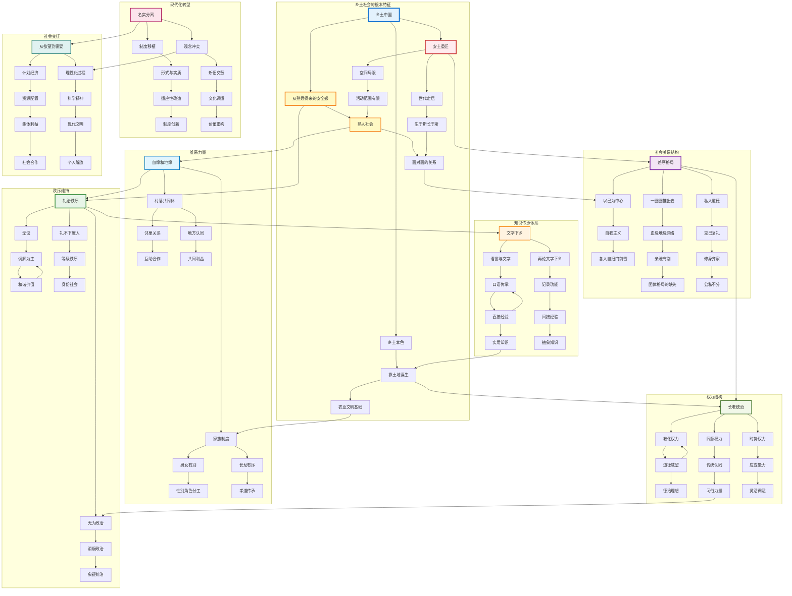

# 《乡土中国》详细读书笔记

## 作者简介
- **费孝通**（1910-2005）
- 中国著名社会学家、人类学家
- 师从马林诺夫斯基，深受功能主义人类学影响
- 本书写于1947年，是其在西南联大和清华大学授课讲义的整理

## 全书结构概览
本书共14篇文章，每篇都围绕"乡土中国"这一核心概念展开，形成了一个完整的理论体系。

---

---

## 第一篇：乡土本色

### 核心概念
- **乡土社会**：以农业为基础的、相对封闭的社会形态
- **熟人社会**：基于血缘、地缘关系的社会网络

### 主要观点
1. **土地的重要性**：土地不仅是生产资料，更是社会关系的载体
2. **流动性的缺乏**：农民世代定居，形成稳定的社会结构
3. **经验的传承**：知识通过口传心授，代代相传
4. **文字的局限性**：乡土社会更依赖面对面的交流

### 深度分析
- 乡土社会的"土"不仅指土地，更指向一种文化传统和生活方式
- 这种社会形态造就了中国人特有的集体主义价值观

---

## 第二篇：文字下乡

### 核心问题
为什么现代教育在农村推广困难？

### 主要观点
1. **知识传承方式的差异**：
   - 乡土社会：直接经验传授
   - 现代社会：抽象知识学习

2. **文字的功能**：
   - 乡土社会中文字需求有限
   - 现代社会文字是必需的沟通工具

3. **教育的适应性问题**：
   - 现代教育内容与农村生活脱节
   - 教育制度未能适应乡土社会特点

### 深度思考
- 这一观点在今天的城乡教育差距问题上仍有启发意义
- 数字化时代的"数字鸿沟"与此有相似之处

---

## 第三篇：再论文字下乡

### 补充论述
1. **时间观念的差异**：
   - 乡土社会：循环时间观
   - 现代社会：线性时间观

2. **记录的必要性**：
   - 熟人社会中信任基于人际关系
   - 现代社会需要文字记录建立制度信任

---

## 第四篇：差序格局

### 核心概念
**差序格局**：以自我为中心，像水波纹一样向外扩散的社会关系网络

### 关键特征
1. **关系的远近**：
   - 血缘关系 → 地缘关系 → 业缘关系
   - 关系越近，义务越重

2. **伦理的相对性**：
   - 对不同关系圈的人有不同道德标准
   - "公"与"私"的界限模糊

3. **权力的分配**：
   - 家长权威向外递减
   - 形成层级化的社会结构

### 与西方社会对比
- **西方**：团体格局，个人与组织的明确边界
- **中国**：差序格局，个人关系网络的重叠交织

### 现代意义
- 解释了中国社会中的"关系"文化
- 理解腐败、裙带关系等问题的文化根源

---

## 第五篇：维系着私人的道德

### 核心观点
中国传统道德体系是以私人关系为基础的

### 主要内容
1. **道德的私人化**：
   - 忠、孝、仁、义都基于具体的人际关系
   - 缺乏超越个人关系的普遍道德原则

2. **群己关系的特殊性**：
   - "己"不是独立的个体
   - "群"不是抽象的集体，而是具体的关系网络

3. **道德冲突的解决**：
   - 通过关系远近来判断道德优先级
   - 情理法的复杂交织

---

## 第六篇：家族

### 家族的功能
1. **生产单位**：农业生产的基本组织
2. **消费单位**：共同生活的经济实体
3. **教育单位**：知识技能的传承场所
4. **保障单位**：养老、医疗、保险功能

### 家族的结构特点
1. **父系继承**：血缘关系的延续
2. **长幼有序**：年龄等级制度
3. **男女有别**：性别角色分工
4. **内外有别**：家庭与社会的界限

### 家族制度的影响
- 形成了中国社会的基本价值观
- 影响了政治、经济、文化等各个领域

---

## 第七篇：男女有别

### 核心分析
中国传统社会的性别分工与西方不同

### 主要观点
1. **功能分工**：
   - 男性：外向性功能（生产、政治）
   - 女性：内向性功能（家庭、教育）

2. **情感表达的差异**：
   - 乡土社会情感表达相对克制
   - 重视实用性胜过情感需求

3. **婚姻制度**：
   - 婚姻是家族联盟，不是个人选择
   - 夫妻关系服务于家族利益

---

## 第八篇：礼治秩序

### 核心概念
**礼治**：通过礼仪规范来维持社会秩序

### 礼治的特点
1. **传统性**：基于祖先传下来的规范
2. **教化性**：通过教育内化为个人品格
3. **灵活性**：可以根据情况调整应用
4. **威权性**：依托长者、贤者的权威

### 礼治与法治的区别
- **礼治**：重视和谐，强调教化
- **法治**：重视公正，强调制裁

### 现代转型的挑战
- 传统礼治秩序在现代社会中的适应性问题
- 如何在现代法治框架内继承优秀传统

---

## 第九篇：无讼

### 核心观点
乡土社会倾向于避免诉讼，通过调解解决纠纷

### 原因分析
1. **关系考量**：诉讼会破坏人际关系
2. **成本考量**：调解比诉讼成本更低
3. **效果考量**：调解更容易达成双方满意的结果
4. **文化传统**：和为贵的价值观念

### 调解的机制
1. **威望调解**：德高望重者的权威
2. **利益调解**：寻找双方利益平衡点
3. **情理调解**：基于人情和道理

---

## 第十篇：无为政治

### 核心思想
传统中国政治的特点是"无为而治"

### 无为政治的内涵
1. **消极政治**：政府尽量不干预社会自治
2. **象征政治**：重视政治仪式和象征意义
3. **德治政治**：通过道德感化来治理

### 实现条件
1. **社会稳定**：变化缓慢的农业社会
2. **自治能力**：基层社会的自我管理能力
3. **文化认同**：共同的价值观念和行为规范

### 历史局限性
- 适应性不强，难以应对快速变化
- 缺乏制度化的监督机制
- 容易导致专制和腐败

---

## 第十一篇：长老统治

### 统治的基础
1. **经验优势**：长者拥有更多的生活经验
2. **文化传承**：掌握传统知识和技能
3. **关系网络**：建立了广泛的社会关系
4. **道德威望**：在社会中享有崇高地位

### 长老统治的特点
1. **个人化**：基于个人品格和能力
2. **非正式**：缺乏制度化的权力结构
3. **教化性**：重视道德教育和感化
4. **稳定性**：变化缓慢，传承久远

### 现代化的冲击
- 知识更新速度加快，经验优势削弱
- 制度化治理的兴起
- 年轻一代的价值观念变化

---

## 第十二篇：血缘与地缘

### 两种社会纽带
1. **血缘关系**：
   - 基于血统的天然联系
   - 具有不可选择性和永久性
   - 形成宗族组织

2. **地缘关系**：
   - 基于地理位置的社会联系
   - 具有相对的可选择性
   - 形成村落共同体

### 关系的转化
- 血缘关系可以通过地缘关系得到强化
- 地缘关系可以通过拟血缘关系得到深化
- 两者相互作用，形成复杂的社会网络

### 现代社会的变化
- 业缘关系的兴起
- 传统血缘、地缘关系的弱化
- 新型社会关系的建构

---

## 第十三篇：名实的分离

### 核心问题
传统社会中名义与实际的不一致现象

### 分离的原因
1. **变化的需要**：社会变化要求制度适应
2. **传统的束缚**：传统观念难以改变
3. **权宜之计**：通过名实分离来协调矛盾

### 表现形式
1. **制度层面**：名义上的等级制度与实际的权力分配
2. **道德层面**：理想的道德标准与现实的行为准则
3. **经济层面**：传统的经济制度与新兴的经济关系

### 影响与后果
- 增加了社会运行的复杂性
- 可能导致价值观念的混乱
- 需要在传统与现代之间找到平衡

---

## 第十四篇：从欲望到需要

### 核心观点
现代社会从满足欲望转向满足需要

### 概念区分
1. **欲望**：
   - 个人的主观愿望
   - 往往无止境
   - 容易导致冲突

2. **需要**：
   - 客观的生存和发展要求
   - 可以通过理性分析确定
   - 有助于社会合作

### 转变的意义
1. **社会和谐**：减少因欲望冲突导致的社会问题
2. **资源配置**：更合理地分配有限资源
3. **可持续发展**：避免过度消费和浪费

### 实现途径
1. **教育引导**：培养理性的消费观念
2. **制度建设**：建立公平的分配制度
3. **文化建设**：弘扬节俭和分享的价值观

---

## 全书核心理论体系

### 主要理论贡献
1. **差序格局理论**：揭示了中国社会关系的基本特征
2. **礼治秩序理论**：解释了中国传统治理的内在逻辑
3. **熟人社会理论**：分析了乡土社会的运行机制

### 方法论特色
1. **类型学方法**：通过理想类型来分析社会现象
2. **比较方法**：中西社会的对比分析
3. **功能分析**：从功能角度解释社会制度

### 理论局限性
1. **时代局限**：基于20世纪40年代的观察
2. **地域局限**：主要基于江南农村的经验
3. **阶层局限**：主要关注农民和地主阶层

---

## 现代意义与启示

### 对理解当代中国的价值
1. **文化传承**：理解中国文化的深层结构
2. **社会变迁**：分析现代化过程中的问题
3. **政策制定**：为相关政策提供理论支撑

### 对个人成长的启示
1. **文化自觉**：认识自己的文化根源
2. **社会责任**：理解个人与社会的关系
3. **价值选择**：在传统与现代之间找到平衡

### 需要批判性思考的问题
1. **性别平等**：传统性别角色分工的合理性
2. **个人权利**：个人与家族关系的重新定义
3. **社会流动**：如何在保持传统的同时促进社会活力

---

## 阅读建议

### 深入理解的方法
1. **结合现实**：用书中理论分析当代社会现象
2. **比较阅读**：与其他社会学经典著作对比
3. **实地观察**：到农村实地观察验证理论
4. **讨论交流**：与他人讨论分享读书心得

### 延伸阅读推荐
1. **费孝通其他作品**：《江村经济》、《乡土重建》
2. **相关理论作品**：马克斯·韦伯《新教伦理与资本主义精神》
3. **当代研究**：贺雪峰《新乡土中国》

### 思考问题
1. 在全球化时代，"乡土中国"的特征还存在吗？
2. 如何在现代化过程中保持文化传统？
3. 差序格局在现代社会中发生了哪些变化？
4. 网络时代的社会关系有什么新特征？

---

## 结语

《乡土中国》不仅是一部学术著作，更是理解中国社会的钥匙。它帮助我们认识自己的文化根源，理解社会变迁的内在逻辑，思考现代化过程中的机遇与挑战。在快速变化的时代，重读这部经典，对于我们建构文化自信、推进社会治理现代化都具有重要意义。
