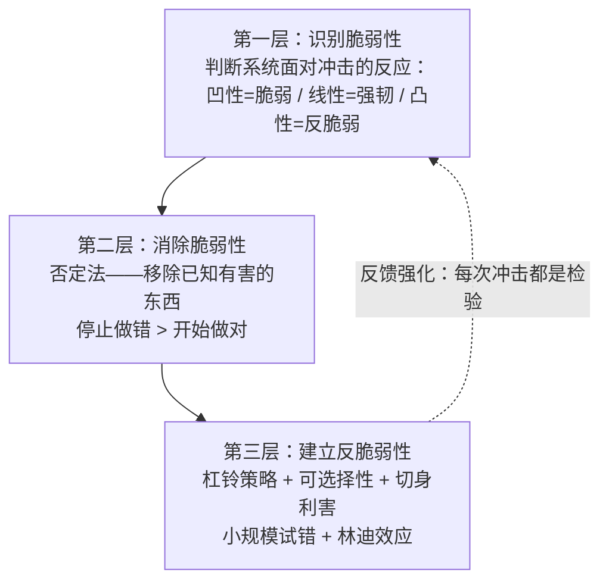

# 《反脆弱：从不确定性中获益》读书笔记

> **作者**：纳西姆·尼古拉斯·塔勒布（Nassim Nicholas Taleb, 1960-）
> **出版年份**：2012年
> **中文版**：中信出版社，雨珂译
> **所属系列**：塔勒布"不确定性四部曲"（Incerto）第三部，前有《随机漫步的傻瓜》《黑天鹅》，后有《非对称风险》

---

## 第一部分：总体归纳

### 全书20条核心原则速览表

| # | 原则 | 核心内容 | ⭐评级 |
|---|------|---------|--------|
| 1 | **三元结构** | 所有事物面对波动时分为三类：脆弱（受损）、强韧（不变）、反脆弱（获益）。没有第四种可能 | ⭐⭐⭐⭐⭐ |
| 2 | **反脆弱性定义** | 从波动、随机性、混乱和压力中获益，而不仅是承受——这是生命的本质特征 | ⭐⭐⭐⭐⭐ |
| 3 | **有机体 vs 机械体** | 猫（有机体）需要压力才能茁壮成长，洗衣机（机械体）在压力下磨损——这是划分一切系统的根本标准 | ⭐⭐⭐⭐⭐ |
| 4 | **脆弱性可测量** | 风险无法精确测量，但脆弱性可以——关注"什么会崩溃"比预测"何时崩溃"重要一万倍 | ⭐⭐⭐⭐⭐ |
| 5 | **整体反脆弱 ≠ 部分反脆弱** | 整体的反脆弱性往往依赖于部分的脆弱性：创业者的失败让经济更强大，进化的淘汰让物种更适应 | ⭐⭐⭐⭐⭐ |
| 6 | **医源性损伤** | 天真的干预造成比解决的问题更大的伤害——医学、经济学、教育、外交中最普遍也最被忽视的罪行 | ⭐⭐⭐⭐⭐ |
| 7 | **杠铃策略** | 不取"中庸"：一端极度安全（90%），一端极度冒险（10%），实现下行受限、上行无限的完美不对称性 | ⭐⭐⭐⭐⭐ |
| 8 | **可选择性** | 权利而非义务——拥有在有利方向行使、在不利方向放弃的能力，你不需要知道未来就能从中获益 | ⭐⭐⭐⭐⭐ |
| 9 | **否定法** | 减法优于加法：知道什么"不对"比知道什么"对"更重要，移除伤害性的东西总是能产生确定性的好处 | ⭐⭐⭐⭐⭐ |
| 10 | **林迪效应** | 一件事物已存活的时间越长，其剩余寿命越长——老技术（如轮子）比新技术（如区块链）更可能在未来继续存在 | ⭐⭐⭐⭐ |
| 11 | **凸性/凹性效应** | 脆弱性是凹性的（损失加速放大），反脆弱性是凸性的（收益加速放大）——这是反脆弱思想的技术性核心 | ⭐⭐⭐⭐ |
| 12 | **利益攸关** | 没有"切身利害"的决策必定导致脆弱性转移——决策者必须承担其决策的后果 | ⭐⭐⭐⭐⭐ |
| 13 | **预言家的无知** | 预测是现代化的产物，从不是人类的自然能力——专注于脆弱性的减轻，而非预测事件 | ⭐⭐⭐⭐ |
| 14 | **实践先于理论** | 我们一直知道怎么做，但不知道如何解释——绿色木材谬误：称职的木材商人不需要知道木材是绿色的 | ⭐⭐⭐⭐ |
| 15 | **塞内加的得失之道** | 在心理上"核销"你已拥有的东西——当你不再害怕失去，你就获得了真正的自由 | ⭐⭐⭐⭐ |
| 16 | **观光化** | 把生活变成"迪士尼乐园"的冲动——消除随机性和不确定性看似"安全"，实则让人变得极度脆弱 | ⭐⭐⭐⭐ |
| 17 | **信号 vs 噪声** | 你越是频繁地观察数据，看到的噪声比例就越大——年度数据50%是信号，每小时数据只剩0.5% | ⭐⭐⭐⭐ |
| 18 | **新物崇拜症** | 迷恋新事物的倾向——那些能存活千年的东西更可能继续存活千年，刚出现一年的东西明天就可能消亡 | ⭐⭐⭐⭐ |
| 19 | **普罗克拉斯提斯之床** | 现代性的核心罪行——把世界"削足适履"地塞进自己的简化模型，把"不合规"的东西暴力裁剪掉 | ⭐⭐⭐⭐⭐ |
| 20 | **伦理倒置** | 群体可以犯错误而个体能知道真相——不要因为所有人都这样做就认为它是对的 | ⭐⭐⭐⭐ |

---

## 第二部分：逐章重点拆解与展开

### 前言

**核心论点**：反脆弱性不是简单的"复原力"，而是一种全新的、从未被正式命名的属性——某些系统不仅能在冲击中存活，还能从中变得更强大。全书通过三元结构（脆弱-强韧-反脆弱）将重新定义读者看待世界的方式。

**重点一：英语中缺失的反脆弱性词汇——认知盲区的语言学根源**

塔勒布发现了一个惊人的语言空白：英语中没有一个词来描述"从冲击中获益"这种属性。有"脆弱性"（fragility）来描述"在压力下崩溃"，有"强韧性"（resilience/robustness）来描述"在压力下不失原有状态"，但没有词来描述"在压力下变得更好"。"反脆弱性"（antifragility）是塔勒布创造的新词。他的论证不是语言学上的吹毛求疵，而是指向一个深刻的认知规律：正如在没有"蓝色"这个词之前，古人实际上"看不见"蓝色（语言学上著名的"蓝绿不分"现象），没有"反脆弱性"这个词也让我们系统性忽视了这种无处不在的现象。我们每天都在接触反脆弱的事物——进化的筛选、免疫系统的训练、骨骼在微创伤后的增强——但我们没有词汇来命名这种共同特征，因此也无法在不同领域之间建立联系和迁移智慧。

**重点二：风险无法测量，但脆弱性可以——全书最核心的方法论转移**

塔勒布在此提出了全书最根本的方法论转变：从"测量风险"转向"测量脆弱性"。风险的定义涉及两个元素——事件的概率和事件的影响——这两者在涉及黑天鹅事件时都是本质上不可知的（你无法精确计算"从未发生过的灾难"的概率和影响）。但脆弱性不同——你不需要知道地震何时发生，你只需要知道"某些建筑在地震中会倒塌"——这不需要任何预测能力，只需要识别哪些建筑是用脆弱的材料和结构修建的。这个转移的革命性在于：它将注意力从完全不可知的东西（未来）转移到了可能是可知的东西（当前的脆弱性结构）。塔勒布用一个简洁的问题概括：**不要问"会发生什么"，而要问"如果发生某事，谁会崩溃"。**

**重点三：三元结构的穷尽性——所有事物必然居于三者之一**

塔勒布断言，面对任何压力源，任何事物必然属于三种状态之一：脆弱（在压力下损失多于获益）、强韧（不受压力影响）、反脆弱（在压力下获益多于损失）。没有第四种可能。他用这三个维度对大量现象进行了重新分类：集权国家（脆弱——表面的强大在压力下一次性崩溃）、瑞士联邦（强韧——下放权力使波动在低层级被消化）、进化系统（反脆弱——环境压力使物种更适应）、银行系统（脆弱——越"稳定"越积累隐藏风险）、创业生态（反脆弱——每一次失败都让系统更了解什么有效）。这个三重分类的威力在于：它不需要任何专业知识就能应用——任何人都可以用"脆弱/强韧/反脆弱"重新审视他生活中的任何系统。

**重点四：反脆弱事物举例——从进化到骨骼的普适原理**

塔勒布在序言中提供了大量反脆弱的例子来帮助读者建立直观认知。进化是最宏大的例子——物种不是"适应"环境的，而是在环境压力下"被筛选和增强"的。免疫系统是绝佳案例——接种微量病原体（压力）后产生抗体（过度补偿），使整个身体比以前更强韧。骨骼在承受微创伤后密度增加——宇航员在失重环境中反而骨质流失，因为缺乏重力压力。创业者群体——失败的创业者被淘汰（个体的脆弱），剩余者构成更强大的经济系统（整体的反脆弱）。这些例子的共同特征：**系统通过承受和消化小规模的压力源，发展出抵抗更大冲击的能力。**

**重点五：这本书可能"改变你看待世界的方式"——从预测导向到脆弱性导向**

塔勒布在序言中警告读者：阅读这本书后，你可能不再以同样的方式看待新闻、经济政策、医疗建议、教育和你的职业生涯。因为你将从"关注未来会发生什么"（预测导向）转向"关注当前有什么正在积累脆弱性"（脆弱性导向）。这种转变不是哲学上的抽象思辨，而是会直接改变你的行为——你不再询问经济学家"市场接下来怎么走"，而是审视你的投资组合"如果市场跌40%，我会崩溃吗"。塔勒布坦言，这种视角一旦获得就不可逆转——你再也无法假装那些"表面稳定"的系统是真正安全的。

**关键洞察**：
1. 从"测量风险"到"测量脆弱性"的视角转换是全书的方法论基石——前者本质上不可知，后者是具体可操作的，这使反脆弱思想不是一种"哲学"而是可付诸实践的工具。
2. 语言的力量被严重低估——正因为英语（乃至所有现代语言）缺少"反脆弱"这个词，我们才系统性地忽视了这种普遍存在的属性，导致我们设计的系统（经济、医疗、教育）默认偏向脆弱性。
3. 塔勒布警告的"不可逆转的视角改变"是真实的——一旦你用三元结构看待世界，那些标榜"稳定""安全""可预测"的体系和产品在你眼中再也不会是它们声称的那个样子。

**行动清单**：
- [ ] 用"三元结构"重新审视你的工作、投资组合、人际关系和健康状况——针对关键的冲击（失业、市场崩盘、背叛、疾病），你是脆弱的、强韧的、还是反脆弱的？
- [ ] 思考：你生活的哪些领域因为没有"反脆弱性"这个概念而让你"看不见"重要的东西？
- [ ] 实验：尝试用"脆弱性"而非"风险"来描述一个问题——结果有何不同？

---

### 第一卷：反脆弱性——导论

---

### 第1章 达摩克利斯之剑与九头蛇怪

**核心论点**：人类思维缺少表达"从混乱中获益"的词汇，这导致了系统的认知盲区。达摩克利斯（脆弱的：悬剑随时落下）、凤凰（强韧的：浴火重生但回到原状）和九头蛇（反脆弱的：砍掉一个头长出两个）构成了完美的隐喻谱系。

**重点一：三个隐喻的精确谱系——达摩克利斯、凤凰与九头蛇**

塔勒布用三个经典神话形象构建了全书最基础的分类框架。达摩克利斯——悬在头顶的马鬃之剑——是脆弱的完美象征：他的繁荣和享受完全依赖于一个极易断裂的外部条件（国王的心情/马鬃的强度）。凤凰——浴火重生——是强韧的象征：它从灰烬中复活，但它只是恢复了原状，没有变得"更好"。九头蛇怪是反脆弱性的完美象征——每砍掉一个头，长出两个，打击使它变得更强大。这三个隐喻的意义超越了文学修辞：它们穷尽了所有系统面对压力的三种可能表现，没有第四种。塔勒布特别强调，达摩克利斯之剑暗示了现代社会中最危险的一类人——那些看起来富有和成功，但其地位完全依赖于单一脆弱的"马鬃"（如一份随时可能被裁的工作、一个依赖政策保护的企业）。

**重点二：领域依赖性——反脆弱认知的最大敌人**

塔勒布指出，人类思维普遍存在"领域依赖"（domain dependence）：我们可能在某个领域理解并接受一个概念，但在另一个领域对同样的概念却完全陌生甚至反对。同一个人可以在健身房里主动寻求肌肉撕裂的压力（知道肌肉会在修复后变强），却在经济政策中要求政府消除一切波动（认为"稳定"才是好）。同一对父母可以理解"孩子摔倒了才会学会走路"，却要求学校消除一切可能让孩子感到挫败的体验。这种领域依赖揭示了：**缺少跨领域的通用概念（如"反脆弱性"）导致人类在重大领域做出系统性错误决策**——不是因为我们愚蠢，而是因为我们的认知工具箱中缺少正确的概念来连接不同领域的经验。

**重点三：依赖外界稳定维持的繁荣，本身就是脆弱性的表现**

塔勒布从达摩克利斯之剑中提炼出一个常被忽视的洞见：**你越需要"稳定"的外部条件才能维持你的状态，你就越脆弱。**一个需要政府补贴才能生存的企业、一个需要"永远不会被裁"才能保持生活方式的白领、一个需要"房价永远涨"才能维持财富的家庭——这些人和系统表面上看起来"稳定"，但本质上他们的"稳定"是由单一脆弱的条件支撑的，一旦这个条件断裂，崩溃是全面的。这与强壮的本质形成了对比：强壮的个体不需要"一切顺利"就能生存——他们有冗余、有备用方案、有多样化的能力。塔勒布的这个观点暗示了一种反直觉的价值判断：**真正的"强大"不是"在顺境中繁荣"，而是"不需要顺境"。**

**关键洞察**：
1. 领域依赖是反脆弱思维普及的最大障碍——解决方案不是更多的专业知识，而是需要一个跨领域的通用概念框架（这正是"三元结构"的威力所在）。
2. 达摩克利斯之剑的隐喻在个人财务中的应用尤其尖锐：那些"月光族"白领——月入五万花四万九，看起来生活优渥——实际上就是达摩克利斯，他们的"繁荣"悬在"不被裁员"这一根马鬃上。
3. 九头蛇怪的不对称性——失去一个头（有限下行）→ 获得两个头（无限上行）——是反脆弱数学模型的核心，后面所有关于凸性、可选择性、杠铃策略的讨论都从这里开始。

**行动清单**：
- [ ] 找出你生活中的"达摩克利斯之剑"——哪些事情表面上很好，但依赖一个极易断裂的"马鬃"？
- [ ] 检查你的"领域依赖"——你在哪些领域接受"压力使人更强"（如健身），又在哪些领域否认同一逻辑（如教育、工作安全、政治稳定）？
- [ ] 做一个"不需要顺境"测试：如果你的收入减少30%，你的生活有多大比例会崩溃？

---

### 第2章 无处不在的过度补偿与过度反应

**核心论点**：过度补偿不是例外而是规则——人类和自然系统的本质是对压力源做出"超出修复所需"的反应，这正是反脆弱性的基本机制。世界的历史是由对压力、创伤和困难的过度反应所书写的。

**重点一：过度补偿的生理学证据——肌肉、骨骼与免疫系统**

塔勒布从最直观的生理层面建立了过度补偿的概念。举重运动员的肌肉纤维在被撕裂后，身体不只是修复它们——它"过度补偿"，使肌肉在修复后比受伤前更强壮。骨骼在接受微创伤（如跑步时骨骼的微裂痕）后，成骨细胞的活跃度远超单纯的"修补"所需，结果是骨密度的净增加。免疫系统在接触微量病原体（如疫苗）后产生的抗体数量，远远超出对抗"这次"感染所需——它在为未来可能的更大规模攻击做准备。这个"反应幅度大于刺激幅度"的模式——塔勒布将其精炼为公式：**过度补偿 = 反应幅度 > 刺激幅度**——是反脆弱性在微观层面的核心"发动机"。它揭示了一个反直觉的事实：系统需要压力来变强，而消除压力实际上剥夺了系统的成长机制。

**重点二：急性压力 vs 慢性压力——间歇性是关键**

塔勒布在此做了一个至关重要的区分：不是所有压力都是有益的。急性压力（如一次高强度的举重训练、一个紧迫的项目截止日期、一次公开演讲挑战）是间歇性的，之后有恢复期——正是这种"压力-休息"的循环驱动了过度补偿。慢性压力（如持续低强度的工作压力、无休止的焦虑、永远无法"断开"的信息轰炸）是持续不断的，没有恢复期——它耗尽系统而不给予过度补偿的机会。这个区分的实践意义是巨大的：现代人面临的问题通常不是"压力太大"，而是"压力类型错了"——我们拥有太多低强度的、连绵不断的慢性压力，而缺乏高强度、间歇性、之后有完整恢复期的急性压力。塔勒布的解决方案不是"减压"（这会使问题更糟），而是"从慢性压力转向急性压力"，为系统创造有意义的"休息-恢复"周期。

**重点三：社会和历史层面上的过度补偿——动荡时代催生伟大创新**

塔勒布将过度补偿的概念扩展到历史层面。他指出一个引人注目的历史模式：最伟大的创新时期——文艺复兴、工业革命——通常发生在动荡时代**之后**，而非和平繁荣时期**之中**。文艺复兴在经历了黑死病（杀死了欧洲三分之一人口）和中世纪晚期的动荡后才全面绽放。美国在经历了大萧条和二战的极端压力后，进入了前所未有的创新和繁荣时代。这些不仅是巧合——塔勒布的论点是人类社会的创造力机制同样遵循"过度补偿"模式：巨大的集体性创伤迫使社会重新思考其基本假设，而这种"强迫的反思"催生了远超"恢复原状"所需的创造性飞跃。

**重点四：直升机式育儿的反脆弱学批判——消除所有压力的孩子反而是最脆弱的**

塔勒布将过度补偿原理应用于教育领域，批判了现代养育方式中一个根深蒂固的错误。"直升机式父母"（一直在孩子头顶盘旋监控的父母）试图为孩子消除一切挫折、困惑和风险——但他们没有意识到，他们正在剥脱孩子发展心理反脆弱性所需的"压力源"。一个从未被允许失败的孩子，在面对成年后的第一次重大挫折时毫无免疫能力。与此对比，那些在成长中经历了适度逆境（不是虐待，而是可控的挑战和偶尔的失败）的孩子，发展出了远远超出"恢复"水平的心理韧性。塔勒布的论点是一个悖论：**想让孩子"安全"的过度保护，恰恰让孩子在未来变得"极度不安全"。**

**关键洞察**：
1. "反应幅度 > 刺激幅度"这个公式将反脆弱性从哲学概念转化为可操作的机制——它说明你不需要"战胜"压力，你只需要确保你的系统有足够的恢复期来"过度补偿"。
2. 关键区别在于"间歇性"——举重运动员不会24小时举重，创业者不会365天无休。现代社会将我们困在一种"永不停歇的低强度慢性压力"中，这恰恰是最糟糕的压力模式。
3. 过度补偿在育儿中的应用是反脆弱的——不是让孩子接触危险，而是让孩子接触"适龄的不适"——摔倒了不急于扶、困惑了不急于解答、失败了不急于安慰。

**行动清单**：
- [ ] 检查你的"压力-休息"比例：有没有给你的身体和大脑足够的恢复期？你的压力是间歇性的（急性）还是持续的（慢性）？
- [ ] 列出你生活中被"过度保护"而变得脆弱的领域——然后设计"受控压力"来重新激活它们
- [ ] 如果你有孩子，检查他们的日程——他们每天有多少"无结构、无成人干预、可能无聊也可能遇到小挫折"的时间？

---

### 第3章 猫与洗衣机

**核心论点**：有机体（猫）与机械体（洗衣机）之间的根本区别在于前者具有内在的反脆弱性——有机体需要压力、随机性和挑战来维持健康和发展，而"观光化"（将不确定性从生活中清除）是现代社会制造系统性脆弱的根本方式。

**重点一：猫与洗衣机的二元分类——一切系统的根本性分野**

塔勒布提出了一个看似简单实则深刻的二元分类法：猫与洗衣机。猫是生命的象征——它从高处跳下，身体需要活动，越用越灵活。洗衣机是机械的象征——它越用越磨损，不需要任何"压力"来维持功能。这个分类指向一个根本问题：人类构建的许多大型系统——经济体制、政治结构、教育体系、医疗系统——本质上更像洗衣机而非猫。我们按照"机械体"的逻辑来设计这些系统：追求可预测、标准化、零故障。但塔勒布指出，这些系统中"人的因素"使它们更像是猫——它们需要波动、需要适应、需要在压力下学习和进化。将"洗衣机逻辑"强加于"猫式系统"上，就是现代社会系统性脆弱的根源。

**重点二：观光化——将生活变成迪士尼乐园的系统性错误**

塔勒布发明了"观光化"（touristification）这个词来描述现代社会的核心病症——将生活设计成如迪士尼乐园般安全、可预测、无随机性的旅程。观光的本质是"在安全隔离罩中体验世界"——你坐在空调大巴里，按照固定的时间表，在已经被"驯化"的景点之间移动。这和真实的生活体验——未知、不可预测、时而危险——形成了鲜明对比。现代社会的"观光化"无处不在：从无菌包装的食物（剥夺了免疫系统的锻炼），到24小时恒温的室内环境（剥夺了身体调节温度的能力），到"零风险"的金融产品（表面安全实则隐藏极端风险），到被算法精准推送的信息茧房（剥夺了认知的多样性）。塔勒布的尖锐论点是：**我们正在用"舒适"谋杀我们自己**——这些看似温和、保护性的措施，实际上是在系统性地剥夺我们系统的反脆弱性。

**重点三：抗生素滥用——观光化的完美隐喻**

抗生素是"观光化"逻辑在医学中最清晰的体现。当一个人感染时，医生使用广谱抗生素无差别地杀死所有细菌——有害的和有益的。短期结果是"治愈"（症状消失），但长期结果是免疫系统的退化（因为失去了与微生物"训练"的机会）和抗生素耐药性的产生（因为细菌在巨大的选择压力下进化出了抗药性）。这与观光化的逻辑一模一样：**通过"一刀切"的方式消除表面的不适，却在更深层面上制造了更大的脆弱性**。塔勒布将这个隐喻扩展到金融救助（消除破产的小波动→制造系统性的大崩溃）、教育标准化（消除学习中的困惑→制造不会独立思考的学生）、政治正确（消除"冒犯"→制造无法应对真实分歧的社会）。

**重点四：森林火灾的必然性——为什么扑灭所有小火会导致大火**

塔勒布引入了森林生态学中的一个经典案例：在美国黄石国家公园，几十年来森林管理者执行"扑灭一切火灾"的政策，结果地面上堆积了前所未有的可燃物——枯枝、落叶、干燥的灌木。当1988年大火最终爆发时，其规模和强度远远超过了自然条件下任何可能发生的火灾。原因很简单：小规模火灾是森林生态系统的"自然清洁机制"——它们定期清除地面堆积的可燃物，为新的生长腾出空间，而不会威胁成熟的树木。扑灭所有小火的策略虽然看起来"保护了森林"，实际上为一场灾难性的大火创造了完美的条件。这个案例是塔勒布全书中最重要的类比之一：**压制小波动不会消除波动——波动性只是被转移到了更大的、更危险的规模上**。

**关键洞察**：
1. "猫/洗衣机"分类的最强大应用是自省——你正在用"洗衣机逻辑"（追求稳定、消除波动、标准化一切）生活的哪些领域？这些领域是否实际上更接近"猫"（需要波动才能健康）？
2. 观光化最隐秘的危险在于它让你感觉"安全"——你坐在空调房里、领着稳定工资、吃着标准化食物，一切"正常"，但你抵御现实世界冲击的能力正在不可逆转地衰减。
3. 森林火灾原理的普适性——无论是金融危机（压制小规模银行破产→酿成系统性崩溃），还是政治动荡（压制小规模抗议→酝酿革命），都在重复同一模式：波动不会被消除，只会被转移到更大的规模。

**行动清单**：
- [ ] 列一张清单：你的生活中哪些部分是"猫"（需要压力、波动、挑战），哪些是"洗衣机"（需要保护、稳定）？是否搞混了？
- [ ] 找出你生活中被"观光化"最多的领域——然后引入一些受控的随机性和不适感
- [ ] 在财务上做一个诚实评估：你是"猫"（有冗余、能承受损失）还是"洗衣机"（刚好够用、一次故障就崩溃）？

---

### 第4章 杀不死我的，使他人更强

**核心论点**：尼采的名言"杀不死我的使我更强大"只说对了一半——在大多数系统中，真正发生的是"杀不死我的，使整个系统更强大，因为我的死亡为其他人创造了空间"。整体的反脆弱性建立在部分的脆弱性之上，这是进化和进步的根本逻辑。

**重点一：层级悖论——个体的脆弱性是群体反脆弱性的燃料**

塔勒布在这一章中引入了理解反脆弱性最关键的"层级"概念：从细胞到器官到个体到群体到物种，反脆弱性在每个层级上的表现不同，甚至在高层级的反脆弱性恰恰依赖于低层级的脆弱性。进化是最完美的例证：大量个体生物因为不适应环境而死亡（脆弱），但这些"牺牲者"的死亡为物种提供了关于"什么有效"的宝贵信息（反脆弱）。死亡本身就是进化的"信息获取机制"。没有那些消失的物种和被淘汰的变异，就不会有今天在地球上生存的每一个物种的精妙适应。塔勒布用一句话戳穿了人们对进化的浪漫化想象：**进化不是"一部设计精良的机器不断完善自己"的故事，而是"无数个体被残忍地淘汰为更有适应力的少数让路"的过程。**

**重点二：经济中的创业失败者——被误解的可敬牺牲者**

塔勒布将层级悖论应用于经济领域，得出了一个反直觉的结论：我们应该感谢创业失败者。在任何一个经济体中，超过90%的创业企业在成立五年内消失。从个体创业者的角度看，这是一个悲剧性的高失败率（脆弱）。但从整个经济系统的角度看，这些"失败"构成了系统发现"什么有效、什么无效"的探索机制——那些失败的企业尝试了不同的商业模式、不同的技术路线、不同的市场定位，它们的消亡告诉剩余企业"不要走的道路"，从而让幸存者（以及整个经济）更强大。在塔勒布看来，现代政府"拯救一切失败企业"的冲动（救助、补贴、过度宽容的破产法）不仅在浪费资源，更在剥夺经济系统的"学习机制"——如果失败的尝试被拯救，那么"什么无效"的信号就被屏蔽了，系统失去了从错误中学习的能力。

**重点三：餐馆行业的"残忍高效"——为什么纽约有世界上最好的食物**

塔勒布用餐馆行业作为层级悖论的生动案例。纽约的餐馆年倒闭率在所有行业中是最高之一——每年有大量餐馆开业，也有大致相当的数量关门。从单个餐馆老板的角度看，这是残酷的（艰辛创业、最终破产）。但从纽约食客的角度看，这恰恰是为什么他们能吃到世界上最好的食物——**脆弱个体的高死亡率创造了反脆弱的美食生态**。每一个倒闭的餐馆都为存活者提供了市场信息（哪种菜系受欢迎、哪个地段好、什么价位可行），每一个新开的餐馆都从倒闭者的错误中学习。塔勒布得出的推论是尖锐的：那些试图"帮助"餐馆行业的地方政策（如限制竞争、提供补贴）表面上在保护个体餐馆老板，实际上在削弱整个美食生态的竞争力——因为当脆弱的餐馆被"拯救"时，它们占据的市场空间就阻止了一个可能更好的餐馆取而代之。

**重点四：错误应该保持"小"——核心行动原则**

塔勒布从层级悖论中提炼出一条核心行动原则：**让错误保持足够小，让它们能产生学习价值而不至于毁灭整个系统。**如果一家小银行破产，它的储户受到保护（通过存款保险），它的管理者被问责，市场从中学到教训——这是健康的、"有学习价值"的失败。但如果整个银行系统同时面临破产（如2008年），那就不再有学习价值了——只有毁灭。同理，在个人生活中，如果你在一个项目上投入五年时间、全部积蓄却最终失败——你没有学到东西就毁灭了。但如果你做了十个小的尝试，其中三个失败，你从每个失败中学到不同的东西——你就从失败中获益了（反脆弱）。这个原则直接通向后面的杠铃策略——"将你90%的资产放在极度安全的避风港，10%放在极度投机的冒险中"——因为这种结构确保了即使所有冒险都失败，你的损失也仅限于10%。

**重点五：个人层面的"自我淘汰"——让旧我死去，新我诞生**

塔勒布将层级悖论的最激进推演回归到了个人成长层面：你需要愿意"杀死"自己的一些旧想法、旧身份、旧技能。一个固守"20年前的自己"的人——不更新技能、不质疑信念、不放弃不再适应环境的行为模式——就像进化中那个拒绝"淘汰"不适应变异的物种：整个系统（你的人生）将因此而僵化和衰退。塔勒布提出的"自我淘汰"不是自虐，而是一种有意识的、主动的"允许脆弱的自己死亡以成就更强大的自己"。具体表现可能是：放弃一个"安全但让自己痛苦"的职业身份（让旧的职业自我死去），结束一段消耗性的关系，承认并放弃一个长期坚持但被证伪的观点。这些自愿的"小死亡"恰恰是个人反脆弱性的动力来源。

**关键洞察**：
1. "整体的反脆弱性依赖于部分的脆弱性"——这个原则要求一种从"个体中心"到"系统中心"的视角转移，它可能让人不舒服，因为它暗示某些"失败"和"牺牲"是有意义的，即使对当事人来说是悲剧性的。
2. 现代社会"拯救一切"的冲动——救助破产银行、补贴失败企业、不让任何一个孩子感受失败——本质上是在破坏系统的免疫记忆，在消除系统的学习机制。
3. 最好的实践指南是"让错误小而多"——大量小规模的试错既提供了学习信息，又确保没有单个错误可以终结你的整体存在。这正是杠铃策略和可选择性背后的核心直觉。

**行动清单**：
- [ ] 审视你的工作/投资：你是否能让"失败"保持足够小，以至于它的死亡不会杀死你，但能让整体变得更强大？
- [ ] 在你的个人成长中，哪些"旧自我"需要被允许"死去"，以便新的、更强大的人格能从中生长出来？
- [ ] 反思你对"失败"的态度——你是否能从失败中感受到"系统在学习"的认知价值，而非只是沉浸于个人的痛苦？

---

### 第二卷：现代性与对反脆弱性的否认

---

### 第5章 露天市场与办公楼

**核心论点**：自下而上、充满小波动和多样性的系统（如露天市场）比自上而下、表面稳定却隐藏脆弱性的系统（如办公楼）更具长期的反脆弱性。波动在"低层级"被消化，而非积累到"高层级"一次性崩溃。

**重点一：约翰与乔治的对比——两种截然不同的随机性**

塔勒布用两兄弟的人生选择将"两种随机性"的差异具象化。约翰是大银行的职员——每月固定工资，收入曲线看似平滑，有医疗保险和退休金。乔治是出租车司机——每天收入波动剧烈，没有带薪假期，没有"职业安全感"。从传统角度看，约翰"成功"、乔治"失败"。但塔勒布揭示了一个反直觉的事实：**约翰面对的是极端斯坦的毁灭性风险**——他的收入稳定是假象，因为一旦被裁员（这在大规模重组中一次可以裁掉数千人），他的收入从固定变为零。而乔治面对的是平均斯坦的温和波动——没有一天的收入会"归零"，最坏的一天也有车费收入。换句话说，约翰的系统在面对"被裁"这个冲击时是脆弱的（一次性崩溃），乔治的系统是强韧的（波动大但永不完全崩溃）。这个对比揭示了"表面稳定"与"本质稳定"之间的巨大鸿沟。

**重点二：瑞士模式——拒绝集中化的反脆弱国家设计**

塔勒布将瑞士联邦作为"自下而上"政治架构的终极典范。瑞士没有强大的中央政府——权力被彻底下放到各州（canton）和自治市镇，决策在最低可能的层级做出。税收、教育、卫生、交通等关键决策主要由州和市镇制定，不同地区之间存在显著的制度多样性。从传统的"效率"角度看，这种架构是"低效的"——政策不一致，跨地区协调麻烦，缺乏统一的"国家计划"。但塔勒布的论点是：正是这种"低效"创造了瑞士政治的极端稳定性——波动和冲突在"自治市镇"这一小层级被消化，永远不会积累到"国家层面"造成崩溃。与此对比，高度中央集权的国家（苏联、纳粹德国）在短期内看起来"强大"和"高效"，但一旦崩溃（由于一个中心决策的错误），就是全系统的、灾难性的崩溃。

**重点三：波动守恒定律——波动不会消失，只会转移**

塔勒布在这一章中提出了一个贯穿全书的核心定律，虽然是隐含而非明确表述的：**波动性不会消失，只会转移**。当你通过政策手段"消除"了表面的小波动——禁止小规模抗议（压制政治不满）、救助小型破产（压制经济调整）、使用药物压制轻微焦虑（压制心理反馈）——你并没有消除波动本身。波动性只是被从"可消化的小规模"转移到了"不可消化的大规模"。那些被压制的政治不满不会消失，它们在地下积蓄直到爆发为革命；那些被救助的不良企业不会自我革新，它们累积了行业的系统性风险直到金融危机；那些被药物压制的焦虑不会消失，它们转化为更糟的心理危机直到完全崩溃。塔勒布的结论简洁而有力：**如果一种波动对系统是有益的（如同免疫系统的训练），那么消除它就是一场灾难。**

**重点四：平均斯坦 vs 极端斯坦的波动——关键区分**

塔勒布在此深化了他在《黑天鹅》中建立的核心概念。平均斯坦中的波动具有以下特性：单个事件不会产生不成比例的影响，样本量够大时预测可靠，极端值罕见且温和（如人类的身高分布——你可以找到2米的人，但找不到20米的人）。极端斯坦中的波动则相反：单个事件可以改变一切，没有足够大的样本量使"平均"有意义（如财富分布——少数人拥有绝大多财富，一个比尔·盖茨能拉高所有均值）。约翰面对的是极端斯坦的波动（一次裁员摧毁100%收入），乔治面对的是平均斯坦的波动（每一天的波动都在正常范围内）。识别你的系统暴露于哪种类型的波动是反脆弱性分析的第一步。

**关键洞察**：
1. "表面稳定"与"实质稳定"经常是相反的——约翰的固定工资"看起来"稳定，但他的系统在极端斯坦，脆弱性远高于每天波动但永不完全崩溃的乔治。
2. 瑞士模式的反直觉威力在于：它通过"允许小规模混乱"来"防止大规模崩溃"——这违背了中央计划者"整齐划一"的本能，但却被历史反复验证。
3. 波动守恒定律具有广泛的应用——每当你看到一项政策"消除了某种波动"，你应该立即问：**这种波动去了哪里？它在以什么方式、在什么规模上积累？**

**行动清单**：
- [ ] 检查你的收入来源——是约翰式的（单一来源、看似稳定实则暴露于极端斯坦）还是乔治式的（多元化、有波动但不会归零）？
- [ ] 在你的组织或团队中，是否存在"决策中心化"的倾向？能否将更多决策下放到"最低层级"让波动在局部消化？
- [ ] 区分你生活中的"平均斯坦波动"和"极端斯坦波动"——前者可以使你更强，后者可能杀死你

---

### 第6章 告诉他们我热爱（某些）随机性

**核心论点**：随机性对反脆弱系统而言不是敌人而是"营养"——它打破系统卡在局部最优的状态（退火效应），通过不断的小扰动使系统保持"寻找更好状态"的动态能力。压制随机性只会让系统僵化，在更大的冲击面前不堪一击。

**重点一：布里丹之驴——随机性是僵局的解放者**

塔勒布用一个古典哲学寓言来说明随机性的积极功能。布里丹之驴是一头站在两堆完全等距的干草之间的驴——因为理性计算无法在"完全相同的两个选项"之间做出选择，它活活饿死了。如果有任何微小的随机扰动——一阵微风让驴的头微微偏向一边，一只苍蝇停在它的一只耳朵上——它就会打破对称性，走向其中一堆草而获救。这个寓言的深刻之处在于：**在理性计算陷入僵局的地方，随机性是唯一的出路。**不只是驴——经济系统在"所有参与者都挤在同一个策略上"时陷入僵局（如2005年所有银行都涌向次贷抵押贷款），正是需要某种随机扰动来打破这种危险的均衡。个人职业生涯也是如此——当你面对两个"看起来一样好"的选择而无法决定时，抛硬币（引入随机性）可能比无限的分析更有效。

**重点二：退火效应——为什么系统需要"加热"和"冷却"的循环**

塔勒布从材料科学中借用了"退火"（annealing）这个概念来展示随机性在系统优化中的角色。退火是金属加工中的一个经典过程：将金属加热到高温，让分子获得随机运动的能量（脱离不良的排列位置），然后缓慢冷却，让分子在更好的位置"冻结"。没有加热——分子保持在不理想的位置，金属有内部应力而脆弱。没有冷却——分子无法"固定"在更好的排列上。塔勒布的类比是：**经济的"衰退"就是退火中的加热阶段**——它让资源从低效的用途中释放出来（企业倒闭、工作岗位消失），让它们可以被重新分配到更高效的新用途中。因此，试图"消除衰退"的经济政策（如大规模刺激、无限度救助）本质上是在阻止经济的退火过程——它们让不良企业继续占有资源，从而阻止经济向更高效的结构转变。

**重点三：美国外交政策的反脆弱学分析——干预制造更大的混乱**

塔勒布以美国在中东的外交政策作为"压制随机性导致灾难"的当代案例。美国在伊拉克、阿富汗、利比亚的政策遵循同一个模式：识别一个被认为"有问题"的政权，通过军事或政治干预推翻它，试图"建设"一个更稳定、更民主的新秩序。每一次，结果都是更糟的混乱。在反脆弱框架中，原因非常清晰：这些社会本身处于一种复杂的内在不稳定状态，但它们的"旧秩序"——无论多么不完美——是无数微小调整和适应（类似于退火中的随机运动）在漫长时间中形成的一种"均衡"。外部干预一次性摧毁这个复杂结构，代之以一个从外部"设计"的简化方案——后者不具备前者的适应能力，在压力面前迅速崩塌。塔勒布的结论尖锐：**美国的决策者犯了三重错误——他们高估了自己的认知能力（认为自己"理解"中东）、低估了有机系统的复杂性（认为可以"设计"政治秩序）、忽视了干预的医源性损伤（创造的问题比解决的更多）。**

**重点四：过度稳定是现代性的核心病症——"安全"的悖论**

塔勒布将前述论点汇聚成一个统一的诊断：现代社会的核心病理在于"过度稳定"——在每一个领域，我们都试图消除波动、压制随机性、建立"完美秩序"。抗生素过度使用（杀死有益菌和有害菌）让免疫系统退化；金融救助（消除不良企业）让经济的退火机制失效；职业安全网（让任何人几乎不可能被解雇）创造了不能失败的僵尸机构；教育保护（消除学习中的挫折）制造了无法面对现实世界的毕业生。在每一个案例中，"安全"这个最初的善意目标通过剥夺系统的反脆弱性训练，最终制造了更大的不安全。塔勒布提出了一个悖论性的原则：**真正的安全不在于"消除一切威胁"，而在于"建立一个能在威胁中茁壮成长的系统"。**

**关键洞察**：
1. 布里丹之驴揭示了随机性的一个被严重低估的功能——不仅是"变化"，更是"僵局的解药"。在个人决策中，当你面临"信息已经完全对称、理性无法区分"的选择时，随机选择比不选择更优。
2. 退火的概念将"衰退"和"痛苦"从纯粹的负面事件重新定义为系统优化的必要阶段——没有加热阶段的"紊乱"，就没有冷却后更优的"秩序"。
3. 三个案例的共同主线：**压制随机性的人，不理解随机性是系统自我校准的机制**——消除随机性的代价是同时消除了系统发现和纠正自身错误的能力。

**行动清单**：
- [ ] 在感觉"卡住"的时候，引入一些随机性——随机读一本不相关的书，随机联系一个很久没联系的人，随机走一条没走过的路
- [ ] 反思你的生活环境：你是不是一直在试图"消除一切波动"？——如果是，知道这让你正在变得更脆弱吗？
- [ ] 将"退火"原理应用到学习或工作中——你有没有经历"加热"（接触新事物、接受挑战、跳出舒适区）以及"冷却"（消化、反思、巩固）的完整循环？

---

### 第7章 天真的干预

**核心论点**："医源性损伤"——干预造成比原本问题更严重的伤害——是现代社会最普遍、最被忽视的罪恶。根源在于人类对"信号"和"噪声"的混淆：我们越是频繁地观察、越是焦虑于控制，就越容易对纯粹的噪声做出过度反应。

**重点一：医源性损伤——现代性的隐秘瘟疫**

塔勒布将"医源性损伤"（iatrogenics，源自希腊语"由医生造成的伤害"）作为全章——乃至全书——最核心的批判性概念。他给出了一个令人震惊的历史事实作为起点：**直到20世纪初，你去看医生比不去看医生更可能死亡**。这并非因为医生"邪恶"，而是因为他们在根本不知道自己在做什么的时候就在"做"——放血、使用未经消毒的器械、用现在已知有害的"药物"。19世纪的医生在接生前不洗手，直接导致了大量产妇在产褥热中死亡。问题的本质不是"坏医生"，而是**在复杂系统中，在不充分理解的情况下的"天真干预"比"不干预"更危险**。塔勒布将这个概念扩展到远超医学的领域：金融监管可能通过救助银行创造了更大的道德风险；教育干预（过度辅导、过度结构化）可能在消除困惑的同时消灭了好奇心；外交政策的"政权更迭"几乎总是导致比原政权更糟的结果；中央银行通过操纵利率"熨平经济周期"可能在积蓄更大的不稳定性。

**重点二：信号与噪声——为什么干预的冲动随观察频率上升**

塔勒布引入了《黑天鹅》中著名的"信号与噪声"框架，并赋予了它新的实际含义。假设你持有一个长期投资组合，年化回报率为8%，标准差为15%：如果你**每年**查看一次你的账户，约93%的时候你会看到正回报——你的"观察"包含高比例的信号（真实的长期趋势），低比例的噪声（随机波动）。如果你**每月**查看一次，看到正回报的概率下降到约67%。如果你**每天**查看一次，这个概率下降到约54%。如果你**每小时**查看一次——你看到的几乎是纯噪声，只有约50.2%的概率为正。塔勒布的论点是：**你越频繁地观察数据，你看到的噪声比例越大，你干预（基于噪声做决定）的错误概率越高**。年度数据约50%是信号，每小时数据约0.5%是信号。而大多数"天真的干预"恰恰发生在高噪声的观察频率上——因为股票价格在一小时内"跌了"就卖、因为血压在一次测量中"偏高"就用药物、因为民调在一周内"波动"就改变政策。

**重点三：举证责任在干预者身上——认知谦逊的制度化**

塔勒布从医源性损伤中推导出一条激进的原则：**举证责任应该在干预者身上，而非在不干预者身上。**在几乎所有专业领域——医学、经济政策、教育、外交——默认的状态是"干预者只需要声称自己的干预'可能有益'就可以行动"，而不需要证明干预的收益大于潜在的医源性损伤。塔勒布提出应该颠倒这个举证责任：干预者必须提供明确证据证明**干预的净收益为正面且大于不作为的收益**，否则就不应该干预。这条原则的实际含义是深远的：如果一个医生建议你做一项常规体检/服用一种预防性药物，他有义务向你证明"做这个比不做更好"，而不只是"做这个可能有益"。如果没有这样的证据，你的默认选择应该是拒绝干预。塔勒布将这条原则扩展到投资领域：**如果一个基金经理不能提供明确证据表明他的主动管理在扣费后跑赢指数，你应该默认选择指数基金**。

**重点四：天真的干预主义的心理根源——行动偏见与控制幻觉**

塔勒布深入分析了为什么人类如此倾向于干预——即使证据表明干预经常造成医源性损伤。他指出两个心理根源：（1）**行动偏见**（action bias）——在压力情境下（市场下跌、孩子成绩差、身体不适），"做一些什么"在心理上比"什么都不做"感觉更负责任。"不作为"在事后可以被指责为"疏忽"，而"作为"即使失败了也是"努力了"。（2）**控制幻觉**（illusion of control）——人类系统性地高估自己通过行动影响结果的能力。这两者结合起来导致了一种危险的行为模式：在不确定性面前，人们宁愿做一件"可能"（但实际不）有用的事，也不愿意什么都不做——即使后者在统计上是更优的选择。塔勒布认为，克服天真的干预主义不仅需要知识（理解医源性损伤的原理），还需要一种特殊的心理纪律——**在不确定的情况下，有勇气承认"我不知道该做什么，所以我不做"**。

**重点五：干预的危险与干预方向——否定法作为最低伤害原则**

塔勒布在此提出了一个关键的区分：不是所有干预都是坏的。坏的是**积极的、增加性的干预**（"我们应该再加一种药物/再加一项政策/再加一套程序"），而**否定性的、减少性的干预**（"让我们停止做X因为它有害"）几乎总是好的。这是因为：一个复杂的有机系统已经包含了大量的自我调节机制——在你不完全理解这些机制的情况下，增加一个新的干预（如引入一种新药、一项新政策）可能会干扰或破坏现有的良性机制。而移除一个已经确认有害的东西（如停止一种有严重副作用的药物、废除一项已被证明失职的政策）——其效果是清晰且正面的。这就是"否定法"的雏形——**知道什么不对比知道什么对更重要，停止做错的事比开始做对的事更安全。**

**关键洞察**：
1. 医源性损伤的惊人普遍性指向一个根本问题：我们对"干预"的默认态度是错位的——我们应该将"干预"视为需要"特别正当理由"的例外，而非默认选项。
2. "信号/噪声"比例随频率爆炸性变化解释了为什么现代生活中"焦虑导致糟糕决策"如此普遍——我们被设计成24小时不间断地接收"数据"（股市、社交媒体、新闻），这些数据绝大多数是噪声，但我们的大脑不断从中提取"信号"并做出"干预"。
3. 克服"行动偏见"是获得反脆弱性的第一步也是最难的一步——在压力下什么都不做的勇气，是塔勒布认为所有美德中最被低估的一种。

**行动清单**：
- [ ] 检查你的"数据查看"频率——你多久查看一次股票/业绩/社交媒体？如果将频率减半，会不会做出更好的决策？
- [ ] 应用"干预前举证"原则：在你下一次想要"修复"某事之前，先问自己——**我的干预真能比什么都不做更好吗？我有什么证据？**
- [ ] 找出你生活中"因过度关注而错误干预"的一个实例——然后制定规则来防止它再次发生（如"不在一小时内看到股价波动就做交易决定"）

---

### 第三卷：非预测性的世界观

---

### 第8章 预测——现代性的产物

**核心论点**：预测未来不是人类自然拥有的能力，而是现代性的产物——火鸡的比喻证明了过去不预示未来，预言家的历史记录证实了预测低于随机猜测。唯一有效的"预测"是专注于减轻脆弱性。

**重点一：火鸡问题——归纳法的根本局限**

塔勒布用火鸡的比喻完成了全书最具冲击力的哲学论证。一只火鸡被农场主养了1000天——每天准时被喂食，每一次喂食都加强了它的"信念"："人类是善良的，生活是可预测的，明天会更美好。"从统计学的角度，在第1000天的时候，火鸡对未来"会被继续喂食"的"信心"达到了历史最高点——1000天的数据一致支持这一结论。第1001天是感恩节——农夫带着斧头来了。火鸡的推理不是"非理性"的——恰恰相反，它从数据中得出的归纳结论在逻辑上是完美的。问题不在火鸡，而在**归纳法本身的根本局限**：当存在"结构性断裂"（从"喂养期"到"宰杀期"的切换）时，所有基于过去数据的推断不仅是错误的，而且是灾难性的——在感恩节前一天，火鸡对"明天会更好"的信心恰恰达到了顶峰。黑天鹅事件的本质就是这种结构性断裂——天真的归纳推理在断裂点前后产生完全相反的结论。

**重点二：预测的历史记录——专业预言家的系统性失败**

塔勒布展示了预测行业的冷酷数据。他引用了心理学家菲利普·泰特洛克（Philip Tetlock）的经典研究——该研究在20年间跟踪了284位"专家"（政治学者、经济学家、记者）的82,361个预测，结论是：专家的平均预测准确率低于"随机猜测"，而且在预测黑天鹅事件（罕见但影响力极端的事件）方面，专家比门外汉更差——因为专家有更多的理论框架来"证明"黑天鹅不会发生。进一步的证据来自股票市场：没有任何持续跑赢指数的"预测型"基金经理——即使是那些短期表现最好的基金，其"超额回报"在统计上也无法与"随机运气"区分。塔勒布特别批判了IMF（国际货币基金组织）和世界银行的经济预测——它们在预测经济危机方面的记录如此之差，以至于塔勒布戏称它们的预测应该被用作"反向指标"。

**重点三：为什么预测在极端斯坦中注定失败**

塔勒布将预测的失败追溯到了根本的数学原因。在平均斯坦（如身高分布），极端值罕见且温和，样本量够大时均值稳定，预测是可行的（你完全可以预测说"随机抽取的100个成年人的平均身高约170cm"）。但在极端斯坦（如财富分布），单个个体可以不成比例地改变整个分布（沃伦·巴菲特一个人的财富就能显著拉高所有美国人的平均财富），因此在预测极端斯坦中的事件时——股票市场的暴跌、战争的爆发、技术的突破——过去的平均值不能提供任何有意义的指导。而塔勒布的核心论点是：**人类试图预测的几乎所有"重要"事件都处于极端斯坦**——经济、政治、战争、技术创新。我们要求预测本身去做一件它在数学上不可能完成的任务，然后为它的失败感到"惊讶"。

**重点四：从"预测导向"到"脆弱性导向"——可操作的替代方案**

塔勒布没有停留在"摧毁预测"，他提供了替代方案。核心转换是：**不要问"会发生什么"，要问"如果发生某事，我会怎样"**。具体来说：（1）对于你的投资组合——不要预测市场的走向，而是构建一个无论市场涨跌都不会摧毁你的组合；（2）对于你的职业——不要预测哪个行业会繁荣，而是建立多样化的技能使你在任何行业变化中都有价值；（3）对于你的健康——不要预测你会得什么病，而是让你的身体具有广泛的反脆弱性以应对各种健康冲击。这个转换将注意力从**完全不可知的东西**（未来）转移到**当前可知的东西**（你当前的脆弱性结构），从"押注"转向"准备"。

**关键洞察**：
1. 火鸡问题的恐怖美学在于："信心"达到最高点的时刻恰恰是毁灭最近的时候——这在金融市场中每天重演（在泡沫顶峰，投资者信心最高，崩溃最惨烈）。
2. 预测在极端斯坦的不可行性不是暂时的技术限制——它是数学上固有的，如同不可能用"平均身高"来预测世界上是否存在巨人。
3. 放弃预测不是放弃理性，而是"承认理性的边界"——这是一种认识论的谦逊，区别于虚无主义（"所以一切都不可知，什么都不做"），它导向一种积极的实践：消除脆弱性，建立反脆弱性。

**行动清单**：
- [ ] 反思：你的生活和投资决策中，有多少是基于"火鸡式推论"（过去N天都这样→明天还会这样）？
- [ ] 对你的"预测来源"做一次审计：列出你信赖的3-5个预测者/分析师，然后查查他们过去的预测准确率
- [ ] 将每一个重大决策的提问方式从"会发生什么"转变为"如果最坏情况发生，我是否会崩溃？"

---

### 第9章 胖子托尼与脆弱推手

**核心论点**：塔勒布通过两个对比鲜明的人物——"脆弱推手"尼禄（知识分子）和"反脆弱实践者"胖子托尼（街头智慧者）——展示了两种截然不同的世界观。托尼通过直觉捕捉脆弱性，以"做空脆弱"来持续获利，证明了你不需要精确预测"何时崩溃"，只需要识别"谁会崩溃"。

**重点一：两个人物——两种认知模式的对决**

塔勒布塑造了两个贯穿全书的人物。尼禄·图利普（Nero Tulip）是学术型知识分子的化身——他熟读经典、迷恋数据和统计模型、相信世界可以通过理性来理解和控制。他的知识是"书本型的"——精确、优雅、可在研讨会上展示。胖子托尼（Fat Tony）是纽约布鲁克林的街头智者——没有大学学历，不读经济学期刊，不理解"标准差"这个词，但他有一种对"脆弱性"近乎本能的嗅觉。塔勒布设计这两个人物不是为了讽刺某一方，而是为了揭示**两种认知模式在识别脆弱性方面的根本差距**：托尼能看到尼禄看不到的东西，不是因为他更"聪明"，而是因为他的认知没有被华丽的理论框架过滤掉现实的粗糙信号。

**重点二：托尼的核心策略——做空脆弱，而非做多预测**

托尼的商业策略简单得令人震惊：他找出那些被广泛认为是"安全"和"稳定"的系统，然后押注它们会崩溃。他不是在押注"何时"崩溃——他明确知道这是不可预测的。他在押注"崩溃本身"——因为脆弱的系统需要"一切继续按预期运行"的高标准才能维持，而时间运行越长，不符合预期的事情就越不可避免地发生。因此，**"脆弱最终崩溃"的概率在无限时间中趋近于100%**。托尼在2008年金融危机之前就已经购买了针对银行系统崩溃的廉价保险（信用违约掉期CDS），不是因为他"预测"到了危机，而是因为他"识别"到了银行系统的极端脆弱性——高杠杆、互相捆绑的衍生品、依赖短期融资、资产缺乏多样化的——一个需要"房价只涨不跌、利率永远低位、短期融资永不枯竭"才能维持的系统。托尼在崩溃前的许多年都在"亏损"这些保险费用（他的"做空"成本是阴性现金流），但最终在2008年的一次崩溃中，他赚到了足以覆盖所有年份保费并产生巨额利润的回报。这就是**反脆弱投资的不对称性**——小额的、持续的成本换取偶尔的、巨大的收益。

**重点三：托尼与一般投机者的本质区别——识别 vs 预测**

塔勒布在此划出了一个关键的界限。一般投机者试图"做空"的是他们**预测**会上涨或下跌的东西——这需要先知般的能力。托尼"做空"的是他已经**识别出**的脆弱性——这不需要预知能力，只需要判断：这个系统在冲击面前是会崩溃还是能承受？想象一座桥——你不需要是地震学家才能说"这座桥在地震中会坍塌"。你只需要看一眼这座桥的结构——它的材料、设计、维护状况。在反脆弱框架中，识别脆弱性比预测冲击容易得多——前者是关于"当前系统结构"的判断（一种观察技能），后者是关于"未来事件"的猜测（一种本质上不可能的能力）。

**重点四：对专家阶层的终极批判——理论过滤掉了生存所需的信息**

塔勒布通过托尼的胜利完成了对学院派"专家"的深刻批判。为什么托尼（一个不读经济学的人）能在2008年识别出经济学家们集体忽视的银行系统的脆弱性？原因不是托尼更聪明，而是**托尼的认知没有被理论"净化"过**。一个被"现代金融理论"训练过的经济学家（尼禄型）看到银行系统时，他看到的是：多元化（根据模型分散了风险）、对冲（衍生品抵消了风险敞口）、监管合规（符合巴塞尔协议）。这些理论概念**过滤掉了**托尼的直觉直接捕捉到的东西：这个系统的生存依赖于"一切继续正常"的假设——这是一个脆弱的信号。塔勒布的批判指向一个更深的原则：**理论不仅是"帮助理解"的工具，它还可能是"阻止理解"的滤镜——当理论与实践产生的现实相矛盾时，理论者倾向于忽视现实而非质疑理论。**

**关键洞察**：
1. 托尼的核心策略可以被任何人学习——它的基础不是"超级智能"或"秘密信息"，而是一个简单的原则：**找出需要高度稳定条件才能存活的系统，押注它们会崩溃。**这不需要预测什么时候，只需要耐心。
2. "识别脆弱性"相对容易（只需要判断"如果X发生，Y会崩溃吗？"），而"预测冲击"在本质上不可行。这意味着反脆弱投资/决策有一个巨大的、被大多数人忽视的"能力边界"——在"识别"的边界内你有竞争优势，在"预测"的边界外你注定失败。
3. 托尼与尼禄的对比不仅是投资智慧——它是对整个教育体系的诊断：我们的学校系统在培养尼禄（能够解释一切但无法在真实世界中识别脆弱性），而非托尼（不善言辞但能在混乱中嗅到机会）。

**行动清单**：
- [ ] 练习"托尼式直觉"：看看周围有哪些系统/人被广泛认为"稳定"，然后问自己——它们之所以稳定是基于什么假设？这些假设会在什么条件下崩溃？
- [ ] 将"做空脆弱"思维应用到生活——你能否识别并远离那些"表面上稳定、实则极其脆弱"的工作/投资/关系？
- [ ] 对比你做的决策：有多少是基于托尼式的"我能看到它终将崩溃"的识别，有多少是基于尼禄式的"根据我的模型预测它会涨"？

---

### 第10章 塞内加的得失之道

**核心论点**：罗马斯多葛哲学家塞内加提供了一种"反脆弱"的生活艺术——他通过在心理上"核销"他已经拥有的一切来消除对损失的恐惧，从而使自己处于"有利的非对称性"中：下行风险已被消除（因为你不害怕失去），上行收益完全开放（因为你仍保留拥有的一切）。

**重点一：塞内加的悖论——最富有的人也是最淡泊的人**

塔勒布将塞内加——古罗马最富有的斯多葛派哲学家——重新解释为反脆弱思想的先驱。表面上看这是一个矛盾：塞内加拥有巨额财富、豪华庄园、政治权力，同时却在著作中不断强调财富的无常、身体的易逝、死亡的必要准备。这看起来像"虚伪"——一个人教导淡泊同时享受奢华。但塔勒布指出，这恰恰不是虚伪，而是**最高形式的反脆弱实践**。塞内加不是在"假装"不在乎财富——他是在通过一种有纪律的心理练习来**真正地不在乎**。他每天练习想象失去一切：财富被没收、地位被剥夺、朋友背叛、自己被流放或处死。通过这些练习，他提前消化了"失去"的心理冲击。当损失真的发生时——他被尼禄皇帝赐死——他的反应不是恐慌或哀求，而是平静地割开自己的血管，甚至在生命的最后时刻继续口述哲学。他的心理技术创造了塔勒布所称的**"存在性杠铃策略"**：一端是极端的心理安全（我已经"核销"了我拥有的一切），另一端是完整的体验开放（我仍然100%地享受着我拥有的每一样东西）。

**重点二：心理核销技术——将损益在内部记账中提前实现**

塔勒布从塞内加的方法中提炼出了一种可操作的"心理核销"技术。其核心是：**你在心理上已经"失去"了某样东西，所以你不会再害怕失去它——而一个不再害怕失去的人，获得了世界上最大的财富：自由。**具体的操作方法：每天花几分钟想象你失去了最重要的一件东西——你的房子、你的工作、你的声誉、甚至你的健康——然后诚实地回答：我还剩下什么？什么是我真正"不可失去"的？塞内加的回答是：美德（virtue）——你选择如何面对命运的品质——是你唯一真正拥有的东西。所有外在于你的东西——财富、地位、他人的评价——在定义上就是可以失去的，在心理上提前接受这个事实就是"核销"。这项技术之所以是反脆弱的，是因为它创造了一种不对称性：如果失去没有发生，你照常享受一切；如果失去发生了，你已经在心理上准备好了，而其他人正处于恐慌之中。

**重点三："我放弃了我拥有的一切，所以我什么也没有失去"——斯多葛主义的反脆弱重构**

塔勒布认为，传统的斯多葛主义被误解为"忍受痛苦"的道德说教，但实际上它是一种**创造下行保险的心理期权**。真正的斯多葛主义者不是"不享受"生活——塞内加明确说过你可以在享受丰盛的晚餐的同时，意识到这可能是你的最后一餐。这种"同时持有两种对立的意识"——你既完全投入地体验当下，又完全接受这可能随时被改变——是反脆弱生活艺术的精髓。它与现代"正念"的区别在于：正念只是让你"关注当下"，斯多葛式的反脆弱心理让你"在准备失去中享受拥有"。塔勒布将此总结为一句精炼的原则：**拥有某事的最佳方式，是知道即使失去它你也还是你自己。**

**重点四：下行心理保护创造了真正的行动自由——"最坏已发生"带来的解脱**

塔勒布推导出塞内加技术的最终效果：一旦你在心理上接受了最坏的可能结果，你就获得了行动的自由。因为大多数"不行动"的背后是恐惧——害怕失败、害怕损失、害怕别人的评价。当你提前"核销"了这些恐惧的来源（"我已经'失去'了这笔钱，因为我在心理上把它当作不存在了"），行动的障碍就消失了。在投资中，这表现为：如果你在投资之前就在心理上接受了"这笔钱可能全部亏掉"，那么你就不会在下跌中恐慌卖出。在职业中：如果你在开始创业之前就在心理上接受了"最坏的结果是回到一份普通工作"，那么失败的恐惧就不会阻止你尝试。在人际关系中：如果你接受了"TA有自由离开我"这个现实，你的付出就不再附带"你必须回报"的隐性契约——而真正的慷慨和爱由此才可能发生。

**关键洞察**：
1. 塞内加不是"虚伪"——他的财富和在财富面前的内心自由构成了完美的反脆弱结构：外在拥有最多、内在依附最少。
2. "核销"技术的反直觉之处在于，它看似"消极"（提前接受损失），实则创造了最大的"积极自由"——因为你不再被对损失的恐惧所控制。
3. 这项技术具有广泛的适用性——你可以提前"核销"任何东西：一笔投资的可能亏损、一次公开演讲的尴尬、一段关系的可能终结——每一次核销都释放了被恐惧锁住的行动能量。

**行动清单**：
- [ ] 实践"塞内加练习"：每天花5分钟想象失去你最重要的东西（财富、健康、声誉、关系）——然后问自己：我还剩下什么？什么是我真正"不可失去"的？
- [ ] 在你的投资/职业决策中，明确你的"最大可承受损失"是多少，然后在心理上"核销"这笔钱——剩余的决策空间是否变得更清晰？
- [ ] 反思：有什么事情因为你害怕失去而不愿意开始？——能否用塞内加的方法在心理上提前消化"失去"？

---

### 第11章 永远不要嫁给摇滚明星

**核心论点**：杠铃策略是反脆弱思想付诸实践的核心策略——同时拥抱极端安全和极端冒险，坚决拒绝"中庸之道"。这种"双峰分布"将下行损失锁定在已知范围内，同时开放无限的潜在收益，实现了完美的反脆弱不对称性。

**重点一：杠铃策略的定义——为什么"中庸"是危险的幻觉**

塔勒布在本章给出了反脆弱实践中最核心的策略框架。杠铃策略（barbell strategy）的名称来自其形状——重量集中在两端，中间空空如也。具体来说：在任何一个决策领域，你将90%的资源放在**极度安全的选项**上（国债、现金、稳定的核心技能），将10%放在**极高风险、极高潜在回报的选项**上（投机性投资、创造性项目、冒险的职业尝试），完全跳过中间的"中等风险"地带。为什么拒绝"中度风险"？因为塔勒布论证：**所谓的"中等风险"通常是"隐藏的极端风险"**——一个被标记为"中等风险"的投资组合，在正常市场条件下表现确实温和，但在极端市场条件下（2008年），它的风险成分会突然暴露，损失远超任何模型预测。杠铃策略通过"两极分化"使风险完全可见——你在哪一端承受风险、承受多大风险，一清二楚。

**重点二：职业杠铃——安全底薪与冒险副业的完美组合**

塔勒布将杠铃策略应用于职业领域，提供了一个特别实用的例子。一个典型的"职业杠铃"是这样的：保留一份稳定的工作（支付账单、提供基本的财务安全），同时将所有的业余时间投入到高风险、高潜在回报的创造性追求中——写一本小说、开发一个软件产品、建立一个副业。最坏情况：你的副业失败，你回到安全的工作继续生活——你的下行损失仅仅是时间。最好情况：副业成功（书成为畅销书、产品被收购），你获得了远超你稳定工作所能提供的巨大上行回报。塔勒布指出，这种模式在历史上极其普遍：许多伟大的科学家、作家和创业者都是在有一份"普通工作"的同时完成了改变世界的项目——爱因斯坦在专利局工作时发展了狭义相对论，卡夫卡在保险公司工作时写了他的经典小说，Google的创始人是在斯坦福读博士期间（有"学术安全网"）开发了PageRank算法。

**重点三：金融杠铃——为什么"90%国债+10%期权"跑赢"100%中等风险组合"**

塔勒布展示了杠铃策略在金融投资中的具体应用。假设你有100万元。杠铃组合：90万放在极短期的国债（几乎零风险，年化约2-3%），10万分散购买极度投机的期权或高波动性资产。最坏情况：如果所有投机都输光（10万全亏），你的总损失是10%，但你从国债上仍获得了约2-3万的利息，净损失约为7-8万——可承受的。最好情况：如果其中一个投机翻10倍（这在极度投机资产中完全可能），你将10万变成100万——你的总资产从100万变成190万（90万国债+100万投机收益），净回报90%。对比一个"中等风险"的均衡股债组合——60万股票/40万债券——在2008年，股票部分可能腰斩（30万损失），总组合下跌30%（远超"中等风险"的预期损失）。塔勒布的要点是：**在真正的极端条件下，杠铃的损失是已知且可控的，"中等风险"的损失是未知且毁灭性的。**

**重点四：生活杠铃——"永远不要嫁给摇滚明星"的智慧**

塔勒布用一个生动的短语概括了杠铃策略的日常应用："你可以和摇滚明星约会，但绝不能嫁给他们。"短期关系（约会）提供了所有的新鲜感、刺激体验和冒险的上行收益——**而不承诺长期的约束和风险**。婚姻契约将你绑定在一个高度集中的关系上——如果这个人是"摇滚明星"（极富魅力但极不稳定），你的生活就被暴露在巨大的下行风险中（感情破裂、财产纠纷、情感毁灭）。"嫁给摇滚明星"在这本书中的引申含义是：**任何一种将你的绝大部分资源、身份、幸福绑定在单一高风险上的长期承诺**——把所有积蓄投入一家创业公司、把全部职业生涯局限于一个狭窄的行业、把全部社交资本投入一个政治派别。塔勒布的替代建议是"约会式"参与：享受这些高风险领域的刺激和潜在收益，但永远不将自己锁定在一种"如果它失败我就毁灭"的依赖关系中。

**重点五：杠铃策略的终极不对称性——"可计算的下行"×"无限的上行"**

塔勒布最后将杠铃策略归纳为一个简洁的数学原则：在每个决策领域，你应追求**下行可计算**（你知道最坏会损失什么）且**上行开放**（你不知道最好会获得什么）的结构。这种不对称性——有限的已知损失 + 无限的未知收益——是反脆弱性在决策层面的精确定义。它解释了为什么创业生态在整体上是反脆弱的（大量创业者的"小损失"对照少数成功案例的"大收益"），为什么期权策略（小额的持续性保费对照偶尔的爆炸性回报）可能是个人投资者最好的金融框架，以及为什么塞内加的生活方式（在心理上核销了已拥有的对照仍完整享受已拥有的一切）在最深刻的层面是"杠铃式"的。

**关键洞察**：
1. 杠铃策略违背了人类"寻求中庸"的文化直觉——自亚里士多德以来，"中庸"被推崇为美德，但塔勒布论证在不确定的世界中，"中庸"经常是看不见的陷阱。
2. "永远不要嫁给摇滚明星"不仅是关系建议——它是针对所有长期单一依赖的警告：单一收入来源、单一技能、单一投资策略、单一信息来源。
3. 杠铃策略最精妙的特征：它的两端不是独立的——安全端的存在**使你能够**在冒险端真正冒险（因为你知道最多只会损失10%），而如果安全端不存在，你的"冒险"往往伴随着让你无法冷静判断的恐惧。

**行动清单**：
- [ ] 检查你的资产配置——你是在"适度风险"的中间地带（实际上可能是隐藏的极端风险）还是在杠铃的两端？
- [ ] 在你的职业生涯中，你有一个"安全底"吗？如果没有，先把安全底建立起来，再开始冒险
- [ ] 列出你生活中"嫁给了摇滚明星"式的错误承诺——你的时间、精力是否被某个过于乐观的假设所绑架？

---

### 第四卷：可选择性、技术与反脆弱性的智慧

---

### 第12章 泰勒斯的甜葡萄

**核心论点**："可选择性"（optionality）是反脆弱思想的技术核心——它是"权利而非义务"，允许你在有利的方向上行使、在不利的方向上放弃。拥有可选择性的人不需要知道未来就能从未来中获益，因为可选择性本质上就是"不对称性"的制度化。

**重点一：泰勒斯的智慧——不靠预测，而靠可选择性结构的构建**

塔勒布追溯到一个古老而完美的案例：古希腊第一位哲学家泰勒斯（Thales）。据亚里士多德记载，泰勒斯在冬天时利用天文学知识预测到即将有一个橄榄大丰收。但他没有购买土地（那需要巨额资本且押注在"丰收"这一个预测上）。相反，他支付小额定金购买了该地区所有橄榄压榨机在收获季节的使用权——这是一项期权：在丰收发生时，他可以以固定的低价租用压榨机，然后以高价转租给急需压榨的农户。如果丰收没有发生，他只损失了定金。泰勒斯的精妙不在于他"预测"到了丰收（很多农夫也预测到了），而在于他构建了一个**损益结构**：最坏情况损失很小（定金），最好情况收益巨大（压榨机的垄断性转租利润）。这个损益的不对称性——有限下行+无限上行——就是"可选择性"的核心。泰勒斯不需要知道未来，他只需要确保自己不会在"预测错了"的情况下被毁灭。

**重点二：可选性的精确定义——权利而非义务**

塔勒布给出了可选性的严格定义：**可选择性 = 权利（有权在有利方向行使）+ 非义务性（无权在不利方向被强制行使）**。换句话说，你在一个方向（赚钱/获益）拥有选择权，而在另一个方向（亏钱/受损）没有被迫行使的义务。金融期权是这个定义的最纯粹体现：你付一笔钱（期权费）买下"以某个价格买入某资产的权利"——如果资产价格上涨，你行使权利（赚钱）；如果资产价格下跌，你放弃权利（最多损失期权费）。但塔勒布论证，期权远不只是一种金融工具——它是所有"反脆弱实践"的通用结构。任何一个决策，如果你能设计成"好的情况我受益，坏的情况我不受损（或损失很小）"，你就是在构建一个期权。而这种"期权式"的决策质量不依赖于你对未来的任何知识。

**重点三："不需要知道什么是对的，只需要排除什么是错的"——可选性的认识论力量**

塔勒布在此揭示了一个深刻的认识论洞见：当拥有可选择性时，你甚至不需要知道什么是对的。泰勒斯的成功不要求他知道"什么是对的投资"——他甚至不需要确信橄榄会丰收。他只需要排除"如果丰收发生我却无法从中获益"这个错误状态，然后构建一个"如果丰收发生我获益，如果不发生我只损失定金"的结构。这个原则的推广是：**你不需要正面的知识（"做什么是对的"），你只需要负面的知识（"做什么是错的"），以及一个允许你从"对的结果"中自动获益的结构。**在投资中：你不需要知道哪只股票会涨，你只需要一个能让你在涨的时候自动受益、在跌的时候自动止损的机制。在职业中：你不需要知道哪个行业会繁荣，你只需要保留切换的可能性（可转移的技能），当某个行业繁荣时你可以"行使"这个选项。

**重点四："试错"优于"理性规划"——可选性的迭代力量**

塔勒布论证，可选择性解释了为什么"试错法"（trial and error）比"理性规划"更高效。在试错中，你尝试许多方案，放弃失败的（损失很小），保留成功的（收益可能很大）——这正是可选择性在迭代中的体现。每一次尝试都是一项低成本期权：最坏情况你学到了"这个方案无效"（你获得了信息），最好情况你发现了"这个方案有效"（你获得了收益）。相比之下，理性规划者试图在单一一个方案上投入大量资源，在开始之前就"推导出"最优方案——但现实世界复杂到任何"推导"都不可能涵盖所有变量，所以理性规划常常导致大规模的、昂贵的失败。塔勒布将此总结为一条激进的行动原则：**与其花十年时间计划完美的行动方案，不如今年就做100次低成本的小尝试，然后做更多有效果的事，放弃无效的事。**

**关键洞察**：
1. 泰勒斯的案例揭示了可选择性相对于预测的根本优势：预测对了你获益，预测错了你毁灭；而可选择性让你在判断对的时候获益，在判断错的时候只付小额费用。
2. "你知道什么是对的"是一种奢侈且经常错误的假设，"你知道什么是错的"是一种谦卑且总是正确的知识——可选择性允许你从后者中获益，而不需要前者。
3. 试错法优于规划法的论据是反直觉的——它暗示"计划"在理论上是优雅的但在实践中是脆弱的，"乱试"在理论上是粗糙的但在实践中是反脆弱的。

**行动清单**：
- [ ] 审计你生活中的"权利义务"比例——你拥有的"权利"型协议（可以放弃）多于"义务"型协议（必须履行）吗？
- [ ] 在你下一个重大决策中，构建一个"泰勒斯式"的结构：确保最坏情况是可承受的，最好情况是开放的
- [ ] 练习"排除法思维"——在做决定前，先排除三个明确的错误选项；排除之后，在剩余选项中"随机尝试"可能比"再研究三个月"更有效

---

### 第13章 教鸟儿如何飞行

**核心论点**：技术的历史被"苏联-哈佛派"叙事严重扭曲——他们相信理论指导实践（"教鸟儿飞行"），而真实的历史是实践远远领先于理论。人类的重大技术突破几乎都是通过试错——而非理论推导——实现的。鸟儿已经飞了数亿年，不需要任何人来教它们空气动力学。

**重点一："苏联-哈佛派"——自上而下知识观的两大支柱**

塔勒布发明了"苏联-哈佛派"（Soviet-Harvard）这个充满挑衅的标签，用来概括一个跨越意识形态分歧的共同信条：**知识（理论）应该引导行动（实践），学者和专家应该指导工程师和工匠。**在苏联这表现为中央计划——一小撮政府经济学家坐在莫斯科的办公室里，为全国数亿人口制定生产计划，相信理论可以"计算"出最优经济配置。在哈佛这表现为学术精英主义——商学院教授教学生"如何创业"（尽管教授本人从未创过业）、经济学家为政府提供政策建议（尽管他们无法预测下一次危机）、医学院教授指导临床实践（尽管他们不做临床）。这两种看似对立的意识形态在"理论知识优先于实践经验"这一点上是完全一致的——而塔勒布认为它们都是错的。

**重点二：技术史的实证——工匠而非教授创造了现代世界**

塔勒布用大量技术史上的具体案例来攻破"理论优先"的神话。蒸汽机——通常归于詹姆斯·瓦特——实际上是在热力学定律被人类理解之前，由铁匠和修理工经过几十年的不断试错和迭代造出来的。那些最初改进蒸汽机的人完全不知道"熵"和"卡诺循环"是什么——他们只知道"这样摆弄让机器转得更快"。万维网——不是计算机科学家的理论项目（类似政府资助的"信息高速公路"项目），而是一个在欧洲核子研究中心（CERN）边缘的软件工程师蒂姆·伯纳斯-李的"我有一个想法，让我试试"的实验。飞机——莱特兄弟是自行车修理匠，不是空气动力学家，他们通过在自己建造的风洞中反复试验机翼形状来找到正确的气动设计，而不是从流体力学方程中推导。塔勒布的论证是压倒性的：**在每一个案例中，实践者在理论家理解"为什么有效"之前几十年甚至几个世纪就在"做"了。**

**重点三：副产品现象——理论是事后解释，不是事前指导**

塔勒布用"副产品"（epiphenomenon）这个来自哲学的概念来重述理论与实践的关系。罗盘不会"引导"船——它只是反映船的方向。同理，理论没有"引导"技术——它只是在技术已经存在之后试图解释"为什么它有效"。热力学是在蒸汽机已经运行了几十年后才被系统化的——蒸汽机不是热力学的"应用"，热力学是蒸汽机的"事后解释"。塔勒布推广了这个论断：**大学课堂里讲授的"理论→应用"序列在很大程度上是历史被重写的结果**——理论家们在实践已经成功之后进入，将成功的实践重新表述为"理论的必然推论"，然后将自己的名字写在教科书的"发现者"位置上。这不仅仅是历史准确性被扭曲的问题——它导致了今天严重的实践后果：政策制定者和企业高管继续相信"专家可以设计出优于市场演化的系统"，因为他们被教育说理论创造了实践。

**重点四：对个人学习的颠覆性启示——先做，然后理解**

塔勒布将"实践先于理论"的历史洞见直接转化为对个人学习的建议：如果你真的想学习某件事——写代码、做投资、学会演讲——**不要先去读一本关于这个主题的教科书。直接尝试去做**。你会犯错误，你会困惑，你会感到笨拙——你会在这个过程中"被迫"去查阅各种资源，但这些资源现在有了上下文（你是在"解决一个你已经遇到了的具体问题"，而不是在"学习一个抽象的框架以备将来可能需要"）。这是"试错学习"优于"理论学习"的根本原因：后者假设知识可以在脱离实践的情境中被吸收，而所有关于人类认知的证据都表明这是不可能的。塔勒布的建议是：**去试，去失败，再试——理论会在你需要它的时候自然而然地找到你。**

**关键洞察**：
1. "教鸟儿飞行"是对整个教育-学术复合体的终极讽刺——我们花费数万亿美元培养"能够解释一切但无法创造出鸟儿那样优美飞行的人"，而自然界的鸟儿在没有任何"理论课程"的情况下已经飞了1.5亿年。
2. 技术史的重写不仅仅是学术诚实的问题——它系统地误导了资金分配（政府拨款总是流向"理论上优雅"的项目而非"实践中可迭代"的项目）和职业选择（年轻人被鼓励去获取"理论资格"而非"实践经验"）。
3. "先做后懂"是最违背正统教育但在历史上最成功的路径——这是莱特兄弟、爱迪生、乔布斯、扎克伯格共同遵循的模式。

**行动清单**：
- [ ] 在你当前的学习/工作领域，列出你因为"没有足够理论知识"而拖延的行动——然后直接去做其中一个
- [ ] 反思你的"学习路径"：你在"学习理论"和"直接尝试"上的时间分配比例是多少？需要翻转吗？
- [ ] 寻找你生活中的"副产品现象"——你有没有什么成就是"不知道为什么会成功"的？事后才找到解释？

---

### 第14章 当两件事并非"同一回事"

**核心论点**："绿色木材谬误"揭示了理论与实践之间的根本断裂——一个成功的木材商人完全不知道"绿木材"（新鲜砍伐未干燥的木材）这个术语，但他通过实践和试错成为了行业专家。**知道"什么"和知道"为什么"是两个完全不同的领域**，后者经常阻碍前者。

**重点一：绿色木材商人的故事——知道如何做 ≠ 知道叫什么**

塔勒布用一个经典故事命名了本章的核心谬误。一个极为成功的木材商人——千万富翁，在行业内获得巨大成功——在一次社交聚会上被问到他对"绿木材"（green lumber）的看法。他困惑地反问："什么是绿木材？"满座哄堂大笑——因为他每天都在买卖的正是绿木材（新鲜砍伐、尚未干燥的木材），但完全不知道它的正式行业术语。他是"无知的专家"——他完全知道**如何**赚钱（低买高卖、选择合适的干燥时间、找到最好的交易对手），但他完全不知道行业的**术语分类**。这就是"绿色木材谬误"的核心：**"知道事物的正式名称/理论解释"和"知道如何成功地操作它"是两个完全独立的能力**。前者属于"知识"（knowledge-that），后者属于"知道如何"（knowledge-how）。而我们错误地——常常灾难性地——假设前者是后者的先决条件或等价物。

**重点二：理论与实践的系统性错位——学院内的人们"知"他们不能"行"**

塔勒布将"绿色木材谬误"推广到了更广泛的批判。经济学教授——他们"知道"供需曲线、IS-LM模型、理性预期理论——但绝大多数无法通过投资赚钱。商学院教授——他们"知道"波特五力、SWOT分析、组织行为学——但几乎所有人在创业时都会失败。政治学教授——他们"知道"民主化理论、国际关系范式——但当他们进入政府担任顾问时，记录惨不忍睹。**这些领域存在一个奇怪的现象：在学术界的成功（发表论文、获得教职、拥有理论深度）与在实践中的成功（赚钱、创业、治理）之间，相关性可能接近零甚至是负的。**塔勒布的辛辣推论是：如果你想去某个领域实践（如创业、投资），你最好不要去读该领域的学术文献——因为它们不教你"如何做"（know-how），它们教你"如何谈论"（know-what），而后者经常通过制造过度自信来阻碍前者。

**重点三：理论作为"滤镜"——当知"为什么"阻碍了"去尝试"**

塔勒布提出了最激进的论点：理论知识不仅是"无用的"，它可能在实践上是**有害的**。为什么？因为一个经过理论培训的人（如接受过现代金融理论训练的MBA）在面对一个新方案时，会无意识地用他的理论框架"过滤"这个方案——"根据有效市场假说，这个套利机会不应该存在，所以它一定是幻觉。"而一个没有理论训练的人（如胖子托尼）会直接尝试——"管它什么理论，让我投一点钱试试看。"结果，理论者排除了那些在理论上"不可能"但在实践中"可行"的机会，而实践者抓住它们。塔勒布举了一个金融市场的例子：一群学术经济学家可能花十年争论"行为金融学是否有效"，而一个实践交易员已经在利用行为偏差赚了十年的钱。**理论的危害不在于它"错了"，而在于它让你停止尝试。**一旦你有了一个"解释一切"的模型，你就失去了"试试看"的动力。

**重点四："学位迷信"的批判——资格与实际能力的分裂**

塔勒布将此扩展为对现代"学位主义"（credentialism）的系统性批判。现代社会越来越依赖学位和资格证书来筛选人才——你必须有一个MBA才能进入管理层，必须有一个CFA才能成为分析师，必须有一个博士才能做研究。但绿色木材谬误告诉我们：**学位衡量的是一个人在学术环境中回答标准化问题的能力，而这个能力与在真实世界的混乱中做出正确判断的能力几乎没有关系。**塔勒布引用的数据表明：在创业成功、投资业绩、创新能力与学历水平之间的相关性非常低。这暗示了一个令人不安的事实：现代社会将巨大资源分配给了"获取资格证书"——这一行为本身可能是"天真的干预"的一个实例：我们相信通过强迫人们获得学位来改善人才质量，而事实上这段"获取学位"的时间可能恰恰用在了摧毁实践本能的理论灌输上。

**关键洞察**：
1. "绿色木材谬误"动摇了整个教育产业的根基——如果一个行业的术语和分类并不帮助甚至阻碍你在该行业中的成功，那么"获取（以术语和分类为主的）教育"的投资回报率就应该被重新评估。
2. 理论与实践的相关性在某些领域（如物理学、工程学中的可重复实验）可能是高的，但在涉及复杂适应系统的领域（经济、金融、政治）几乎为零——这个领域差异是最常被忽视的。
3. 在个人层面，绿色木材谬误的启示是：**不要因为"我不知道它的理论"而不敢做某事**——你不需要知道空气动力学才能骑自行车，你不需要知道宏观经济才能经营小生意。

**行动清单**：
- [ ] 找出你为了"取得资格"而报读的课程/学位/证书——问自己：这就是"绿木材"吗？你能直接去做而不用先"学习术语"吗？
- [ ] 观察你所在行业中"实际操作的人"和"写书/教课的人"之间的差距——谁告诉你的信息更有用？
- [ ] 实验：在下一个你想学习的领域，跳过理论准备，直接尝试做——让反馈（而非书本）告诉你什么有效

---

### 第15章 失败者书写的历史

**核心论点**：创新和科学的历史是由"失败者"书写的——实际上的重大突破通常来自默默无闻的试错者，而"得胜"的理论家们在事后重写了历史，声称突破是他们理论推导的结果。创业家遭受的"运气的隐形"是最大的认知不公。

**重点一：历史书写权的篡夺——理论家如何在事后"偷走"实践者的发现**

塔勒布深化了"副产品"论证。实际上的创新过程是这样的：（1）一群名不见经传的实践者（工匠、企业家、业余爱好者）通过大量试错发现了某个奏效的做法；（2）市场/自然选择从中选出了最有效的版本；（3）几十年后，一群理论家系统地"解释"了为什么这个做法有效；（4）这些理论家在教科书和大众叙事中被记载为"发现者"。塔勒布举了多个例子：在医学中，许多有效的疗法（如柳树皮作为止痛药）在被"科学解释"之前已经由民间实践使用了数千年，但历史的荣誉总是归于那个分离出"水杨酸"并命名为"阿司匹林"的19世纪化学家。在烹饪中，各国美食是数个世纪的民间试错的结果（而非"食品科学"的产物），但我们倾向于将"分子料理"这样的现代理论重新解释为烹饪知识的来源。**这种"历史重写"不仅仅是历史准确性的问题——它反映了一种深刻的认知不公：试错者的贡献被系统性地抹掉，理论家的贡献被系统性地夸大。**

**重点二：幸存者偏差的美化——成功叙事的系统性扭曲**

塔勒布将幸存者偏差的分析应用到了创业叙事的领域。我们听到的成功故事总是这个模式："我看到了一个机会，我制定了计划，我努力工作了十年，我成功了。"——这个故事暗示成功是**远见+执行力**的结果。但那些同样有远见、同样努力工作、但没有成功的创业者呢？他们数以百万计，但没有人问他们，他们的版本没有被写入任何商业传记。因此，**我们永远只能看到"远见+执行力→成功"这半个方程式，而看不到"远见+执行力→失败"的另一个半个**——这使我们对"远见和执行力"与"成功"之间的实际相关性产生了系统性的高估。塔勒布在金融领域的对应观察是：任何一年，总会有一些基金经理因为纯粹的随机性跑赢市场（一千个基金经理各掷一次硬币，总会有大约30个连续5次掷出正面），而这些"幸运者"会立刻开始讲述他们是如何通过"深刻的洞察"和"严格的纪律"取得成功的。

**重点三：运气的隐形——成功人士最难承认的事实**

塔勒布推导出全章最具心理冲击力的结论：**运气在大多数成功案例中扮演了不成比例大的角色，但成功者本人在讲述自己的故事时几乎从不承认它**——不是因为撒谎，而是因为人类天然的"后见之明偏误"（hindsight bias）：一旦事情已经发生，大脑就自动重建一条"必然"的因果链，将偶然的、碰巧的东西转换为自己"预见"并"把握"了的东西。这是比故意撒谎更危险的认知错误——成功者本人真诚地相信自己的成功是能力的结果，这使得他们的"成功建议"在统计上毫无价值（因为在同样的情况下做同样的事，有大量同样有能力的人失败了）。塔勒布的结论是：当听到成功者的"我怎么做"的故事时，你的默认态度应该是**极端怀疑**——不是因为成功者在撒谎，而是因为他们自己也不知道他们的成功有多少归因于运气。

**重点四："阅读失败者"——反向信息源的巨大价值**

塔勒布提出了一个实际建议：刻意地寻找和阅读"失败者的故事"——那些尝试过但失败了的人的经历。这些故事中包含了比"成功者传记"更有价值的信息，因为没有"幸存者偏差"来美化它们。在失败者的故事中，你可以看到哪些"普遍认为重要的品质"（如坚持、创新、勤奋）在实际上并不保证成功，哪些被严重低估的风险（如时机、监管变化、纯运气）实际上是决定性的。塔勒布的自我实践是：他从不读成功企业家的传记（因为它们是"被运气的幸存者偏差污染了的数据"），他会去查阅行业统计数据中"失败的原因"分类——这些数据因其"平淡无奇"而更接近真相。

**关键洞察**：
1. 所有关于"如何成功"的叙事——商业传记、名人自传、成功学——都被幸存者偏差根本性地污染了，它们作为"行动指南"的价值接近零。
2. "运气的隐形"不仅是一个认知偏差，还是一个社会不公正——它让成功者过度自负（相信一切是自己能力的产物），让失败者过度自责（相信一切是自己能力的缺失）。
3. "阅读失败者"是最被低估的信息获取策略——如果你想了解某个领域的真实风险结构，不去问成功者（他们低估风险因为他们赌赢了），而去问失败者（他们亲身体验了那些击败成功者的风险）。

**行动清单**：
- [ ] 当你读到或听到一个成功故事时，问自己：我是听到了"所有尝试过的人"的经验，还是只听到了"幸存者"的事后美化？
- [ ] 在评估你生活中的成功和失败时，考虑"运气的分量"——不为失败过分自责，也不为成功过度自大
- [ ] 培养一种"阅读失败者"的习惯——专门去了解那些"没有成功但仍然努力了的人"的经历和原因分析

---

### 第五卷：非线性与非非线性

---

### 第16章 混乱中的一课

**核心论点**：现代教育体系（"足球妈妈式"的过度安排和过度保护）正在制造系统性脆弱的下一代——孩子们被剥夺了"无聊"（创造力的催化剂）、"自由探索"（自学的引擎）和"无成人干预的冲突解决"（社会能力的训练场），所有这些正是反脆弱性发展的必要条件。

**重点一：足球妈妈——过度干预制造脆弱的象征性人物**

塔勒布用"足球妈妈"（soccer mom）这个社会学术语来指代一种广泛的现代养育方式。她不是"坏妈妈"——她恰恰是过度投入的"好妈妈"：安排孩子的每一小时课后活动、陪孩子参加每一场球赛（甚至在场边向裁判吼叫）、为孩子的每一个困惑立即提供解答、为孩子的每一次社交冲突立即出面调解。在塔勒布看来，她代表了一种更广泛的、将有机系统"洗衣机化"的社会倾向——试图通过完全消除"不适感"来保护孩子，却不知那些被消除的"不适感"（困惑、挫折、冲突、无聊）正是孩子大脑和社会能力发展的"必要营养"。塔勒布的残酷结论是：**足球妈妈的好心正在制造一代"无法在没有成人指导的情况下运作"的年轻人**——他们上了大学后不知道如何在没有"课程表"的情况下安排时间，不知道如何在没有"老师告诉我对错"的情况下形成自己的判断。

**重点二：无聊的价值——被污名化的创造力催化剂**

在现代养育话语中，"无聊"被当作需要被立即消除的不适——孩子喊"我好无聊"时，父母的自动反应是提供一个"活动"。但塔勒布论证：**无聊不是一种需要被治疗的病，它是创造力的前厅。**大脑在"无聊"的状态下——没有外部刺激、没有结构化活动、没有明确的待办事项——会自然地进入一种"漫游"模式，在不同记忆和想法之间建立联系，这正是创造力的生理基础。历史上伟大思想的诞生地不是"会议桌"或"课堂"，而是"散步""发呆""无所事事的长途旅行"。塔勒布指出，现代社会通过彻底消除"无聊"——每个孩子的每一分钟都被"安排"了，每个成人的每一段"空隙"都被手机填充——我们可能正在系统性地抹杀下一代（和我们自己）的创造力。一个尖锐的反问：**如果你的孩子从不需要面对"我现在该做什么"这个问题，他们如何学会自己找到答案？**

**重点三：自由探索 vs 结构化学习——自学的被低估的力量**

塔勒布对比了两种学习模式。结构化学习（学校教育）假定存在一套"必须按顺序掌握"的知识体系，由专家决定"什么"以及"何时"学习——与泰勒斯原则完全相反：自上而下的理论至上。自由探索学习（漫游、好奇心驱动）则让孩子根据自己的兴趣、偶遇和内在动机来决定学什么——在实践中表现为：孩子在博物馆偶然看到一只恐龙骨架，因此对恐龙产生好奇，然后阅读关于恐龙的书，然后学习地质年代，然后对化石感兴趣，然后自学了基础化学。**这不是"无组织的混乱"——这是一种高度个性化、深度动机驱动的学习路径**，其效率惊人地高于标准化课程。塔勒布引用的论据包括：芬兰教育系统（全球表现最佳之一）直到7岁才开始正式教育（给予大量自由探索时间），而亚洲的"高效应试教育系统"（如韩国）培养出了高分数但低创新力的毕业生。

**重点四：以色列的强制兵役——打破教育链的意外反脆弱性来源**

塔勒布用以色列作为一个"漫游者教育"的意外案例研究。以色列的强制兵役——年轻人在18岁时被突然从标准化的学校环境中拔出，投入一个完全不同的、高压力、高责任的军事环境——表面上与教育无关。但塔勒布论证，这恰恰是一种"反脆弱教育"：年轻人在军队中被迫发展出学校从未教授的实用技能（领导不确定的团队、在信息不全的情况下做决定、在没有指导手册的情况下解决实际问题）。以色列在国际创新指数上的卓越表现（人均初创企业数量全球最高之一），在塔勒布看来，部分原因可能正是这种被"强制脱离教育轨道"的经历打破了"被喂食知识"的被动习惯，建立了"主动寻找解决方案"的能力。

**关键洞察**：
1. "无聊"不是缺陷，而是一种心理资源——它提供了一个"思维的空隙"，让信息得以被关联、想法得以被孵化。在完全"填充"的生活中，什么都不会被创造。
2. 现代教育系统的最深讽刺：**它越是完美地按照设计运行（标准化、可预测、可度量，如工业流水线），就越是破坏了学习的真正有机本质——好奇、错误、在混乱中的自我发现。**
3. 足球妈妈的错误不是"关心太多"，而是"关心错了方向"——她的工作不是消除孩子生活中的一切不适，而是确保孩子接触的"不适"是成长性的（急性、间歇性、有恢复期）而非损伤性的（慢性、持续性、无恢复期）。

**行动清单**：
- [ ] 如果涉及孩子，检查他们的日程——每天有多少小时的"自由时间"（无结构、无目的、无成人干预）？
- [ ] 在个人层面，给自己设置"无聊时段"——每天至少30分钟完全不消费任何信息（不看书、不听播客、不刷手机），让大脑自由漫游
- [ ] 停止一项"为了'丰富'而安排的活动"——用自由时间替代它，观察会发生什么变化

---

### 第17章 胖子托尼与苏格拉底辩论

**核心论点**：苏格拉底的辩论法基于一个根本上错误的假设——即可以通过语言和逻辑来"捕获"真实世界。托尼代表的"酒神式思维"认为：**某些事物你不理解但仍然可以做；不需要用语言解释就可以有价值；不需要逻辑论证就可以成为真理。**实践不以人类的理解为转移。

**重点一：苏格拉底方法的隐藏缺陷——词语不能替代现实**

塔勒布发起了一次对西方哲学根基的正面攻击。苏格拉底方法的核心是通过不断提问来暴露对话者在逻辑上的不一致性，从而证明他们"不知道他们自以为知道的东西"。这在表面上是一种"追求真理"的方法。但塔勒布指出，苏格拉底犯了一个隐藏但致命的错误：**他假定"能被清晰定义的东西"才是真实的，不能被语言精确捕捉的东西（如直觉、实践智慧、传统）是虚假的。**这导致了一种"词语的暴政"——任何不能用词语完美表达的智慧都被视为"无知"。托尼的反驳——"我不知道'正义'是什么，但我知道什么行为会导向不公正的结果"——是对苏格拉底方法的致命一击：**实践判断不需要通过"定义"的检验。**托尼可以判断一个行为是否"正义"，即使他不能用三段论来"证明"它。知识的有效性和它能否被形式化地表达是两个独立的问题——而苏格拉底将它们混淆了。

**重点二：托尼的"无知"——不想定义不等于不理解**

托尼对苏格拉底问题的回答典型地是"我不知道"——他不愿意或不能将他的判断转化为苏格拉底要求的形式化定义。但塔勒布论证，托尼的这种"无知"不是真正的无知——它只是一种对"形式化定义"的拒绝。托尼通过他的损益来"知道"事情——当他在一个判断上投钱并对了，他就获得了一种比任何哲学论证都更牢固的知识。当他在一个判断上投钱并错了，他就学到了"这个判断是错的"——这种知识同样牢固。**托尼的知识存在于行动和结果中，而不是存在于词语和定义中。**塔勒布将此与迈克尔·波兰尼的"默会知识"（tacit knowledge）概念联系起来：我们知道的东西比我们能说出来的多得多——骑自行车是一种知识，但几乎没有人能用语言解释"如何保持平衡"。托尼的胜利在于他拒绝将"默会知识"降格为"无知"，而苏格拉底的失败在于他无法认识到"用语言优雅地犯错误"和"无法用语言解释但能做对"之间的区别。

**重点三：酒神式思维 vs 日神式思维——尼采框架的重新部署**

塔勒布将这场辩论置于尼采的"日神/酒神"框架之中。日神式（Apollonian）思维代表秩序、理性、逻辑、清晰定义、形式化知识——苏格拉底是其化身。酒神式（Dionysian）思维代表混沌、直觉、经验、默会知识、对不可言说事物的认可——托尼是其化身。塔勒布不是简单地"支持酒神反对日神"——他承认日神式的理性分析在"简单系统"中（如工程、物理）是无可替代的。但问题在于：**在"复杂系统"中——经济、人类行为、社会制度、生物系统——日神式的形式化推理系统性地失败**，因为它无法捕捉到系统中无限的互联性和反馈循环。在这些领域，酒神式的直觉——一种在不完全理解的情况下"知道"什么可能有效的默会能力——优于日神式的分析。托尼所代表的不是"反智"，而是**一种认识到智力在复杂系统面前的局限，从而依靠默会知识来行动的高级智慧**。

**重点四：切身利害——托尼拥有苏格拉底没有的东西**

塔勒布揭示了托尼相对于苏格拉底的终极优势：**切身利害**（skin in the game）。托尼通过他的判断来赚钱或赔钱——他的"对"或"错"由现实的损益来评判。苏格拉底——在塔勒布的解读中——可以无限地争论而不需要承担任何后果：没有人因为他"输了"一次哲学辩论就损失财产、失去工作或被判死刑（直到他最后一杯毒芹为止，而那恰恰是他的辩论导致的政治后果）。这意味着苏格拉底的"知识"从未被现实的反馈机制检验过——它在一个封闭的词语系统中自我循环、自我强化。而托尼的"知识"被每一个错误的投资决策惩罚——它接受现实最残酷的反馈。这就是为什么托尼的"直觉"在识别脆弱性方面比经济学家的"理论"更可靠——因为**你没有切身利害的判断不受现实约束，它可以无限地偏离客观现实而不被惩罚。**

**关键洞察**：
1. 苏格拉底方法的致命缺陷——"能被定义的东西才是真的"——在现代社会无处不在：任何不能被"数据化"的智慧（教师的直觉、医生的临床判断、老工匠的经验）被系统性地贬低，其位置被"算法"和"标准操作流程"取代。
2. 托尼的"无知"实际上是"知道足够去做正确的事但不需要知道为什么它是正确的"——这是一种被现代教育体系系统性地污名化的认知状态。
3. "切身利害"是区分"真实的判断"和"语言的游戏"的唯一可靠标准——如果你不需要为你的错误付出代价，你的"知识"就没有被现实检验过。

**行动清单**：
- [ ] 下次你参加激烈的理论争论时，问自己：这场辩论有任何可衡量的后果吗？如果没有，你是在交流知识还是在玩语言游戏？
- [ ] 训练"托尼式"认知：停止用语言要求某人"定义"他们所做的明智之事——只用结果和行动来评估
- [ ] 将你的判断与切身利害挂钩：在对某事做出确定性判断之前，问自己"我愿意在这个判断上押多少钱？"

---

### 第六卷：否定法

---

### 第18章 论大石头与一千颗鹅卵石的区别

**核心论点**：脆弱性与反脆弱性的数学本质是**非线性**——大的伤害是小的伤害的**不成比例放大**（凹性/脆弱性），大的收益也是小的收益的**不成比例放大**（凸性/反脆弱性）。这个数学事实解释了为什么"效率"（通过集中消除冗余）导致脆弱性：规模越大，非线性负面效应越强。

**重点一：大石头 vs 一千颗鹅卵石——非线性伤害的直观论证**

塔勒布用一个简单而暴力的思想实验引入了非线性的本质。将一块10公斤的巨石从10米高空扔到你的头上 vs 将一千颗每颗10克的鹅卵石（总质量同样为10公斤）从10米高空一粒一粒扔到你头上。结果截然不同：巨石将你砸死，鹅卵石最多造成轻微疼痛。总质量相同——10公斤——但伤害不是质量的线性函数。这就是非线性的根本性质：**在某个点之后，伤害以加速（不成比例）的方式增长**。推广到经济系统：将一千家各有10亿资产的小银行（每家风险隔离）合并为一家1万亿资产的大银行，即便总资产不变，系统性风险爆炸性增长——因为"那家大银行崩溃"的波及面是"一千家小银行同时崩溃"的不可能事件的非线性等价物。一个需要政府救助的1万亿银行的破产对整个系统的冲击，远大于一千家各自破产的10亿银行的社会化伤害总和。

**重点二：效率导致脆弱性的数学证明——JIT系统的反脆弱学批判**

塔勒布将非线性伤害的概念应用于现代管理学最推崇的"效率"概念。JIT（准时制）库存系统——丰田在上世纪70年代发明的将库存削减到极致的方法——在正常条件下大幅提高了效率（减少了仓储成本、资本占用、浪费）。但它将系统从一个"有很多冗余"的状态（一千颗鹅卵石——库存分布在各处，一处的短缺不会致命）变为一个"零冗余"的状态（一块巨石——整个系统依赖单一的、精确的零件流）。在正常条件下一切更高效；当"一个供应商工厂被火灾烧毁"或"港口被封闭"这种非常规事件发生时——整个系统崩溃。日本在2011年海啸后，这种过度高效的供应链崩溃导致了全球汽车和电子产业的连锁停摆。塔勒布的论点不是"效率是坏的"，而是**效率与反脆弱性之间有一个根本的取舍——你越高效，你就越脆弱。**冗余（被管理大师视为"浪费"）实际上是对非线性伤害的保费——消除它就是消除保护。

**重点三：凹性与凸性——反脆弱技术核心的数学直觉**

塔勒布使用"凸性"（convexity）和"凹性"（concavity）这两个数学术语来精确化反脆弱的核心逻辑。一个系统在面对波动时，如果它呈现**凹性**（损失被不成比例放大，收益被不成比例缩小），它就是脆弱的——典型的"凹性"系统是持有大量债务的企业：收入下降10%，但它赖以偿债的净利润可能下降50%（因为债务利息是固定的）。一个系统如果呈现**凸性**（收益被不成比例放大，损失被不成比例缩小），它就是反脆弱的——典型的"凸性"系统是持有期权的投资者：资产涨10%，期权可能涨200%（凸性收益）；资产跌10%，期权最多损失期权费（线性损失）。这个凹性/凸性的框架超越了所有具体案例，提供了在任何领域识别脆弱性和反脆弱性的通用数学直觉：**看这个系统在面对更大的波动时，是受损加速（凹性/脆弱）还是受益加速（凸性/反脆弱）。**

**重点四：规模的非线性诅咒——为什么"大"天然地更脆弱**

塔勒布从非线性原理推导出一条关于规模的普遍法则：在其他条件相同时，更大的系统天然地更脆弱——因为非线性负面效应随规模增长。这不只是"大银行更危险"——这是一个普遍原理。在生态学中：大型单一作物农田（玉米的"巨石"）在一次特定病虫害面前完全毁灭，而小型多样化田地（"鹅卵石"）只有部分受影响。在政治中：大型帝国（罗马、苏联）在外部压力下的崩溃是全面性的，而小型城邦/瑞士联邦级别的实体在同样的压力下可能只承受局部损失。在组织中：一个5000人的部门比10个500人的团队更脆弱——前者的一次决策错误影响所有人，后者的错误只局限于一个团队。这条法则的实践含义是直接而突出的：**在可能的情况下，将"一块巨石"分解为"一千颗鹅卵石"。**不是追求"规模经济"——那是在正常条件下才显现的优势——而是要认识到"规模不经济"在极端条件下的毁灭性。

**关键洞察**：
1. "非线性伤害"的论证将脆弱性从一个描述性的隐喻转化为一个可分析的数学性质——你不需要"预测"任何东西，你只需要识别系统在面对更大压力时的反应是加速受损还是加速受益。
2. "效率导致脆弱性"不是哲学观点，而是数学必然——将冗余从系统中移除，就是用"确定性的小损失"来交换"可能性的巨大灾难"，而后者因为从未发生过而被决策者系统性低估。
3. 规模的"非理性诅咒"暗示了一场根本性的"反巨型化"运动——在银行、农业、政府、学校，我们可能需要刻意保持"小"，不是为了浪漫的怀旧，而是因为小天然地具有反脆弱性。

**行动清单**：
- [ ] 检查你的收入来源——你是否将所有"鹅卵石"合并为了一块"巨石"（如单一收入来源）？
- [ ] 在你的供应链/人际关系/信息源中，你是否被"效率"诱惑而消除了本应保留的"冗余"？
- [ ] 评估你生活中的非线性风险——有什么事件会在"超出某个阈值"后产生不成比例的破坏？你能将这个阈值提前识别出来并设计保护措施吗？

---

### 第19章 贤者之石及其反面

**核心论点**："贤者之石"的反面——即识别和消除脆弱性——比寻找"灵丹妙药"重要得多。通过**詹森不等式**，塔勒布证明了脆弱性和反脆弱性都可以通过一些简单的启发法来识别——不需要精确测量，只需要判断"非线性的方向"（凹还是凸）。

**重点一：詹森不等式——为什么"平均"是一种危险的欺骗**

塔勒布引入了数学中的詹森不等式（Jensen's Inequality），赋予它极端重要的实践意义。简单来说：**如果一个系统是凹性的（脆弱的），在波动条件下的实际结果低于用平均值"预测"的结果。如果一个系统是凸性的（反脆弱），在波动条件下的实际结果高于用平均值"预测"的结果。**实际案例：房利美（Fannie Mae）的管理层将他们的生存建立在"全国房价平均不会下跌"的假设上。他们可能计算了一个"平均场景"——平均房价涨2%——认为这是最合理的预期。但在凹性系统中，实际房价不仅平均值重要，波动的分布也决定了结果——当房价在部分地区大跌（尾部事件）时，房利美的损失被凹性放大，远超任何基于"平均房价"的模型预测。房利美在2008年被政府接管，不是因为"平均"房价出了问题，而是因为"波动"通过凹性效应产生了灾难性的后果。詹森不等式的现实威力：**在任何基于"平均"假设的财务计划面前，你需要问——这个系统在波动中是凹性的还是凸性的？如果是凹性的，你的"平均"预测系统性地高估了实际结果。**

**重点二：识别脆弱性和反脆弱性的简单启发法——变动环境测试**

塔勒布提供了识别系统性质的实用工具：**问一个简单的问题——如果环境变得更加动荡、混乱、不可预测，这个系统会变得更好还是更糟？**如果答案是"更糟"，这个系统是脆弱的。如果答案是"不变"，它是强韧的。如果答案是"更好"，它是反脆弱的。这个启发法的威力在于，它不需要任何专业知识或数据——任何人都可以应用它。对你的职业：如果你的行业经历了技术颠覆和裁员浪潮，你的技能组合会让你更有价值还是让你失业？对你的投资：如果市场出现了2008年级别的波动，你是被迫在底部卖出还是有机会在低位买入更多？对你的生活方式：如果你下个月失业，你的生活是崩溃还是只是暂时紧缩？这些问题的回答直接指示了你当前的脆弱性/反脆弱性状态，不需要任何预测。

**重点三："贤者之石的反面"——为什么消除脆弱性是确定的好决定**

塔勒布用一个中世纪的隐喻来点出全书的实践终极法则。炼金术士梦想找到"贤者之石"——一种能将铅变成金的万能灵药。现代人同样在寻找各种"灵丹妙药"——那只"十倍股"、那个"改变人生的课程"、那个"保证成功的秘诀"。但塔勒布指出，寻找"贤者之石"面临一个根本的不对称：你不知道你在找的东西是否真的存在，即使存在你找到它的概率也是微小的。而"贤者之石的反面"——**识别和消除脆弱性**——完全相反：你确切地知道脆弱性存在（你可以识别它），消除它的效果是确定的（停止做有害的事总是有益）。这意味着，对大多数人来说，**停止犯错比开始做对更重要，而且更可行。**在你的健康中：戒掉吸烟（消除一个明确的脆弱性）比找到一个神奇的"长寿补品"对你的寿命有更确定的影响。在你的财务中：消除高价基金的费用（消除一个明确的脆弱性）比找到一只"跑赢市场的基金"对你的财富终值有更确定的影响。

**重点四：从"寻找最佳"到"消除最坏"——否定法的精简生活哲学**

塔勒布将"贤者之石的反面"扩展为一种全面的生活哲学。与其问"我应该怎样生活才能幸福"，不如问"我应该停止做什么来消除显然的痛苦"。后者的答案通常更清晰、更确定、更容易执行。塔勒布自己实践这一原则：他不在"找到最好的书"上花时间（这需要无限的信息），而是先排除那些"显然是浪费时间"的书（通过林迪效应和其他启发法），然后在余下的书中随机阅读。在投资中：他不寻找"完美的投资组合"（这需要无限的预测能力），而是先排除所有"在高波动环境中显然会崩溃"的资产和策略，然后随便分配余下的。在饮食中：他不追求"完美的营养配方"，而是先排除所有"已知有害"的东西（过度加工食品、含糖饮料），然后随心所欲地吃。这种"否定法"（Via Negativa）——通过减法而非加法来改善——是反脆弱实践中最强大的工具。

**关键洞察**：
1. 詹森不等式的残酷推论是：所有那些"年均回报率8%"的退休基金计算，在凹性效应的作用下，系统性地高估了你的实际可实现的财富——因为你退休时不是取"平均值"，而是在一个具体的市场年份取款。
2. "环境如果更混乱，我会更好还是更糟？"——这个简单的问题可能是反脆弱思想中最实用的一条——在每次做出重大决策前回答它。
3. 否定法代表了与"自我提升文化"的根本决裂——后者的逻辑是"你应该做更多/更好的事"，前者的逻辑是"你应该停止做错的事"。如果你做了一半的"加法"精力转向了"减法"，你的生活可能在更少的努力下获得更大的改善。

**行动清单**：
- [ ] 在你接触到的任何"平均回报"数据面前，问：这个平均数基于什么？波动下实际结果会有什么偏差？
- [ ] 用"变化测试"审视你的职业/投资/生活方式——如果环境变得更加动荡和混乱，你会变得更好还是更糟？
- [ ] 列出你生活中5个最明显的"脆弱性"——然后优先"消除"而非"增加"：停止一项有害的习惯 > 开始一项有益的习惯

---

### 第七卷：脆弱性与反脆弱性的伦理

---

### 第20章 时间与脆弱性

**核心论点**：**林迪效应**是反脆弱性的"时间检验"——对于一项技术、一本书、一个想法等非易逝品，它已经存活的时间越长，它的剩余预期寿命就越长。这不是逻辑推理，而是统计事实：那些经受了时间考验的事物，证明了它们具有不被时间随机冲击破坏的反脆弱性。

**重点一：林迪效应的数学直觉——存活时长本身携带着关于未来存活的信息**

塔勒布将"林迪效应"（Lindy Effect）从纽约喜剧圈的轶事提炼为一条严格的统计法则。对于一个"非易逝品"（perishable vs non-perishable）——易逝品如人的生命、香蕉，存活越久意味着越接近终点；非易逝品如书籍、技术、思想——每多存活一天，它的剩余预期寿命就增加（而非减少）。如果一本书已经存在了500年，它大概率还会再存在500年；如果一本书只存在于3年，它明天"死亡"（被遗忘）的概率非常高。这不是哲学观点，而是统计事实——一个已经存活了T年的非易逝品，已经经历了T年内的所有随机冲击（时尚变化、技术替代、批评攻击），而未被淘汰——这本身就构成了它"具有反脆弱性"的证据。**时间本身就是反脆弱的终极测试器**——它持续不断地以各种不可预测的方式对事物进行压力测试，被摧毁的自动被证明是脆弱的，存活下来的经过这种持续的压力测试被验证具有某种程度的反脆弱性。

**重点二："新物崇拜症"——现代性对"新"的系统性高估**

塔勒布创造了一个词——**新物崇拜症**（neomania）——来描述现代社会对一切"新"事物的迷恋。新手机、新应用、新饮食方式、新管理理论、新政治理念——因为它是"新"的，所以它自动被认为"更好"。但这种偏好忽略了"新"的一个关键统计性质：**全新的东西具有极高的灭绝率**。绝大多数新餐厅在三年内倒闭，绝大多数新创业公司在五年内消失，绝多数新书在出版一年后就被遗忘，绝大多数新想法被证明是错误或毫无价值的。当你选择"新"而非"旧"时，你实际上是在用一件"未经时间检验、灭绝概率极高"的东西来替代一件"已被时间检验、可能已经存活了很久"的东西。塔勒布的逻辑不是"旧的一定好"——而是"旧的东西至少被时间证明它不会轻易消失，而新的东西还没有机会接受同样的检验"。

**重点三：林迪效应在阅读中的应用——为什么你应该读"老书"**

塔勒布将林迪效应直接应用于自己最关心的领域：阅读。他的个人规则是：不读出版不到十年的书（除非有极强的具体理由）。不是因为他"看不起"新书，而是因为：任何一本出版不到十年的书，无论它多受欢迎、无论它获得多少好评，都还没有被时间"检验"过——它可能只是因为某些时尚的浪潮被暂时推高，可能在十年后完全消失。而一本已经存在于100年的书（如《战争与和平》）——它不是"100年前的书"，它是在这100年中的每一年都被新读者主动选择、持续阅读的书；它已经击败了100年间出现的数万本"新书"对读者注意力的竞争。这种书获得了一个林迪效应赋予的"生存保证"——它大概率还会在未来100年继续存活。塔勒布的个人图书馆几乎完全由"林迪书"构成——古老的历史、进化论、经典文学作品——他认为这大大提高了他的"阅读投入回报率"。

**重点四：林迪效应与创新的关系——真正的创新是古老原理的新应用**

塔勒布澄清了一个容易被误解的点：**林迪效应并不反对创新**——它反对的是"因为新而选择新"的不加区分的偏好。历史的真相是：最深远、最持久的创新往往来自于将古老的原则以新的方式组合，而不是抛弃一切古老的东西从头开始。互联网（新事物）的核心是TCP/IP协议——建立在"小数据包在不可靠网络上传输"这个几十年前的想法上的；比特币（新事物）的核心是密码学的古老原则（非对称加密、哈希）和分布式共识（在人类学和博弈论中有古老的先例）。塔勒布的框架暗示：理解古老的、林迪式的核心原则（如数学、逻辑学、进化论、博弈论的基础），再加上对新技术的好奇心和实验——这是最优的"创新杠铃"。一端是林迪式的坚实基础，另一端是对新事物的积极、小量的实验性尝试。

**关键洞察**：
1. 林迪效应是你不需要理解的智慧——你不需要知道为什么《奥德赛》比任何现代畅销书"更好"，时间已经为你做出了选择——在大多数情况下，你可以安全地信任这个选择。
2. "新物崇拜症"是最昂贵的认知偏误之一——它让投资者追逐新基金（高费用、无历史）而忽视指数（低费用、长历史），让读者读新书（幸存概率微乎其微）而忽视经典（幸存概率趋近于1）。
3. 林迪效应的最大的实际应用是：**在"新"和"旧"之间，举证责任应在"新"身上**——你不用证明"为什么选择旧技术"，你需要要求新技术的倡导者证明"为什么这个新东西可能比已经存活了N年的东西更好"。

**行动清单**：
- [ ] 回顾你的书架：在过去一年中，你的读书时间有多大的比例是"林迪书"（存活50年以上），多大是新书（存活不到5年）？——调整这个比例
- [ ] 在你下一个重要决策中，应用林迪效应：你选择的方案/工具/方法已存活了多久？它的"灭绝风险"有多高？
- [ ] 区分你生活中的"易逝品"（会随时间和使用消耗）与"非易逝品"（随时间和使用更稳定或增强）——对后者优先考虑"老的"

---

### 第21章 医学、凸性与不透明性

**核心论点**：医学是医源性损伤最集中的领域，因为医疗的风险结构是**不对称的**——对重病者治疗的下行风险有限（本来就可能恶化）、上行收益无限（可能治愈）；但对健康人"预防性"干预的上行收益微乎其微（阻止一个不太可能发生的事），下行风险却可能系统性且未明。因此医疗决策的核心原则是：**仅在利大于弊时才不拒绝治疗**——对重症积极治疗，对轻症避免过度干预。

**重点一：重症的凸性 vs 轻症的凹性——关键的不对称性**

塔勒布用凸性/凹性框架重述了医疗决策中最根本的不对称。一个重症监护室里的严重创伤患者——如果不治疗，死亡概率接近100%；如果治疗，哪怕只有10%的存活可能，这个"治疗"也具有巨大的凸性——上行收益极大（活下来），下行风险极小（本来就会死）。一个轻微高血压的"健康"人——在没有任何症状的情况下被建议服用降压药——面临的是一种凹性结构：服药的收益微乎其微（在未来N年内可能防止中风的概率增加一个微小的百分比），而下行风险（药物的长期副作用、与其他药物的意外交互、因"被标签为患者"而导致的焦虑和后续的过度检查）是未知的、可能是系统性的且不成比例的大。**在凸性情境中，干预是理性的，即使你对结果没有完全的确定性。在凹性情境中，干预是非理性的，除非你有极高确定性的净收益证据。**当前的医疗体系恰恰在绝大多数"凹性情境"（常规体检、预防性用药、轻度状况的积极治疗）中过度干预，而在某些"凸性情境"（如临终关怀、极度罕见病的治疗）中干预不足。

**重点二：常规体检的医源性损伤——信息可能导致伤害**

塔勒布对"常规年度体检"发起了大胆攻击，这在大多数人的认知中是"常识性的好习惯"。他的论点是：在一个高度复杂的生物系统（人体）中，增加检测（增加数据）不一定增加有用的信号——它只增加了"异常值"——而大多数"异常值"是噪声而非信号。当你扫描一个健康成年人并执行50项血液检测时，仅凭统计学上的正常波动，就有很高的概率其中至少一项会显示"异常"。"异常"结果触发了"跟进"——更多测试、专科转诊、可能的手术——这是干预的连锁反应。每一个步骤都伴随着医源性损伤（活检的感染风险、手术的并发症、因"可能得了癌症"造成的心理痛苦）。而最终，"异常"经常被证明是良性的（统计学噪声）。塔勒布举了一个具体例子：胸部X光的常规筛查（针对肺癌）经过随机对照试验被证明**没有降低**整体死亡率——筛查组比非筛查组更频繁地被"诊断"出早期癌症，但两组的总死亡率没有差异。这意味着筛查发现的额外癌症大多是"假阳性"和"惰性肿瘤"（那些即使不被发现也不会致死的癌症），而对它们的"治疗"（手术、放化疗）伤害了原本健康的人。

**重点三：在复杂系统中的决策原则——越不透明，越应该"不作为"**

塔勒布将医学的教训一般化为一条适用于一切复杂系统的决策原则：**当你不完全理解一个系统时，最安全的行动是不行动——除非你面临的是凸性的回报结构（即不行动的风险明确大于干预的风险）。**人体的"不透明性"是这条原则的完美例证——我们对人体的理解极其有限（每一个"已经确立"的医学教科书知识都有可能被未来的研究颠覆），因此任何基于"我理解这个系统"的干预假设都应被极端怀疑。同样适用于经济学——我们不完全理解经济系统，所以宏观经济干预（利率操控、量化宽松）潜在的医源性损伤（资产泡沫、不平等加剧、市场信号的扭曲）极其可能超过其声称的收益。教育——我们不完全理解人类的学习过程，所以"教育干预"（标准化课程、统一考试、特殊辅导）可能阻碍而非促进真实的深层学习。

**重点四："在利大于弊时不要拒绝治疗"——否定法的医疗版本**

塔勒布给出了他在医疗决策中的核心操作原则——这句话被有意地结构化为双重否定："不要拒绝"而非"永远选择"。重点在于：医疗干预的默认状态应该是**拒绝**——你需要具体的、压倒性的证据来推翻这个拒绝，而不是你需要具体的、压倒性的证据来证明你应该拒绝。当一个医生对你说"我们发现了X异常，建议做Y检查/治疗"时，塔勒布建议的标准反应是问几个问题：（1）如果我不做这个检查/治疗，最坏的情况是什么？（2）这个检查/治疗本身的医源性损伤风险是什么？（3）有什么证据表明做这个的净收益确实高于不做的？（4）这同一个医生自己会做这个检查/治疗吗？——**如果回答是他自己不会做，那你也不应该做。**这条原则是"否定法"在医疗中的具体化：首先排除显然有害的干预，然后在余下的干预中，你只需要"不拒绝那些利大于弊的"。

**关键洞察**：
1. "医疗的凸性规则"颠覆了"多做检查总没坏处"的普遍信念——事实上，在"不透明"的复杂系统中，每增加一个检测都增加了一个触发有害干预连锁反应的机会。
2. 塔勒布不是"反医学"——他的框架解释了为什么同样的医疗系统在某些地方（急诊、手术、严重感染）是救命的，在某些地方（常规筛查、预防性用药、对轻微状况的过度干预）是致病的。
3. "当事人如果自己不会做，就不要对别人做"这条简单原则，如果普遍应用于医疗、金融和咨询行业，将引发一场道德革命——它意味着一大批目前被认为是"标准操作"的服务将被自己揭露为无效或有害的。

**行动清单**：
- [ ] 回顾你目前的健康管理策略——你是否正在因不严重的情况服用长期药物？询问你的医生：停药的风险 vs 继续用药的风险
- [ ] 下次被建议做检查/治疗时，问四个问题：不做的后果？检查/治疗本身的伤害？净收益的证据？医生自己会做吗？
- [ ] 将"凸性回报"原则应用于你的所有决策——哪些决策具有凸性（下行有限、上行开放）？哪些是凹性（上行微小、下行未知但可能巨大）？

---

### 第22章 长寿，但别活太久

**核心论点**：自然系统通过"饮食变异性"（间歇性禁食、季节性的食物供应波动）来维持反脆弱性——现代饮食的"全时间可得的标准化营养"恰恰消除了这些维持健康的必要压力源。宗教中的斋戒传统远非"迷信"，而是在无科学理论之前就对"通过压力获得反脆弱性"的实践智慧。

**重点一：饮食变异性——为什么不是"你吃了什么"而是"你何时不吃"**

塔勒布将反脆弱框架应用于最个人化的领域——饮食。现代营养学的核心假设是"每天需要固定的营养摄入"——你每天需要X卡路里、Y克蛋白质、Z毫克维生素——这是一种典型"洗衣机"式的、基于平均值的思维。但塔勒布指出，人体进化史上的饮食模式恰恰是高度变异性的——人类的祖先经历了"饱餐一顿然后饿两三天"的循环。从反脆弱的角度看，间歇性的饥饿压力激活了细胞的**自噬**（autophagy）机制——细胞在"能量缺乏"状态下主动回收和清理损坏的蛋白质和细胞器。持续的营养供应——现代生活的默认状态（每天三餐加零食）——让自噬机制长期处于休眠状态。随机对照研究（包括动物和人类的）表明：间歇性禁食（如每天只在8小时窗口内进食）在体重控制、胰岛素敏感性、炎症标志物等方面产生显著改善——不是因为"热量减少"（实验组通常吃相同的总热量），而仅仅是因为引入了**进食的变异性**。

**重点二：宗教斋戒的理性基础——实践领先于理论几千年的案例**

塔勒布提出了一个引人入胜的跨文化观察：**几乎所有主要宗教都有"斋戒"的传统**——伊斯兰教的斋月（整月白天禁食）、基督教的四旬斋、犹太教的赎罪日禁食、印度教和佛教的各种斋戒日。为什么？不是因为古人读了现代"间歇性禁食"的研究——而是因为他们在数千年的实践中观察到了"间歇断食带来身心净化"的效果。这又是"实践先于理论"（教鸟儿飞行）模式的经典例证——一个宗教实践存活了数千年（林迪效应），在它被"科学"证明有效之前，本身就是它有效的强烈信号。塔勒布不是说"所有宗教传统都正确"——他说的是"当某项实践已经在大范围人群中存活了数千年时，它是一种不应该被现代'科学'轻蔑地抛弃的证据"。将这种证据只因为没有"随机对照试验"背书而视为"迷信"——这正是"天真的干预主义"在文化层面的体现。

**重点三：标准化营养的医源性损伤——食品科学的傲慢**

塔勒布批判了现代"营养科学"的过度干预。过去100年中，所谓的"健康饮食指南"经历了令人眼花缭乱的变化：脂肪被宣告为敌人（低脂运动）→ 脂肪被宣告为朋友（生酮/低碳水运动）→ 碳水化合物被宣告为敌人 → 全谷物被重新推上推荐列表 → 间歇禁食兴起。每一个阶段，都被当时的"科学共识"庄严背书，每一个阶段，都有数以百万计的人认真遵循"最新科学"。但整体的肥胖率、糖尿病率、代谢综合征发病率在这100年中持续上升。塔勒布的诊断是：**食品科学试图"教鸟儿飞行"**——它用简化模型（只关注宏量营养素的克数）来干预一个复杂的演化系统（人体的代谢，其中的相互作用我们远未理解）。每一次干预都可能产生医源性损伤——"低脂饮食"推动了高糖加工食品的兴起（为了补偿口感而添加糖），最终对公共健康造成了远比"脂肪"更大的伤害。塔勒布的替代方案是：放弃"营养科学"的最新建议，回归"林迪式"的饮食实践——那些你的曾祖母能认出的食物、有宗教/文化传统的饮食模式、间歇性的轻度饥饿。

**重点四：长寿的终极悖论——"活得长"不应该成为生活的目标**

塔勒布将长寿的讨论推向了最深的伦理/哲学层面。他指出一个悖论：现代人对"长寿"的痴迷——通过饮食控制、医疗干预、风险回避来最大化寿命——可能导致一种"更长但更贫乏"的生命。"永生追求"（通过技术、基因工程）在他的框架中不仅是不可行的，而且是一个深刻的错误——正是有限的时间赋予了人类行动以**紧迫感和选择的意义**。如果没有死亡，苏格拉底会永远拖延喝毒芹的义务，塞内加永远不需要面对他的哲学的真实考验——一切都是"以后再说"。塔勒布不是否认"健康长寿"本身的价值——而是说生命的目标不应该是"避免死亡"，而应该是"活得像生命本来的样子"——一个充满波动、风险、不确定性和意义的生命，而不是一个被"安全"和"延长"包裹着的、丧失了生命本质的塑料花。

**关键洞察**：
1. "饮食变异性"概念的价值远超饮食——它是一条通用的反脆弱设计原则：间歇性断网、间歇休息、间歇高强度运动、间歇的人际孤独——所有领域，"波动"本身就是健康的"营养"。
2. 宗教斋戒的案例完美结合了多个反脆弱主题：实践先于理论（人们在知道"为什么"之前就在做）、林迪效应（存活了数千年的实践）、否定法（斋戒是"停止吃"而非"开始吃特殊的食物"）。
3. 长寿悖论触及了反脆弱思想最深层的伦理：一个被消除了一切风险的生命可能不是"活得更长"——它可能在生物学上活得更长，但在存在意义上已经死了。

**行动清单**：
- [ ] 实验：尝试间歇性禁食（如每天只在8小时内进食）——观察一周后你的精力、注意力和消化方面的变化
- [ ] 将"变异性原则"扩展到其他领域——你是否有"间歇性断网"（一整天无屏幕）？是否让你的运动强度保持"变异"（高强度+完全休息交替）？
- [ ] 反思你对"长寿"和"死亡"的态度——你是否用"过度保护"来追求长度，从而牺牲了生命的宽度、深度和"滋味"？

---

### 第23章 利益攸关：以他人为代价的反脆弱性与可选择性

**核心论点**：现代社会的核心伦理危机是**脆弱性转移**——一部分人通过架构设计将上行的收益归于自己，而将下行的损失转嫁给他人，从而创造出一种"没有切身利害的反脆弱性"——这是所有系统性危机的根源。

**重点一：罗伯特·鲁宾问题——脆弱性转移的原型案例**

塔勒布将罗伯特·鲁宾（Robert Rubin）作为"脆弱性转移"的终极案例。鲁宾在高盛担任联席主席期间，公司深度参与并推动了金融市场放松监管，并从这个过程中获得了巨额收益（他在高盛的薪酬超过1亿美元）。然后他成为美国财政部长，在政策层面进一步推进了金融去监管化。2008年金融危机爆发——他的政策遗产和他此前在高盛推动的产品——导致了全球数百万人的失业和数万亿美元的财富蒸发。而鲁宾本人呢？**安然无恙**。他没有因为推动危机爆发而失去"1美分"的身家，没有因为在财政部的政策决定而被起诉，他的声誉虽然受损但他仍然拥有"前财政部长"和"高盛前主席"的光环。这就是脆弱性转移的完美例证：**反脆弱性在代理人层面（鲁宾通过高盛的丰厚薪酬和旋转门的政治权力获得了巨大的上行收益），脆弱性在委托人层面（纳税人和普通投资者被锁定在下行损失中，他们不能"不参与"这场危机）。**

**重点二：阿兰·布林德问题——"我只是顾问"的伦理漏洞**

塔勒布将火力对准了"顾问"这一职业阶层的伦理漏洞。经济学家阿兰·布林德（Alan Blinder）曾公开表示：当他在董事会中提供建议时，他不需要对他的建议的后果负责——"我只是顾问，不做决定。"在塔勒布看来，这完全是逃避责任——你在交易中作为"顾问"的身份从交易中获得了收益（顾问费、声誉、人脉），但你在交易出错时没有任何"切身利害"——你不会失去你的顾问费，你不会因为"给出了坏建议"而被追责。这与金融业的一个核心问题完全同构：基金经理在牛市中获得管理费（上行收益归他们），在熊市中管理费减少但不会被"追回"（下行风险归投资者）。塔勒布的伦理原则是简单而激进的：**如果你从某个交易中获得了收益（金钱、声誉、权力），你就必须在交易出错时接受损失（同等的金钱、声誉、权力）。否则，你的"参与"在结构上就是不公正的。**

**重点三：切身利害——塔勒布伦理学的核心原则**

塔勒布将"不要给他人建议你不想自己承担后果的事情"提升为全书的最高伦理准则。他给了它一个名字：**切身利害**（Skin in the Game）。任何交易中，参与各方的利益和风险必须对齐——如果一个人享受上行的收益但不承担下行的损失，哪怕他完全遵守法律、合同和行业准则，他在塔勒布的框架中就是不**道德**的——因为法律和合同可以设计成"合法的掠夺"（将损失转移给他人的复杂架构）。这条原则的适用范围极广：（1）在金融中：基金经理必须以自己的资金和投资者的资金一起参与（而非只拿别人的钱冒险）。（2）在政治中：政客必须生活在他们所制定政策的影响之下（而非制定影响"普通人"的法律，自己住在法律无法触及的飞地）。（3）在军事中：发动战争的决策者必须有自己或自己的孩子在前线（而非做出影响前线士兵生死的决定，而自己的家庭安全地待在后方）。（4）在新闻/分析中：发表预测和建议的人必须公开他们自己的持仓和利益——而且如果预测错误，他们的追随者应该知道这一点。

**重点四：没有切身利害的判断是"免费的噪声"——为什么大多数预测和分析毫无价值**

塔勒布推导出切身利害原则的最强推论：**一个不需要为其后果负责的判断在信息价值上接近于零——它只是"噪声"。**经济学家可以持续发表错误的预测而不受惩罚，所以他们的预测不包含任何可信的信号成分。金融分析师可以持续推荐"买入"而永远不报告他们的推荐历史，所以他们的推荐没有信息含量。政治评论家可以年复一年地对选举和国际事务做出错误预测而他们的报纸仍然雇用他们，所以他们的评论是可以被安全地忽视的。塔勒布将此普遍化为一个"信息消费者"的防御策略：**在听到任何人对任何事的判断时，第一个问题应该是："如果你错了，你会损失什么？"**如果答案是"什么都没有"，那么你可以自由地将该判断归类为"娱乐"而非"建议"——带着同样的严肃态度对待它。

**关键洞察**：
1. "脆弱性转移"将金融危机的分析从"贪婪"（个人品质问题）转向了"架构"（系统性诱因问题）——银行家一直贪婪，但当银行设计的金融产品允许他们将损失转嫁给纳税人时，贪婪就变成了系统性危机。
2. 切身利害原则是"对称性"最深刻的伦理表述——塔勒布在这里站在了从汉谟拉比法典（以眼还眼）到现代契约精神的传统之中，其要求是：权利和义务必须对等。
3. 在实践中，"利益攸关"测试是极其简单的——如果一个基金经理不会把自己的钱放进他管理的基金，你也不应该放；如果一个顾问不会为自己的建议承担后果，你不应该接受他的建议。

**行动清单**：
- [ ] 审视你生活中的每一笔交易、每一个听从的建议——提出建议的人在此建议出错时是否有**切身损失**？如果没有，你应该如何打折对待这个建议？
- [ ] 在评估任何金融/职业建议时，问关键问题：提出这个建议的人自己做了什么？如果他自己没有"跟投"，为什么你应该？
- [ ] 对于你自己的"冒险行为"，确保"你是那个承受主要下行风险的人"——使用别人的钱或信誉下注会扭曲你对风险的真实感知

---

### 第24章 将伦理应用于职业

**核心论点**：小型社群中的羞耻感是一种有效的反脆弱社会机制——它让那些将脆弱转嫁给他人的人付出"社会成本"。现代社会由于消解了这种面对面的小社群，使得"没有切身利害的决策者"几乎永恒地逃避了应有的惩罚。

**重点一：羞耻的社会功能——一种被"现代性"抛弃的反脆弱机制**

塔勒布逆流而上地为"羞耻"正名。在现代话语中，"羞耻"几乎变成了一种负面情绪——它被认为是原始的、压抑的、有害心理健康的东西。但塔勒布论证：**羞耻在小型传统社群中发挥着关键的"校准"功能**——它让那些利用信息不对称欺骗他人的人（在村里卖劣质商品的商人）承担社会性的后果：下一次，没有人再从他那里买东西。这是一种简单、有效、去中心化的质量控制系统——不需要政府监管、不需要消费者保护法、不需要第三方评级机构。但在现代匿名化的消费经济中——你去一家连锁超市买了一件劣质商品，你最多在网站上留下一个无人阅读的差评——这种社会成本消失了。因此，"将脆弱性转移给他人"在有羞耻机制的小型社群中是一项高风险行为（会被抓、会被惩罚），在现代匿名化的大型社会中几乎完全无风险。

**重点二：现代科学界"羞耻"的失效——为什么大数据时代学术造假变得更加容易**

塔勒布将这项分析应用于现代科学研究。在传统的"小型科学社群"（一个特定领域的几十个研究人员都互相认识，参加相同的会议、阅读彼此的论文），"被发现造假"的社会成本是极高的——你的声誉在同行面前被摧毁。但在"大数据时代"的科学研究——数以千计的远程合作者、数以万计的论文年出版量、基于算法而非人工判断的论文质量评估——"小型社群"的信息质量机制已经崩溃。大数据使研究者可以为任何预设的假设找到"统计显著"的证据——通过p-hacking（尝试不同的统计方法直到找到"显著"的结果）和选择性报告（只报告"有效"的实验，将"无效"的实验抛弃）。当学术界每年生产数十万篇论文而没有人有时间和能力去验证它们时，"被揭露为造假"的概率趋近于零——学术界的羞耻机制已经失效。

**重点三：重建"小型社群"——利益对齐的社会设计方案**

塔勒布不是在怀旧——他在寻找"羞耻机制"在现代环境中的功能等价物。几个具体的设计建议：（1）**透明度而非匿名**——所有决策（法律制定、公司战略、投资建议）都应该是可追溯至个人的。如果分析师发表了"强力买入"的建议，他的"买入"记录（以及所有之前的建议的历史准确性）应该与他一起公开。（2）**工作单位的小型化**——将巨型企业分解为半自治的小型单元，决策者在"小社群"的层级上做出判断，由他们熟悉和日常互动的同事来评判他们，而非被数百英里外的匿名的"总部"来评判。（3）**持股计划**——让决策者持股（员工持股、高管持股、顾问持股），将他们的财务利益与委托人的财务利益捆绑在一起。塔勒布的核心原则是：**利益对齐**——不是通过道德说教（"要诚实"），而是通过制度设计（"如果你不诚实，你会被你的社群排斥"）。

**重点四：官僚主义的反脆弱学——为什么"流程"取代了"责任"**

塔勒布以一个特别尖锐的分析收尾——现代官僚主义是"羞耻失效"的最终产物。当一个组织变得足够大，没有人对任何具体结果负责时——因为每个人都只是"遵循了流程"。2008年金融危机中，几乎每一个参与者——信贷员（"我只负责录入数据"）、风险评估师（"我只负责运行模型"）、银行CEO（"我只负责宏观战略"）——都可以声称自己"正确地执行了自己的职责"。结果，没有人感到羞耻（我做了我的工作！），没有人负责（这个系统失败了，不是我失败了），没有人被惩罚（奖金照发）。**官僚主义的根本功能可能不是为了"提高效率"（它的名义上的目的），而是为了"分散责任"——当一件事由足够多的人"共同负责"时，就变得没有人负责。**反脆弱组织的设计原则应该与此相反：**责任应该始终是可追溯至个人的、不可分割的。**如果一项决策导致了灾难性的后果，你应该能指向一个人——这个人曾经做出这个决策，这个人承担了决策的后果，这个人无法隐藏在"委员会"或"流程"后面。

**关键洞察**：
1. "羞耻"的消失是现代匿名化社会最被低估的结构性脆弱来源——我们在不知不觉中丧失了一个超越"政府监管"和"法律惩罚"的、更古老也更有效的质量控制机制。
2. 大数据时代的"p-hacking"危机是一个反脆弱伦理的故事：一个系统（学术研究）在失去了"小型社群监督"的旧秩序后，自动向"失真"的方向演化，而这个过程被系统自身视为"科学进步"。
3. 官僚主义作为"责任消散装置"的洞见，为组织设计提供了一个简洁的反脆弱原则：**每一个决策都应可追溯至一个具体的、承受后果的个人——否则这个决策就不应该被做出。**

**行动清单**：
- [ ] 在你的职业环境中，寻找"脆弱性转移"的实例——谁从你的工作中获益却从不承担任何风险？
- [ ] 审视你的消费/信息决策——有多少信息来源背后有"利益攸关"？你能定向选择那些"如果出错会感到羞耻"的来源吗？
- [ ] 在你可能施加影响的任何小团体中（家庭、团队、朋友圈），尝试建立"责任可追溯"的机制——让每一件"共同负责"的事情都能指向具体的人

---

### 第25章 结论

**核心论点**：反脆弱性不仅是一个"概念"——它是一幅全新的"世界地图"。旧的坐标系基于"可预测/不可预测""有序/混乱"；新的坐标系基于"脆弱/强韧/反脆弱"。在这张新地图上，我们不再追问"未来会怎样"，而是问"我如何才能在无论未来发生什么的情况下都能获益"。

**重点一：新地图——从"预测未来"到"消除脆弱性"的范式转变**

塔勒布在全书终章中为新读者提供了一个简洁的"总回顾"。旧的思维（预现代和后现代的混合）关注的是：未来会怎样？会发生什么？我应该押注什么？新的反脆弱思维关注的是：**我当前有多脆弱？是什么让我脆弱？我如何才能无论发生什么都能获益或不至崩溃？**这不是对旧问题的"更好答案"——这是一个**完全不同的提问方式**。正如哥白尼的问题不是"地球如何居于宇宙中心"的更好答案，而是"如果地球不在中心会怎样"的全新问题。塔勒布断言：反脆弱思维不是帮助你在旧游戏中"玩得更好"的工具，而是邀请你玩一个全新的游戏——在这个游戏中，你的目标不是更准确地预测（这本质上不可能），而是建立无论未来走向何方都让你立于不败之地的结构。

**重点二：三个层次的反脆弱智慧——可以应用于任何领域的通用框架**

塔勒布将全书的核心方法综合为三个逐步递进的层次。**第一层：识别**——你不需要预测任何东西，你只需要识别脆弱性。当一个系统需要高度特定的条件（"房价只涨不跌""利率永远低位""一切都按计划进行"）才能存活时——它是脆弱的。**第二层：消除**——一旦识别到脆弱性，消除它的收益是确定的。不要为你做错了什么而内疚——停止做错事总是有益。否定法——先排除错误的，余下的自然更接近正确。**第三层：建立反脆弱性**——杠铃策略（安全端+冒险端）、可选择性（拥有权利而非义务）、切身利害（享受收益就必须承担损失）、小规模试错（让失败变小而多）。这三个层次可以在任何领域——投资、职业、健康、关系、组织设计——并行应用。你不需要"专业"知识来使用它们——你需要的是思维的训练和纪律。

**重点三：与随机性同行——反脆弱思想的终极态度**

塔勒布以一个近乎神秘的状态结束了全书的实际论证——这个状态不是"征服"随机性（这不可能），也不是"害怕"随机性（这让你脆弱），也不是"忽视"随机性（这是强韧但未充分利用），而是**"与随机性共舞"**——你的系统不是为了抵抗冲击而设计的，而是为了在冲击中主动获益而设计的。一棵在风中弯曲的大树利用风来锻炼它的根和躯干（反脆弱），而一棵被玻璃罩"保护"起来的树是脆弱的——当暴风来临，前者更强大，后者倒塌。免疫系统利用微量病原体来训练自己，而抗生素过度创造了一个"无微生物"的脆弱身体，在遇到真正感染时崩溃。创业生态系统利用失败来筛选成功的模式——失败是"培养基"而非"事故"。这种态度——**"随机性不是我要对抗的敌人，而是我的存在的养分"**——是塔勒布期望读者在完成这本书后达到的哲学境界。不是某种超然的"心安"，而是某种激进的、行动导向的"适应性"——你认识到世界的不可预测性不是你的弱点，而是你的机会。

**重点四：全书技巧的实用总结——五步反脆弱行动框架**

塔勒布在全书结束前以最简洁的方式总结了可执行的反脆弱框架：（1）**建立杠铃**——在任何关键决策领域，将你的资源分为90%的极端安全+10%的极端冒险，跳过所有中间的"温和风险"地带。（2）**获取可选择性**——在可控制的成本范围内建立"权利式"结构——你可以在有利的方向上行使、在不利的方向上放弃。避免"义务式"结构——你必须履行，无论后果如何。（3）**通过否定法优化**——不要寻找"灵丹妙药"，而是系统地识别和消除脆弱性。每消除一个脆弱性，你的系统在确定意义上变好了。（4）**确保切身利害**——你所做的任何决定，都必须有你自己承担的实质性后果。如果你在管理他人的资源，投你自己的资源进去。如果你在给别人建议，公开你自己的跟进行动。（5）**小错误，多学习**——让你的探索（投资、职业、创造）保持"小"——足够多地尝试，足够小地失败。让失败成为信息的来源，而非终结的理由。

**关键洞察**：
1. 反脆弱思维的最深刻转变是"从提问者变为建造者"——你不再问"世界未来会怎样"这个不可回答的问题，你开始设计"一个无论世界走向何方都能从中获益的系统"。
2. "与随机性共舞"不是消极的"接受命运"——它是积极的"利用随机性"。一个期权交易者不是被动地"承受"市场波动，而是把市场波动确定为他的利润来源。
3. 全书的结论收敛到一个简单的标准：在任何行动中，问自己"这个行动让我在下一次冲击面前变得更脆弱还是更反脆弱？"——你不需要比这更复杂的决策指南。

**行动清单**：
- [ ] 将全书内容转化为一份"每月反脆弱审计"——每月一次，检查你的职业、财务、健康、关系中的脆弱性和反脆弱性变化
- [ ] 写下一份个人"脆弱性消除清单"——列出你想在未来12个月内系统性地消除的脆弱性（如单一收入、高费用基金、对单一平台的依赖）
- [ ] 在每个重大决策前，不再问"我预测会怎样"，而是问"这个决策让我在波动中更脆弱还是更反脆弱？"

---

### 后记

**核心论点**：反脆弱性最终是一种"生活方式"，而不是一套"投资策略"或"职业建议"。塔勒布在全书最后一页将读者带回到个人层面——**选择成为一个反脆弱的人，意味着选择一种与不确定性和平共处、甚至主动拥抱不确定性的生活态度。**

**重点一：从"读者"到"实践者"——书中最难的转变**

塔勒布在后记中以少见的温暖口吻告诉读者：理解反脆弱性不难——这本书已经铺陈了所有的概念、原理和案例。难的是**将这种理解转化为你每日决策的本能反应**。当你的朋友告诉你一项"看起来很棒的投资"时，你的反脆弱直觉应该自动提出一系列问题：这个投资的损益结构是怎样的？它在极端市场条件下会怎样？推荐它的人在它失败时会损失什么？当你的公司宣布一项"重组"时，你应该自动审视自己的位置：我是变得更有可选择性（多元化技能），还是更依赖单一雇主？塔勒布承认，他自己也每天都在与"退回到旧思维"的冲动作斗争——因为预测、行动、控制的冲动是刻在人类大脑中的本能。反脆弱思维需要持续的训练、反思和"认知纪律"。

**重点二：反脆弱生活的美学意义——"玩"与"严肃"的辩证统一**

塔勒布以"玩"这个意想不到的词来结束全书。反脆弱的人对待生活的态度有一种"玩乐"的性质——不是不严肃，而是一种**拥有厚重安全底时的"轻松严肃"**。一个在金融杠铃上的投资者：90%的资产极端安全（永远不用担心饿死），10%的资产做最高风险的投机——这10%的行为具有"玩乐"的性质：他可以为自己最大胆的直觉下注，因为这不会危害他。一个在职业杠铃上的人：有一份稳定的核心工作（永远不用担心破产），在业余时间做"不切实际"的创造性项目——这个项目的"失败"是一种"玩乐"：最坏的结果是你继续做你的安全核心工作，最好的结果是这个"玩乐"变成了你的人生。这种"安全底让你可以玩"的心态是反脆弱生活方式的最高形态——**它消除了恐惧，因此释放了创造力。**小孩子在被允许"玩"时学习得最多——不是因为"玩"是幼稚的，而是因为"玩"是低风险、高反馈、可有可无的——这正是反脆弱探索的最佳模式。

**重点三：反脆弱不是一个终点，而是一种持续的练习**

塔勒布在全书最末给出了一个诚实的警告：反脆弱性不是一个你可以"到达"然后"保持"的状态——它是一种持续的、需要每天练习的态度。每一次市场恐慌、每一次个人挫折、每一次"看上去是机会"的诱惑——都是对你反脆弱纪律的测试。你可能今天能够"在下跌中不恐慌卖出"，但下一次大跌——更猛烈、更出乎意料、伴随着更可怕的新闻——是否会破坏你的纪律，你不知道。这就是为什么"制度化"比"意志力"更可靠——你需要的不只是"决心"，而是规则：如"不管市场发生什么，我只在每年生日这天检查一次账户"——这个规则比你的意志力更强韧，因为它不依赖于你当天的情绪状态。塔勒布将自己描述为一个"正在进行中的反脆弱实践者"——而不是"已经掌握了反脆弱的大师"——这个坦白可能是全书最有力的"以身作则"。

**关键洞察**：
1. "理解反脆弱性"和"在压力下实践反脆弱性"之间的鸿沟，是全书最难跨越的距离——它需要你用"规则"而非"意志力"来弥补。
2. "玩"与"反脆弱"的关联是塔勒布的终极智慧——当你有安全底时，你的"冒险"变为"玩"——压力最小的状态正是创造力最高的状态。
3. 反脆弱性是终身的练习——这不是你可能"掌握"然后"遗忘"的技能，而是必须每天、每项决策中"重新选择"的态度。

**行动清单**：
- [ ] 将本书的20条核心原则简化为一张"口袋清单"——下次你面临重大决策时，快速过一遍：我是在建立杠铃吗？我是在增加可选择性吗？我是在消除脆弱性吗？
- [ ] 在你的日历上设置"季度反脆弱审计"——每三个月一次，检查你生活的关键领域：脆弱性增加了还是减少了？
- [ ] 记住塔勒布的最后忠告：**"不要试图事事反脆弱；只专注于不让任何单一事件摧毁你——这已经超过了98%的人。"**

---

## 第三部分：核心思想体系

### 一、塔勒布反脆弱体系的三层次结构

**第一层：识别脆弱性**——你不需要专业知识，只需要一个简单的问题：如果环境变得更动荡、混乱、不可预测，这个系统会崩溃还是会更强？
**第二层：消除脆弱性**——识别出脆弱性后，消除它的收益是确定的。戒掉有害的习惯、停止高费用的投资、远离没有切身利害的"专家建议"。
**第三层：建立反脆弱性**——通过五个核心工具：杠铃策略、可选择性、切身利害、小规模试错、林迪效应。建立之后，系统会自动从波动中获益。

### 二、反脆弱决策检查清单（7问）

| # | 检查项 | 通过标准 |
|---|-------|---------|
| 1 | **损益结构是否不对称？** | 下行损失已知且可承受，上行收益开放且无上限 |
| 2 | **波动会让我更好还是更糟？** | 在更动荡的环境中，我的系统应该变得更好（而非更糟） |
| 3 | **我是在杠铃的两端吗？** | 90%极度安全 + 10%极度冒险，拒绝"中等风险"的中间地带 |
| 4 | **我有可选择性吗？** | 我拥有"在有利方向行使、在不利方向放弃"的权利，而非义务 |
| 5 | **决策者有切身利害吗？** | 给我建议/管理我资金的人，如果出错会和他一样受损吗？ |
| 6 | **这个选择通过林迪测试吗？** | 我选择的工具/方法/技术已存活了多久？越旧越可靠 |
| 7 | **我的干预必要吗？** | 举证责任在"干预者"——有压倒性证据证明干预的净收益 > 不做吗？ |

### 三、塔勒布不确定性四部曲对比

| 维度 | 《随机漫步的傻瓜》 | 《黑天鹅》 | 《反脆弱》 | 《非对称风险》 |
|-----|-----------------|-----------|----------|-------------|
| **核心问题** | 成功中多少是运气？ | 极端事件为何被忽视？ | 如何从混乱中获益？ | 谁该承担风险？ |
| **核心概念** | 幸存者偏差、另类历史 | 黑天鹅、极端斯坦、叙事谬误 | 三元结构、杠铃、可选择性、医源性损伤 | 切身利害、代理问题、对称性原则 |
| **对预测的态度** | 怀疑 | 彻底否定 | 否定+以脆弱性替代预测 | 否定+要求预测者承担后果 |
| **实践建议** | 不要被"成功的傻瓜"欺骗 | 为黑天鹅做准备，而非预测它 | 建立反脆弱性系统 | 不要相信没有切身利害的人 |
| **哲学基础** | 休谟、波普尔、认知偏误 | 休谟、曼德尔布罗特、极端值理论 | 塞内加、尼采、进化论、非线性数学 | 汉谟拉比法典、斯多葛主义、骑士精神 |

### 四、反脆弱五步行动指南

**第一步：脆弱性审计（第一周）**
- 列出你生活的六个领域：财务、职业、健康、关系、信息、心理
- 对每个领域，问：如果该领域的核心假设突然崩溃（失业、市场崩盘、重病、关系破裂），我会怎样？
- 将每个领域标记为"脆弱""强韧"或"反脆弱"

**第二步：消除已知的脆弱性（第一月）**
- 对每个被标记为"脆弱"的领域，列出所有可以被**消除**（而非"改善"）的脆弱因素
- 优先顺序：财务中的高费用产品 > 职业中的单一技能依赖 > 健康中的有害习惯
- 开始执行消除——这不需要"找到对的方案"，只需要"停止做错的"

**第三步：建立杠铃结构（第二月）**
- 财务：90%极端安全（国债/现金）+ 10%极端投机（期权/高波动资产/创业投资）
- 职业：保留一份能支付账单的核心工作 + 将所有业余时间投入高风险高回报的创造性项目
- 信息：以林迪式古老智慧为基础（书籍、经典）+ 以少量新技术实验为探索端

**第四步：增加可选择性（持续）**
- 在任何长期承诺前，问：这是一个"义务"（我必须履行）还是一个"权利"（我可以选择行使或放弃）？
- 尽可能将"义务"转化为"权利"——避免签长约、避免单一供应链、避免不可逆转的决定
- 保留"无代价退出"的选项——这是最被低估的谈判杠杆

**第五步：制度化反脆弱纪律（此后每年维护）**
- 每月做一次"脆弱性审计"——检查你的杠铃是否还平衡、是否有新增的隐藏脆弱性
- 每季度检查你的"信息源"——你还在听那些没有切身利害的"专家"吗？
- 每年在同一天（如生日）重新执行以下检查清单：损益不对称、杠铃完整、可选择性、林迪偏好、医源性损伤防御

---

### 全书总结评价

《反脆弱》是塔勒布不确定性四部曲中最具建设性的一部。如果说《黑天鹅》告诉你"世界比你想象的更不可预测"（诊断），那么《反脆弱》告诉你"你可以设计系统，使其不仅能在不可预测中生存，还能从中获益"（处方）。

本书的最大贡献是**发明了一个新概念**：在"脆弱"和"强韧"之外，有一种属性叫"反脆弱"——这个概念的创造本身就改变了认知图景。在有了这个词之前，我们无法"看到"那些在波动中获益的系统（进化、免疫、创业生态）共享同一种属性；有了这个词之后，我们可以在不同领域之间迁移这种智慧。

本书的局限在于：塔勒布的风格——好斗、讽刺、不吝于人身攻击——在增强论点冲击力的同时，也可能让一些读者将他的核心洞见（极其有价值）与他的修辞风格（可能令人反感）混淆。此外，某些章节之间缺乏线性推进，更像是一个主题的多角度立体审视——这不是缺陷，但可能对习惯于"线性"叙述的读者构成挑战。最后，本书的核心框架（三元结构、杠铃策略、否定法）在理论上优雅，但转换到具体实践（如"我应该买哪个指数基金？""我应该选哪个行业作为安全底？"）时需要读者自己的大量判断。

但塔勒布的核心贡献——从"预测未来"到"消除脆弱性"的视角转换，以及为此提供的完整概念工具——足以使《反脆弱》成为21世纪最重要的非虚构作品之一。它不是在告诉你一个新"答案"，而是在教你一种新的"提问方式"。而好的问题，远比好的答案更有力量。

---

以上是《反脆弱：从不确定性中获益》v2重点拆解版的完整读书笔记。全书27个章节（前言+25章+后记），每章拆解为3-5个重点，每个重点有独立的加粗标题和150-300字的详细展开。相比v1版本，重点更清晰、论证更深入、逻辑递进更明显。如果您想深入探讨某个具体章节、某个核心概念，或希望将反脆弱框架应用到特定的生活/投资场景，欢迎继续提问。
