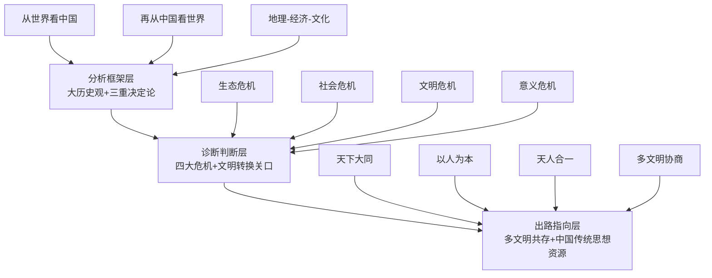

# 《天下格局：文明转换关口的世界》读书笔记

> **作者**：许倬云（著述）/ 冯俊文（整理）
> **出版信息**：岳麓书社 / 博集天卷，2024年8月
> **体裁**：大历史 / 文明比较 / 中国与世界关系

---

## 第一部分：总体归纳

### 全书核心论点速览

| # | 核心论点 | 重要性 | 一句话概括 |
|---|----------|--------|----------|
| 1 | **"天下国家"的超稳定结构** | ⭐⭐⭐ | 中国地理完整性+精耕农业+天人合一，形成全球独一无二的"聚而不散"文明结构 |
| 2 | **轴心时代的东西分途** | ⭐⭐⭐ | 西方走向一神信仰独占性，中国走向"以人为本"自足性——2500年差异的根源 |
| 3 | **精耕农业是超稳定结构的物质基础** | ⭐⭐⭐ | 集约化农业支撑超大规模人口，使"天下国家"具备经济可行性 |
| 4 | **寒冷期驱动历史上的族群大融合** | ⭐⭐ | 气候变迁→游牧南迁→每隔数百年的融合，是中国"定中有变"的历史节律 |
| 5 | **基督教一神论的双重性** | ⭐⭐⭐ | 既赋予西方扩张动力（"选民"意识），也埋下"非我即异端"的冲突基因 |
| 6 | **中国没有"非我不可"的扩张逻辑** | ⭐⭐⭐ | "天下"理念天然包含多元共存，是未来世界秩序的重要思想资源 |
| 7 | **全球化是一个完整周期** | ⭐⭐⭐ | 从大航海到今日逆潮，现代世界体系正经历内在矛盾的全面爆发 |
| 8 | **中国传统经济始终嵌入世界经济** | ⭐⭐ | "内向型"不等于"封闭型"——从丝绸之路到明清白银流入皆是明证 |
| 9 | **西方极端个人主义导致社会溃散** | ⭐⭐⭐ | 原子化个人的极致推展造成社会纽带断裂，这是西方文明的内在危机 |
| 10 | **"世界大同"是未来秩序的核心资源** | ⭐⭐⭐ | 中国"天下大同"不是乌托邦，而是可操作的多文明共存框架 |
| 11 | **全球化进程不会终止** | ⭐⭐ | 逆流是周期性的，物质基础和人类互联需求不可逆转 |
| 12 | **中国文明韧性来自艰难历程的持续锻造** | ⭐⭐ | "前面的来路艰难，中国可能还是幸运的"（许倬云与许纪霖对话） |

---

## 第二部分：逐章详细总结

### 导言：人类文明转换的关口

**核心论点**：人类正处在一个类似于"轴心时代"的文明转换关口。旧的现代世界体系（西方中心、民族国家竞争、资本主义无限增长）的内在矛盾全面爆发，人类需要大历史观才能看清方向。

**重点拆解与展开**：

**重点一："关口"的历史判断——为什么现在是文明转换的时刻？**
许倬云用大历史尺度判断：1500年大航海以来建立的"现代世界体系"经过500年运行，已显露出四大危机征兆：生态危机（气候变化、资源枯竭）、社会危机（西方社会撕裂、民粹兴起）、文明危机（不同文明间冲突而非融合）、意义危机（现代性带来的精神空虚）。这四大危机是同一深层结构危机的不同表现——"现代世界体系"本身已到需要被超越的历史时刻。许倬云特别指出：这个"关口"类似于历史上的轴心时代——那一次，各大文明同时出现了精神觉醒；这一次，各大文明需要同时找到超越现代世界体系的新出路。把当下的混乱仅视为"暂时的困难"是短视的，它实际上是文明层次"换挡"的阵痛。

**重点二："从世界看中国，再从中国看世界"的方法论**
这是全书最重要的分析框架。两层含义：第一层"从世界看中国"——把中国放在全球文明格局中理解，打破"中国中心论"盲区。例如：只有放在全球农业文明比较中，才能理解中国精耕农业的独特性；只有放在全球帝国主义扩张脉络中，才能理解中国近代屈辱的深层结构。第二层"再从中国看世界"——用中国文明视角重新审视全球问题，打破"西方中心论"盲区。例如：用"天下"理念看全球治理，就不再是"霸权稳定论"，而是"多元共存、和而不同"的秩序观。许倬云强调：这两层视角要同时睁开——一只眼看中国，一只眼看世界，不让任何一只眼睛独占视野。这是他毕生学术方法的浓缩，也是本书的灵魂。

**重点三：94岁历史学家的紧迫感**
本书出版时许倬云已94岁，他在导言中流露的紧迫感贯穿全书："我写这本书，是因为我看到了一个关口——这个关口决定了人类未来是走向更大的冲突，还是走向一个新的共存秩序。"这种紧迫感来自他对历史节律的深刻理解：历史上的"关口"往往只有几十年时间窗口，窗口关闭后，历史就沿着惯性走下去，再难逆转。他寄望于中国青年——特别是能够"两只眼睛同时睁开"的一代——在文明转换的关口扮演积极角色，而非被动承受者。他多次引用孔子"士不可不弘毅，任重而道远"来寄望年轻一代。这种期许不是抽象的——他具体指出，青年需要同时具备两种能力：深入理解中国文明传统的能力，和理解全球文明格局的能力。

**关键洞察**：
1. "关口"不是危机，而是机遇——历史上的大转折往往催生新的文明可能性。
2. 大历史观的本质是"同时站在月球上看地球和站在地球上感受泥土"。

**行动清单**：
- [ ] 用"从世界看中国"视角重新审视一个熟悉的中国历史问题（如朝贡体系、科举制度）
- [ ] 用"从中国看世界"视角重新审视一个当代全球议题（如AI治理、气候变化）
- [ ] 思考：在自己专业领域中，有哪些问题"只有大历史尺度才能看清"？

---

### 第一讲："天下国家"的超稳定结构

**核心论点**：中国是全球极少数（与美国并列）拥有完整地理单元、内部无不可逾越障碍的文明体。这种地理结构，加上精耕农业、天人合一观念和全国交通网络，形成了"聚而不散"的超稳定文明结构。

**重点拆解与展开**：

**重点一：地理完整性——"老天给中国的一份厚礼"**
许倬云以地理学精确度描述：东亚大陆被山脉、海洋和沙漠环绕，内部却是连成一片的大平原和河谷盆地（黄河、长江、珠江流域）。这种结构在全球极罕见——欧洲被阿尔卑斯山、地中海分割；印度被喜马拉雅山隔绝于北方；中东被沙漠碎片化。只有中国和美国拥有"内部完整一大片"的地理结构。后果是：人群可以大规模、长距离迁移融合，不需跨越"文明边界"。这与欧洲"山河分割→小国林立→永久竞争"形成鲜明对比。更深层含义：地理完整性是"天下国家"（一个文明覆盖整个可居住疆域）的自然前提——只有在内部无天然障碍的土地上，才能生长出"普天之下莫非王土"的政治想象。许倬云进一步指出：这也解释了为什么中国历史上"分久必合"是常态——因为地理完整性使得"重新统一"在经济和军事上都是可行的，而"永久分裂"反而需要持续外力维持。

**重点二：精耕农业——超稳定结构的物质基础**
中国很早就发展出集约化精耕农业：水稻双季甚至三季种植、梯田系统、灌溉网络、有机肥循环。同样面积的土地可以养活5-10倍于西欧的人口。精耕农业的物质后果是双重的：正面——支撑超大规模人口（中国长期占全球人口1/3到1/4），大规模剩余产品支撑手工业和城市文明；负面——需要大量劳动力投入，将人口牢牢绑定在土地上，形成"安土重迁"的文化性格。更重要的是：精耕农业区需要稳定有序的社会组织（水利、防灾都需要集体协作），这天然趋向中央集权和超稳定结构。许倬云用一条因果链总结：地理完整→精耕农业可行→大规模人口→需要复杂社会组织→趋向中央集权→形成天下国家。这是理解中国文明独特性的核心线索，也是"聚而不散"最底层的密码。

**重点三：寒冷期与游牧南迁——"定中有变"的历史节律**
这是许倬云最具原创性的历史动力学模型。他论证：中国历史上的族群融合与气候变迁高度相关。每当寒冷期来临（约每200-300年一个周期），蒙古高原草场退化，游牧民族被迫南迁——这就是"五胡乱华"、"契丹南下"、"蒙古征服"、"满清入关"的深层气候驱动因素。这一模型的深刻之处在于：它解释了为什么中国文明"聚而不散"——因为每一次外来冲击最终都被精耕农业区的高密度人口和文化同化能力所吸收。游牧征服者入住中原后，往往在几代之内就被"农业化"和"儒学化"——因为他们需要精耕农业的税收来维持统治。这就是"定中有变，变中有安"的历史辩证法。《易经》"三易"（简易、变易、不易）恰可诠释：简易=天下国家的核心结构极简洁；变易=具体族群、制度、文化不断演变；不易="聚而不散"的大格局不变。

**重点四：聚而不散的四大要素**
许倬云将"天下国家"的超稳定结构归纳为四大支撑要素：①**天人合一的整体观念**——自然秩序和人间秩序贯通，为"天下"的政治想象提供宇宙论基础；②**内部疆域完整、自成格局**——地理完整性；③**内部族群基本一致**——经过多次融合后，核心族群始终保持文化主导地位，同时不断吸收边缘族群；④**精耕细作农业+遍布全国的交通网**——经济一体化和人员流动网络使"分裂"在经济上代价极高。这四大要素共同构成了中国文明"超稳定"的结构性基础。许倬云的深层判断是：这种超稳定性不是靠武力维持的（否则无法解释元朝和清朝的垮台），而是靠文明吸收能力——一种"消化异质文明因素并将其转化为自身新活力"的独特能力，这是全球其他文明很少具备的。

**关键洞察**：
1. 地理环境是"沉默的奠基者"——理解地理是理解中国历史的起点。
2. "聚而不散"靠的是文明吸收能力，而非武力——元朝、清朝的垮台证明武力无法维持"超稳定"。

**行动清单**：
- [ ] 在理解任何长期历史现象时，先问"地理基础是什么？"
- [ ] 研究一次中国历史上的"分裂时期"，分析它是如何被重新统一的
- [ ] 反思：今日中国的"超大规模市场"是否就是"地理完整性+精耕农业"的现代版本？

---

### 第二讲：轴心时代的中国与世界

**核心论点**：公元前800-200年的"轴心时代"，东西方文明走上了不同道路。西方走向一神信仰的独占性，中国走向"以人为本"的自足性。这一分途决定了此后2500年东西方文明的根本差异。

**重点拆解与展开**：

**重点一：轴心时代的"同时性"与"分途性"**
许倬云强调"同时性"：几乎同一时间段内，中国（孔子、老子、墨子）、印度（佛陀、大雄）、中东（犹太先知、琐罗亚斯德）、希腊（苏格拉底、柏拉图）同时出现深刻的精神觉醒。这不是巧合——各文明区在此时都达到了一定的物质剩余和城市化水平，使得一部分人可以从生存压力中解放出来从事精神探索。但许倬云更强调"分途性"：虽然同时觉醒，但各文明觉醒的方向截然不同。希腊走向"理性求知"（哲学和科学的根源），印度走向"超越解脱"（宗教和冥想的根源），中国走向"人间秩序"（伦理和政治的根源），中东走向"一神信仰"（亚伯拉罕诸教的根源）。这四大方向的分途，奠定了此后人类文明的四大板块。理解这一分途是理解当今世界文明冲突的"第一把钥匙"——今天的文明冲突，本质上是2500年前轴心时代不同觉醒方向的现代性表达。

**重点二：基督教一神论的"动力"与"盲点"**
一神信仰赋予信众极强精神动力——"我们是唯一真神的唯一选民，我们的使命是把真理传给全人类"。这种"选民意识"在西方历史上转化为：探索动力（发现新大陆、科学革命）、经济活动力（新教伦理与资本主义精神）、政治扩张力（殖民主义、"文明使命"）。但许倬云同时尖锐指出了一神论的盲点：正因为"唯一真神"，所以"凡不信者皆为异端"。这种独占性使西方文明在扩张的同时，持续制造"文明边界"和"文明冲突"。从宗教战争到殖民冲突，再到今日"普世价值"与"文明特殊性"的对抗，一神论的独占性基因始终在发挥作用。许倬云的判断是：一神论是西方文明力量的来源，也是其内在冲突的来源——它很难学会"与不同于己的文明真正共存"。这一分析与亨廷顿《文明的冲突》形成有趣呼应，但许倬云的视角更历史、更深层——他不是在描述当代现象，而是在追溯其文明基因。

**重点三：中国"以人为本"的自足性**
孔子及此后的中国思想传统，最核心的特征是"以人为本"——不需要外在的神来赋予生命意义，意义就在人与人的关系之中（君臣、父子、夫妇、兄弟、朋友），就在人与自然的和谐之中（天人合一）。这种思想结构的后果是：中国文明没有"传教"冲动——因为真理不在"唯一的神"那里，而在"人人皆可成尧舜"的内在德性之中。许倬云特别强调：这与"自信"不同——中国文明不是不自信，而是它的自信不需要通过"否定他人"来获得。这种"自足性"使中国文明在历史上表现出极强的吸收能力（佛教传入后被中国化，游牧征服后被文化同化），而不是排外能力。许倬云认为，这种特性在今日世界尤其珍贵：在一个多种文明共存的世界里，"不需要否定他人来证明自己"的文明才是最可持续的文明。

**重点四：两种人间秩序的对照——对未来世界秩序的启示**
西方文明的人间秩序以"神-人关系"为底层结构——人间正义、法律、道德最终都要诉诸"神的意志"（自然法、天赋人权都是这种结构的世俗化版本）。优点是提供超越性价值锚点，缺点是难以容纳"与我不信同一位神的人"。中国文明的人间秩序以"天-地-人"三重结构为底层框架——人在天地之间，既要顺应天时（自然秩序），也要安顿人间（伦理秩序）。优点是：不需要"信同一个神"才能共存——只要承认"我们都在天地之间"，就可以对话和合作。许倬云认为，这正是未来多文明世界最需要的秩序理念：一个不依赖"共同信仰"就能维持合作的全球秩序框架。他在附录中与李善友的对话里进一步发挥：人类正在经历一个"新的轴心时代"，而中国思想可能是这个新轴心时代最重要的思想资源之一。

**关键洞察**：
1. 轴心时代的分途不是"谁对谁错"，而是"各自回答了不同的问题"。
2. 中国文明最被低估的特质是"自足性"——不需要靠打败别人来证明自己。

**行动清单**：
- [ ] 听到"中国文化缺乏超越性维度"时，用"天-地-人"三重结构来回应
- [ ] 阅读《论语》时，体会"以人为本"不是"以人为中心无所敬畏"
- [ ] 分析国际冲突时，问："这个冲突的背后，有没有一神论独占性思维的影子？"

---

### 第三讲：民族崛起与近现代世界的诞生

**核心论点**："民族国家"是西方文明的特定产物，在过去500年中重塑了全球秩序。中国被这一体系强行拖入后，经历了从"天下国家"到"民族国家"的艰难转型。

**重点拆解与展开**：

**重点一：民族国家——西方送给世界的"特洛伊木马"**
民族国家体系是西方基督教文明在特定历史条件下的产物（威斯特伐利亚和约，1648年），但它被包装成"普世的政治组织形式"输出给全世界。民族国家的核心逻辑是：全球被划分为若干个排他性的"主权领土"，每个领土内只能有一种最高政治权威。这种逻辑对西方基督教文明来说是自然的（它本来就有"信徒共同体"的组织经验），但对于其他文明来说却是外来的。许倬云特别分析了这种输出的后果：非西方文明在被纳入民族国家体系时，往往被迫将自己的文明疆域"裁剪"成民族国家的形状——这就是中东任意划界、印巴分治、以及中国历史上"边疆民族问题"的深层来源。许倬云用"特洛伊木马"比喻十分精到：民族国家体系看起来是"现代性的必要条件"，但实际上把西方文明的核心假设（排他性主权、同质化人民）悄悄植入了所有接受它的文明之中，造成了持久的文明内伤。

**重点二：从"天下"到"国家"——中国文明最痛苦的概念转换**
在传统的"天下"观念中，中国是世界文明的顶峰，但不认为需要与其他"国家"进行排他性的主权竞争——因为"天下"是一个文化概念，不是领土概念，任何族群都可以通过接受中华文明而成为"天下"的一部分。但近代以来，在西方民族国家体系的冲击下，中国被迫接受了"主权国家"的逻辑——需要划定固定边界、定义"中国人"的排他性身份、需要在国际体系中作为"一个主权单位"与其他国家竞争。这个转换的痛苦在于：它要求中国文明否定自己最深层的"天下"本能——从"有教无类"转向"非我族类，其心必异"。许倬云特别指出：这种转换不是一次性的，而是持续了整个20世纪，并且在今天仍然在进行——如何在保持"民族国家"竞争力的同时，不丧失"天下"的文明胸怀，是中国面临的最深刻的政治文化难题。

**重点三：民族国家的内在矛盾——同质化冲动 vs 多元现实**
民族国家的理想类型是"一个民族，一个国家"，但当今世界几乎没有一个国家符合这个理想——几乎所有国家都是多民族、多文化的。这就产生了持续的内部张力：国家机器总是倾向于推动"民族建构"，即通过教育、语言政策、文化政策，将国内所有族群同化为"同一个民族"。但这种同化往往遭遇激烈抵抗——弱势民族以"民族自决"的名义要求独立。这就是全球范围内民族主义冲突的根源。许倬云指出：这个矛盾在"天下国家"的传统中是不存在的——中国历史上虽然有族群融合，但从来没有要求所有族群"变成同一种人"。近代以来接受民族国家逻辑后，这个矛盾才被制造出来。许倬云的深层诊断是：民族国家体系本身就是一种"制造冲突的机器"——它把文明内部本可以和平共处的多样性，转化成了零和的政治竞争。

**关键洞察**：
1. 民族国家体系不是"历史的终点"，而是一个特定文明的特定产物——它有有效期。
2. 中国从"天下"到"国家"的转型，是人类历史上最大规模的文明概念转换。

**行动清单**：
- [ ] 研究任何"民族冲突"问题时，先问："这个问题是民族国家体系制造出来的吗？"
- [ ] 思考："一国两制"等中国实践，在文明层面上的意义是什么？
- [ ] 对比中西方对"统一"与"自决"的不同理解——文明根源是什么？

---

### 第四讲：全球化视野下的中国经济形态

**核心论点**：从"全球化"视角重新审视中国传统内向型经济形态，可以发现它并不是真正封闭的——精耕农业的剩余产品、长距离贸易网络、以及对外开放的特定窗口，使中国经济始终是全球体系的重要参与者和塑造者。

**重点拆解与展开**：

**重点一：精耕农业的剩余逻辑——"内向"不等于"封闭"**
许倬云首先纠正了一个广泛误解：中国传统经济是"封闭的"、"内向的"。他指出，这个判断是把"精耕农业文明的经济形态"误读为"主动选择封闭"。事实是：精耕农业的高产出效率，使得中国可以在不依赖大规模远程贸易的情况下维持文明运转——这不是"不想贸易"，而是"不需要大规模贸易也能活得很好"。许倬云用数据说明：明清时期中国国内贸易的规模（以运河系统、驿道系统、市镇网络为支撑）实际上远超同时期欧洲的国际贸易规模——中国有一个巨大的"国内市场"，而这个市场的整合程度在世界上是独一无二的。在这种意义上，中国传统经济的"内向型"是一种"有能力内向"的自信表现，而不是"被迫内向"的封闭表现。理解这一点对于理解今日中国的"双循环"战略非常重要——"国内大循环"不是新东西，而是精耕农业文明内向型经济形态的现代升级。

**重点二：历史上的中国全球经济参与**
许倬云用丰富史料证明：中国经济始终是全球贸易体系的重要参与者。他梳理了几个关键历史节点：①**丝绸之路**（汉唐时期）：中国丝绸、瓷器、茶叶向西域和欧洲输出，同时输入佛教、金银、香料；②**宋元海上贸易**：泉州、广州成为当时世界上最大的港口，阿拉伯、波斯、欧洲商人云集；③**明清白银流入**：西班牙人从美洲开采的白银约有一半最终流入了中国（通过马尼拉大帆船贸易），中国实际上是当时全球贸易的"最终消费者"和"白银黑洞"。许倬云特别强调：白银大规模流入对中国经济的意义，相当于今日"美元作为全球储备货币"——它说明中国经济在当时全球体系中的核心地位。这些历史事实共同反驳了"中国自古封闭"的刻板印象，也说明"全球化"不是西方发明的东西，而是人类经济交往的自然形态——西方只是过去500年里全球化的主导者，但不是全球化的发明者。

**重点三：朝贡体系——"国际贸易+安全保证"的套装**
许倬云对朝贡体系进行了重新解读。传统西方观点把朝贡体系解读为"中国中心主义的傲慢体现"。许倬云指出，这种解读完全颠倒了朝贡体系的实质功能。他指出：朝贡体系实际上是一套"国际贸易+区域安全保证"的套装服务——周边国家通过参加朝贡仪式（成本极低：一些土特产），换取了三样东西：①**贸易权**（朝贡使团附带的大规模贸易活动，往往比正式国际贸易更划算）；②**安全保证**（中国承诺不在朝贡国边境用兵）；③**政治合法性**（朝贡国统治者可以用"中国认可"来巩固自己的国内地位）。许倬云用数据说明：朝贡体系下的贸易规模，在明清时期实际上远超同时期欧洲殖民帝国的贸易规模。朝贡体系不是"殖民体系"的相反面，而是另一种形态的"区域秩序安排"——它以文化和贸易为纽带，而不是以武力征服为纽带。这一历史经验对今日"一带一路"有启发意义。

**关键洞察**：
1. "内向型经济"不是"封闭型经济"——中国有巨大的国内市场，不需要依赖远程贸易也能维持文明运转。
2. 朝贡体系是早于西方殖民体系的另一种区域秩序安排，其历史经验值得重新审视。

**行动清单**：
- [ ] 研究"中国对外开放"问题时，先厘清："开放"是指"加入西方主导的体系"还是"参与多元的全球交换"？
- [ ] 思考：今日"一带一路"与历史上的朝贡体系，在文明逻辑上是否有连续性？
- [ ] 研究一次中国参与全球贸易的具体历史事件，理解中国在全球体系中的历史角色。

---

### 第五讲：近代世界的生成与中国商业文明

**核心论点**：近代以来中国被深度卷入世界贸易体系后，中西两种文明发生了实质性互动。这种互动不是单向的"西方冲击-中国反应"，而是双向的、复杂的文明对话。

**重点拆解与展开**：

**重点一：两个需要破除的误读**
许倬云在这一讲开头破除两个广泛流行的误读：①**"西方冲击-中国反应"模式**——把中国的近代化描述为被动的、反应性的过程。许倬云指出，这种描述忽略了中国人自己的主动性——洋务运动、戊戌变法、辛亥革命，都是中国人基于自己对世界局势的判断而做出的主动选择，不是简单的"被西方冲击后的反应"。②**"中国停滞论"**——把1840年前的中国描述为"停滞的"、"没有变化的历史"。许倬云用大量数据反驳：明清时期中国经济仍在持续增长，人口从约5000万增长到约4亿，农业生产率不断提高，手工业高度发达——这不是"停滞"，而是"在精耕农业框架内的发展"。这两个误读的共同根源是西方中心论的历史叙事——它把西方当作"主动者"和"标准"，把其他文明当作"被动者"和"偏差"。许倬云的整体目标是：把中国从"西方叙事的配角"还原为"自己历史的主角"。

**重点二：中国商业文明的传统与近代转型**
许倬云梳理了中国商业文明的传统脉络：从春秋战国时期的商人阶层（范蠡、吕不韦），到宋元时期的海上贸易网络，再到明清时期的国内市镇网络和长途贸易（晋商、徽商、粤商）。他指出，中国商业文明有自己独特的性格：①**与政治权力紧密结合**（"士农工商"的等级中，商人始终需要依附政治权力）；②**基于血缘和地缘的信任网络**（晋商的票号网络、徽商的宗族网络）；③**与精耕农业的高度嵌合**（商业利润最终往往回流到土地购置和科举教育）。这种性格使得中国商业文明在近代面对西方工业资本主义冲击时，表现出复杂的反应：一方面，传统的商业网络为中国的早期工业化提供了资金、信息和组织经验；另一方面，传统的"商依附于政"的模式，也使得中国难以自发产生西方意义上的"独立资产阶级"和"资本主义精神"。许倬云的论述，实际上是在为"为什么中国没有自发产生工业革命"这个"大分流"问题，提供一个文明层次的答案。

**重点三：中西文明互动的双向性**
许倬云特别强调：近代以来的中西文明互动不是单向的"西方影响中国"，而是双向的。他用几个具体案例说明：①**中国对西方的影响**——中国的瓷器、茶叶、丝绸深刻改变了欧洲人的生活方式和消费习惯，中国园林影响了英国的风景园林运动，中国科举制度影响了西方文官制度的形成；②**西方对中国的影响**——这个大家都熟悉，但许倬云指出，西方影响中国的路径也是高度选择性的——中国接受了西方的技术和制度（军工、铁路、 telegraph、立宪），但始终拒绝接受西方的"文明替代"（即全面西方化）。这种"选择性现代化"实际上是中国文明"自足性"在近代的延续——许倬云把它与日本明治维新的"和魂洋才"并列，作为非西方文明应对西方冲击的成功案例。他特别指出：中国式现代化道路的雏形，实际上在晚清就已经出现了——只是被此后的革命叙事所掩盖。

**关键洞察**：
1. "西方冲击-中国反应"模式掩盖了中国人的历史主动性——洋务运动、戊戌变法、辛亥革命都是主动选择。
2. 中国商业文明的独特性格（与政治权力结合、血缘地缘信任网络）是理解"大分流"的重要变量。

**行动清单**：
- [ ] 在研究中国近代史时，有意识地寻找"中国人的主动选择"而非仅仅是"对西方冲击的反应"
- [ ] 思考：中国商业文明的"信任网络"传统，在今日中国的商业实践中是否仍然存在？
- [ ] 比较"选择性现代化"（中国、日本）与"全面西方化"（部分发展中国家）的不同结果

---

### 第六讲：世界贸易体系的形成及兴衰

**核心论点**：现代世界贸易体系从1500年大航海开始，经历了一个完整的"兴起—鼎盛—危机"周期。我们今天正处于这个周期的转折关口——旧的体系正在瓦解，新的体系尚未成形。

**重点拆解与展开**：

**重点一：大航海——世界贸易体系的起点及其不平等结构**
许倬云把1500年大航海定位为现代世界贸易体系的起点。他指出，这个起点从一开始就包含一个根本性的不平等结构：西欧国家（葡萄牙、西班牙、荷兰、英国）掌握了远洋航行技术和海上武力，从而能够单方面决定贸易的规则、路线和价格。美洲的白银、非洲的奴隶、亚洲的香料和丝绸——所有这些商品都是沿着西欧国家设定的贸易网络流动的。许倬云特别强调：这个体系的不平等不是"偶然的偏差"，而是"结构性的必然"——因为体系的起点就是武力征服和殖民地掠夺，而不是平等互利的交换。他引用数据：1500-1800年间，约有1200万非洲奴隶被运往美洲，约有一半在途中死亡——这是现代世界贸易体系"原始积累"的血腥面。许倬云的深层诊断是：今日全球南北差距、发达国家与发展中国家的矛盾，都可以追溯到这个起点——现代世界贸易体系从一开始就是"不平等的"，而这种不平等被"自由贸易"的意识形态话语所掩盖。

**重点二：工业革命的"双刃剑"效应**
许倬云分析工业革命对世界贸易体系的双重影响。正面：工业革命极大地提高了生产力，使得商品的大规模、长距离贸易成为可能——铁路、蒸汽船、电报，把全球真正连成了一个市场。负面：工业革命也极大地拉大了发达国家与非发达国家之间的生产力差距——英国在1850年的工业产量占全球约60%，而其他地区基本上被锁定在"原材料供应地"的位置上。许倬云特别指出一个关键机制：**"不平等交换"**——工业国向农业国出口工业制成品（高附加值），从农业国进口原材料（低附加值），这种交换结构本身就不断再生产不平等。他用这个机制来解释：为什么许多发展中国家在独立后仍然难以实现经济起飞——因为它们已经被锁定在全球分工链的低端。许倬云的分析，与今天的"全球价值链"和"产业外移"问题形成直接对话——"不平等交换"的机制在今天以新的形式（知识产权、品牌、标准）继续存在。

**重点三：二战后布雷顿森林体系——全球化的"黄金时代"**
许倬云把1945-1971年（布雷顿森林体系时期）定位为全球化的"黄金时代"。这一时期的特征是：美国主导建立了相对公平的国际经济秩序——世界银行、国际货币基金组织、关贸总协定（WTO前身），都是这一时期建立的制度。美元与黄金挂钩（35美元兑1盎司黄金），其他货币与美元挂钩，全球汇率相对稳定。国际贸易快速增长，西欧和日本在美国的帮助下实现了经济重建。许倬云指出，这个"黄金时代"有两个重要前提：①**美国的经济霸权**（美国占全球GDP约50%，有能力提供全球公共产品）；②**冷战的政治框架**（资本主义阵营需要团结一致对抗苏联，因此需要照顾盟友的经济利益）。这两个前提的存在，使得这一时期的全球化相对"温和"——它是有管理的全球化，而不是野蛮的自由贸易。许倬云的潜台词是：今日的全球化退潮，本质上是因为这两个前提都已经消失了——美国不再有能力或意愿提供全球公共产品，冷战后的"历史终结论"幻觉使得西方放弃了"照顾盟友利益"的克制。

**重点四：新自由主义的全球化狂飙与危机**
1970年代末，随着布雷顿森林体系崩溃（尼克松宣布美元与黄金脱钩）、石油危机爆发、以及英美转向新自由主义（里根-撒切尔革命），全球化进入了一个全新的、更激进的阶段。许倬云描述了这一阶段的核心特征：①**金融资本自由化**——资本可以不受限制地在全球流动，金融投机的规模远超实体经济；②**产业外移**——发达国家的制造业大规模转移到发展中国家（特别是中国），导致发达国家内部出现"铁锈地带"；③**不平等加剧**——全球层面的南北差距扩大，国家内部的不平等（顶层1% vs 底层50%）也急剧扩大。许倬云引用托马斯·皮凯蒂的数据：1980-2016年间，全球顶层1%人群获得了全球收入增长的27%，底层50%只获得了12%。他的诊断很明确：新自由主义全球化在创造财富的同时，也在制造它自身无法解决的社会和政治危机——民粹主义、保护主义、民族主义，都是这个危机的政治表现。我们今天所处的"全球化逆潮"，本质上就是这个危机的全面爆发。

**关键洞察**：
1. 现代世界贸易体系从一开始就包含结构性不平等——今日全球南北差距的历史根源。
2. 新自由主义全球化的危机不是"偶然的"，而是其内在矛盾（资本自由vs.社会保护）的必然爆发。

**行动清单**：
- [ ] 在分析任何"全球不平等"问题时，追溯其到1500年大航海的源头
- [ ] 思考：今日的"逆全球化"是周期性波动还是结构性转折？
- [ ] 研究一个具体案例：某个发展中国家在被纳入现代世界贸易体系后，是受益了还是被损害了？

---

### 第七讲：全球化贸易的世界格局

**核心论点**：以全球化贸易为基础形成了全新的世界格局。这个格局在表面上是以"自由贸易"和"比较优势"为原则运行的，但实际上始终受到政治权力和不平等交换结构的深刻塑造。

**重点拆解与展开**：

**重点一：全球分工链的"中心-外围"结构**
许倬云指出，今日的全球贸易格局仍然延续着"中心-外围"的不平等结构：中心国家（主要是西方国家）掌握着全球价值链的高端——品牌、设计、核心技术、金融服务，外围国家（主要是发展中国家）处于全球价值链的低端——原材料供应、低端制造、污染性产业。这种结构的维持，靠的不是"自由贸易"的理论逻辑，而是中心国家实际掌握的三样东西：①**技术标准**（谁制定标准，谁就掌握利润分配权）；②**金融权力**（美元作为全球储备货币，使得美国可以实质上"征税"全球）；③**军事保护**（中心国家有能力保护自己的全球供应链，同时打断竞争对手的供应链）。许倬云特别指出：中国在过去40年中的崛起，本质上是从"外围"向"中心"的半被动、半主动的移动——中国通过加入全球分工链，逐步掌握了制造能力，现在正在向技术标准和金融权力发起挑战。这正是今日中美战略竞争的核心经济维度。

**重点二：中国的"世界工厂"地位及其全球影响**
许倬云分析了中国在过去40年中融入全球贸易体系的路径和后果。中国的策略是：利用超大规模劳动力市场、完整的基础设施和产业链配套，吸引全球制造业向中国转移，逐步从低端制造向高端制造升级。这一策略取得了巨大成功——中国今天是全球130多个国家和地区的最大贸易伙伴，制造业增加值占全球约30%。但许倬云同时指出这个成功带来的全球后果：①**发达国家制造业外移**——美国"铁锈地带"、欧洲部分工业区的衰落，与中国制造业崛起有直接关系；②**其他发展中国家的"去工业化"**——中国的制造业竞争力太强，使得许多其他发展中国家（如墨西哥、土耳其、东南亚国家）难以发展自己的制造业；③**全球对"中国制造"的依赖**——新冠疫情和俄乌战争暴露了全球供应链的脆弱性，各国开始重新思考"效率优先"的全球化逻辑。许倬云的深层判断是：中国崛起正在迫使全球贸易体系进行一次深刻的重新配置——从"效率优先"转向"安全与效率并重"，从"一国主导"转向"多极并存"。

**重点三：全球贸易体系的"再国家化"趋势**
许倬云观察到，近年来全球贸易体系出现了一个明显的"再国家化"趋势：各国政府重新强调"经济安全"、"供应链韧性"、"产业回流"。这种趋势的表现包括：美国推动"友岸外包"（freind-shoring）、欧盟提出"战略自主"、日本推动供应链多元化、印度推行"自力更生"（Atmanirbhar Bharat）。许倬云指出，这种"再国家化"本质上是对新自由主义全球化的修正——它承认了"自由贸易"理论的一个根本缺陷：它假设所有参与者都是"单纯的经济主体"，但实际上所有参与者都是"嵌入在国家之中的"，国家安全、就业、技术主权，都是不能被"比较优势"理论覆盖的真实国家利益。许倬云的深层诊断是：我们正在见证从"超级全球化"（hyper-globalization）向"有管理的全球化"的回归——这与1945-1971年布雷顿森林体系时期的逻辑有相似之处，但今天的国际权力结构已经大不相同（多极化而非美国霸权），所以新的"有管理的全球化"将是一个更复杂的、需要各大文明核心国家协商的秩序。

**关键洞察**：
1. 全球分工链的"中心-外围"结构靠的不是"自由贸易"，而是技术标准、金融权力和军事保护。
2. 我们正在从"超级全球化"向"有管理的全球化"回归——但需要新的协商机制。

**行动清单**：
- [ ] 分析任一全球贸易争端时，先问："这个问题背后的'中心-外围'结构是什么？"
- [ ] 思考：中国从"外围"向"中心"的移动，会遇到哪些结构性的阻力？
- [ ] 研究"再国家化"趋势在自己所在行业的具体表现和影响

---

### 第八讲：未来世界的几个方向

**核心论点**：在"全球化"走入低谷的今天，人类面临几个可能的未来方向。中国应该坚持的道路是：在保持开放的同时，重新激活中国文明的传统资源，为人类提供一个超越西方现代性的文明可能性。

**重点拆解与展开**：

**重点一：三种可能的未来情景**
许倬云提出了三种可能的未来情景：①**情景一：西方中心秩序的延续**——西方（特别是美国）通过内部改革和自我调整，维持其在全球体系中的主导地位，全球化在美国主导下继续推进（但会更强调"有管理的贸易"和"价值观同盟"）。许倬云认为这种情景的可能性在下降——因为西方内部的社会撕裂和财政约束，使得它越来越难以提供全球公共产品。②**情景二：文明冲突的升级**——不同文明之间的冲突（特别是西方 vs 伊斯兰、西方 vs 中华文明）升级为全球规模的对抗，全球化彻底逆转，世界分裂成若干个相互对抗的文明集团。许倬云认为这种情景是最危险的，但也是可以通过明智的政策来避免的。③**情景三：多文明共存的新秩序**——各文明核心国家通过协商，建立一个基于"相互尊重、和而不同"原则的国际秩序，全球化在新的、更公平的规则下继续推进。许倬云明确表示：情景三是他所期望的，也是中国传统文化资源最能为之贡献智慧的情景。

**重点二：中国传统思想的当代价值**
许倬云在这一讲中系统阐述了中国传统思想对构建未来世界秩序的潜在贡献。他聚焦三个核心观念：①**"天下大同"**——不是"全世界变成一个统一的国家"，而是"全世界不同文明和平共存、互利合作"。"大同"的本质是"和而不同"，不是"同一"。这种观念可以为全球治理提供一个不同于"普世价值输出"的框架。②**"以人为本"**——不是"以人为中心无所敬畏"，而是"意义在人与人的关系之中"。这种观念可以矫正西方极端个人主义造成的"社会溃散"问题。③**"天人合一"**——不是"人类中心主义"，而是"人类是自然的一部分"。这种观念可以为全球生态治理提供一个不同于"无限增长"的框架。许倬云特别强调：这些观念不是要向全世界"传教"（中国文明没有传教传统），而是要"提供给全世界参考"——让其他文明看到，除了西方现代性之外，还存在着其他的可能性。

**重点三：中国应该走什么路？**
许倬云在全书结尾处给出了他对中国的期望。他认为，中国应该走一条"立足自身传统、面向全球未来"的道路。具体而言：①**对内**：继续推进现代化，但不以放弃自身文明特性为代价。特别是在教育、社会治理、生态保护等领域，应该更多运用中国传统的智慧资源。②**对外**：坚持开放和全球化，但不再以"变得像西方"为目标，而是以"在人类文明中做出中国独特的贡献"为目标。中国应该成为"多文明共存"理念的最坚定倡导者和实践者。③**对文明的态度**：既不妄自菲薄（认为中国文明是"落后的"），也不妄自尊大（认为中国文明是"唯一正确的"）。许倬云用一句话总结："世界需要中国，中国也需要世界——理解二者的不可分割性，是关键。"这句话既是全书的出发点和落脚点，也是许倬云对当代中国青年最深的寄望。

**关键洞察**：
1. 未来世界的三种情景中，"多文明共存的新秩序"是最优解，但需要各文明核心国家的克制和智慧。
2. 中国传统的"天下大同"、"以人为本"、"天人合一"三大观念，是未来世界秩序最重要的思想资源之一。

**行动清单**：
- [ ] 在思考中国未来道路时，同时问"这对世界意味着什么？"——把中国问题放在全球框架中思考
- [ ] 深入研究一个中国传统观念（如"大同"、"天人合一"），思考它在当代的全球意义
- [ ] 在自己的专业领域中，探索如何既吸收全球先进经验，又保持中国文明的主体性

---

### 结语：全球化的进程不会终止

**核心论点**：尽管全球化遭遇逆流，但全球化的物质基础和人类互联的需求不可逆转。关键是人类能否在文明转换的关口，找到一条超越西方现代性困境的新路。

**重点拆解与展开**：

**重点一：为什么全球化不会终止？**
许倬云给出了三个层次的论证。第一层（技术层次）：现代交通、通信、信息技术已经把全球连成了一个"地球村"——疫情可以全球传播，金融市场可以实时联动，供应链跨越数十个国家——这种互联互通的物质基础一旦形成，就不可能被完全逆转。第二层（经济层次）：全球分工体系虽然面临重新配置，但完全"脱钩"的成本对任何国家来说都高到不可接受——即使是积极推动"友岸外包"的美国，也无法真正摆脱对中国供应链的依赖。第三层（文明层次）：人类面临的全球性挑战（气候变化、传染病、AI治理、核扩散）只能通过全球合作来解决——没有任何一个文明或国家可以单独应对这些挑战。这三层论证共同支持一个结论：全球化可能会改变形态（从"超级全球化"转向"有管理的全球化"），但不会终止。许倬云的深层判断是：那些宣布"全球化已死"的人，是把"西方主导的全球化"等同于"全球化"本身了——实际上，正在死亡的是"西方中心版的全球化"，而不是"全球化"这个人类交往的基本形态。

**重点二：关口的选择——人类向何处去？**
结语的核心是一个选择：人类在文明转换的关口，究竟选择走向更大的冲突，还是走向新的共存秩序？许倬云坦言，他没有答案——因为这个问题的答案不取决于历史学家的分析，而取决于当代人的选择。但他给出了一个方向性的指引：人类需要找到一种方式，使得不同文明可以在不放弃自身特性的前提下和平共处。这不是"普世价值"的老路（它要求所有文明变得一样），也不是"文明隔离"的死路（它使得全球性挑战无法被应对），而是一条"和而不同"的新路。许倬云认为，中国文明的传统资源（天下大同、以人为本、天人合一）可以为这条新路提供重要的思想成分。他在结语的最后，再次引用了孔子的话："士不可不弘毅，任重而道远"——但这一次，他是在对全人类说话，而不仅仅是对中国人说话。

**关键洞察**：
1. 正在死亡的是"西方中心版的全球化"，而不是"全球化"本身。
2. 文明转换关口的选择，取决于当代人的行动，而不取决于历史学家的分析。

---

## 第三部分：核心思想体系

### 一、哲学三层次结构

许倬云的思想体系可分为三个层次：

**第一层：分析框架（怎么看历史）**
- "从世界看中国，再从中国看世界"的大历史观
- 地理-经济-文化的三重决定论（地理是基础，经济是动力，文化是表达）
- 长时段历史节律（气候周期、文明兴衰周期、全球化周期）

**第二层：诊断判断（世界怎么了）**
- 现代世界体系（西方中心、民族国家、资本主义无限增长）正经历内在危机
- 四大危机并发：生态、社会、文明、意义
- 我们正处于类似于"轴心时代"的文明转换关口

**第三层：出路指向（应该怎么办）**
- 中国应走"立足自身传统、面向全球未来"的道路
- 人类应建立"多文明共存"的新秩序
- 中国传统思想（天下大同、以人为本、天人合一）是未来秩序的重要资源

### 二、决策检查清单

当面对涉及中国与世界关系的问题时，用以下清单检验：

| # | 检查项 | ✓/✗ |
|---|-------|-----|
| 1 | 这个问题是否只用"西方中心"框架才能理解？有没有中国视角的不同答案？ | |
| 2 | 中国的立场是否有其文明传统资源的支撑？（而不只是"国家利益"的算计） | |
| 3 | 是否考虑了"从世界看中国"的维度——中国在全球文明格局中的位置？ | |
| 4 | 是否考虑了"再从中国看世界"的维度——中国视角能为全球问题提供什么不同思路？ | |
| 5 | 在分析近代中国历史时，是否避免了"西方冲击-中国反应"的被动叙事？ | |
| 6 | 在讨论全球化时，是否区分了"西方中心版的全球化"和"全球化"本身？ | |
| 7 | 是否认识到"民族国家"是西方特定产物，而不是"普世的政治形式"？ | |
| 8 | 在思考未来世界秩序时，是否把中国文明传统资源作为方案的一部分？ | |
| 9 | 是否避免了两种极端：妄自菲薄（中国文明落后论）和妄自尊大（中国文明优越论）？ | |
| 10 | 是否认识到：世界需要中国，中国也需要世界——二者不可分割？ | |

### 三、与相关经典的对话

**与亨廷顿《文明的冲突与世界秩序的重建》的对比**：
- 相同点：都认识到冷战后文明差异是国际冲突的重要根源；都反对西方普世主义的傲慢
- 不同点：亨廷顿更悲观（文明冲突不可避免），许倬云更积极（文明共存是可能的）；亨廷顿从"权力转移"角度分析，许倬云从"大历史"角度分析；亨廷顿的核心建议是"西方应放弃普世主义"，许倬云的核心建议是"各文明应共同构建多文明共存秩序"

**与彭慕兰《大分流》的对比**：
- 彭慕兰问："为什么西方在1800年后超越了中国？"（这是一个"分叉点"问题）
- 许倬云问："中国文明的独特性是什么？它在今日世界的可能贡献是什么？"（这是一个"连续性"问题）
- 两本书可以互补：彭慕兰提供"分叉的解释"，许倬云提供"根源的理解"

**与余英时《中国历史思想史》的对比**：
- 余英时更专注于中国思想史的内部脉络梳理
- 许倬云更专注于中国文明与全球文明的对话
- 两本书的关系：余英时提供"理解中国的思想资源"，许倬云提供"这些思想资源的全球意义"

### 四、行动指南——如何在文明转换的关口定位自己

**第一步：建立大历史观**
- 训练自己同时"从世界看中国"和"从中国看世界"
- 在遇到任何重大问题时，先问："这个问题在过去500年、1000年、2000年的尺度上，处于什么位置？"
- 避免"西方中心论"和"中国中心论"两个极端，追求"双视角并重"

**第二步：深入理解中国文明传统**
- 系统阅读中国传统经典（《论语》、《孟子》、《道德经》、《易经》），不只是作为"文学作品"来读，而是作为"理解中国文明基因"的方式来读
- 特别关注那些与西方主流观念不同的中国观念（如"天人合一"vs"征服自然"、"天下大同"vs"普世价值"）

**第三步：理解全球文明的格局和动态**
- 关注不同文明的核心国家（美国、中国、俄罗斯、印度、土耳其、沙特等）的动向
- 理解今日全球冲突的文明维度，而不只是"国家利益"维度

**第四步：在文明转换的关口扮演积极角色**
- 无论从事什么职业，都可以问自己："在我的领域中，文明转换的关口意味着什么？我能为此做些什么？"
- 许倬云对青年的期许是："士不可不弘毅，任重而道远"——在文明层次上，每个人都不是旁观者

---

以上是《天下格局：文明转换关口的世界》的完整读书笔记。许倬云先生以94岁高龄写下的这本书，是一位跨越中西文明的历史学家对"人类向何处去"这一终极问题的最后思考。

如果您想深入探讨某个具体章节、许倬云的历史观方法论、中国传统思想资源的当代意义，或者想了解本书与亨廷顿《文明的冲突》、彭慕兰《大分流》的详细对比，欢迎继续提问。
