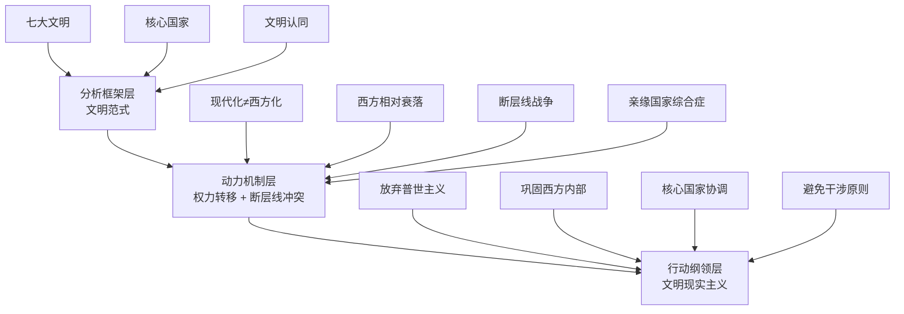

# 《文明的冲突与世界秩序的重建》读书笔记

> **作者**：塞缪尔·亨廷顿（Samuel P. Huntington）
> **出版年份**：1996年
> **体裁**：政治学 / 国际关系 / 地缘政治学
> **核心命题**：冷战后全球政治的核心冲突不再源于意识形态或经济，而是源于不同文明之间的文化差异

---

## 第一部分：总体归纳

### 全书核心论点速览

| # | 核心原则 / 论点 | 重要性 | 一句话概括 |
|---|---------------|--------|----------|
| 1 | **文明范式替代意识形态范式** | ⭐⭐⭐ | 冷战结束后，世界政治的主导分析框架应从"三个世界"转向"七大/八大文明" |
| 2 | **文明认同是最深层认同** | ⭐⭐⭐ | 在"我们是谁"的问题上，文明认同超越国家、民族、阶级认同，成为后冷战时代群体冲突的基础 |
| 3 | **现代化 ≠ 西方化** | ⭐⭐⭐ | 非西方社会可以在不放弃自身文化核心的前提下实现现代化，经济成功反而强化本土文化自信 |
| 4 | **西方正在相对衰落** | ⭐⭐⭐ | 西方的人口、经济、军事占比持续下降，亚洲文明和伊斯兰文明正在崛起 |
| 5 | **文明核心国家是关键变量** | ⭐⭐⭐ | 每个文明由核心国家主导秩序，缺乏核心国家的文明（如伊斯兰文明）更容易陷入内部冲突 |
| 6 | **断层线战争** | ⭐⭐⭐ | 不同文明交界处（如巴尔干、高加索、南亚）是冲突最频发的地带，形成特殊的"断层线战争"模式 |
| 7 | **亲缘国家综合症** | ⭐⭐ | 文明内部的核心国家会出于文明认同支持同文明的冲突方，使局部冲突扩大化 |
| 8 | **西方普世主义的危险** | ⭐⭐⭐ | 西方将自身价值观视为普世价值并强行推广，是文明间冲突的主要催化剂 |
| 9 | **避免全球文明战争** | ⭐⭐⭐ | 文明的核心国家必须遵守"避免干涉"和"共同调解"原则，防止断层线冲突升级为全球文明战争 |
| 10 | **多文明共存的世界秩序** | ⭐⭐ | 未来的和平取决于各大文明承认彼此的边界，在相互尊重的基础上建立多文明的国际秩序 |

---

## 第二部分：逐章详细总结

### 第一章：世界政治的新时代

**核心论点**：冷战结束标志着以意识形态划分全球阵营的时代终结。世界政治进入一个新阶段，冲突的主线不再是"资本主义 vs 共产主义"，而是"不同文明之间的冲突"。

**重点拆解与展开**：

**重点一：从"三个世界"到"七大文明"的范式转换**
亨廷顿认为，冷战后世界需要一个替代旧"三个世界"框架的新范式。他提出的文明范式认为，全球政治正在沿文明断层线重新聚合。这一转换的论证基础是：人群的认同正在从意识形态转向文化/文明层次。亨廷顿引用了广泛的全球冲突数据——1990年代初的48场种族冲突中，一半以上发生在不同文明群体之间。冷战时期的代理人战争（朝鲜、越南、安哥拉）可以被重新解读为文明间冲突的前奏。范式转换的关键在于：我们不能再以"民主 vs 专制"或"富裕 vs 贫穷"的二元框架来理解世界，而必须以文明为基本分析单位。范式是否完美不重要——亨廷顿坦承所有范式都是简化——重要的是它比替代范式更好地解释了已发生的和正在发生的事件。

**重点二：全球政治的首要轴心转向"西方 vs 非西方"**
亨廷顿观察到，冷战结束后，非西方世界的政治动员不再围绕"反资本主义"或"反帝国主义"展开，而是围绕"反对西方文化霸权"展开。1990年代伊斯兰世界对拉什迪《撒旦诗篇》的全球抗议、中国对西方人权外交的系统性抵制、新加坡李光耀倡导的"亚洲价值观"——这些都是"西方 vs 非西方"轴心浮现的实证标志。亨廷顿的论证逻辑是：当意识形态对立消失后，潜伏在底层的文明认同浮上表面。非西方国家不再需要选择站在美国还是苏联一边，它们开始自由地表达自己的文明身份——而这种身份表达天然地带着"不同于西方"的特征。

**重点三：精英层面的"达沃斯文化"幻觉**
亨廷顿敏锐地指出，全球精英（参加达沃斯论坛的那群人）共享一套高度西方化的价值观和文化——英语、西装、自由市场、民主政治、个人主义。这使得西方精英误以为全世界正在趋同。然而，亨廷顿用数据论证：这些精英占各国人口的比例极低（不到1-2%），绝大多数非西方人口仍然根植于本土文明传统，并且随着经济发展，他们的文化自信在增强而非减弱。精英层的"大同文化"恰恰掩盖了大众层面的文明分歧。这个观察解释了为什么西方决策者反复低估非西方国家的文化独立倾向——他们从自己接触的精英样本错误外推了全貌。

**重点四：文明认同的"回归"而非"新造"**
亨廷顿强调，文明认同不是被发明的，而是被唤醒的。1980-90年代伊斯兰复兴运动、印度教民族主义的兴起、东欧后共产主义国家的东正教回归——这些都不是凭空创造的认同，而是对长期被意识形态压抑的本土文明传统的回归。这一论点反驳了"民族主义是精英操纵的产物"的观点。亨廷顿的逻辑是：当苏联的马克思列宁主义意识形态崩塌后，东欧人民没有奔向"普世自由主义"，而是回到了他们熟悉的东正教文明和民族传统。这说明文明认同比意识形态更深层、更持久。

**关键洞察**：
1. 范式的价值不在于"绝对正确"，而在于"比替代品更好"。亨廷顿的文明范式之所以有持久影响力，是因为它比"历史终结论"和"现实主义均势论"更好地预测了后冷战冲突的形态。
2. "达沃斯文化"幻觉至今仍然存在——全球化的精英阶层总是高估文化趋同的程度，低估本土文明认同的持久性。

**行动清单**：
- [ ] 用文明范式重新审视当前国际冲突：分析乌克兰战争时，不只考虑北约东扩的地缘因素，还要纳入东正教文明与西方文明的断层线维度
- [ ] 警惕"达沃斯幻觉"：在分析任何非西方国家的政策时，不要假设精英层的西方化代表了整个社会的文化走向
- [ ] 在个人国际交往中，认识并尊重对方的文明背景，而非默认一套"普世"的沟通规范

---

### 第二章：历史上的文明和今天的文明

**核心论点**：文明是人类最高层次的文化归类，基于语言、历史、宗教、习俗和制度的共同性。当代世界由七大（或八大）主要文明构成：中华文明、日本文明、印度文明、伊斯兰文明、西方文明、拉丁美洲文明和非洲文明。

**重点拆解与展开**：

**重点一：文明是"最广泛的'我们'"**
亨廷顿给文明下了一个关键定义：文明是"人类最高的文化归类，是人们文化认同的最广范围"。换句话说，一个法国人和一个德国人可能在民族层面不同，但在面对一个中国人或沙特人时，他们共享的西方文明身份会被激活。这个定义的论证基础是社会心理学的"内群体/外群体"理论——人们总是在面临更大的"他们"时才意识到自己是"我们"。亨廷顿用这一框架解释了为什么欧洲一体化在文明层面上是可行的（共享西方文明），而土耳其加入欧盟会遭遇巨大阻力（它是伊斯兰文明）。文明边界的"粘性"远超政治意识形态边界。

**重点二：宗教是文明的核心定义要素**
在构成文明的诸多要素（语言、历史、制度、习俗）中，亨廷顿认为宗教是最重要的。他的理由是：宗教回答的是终极问题——生与死、善与恶、人与神的关系——这些问题塑造了一个文明的深层价值观。亨廷顿列举了各大文明的宗教内核：西方文明=基督教（尤其是天主教和新教），伊斯兰文明=伊斯兰教，印度文明=印度教，中华文明=儒家伦理（虽非严格意义上的宗教，但发挥着类似的功能）。宗教的持久性意味着文明差异很难通过政治协议或经济交易消除——因为无法在谈判桌上改变一个民族的信仰体系。

**重点三：七大（或八大）文明的地图与边界**
亨廷顿绘制的文明地图是他理论的基础工程。他将世界分为：西方文明（北美、西欧、澳新）、拉丁美洲文明（中美洲和南美洲，因天主教与本土文化的融合而与西方文明有分界）、东正教文明（俄罗斯及东欧东正教国家）、伊斯兰文明（从北非经中东到东南亚）、中华文明（中国及受儒家文化深刻影响的东亚地区）、日本文明（因其独特性独立于中华文明）、印度文明（以印度教为核心）、非洲文明（撒哈拉以南）。他特别强调，文明边界不是国家边界——一个国家内部可以有不同文明（如尼日利亚的伊斯兰北部和基督教南部），一个文明也可以跨越多个国家。

**重点四：文明边界的历史稳定性**
亨廷顿论证文明边界具有惊人的历史延续性。欧洲的东西分界线大致沿着公元4世纪罗马帝国分裂为东西两部分时的界线——西罗马接受天主教，东罗马接受东正教。这条线至今仍是欧洲政治的分裂线（欧盟 vs 俄罗斯势力范围）。同样，伊斯兰世界与基督教世界的边界在1300年间基本稳定。这一论点的政策含义是：试图强行改变文明边界的行为（如西方在中东推行民主）大概率会失败，因为这些边界扎根于千年的文化土壤。

**关键洞察**：
1. "文明"不是你选择成为什么，而是在面对"异类"时你发现你是什么——这是一个关系性概念而非本质性概念。
2. 文明边界的高度稳定性意味着：短期的政治工程（民主输出、政权更迭）无法改变由宗教和历史定义的深层文化边界。

**行动清单**：
- [ ] 绘制一张"文明地图"：标注当前所有国际热点冲突，看看它们是否落在文明断层线上
- [ ] 在分析国际关系时，加入"宗教因素"这一维度——不只看经济和政治利益，还要看宗教亲缘关系
- [ ] 理解一个国家的"文明归属感"：例如土耳其既想加入欧盟（西方化愿望），又深度嵌入伊斯兰文明——这种矛盾是国家长期困境的深层来源

---

### 第三章：普世文明？现代化与西方化

**核心论点**：不存在所谓的"普世文明"。非西方社会可以在不西方化的前提下实现现代化，而现代化进程本身会增强而非削弱本土文明认同。西方化与现代化是两个不同的过程。

**重点拆解与展开**：

**重点一：对"普世文明"论的四个批判**
亨廷顿系统批判了"人类正在走向普世文明"的观点。他将该观点拆分为四种版本：①"达沃斯文化"版（全球精英共享一套文化）——但精英只占人口的极小比例；②"普世语言"版（英语成为世界语）——但语言只是交流工具，不代表文化认同（日本人说英语但仍然是日本文明）；③"消费趋同"版（全世界喝可口可乐、吃麦当劳）——但消费行为不改变深层信仰；④"民主全球化"版——但民主制度在不同文明中的运行逻辑和结果差异巨大。亨廷顿的结论是：表面层次的全球化（贸易、技术、消费）不等于文明层面的趋同。深层文化——宗教、家庭观念、权威关系、自由的定义——几乎没有趋同。

**重点二：现代化 ≠ 西方化的经典论证**
这是全书最具影响力的论点之一。亨廷顿区分了"现代化"（工业化、城市化、教育普及、技术进步）和"西方化"（采纳西方价值观、制度、生活方式）。他论证：日本是非西方国家最早实现现代化但保持文化独特性的典范——明治维新提出的"和魂洋才"（日本精神+西方技术）策略被证明完全可行。随后，亚洲四小龙（韩国、中国台湾、中国香港、新加坡）重复了这一模式。亨廷顿进一步指出一个反直觉的现象：现代化越成功，本土文化自信越强。经济崛起的非西方社会不是更向西看，而是更向内看——重拾传统、复兴宗教、强调本土价值观的优越性。数据支持：1970-1990年间，伊斯兰国家清真寺数量增长了2-3倍，印度教民族主义政党赢得选举，中国的文化自信与经济增长同步上升。

**重点三："亚洲价值观"的运动本质**
亨廷顿将新加坡李光耀等人倡导的"亚洲价值观"（集体优先于个人、秩序优先于自由、家庭优先于国家）解读为一种"反西方化"的文明宣言。其核心论点是：亚洲社会可以接受西方的技术和制度（市场经济、法治），但拒绝接受西方的价值观基础（原子化个人主义、权利至上）。亨廷顿认为，这种"选择性现代化"策略是中华文明应对西方冲击的核心方案。更深一层：当亚洲领导人大声说出"我们不比西方差"的时候，这本身就是文明自信回归的信号——他们不再以"变得像西方"为目标，而是以"在保持亚洲特性的前提下超越西方"为雄心。

**重点四：现代性有不同版本的可能性**
亨廷顿提出一个核心命题：是否存在一种"非西方的现代性"？他的答案是肯定的。民主制度、市场经济、法治、科学技术——这些现代性的工具可以在不同的文明土壤中生长出不同的形态。日本的"会社主义"资本主义、中国的"社会主义市场经济"、伊斯兰国家的"伊斯兰金融"——这些不是"不纯粹的现代性"，而是"不同版本的现代性"。这一论点彻底动摇了西方中心主义的现代性叙事：西方只是第一个实现现代化的文明，但它的道路不是唯一的道路。

**关键洞察**：
1. "你喜欢可口可乐不代表你喜欢美国"——消费全球化与文明认同完全是两回事。这是亨廷顿对"普世文明"论最有穿透力的反驳。
2. 所有非西方国家都面临一个根本性选择：在现代化过程中，保留本土文化的什么、放弃什么？成功的国家恰恰是那些做出了明智选择的国家（日本、韩国），失败的国家是那些全盘接受或全盘拒绝的国家。

**行动清单**：
- [ ] 在日常思考中训练区分"现代化"和"西方化"：每当有人说"全球化就是西方化"，用本章的论点检验是否成立
- [ ] 研究一个非西方国家（如土耳其、伊朗、印度）的现代化路径，分析它在哪些方面接受了西方，哪些方面保留了本土传统
- [ ] 反思自己对中国现代化的理解：中国的发展是"西方化"还是"具有中国特色的现代化"？

---

### 第四章：西方的衰落：权力、文化和本土化

**核心论点**：西方在全球权力格局中的相对地位正在持续下降。这不是绝对衰败，而是相对衰落——非西方文明的力量增长更快。同时，非西方社会出现广泛的"本土化"运动，重新肯定自身文明价值。

**重点拆解与展开**：

**重点一：相对衰落的四个维度**
亨廷顿从四个可量化维度论证西方的相对衰落：①**领土与人口**——西方控制的领土从1920年代全球的约50%下降到1990年代的约24%，人口占比从约30%下降到约13%，且仍在下降；②**经济份额**——1950年西方占全球GDP约64%，到1992年降至约49%，亚洲（主要是东亚）从约18%升至约33%。亨廷顿引用世界银行的长期趋势数据，指出如果不算日本（日本属于日本文明），非西方经济的增长更为显著；③**军事能力**——核扩散正在消解西方的军事垄断，常规军事技术也在向非西方扩散；④**软实力**——非西方文明开始产生有全球影响力的文化产品（日本动漫、宝莱坞电影、韩流），西方文化不再是被唯一渴求的"高端文化"。这一四维度分析框架使"衰落论"从印象式判断变为可检验的实证命题。

**重点二：本土化浪潮——"去西方化"的文化运动**
亨廷顿观察到1990年代出现了一股全球性的"本土化/去西方化"浪潮：伊斯兰世界的伊斯兰复兴运动、印度的印度教民族主义（1998年印度人民党上台）、中国的文化自信回归、俄罗斯的东正教复兴。这些运动的共同模式是：在政治独立和经济现代化已经实现后，开始进行"文化上的再独立"——清除殖民时期遗留下来的西方文化痕迹，重新建立本土文明的自尊。亨廷顿的逻辑链是：殖民时代是西方政治+经济+文化全面支配 → 非殖民化后获得政治独立 → 经济现代化后获得经济自信 → 现在是文化去殖民化的阶段。这是一个至今仍在进行的漫长过程。

**重点三：西方人口危机——被低估的权力变量**
亨廷顿给予人口因素特殊重视。他指出，1965年西方国家人口占全球20%，到1995年降至14%，预计到2025年降至10%以下。更关键的是，非西方世界的人口更年轻、增长更快，而西方（尤其是欧洲）正在老龄化。人口不只是一个数字问题——年轻人口意味着更多的兵员、更大的劳动力市场、更强的社会活力。亨廷顿特别关注伊斯兰世界的人口爆炸：从1950年到1990年，穆斯林占全球人口比例从约13%上升到约19%，且35岁以下人口占比高达60-70%。这些"青年膨胀"是断层线冲突中最重要的供给方——大量年轻男性需要就业、需要意义、容易被动员。

**重点四：衰落的文化心理效应**
亨廷顿指出，衰落不仅是一个客观过程，也是一种心理体验。对西方而言，衰落意味着焦虑、怀旧、保护主义抬头。他分析道：西方的衰落感会催生两种反应——一种是向内退缩（孤立主义、限制移民），另一种是向外扩张（更激进地推广西方价值观以"扳回一局"）。亨廷顿警告第二种反应尤其危险，因为一个衰落的西方更加坚持其普世主义主张，恰好会激化与非西方文明的冲突。这是理解当今西方民粹主义、反移民政治和"民主推广"冲动的一个深层框架。

**关键洞察**：
1. 西方的衰落是"相对性"的：不是因为西方在变烂，而是因为其他文明在变好——这是理解非西方世界自信来源的关键。
2. 人口是最慢变化的权力变量，但也是最终极的权力变量。谁有人口，谁就有未来。
3. 衰落的心理效应可能比衰落的客观事实更具破坏性——西方的过度反应可能加重而非缓解文明冲突。

**行动清单**：
- [ ] 追踪全球人口统计数据（联合国人口展望），将人口趋势纳入国际政治分析
- [ ] 关注非西方文明的"文化产业"崛起的迹象（如韩国流行文化、中国网文出海、阿拉伯语媒体全球化），这些是软实力增长的标志
- [ ] 反思自己的"西方中心"思维倾向：是否默认西方的制度、价值观、审美就是"标准"？

---

### 第五章：经济、人口和挑战者文明

**核心论点**：亚洲文明（以中华文明为核心）凭借高速经济增长成为西方最强大的潜在挑战者，而伊斯兰文明凭借人口高增长和宗教复兴成为最引人注目的"自信文明"。两个文明以不同的方式挑战西方主导地位。

**重点拆解与展开**：

**重点一：中华文明的"经济挑战"——从人口红利到文明力量**
亨廷顿用大量数据论述东亚经济奇迹的文明基础。1960-1990年，东亚经济年均增长率约为全球平均水平的3倍。如果按购买力平价计算，到2010年代中国GDP可能超过美国。但亨廷顿的分析层次比经济数据更深——他认为东亚经济成功的文化基础（高储蓄率、重视教育、家族企业网络、国家主导的发展模式）本身就是儒家文明的特质。换言之，东亚的成功不是"采纳西方制度"的结果，而是"儒家文明在现代条件下的复兴"。亨廷顿预测，中国经济崛起将带来三重效应：经济上改变全球贸易格局、军事上增强中国武力投射能力、文化上提升中华文明的全球吸引力——一套"文明级"的力量增长而非单纯的国力增长。

**重点二：伊斯兰文明的"人口挑战"——青年膨胀与政治动员**
亨廷顿将伊斯兰文明定位为一个"自信但不强大"的挑战者。伊斯兰世界的人口从1950年约2亿增长到1990年代约10亿，到2025年预计达18亿。高生育率+年轻人口结构=大量缺乏经济机会的年轻男性。这批人成为伊斯兰主义运动最主要的动员对象。亨廷顿指出一个悖论：伊斯兰世界的经济相对落后（除少数石油富国外），但文化自信却空前高涨。这种"自信与实力的脱节"导致了特殊的行为模式——无法通过经济力量挑战西方，于是转而用文化、宗教和不对称冲突（恐怖主义）来表达不满。亨廷顿的深层洞察是：伊斯兰世界的不满本质上不是经济上的（石油国家并不贫穷），而是身份上的——对西方文化支配地位的反抗。

**重点三：日本——西方俱乐部的"异类"**
亨廷顿将日本作为一个特殊案例：它是唯一完全实现现代化的非西方文明，但它从未在文化上被西方化。日本的经济成功没有改变其文明独特性——相反，它增强了日本的文化自信。亨廷顿指出日本在国际政治中的"文明困境"：它想融入西方主导的国际秩序（G7成员），但在文化上无法被西方完全接纳（"黄种人+神道教/佛教文明"）；它想领导亚洲，但二战的历史伤痕和中华文明的崛起使这一愿望难以实现。日本的困境是全书的缩影：在经济和技术层面，不同文明可以深度交融；但在身份和文化层面，文明边界依然坚挺。

**重点四：文明间力量转移的不可逆性**
亨廷顿论证：西方的相对衰落不是一个周期性的波动，而是一个结构性的长期趋势。理由有三：①知识和技术不再为西方垄断——教育普及使得非西方国家可以独立发展技术能力；②资本全球化使非西方国家可以获得发展所需资金；③非西方社会已经找到了适合自己的现代化路径，不需要照搬西方模式。历史性的权力转移正在发生，就像16-19世纪权力从东方转向西方一样，20-21世纪权力正在从西方转回东方。这个判断的政策含义是：西方需要适应一个不再是"唯一主角"的世界，而不是徒劳地试图维持单极霸权。

**关键洞察**：
1. 挑战者文明有两类：用经济挑战的文明（中华文明）和用人口/文化挑战的文明（伊斯兰文明）——它们的策略和效果完全不同。
2. 伊斯兰世界的核心矛盾不是"穷vs富"，而是"有文化自尊但没有相应的政治和经济实力"——这种落差是怨恨的根源。

**行动清单**：
- [ ] 比较中国和伊斯兰世界的当代发展路径，理解"经济自信"与"文化自信"的不同表现形态
- [ ] 关注日本在国际事务中的独特角色——它如何在"西方盟友"和"亚洲文明"两个身份间取得平衡
- [ ] 评估全球力量转移对自己所在行业、国家的长期影响

---

### 第六章：全球政治的文化重构

**核心论点**：冷战后全球政治正在经历一场深刻的文化重构。国家不再是随机结盟的利益机器，而是越来越倾向于与同一文明的国家合作。"文明共同体"正在取代意识形态联盟。

**重点拆解与展开**：

**重点一：文明认同取代意识形态成为结盟基础**
亨廷顿的核心观察是：冷战时期，国家选择盟友取决于意识形态立场（"你是资本主义还是共产主义？"），冷战后，这个问题变成了"你是谁？"——而"你是谁"的答案在文明层次上。数据支撑：1990年代的国际组织——欧盟的扩张完全是西方文明内的扩张；东盟是中华/佛教/伊斯兰混合文明的区域组织；阿拉伯联盟是伊斯兰文明组织；伊斯兰会议组织将56个穆斯林国家聚在一起。几乎没有跨文明的成功政治联盟。亨廷顿的论证是：在缺乏一个共同敌人的情况下（苏联），国家不再需要为了安全利益而跨文明结盟，它们可以自由地"回到自己的同类中去"。

**重点二：核心国家的"同心圆"影响力模式**
亨廷顿提出一个重要的分析模型：每个文明由核心国家主导，其影响力呈同心圆式分布。核心圈是文化高度相似的国家（如德国-奥地利对西方文明），中间圈是文化部分相似但在某些方面有所不同的国家（如拉丁美洲 vs 西方），外圈是该文明与其他文明的交界地带。核心国家的角色是：维持文明内部秩序、代表文明与外部谈判、在断层线冲突中保护同文明的群体。这个模型解释了为什么俄罗斯在乌克兰的行动不仅是地缘政治行为，还是东正教文明核心国家"保护同文同种的同胞"的文明行为——无论外界如何定性。

**重点三：无所适从的国家——文明归属的困境**
亨廷顿描述了那些文明归属模糊的国家，称之为"无所适从的国家"（torn countries）。典型案例包括：土耳其（世俗化西欧化精英 vs 伊斯兰民众）、俄罗斯（西欧派 vs 斯拉夫派/欧亚派）、墨西哥（拉丁美洲文明 vs 受美国影响）。这些国家的共同特征是：精英层希望将国家重新定义为另一种文明的一部分，但底层民众和历史文化惯性抵制这种切换。亨廷顿的预测是尖锐的：试图从根本上改变文明归属的国家几乎不可能成功——土耳其申请加入欧盟几十年未果，俄罗斯向西转的愿望被北约东扩击碎。文明身份的"粘性"远超精英的意愿。

**重点四：西方应放弃普世主义，接受"西方与其他"**
这是全书最具争议也最重要的政策建议之一。亨廷顿认为，西方最大的错误是认为自己的价值观是普世的、应该（也必须）为全世界采纳。他建议西方采取"文明现实主义"：承认西方文明只是一个文明而非"普世文明"，集中精力维护西方内部的团结而非试图改造其他文明。他提出西方的真正利益是：①维持西方文明内部的政治和军事团结（大西洋联盟）；②吸纳拉丁美洲和东欧（它们与西方文明有文化亲缘）入西方阵营；③维持与俄罗斯和日本的合作关系（作为半西方或西方友好文明）；④限制伊斯兰文明和中华文明的军事扩张；⑤同时在共同关心的全球议题上（环境、核不扩散）与所有文明合作。这套策略的实质是：承认多极文明格局的现实，在这个现实下最大化西方的利益。

**关键洞察**：
1. "你是谁"正在取代"你站在哪一边"成为国际政治的首要问题——这一转变的深度远超冷战终结本身。
2. "无所适从的国家"的历史教训是：在文明归属问题上，"想成为什么"远不如"已经是什么"重要。
3. 西方如果坚持普世主义，会成为众矢之的；如果接受文明特殊性，反而能建立更可持续的全球影响力。

**行动清单**：
- [ ] 在观察国际事件时，不只问"这对哪个国家有利？"，还要问"这对哪个文明有利？"
- [ ] 识别并关注当前的"无所适从的国家"——土耳其、乌克兰、墨西哥等——观察它们的文明归属困境如何影响其内政外交
- [ ] 反思自己对他国文化的态度：是否下意识认为"西方式"的制度/价值观就是"更先进的"？

---

### 第七章：核心国家、同心圆和文明秩序

**核心论点**：稳定的文明内部秩序依赖核心国家的领导。缺少核心国家的文明（尤其是伊斯兰文明）更易陷入内部混乱和冲突。世界的和平取决于各文明核心国家之间的协调机制。

**重点拆解与展开**：

**重点一：核心国家——文明的"治安官"**
亨廷顿发展了一个关键概念：核心国家（core state）是一个文明中最强大、文化上最具中心地位的国家。它承担的功能是：维持文明内部的和平秩序、保护同文明弱小国家的安全、代表文明进行外部谈判。西方的核心国家无疑是美国；东正教文明的核心国家是俄罗斯；中华文明的核心国家是中国；印度文明的核心国家是印度。亨廷顿指出，核心国家不是自封的——它需要被同文明的其他国家"认可"为核心。美国之所以是西方核心，不仅因为强大，还因为其他西方国家在危机时刻会看向华盛顿。核心国家缺失会导致"文明无政府状态"。

**重点二：同心圆结构——文明内部的层级秩序**
亨廷顿将文明内部的国家关系描述为同心圆结构。以西方文明为例：核心是美国-英国（深层文化亲缘）；内圈是西欧和英语国家；外圈是拉美和东欧（与西方有文化亲缘但在某些层面不同）。核心国家对不同圈层的责任不同：对内圈国家是"保护"，对外圈国家是"整合"，对更外的圈层是"协调"。这一模型解释了多层次的国际政治：为什么美国对英国入侵福克兰群岛保持中立而对阿根廷实施制裁（文明内圈优先），为什么欧盟对波兰和土耳其的态度完全不同（波兰在内圈，土耳其不在圈内）。

**重点三：伊斯兰文明——无核心的文明**
亨廷顿用"无核心"来解释伊斯兰世界的困境。他指出伊斯兰文明有六个潜在核心国家候选者（沙特阿拉伯、伊朗、埃及、土耳其、巴基斯坦、印度尼西亚），但每一个都有重大缺陷：沙特有宗教权威但军事弱小、伊朗是什叶派无法代表逊尼派多数、埃及经济疲软无法承担领导成本、土耳其的文化身份在西方和伊斯兰之间摇摆。结果是伊斯兰文明内部冲突频发（两伊战争、海湾战争、沙伊对立），没有一个仲裁者来维持秩序。亨廷顿的判断具有前瞻性：伊斯兰世界内部的暴力远比它与其他文明之间的暴力更多——"无核心"本身就是最大的不安全来源。

**重点四：核心国家之间的协调机制——"文明联合国"**
亨廷顿主张，未来的世界和平取决于核心国家能否建立一个类似19世纪欧洲大国协调机制的"文明间协调机制"。核心国家坐下来谈判，就各自文明的边界线、势力范围、互不干涉原则达成共识。这一提议的实质是：放弃"一个国家一票"的联合国模式（它掩盖了权力现实），承认核心国家是真正的决策单元。亨廷顿以波黑战争为例说明：只有美国、俄罗斯、沙特、土耳其这些核心国家（代表各自文明）达成协议，波黑的冲突才可能停止——联合国安理会的决议本身不能带来和平。这一模型的挑战在于：核心国家之间的利益分歧往往大过合作意愿。

**关键洞察**：
1. "无核心"文明（伊斯兰）的内部冲突比其与外部文明的冲突更致命——这意味着西方在中东的首要利益可能不是"推广民主"，而是"帮助形成稳定的文明内部秩序"。
2. 文明的和平需要"治安官"——这是亨廷顿对威斯特伐利亚体系的文明级升级。主权国家需要大国协调，文明同样需要核心国家协调。

**行动清单**：
- [ ] 分析当前中东乱局时，不只追问"谁和谁在打"，还要问"这个文明有没有核心国家来维持秩序？"
- [ ] 观察中美俄关系时，不仅从双边角度分析，还要问"它们各自代表什么文明？如何在其文明圈内获得合法性？"
- [ ] 思考：如果建立一个"文明联合国"（核心国家协调机制），哪些国家有资格参加？它们能就什么议题达成共识？

---

### 第八章：西方和非西方：文明间的问题

**核心论点**：西方与非西方文明之间的冲突主要围绕四个议题展开：武器扩散、人权与民主、移民问题、以及普世主义 vs 文化相对主义。西方在这些议题上的立场与非西方产生系统性对抗。

**重点拆解与展开**：

**重点一：武器扩散——西方的"双重标准"困境**
亨廷顿指出，西方在武器扩散问题上采取了明显的"选择性立场"：对非西方文明极力限制，对西方盟友（如以色列）则睁一只眼闭一只眼。这种双重标准激化了非西方的敌意。更深层的冲突是文明性的：西方认为核武器在"不稳定的非西方国家"手中是危险，非西方国家则认为这是西方维持军事霸权的借口——"你们有核武器的时候说是安全的保障，我们想要的时候就成了危险？"亨廷顿的解释框架是：武器扩散的争议不是一个技术安全议题，而是一个文明地位的议题——拥有核武器被非西方视为承认其为"平等文明"的标志。

**重点二：人权与民主——普世还是西方？**
这是西方与非西方最具爆炸性的议题。亨廷顿的分析超越了"西方国家支持人权，非西方国家反对人权"的简单对立。他指出，非西方国家的反对不是反对人权本身，而是反对：①西方对人权的定义排除了其他文明重视的价值观（如亚洲重视集体权利和社会秩序，伊斯兰重视宗教共同体义务）；②西方在推行人权标准时的选择性（对盟友宽松，对竞争对手严厉）；③人权被用作干预主权国家内部事务的工具。亨廷顿引用新加坡、中国、马来西亚的外交声明，说明非西方的立场是"我们也有我们自己的人权观，而不仅仅是你们的简化版"。

**重点三：大规模移民——文明的"木马"**
亨廷顿将移民问题视为文明冲突的微观战场。他认为，大规模的人口流动正在改变接受国的文明构成。他特别关注穆斯林移民在欧洲引发的文化冲突——从法国的头巾禁令到英国的多元文化主义争论。亨廷顿的论点是：移民不仅是经济问题（他们是否需要工作）也是安全和文化问题（他们是否接受接受国的文明身份？）。如果移民社群维持自己的文明认同且规模足够大，他们就可能在接受国内部制造"文明断层线"。亨廷顿预测移民将成为21世纪西方国家最分裂的政治议题——这一预测已得到充分验证。

**重点四：普世主义与多文明主义的根本对立**
亨廷顿将西方与非西方最根本的冲突总结为"普世主义 vs 多文明主义"。西方——特别是美国——有一种根深蒂固的信念：自己的价值观是普世的，不仅适用于自己，也适用于全人类。而非西方文明则认为：西方的价值观只是西方文明的产物，世界由多个平等的文明组成，不存在一种普世文明。这个根本分歧导致所有具体议题（人权、民主、贸易、武器）上的冲突都无法通过"讲道理"解决——因为双方的"道理"来自不同的文明预设。亨廷顿的建议是：西方放弃普世主义，接受多文明主义，这是减少冲突的唯一途径。

**关键洞察**：
1. 非西方反对的不是人权本身，而是西方"垄断人权定义权"。这是理解人权争议的核心。
2. 移民争议本质上是"我们是谁"的争议——当接受国的人口结构开始改变，文明身份的焦虑就会被激活。
3. 普世主义是西方文明的"原罪"——它是善意的（让世界变得更好），但其效果往往是恶性的（激化文明冲突）。

**行动清单**：
- [ ] 在讨论人权议题时，先区分"核心人权"（生命权、免于酷刑）和"文化性人权"（言论自由、民主选举），后者有文明特定性
- [ ] 观察自己所在城市/国家的移民融合状况：移民社群是形成了"平行社会"还是融入了主流文明？
- [ ] 在与人讨论国际政治时，尝试从非西方的文明视角理解对方的逻辑，而非默认西方框架为"正确"

---

### 第九章：全球政治的文明化

**核心论点**：冷战后，全球政治出现了"文明化"的趋势——国家更倾向于与同文明国家结盟，文明成为国际冲突和合作的主要组织原则。"文明凝聚力"正在取代意识形态凝聚力。

**重点拆解与展开**：

**重点一：文明集团的形成——从欧盟到东盟**
亨廷顿论证，1990年代以来的区域组织实质上都是文明集团。欧盟的扩张严格限定在西方基督教文明内部（接纳波兰、捷克等天主教/新教东欧国家，排斥土耳其和俄罗斯）。东盟虽然包含不同宗教的国家，但它们共享"亚洲认同"——在面对西方时团结一致。亨廷顿引用冷战后的国际投票数据：在联合国大会中，同一文明的国家投票一致性远高于不同文明的国家。这个趋势意味着国际政治的代议单位正在从"主权国家"演变为"文明集团"——单个小国的声音在被放大前必须先通过文明集团的过滤。

**重点二：海湾战争——西方 vs 伊斯兰的"内部战争"错觉**
亨廷顿对1991年海湾战争做出了一个争议性但有力的解读：它是伊斯兰文明内部的一次冲突（伊拉克 vs 科威特+沙特），但被西方干预后变成了西方 vs 伊斯兰的文明冲突。萨达姆虽然入侵了同为伊斯兰国家的科威特，但他成功地将自己塑造为反抗西方帝国主义的伊斯兰英雄。大量的阿拉伯民众支持伊拉克、反对美军驻扎沙特（伊斯兰圣地），这不是支持萨达姆本人，而是反对"西方军队践踏伊斯兰土地"。亨廷顿用这一案例说明：文明内部冲突很容易因为西方干预而转变为西方 vs 非西方的文明冲突——这是西方决策者反复犯的错误。

**重点三："我们 vs 他们"的安全困境升级**
亨廷顿运用安全困境理论解释文明间冲突的升级逻辑：中国增强军事力量 → 日本感到不安全 → 日本加强美日同盟 → 中国感到被包围 → 中国进一步加强军事力量 → 周边国家更加不安。关键在于，这里的"猜疑"不再仅仅是基于国家利益的猜疑，还叠加了文明层面的猜疑——"他们跟我们不一样"使得对方的每一步都被解读为最恶意的意图。亨廷顿的结论是：文明间安全困境比传统大国安全困境更难化解，因为无法通过"增加透明度"来解决——文化隔阂本身就是透明的障碍。

**重点四：文明政治的"回归"而非"新出现"**
亨廷顿强调，他描述的趋势不是全新的现象，而是被冷战暂时冻结的古老模式的回归。一战前的巴尔干冲突就是东正教、天主教和伊斯兰三大文明角力的舞台；英国的"欧洲大陆均势"政策可以视为一个核心国家管理文明内秩序的努力；奥斯曼帝国的"米利特制度"是前现代文明共存的制度安排。亨廷顿的意思是：冷战那40多年的意识形态两极格局才是不正常的——它强行将文明差异压制在意识形态路线的表象之下。现在只是回到了历史常态。

**关键洞察**：
1. 海湾战争的教训：西方介入伊斯兰文明内部冲突的结果不是"维护秩序"，而是"团结了伊斯兰世界反西方"——敌人（萨达姆）暂时被遗忘，更大的敌人（西方）被重新发现。
2. 文明间的安全困境比国家间的更难化解——文化不信任叠加军事不信任，形成双重猜疑螺旋。

**行动清单**：
- [ ] 在分析任何国际危机时，先画一张"文明阵营图"：冲突各方属于哪个文明？哪个核心国家会介入？
- [ ] 研究一次西方对非西方内部冲突的干预（利比亚、叙利亚、乌克兰），用亨廷顿的框架评估干预的后果
- [ ] 警惕"解决一个问题创造一个大问题"的干预——在一个文明内部的局部冲突中，外部干预可能将冲突升级为文明对抗

---

### 第十章：从过渡战争到断层线战争

**核心论点**：断层线战争是不同文明交界处的群体之间的暴力冲突。它有两个特征：发生在不同文明群体之间，且几乎永不终结——只能被暂时平息，无法被根本解决。

**重点拆解与展开**：

**重点一：断层线战争的定义与识别**
亨廷顿正式定义"断层线战争"（fault line war）：发生在地理上相邻、属于不同文明的两个群体之间的暴力冲突。判别标准：①冲突方属于不同文明（宗教是最显著的标记）；②冲突围绕领土或身份认同展开；③冲突不仅涉及当地群体，还吸引同一文明外部力量介入。亨廷顿列举的典型案例包括：波黑战争（东正教塞尔维亚人 vs 天主教克罗地亚人 vs 穆斯林波斯尼亚人）、车臣战争（东正教俄罗斯 vs 伊斯兰车臣）、克什米尔冲突（印度教印度 vs 伊斯兰巴基斯坦）、苏丹内战（伊斯兰北方 vs 基督教/泛灵论南方）。这些冲突的共同点是：不是国家之间的常规战争，而是一国内部或边界的群体暴力——但文明维度使之远远超出地方冲突的规模。

**重点二：断层线战争的"频率悖论"**
亨廷顿呈现了一个关键数据模式：冷战结束后，国家之间的战争减少，但文明内部和文明之间的群体冲突激增。1990年代全球发生的约50场武装冲突中，绝大多数是内部或区域性的，且大多数发生在文明断层线上。这个"频率悖论"的深层含义是：大国战争的核威慑仍然有效，但这不意味着世界更和平——暴力从国家间转移到了文明交界处的社会内部，形式更加分散但同样残酷。亨廷顿特别指出，这些断层线战争比常规国家间战争更难终止（没有明确的"胜利"条件，没有国家间谈判的成熟机制），更容易出现种族清洗和屠杀。

**重点三：过渡战争——断层线战争的前奏**
亨廷顿引入"过渡战争"的概念来描述从旧秩序到新断层线的过渡阶段。他以波黑为例：在铁托的南斯拉夫联邦中，塞尔维亚人、克罗地亚人和穆斯林共同生活——这是一个人造的意识形态容器。当铁托去世、共产主义意识形态崩塌后，三个群体回到了各自的文明认同（东正教、天主教、伊斯兰教），从此展开血腥冲突。过渡战争的教训是：那些由帝国或意识形态强行"粘合"的多文明国家一旦失去粘合剂，就会沿文明断层线裂开。苏联解体后的纳戈尔诺-卡拉巴赫冲突（基督教亚美尼亚 vs 伊斯兰阿塞拜疆）是另一个典型例子。

**重点四：断层线战争的"三重参与者"模型**
亨廷顿将断层线战争的参与者分为三层：第一层是直接战斗者（地方层面的群体——塞尔维亚民兵 vs 波黑穆斯林武装）；第二层是背后的支持者（同文明的核心国家或区域大国——俄罗斯支持塞尔维亚，土耳其/沙特支持波斯尼亚穆斯林）；第三层是更广泛的文明侨民（全球东正教社群为塞尔维亚筹款、全球伊斯兰社群为波斯尼亚提供"圣战者"）。这个三层模型解释了断层线战争的国际化机制——即使是偏远山区的冲突，也通过文明网络迅速升级为国际事件。和平因此极难实现：直接战斗者可以达成停火，但背后的第二、三层永远不会完全撤离。

**关键洞察**：
1. 断层线战争的关键恐惧不是"征服"而是"灭绝"——因为冲突方知道对方属于不同文明，和平共处几乎不可能，所以每一方都害怕对方一旦得势就会"清除异己"。
2. 多文明国家是一个定时炸弹——帝国崩溃后，文明断层线就是裂开的地方。南斯拉夫是教科书式的案例。
3. 断层线战争"永不终结"——最好的结果是通过外部力量（核心国家）强制维持"冷和平"，等待双方筋疲力尽。

**行动清单**：
- [ ] 识别当前全球的断层线战争热点：缅甸若开邦（佛教 vs 伊斯兰）、尼日利亚（基督教 vs 伊斯兰）、乌克兰（东正教内部+西方文明介入）
- [ ] 用"三层参与者"模型分析一场断层线战争：看看第二层和第三层如何使得局部冲突"国际化"
- [ ] 思考：在断层线战争中，外部力量"保持中立"是否可能？如果不偏向任何一方的中立不可行，应该偏向谁？为什么？

---

### 第十一章：断层线战争的动力

**核心论点**：断层线战争一旦爆发，具有自我强化的动力机制。文明认同动员、"亲缘国家综合症"、历史怨恨的层层叠加使冲突难以遏制，并可能沿断层线"传染"到相邻地区。

**重点拆解与展开**：

**重点一：文明认同动员——"他们是异教徒"的杀伤力**
亨廷顿论证，断层线战争的暴烈程度与文明认同的激活强度成正比。当冲突方用文明/宗教语言（"基督徒 vs 穆斯林"、"印度教徒 vs 穆斯林"）来定义冲突时，暴力升级到极端水平的概率大增。这是因为文明/宗教动员降低了暴力的心理门槛：杀一个"异教徒"比杀一个"同为人类的邻居"容易得多。亨廷顿对波斯尼亚和卢旺达的分析显示，战前这些地区的不同群体长期和平混居、通婚——但在政治精英开始使用文明/宗教叙事来动员后，邻居一夜之间变成了"敌人"。亨廷顿特别强调：文明动员不是暴力的原因（原因是政治和经济竞争），但它是暴力的"放大器"——将局部利益冲突转化为存在性身份战争。

**重点二："亲缘国家综合症"——文明网络的升级效应**
亨廷顿将断层线战争中最危险的动力机制命名为"亲缘国家综合症"（kin-country syndrome）：一个文明的核心国家或同文明国家出于文明认同出面支持冲突中的同文明一方。案例包括：德国在1991年率先承认克罗地亚独立（同为天主教国家）、俄罗斯支持塞尔维亚（同为东正教）、沙特和伊朗在波黑各自支持穆斯林一方。亲缘国家综合症的运作逻辑是：核心国家受到来自内部的压力（媒体、公众、侨民社群高呼"我们不能看着同文同种的兄弟被屠杀"），不得不介入。介入的后果是冲突急剧升级——原本的地方暴力变成了文明间代理人战争。

**重点三：断层线战争的中断——停火与"永久和平"的不可得**
亨廷顿分析为什么断层线战争很难终结。他列出四大障碍：①仇恨已经根深蒂固——邻居互相屠杀过的社群几乎不可能再次和平共处；②双方的伤亡记忆不对称——每一方都认为自己遭受的更多、更不公正；③外部支持者不愿停止援助——核心国家和侨民社群持续提供资金、武器和志愿者；④停火协议的脆弱性——没有外部的强力维持（如北约在波黑），停火很快被撕毁。亨廷顿的结论是务实而冷酷的：断层线战争的"终结"通常不是真正的和解，而是一方被彻底击败（或驱逐），或者外部力量以占领的方式强制维持和平。即使如此，冲突也只是"冻结"而非"解决"——等待下一个契机重新爆发。

**重点四：断层线战争的"传染"机制**
亨廷顿描述了一个断层线上的战争如何沿断层线传染：巴尔干的战争蔓延模式：冲突始于斯洛文尼亚（1991）→ 克罗地亚 → 波斯尼亚 → 科索沃（1999）→ 可能传染到马其顿。传染的机制是：①难民潮将冲突带到邻国；②邻国的同文明群体受到激励也开始动员；③邻国的不同文明群体感到恐惧而"先发制人"；④外部力量将注意力从一场冲突转移到邻接的另一场冲突。亨廷顿指出，断层线就像一条引火线，一旦在某点点燃，火势就沿断层线蔓延——除非核心国家联合介入"灭火"。

**关键洞察**：
1. 文明动员是把"利益之争"变成"身份之战"的按钮——一旦按下，理性计算让位给情感和象征，谈判再无空间。
2. 亲缘国家综合症解释了为什么远在千里之外的冲突也会吸引大国介入——不是因为战略利益，而是因为文明认同。俄罗斯在塞尔维亚没有油气，德国在克罗地亚没有军事基地——它们介入是因为"他们是我们的同类"。
3. 断层线的"和平"只是冲突的"间歇期"——不进行根本性的政治安排（如分治、人口交换、或外部长久驻军），冲突迟早会重燃。

**行动清单**：
- [ ] 在分析当前的缅甸、埃塞俄比亚等断层线冲突时，检查"亲缘国家"是否已经开始介入
- [ ] 研究波黑和科索沃的"战后和平"现状——评估哪些因素使和平持久、哪些因素仍然脆弱
- [ ] 建立敏感度：当听到冲突中一方用宗教或文明语言定义另一方时，意识到这是暴力升级的信号

---

### 第十二章：西方、各种文明和全球文明

**核心论点**：在即将到来的多文明世界中，西方的生存和繁荣取决于它能否放弃普世主义幻想，回归"文明现实主义"——巩固西方内部、吸纳邻接文明、与其他文明核心国家建立协调机制，共同管理全球公域。

**重点拆解与展开**：

**重点一："文明现实主义"——亨廷顿给西方的处方**
亨廷顿在全书结尾处提出了西方的行动纲领，核心是"文明现实主义"（civilizational realism）。其内容：①**承认**西方只是一个文明，不是普世文明；②**巩固**西方文明在北美和欧洲的团结，防止内部分裂（如美欧贸易战、价值观分歧）；③**吸纳**拉丁美洲和东欧（与西方有文化亲缘的文明）进入西方轨道；④**合作**与俄罗斯和日本维持"半盟友"关系，因为它们虽然不完全属于西方，但对西方有重要战略价值；⑤**限制**伊斯兰文明和中华文明的军事扩张，但不试图改变其内部政治；⑥**管理**全球公域（气候、贸易、核不扩散）通过文明核心国家之间的协调机制。亨廷顿特别警告：如果西方继续坚持"要么接受我们的价值观，要么就是我们的敌人"的二元论，它将面临"所有文明对西方的联合反抗"。

**重点二：避免全球文明战争的三原则**
亨廷顿提出了避免全球文明战争的三个核心原则：①**避免干涉原则**——核心国家不要介入其他文明的内部冲突。这一原则直接针对美国的"民主推广"和"人道主义干预"政策；②**共同调解原则**——当断层线冲突已经爆发时，相关的核心国家应联合介入调停（而非单方面支持一方），俄美联合调停波黑、中美联合管控朝鲜半岛是理想模式；③**求同存异原则**——各文明在共同关心的问题（气候变化、防止核扩散、避免全球大流行病）上合作，在其他问题上"同意彼此有不同意见"。亨廷顿的逻辑是：全球和平不要求文明间的"和谐"，只要求文明间的"相互容忍和克制"。

**重点三：西方文明生存的两个战场**
亨廷顿提出了一个被后来的历史惊人验证的洞见：西方文明面临两个战场——外部战场是与其他文明的竞争和冲突，内部战场是西方文明内部的"去文明化"（即西方的多元文化主义是否正在瓦解西方文明自身的认同）。亨廷顿警告：如果西方（尤其是美国）放弃了自己的文明核心——英语、基督教传统、个人主义、法治、民主——而变成纯粹的多文化拼盘，它将在内部自我瓦解，比任何外部挑战者都更致命。这实际上是亨廷顿后来在《我们是谁？》一书中详细展开的主题。他对欧洲的悲观判断是：大规模非欧洲移民+低生育率+多元文化主义=欧洲的"伊斯兰化"或"自我取消"。无论这一判断是否正确，它标志着亨廷顿对其"文明冲突"框架最彻底的内部应用。

**重点四：多文明世界的图景——冲突中的共存**
亨廷顿最终描绘的世界不是单一的"文明和谐"或"文明战争"，而是一个"冲突中的共存"状态：文明之间会有持续的竞争、摩擦和局部冲突，但不会升级为全球文明大战——前提是核心国家保持克制、建立并维护协调机制。亨廷顿的范式本质上不是"文明战争论"（尽管被广泛如此误读），而是"文明管理论"——他呼吁的不是战斗，而是克制和理解。他最终的担忧不是文明冲突不可避免（它不可避免），而是西方没有做好冲突管理的准备——沉溺在"历史终结论"的幻觉中，对正在浮现的多文明格局毫无准备。

**关键洞察**：
1. 亨廷顿的终极建议不是"西方应击败其他文明"，而是"西方应停止试图改变其他文明，转而加固自身"。这是一个防御性的、保守主义的战略——类似罗马帝国晚期从扩张转向防守。
2. 西方文明最致命的威胁不在外部，而在内部——身份认同的瓦解和人口结构的改变。这一洞见使《文明的冲突》与亨廷顿后来的《我们是谁？》构成一部完整的两部曲。
3. 亨廷顿的"共同调解"原则是全书最务实的建议——它不需要价值观共识，只需要利益计算，因而在现实中具备可行性。

**行动清单**：
- [ ] 反思：美国/西方近年来的外交政策是否符合亨廷顿的"避免干涉"原则？还是仍在坚持普世主义？
- [ ] 评估"文明内部威胁"：你所在的文明（中华文明）面临什么样的内部挑战？是文化自信不够，还是某种形式的"自我去文明化"？
- [ ] 思考如何在个人层面实践"多文明共存"的理念：既保持自己的文明认同，又以尊重的态度对待其他文明，不追求同化也不接受被同化

---

## 第三部分：核心思想体系

### 一、哲学三层次结构

亨廷顿的思想体系可以分为三个层次：

**第一层：分析框架（怎么看世界）**
- 文明取代意识形态成为冷战后全球政治的首要分析单位
- 世界由七至八个主要文明构成，每个文明由核心国家主导
- 文明认同是最深层、最持久的政治认同

**第二层：动力机制（世界如何运行）**
- 现代化 ≠ 西方化，非西方可以在保持文化特性的前提下实现现代化
- 西方的相对衰落 + 非西方的经济崛起 + 文化自信回归 = 权力转移
- 文明断层线 = 冲突高发地带，亲缘国家综合症 = 冲突升级机制
- 断层线战争具有自我强化和传染的特性

**第三层：行动纲领（应该怎么做）**
- 西方应放弃普世主义，实行"文明现实主义"
- 各文明核心国家应建立协调机制（避免干涉 + 共同调解 + 求同存异）
- 西方应将主要精力用于巩固自身文明内部，而非改造其他文明

### 二、决策检查清单

当面对国际冲突或外交决策时，用以下清单检验：

| # | 检查项 | ✓/✗ |
|---|-------|-----|
| 1 | 冲突各方分属哪些文明？宗教/语言/历史因素是否被激活？ | |
| 2 | 冲突是否发生在文明断层线上？（如果在断层线上，处理难度加倍） | |
| 3 | 是否有核心国家已经介入或即将介入？（亲缘国家综合症是否被触发？） | |
| 4 | 外部干预是否可能将局部冲突升级为文明间对抗？ | |
| 5 | 内部冲突中是否存在"无所适从的群体"（文明认同模糊的群体）？ | |
| 6 | 西方如果介入，是否携带"普世主义"假定？（如果是，大概率适得其反） | |
| 7 | 能否联合相关文明的核心国家进行共同调解？ | |
| 8 | 冲突方是否正在使用文明/宗教叙事进行动员？（如果是，和解难度大增） | |
| 9 | 长期解决方案是否尊重各方的文明认同边界？ | |
| 10 | 是否考虑到了人口趋势的长期影响？（年轻人占比高的文明更易被动员） | |

### 三、与同领域的对话

**与福山《历史的终结》的对比**：
- 福山认为冷战的终结意味着自由民主制是人类意识形态的终点（"历史终结"），所有社会都将趋同于这一模式
- 亨廷顿认为冷战的终结恰恰开启了文明冲突的新时代——不是趋同，而是分化
- 两人的分歧本质是"乐观普世主义" vs "悲观多文明主义"——20世纪90年代最具影响力的两种世界秩序观
- 历史走势更像谁？2001年9·11、2014年克里米亚、2022年俄乌战争——似乎更接近亨廷顿的描述

**与基辛格《世界秩序》的对比**：
- 基辛格更关注"均势"（大国之间的权力平衡），分析单位是国家
- 亨廷顿的分析单位是"文明"，认为文明身份限定了国家行动的空间
- 基辛格是威斯特伐利亚体系的总实操盘者，亨廷顿则认为威斯特伐利亚体系正在被"文明体系"取代

**与约瑟夫·奈"软实力"理论的呼应**：
- 奈强调文化的吸引力是权力的重要来源
- 亨廷顿认为不同文明对"什么是好的文化"有根本性分歧——你的软实力可能是我的文化入侵
- 两者的结合点：软实力只在文明内部有效，跨文明时可能适得其反

### 四、行动指南——如何在多文明世界中定位自己

**第一步：认识自己的文明归属**
- 明确你所处的文明（中华文明），理解其核心价值观（家庭、集体、秩序、实用主义、世俗性）
- 了解中华文明在世界文明格局中的位置：人口最多、经济总量第二、军事力量前三、文化影响力在上升
- 认识到中华文明的优势（世俗性和包容性使其较少参与宗教战争）和劣势（不像西方那样拥有大量的同文明盟友）

**第二步：建立多文明认知框架**
- 在阅读国际新闻时，不只从"国家利益"角度理解，也从"文明认同"角度理解
- 训练自己从对方的文明视角看问题："如果我是俄罗斯人/伊朗人/印度人/土耳其人，我会怎么理解这件事？"
- 警惕"普世主义"的诱惑：不要默认中华文明的价值观就是"对的"或"普世的"

**第三步：在文明交界处保持敏锐**
- 识别并关注全球断层线热点（台湾海峡、克什米尔、乌克兰、以巴、缅甸若开邦）
- 理解这些冲突的文明维度不会因短期政治解决而消失
- 为自己的投资和生活决策纳入文明冲突风险：断层线地区的长期稳定性是最不可预测的

**第四步：践行"多文明共存"而非"文明征服"**
- 在国际交往（留学、商务、旅游）中，尊重不同文明的规范和禁忌，不试图"纠正"
- 在实际对话中，当对方用文明/宗教语言表达立场时，认真对待（而不是当作"不理性"）
- 推动中国文化走向世界时，以"交流"而非"输出"或"替代"的姿态进行

---

以上是《文明的冲突与世界秩序的重建》的完整读书笔记。本书出版于1996年，近30年来，世界格局的演变——9·11事件、阿拉伯之春、俄乌战争、中美竞争——不断为亨廷顿的框架提供新的检验材料。无论你是否同意他的结论，他的文明分析框架已经成为理解后冷战世界不可或缺的智识工具。

如果您想深入探讨某个具体章节、某个核心原则（如断层线战争在当代的表现），或者想了解本书与福山《历史的终结》、基辛格《世界秩序》的详细对比，欢迎继续提问。
