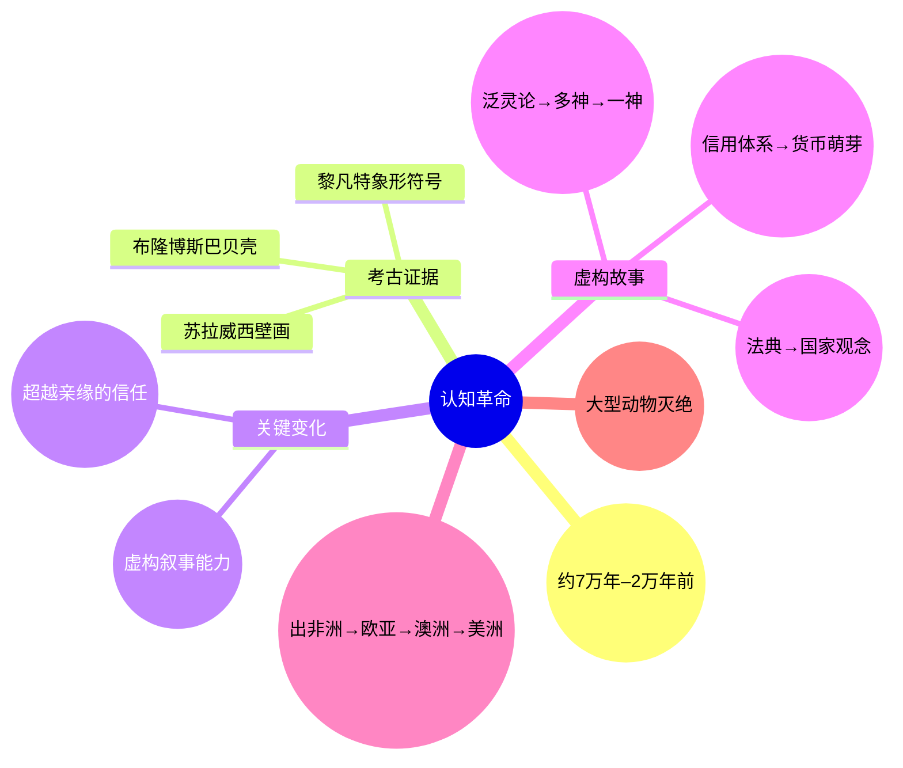
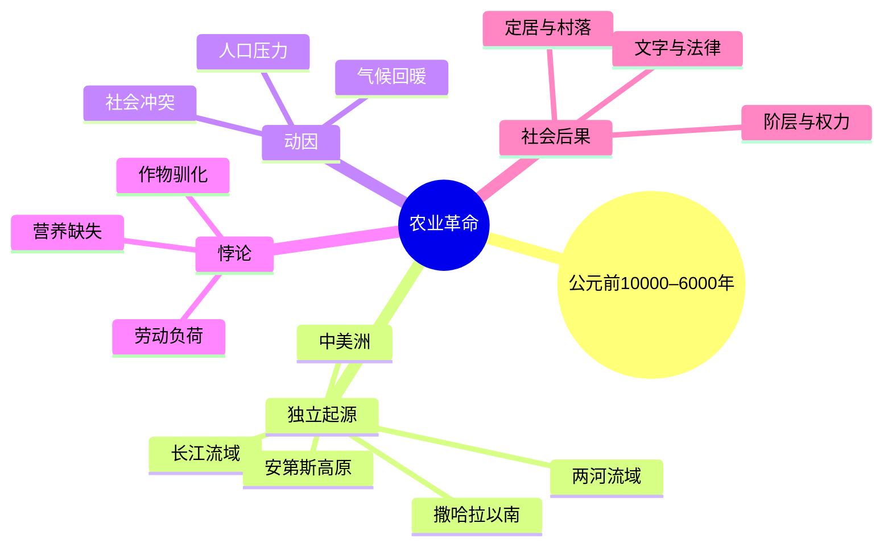
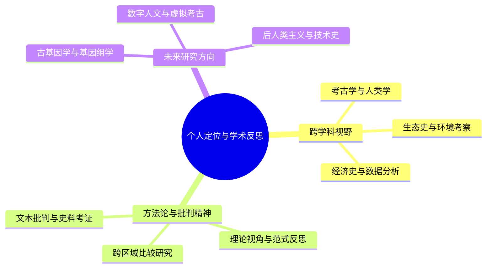

# 读书笔记：

# 《人类简史》（Sapiens: A Brief History of Humankind）

**作者**：尤瓦尔·赫拉利（Yuval Noah Harari）
**原书名**：Sapiens: A Brief History of Humankind
**核心主题**：探讨智人（Homo sapiens）如何从非洲一隅的平凡物种，通过文化、社会与技术的变革，逐渐成为影响整个地球生态与文明进程的主导力量。

---

## 目录

1. [全书框架：人类历史的三大革命](#全书框架人类历史的三大革命)

   * [第一部分：认知革命（约7万年前）](#第一部分认知革命约7万年前)
   * [第二部分：农业革命（约1.2万年前）](#第二部分农业革命约12万年前)
   * [第三部分：人类的融合与统一](#第三部分人类的融合与统一)
   * [第四部分：科学革命（约500年前）](#第四部分科学革命约500年前)
2. [核心观点与学术讨论](#核心观点与学术讨论)
3. [与当代研究议题的关联](#与当代研究议题的关联)
4. [个人定位与学术反思](#个人定位与学术反思)
5. [延伸阅读与参考文献](#延伸阅读与参考文献)

---

## 全书框架：人类历史的三大革命

赫拉利将整个人类的漫长历史浓缩为三次决定性的转折：**认知革命**、**农业革命**与**科学革命**。以下表格概括了三大革命的核心要点：

| 革命   | 时间节点    | 核心变化                       | 关键概念        |
| ---- | ------- | -------------------------- | ----------- |
| 认知革命 | 约7万年前   | 语言与想象力跃升，能够构建虚构故事与大规模合作    | 虚构故事的力量     |
| 农业革命 | 约1.2万年前 | 从狩猎采集转向农耕定居，产生剩余、社会分层与文字发明 | 作物驯化与人类驯化反转 |
| 科学革命 | 约500年前  | 建立科学方法，知识与技术结合，资本主义与帝国推动创新 | 承认无知、追求力量   |

### 第一部分：认知革命（约7万年前）

#### 简要思维导图

#### 时间节点与背景

* **时间范围**：约7万年前至2万年前之间（晚更新世）。
* **考古证据**：

  * 南非布隆博斯岩洞（Blombos Cave）发现复杂雕刻与贝壳装饰。
  * 黎凡特（Levant）洞穴出现初步象形符号。
  * 印度尼西亚苏拉威西洞穴壁画显现宗教与符号能力的萌芽。
* **气候与环境**：末次冰期尚未完全结束，海平面较低，冰川广布，但生态系统多样，人类需要更加灵活的生存策略。

#### 1. 智人与其他人类：为何胜出？

* **与尼安德特人的共处与竞争**：

  * 尼安德特人与智人在欧亚大陆并行数千年，基因组与工具技术（Mousterian石器文化）研究表明，尼安德特人在极寒环境中更具优势，但文化创新速率低于智人。
  * 约4万年前，尼安德特人大规模消失，可能因气候变迁、资源竞争及基因混合，而现代欧亚人群仍保留1%–4%尼安德特人DNA。
* **语言与认知飞跃**：

  * 虽然解剖学上口部肌肉与额叶差异有限，但智人可能经历少数基因突变或文化积累，引发复杂语法与符号系统。
  * 心理考古学表明，此时期人类已具备“元认知”（metacognition）能力，开始进行宗教仪式、壁画创作与象征性埋葬。如法国拉斯科与西班牙阿尔塔米拉的壁画，彰显未来规划与抽象思维。

#### 2. 语言革命与想象力构建

* **虚构叙事的出现**：

  * 智人开始编织神话与传说，超越氏族局限。如后期狩猎采集群体口传祖先崇拜与图腾信仰，强化部落内部凝聚力。
  * 心理学研究表明，共同符号与仪式（如葬礼）在群体内部建立信任网络，促进非血缘者协作。
* **共享想象与社会规模**：

  * 传统猎人—采集者群体规模限于数十人，依赖直接接触；认知革命后，群体规模可扩展至数百乃至数千，需要更复杂的信念系统。
  * Harari提出“想象的现实”（imagined reality）——只有信任同一神话与编年史，人们才能跨越地理与血缘限制，建立大规模社会。

#### 3. 虚构故事的演进与大型合作

* **宗教与精神世界**：

  * 从泛灵论（animism）到萨满祭祀，再到两河文明的多神教，最终铁器时代形成犹太教、基督教与伊斯兰教等一神教。
  * 考古发现表明，早期墓葬常见随葬品，反映死后世界与社会分层意识的兴起。
* **政治与法律的萌芽**：

  * 美索不达米亚与埃及王朝的统治者借神权强化政治权威，颁布法典（如乌尔第三王朝法律）。
  * “法”（lex）与“道德”（ethos）的区分初现，但均源于对超自然或祖先信仰的共同认同。
* **经济与货币体系崛起**：

  * 早期贝壳与贝雷金钱（cowrie shells）作为信用单位使用，两河流域出现金属货币前的产品货币雏形。
  * 亚述帝国时期税收与征服带来中央集权财政体系，推动货币制度发展与区域竞争。

#### 4. 智人迁徙：路径与生态影响

* **非洲到欧亚大陆**：

  * mtDNA研究与古基因测序显示，约7万年前一股“出非洲”智人沿红海沿岸及阿拉伯半岛进入黎凡特，随后扩散至欧亚平原与南亚。
  * 约4.5万年前，智人跨海到达澳大利亚；考古学家在玛拉库塔洞（Malakunanja II）发现4.2万年前的工具与炉灶痕迹，证明早期航海与环境适应能力。
* **穿越冰墙到达美洲**：

  * 古环境学研究发现，约1.6万年前白令陆桥出现通道，但被冰层覆盖；智人或沿太平洋沿岸舟楫迁移，最终跨越白令海峡进入美洲。
  * 至1.3万年前，克洛维斯文化（Clovis culture）已遍布北美，代表北美早期猎人—采集者典型石器技术。
* **生态足迹与物种灭绝**：

  * 古生态学家通过沉积物与化石记录指出，澳洲晚更新世大型动物灭绝与智人猎杀、用火烧荒密切相关；
  * 美洲猛犸象、三趾马等冰河时代巨兽在1.4万年内消失，智人到来虽为关键因素，冰期末期气候变动亦不可忽视。

---

## 第二部分：农业革命（约1.2万年前）

以下思维导图简要概括农业革命的关键要素：

#### 时间节点与变革动因

* **时间背景**：约公元前10000年至公元前6000年，新石器时代（Neolithic）在多地区几乎同步展开，包括中东“肥沃月弯”、长江流域与玛雅低地等。
* **独立起源**：全球至少出现六大农业中心：

  1. **两河流域（小麦、大麦）**
  2. **长江与黄河流域（稻米、小米）**
  3. **美索不达米亚周边豆科作物（豌豆、扁豆）**
  4. **中美洲（玉米、豆类、南瓜）**
  5. **安第斯高原与亚马逊河流域（马铃薯、木薯）**
  6. **撒哈拉以南非洲与东非（高粱、黍、香蕉）**
* **动因探讨**：

  * **气候回暖**：末次冰期末期（约1.2万年前）气候回暖，植物快速扩张，人类观察到野生植物成熟周期；
  * **人口压力**：猎人—采集者人口局部增长，资源竞争加剧，促使管理野生植物以提高产量；
  * **社会因素**：部落间冲突与人口流动，加速农业技术在邻近区域扩散。

#### 1. 农业革命的悖论：谁在驯化谁？

* **作物对人类的影响**：

  * 世寿学（palaeopathology）研究显示，早期农业社区牙齿龋齿率上涨，骨骼维生素与矿物质缺乏，表现出营养不均衡。
  * 农业改变病原循环，稻作区与家猪养殖区易形成动—人病毒传播，如猪瘟与禽流感等。
* **劳作时间与生活质量**：

  * 实验考古模拟表明，早期农民每日需投入约6–8小时进行耕作、播种、收割；
  * 与之相比，猎人—采集者每日狩猎采集时间约4小时；定居后生育率升高，但幼年死亡率也上升，人口虽增，个体幸福感并未提高。

#### 2. 社会结构与权力集中

* **定居社区与村落形成**：

  * 耶里科、杰里科等中东遗址与河姆渡遗址证实初步村落拥有粮仓、宗教场所与公共空间；
  * 分工出现：男性多负责农耕与狩猎，女性参与采集、纺织与抚养，强化性别角色分化。
* **权力与阶层**：

  * 农业剩余（surplus）需要管理与分配，产生首领、祭司与贵族阶层；
  * 祭司阶层利用宗教仪式（祈雨、丰产祭）巩固社会秩序，兼具经济与政治目的；
  * 苏美尔乌鲁克与埃及法老制将神权与世权结合，形成“神王”（divine king）制度。

#### 3. 文字、法律与文化规范

* **文字发明与记账需求**：

  * 公元前3500年苏美尔商人在泥板上记录粮食交易与牲畜流通，楔形文字诞生；
  * 随后文字用于行政、宗教、史诗与法律，如《吉尔伽美什史诗》《汉谟拉比法典》；
  * 中国甲骨文与青铜器铭文同期出现，初期主要服务于统治者与祭司。
* **法律体系的形成**：

  * 法律文本为解决社会冲突提供他律，《汉谟拉比法典》中275条法规与惩罚措施体现古代法治与血缘复仇观念的冲突；
  * 法律颁布与石碑刻写将权威扩大，但百姓仍需依赖口传传统与习惯法。
* **文化规范与意识形态**：

  * 公共宗教建筑（如乌鲁克白神庙、埃及金字塔）彰显君权神授；
  * 骨雕、陶罐、石刻与壁画承载社会规范，女性形象在不同文化中被神圣化或边缘化；
  * 社会规范通过宗教文本与习俗、惩罚机制维系。

---

## 第三部分：人类的融合与统一

农业社会之后，人类逐步迈向更大规模的政治、经济与文化统一体，为全球化奠基。以下表格概括三种统一秩序及其主要特征：

| 统一秩序 | 核心机制              | 影响范围             | 典型实例                |
| ---- | ----------------- | ---------------- | ------------------- |
| 金钱秩序 | 共同想象与信用担保         | 跨文化、跨地域的经济交换     | 古希腊铜币、罗马银币、现代电子支付   |
| 帝国秩序 | 军事征服、官僚体制、共用文字与宗教 | 多民族、多地域的政治整合与控制  | 亚述、波斯、罗马、汉、奥斯曼、蒙古帝国 |
| 宗教秩序 | 共同信仰、教义传播与神权正当性   | 跨地域、跨文化的价值观与法律体系 | 犹太教、一神教（基督教、伊斯兰教）   |

### 一、三种统一秩序（Imagined Orders）

1. **金钱秩序**

   * 金钱本质上是一种集体想象的符号：纸币、金属币与电子货币没有内在价值，其价值由社会共识决定。
   * 早期两河流域银锭与巴比伦节令票据是最早的信用单位；古希腊铜币、罗马银币与唐朝开元通宝等奠定了区域货币体系。
   * 现代全球货币体系（美元、欧元、数字货币）依赖国家与国际机构信誉，推动长距离贸易网络（丝绸之路、香料之路）的繁荣。

2. **帝国秩序**

   * 帝国通过军事征服、官僚体制与共用文字（如拉丁文、楔形文字）实现统治与管理；
   * 自亚述、波斯、马其顿到罗马、汉，再到奥斯曼、蒙古与西班牙帝国，几乎各大陆的主要区域都出现过帝国模式。
   * 帝国带来文化与宗教融合：亚历山大东征引发希腊化浪潮，丝绸之路上佛教、基督教、伊斯兰教与当地信仰相互传播。
   * 当代国际体系（联合国、欧盟）虽不再依赖领土征服，但在行政、法律与经济制度上延续了帝国时期的组织逻辑。

3. **宗教秩序**

   * 从泛灵论与多神体系，到犹太教一神论，再到基督教与伊斯兰教扩张，宗教塑造了跨地域价值与法律体系。
   * 早期宗教依赖口述与旅人传播；印刷术与现代传媒加速宗教经典的传播。
   * 宗教与政治常结合：中世纪神圣罗马帝国借教会正当性维系统治；
   * 宗教既是冲突根源（十字军东征、圣战），也促进了科学与文化交流，如安达卢斯时期的科学译著。

### 二、全球化进程与文化演化

* **地理大发现与贸易网络**：

  * 15世纪末哥伦布发现新大陆、达·伽马到达印度，使欧亚、美洲与非洲迅速连接；
  * 西班牙与葡萄牙通过殖民扩张输送黄金与香料，荷兰与英国东印度公司垄断亚洲贸易。
* **文化演化速度**：

  * 相比基因演化需要数千年，文化演化可在数十年内完成质的跃升：

    * 16世纪印刷术推动文艺复兴与宗教改革；
    * 20世纪末互联网与移动通讯颠覆信息与社会互动模式。
* **统一与冲突并存**：

  * 全球化带动区域分工与价值链网络，同时拉大贫富差距；
  * 文化同质化与文化反弹并行，许多原住民文化与语言面临濒危；
  * 国际法与多边机构试图协调冲突，但因利益分歧与权力不对称，合作常受限。

---

## 第四部分：科学革命（约500年前）

以下表格总结科学革命的核心要素：

| 要素       | 时间范围       | 主要代表人物与事件                               | 核心理念           |
| -------- | ---------- | --------------------------------------- | -------------- |
| 思潮与方法论   | 1450–1700年 | 哥白尼（1543年《天体运行论》）、伽利略（望远镜实验）、培根与笛卡尔的方法论 | 经验观察与理性演绎结合    |
| 科学共同体与出版 | 17世纪中后期    | 皇家学会（1660年）、法兰西科学院（1666年）、《哲学会刊》        | 同行评议与知识共享      |
| 帝国与资本协同  | 17–18世纪    | 殖民探险标本收集、瓦特蒸汽机（1765年）                   | 科学服务帝国与市场需求    |
| 资本主义与市场  | 17–19世纪    | 荷兰东印度公司（1602年）、伦敦证券交易所（1698年）           | 股份制、信贷与消费文化兴起  |
| 工业革命与社会  | 18–19世纪    | 煤炭、石油大规模使用、城市化与工人阶级形成                   | 能源革命、环境影响与社会转型 |

#### 时间节点与思潮背景

* **起点**：公元1450–1700年，科学革命渐进展开。

  * 哥白尼（1543年《天体运行论》）提出日心说。
  * 伽利略（1564–1642）通过摆与望远镜验证天体运动。
  * 培根（1561–1626）与笛卡尔（1596–1650）提出经验归纳与理性演绎结合的方法论。
* **思想突破**：

  * 从宗教与哲学权威转向经验观察与实验验证。
  * 牛顿（1643–1727）将力学与天文学纳入统一框架，标志科学与数学深度融合。

#### 1. 科学方法与知识体系

* **归纳与演绎结合**：

  * 培根强调无偏见观察，笛卡尔强调理性演绎，二者结合形成现代科学方法：提出假设、实验验证与修正理论。
  * 哈维（1578–1657）通过解剖实验证实循环系统模型，推翻古代加伦体系。
  * 牛顿《自然哲学的数学原理》（1687年）汇聚伽利略、开普勒与自身成果，奠定经典力学。
* **科学共同体与出版机制**：

  * 皇家学会（1660年）与法兰西学院（1666年）为科学家提供交流与资助平台。
  * 《哲学会刊》（Philosophical Transactions）促进研究成果快速传播与初步同行评议。
  * 当时同行评审机制尚处萌芽阶段，科研资助多依赖王室与教会。

#### 2. 科学、帝国与资本的协同

* **殖民扩张与知识积累**：

  * 殖民探险带回丰富植物、动物与矿物标本，推动博物学与人种学研究。
  * 布丰（1707–1788）与莱布尼茨（1646–1716）等研究者借由新世界样本完善自然历史分类体系。
* **资本主义经济与技术革新**：

  * 瓦特改良蒸汽机（1765年）在纺织、矿业与铁路建设中发挥关键作用。
  * 铁路与电报网络加速信息传递，增强全球贸易网络的连通性。
  * 股票与信贷体系支持企业融资与风险分摊，降低技术创新门槛。

#### 3. 资本主义兴起与社会变革

* **信贷与股份制公司**：

  * 1602年荷兰东印度公司（VOC）首发股份，成为首家现代跨国公司；
  * 1698年伦敦证券交易所成立，逐步形成投资、借贷与保险市场。
* **消费文化与大众市场**：

  * 18世纪轻工业商品（纺织、陶瓷）价格下降，大众化趋势初现；
  * 19世纪末广告业兴起，品牌塑造与百货公司推动消费主义潮流。

#### 4. 工业革命与现代社会

* **能源与环境双重革命**：

  * 煤炭与石油大规模使用使人类能源消耗呈指数级增长；
  * 化石能源燃烧导致二氧化碳浓度飙升，20世纪末显现气候变暖信号；
  * 千年生态评估报告（2000年后）指出人类活动已深度干预生态系统服务与气候系统。
* **城市化与社会结构转型**：

  * 曼彻斯特、利物浦等工业城市快速崛起，带来贫民窟与公共卫生危机；
  * 工人阶级形成与工会运动兴盛，为劳工权益争取筑路；
  * 教育普及与现代大学（如剑桥科学课程扩张）为后续科技创新培养人才。
* **全球生态与经济网络**：

  * 当代全球供应链（电子产品、原材料）源于早期工业与帝国主义殖民经济；
  * 环境外部性显现，各国签订国际环保条约（如1992年联合国气候变化框架公约），但因利益冲突，实施效果有限。

---

## 核心观点与学术讨论

赫拉利的宏观叙事蕴含多重学术争议与研究前沿，包括虚构故事构建机制、进步与幸福的张力，以及历史偶然与必然的辩证。

### 虚构故事的力量与人类合作的极限

1. **想象共同体：理论基础**

   * 本尼迪克特·安德森（Benedict Anderson）《想象的共同体》提出，民族与国家皆为“想象的政治共同体”。赫拉利将此扩展至宗教、公司等更广范畴。
   * 共享神话与仪式（如宗教典礼、国庆庆典）是大规模合作的认知基础。
2. **合作的认知基础与神经科学视角**

   * 神经经济学发现，镜像神经元与内侧前额叶皮层在信任形成与决策中发挥关键作用；
   * 当人们“相信”货币、法律或宗教时，大脑奖励系统（伏隔核）给予化学强化，巩固合作行为。
3. **关于大型合作的边界**

   * 虚构故事有助于大规模协作，但当群体过大时，需制度化监督与透明度，如现代国家的官僚体系与法律体系；
   * 公司治理（董事会、股东大会）与市场监管体现了信任通过制度路径被固化、制衡与拓展。

### 进步的悖论：幸福与代价

1. **物质进步与主观幸福研究**

   * 赫拉利引用狩猎—采集者健康指标与现代城市居民对比，现代积极心理学更关注社会资本、社区联系与心理满足；
   * 当代研究显示，经济增长与个人幸福呈弱相关，社会支持网络与生活意义感更具决定性。
2. **环境与可持续性：长期视角**

   * 农业革命引发区域生态退化，如两河流域泥土盐碱化、地中海森林砍伐；
   * 工业革命以来气候变化成为“跨世代悲剧”，当代以增长为导向，但未来世代需承担环境修复成本。
3. **社会公平与制度演进**

   * 社会复杂化导致权力与财富集中，如马歇尔计划后欧美中产阶级扩张与新自由主义浪潮相互博弈；
   * 当代焦点在全球收入不平等、性别与种族歧视，农业与工业革命遗留问题在信息时代愈加凸显。

### 偶然与必然：历史的双重视角

1. **历史的偶然性：案例分析**

   * 普鲁士国王腓特烈二世征服萨克森，引发七年战争，改变欧洲权力均衡；
   * 二战关键节点（如斯大林未及时支援古德里安莫斯科进攻）体现决策偶然性。
2. **历史的必然性：长期趋势透视**

   * 技术演进过程中，信息记录与传输能力逐步提升：汉字书写→印刷术→数字化系统；
   * 地理与生态因素塑造文明走向：戴蒙德《枪炮、病菌与钢铁》论证欧亚大陆东西横向跨度利于物种与技术扩散。
3. **多元视角下的因果链**

   * 社会科学强调多因互动，单一因素难以解释复杂历史事件；
   * 现代历史方法结合定量（如Cliodynamics）与定性叙事，提供更精细的历史因果分析。

---

## 与当代研究议题的关联

### 技术、社会与伦理：从人工智能到生物技术

1. **人工智能（AI）对认知革命的当代续写**

   * 智人依赖象征与想象力，今人构建数字虚拟世界（元宇宙），AI改变人机互动与知识生产；
   * 伦理争议：AI决策透明度、算法偏见与隐私安全，应借鉴历史对权力分配与信任机制的思考。
2. **生物技术与人类身份重塑**

   * 基因编辑（CRISPR/Cas9）、合成生物学使人类成为“被驯化对象”，类似农业革命驯化作物；
   * 引发伦理风险：优生学争议与基因不平等可能导致新形式社会分层。
3. **数字平台与虚构故事的新形式**

   * 社交媒体与算法推荐创造“回声室”与“信息茧房”，虚构叙事易通过技术传播加剧；
   * 需反思“想象共同体”在网络时代的重塑，以及其对极化与社会信任的影响。

### 全球化进程中的文化张力

1. **文化同化与文化保护**

   * 全球化与新自由主义推动跨国文化产品输出，如好莱坞电影、全球快餐连锁；
   * 保护少数民族语言与传统成为人类学与遗产研究重点，UNESCO等机构多次开展非物质文化遗产保护，但经济利益常与文化保护冲突。
2. **全球治理与主权冲突**

   * 跨国环境议题（气候变化、生物多样性）需要国际合作，但国家利益与发展阶段分歧使合作受限；
   * 例如：发达国家与发展中国家在碳排放责任分配上争议不断；欧美对中国网络主权质疑凸显全球治理难题。
3. **地方主义与身份认同危机**

   * 全球秩序与地方文化矛盾凸显，如欧洲部分国家出现右派民粹主义；
   * 地方认同（如苏格兰独立、加泰罗尼亚独立）在全球化冲击下再度兴起，反映虚构故事（国家与民族）对个体情感的重要性。

### 生态变迁与人类影响：人新世概念

1. **从“自然历史”到“人新世”**

   * 人类活动深度干预地球系统，提出“人新世”作为地质时代新名称；
   * 证据：

     * 大气中二氧化碳自工业革命前280ppm提升至400ppm以上；
     * 物种灭绝速度远高于背景率；
     * 土壤侵蚀、海洋酸化与塑料污染形成地球反馈回路。
2. **历史视角下的生态变迁**

   * 农业革命导致土地开垦与森林砍伐，区域生态退化；
   * 19世纪工业化带来大规模排放与资源开采，生态影响扩散至全球；
   * 科学与技术虽提供生态修复手段，但政治与经济利益制约真实效果。
3. **未来可持续路径的思考**

   * 借鉴古代文明因生态危机崩溃教训，如玛雅文明过度开发导致社会衰落；
   * 当代可持续研究强调循环经济、碳中和与生态补偿，但需协调贫困与发展需求。

---

## 个人定位与学术反思

作为资深历史人士，应将宏观视角与微观考证相结合，通过跨学科研究深化学术深度。以下思维导图展示主要思考维度：

### 跨学科视野的重要性

1. **人类学与考古学融合**

   * 考古学提供物质文化证据（器具、遗址、碳14测年）补充文献时空盲区；
   * 人类学关注少数族群口述历史与民俗，揭示文化变迁中的证据逻辑。
2. **生态史与环境考察**

   * 历史进程不可脱离自然环境：古气候学与气候史结合，解释气候拐点与文明兴衰；
   * 区域生态史研究（如长江文明与黄土高原互动）揭示人—地关系复杂性。
3. **经济史与数据分析**

   * Cliodynamics学科兴起，大规模历史数据（人口、粮食、交易记录）与定量模型结合，验证宏观规律；
   * 数据驱动方法能捕捉群体趋势，但需警惕数字化简化历史，忽略个体与文化差异。

### 方法论与批判精神

1. **文本批判与史料考证**

   * 古代史研究依赖文献与竹简，如《史记》《资治通鉴》，须注意版本差异与抄录误差；
   * 考古发现与热释光测年、树轮年代学等方法相互印证，一旦不匹配需重审解释框架。
2. **理论视角与范式反思**

   * 马克思主义、韦伯主义、后殖民主义等理论为理解文明发展提供多元视角；
   * 使用时需关注概念适用范围与历史语境，避免机械套用。
3. **跨区域比较研究**

   * 比较中东、南亚、东亚、欧洲与美洲不同区域的农业革命路径、国家模式与技术传播，揭示普遍规律与特殊性；
   * 需掌握多语种文献与地区学术资源，避免西方中心论偏见。

### 未来研究方向

1. **人类基因组与古基因学**

   * 新一代测序技术可提取古骨骼DNA，重建史前迁徙与基因交流网络；
   * 结合语言学探讨语言与基因扩散关联，如印欧语系与雅利安人迁徙假说。
2. **数字人文与虚拟考古**

   * GIS与遥感技术模拟史前定居与生态变化；
   * VR与AR技术让公众与学者身临其境地“探访”古代遗址。
3. **后人类主义与技术史**

   * 探讨人类与AI、基因技术共存甚至迈向“后人类”时代；
   * 技术史研究需关注技术与社会、文化共构，超越技术决定论。

---

## 延伸阅读与参考文献

* Harari, Yuval Noah. *Sapiens: A Brief History of Humankind*. Harper, 2015.
* Anderson, Benedict. *Imagined Communities: Reflections on the Origin and Spread of Nationalism*. Verso, 1983.
* Diamond, Jared. *Guns, Germs, and Steel: The Fates of Human Societies*. W\.W. Norton, 1997.
* Pinker, Steven. *The Better Angels of Our Nature: Why Violence Has Declined*. Viking, 2011.
* Tainter, Joseph A. *The Collapse of Complex Societies*. Cambridge University Press, 1988.
* Malm, Andreas, and Alf Hornborg. "The Geology of Mankind? A Critique of the Anthropocene Narrative." *The Anthropocene Review*, vol. 1, no. 1, 2014, pp. 62–69.
* Morris, Ian. *Why the West Rules—for Now: The Patterns of History, and What They Reveal About the Future*. Farrar, Straus and Giroux, 2010.

**注**：本笔记内容结合了近年来人类学、考古学、生态学与历史学的研究成果，力求学术严谨与逻辑连贯。如有疏漏或误读，欢迎批评指正。
