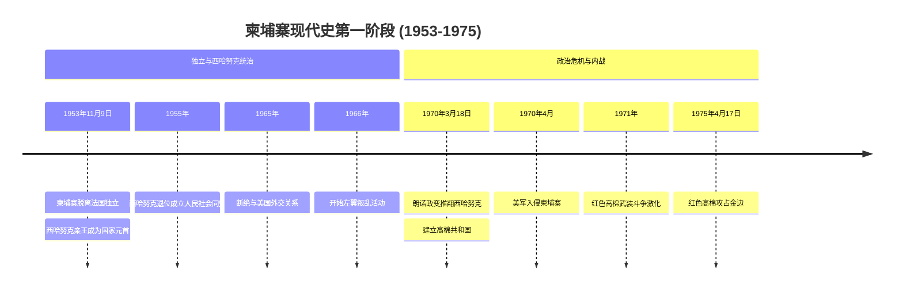
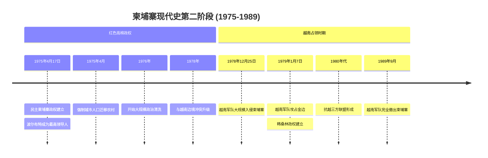
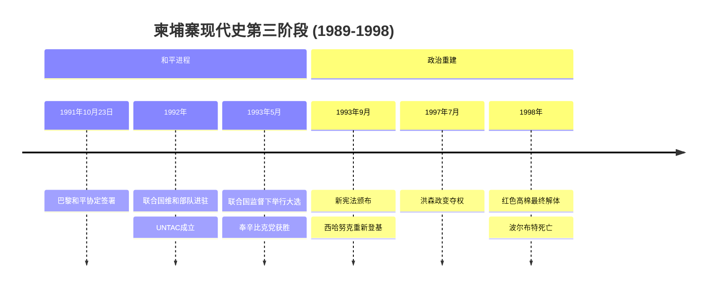
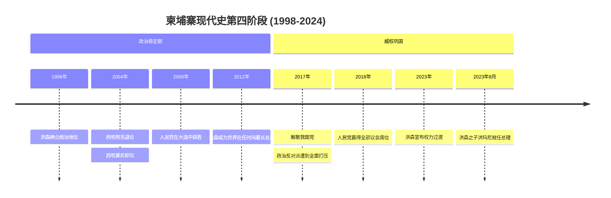
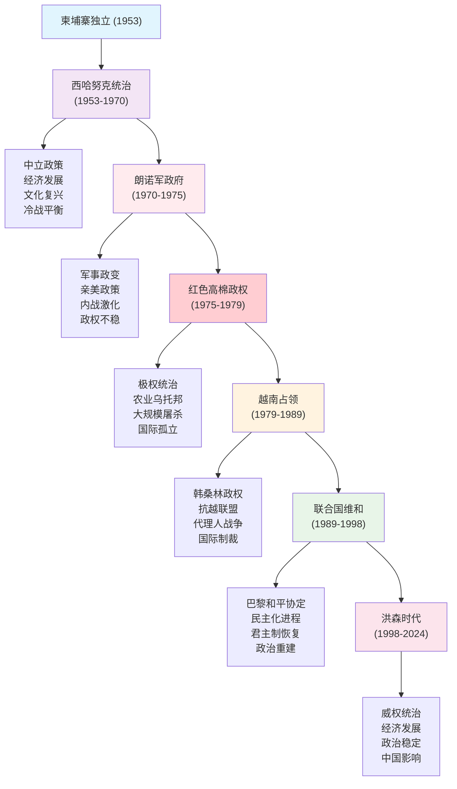

# 柬埔寨现代史：从独立到转型的曲折历程

柬埔寨，这个位于东南亚心脏地带的古老王国，拥有着辉煌的吴哥文明遗产，但其现代史却充满了动荡、冲突和重建的曲折历程。从1953年独立到2024年，柬埔寨经历了君主制、共和制、红色高棉极权统治、越南占领、联合国维和、民主化尝试，直至洪森长期执政的威权稳定，这七十年的发展轨迹反映了一个小国在大国博弈中的艰难求存。

## 柬埔寨现代史发展脉络图解

为了更好地理解柬埔寨复杂的现代史发展过程，以下图表展示了从1953年到2024年的关键历史节点和发展阶段：

### 关键事件时间线

#### 第一阶段：独立建国与政治动荡（1953-1975）

#### 第二阶段：红色高棉统治与越南占领（1975-1989）

#### 第三阶段：联合国维和与政治重建（1989-1998）

#### 第四阶段：洪森时代与威权巩固（1998-2024）

### 历史发展阶段图

这些图表清晰地展示了柬埔寨现代史的发展脉络：

- **四阶段时间线图**：按历史时期分组，突出了每个阶段的关键事件和转折点
- **历史发展阶段图**：展示了七个主要历史发展阶段及其特征和相互关系
- 通过分阶段的可视化方式，读者可以更清晰地理解柬埔寨政治发展的复杂性和曲折性

**阶段划分说明**：
- **第一阶段（1953-1975）**：从独立建国到内战爆发，是国家建设与政治动荡并存时期
- **第二阶段（1975-1989）**：从红色高棉统治到越南占领，是极权恐怖与外国干预时期
- **第三阶段（1989-1998）**：从联合国维和到政治重建，是国际调解与民主化尝试时期
- **第四阶段（1998-2024）**：从洪森掌权到威权巩固，是政治稳定与经济发展时期

接下来让我们深入了解每个历史时期的详细情况：

## 独立建国与西哈努克统治（1953-1970年）

### 从法国殖民到独立建国

#### 独立运动的兴起

20世纪40年代末，柬埔寨的独立运动在法属印度支那的大背景下兴起。与越南的武装斗争不同，柬埔寨的独立更多依赖外交手段和政治谈判。

**西哈努克的独立策略**：
- **1952年**：西哈努克国王发起"独立十字军"运动
- **1953年2月**：西哈努克前往法国直接谈判
- **1953年7月**：获得法国承认的内政自治权
- **1953年11月9日**：正式宣布独立，结束法国保护国地位

这种相对和平的独立方式为柬埔寨避免了如越南那样的长期战争，但也为后来的政治不稳定埋下了伏笔。

#### 独立初期的政治架构

独立后的柬埔寨采用了君主立宪制：
- **国王**：西哈努克作为国家元首
- **政府**：总理负责行政事务
- **议会**：采用两院制
- **司法**：相对独立的法院系统

### 西哈努克的中立政策与"黄金时代"

#### 政治转型与权力巩固

1955年，西哈努克做出了一个关键决定：退位让位给父亲苏拉玛里特，自己成立人民社会同盟（桑戈姆）参与政治。这一举动的目的是：

**巩固政治权力**：
- 避免君主制对政治参与的限制
- 建立个人政治组织
- 在冷战环境中保持政治灵活性

**桑戈姆的政治理念**：
- 佛教社会主义
- 民族独立与中立
- 反对外国干涉
- 维护传统文化

#### 中立外交政策

西哈努克的外交政策是其统治的核心特色。在冷战背景下，他试图在美苏两大阵营之间保持平衡：

**不结盟运动参与**：
- 1955年参加万隆会议
- 与纳赛尔、尼赫鲁、铁托等建立友好关系
- 成为不结盟运动的重要成员

**与中国的特殊关系**：
- 1958年与中华人民共和国建交
- 获得中国的经济和政治支持
- 在台湾问题上支持北京立场

**与美国关系的恶化**：
- 拒绝加入东南亚条约组织
- 反对美国在越南的军事行动
- 1965年断绝与美国的外交关系

#### 经济发展与文化复兴

1960年代被许多人视为柬埔寨的"黄金时代"：

**经济成就**：
- 农业产量稳步增长
- 基础设施建设发展
- 教育体系扩展
- 城市化进程加快

**文化繁荣**：
- 吴哥文化的重新发现和保护
- 现代柬埔寨文学艺术的发展
- 电影工业的兴起
- 传统文化与现代化的结合

### 政治危机的酝酿

#### 内部矛盾的积累

尽管表面繁荣，但柬埔寨社会内部矛盾逐渐积累：

**经济问题**：
- 农村贫困问题严重
- 城乡差距扩大
- 腐败问题日益严重
- 对外依赖过度

**政治矛盾**：
- 左翼势力的兴起
- 右翼军官的不满
- 知识分子的批评
- 民族主义情绪的激化

#### 越南战争的冲击

越南战争对柬埔寨产生了深远影响：

**地缘政治压力**：
- 美军在柬埔寨边境的军事行动
- 越共利用柬埔寨领土的胡志明小道
- 柬埔寨卷入印度支那冲突

**国内政治分化**：
- 亲美派要求与美国合作
- 左翼势力获得越共支持
- 西哈努克的中立政策受到挑战

### 红色高棉的早期发展

#### 柬埔寨共产党的形成

1960年代，柬埔寨左翼势力开始组织化：

**组织发展**：
- 1960年成立柬埔寨工人党（后改名柬埔寨共产党）
- 波尔布特（萨洛特·萨）成为重要领导人
- 受到越南共产党的支持和指导

**意识形态特征**：
- 极端民族主义
- 农村包围城市战略
- 反帝反封建
- 激进的社会改造理念

#### 武装斗争的开始

1967年，柬埔寨爆发了"萨木洛起义"，标志着红色高棉武装斗争的开始。这次起义虽然被镇压，但为后来的游击战争奠定了基础。

**起义的影响**：
- 政府开始大规模镇压左翼势力
- 许多左翼知识分子转入地下
- 农村地区的不满情绪加剧
- 为1970年的政治危机埋下伏笔

## 朗诺政变与高棉共和国（1970-1975年）

### 1970年政变的背景与过程

#### 政变的深层原因

1970年3月18日的政变并非突发事件，而是多重因素长期积累的结果：

**经济困境**：
- 国家财政赤字严重
- 通胀率居高不下
- 失业问题加剧
- 对外贸易失衡

**政治危机**：
- 西哈努克威权统治引起不满
- 军方对政府政策的批评
- 国会中反对派声音增强
- 冷战压力下的政治极化

**越南战争因素**：
- 美国对西哈努克中立政策的不满
- 越共在柬埔寨境内活动的增加
- 边境安全问题的恶化
- 国际压力的加大

#### 政变的执行过程

**关键人物**：
- **朗诺**：国防部长，政变主要领导人
- **施里玛达**：副总理，政变参与者
- **山玉成**：军方将领，政变支持者

**政变过程**：
1. 西哈努克出访苏联和中国期间
2. 国会投票罢免西哈努克
3. 军方控制关键设施
4. 宣布成立高棉共和国

### 高棉共和国的政治体制

#### 政府结构与权力分配

朗诺政府建立了名义上的共和政体：

**总统制**：
- 朗诺担任总统兼政府首脑
- 设立副总统和总理职务
- 内阁负责具体行政事务

**议会制度**：
- 保留国会但权力有限
- 主要政党支持政府政策
- 反对派声音被边缘化

**司法体系**：
- 名义上独立但实际受政府控制
- 军事法庭权力扩大
- 对政治犯的审判常规化

#### 政治政策与社会变革

**内政政策**：
- 推行反共政策
- 加强国家安全机构
- 限制政治自由
- 推进经济自由化

**文化政策**：
- 淡化君主制传统
- 推广共和价值观
- 限制左翼文化活动
- 加强爱国主义教育

### 与美国的合作关系

#### 军事合作的深化

朗诺政府上台后，立即与美国建立了密切的军事合作关系：

**美国援助**：
- 提供军事装备和训练
- 派遣军事顾问
- 提供经济援助
- 支持政府军现代化

**1970年美军入侵**：
- 4月30日美军进入柬埔寨
- 目标是清除越共据点
- 引起国际社会强烈反对
- 加剧了柬埔寨内战

#### 经济依赖的加深

**援助依赖**：
- 美国成为最大援助国
- 财政预算严重依赖外援
- 经济政策受美国影响
- 货币政策与美元挂钩

**贸易关系**：
- 对美出口大幅增加
- 进口美国商品和技术
- 市场开放程度提高
- 经济结构调整

### 内战的全面爆发

#### 红色高棉的崛起

朗诺政变反而为红色高棉的发展提供了机遇：

**政治合法性**：
- 西哈努克与红色高棉结盟
- 获得国际左翼势力支持
- 民族主义情绪的利用
- 反美情绪的激化

**军事实力增强**：
- 得到中国和北越的支持
- 农村根据地的扩大
- 游击战术的完善
- 正规军的建立

#### 战争的进程与特点

**1970-1973年**：
- 政府军控制主要城市
- 红色高棉控制农村地区
- 美军轰炸的影响
- 难民问题的恶化

**1973-1975年**：
- 美军停止轰炸
- 红色高棉攻势加强
- 政府军节节败退
- 金边被围困

### 政府的崩溃

#### 内部矛盾的激化

**政治分歧**：
- 朗诺与其他军官的矛盾
- 政府内部权力斗争
- 对战争策略的分歧
- 腐败问题的严重化

**经济困难**：
- 战争消耗巨大
- 通货膨胀严重
- 社会秩序混乱
- 民众生活困难

#### 最终的失败

1975年4月17日，红色高棉军队攻占金边，朗诺政府宣告结束。这一天标志着柬埔寨历史上最黑暗时期的开始。

**失败的原因**：
- 缺乏民众支持
- 军事实力不足
- 国际环境变化
- 内部分裂严重

## 红色高棉政权与种族灭绝（1975-1979年）

### 民主柬埔寨的建立

#### 政权的构建与意识形态

1975年4月17日，红色高棉攻占金边后，立即开始了他们的激进社会改造实验。这个政权的正式名称是"民主柬埔寨"，但实际上是一个极权主义政权。

**领导结构**：
- **波尔布特**：柬埔寨共产党总书记，实际最高领导人
- **农谢**：政府总理，对外代表
- **乔森潘**：国家元首，国际形象代表
- **英萨利**：外交部长，负责对外关系

**意识形态特征**：
- **极端民族主义**：反对一切外国影响
- **农业原教旨主义**：认为农业是唯一"纯洁"的生产方式
- **反现代化**：拒绝工业化和城市化
- **种族纯洁论**：追求"纯正"的高棉民族

#### 激进的社会改造

**强制农村化**：
1975年4月17日，红色高棉下令所有城市居民必须立即离开城市，前往农村。这项政策的实施极其残酷：

- 金边200万人口被迫迁移
- 老弱病残也不例外
- 沿途死亡人数众多
- 家庭被强制分离

**私有财产的废除**：
- 所有私人财产被没收
- 货币制度被废除
- 市场交易被禁止
- 实行严格的配给制

**传统文化的摧毁**：
- 佛教寺庙被毁坏
- 僧侣被迫还俗或处死
- 传统节日被禁止
- 家庭结构被打破

### 农业集体化与经济灾难

#### "超级大跃进"的农业政策

红色高棉试图通过激进的农业集体化来实现经济发展：

**不现实的生产目标**：
- 要求亩产达到不可能的水平
- 不考虑自然条件和技术限制
- 强制推行错误的农业技术
- 忽视农民的传统经验

**集体化的组织形式**：
- 建立人民公社
- 实行集体劳动
- 统一分配食物
- 严格控制人员流动

#### 经济政策的失败

**农业产量的下降**：
- 1976-1978年连续歉收
- 粮食产量急剧下降
- 饥荒在全国蔓延
- 营养不良普遍存在

**工业的完全崩溃**：
- 工厂被关闭或废弃
- 技术人员被清洗
- 生产设备被破坏
- 工业产值归零

### 大规模的政治清洗

#### 种族灭绝的实施

红色高棉政权实施了20世纪最严重的种族灭绝之一：

**目标群体**：
- 城市居民（"新人民"）
- 知识分子和专业人士
- 宗教人士
- 少数民族（越南裔、华人、占族等）
- 政治反对者

**清洗的方法**：
- 大规模处决
- 强制劳动致死
- 人为制造饥荒
- 疾病和营养不良

#### 党内清洗的恶性循环

**清洗的逻辑**：
- 经济政策失败被归咎于"叛徒"
- 怀疑论蔓延到党内
- 地方干部成为替罪羊
- 恐怖统治的自我强化

**主要清洗事件**：
- 1976年东部大区清洗
- 1977年西南部大区清洗
- 1978年对越南裔的大屠杀
- 党内高层的相互清洗

### 对外关系与国际孤立

#### 与中国的特殊关系

红色高棉政权的主要国际支持者是中国：

**中国的支持**：
- 提供军事装备和训练
- 派遣军事顾问
- 提供经济援助
- 在国际上为其辩护

**支持的动机**：
- 牵制苏联和越南
- 维持在东南亚的影响力
- 支持"反修正主义"斗争
- 地缘政治考量

#### 与越南关系的恶化

**边境冲突的升级**：
- 1977年开始大规模边境冲突
- 相互进行跨境攻击
- 难民问题加剧
- 国际调解失败

**冲突的根源**：
- 历史上的民族矛盾
- 领土争端
- 意识形态分歧
- 大国支持的代理人冲突

### 国际社会的反应

#### 西方国家的态度

**初期的无知**：
- 对红色高棉政权的了解有限
- 媒体报道不充分
- 外交孤立使信息封锁
- 冷战思维的影响

**逐渐的认识**：
- 1977年后残酷真相逐渐曝光
- 人权组织开始关注
- 媒体报道增加
- 国际压力开始形成

#### 联合国的处理

**代表权问题**：
- 红色高棉继续占据联合国席位
- 中国支持其合法地位
- 西方国家的两难选择
- 冷战因素的影响

### 政权的内部矛盾

#### 权力斗争的激化

**领导层分歧**：
- 对政策方向的不同看法
- 个人权力的争夺
- 责任推卸的需要
- 恐怖统治的反噬

**地方与中央的矛盾**：
- 地方干部对中央政策的质疑
- 执行中的变通和抵抗
- 信息传递的扭曲
- 控制能力的下降

#### 民众抵抗的兴起

**消极抵抗**：
- 怠工和破坏行为
- 逃跑和躲避
- 暗中保护传统文化
- 信息的秘密传播

**积极抵抗**：
- 小规模武装反抗
- 暗杀基层干部
- 组织逃亡活动
- 与外界联系

## 越南占领与韩桑林政权（1979-1989年）

### 越南的军事干预

#### 第三次印度支那战争的爆发

1978年12月25日，越南军队大规模入侵柬埔寨，标志着第三次印度支那战争的开始。这次军事行动的背景复杂：

**直接原因**：
- 红色高棉对越南边境的持续攻击
- 柬埔寨境内越南裔居民遭到大屠杀
- 两国边界争端的激化
- 红色高棉拒绝和平谈判

**深层动机**：
- 越南寻求在印度支那的霸权地位
- 苏联支持越南的地区扩张
- 制衡中国在东南亚的影响力
- 建立亲越的缓冲政权

#### 军事行动的进程

**闪电战术**：
- 越军投入15万精锐部队
- 采用多路并进的攻击策略
- 得到柬埔寨反红色高棉力量支持
- 在两周内攻占主要城市

**红色高棉的败退**：
- 1979年1月7日金边陷落
- 波尔布特政府逃往泰柬边境
- 主力部队撤入山区和丛林
- 开始长期的游击战争

### 韩桑林政权的建立

#### 柬埔寨人民共和国的成立

1979年1月8日，在越南军队的支持下，"柬埔寨人民共和国"宣告成立：

**政权结构**：
- **韩桑林**：人民革命委员会主席，实际领导人
- **洪森**：外交部长，后来成为总理
- **谢辛**：副总理，负责经济事务
- **宾索万**：国防部长，军方代表

**政治特征**：
- 亲越南、亲苏联的社会主义政权
- 实行一党制统治
- 严格的计划经济体制
- 依靠越南军队维持统治

#### 政治制度的建构

**党政结构**：
- 柬埔寨人民革命党（KPRP）为唯一合法政党
- 政府各级官员由党任命
- 实行民主集中制
- 建立各级人民委员会

**法律制度**：
- 1981年颁布新宪法
- 确立社会主义法律体系
- 保障越南顾问的特殊地位
- 限制政治反对活动

### 抗越三方联盟的形成

#### 国际政治的重新洗牌

越南的军事占领引起了国际社会的强烈反应，形成了复杂的国际政治格局：

**中美的合作**：
- 中国和美国罕见地站在同一立场
- 共同反对越南的扩张
- 支持柬埔寨抵抗力量
- 在联合国协调立场

**苏联的支持**：
- 全力支持越南的军事行动
- 提供经济和军事援助
- 在国际上为越南辩护
- 视柬埔寨为战略缓冲

#### 民主柬埔寨联合政府的成立

1982年7月，三支主要的抗越力量组成了"民主柬埔寨联合政府"：

**组成部分**：
- **红色高棉**：仍然是最强大的军事力量
- **奉辛比克党**：西哈努克领导的君主主义力量
- **高棉人民民族解放战线**：宋双领导的共和派力量

**权力分配**：
- 西哈努克担任联合政府主席
- 乔森潘（红色高棉）担任副主席
- 宋双担任总理
- 各方保持相对独立的军事力量

### 代理人战争的特征

#### 国际援助的格局

**对抗越联盟的支持**：
- **中国**：主要支持红色高棉
- **美国**：通过第三方支持非共产主义力量
- **泰国**：提供后勤基地和通道
- **东盟**：政治和外交支持

**对韩桑林政权的支持**：
- **苏联**：提供军事和经济援助
- **越南**：军事占领和政治指导
- **东欧社会主义国家**：有限的经济援助
- **印度、老挝**：政治支持

#### 战争的形式和特点

**游击战争**：
- 抗越力量采用游击战术
- 主要在泰柬边境地区活动
- 季节性的军事行动
- 平民成为主要受害者

**国际化程度高**：
- 各方都有外国军事顾问
- 武器装备完全依赖外援
- 战略决策受大国影响
- 成为冷战的重要战场

### 韩桑林政权的统治

#### 政治政策与社会控制

**政治制度**：
- 实行严格的一党制
- 建立全国性的政治组织网络
- 对政治活动严格控制
- 大力宣传反帝反华

**社会政策**：
- 逐步恢复正常的社会秩序
- 重建教育和医疗体系
- 允许有限的宗教活动
- 鼓励人口回流和重建

#### 经济重建的努力

**农业恢复**：
- 废除红色高棉的集体化政策
- 恢复家庭农业经营
- 提供农业技术援助
- 重建农村基础设施

**工业重建**：
- 恢复基本的工业生产
- 主要依靠苏联和越南援助
- 重点发展轻工业
- 建立国有企业体系

**基础设施建设**：
- 修复交通运输网络
- 重建通信设施
- 恢复电力供应
- 建设公共设施

### 国际孤立与外交困境

#### 联合国席位之争

**代表权问题**：
- 红色高棉继续占据联合国席位
- 韩桑林政权寻求国际承认
- 联合国成为外交斗争的主战场
- 表决结果反映国际政治格局

**外交策略**：
- 韩桑林政权寻求更多国际支持
- 越南进行广泛的外交活动
- 苏联动员社会主义国家支持
- 西方国家坚持原有立场

#### 经济制裁的影响

**国际制裁**：
- 西方国家对越南实施制裁
- 国际金融机构停止援助
- 贸易往来严重受限
- 外国投资几乎为零

**经济困难**：
- 国家财政严重依赖外援
- 经济发展速度缓慢
- 人民生活水平低下
- 基础设施建设滞后

### 政权的内部发展

#### 领导层的变化

**权力斗争**：
- 亲越派与本土派的矛盾
- 不同地区力量的平衡
- 老一代与新一代的交替
- 个人野心与集体利益的冲突

**洪森的崛起**：
- 从外交部长到总理
- 逐步巩固个人权力
- 建立自己的政治网络
- 为未来的长期统治奠定基础

#### 社会的逐步恢复

**人口回流**：
- 难民逐渐返回家园
- 城市人口开始增长
- 家庭重新团聚
- 社会秩序趋于稳定

**文化重建**：
- 传统文化活动恢复
- 佛教寺庙重新开放
- 教育体系逐步完善
- 艺术创作开始复苏

## 联合国维和与政治重建（1989-1998年）

### 国际环境的变化

#### 冷战结束的影响

1989年柏林墙的倒塌和苏联的解体彻底改变了国际政治格局，也为柬埔寨问题的解决提供了新的机遇：

**大国关系的变化**：
- 苏联减少了对越南的支持
- 中国调整了对红色高棉的政策
- 美国重新评估东南亚战略
- 冷战对抗逻辑的消失

**地区局势的变化**：
- 越南面临严重的经济困难
- 东盟国家寻求地区稳定
- 各方战争疲劳情绪增强
- 和平解决的条件成熟

#### 越南的战略调整

**1989年9月越军撤出**：
- 宣布完全从柬埔寨撤军
- 结束了长达十年的军事占领
- 为政治解决创造了条件
- 减轻了国际压力

**对韩桑林政权的影响**：
- 失去了主要军事支撑
- 必须寻求新的生存策略
- 面临更大的军事压力
- 被迫接受政治谈判

### 巴黎和平进程

#### 谈判的艰难过程

**1989年巴黎国际会议**：
- 18个国家参与的多边谈判
- 讨论柬埔寨问题的全面解决
- 各方立场差异巨大
- 首次会议未能达成协议

**谈判的主要争议**：
- 红色高棉的地位问题
- 联合国的作用范围
- 过渡时期的权力安排
- 战争罪责的追究

#### 1991年巴黎和平协定

经过两年的艰苦谈判，1991年10月23日，《巴黎和平协定》终于签署：

**协定的主要内容**：
- 建立柬埔寨最高国民委员会（SNC）
- 联合国维和部队进驻柬埔寨
- 各方实现停火和军队重组
- 举行联合国监督下的自由选举

**权力过渡安排**：
- 西哈努克担任最高国民委员会主席
- 四方（韩桑林政权、红色高棉、奉辛比克党、高棉人民民族解放战线）共同参与
- 联合国临时管理权威（UNTAC）负责过渡时期管理
- 建立联合政府

### 联合国维和行动

#### UNTAC的建立与使命

联合国柬埔寨过渡时期管理权威（UNTAC）是联合国历史上规模最大、最复杂的维和行动之一：

**组织规模**：
- 22,000名维和人员
- 来自46个国家
- 预算超过30亿美元
- 持续时间18个月

**主要任务**：
- 监督停火和军队重组
- 遣返难民和流离失所者
- 组织和监督选举
- 维护法律秩序
- 恢复基本公共服务

#### 维和行动的挑战

**红色高棉的不合作**：
- 拒绝解除武装
- 阻挠联合国人员进入其控制区
- 继续进行军事活动
- 威胁选举进程

**各方的利益冲突**：
- 韩桑林政权担心失去权力
- 不同派别争夺政治影响力
- 国际社会立场不一致
- 资源分配问题

### 1993年选举与政治重建

#### 选举的组织与实施

**选举准备**：
- 选民登记工作
- 政党注册和竞选活动
- 选举法律的制定
- 国际观察员的部署

**选举过程**：
- 1993年5月23-28日举行
- 近400万选民参与
- 投票率达到89.56%
- 国际社会普遍认为选举自由公正

#### 选举结果与政治格局

**主要政党得票情况**：
- **奉辛比克党**：45.47%，获58席
- **柬埔寨人民党**：38.23%，获51席
- **佛教自由民主党**：3.81%，获10席
- **其他政党**：获得少数席位

**政治危机的出现**：
- 人民党拒绝承认选举结果
- 东部各省威胁分离
- 政治暴力事件增加
- 国际社会施压调解

### 联合政府的建立

#### 妥协的政治安排

面对政治危机，各方最终达成妥协：

**双总理制**：
- 拉纳里德（奉辛比克党）担任第一总理
- 洪森（人民党）担任第二总理
- 权力分享的特殊安排
- 避免了政治冲突的升级

**政府结构**：
- 重要部门由双方共同控制
- 军队和警察保持分离
- 各省政府权力分配
- 法院系统的重建

#### 1993年宪法的制定

新宪法的主要特点：

**政治体制**：
- 君主立宪制
- 西哈努克重新登基
- 两院制议会
- 多党制民主

**权力分配**：
- 国王为国家元首
- 总理为政府首脑
- 议会享有立法权
- 司法相对独立

**基本权利**：
- 保障人权和公民自由
- 私有财产权保护
- 宗教信仰自由
- 新闻出版自由

### 政治重建的困难

#### 红色高棉的继续抵抗

**拒绝参与政治进程**：
- 抵制1993年选举
- 继续占领部分地区
- 进行游击战争
- 威胁政府稳定

**国际社会的应对**：
- 加强对红色高棉的制裁
- 支持政府的军事行动
- 推动和平谈判
- 寻求政治解决

#### 政府内部的矛盾

**两党合作的困难**：
- 政策分歧严重
- 人事安排争议
- 资源分配不均
- 相互不信任

**行政效率低下**：
- 决策过程复杂
- 政策执行困难
- 官僚主义严重
- 腐败问题突出

### 经济重建的努力

#### 从计划经济向市场经济转型

**经济改革措施**：
- 私有化进程启动
- 市场机制的引入
- 价格体系的调整
- 外贸政策的开放

**国际援助**：
- 世界银行和国际货币基金组织的支持
- 双边援助的增加
- 外国直接投资的引入
- 技术援助项目

#### 基础设施重建

**优先领域**：
- 交通运输网络
- 电力供应系统
- 通信基础设施
- 教育和医疗设施

**面临的困难**：
- 资金短缺
- 技术人才缺乏
- 地雷问题严重
- 安全环境不稳定

### 社会重建与和解

#### 难民回归

**大规模遣返**：
- 超过37万难民回国
- 国际社会协助重新安置
- 提供生活和生产支持
- 促进社会融合

**面临的挑战**：
- 土地权属争议
- 就业机会不足
- 社会服务短缺
- 心理创伤治疗

#### 文化复兴

**传统文化的恢复**：
- 佛教寺庙重建
- 传统艺术复兴
- 高棉语言文字的推广
- 民族节日的恢复

**教育体系重建**：
- 学校系统的重建
- 教师培训
- 教材编写
- 高等教育的发展

## 洪森时代与威权巩固（1998-2024年）

### 1997年政变与权力集中

#### 联合政府的矛盾激化

1990年代中期，柬埔寨的联合政府面临越来越多的挑战：

**政治分歧加剧**：
- 两党在政策方向上分歧越来越大
- 拉纳里德与洪森之间的个人矛盾
- 军队和警察的分离状态不稳定
- 各部门权力争夺激烈

**红色高棉的分裂**：
- 1996年英萨利投降政府
- 红色高棉内部出现分裂
- 乔森潘和农谢的不同立场
- 为政治解决创造机会

#### 1997年7月政变

**政变的直接原因**：
- 红色高棉投降谈判中的分歧
- 拉纳里德试图与塔莫直接谈判
- 洪森认为威胁到自己的权力
- 国际调解努力的失败

**政变的过程**：
- 1997年7月5-6日武装冲突爆发
- 洪森的军队控制了关键设施
- 拉纳里德被迫流亡国外
- 奉辛比克党被严重削弱

**国际社会的反应**：
- 东盟推迟柬埔寨加入
- 国际援助被暂停
- 西方国家谴责政变
- 要求恢复民主秩序

### 1998年选举与政治稳定

#### 选举的争议与结果

**选举环境**：
- 政治暴力事件频发
- 媒体自由受到限制
- 反对党活动空间缩小
- 国际观察员关注

**选举结果**：
- **柬埔寨人民党**：41.4%，获64席
- **奉辛比克党**：31.7%，获43席
- **桑戈姆民族党**：14.3%，获15席

**政治危机的解决**：
- 反对党最初拒绝承认结果
- 经过数月僵持和谈判
- 最终达成权力分享协议
- 洪森成为唯一总理

#### 红色高棉的最终解体

**关键事件**：
- 1998年4月15日波尔布特死亡
- 塔莫和乔森潘投降政府
- 红色高棉作为军事力量彻底消失
- 长达30年的内战正式结束

**政治影响**：
- 消除了政府的主要军事威胁
- 为国家统一创造了条件
- 释放了大量资源用于建设
- 提高了政府的合法性

### 洪森权力的巩固

#### 政治体制的调整

**集权化趋势**：
- 逐步削弱联合政府结构
- 加强人民党的组织建设
- 控制关键政府部门
- 建立个人权威

**制度化建设**：
- 完善法律体系
- 建立现代行政机构
- 加强军警力量
- 建立情报网络

#### 对反对派的控制

**政治空间的压缩**：
- 限制反对党活动
- 控制媒体和公民社会
- 利用法律手段打压异议
- 收买和分化反对派

**选举制度的操控**：
- 修改选举法律
- 控制选举委员会
- 限制选举观察
- 利用国家资源竞选

### 经济发展与社会变迁

#### 经济增长的成就

**总体经济表现**：
- 1998-2019年年均GDP增长率约7%
- 人均收入大幅提升
- 贫困率显著下降
- 经济结构逐步优化

**主要增长动力**：
- 服装制造业的发展
- 旅游业的快速增长
- 农业现代化进程
- 基础设施建设投资

#### 外国投资的推动

**主要投资来源**：
- **中国**：成为最大投资来源国
- **韩国**：在制造业投资较多
- **日本**：基础设施和制造业
- **东盟国家**：区域投资增加

**投资领域**：
- 制造业（主要是服装）
- 房地产开发
- 基础设施建设
- 能源和矿产开发

### 社会发展的成就与问题

#### 人类发展指标的改善

**教育发展**：
- 识字率大幅提高
- 小学入学率接近100%
- 高等教育机会增加
- 技术培训体系建立

**医疗卫生**：
- 预期寿命延长
- 儿童死亡率下降
- 疾病控制成效显著
- 医疗设施逐步完善

**基础设施**：
- 道路网络大幅改善
- 电力供应覆盖率提高
- 通信技术快速发展
- 城市化进程加快

#### 社会问题的挑战

**不平等问题**：
- 贫富差距扩大
- 地区发展不平衡
- 城乡差异显著
- 社会流动性有限

**环境问题**：
- 森林砍伐严重
- 水资源污染
- 空气质量恶化
- 生物多样性减少

**社会问题**：
- 腐败问题严重
- 土地权属争议
- 劳工权利保护不足
- 人口贩卖问题

### 对外关系的演变

#### 与中国关系的深化

**全面战略合作**：
- 政治互信不断加强
- 经济合作全面深化
- 文化交流日益密切
- 在国际事务中协调立场

**中国援助和投资**：
- 基础设施建设援助
- 一带一路倡议参与
- 大规模直接投资
- 技术转移和人才培养

#### 与东盟的一体化

**区域合作**：
- 1999年正式加入东盟
- 积极参与区域经济一体化
- 在东盟内部发挥积极作用
- 推动大湄公河次区域合作

**贸易关系**：
- 东盟成为重要贸易伙伴
- 区域价值链的深度参与
- 服务贸易的发展
- 投资便利化措施

#### 与西方国家的复杂关系

**民主化压力**：
- 西方国家对人权状况的关注
- 选举制度的国际监督
- 公民社会的外部支持
- 法治建设的要求

**经济合作**：
- 欧盟是重要出口市场
- 美国给予贸易优惠
- 日本提供发展援助
- 多边机构的项目支持

### 威权体制的特征

#### 政治控制机制

**党国体制**：
- 人民党与国家机器的融合
- 地方政府的垂直控制
- 军队和警察的绝对忠诚
- 法院系统的党化

**社会控制**：
- 限制结社和集会自由
- 控制信息传播
- 打压独立媒体
- 监控公民社会组织

#### 合法性来源

**发展合法性**：
- 经济增长成就
- 生活水平提高
- 基础设施改善
- 社会稳定维护

**历史合法性**：
- 结束内战的功绩
- 国家统一的实现
- 传统文化的保护
- 民族独立的维护

### 2010年代的政治变化

#### 反对派的重新组织

**桑戈姆民族党的发展**：
- 韩素林和根绍尔的领导
- 在2013年选举中的突破
- 获得55个议席
- 挑战人民党的主导地位

**公民社会的活跃**：
- 人权组织的发展
- 独立媒体的兴起
- 工会运动的加强
- 青年政治参与增加

#### 洪森的反制措施

**政治压制加强**：
- 限制抗议活动
- 逮捕反对派领导人
- 关闭独立媒体
- 压制公民社会组织

**法律武器的使用**：
- 修改相关法律
- 利用法院系统
- 指控叛国罪
- 强制解散政党

### 2017年的转折点

#### 救国党的解散

**关键事件**：
- 2017年9月救国党被强制解散
- 根绍尔被逮捕并流亡
- 100多名党员被禁止从政
- 反对派实际上被消灭

**国际反应**：
- 美国和欧盟实施制裁
- 暂停发展援助
- 取消贸易优惠
- 孤立柬埔寨政府

#### 2018年选举的一党制

**选举结果**：
- 人民党获得全部125个议席
- 投票率声称超过80%
- 国际社会质疑选举的合法性
- 威权体制的全面确立

### 权力过渡的安排

#### 洪森的长期统治

**统治时间**：
- 1985年开始担任总理
- 成为世界在任时间最长的总理
- 2023年宣布权力过渡计划
- 为儿子洪玛尼让路

**权力巩固**：
- 控制党政军各个系统
- 建立庞大的利益集团
- 获得国际支持
- 维护政治稳定

#### 2023年的权力过渡

**过渡过程**：
- 洪森宣布不再担任总理
- 推举儿子洪玛尼为继任者
- 通过"民主"程序完成过渡
- 建立家族政治传承

**新政府的特点**：
- 延续父亲的政治路线
- 保持与中国的密切关系
- 继续威权统治模式
- 面对新的国际挑战

## 当前政治经济状况（2020-2024年）

### 新冠疫情的冲击与应对

#### 疫情对经济的影响

**旅游业的崩溃**：
- 2020年国际游客减少80%
- 酒店和餐饮业大量关闭
- 就业岗位大幅削减
- 外汇收入锐减

**制造业的困难**：
- 全球供应链中断
- 出口订单大幅减少
- 工厂停工和裁员
- 投资计划推迟

**整体经济表现**：
- 2020年GDP下降3.1%
- 失业率大幅上升
- 贫困率有所反弹
- 财政收入减少

#### 政府的应对措施

**经济刺激政策**：
- 推出总额20亿美元的经济刺激计划
- 对中小企业提供贷款支持
- 减免税收和规费
- 扩大公共投资

**社会保障措施**：
- 向贫困家庭提供现金补助
- 免费提供大米等基本食品
- 扩大医疗保险覆盖
- 支持失业工人再就业

### 经济结构的调整

#### 产业多元化的努力

**制造业升级**：
- 从服装向电子产品转型
- 提高产品技术含量
- 发展自主品牌
- 扩大出口市场

**农业现代化**：
- 推广现代农业技术
- 发展农产品加工业
- 建立农产品品牌
- 拓展出口渠道

**服务业发展**：
- 金融服务业的发展
- 物流和运输业的成长
- 信息技术服务的兴起
- 教育和培训产业的扩展

#### 数字化转型

**政府数字化**：
- 推行电子政务
- 建立数字身份系统
- 推广在线服务
- 提高行政效率

**经济数字化**：
- 电子商务的快速发展
- 数字支付的普及
- 互联网金融的兴起
- 数字经济规模扩大

### 社会发展的新特点

#### 城市化进程的加速

**城市人口增长**：
- 城市化率超过25%
- 金边人口快速增长
- 中等城市的发展
- 城市群的形成

**城市基础设施**：
- 现代化交通系统
- 高层建筑的兴建
- 商业中心的发展
- 公共服务的完善

#### 社会结构的变化

**中产阶级的兴起**：
- 受教育程度提高
- 消费能力增强
- 政治参与意识增长
- 生活方式的改变

**青年群体的特点**：
- 接受现代教育
- 熟悉信息技术
- 具有全球视野
- 对政治更加关注

### 政治体制的进一步巩固

#### 权力集中的加强

**制度化水平提高**：
- 法律体系的完善
- 行政机构的现代化
- 决策程序的规范化
- 权力运行的制度化

**控制机制的升级**：
- 监控技术的应用
- 信息控制的加强
- 社会组织的管理
- 公民行为的规范

#### 合法性策略的调整

**发展导向**：
- 强调经济建设成就
- 突出民生改善
- 展示国际地位提升
- 宣传社会稳定

**民族主义**：
- 强化民族认同
- 突出文化传统
- 维护国家主权
- 反对外国干涉

### 对外关系的新发展

#### 与中国关系的全面深化

**战略合作升级**：
- 建立全面战略合作伙伴关系
- 在重大国际问题上协调立场
- 推进高质量共建"一带一路"
- 深化各领域务实合作

**经济合作的扩大**：
- 中国成为最大贸易伙伴
- 双边贸易额快速增长
- 投资合作领域不断拓展
- 金融合作不断深化

**具体合作项目**：
- 金港高速公路项目
- 暹粒国际机场建设
- 七星海旅游开发
- 数字经济合作

#### 与东盟关系的发展

**区域一体化参与**：
- 积极参与RCEP谈判
- 推进东盟经济共同体建设
- 加强与邻国的合作
- 促进区域互联互通

**次区域合作**：
- 大湄公河次区域合作
- 湄澜合作机制
- 中南半岛经济走廊
- 跨境贸易便利化

#### 与西方国家关系的分化

**制裁与反制裁**：
- 美国对柬埔寨官员实施制裁
- 欧盟部分取消贸易优惠
- 柬埔寨拒绝西方压力
- 寻求多元化外交关系

**合作与竞争并存**：
- 在某些领域继续合作
- 在人权问题上存在分歧
- 在地缘政治上竞争加剧
- 在经济合作上各有需求

### 面临的挑战与机遇

#### 经济发展挑战

**结构性问题**：
- 产业结构单一
- 技术水平偏低
- 人力资源不足
- 创新能力有限

**外部环境**：
- 全球经济不确定性
- 贸易保护主义抬头
- 供应链重构
- 地缘政治风险

#### 社会发展挑战

**不平等问题**：
- 收入分配差距扩大
- 地区发展不平衡
- 教育机会不均等
- 社会流动性有限

**环境问题**：
- 森林砍伐严重
- 水资源污染
- 气候变化影响
- 生态环境恶化

#### 政治稳定挑战

**内部压力**：
- 民众对民主的诉求
- 公民社会的发展
- 信息技术的冲击
- 代际观念的差异

**外部压力**：
- 西方国家的制裁
- 国际社会的孤立
- 人权问题的关注
- 民主化的压力

### 发展机遇

#### 地缘优势

**区位优势**：
- 连接中国与东盟的桥梁
- 参与区域经济一体化
- 承接产业转移
- 发展转口贸易

**资源优势**：
- 年轻的人口结构
- 丰富的自然资源
- 较低的生产成本
- 政策环境相对稳定

#### 发展潜力

**经济潜力**：
- 基础设施建设需求巨大
- 消费市场逐步扩大
- 产业升级空间广阔
- 数字经济发展迅速

**合作机遇**：
- 一带一路建设参与
- 区域经济一体化
- 全球产业链重构
- 技术转移和升级

## 大国影响与地缘政治博弈

### 中国对柬埔寨的全方位影响

#### 历史演进与政策变迁

**第一阶段：革命友谊期（1970-1989年）**

中国对柬埔寨的影响始于1970年代，当时主要基于意识形态和地缘政治考量：

**对红色高棉的支持**：
- 1970年代中期开始大规模援助
- 提供军事装备和训练
- 派遣军事顾问和技术专家
- 年援助额达到数亿美元

**政治影响机制**：
- 在联合国为红色高棉提供政治保护
- 帮助维持其国际合法地位
- 阻止国际社会对其制裁
- 为其外交活动提供支持

**战略考量**：
- 牵制苏联和越南在东南亚的影响
- 维护中国在印度支那的战略利益
- 支持"反帝反修"的意识形态斗争
- 建立中国在东南亚的势力范围

**第二阶段：支持抗越联盟期（1979-1989年）**

越南入侵柬埔寨后，中国调整了对柬政策：

**军事支持**：
- 通过泰国向抗越联盟提供武器
- 在中泰边境建立训练基地
- 提供军事顾问和技术支持
- 协调国际社会对越南的制裁

**外交努力**：
- 在联合国维护民主柬埔寨席位
- 组织国际社会对越南施压
- 推动建立抗越国际联盟
- 支持柬埔寨问题的政治解决

**第三阶段：和平建设期（1989-1998年）**

随着冷战结束，中国对柬政策转向支持和平进程：

**和平进程参与**：
- 积极参与巴黎和平谈判
- 支持联合国维和行动
- 促进各方政治和解
- 为重建提供人道主义援助

**经济援助开始**：
- 提供基础设施建设援助
- 支持农业和工业恢复
- 派遣技术专家和医疗队
- 开展人力资源培训

**第四阶段：全面合作期（1998-2024年）**

洪森政权稳定后，中柬关系进入全面发展阶段：

**政治信任深化**：
- 建立全面战略合作伙伴关系
- 高层互访频繁
- 在重大国际问题上协调立场
- 相互支持核心利益

**经济合作全面展开**：
- 中国成为柬埔寨最大投资来源国
- 双边贸易额快速增长
- 基础设施建设全面合作
- 产业合作不断深化

#### 中国影响的深层机制

**经济依赖机制**：
- 柬埔寨经济对中国的高度依赖
- 中国控制柬埔寨重要经济命脉
- 通过投资和贷款影响政策制定
- 利用经济杠杆维护政治关系

**政治支持机制**：
- 在国际组织中为柬埔寨提供政治保护
- 反对西方国家的制裁和压力
- 支持柬埔寨的政治选择
- 维护其政权的合法性

**文化软实力**：
- 孔子学院等文化机构的建立
- 中文教育的推广
- 文化交流项目的开展
- 华人社区的作用发挥

### 美国对柬埔寨政策的演变

#### 历史阶段分析

**第一阶段：冷战对抗期（1970-1989年）**

**支持朗诺政权**：
- 1970年政变后立即予以承认
- 提供大规模军事和经济援助
- 进行秘密军事干预
- 实施大规模轰炸

**后果与影响**：
- 加剧了柬埔寨内战
- 为红色高棉崛起创造条件
- 造成大量平民伤亡
- 破坏了柬埔寨社会结构

**对抗越南占领**：
- 支持抗越三方联盟
- 在联合国维护民主柬埔寨地位
- 对越南和韩桑林政权实施制裁
- 通过第三国提供军事支持

**第二阶段：和平建设期（1989-1998年）**

**和平进程的推动**：
- 积极参与巴黎和平谈判
- 支持联合国维和行动
- 提供人道主义援助
- 促进政治和解

**民主化推动**：
- 支持1993年联合国监督选举
- 援助政府机构建设
- 支持公民社会发展
- 推动法治建设

**第三阶段：接触与合作期（1998-2017年）**

**关系正常化**：
- 承认洪森政府的合法性
- 恢复双边援助
- 开展军事合作
- 支持柬埔寨加入国际组织

**发展援助**：
- 提供教育和卫生援助
- 支持基础设施建设
- 推动经济改革
- 加强人力资源培训

**贸易关系发展**：
- 给予最惠国待遇
- 提供普惠制贸易优惠
- 支持柬埔寨加入WTO
- 促进双边贸易增长

**第四阶段：制裁与对抗期（2017-2024年）**

**政策转向的原因**：
- 柬埔寨民主制度倒退
- 救国党被强制解散
- 人权状况恶化
- 中国影响力急剧扩大

**制裁措施**：
- 对柬埔寨高官实施个人制裁
- 取消军事援助和合作
- 限制政府官员赴美签证
- 冻结相关人员在美资产

**经济压力**：
- 威胁取消贸易优惠
- 限制对柬投资
- 减少发展援助
- 推动国际制裁

**地缘战略考量**：
- 担心中国在柬影响力过大
- 防止柬埔寨成为中国军事基地
- 维护美国在东南亚影响力
- 推动印太战略实施

#### 美国影响力的局限性

**结构性制约**：
- 地理距离的天然劣势
- 历史包袱的负面影响
- 经济投入相对有限
- 文化差异的障碍

**政策工具局限**：
- 制裁效果有限
- 缺乏有效激励机制
- 民主化推动遇阻
- 替代方案缺失

**竞争劣势**：
- 中国提供更多经济利益
- 不附加政治条件
- 基础设施投资巨大
- 长期承诺更可信

### 其他大国的影响

#### 日本的作用

**援助与投资**：
- 长期提供发展援助
- 支持基础设施建设
- 在制造业有重要投资
- 技术转移和人才培训

**政策特点**：
- 经济优先、政治低调
- 重视软实力建设
- 强调规则和标准
- 与美国政策协调

#### 韩国的参与

**经济合作**：
- 在制造业投资较多
- 文化产业影响显著
- 发展援助稳步增长
- 贸易关系不断发展

**文化影响**：
- 韩流文化广泛传播
- 韩语学习人数增加
- 教育交流项目发展
- 现代化模式的吸引力

#### 欧盟的政策

**发展合作**：
- 提供发展援助
- 支持民主化进程
- 关注人权问题
- 推动法治建设

**贸易关系**：
- 柬埔寨重要出口市场
- 提供贸易优惠
- 2020年部分取消EBA优惠
- 与政治条件挂钩

### 地缘政治博弈的复杂性

#### 大国竞争的表现

**中美竞争的焦点**：
- 政治影响力争夺
- 经济利益竞争
- 军事存在博弈
- 价值观念冲突

**竞争的手段**：
- 经济援助和投资
- 政治支持和保护
- 文化交流和宣传
- 军事合作和威慑

**对柬埔寨的影响**：
- 获得更多发展资源
- 政策选择空间扩大
- 但也面临选边压力
- 国际环境复杂化

#### 柬埔寨的平衡策略

**全方位外交**：
- 不选边站队
- 寻求利益最大化
- 维护政策自主性
- 避免过度依赖

**实用主义取向**：
- 经济利益优先
- 政治稳定第一
- 主权独立核心
- 灵活应对变化

**挑战与风险**：
- 平衡难度增加
- 外部压力加大
- 政策空间缩小
- 选择成本上升

## 柬埔寨共产党历史与影响

### 柬埔寨共产党的兴起与发展

#### 早期形成（1951-1960年）

**建党背景**：
- 1951年印度支那共产党柬埔寨分部成立
- 受到越南共产党的指导和支持
- 主要由越南裔柬埔寨人组成
- 活动范围主要在农村地区

**组织特点**：
- 秘密性强，组织严密
- 以农民为主要成员
- 采用细胞组织形式
- 与国际共产主义运动联系

#### 重组与发展（1960-1975年）

**1960年重组**：
- 正式成立柬埔寨工人党
- 1966年改名为柬埔寨共产党
- 波尔布特成为总书记
- 确立独立的政治路线

**理论特色**：
- 极端民族主义
- 农业原教旨主义
- 反城市、反现代化
- 种族纯洁论

**组织发展**：
- 党员人数快速增长
- 建立农村根据地
- 发展武装力量
- 扩大政治影响

#### 执政时期（1975-1979年）

**政权建立**：
- 1975年4月17日夺取政权
- 建立民主柬埔寨政府
- 实施激进社会改造
- 推行极端主义政策

**党的作用**：
- 绝对领导政府和军队
- 制定和执行所有政策
- 进行大规模政治清洗
- 控制社会生活各个方面

**内部斗争**：
- 权力斗争激烈
- 派系矛盾尖锐
- 相互清洗频繁
- 组织体系混乱

### 流亡与分裂（1979-1998年）

#### 逃亡与重组

**政权失败后**：
- 1979年1月逃往泰柬边境
- 在丛林中重建组织
- 继续进行武装斗争
- 获得中国等国支持

**组织调整**：
- 淡化共产主义色彩
- 强调民族主义
- 与其他派别结盟
- 参与抗越统一战线

#### 内部分裂

**分裂的开始**：
- 1996年英萨利投降
- 带走大批干部和军队
- 组织实力大幅削弱
- 政治威信严重受损

**最终解体**：
- 1997年波尔布特被软禁
- 1998年波尔布特死亡
- 塔莫和乔森潘投降
- 组织彻底消失

### 历史影响与评价

#### 对柬埔寨社会的影响

**破坏性影响**：
- 造成大规模人道主义灾难
- 摧毁了传统社会结构
- 破坏了经济发展基础
- 留下深重的历史创伤

**深远后果**：
- 影响了几代人的命运
- 改变了社会发展轨迹
- 塑造了现代政治格局
- 影响了国际关系

#### 国际共产主义运动的影响

**负面影响**：
- 损害了社会主义声誉
- 暴露了极端主义危险
- 引发国际社会反思
- 影响了第三世界解放运动

**历史教训**：
- 警示激进主义危险
- 说明民族主义偏执的害处
- 揭示权力绝对化的后果
- 证明违背人性政策的失败

#### 现代柬埔寨的影响

**政治遗产**：
- 强化了对政治稳定的重视
- 影响了人们对激进变革的态度
- 塑造了现政权的合法性来源
- 成为政治教育的反面教材

**社会心理**：
- 创伤记忆的代际传递
- 对政治参与的谨慎态度
- 对稳定的强烈渴望
- 对外来干预的警惕

## 总结与展望

### 柬埔寨现代史的特点

#### 历史发展的复杂性

**多重转型**：
柬埔寨在短短70年间经历了从君主制到共和制、从民主制到极权制、从社会主义到市场经济的多重转型，这种转型的频繁性和剧烈性在世界历史上都是罕见的。

**外部影响的深刻性**：
柬埔寨的现代史深深烙印着大国博弈的痕迹。从法国殖民到美苏冷战，从中越对抗到当前的中美竞争，外部因素始终是影响柬埔寨发展的重要变量。

**内部矛盾的尖锐性**：
传统与现代、农村与城市、不同民族和宗教群体之间的矛盾，以及精英集团内部的权力斗争，构成了柬埔寨政治动荡的内在根源。

#### 政治发展的特殊路径

**威权主义的韧性**：
从西哈努克的个人统治到洪森的长期执政，威权主义在柬埔寨显示出强大的适应性和持续性。民主化进程虽然启动，但最终又回归到威权统治。

**稳定与发展的权衡**：
柬埔寨的经验表明，在特定历史条件下，政治稳定可能比民主制度更有利于经济发展和社会进步，但这种稳定是以限制政治自由为代价的。

**国际因素的决定性作用**：
柬埔寨政治发展的每一个重要转折点都与国际环境的变化密切相关，这反映了小国在大国博弈中的被动地位和有限选择。

### 当前面临的主要挑战

#### 政治发展挑战

**民主化压力**：
- 国内公民社会的成长
- 国际社会的持续关注
- 年轻一代的政治觉醒
- 信息技术带来的挑战

**政治合法性**：
- 如何在威权体制下维护合法性
- 如何应对反对派的挑战
- 如何处理权力交接问题
- 如何平衡稳定与改革

#### 经济发展挑战

**结构转型压力**：
- 从低端制造业向高附加值产业升级
- 从外延增长向内涵增长转变
- 从资源依赖向创新驱动转变
- 从量的扩张向质的提升转变

**可持续发展要求**：
- 环境保护与经济增长的平衡
- 收入分配公平与效率的统一
- 城乡协调发展
- 代际公平问题

#### 社会发展挑战

**不平等问题**：
- 贫富差距持续扩大
- 地区发展不平衡加剧
- 教育机会不均等
- 社会流动性下降

**文化认同危机**：
- 传统文化与现代化的冲突
- 全球化对本土文化的冲击
- 年轻人价值观的变化
- 民族认同的重构

### 未来发展趋势

#### 政治发展趋势

**权威主义的现代化**：
柬埔寨可能会继续在维持威权统治的同时，通过提高治理能力、改善公共服务、加强法治建设等方式来增强政权合法性。

**有限政治开放**：
随着经济发展和社会进步，政府可能会在某些领域适度扩大政治参与，但核心权力结构不会发生根本性改变。

**制度化水平提高**：
政治体制的制度化程度可能会继续提高，权力运行更加规范化，但仍然在威权主义框架内进行。

#### 经济发展趋势

**产业结构升级**：
- 制造业向价值链高端攀升
- 服务业比重持续上升
- 数字经济快速发展
- 绿色经济逐步兴起

**区域一体化深化**：
- 更深度参与东盟经济一体化
- 积极融入全球价值链
- 加强与邻国经济合作
- 推进跨境基础设施建设

**对外开放扩大**：
- 外资准入门槛进一步降低
- 贸易便利化水平提升
- 金融市场逐步开放
- 技术合作不断深化

#### 社会发展趋势

**城市化加速**：
- 城市人口比重持续上升
- 城市群发展格局形成
- 基础设施现代化程度提高
- 城市治理水平不断改善

**中产阶级扩大**：
- 受教育程度普遍提高
- 消费能力持续增强
- 政治参与意识增长
- 生活方式现代化

**社会多元化发展**：
- 社会组织数量增加
- 公民社会逐步发育
- 文化多样性增强
- 价值观念更加多元

### 对国际社会的启示

#### 发展道路的多样性

柬埔寨的经验表明，发展道路具有多样性，不存在放之四海而皆准的发展模式。每个国家都应该根据自己的历史传统、文化背景和现实条件选择适合自己的发展道路。

#### 稳定与发展的重要性

对于经历过长期战乱的国家来说，政治稳定往往是经济发展和社会进步的前提条件。在特定历史阶段，稳定可能比自由更重要，发展可能比民主更紧迫。

#### 外部干预的局限性

柬埔寨的历史表明，外部力量虽然可以影响一个国家的发展轨迹，但不能决定其最终命运。过度的外部干预往往会产生意想不到的后果，甚至适得其反。

#### 渐进改革的重要性

激进的社会变革往往会带来巨大的社会代价，而渐进式的改革虽然缓慢，但相对稳妥。柬埔寨红色高棉时期的悲剧教训说明，任何超越社会承受能力的激进变革都是危险的。

### 结语

柬埔寨的现代史是一部充满曲折的发展史，也是一部小国在大国博弈中艰难求存的历史。从1953年独立到2024年，柬埔寨经历了独立建国的喜悦、内战的痛苦、极权统治的恐怖、外国占领的屈辱、国际维和的希望，以及威权稳定的现实。

这段历史告诉我们，发展是一个复杂的历史过程，既有成功的经验，也有失败的教训。柬埔寨在追求现代化的道路上付出了巨大代价，但也积累了宝贵经验。当前，柬埔寨正站在新的历史起点上，面临着新的机遇和挑战。

如何在维护政治稳定的同时推进社会进步，如何在参与经济全球化的同时保持文化特色，如何在大国博弈中维护国家利益，如何在追求发展的同时保护环境，这些都是柬埔寨需要回答的时代课题。

柬埔寨的未来发展不仅关系到柬埔寨人民的福祉，也关系到东南亚地区的稳定与繁荣。国际社会应该以更加包容和理解的态度对待柬埔寨的发展选择，支持其根据自身国情选择适合的发展道路，为其创造更加有利的外部环境。

历史是最好的教科书。柬埔寨现代史的经验教训不仅对柬埔寨自身具有重要意义，对其他发展中国家也具有重要的参考价值。在全球化深入发展的今天，各国应该相互学习、相互借鉴，共同推进人类文明的进步。

柬埔寨的故事还在继续，其未来的发展轨迹将继续受到世界的关注。无论前路如何，柬埔寨人民都有权利选择自己的发展道路，都有权利追求更加美好的未来。这是历史的启示，也是时代的要求。推动经济改革
- 加强人力资源培训

**贸易关系发展**：
- 给予最惠国待遇
- 提供普惠制贸易优惠
- 支持柬埔寨加入WTO
- 促进双边贸易增长

**第四阶段：制裁与对抗期（2017-2024年）**

**政策转向的原因**：
- 柬埔寨民主制度倒退
- 救国党被强制解散
- 人权状况恶化
- 中国影响力急剧扩大

**制裁措施**：
- 对柬埔寨高官实施个人制裁
- 取消军事援助和合作
- 限制政府官员赴美签证
- 冻结相关人员在美资产

**经济压力**：
- 威胁取消贸易优惠
- 限制对柬投资
- 减少发展援助
- 推动国际制裁

**地缘战略考量**：
- 担心中国在柬影响力过大
- 防止柬埔寨成为中国军事基地
- 维护美国在东南亚影响力
- 推动印太战略实施

#### 美国影响力的局限性

**结构性制约**：
- 地理距离的天然劣势
- 历史包袱的负面影响
- 经济投入相对有限
- 文化差异的障碍

**政策工具局限**：
- 制裁效果有限
- 缺乏有效激励机制
- 民主化推动遇阻
- 替代方案缺失

**竞争劣势**：
- 中国提供更多经济利益
- 不附加政治条件
- 基础设施投资巨大
- 长期承诺更可信

### 其他大国的影响

#### 日本的作用

**援助与投资**：
- 长期提供发展援助
- 支持基础设施建设
- 在制造业有重要投资
- 技术转移和人才培训

**政策特点**：
- 经济优先、政治低调
- 重视软实力建设
- 强调规则和标准
- 与美国政策协调

#### 韩国的参与

**经济合作**：
- 在制造业投资较多
- 文化产业影响显著
- 发展援助稳步增长
- 贸易关系不断发展

**文化影响**：
- 韩流文化广泛传播
- 韩语学习人数增加
- 教育交流项目发展
- 现代化模式的吸引力

#### 欧盟的政策

**发展合作**：
- 提供发展援助
- 支持民主化进程
- 关注人权问题
- 推动法治建设

**贸易关系**：
- 柬埔寨重要出口市场
- 提供贸易优惠
- 2020年部分取消EBA优惠
- 与政治条件挂钩

### 地缘政治博弈的复杂性

#### 大国竞争的表现

**中美竞争的焦点**：
- 政治影响力争夺
- 经济利益竞争
- 军事存在博弈
- 价值观念冲突

**竞争的手段**：
- 经济援助和投资
- 政治支持和保护
- 文化交流和宣传
- 军事合作和威慑

**对柬埔寨的影响**：
- 获得更多发展资源
- 政策选择空间扩大
- 但也面临选边压力
- 国际环境复杂化

#### 柬埔寨的平衡策略

**全方位外交**：
- 不选边站队
- 寻求利益最大化
- 维护政策自主性
- 避免过度依赖

**实用主义取向**：
- 经济利益优先
- 政治稳定第一
- 主权独立核心
- 灵活应对变化

**挑战与风险**：
- 平衡难度增加
- 外部压力加大
- 政策空间缩小
- 选择成本上升

## 柬埔寨共产党历史与影响

### 柬埔寨共产党的兴起与发展

#### 早期形成（1951-1960年）

**建党背景**：
- 1951年印度支那共产党柬埔寨分部成立
- 受到越南共产党的指导和支持
- 主要由越南裔柬埔寨人组成
- 活动范围主要在农村地区

**组织特点**：
- 秘密性强，组织严密
- 以农民为主要成员
- 采用细胞组织形式
- 与国际共产主义运动联系

#### 重组与发展（1960-1975年）

**1960年重组**：
- 正式成立柬埔寨工人党
- 1966年改名为柬埔寨共产党
- 波尔布特成为总书记
- 确立独立的政治路线

**理论特色**：
- 极端民族主义
- 农业原教旨主义
- 反城市、反现代化
- 种族纯洁论

**组织发展**：
- 党员人数快速增长
- 建立农村根据地
- 发展武装力量
- 扩大政治影响

#### 执政时期（1975-1979年）

**政权建立**：
- 1975年4月17日夺取政权
- 建立民主柬埔寨政府
- 实施激进社会改造
- 推行极端主义政策

**党的作用**：
- 绝对领导政府和军队
- 制定和执行所有政策
- 进行大规模政治清洗
- 控制社会生活各个方面

**内部斗争**：
- 权力斗争激烈
- 派系矛盾尖锐
- 相互清洗频繁
- 组织体系混乱

### 流亡与分裂（1979-1998年）

#### 逃亡与重组

**政权失败后**：
- 1979年1月逃往泰柬边境
- 在丛林中重建组织
- 继续进行武装斗争
- 获得中国等国支持

**组织调整**：
- 淡化共产主义色彩
- 强调民族主义
- 与其他派别结盟
- 参与抗越统一战线

#### 内部分裂

**分裂的开始**：
- 1996年英萨利投降
- 带走大批干部和军队
- 组织实力大幅削弱
- 政治威信严重受损

**最终解体**：
- 1997年波尔布特被软禁
- 1998年波尔布特死亡
- 塔莫和乔森潘投降
- 组织彻底消失

### 历史影响与评价

#### 对柬埔寨社会的影响

**破坏性影响**：
- 造成大规模人道主义灾难
- 摧毁了传统社会结构
- 破坏了经济发展基础
- 留下深重的历史创伤

**深远后果**：
- 影响了几代人的命运
- 改变了社会发展轨迹
- 塑造了现代政治格局
- 影响了国际关系

#### 国际共产主义运动的影响

**负面影响**：
- 损害了社会主义声誉
- 暴露了极端主义危险
- 引发国际社会反思
- 影响了第三世界解放运动

**历史教训**：
- 警示激进主义危险
- 说明民族主义偏执的害处
- 揭示权力绝对化的后果
- 证明违背人性政策的失败

#### 现代柬埔寨的影响

**政治遗产**：
- 强化了对政治稳定的重视
- 影响了人们对激进变革的态度
- 塑造了现政权的合法性来源
- 成为政治教育的反面教材

**社会心理**：
- 创伤记忆的代际传递
- 对政治参与的谨慎态度
- 对稳定的强烈渴望
- 对外来干预的警惕

## 总结与展望

### 柬埔寨现代史的特点

#### 历史发展的复杂性

**多重转型**：
柬埔寨在短短70年间经历了从君主制到共和制、从民主制到极权制、从社会主义到市场经济的多重转型，这种转型的频繁性和剧烈性在世界历史上都是罕见的。

**外部影响的深刻性**：
柬埔寨的现代史深深烙印着大国博弈的痕迹。从法国殖民到美苏冷战，从中越对抗到当前的中美竞争，外部因素始终是影响柬埔寨发展的重要变量。

**内部矛盾的尖锐性**：
传统与现代、农村与城市、不同民族和宗教群体之间的矛盾，以及精英集团内部的权力斗争，构成了柬埔寨政治动荡的内在根源。

#### 政治发展的特殊路径

**威权主义的韧性**：
从西哈努克的个人统治到洪森的长期执政，威权主义在柬埔寨显示出强大的适应性和持续性。民主化进程虽然启动，但最终又回归到威权统治。

**稳定与发展的权衡**：
柬埔寨的经验表明，在特定历史条件下，政治稳定可能比民主制度更有利于经济发展和社会进步，但这种稳定是以限制政治自由为代价的。

**国际因素的决定性作用**：
柬埔寨政治发展的每一个重要转折点都与国际环境的变化密切相关，这反映了小国在大国博弈中的被动地位和有限选择。

### 当前面临的主要挑战

#### 政治发展挑战

**民主化压力**：
- 国内公民社会的成长
- 国际社会的持续关注
- 年轻一代的政治觉醒
- 信息技术带来的挑战

**政治合法性**：
- 如何在威权体制下维护合法性
- 如何应对反对派的挑战
- 如何处理权力交接问题
- 如何平衡稳定与改革

#### 经济发展挑战

**结构转型压力**：
- 从低端制造业向高附加值产业升级
- 从外延增长向内涵增长转变
- 从资源依赖向创新驱动转变
- 从量的扩张向质的提升转变

**可持续发展要求**：
- 环境保护与经济增长的平衡
- 收入分配公平与效率的统一
- 城乡协调发展
- 代际公平问题

#### 社会发展挑战

**不平等问题**：
- 贫富差距持续扩大
- 地区发展不平衡加剧
- 教育机会不均等
- 社会流动性下降

**文化认同危机**：
- 传统文化与现代化的冲突
- 全球化对本土文化的冲击
- 年轻人价值观的变化
- 民族认同的重构

### 未来发展趋势

#### 政治发展趋势

**权威主义的现代化**：
柬埔寨可能会继续在维持威权统治的同时，通过提高治理能力、改善公共服务、加强法治建设等方式来增强政权合法性。

**有限政治开放**：
随着经济发展和社会进步，政府可能会在某些领域适度扩大政治参与，但核心权力结构不会发生根本性改变。

**制度化水平提高**：
政治体制的制度化程度可能会继续提高，权力运行更加规范化，但仍然在威权主义框架内进行。

#### 经济发展趋势

**产业结构升级**：
- 制造业向价值链高端攀升
- 服务业比重持续上升
- 数字经济快速发展
- 绿色经济逐步兴起

**区域一体化深化**：
- 更深度参与东盟经济一体化
- 积极融入全球价值链
- 加强与邻国经济合作
- 推进跨境基础设施建设

**对外开放扩大**：
- 外资准入门槛进一步降低
- 贸易便利化水平提升
- 金融市场逐步开放
- 技术合作不断深化

#### 社会发展趋势

**城市化加速**：
- 城市人口比重持续上升
- 城市群发展格局形成
- 基础设施现代化程度提高
- 城市治理水平不断改善

**中产阶级扩大**：
- 受教育程度普遍提高
- 消费能力持续增强
- 政治参与意识增长
- 生活方式现代化

**社会多元化发展**：
- 社会组织数量增加
- 公民社会逐步发育
- 文化多样性增强
- 价值观念更加多元

### 对国际社会的启示

#### 发展道路的多样性

柬埔寨的经验表明，发展道路具有多样性，不存在放之四海而皆准的发展模式。每个国家都应该根据自己的历史传统、文化背景和现实条件选择适合自己的发展道路。

#### 稳定与发展的重要性

对于经历过长期战乱的国家来说，政治稳定往往是经济发展和社会进步的前提条件。在特定历史阶段，稳定可能比自由更重要，发展可能比民主更紧迫。

#### 外部干预的局限性

柬埔寨的历史表明，外部力量虽然可以影响一个国家的发展轨迹，但不能决定其最终命运。过度的外部干预往往会产生意想不到的后果，甚至适得其反。

#### 渐进改革的重要性

激进的社会变革往往会带来巨大的社会代价，而渐进式的改革虽然缓慢，但相对稳妥。柬埔寨红色高棉时期的悲剧教训说明，任何超越社会承受能力的激进变革都是危险的。

### 结语

柬埔寨的现代史是一部充满曲折的发展史，也是一部小国在大国博弈中艰难求存的历史。从1953年独立到2024年，柬埔寨经历了独立建国的喜悦、内战的痛苦、极权统治的恐怖、外国占领的屈辱、国际维和的希望，以及威权稳定的现实。

这段历史告诉我们，发展是一个复杂的历史过程，既有成功的经验，也有失败的教训。柬埔寨在追求现代化的道路上付出了巨大代价，但也积累了宝贵经验。当前，柬埔寨正站在新的历史起点上，面临着新的机遇和挑战。

如何在维护政治稳定的同时推进社会进步，如何在参与经济全球化的同时保持文化特色，如何在大国博弈中维护国家利益，如何在追求发展的同时保护环境，这些都是柬埔寨需要回答的时代课题。

柬埔寨的未来发展不仅关系到柬埔寨人民的福祉，也关系到东南亚地区的稳定与繁荣。国际社会应该以更加包容和理解的态度对待柬埔寨的发展选择，支持其根据自身国情选择适合的发展道路，为其创造更加有利的外部环境。

历史是最好的教科书。柬埔寨现代史的经验教训不仅对柬埔寨自身具有重要意义，对其他发展中国家也具有重要的参考价值。在全球化深入发展的今天，各国应该相互学习、相互借鉴，共同推进人类文明的进步。

柬埔寨的故事还在继续，其未来的发展轨迹将继续受到世界的关注。无论前路如何，柬埔寨人民都有权利选择自己的发展道路，都有权利追求更加美好的未来。这是历史的启示，也是时代的要求。
