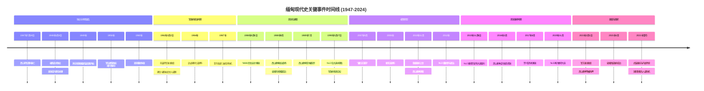
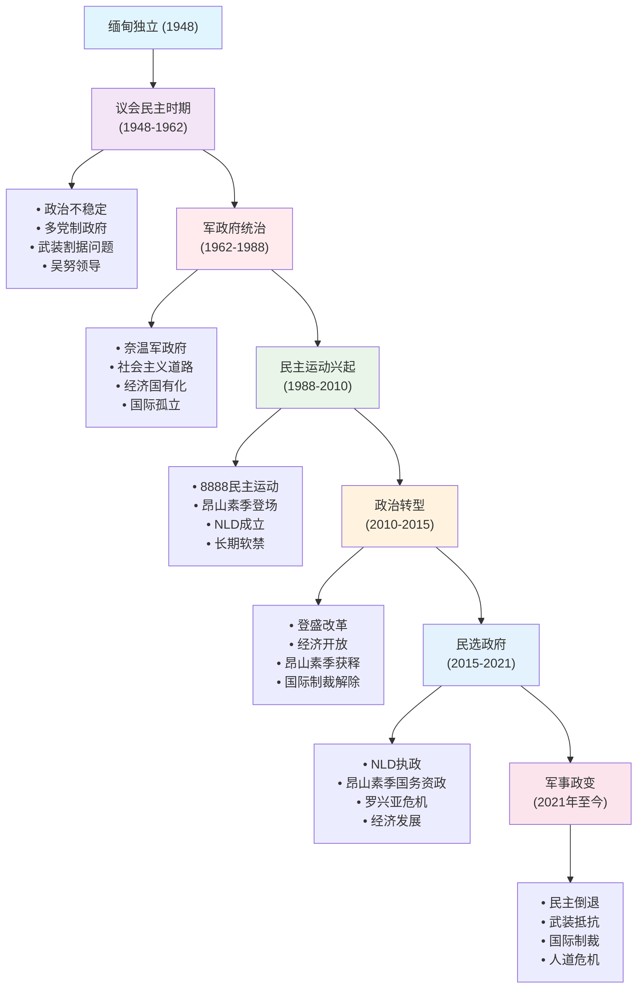
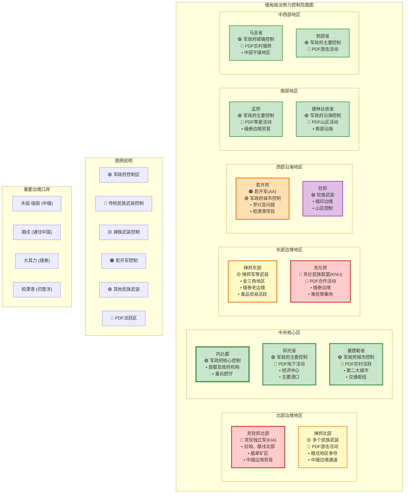
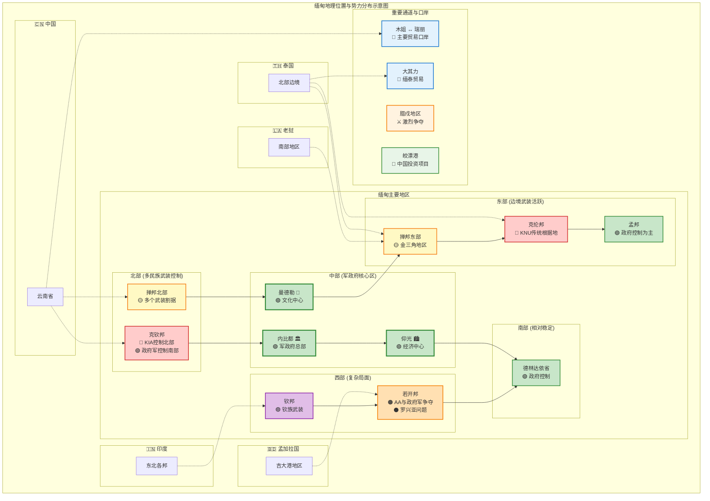

## 缅甸现代史发展脉络图解

为了更好地理解缅甸复杂的现代史发展过程，以下两个图表展示了从1947年到2024年的关键历史节点和发展阶段：

### 关键事件时间线

### 历史发展阶段图

这两个图表清晰地展示了缅甸现代史的发展脉络：

- **时间线图**突出了每个历史时期的关键事件和转折点
- **阶段图**展示了六个主要历史发展阶段及其特征
- 通过可视化方式，读者可以更直观地理解缅甸政治发展的复杂性和曲折性

接下来让我们深入了解每个历史时期的详细情况：

## 独立初期的混乱与重建（1948-1962年）

### 昂山遇刺与政权交接危机

1947年7月19日上午10时37分，昂山将军和他的内阁成员在仰光秘书处召开内阁会议时，被吴梭等人持枪闯入暗杀。这起震惊世界的政治谋杀案背后，涉及复杂的政治斗争。吴梭是前总理吴苏的政治盟友，而吴苏与昂山在独立谈判中存在严重分歧。

昂山之死对缅甸政治格局产生了深远影响。作为民族独立运动的灵魂人物，昂山拥有超越党派的威望和统合各方的能力。他的死亡导致了权力真空，也为后来的政治分裂埋下了种子。吴努虽然继承了昂山的政治遗产，但他既缺乏昂山的军事威望，也缺乏处理复杂政治局面的经验。

### 联邦制度的建立与挑战

1948年1月4日凌晨4点20分，缅甸正式宣布独立。新成立的缅甸联邦采用了联邦制，承认了各主要少数民族的自治权。这一制度设计体现了昂山在《彬龙协议》中的承诺，即在统一的缅甸联邦内给予少数民族自治。

然而，联邦制在实践中面临着巨大挑战。首先是中央政府与地方政府权力划分不清，导致频繁冲突。其次是各少数民族对自治范围的理解存在分歧，特别是掸邦、克伦邦和若开邦的精英对中央政府的政策多有不满。

最严重的问题是武装割据。克伦民族联盟（KNU）从1949年开始武装反叛，要求建立独立的克伦国。他们控制了缅甸东南部的大片地区，建立了平行的政府机构。类似的武装组织还有若开解放党、克钦独立组织等。

### 共产党武装与多线作战

缅甸共产党的武装斗争是独立后政府面临的另一个严重挑战。缅甸共产党分为两派：德钦丹东领导的"红旗"共产党和德钦梭领导的"白旗"共产党。两派虽然在意识形态上存在分歧，但都选择了武装斗争道路。

"白旗"共产党得到了中国共产党的支持，在缅北地区建立了根据地。他们与当地少数民族武装结成联盟，一度控制了缅甸近三分之一的国土。政府军不得不在多条战线上同时作战，这严重消耗了新生政府的实力。

吴努政府采取了"分而治之"的策略，通过政治谈判和军事打击相结合的方式处理武装问题。1958年，政府与部分克伦武装达成停火协议，但这种和解是脆弱的，很快就被打破。

### 经济重建与社会主义探索

独立后的缅甸经济百废待兴。英国殖民时期留下的经济结构以原材料出口为主，工业基础薄弱。吴努政府制定了雄心勃勃的经济发展计划，试图通过国有化和计划经济来实现快速发展。

1952年，政府颁布了《土地国有化法》，将大地主的土地收归国有，然后分配给农民。这一政策在一定程度上改善了农村的土地分配状况，但也引起了地主阶级的强烈反对。同时，由于缺乏有效的农业技术推广和金融支持，土地改革的效果有限。

在工业发展方面，政府采取了进口替代战略，试图通过保护关税和国有企业来发展本国工业。然而，由于缺乏技术和资金，这些努力收效甚微。到1960年代初，缅甸的工业产值仍然很低，主要依赖稻米出口维持外汇收入。

### 1958年军事看守政府

1958年，吴努政府内部发生严重分裂。反法西斯人民自由联盟分裂为"干净派"和"稳定派"，两派在政策和人事问题上存在根本分歧。政治危机愈演愈烈，议会政治几乎陷入瘫痪。

在这种情况下，吴努主动邀请军队介入，由奈温将军组建看守政府。奈温接受了这一邀请，但他明确表示这是临时性的，目的是恢复政治秩序，然后将权力交还给文官政府。

看守政府期间，奈温采取了一系列强硬措施。他清理了政府中的腐败分子，整顿了公共秩序，并在对付武装反叛方面取得了一定成效。这种效率给许多人留下了深刻印象，也为奈温后来的政变奠定了基础。

1960年，奈温如约举行了大选，并将权力交还给了获胜的吴努政府。然而，这种军事干预的成功经验使一些军官认为，军队比文官政府更有能力治理国家。

## 奈温军政府的社会主义道路（1962-1988年）

### 1962年政变与革命委员会的建立

1962年3月2日凌晨，奈温将军发动了"无血政变"，推翻了吴努政府。政变的直接原因是联邦问题的激化。掸邦和克伦邦的领导人要求修改宪法，给予各邦更大的自治权，甚至包括脱离联邦的权利。奈温认为这将导致国家分裂，因此决定采取行动。

奈温建立了革命委员会，宣布废除1947年宪法，解散议会和政党。他声称这是为了"拯救联邦免于分裂"。政变得到了军队的全力支持，民间阻力有限。许多人对议会政治的无效感到失望，因此对军事接管持观望态度。

革命委员会由17名军官组成，奈温担任主席。委员会宣布将实行"缅甸社会主义道路"，这是一种融合了佛教思想、民族主义和社会主义理念的独特意识形态。

### "缅甸社会主义道路"的理论与实践

1963年，奈温政府正式颁布了《缅甸社会主义道路》纲领。这份文件试图为缅甸的发展提供理论指导，但其内容模糊且充满矛盾。纲领声称要建立一个"没有剥削的社会主义社会"，但对如何实现这一目标缺乏具体的路径。

在经济政策方面，奈温政府采取了激进的国有化措施。1963年，政府颁布了《企业国有化法》，将所有重要的私人企业收归国有。这一政策不仅影响了外国投资者，也严重打击了华人和印度人经营的企业。

最具争议的是对外贸的垄断。政府建立了国家贸易公司，垄断了所有重要商品的进出口。这一政策虽然增加了政府收入，但也导致了商品短缺和黑市盛行。私人贸易被严格限制，许多传统商人被迫改行或移民。

### 货币改革与经济灾难

奈温政府最臭名昭著的政策是货币改革。1964年、1985年和1987年，政府三次宣布某些面额的纸币作废，理由是打击黑市和投机活动。这些措施没有任何预警，导致大量民众的储蓄一夜之间化为乌有。

特别是1987年的货币改革，政府宣布25、35和75缅元面额的纸币作废，只有45和90缅元面额的纸币继续有效。选择这些数字的原因是奈温相信9是他的幸运数字。这种荒唐的决定引起了广泛愤怒，成为1988年民主运动的重要导火索。

货币改革的后果是灾难性的。通货膨胀急剧上升，民众对政府的信任彻底破产。许多人失去了毕生积蓄，中产阶级几乎被摧毁。这种政策不仅没有解决经济问题，反而加剧了社会矛盾。

### 教育政策与文化控制

奈温政府对教育实行了严格控制。1964年，政府颁布了新的教育法，规定所有学校必须使用统一的教材和教学大纲。私立学校被关闭或国有化，包括许多历史悠久的教会学校和华文学校。

大学教育受到特别严格的控制。政府限制了大学的招生人数，并要求所有学生必须参加政治思想教育。许多专业被取消，特别是那些被认为"不实用"的人文学科。这种政策导致了教育质量的下降和知识分子的流失。

在文化政策方面，政府强调"缅甸化"，试图清除外国文化影响。英语教学被严格限制，许多外国书籍被禁止进口。传统的缅甸文化虽然得到了一定程度的保护，但也被政治化，成为宣传的工具。

### 对外政策与国际孤立

奈温政府奉行"中性"外交政策，但实际上导致了缅甸的国际孤立。政府退出了许多国际组织，减少了与外国的经济和文化交流。这种孤立主义政策虽然保持了政治独立，但也切断了缅甸与外界的联系。

与中国的关系在1960年代后期曾经紧张，主要是因为中国支持缅甸共产党的武装斗争。然而，随着中国外交政策的调整，两国关系逐步改善。1971年，中缅两国签署了边界协定，正式划定了两国边界。

与印度的关系也比较复杂。虽然两国都是不结盟运动的成员，但在边界问题和难民问题上存在分歧。1962年后，大量印度侨民离开缅甸，这影响了两国关系。

### 少数民族政策与武装冲突

奈温政府废除了联邦制，建立了中央集权的统一国家。这一政策引起了少数民族的强烈反对，武装冲突愈演愈烈。政府采取了军事打击和政治分化相结合的策略，但效果有限。

克伦民族联盟继续在东南部进行武装斗争，控制了大片边境地区。掸邦的武装组织也很活跃，特别是掸邦军和掸邦进步党。这些组织不仅进行政治斗争，还参与了毒品贸易，使问题更加复杂。

政府的对策是建立"战略村"，将边境地区的村民集中居住，切断他们与武装组织的联系。这种政策虽然在一定程度上削弱了武装组织的影响，但也引起了民众的不满。

## 8888民主运动与政权更迭（1988-1990年）

### 经济危机与社会不满

1980年代中期，缅甸经济陷入了严重危机。连续的货币改革摧毁了民众的储蓄，通货膨胀率高达50%以上。基本商品短缺，黑市价格飞涨。许多人不得不依靠黑市交易维持生计，但这种行为又是非法的。

教育系统也面临严重问题。大学关闭频繁，许多学生无法正常完成学业。就业机会稀少，即使是大学毕业生也难以找到工作。年轻人对未来感到绝望，这为后来的学生运动提供了土壤。

农村情况也不容乐观。虽然政府宣称要发展农业，但实际投入有限。农民仍然使用传统的耕作方法，生产效率低下。政府的粮食采购价格过低，农民缺乏生产积极性。

### 学生运动的兴起

1988年3月，仰光理工学院发生了学生与当地青年的冲突。这起看似普通的治安事件迅速演变为学生抗议活动，因为警方在处理过程中使用了过度暴力。学生们要求政府道歉并惩罚责任人，但遭到拒绝。

抗议活动迅速蔓延到其他学校。学生们的要求也从最初的具体事件扩展到更广泛的政治改革。他们要求政府实行民主改革，改善经济状况，取消一党制等。

政府采取了强硬态度，派遣军警镇压示威。3月16日，军警在仰光大学附近的茵雅湖大桥上开枪，打死了数十名学生。这起事件被称为"茵雅湖大桥屠杀"，进一步激化了矛盾。

### 全国性抗议运动

进入夏季后，抗议活动愈演愈烈。7月23日，奈温宣布辞职，但他选择的继任者苏貌仍然是军方强硬派。这一变化没有平息民愤，反而引起了更大规模的抗议。

8月8日，全国爆发了大规模的抗议活动。这一天被选择是因为"8888"这个数字被认为是吉利的。数十万人走上街头，要求结束军事统治，实现民主改革。抗议者来自各行各业，包括学生、工人、公务员、僧侣等。

政府的镇压异常残酷。军警使用实弹射击手无寸铁的示威者，造成了大量伤亡。据估计，在8888运动期间，至少有3000人死亡，但实际数字可能更高。这种血腥镇压震惊了国际社会。

### 昂山素季的政治登场

在8888运动的关键时刻，昂山素季发表了重要演讲。作为昂山将军的女儿，她呼吁实现民主改革，并强调要通过非暴力方式解决政治问题。她的演讲得到了广泛响应，确立了她在民主运动中的领导地位。

昂山素季的政治理念深受印度圣雄甘地的影响，强调非暴力抗争。她认为，只有通过和平方式才能实现真正的政治变革。这种理念与许多激进学生的想法不同，但得到了广大民众的支持。

9月18日，苏貌政府被军方推翻，苏貌将军建立了国家法律与秩序恢复委员会（SLORC）。新政府承诺进行政治改革，包括举行多党制选举。然而，许多人对军方的承诺持怀疑态度。

### 全国民主联盟的成立

1988年9月27日，昂山素季与前将军丁吴和埃文一起成立了全国民主联盟（NLD）。这是8888运动后成立的最重要的政治组织，汇集了各界民主人士。

全国民主联盟的政治纲领包括：建立多党制民主政府，保障人权和公民自由，实现民族和解，发展市场经济等。这些主张得到了广大民众的支持，使NLD迅速成为最有影响力的政治力量。

然而，NLD的活动受到了军政府的严密监视和限制。许多NLD成员被逮捕，党的活动受到各种阻挠。昂山素季本人也多次被软禁，但她坚持非暴力抗争的立场。

## 1990年大选与军政府拒绝交权（1990-2010年）

### 选举准备与政治环境

1989年，军政府宣布将于1990年举行多党制选举。这一决定在一定程度上回应了民众的要求，但军方对选举设置了许多限制。首先，选举只选举制宪议会代表，而不是正式政府；其次，军方保留了对选举过程的控制权。

在选举准备期间，政治环境仍然紧张。军政府继续镇压反对派活动，许多NLD成员被逮捕。1989年7月，昂山素季被软禁，理由是她的活动"威胁国家安全"。这一决定引起了国际社会的强烈谴责。

尽管面临种种限制，各政党仍然积极参与选举。除了NLD外，还有联合民族民主党（USDP）、民族团结党（NUP）等多个政党参选。这些政党代表了不同的政治立场和族群利益。

### 选举结果与国际反应

1990年5月27日，缅甸举行了自1960年以来的第一次多党制选举。选举结果令军政府震惊：全国民主联盟获得了压倒性胜利，在485个席位中赢得了392席，得票率达到60%以上。

这一结果充分体现了民众对民主变革的渴望。即使昂山素季被软禁，NLD仍然获得了巨大成功。这说明民众对军政府的统治已经完全失去信心，渴望实现真正的政治变革。

国际社会对选举结果表示欢迎，认为这是缅甸民主化的重要步骤。联合国、欧盟、美国等都呼吁军政府尊重选举结果，将权力移交给获胜的政党。

### 军政府拒绝交权的理由

然而，军政府拒绝承认选举结果。他们提出了多种理由：首先，选举只是为了选举制宪议会，而不是正式政府；其次，国家仍然面临分裂威胁，需要军方维护统一；再次，NLD等政党缺乏执政经验，无法有效治理国家。

军政府还声称，必须先制定新宪法，然后才能移交权力。他们开始了漫长的制宪过程，但这个过程完全由军方控制，没有真正的民主参与。这种做法实际上是为了拖延时间，巩固军方统治。

军政府的拒绝交权引起了国际社会的强烈谴责。联合国开始对缅甸实施制裁，美国和欧盟也采取了类似措施。这些制裁虽然给缅甸经济造成了困难，但未能迫使军政府改变立场。

### 昂山素季的软禁生涯

从1989年到2010年，昂山素季大部分时间都被软禁。她被限制在仰光的家中，无法参与政治活动。这种软禁是军政府控制反对派的重要手段，也是他们避免国际压力的策略。

在软禁期间，昂山素季继续坚持非暴力抗争的理念。她通过律师和党内同志传达政治主张，呼吁国际社会关注缅甸的人权状况。她的坚持赢得了国际社会的尊敬，1991年获得了诺贝尔和平奖。

软禁生活对昂山素季个人来说是巨大的考验。她无法与家人团聚，也无法直接参与政治活动。但她始终保持乐观态度，相信民主最终会在缅甸实现。

### 国际制裁与经济影响

1990年代开始，缅甸面临着广泛的国际制裁。美国、欧盟、澳大利亚等都对缅甸实施了经济制裁，包括贸易禁运、投资限制、旅行禁令等。这些制裁的目的是迫使军政府进行政治改革。

制裁对缅甸经济造成了严重影响。外国投资大幅减少，对外贸易受到限制，技术进步缓慢。缅甸逐渐从一个相对富裕的国家变成了世界上最贫穷的国家之一。

然而，制裁也产生了一些意想不到的后果。军政府转而加强了与中国、印度、俄罗斯等国的关系，这些国家并不参与制裁。这种"制裁悖论"在一定程度上帮助军政府维持了统治。

### 2007年"藏红花革命"

2007年8月，军政府突然宣布大幅提高燃油价格，引发了民众不满。9月，仰光等地爆发了抗议活动。起初抗议规模不大，但逐渐扩大，最终演变为全国性的抗议运动。

这次抗议运动的特点是僧侣的积极参与。数万名僧侣走上街头，要求政府降低物价，改善民生。由于僧侣身着褐红色袈裟，这次运动被称为"藏红花革命"。

军政府对抗议活动采取了残酷镇压。军警冲击寺庙，逮捕僧侣，使用武力驱散示威者。这种对宗教人士的暴力引起了国际社会的强烈谴责，进一步损害了军政府的形象。

## 政治转型的开端（2010-2015年）

### 2008年宪法与"有纪律的民主"

2008年，军政府颁布了新宪法，为政治转型提供了法律框架。这部宪法规定了向"有纪律的民主"过渡的路线图，但同时保障了军方在政治体系中的主导地位。

宪法规定议会中25%的席位由军方指定，重要职位需要军方同意。这种设计确保了军方在政治转型中的主导地位，也为后来的政治发展设定了框架。

宪法还规定，总统必须具备特定条件，包括其配偶和子女不能拥有外国国籍。这一条款被认为是专门针对昂山素季的，因为她的丈夫是英国人，儿子拥有英国国籍。

### 2010年大选与登盛政府

2010年，军政府举行了新宪法框架下的首次选举。这次选举的环境与1990年大选完全不同。全国民主联盟抵制了选举，认为选举条件不公平。新成立的联邦巩固与发展党（USDP）获得了大部分席位。

登盛成为新任总统，开始了缅甸政治转型的关键阶段。登盛虽然出身军方，但他表现出了推进改革的意愿。他的政府开始了一系列政治和经济改革措施。

登盛政府的改革包括：释放政治犯，放松媒体管制，允许政治集会，改善与反对派的关系等。这些措施得到了国际社会的积极评价，制裁开始逐步解除。

### 昂山素季的释放与政治复出

2010年11月13日，昂山素季被释放，结束了长达15年的软禁生活。她的释放标志着缅甸政治转型的重要进展，也为全国民主联盟重新参与政治创造了条件。

昂山素季释放后，立即投入了政治活动。她与登盛政府进行了接触，讨论政治改革问题。虽然双方在许多问题上仍有分歧，但对话的恢复本身就是重要进展。

2012年，全国民主联盟决定参与议会补选。这是NLD自1990年以来首次参与选举。昂山素季亲自参选，并成功当选议员。这标志着NLD重新成为合法政治力量。

### 经济改革与对外开放

登盛政府在经济领域也进行了重要改革。政府放松了对私营企业的限制，允许外国投资，改革了银行系统。这些措施有助于刺激经济增长，改善民生。

汇率制度的改革是重要举措之一。政府统一了官方汇率和市场汇率，这有助于改善贸易环境，吸引外国投资。同时，政府也开始建立现代化的金融体系。

对外开放政策使缅甸重新融入国际社会。许多国家开始解除对缅甸的制裁，外国投资逐渐增加。这种变化为缅甸经济发展创造了新的机遇。

### 民族和解进程

登盛政府还试图解决长期存在的民族问题。政府与多个少数民族武装组织进行了和平谈判，签署了一系列停火协议。这些努力有助于减少武装冲突，促进民族团结。

然而，民族和解进程面临着巨大挑战。首先是信任缺失问题。经过数十年的武装冲突，各方都对对手的诚意表示怀疑。军方担心少数民族武装利用停火机会重新整军备战，而少数民族武装则怀疑政府只是暂时性的策略调整。

其次是利益分配问题。少数民族地区蕴藏着丰富的自然资源，包括宝石、木材、石油等。如何公平分配这些资源收益成为谈判的焦点。许多少数民族认为，长期以来他们的资源被中央政府掠夺，应该获得更大的控制权。

第三是自治程度问题。虽然2008年宪法规定了联邦制，但实际的权力分配仍然高度集中。少数民族要求获得真正的自治权，包括在教育、文化、经济发展等方面的决策权。

### 停火协议的脆弱性

登盛政府虽然与多个少数民族武装组织签署了停火协议，但这些协议往往缺乏有效的监督机制。克钦独立军（KIA）、掸邦军等重要武装组织对政府的诚意持怀疑态度，认为政府只是在拖延时间，而非真心寻求和解。

2011年，克钦邦爆发了新一轮武装冲突，打破了长达17年的停火。这次冲突的根本原因是围绕密松大坝项目的争议。中国支持的这一项目虽然能带来经济利益，但会淹没大片克钦人的传统土地，引起了强烈反对。

若开邦的罗兴亚人问题也在这一时期开始恶化。虽然政府在其他方面推进改革，但对罗兴亚人的歧视政策却没有根本改变。2012年，若开邦发生了严重的宗教冲突，数十万罗兴亚人被迫逃离家园。

### 经济发展与社会矛盾

虽然经济改革带来了一定的增长，但收益分配不均的问题日益突出。外国投资主要集中在资源开发和基础设施建设领域，而这些项目往往涉及土地征收，引起了农民的不满。

仰光等大城市的房地产价格飞涨，许多普通民众被迫搬离市中心。这种"发展型排斥"引起了社会不满，也为后来的政治变化埋下了伏笔。

教育和医疗等公共服务的改善滞后于经济发展。许多边远地区的学校和医院设施陈旧，师资和医护人员短缺。这种发展不平衡加剧了地区差异和民族矛盾。

## 昂山素季政府与民主巩固（2015-2021年）

### 2015年大选的历史性胜利

2015年11月8日，缅甸举行了具有里程碑意义的全国大选。这是军政府承诺的政治转型的关键考验，也是全国民主联盟重新参与选举的重要机会。这次选举被认为是缅甸历史上最自由、最公正的选举之一。

选举结果再次证明了民众对民主变革的强烈渴望。全国民主联盟获得了压倒性胜利，在联邦议会中赢得了绝对多数席位。在人民院（下院）440个选举席位中，NLD获得255席；在民族院（上院）168个选举席位中，NLD获得135席。

这次胜利具有特殊意义。与1990年的选举不同，军方这次承认了选举结果，同意按照宪法程序移交权力。这标志着缅甸政治转型进入了新阶段，从军政府主导的"有纪律的民主"向真正的民主政府过渡。

选举结果反映了民众对变革的渴望。尽管经济有所发展，但民众对军方主导的政治体制仍然不满。昂山素季的个人魅力和NLD的民主理念得到了广泛支持。

### 昂山素季的"国务资政"角色

由于宪法限制，昂山素季无法担任总统。NLD选择了她的亲密盟友吴廷觉担任总统，但实际权力掌握在昂山素季手中。2016年4月，新政府为昂山素季专门设立了"国务资政"一职，使她成为事实上的政府首脑。

昂山素季政府面临着巨大的期望和挑战。民众期望新政府能够迅速改善经济状况，推进民主化进程，实现民族和解。然而，实际执政比在野时的理想主义更加复杂。

新政府的施政重点包括：深化经济改革，推进法治建设，改善教育和卫生条件，推进民族和解进程等。然而，在许多关键问题上，政府受到宪法限制和军方影响的制约。

### 昂山素季政府的政策与挑战

昂山素季政府上台后，面临着巨大的期望和复杂的挑战。民众期望快速的政治改革和经济发展，但现实情况远比预期复杂。政府必须在军方的制约下推进改革，这严重限制了行动空间。

在经济政策方面，政府承诺建设包容性经济，改善民生。然而，由于缺乏执政经验和技术官僚，许多政策的执行效果不佳。外国投资虽然有所增加，但仍然集中在少数领域。

政府在民族和解方面的努力也面临挫折。2016年，政府召开了"21世纪彬龙会议"，试图重启和平进程。但由于各方立场差异巨大，会议收效甚微。武装冲突在一些地区仍然持续。

### 罗兴亚危机与国际形象受损

昂山素季政府面临的最大挑战是罗兴亚问题。罗兴亚人是生活在若开邦的穆斯林少数民族，长期遭受歧视和迫害。2017年8月，罗兴亚救世军袭击了警察检查站，引发了军方的大规模报复行动。

军方的行动被国际社会称为"种族清洗"甚至"种族灭绝"。数十万罗兴亚人逃往孟加拉国，成为难民。这一危机引起了国际社会的强烈谴责，昂山素季的国际声誉严重受损。

昂山素季对罗兴亚危机的处理引起了广泛争议。她既没有谴责军方的行动，也没有为罗兴亚人提供有效保护。许多人认为，她为了维护与军方的微妙平衡，选择了沉默，这损害了她作为人权倡导者的形象。

国际社会对缅甸重新实施了部分制裁，昂山素季的多个荣誉称号被撤销。这一危机表明，即使在民选政府统治下，军方在某些关键问题上仍然拥有决定性影响力。

昂山素季对这场危机的处理引起了国际社会的强烈批评。作为诺贝尔和平奖获得者，她的沉默和辩护立场让许多支持者感到失望。一些国家甚至撤销了对她的荣誉称号。这场危机的根本原因是复杂的历史问题和制度性歧视。军方在处理危机中发挥了主导作用，文官政府的影响力有限。这暴露了缅甸政治转型的深层矛盾。

### 国际关系的复杂化

罗兴亚危机使缅甸与西方国家的关系急剧恶化。美国和欧盟重新实施了部分制裁，国际投资者对缅甸的信心下降。这种变化迫使缅甸更加依赖中国和其他亚洲国家。

中国在这一时期大幅增加了对缅甸的投资，推进"一带一路"倡议下的项目。中缅经济走廊、皎漂港等项目成为两国合作的重点。然而，这种密切关系也引起了缅甸民众的担忧。

与印度的关系也有所发展。印度试图通过经济合作和发展援助来平衡中国在缅甸的影响力。东盟国家虽然在政治上支持缅甸，但也对罗兴亚危机表示关切。

### 经济发展与挑战

昂山素季政府在经济发展方面取得了一定成就。政府继续推进经济自由化，改善投资环境，发展基础设施。外国投资逐渐增加，经济增长率保持在较高水平。

然而，经济发展也面临诸多挑战。首先是基础设施落后。经过数十年的孤立和投资不足，缅甸的电力、交通、通信等基础设施严重滞后。改善基础设施需要大量投资和时间。

其次是人力资源问题。长期的教育投入不足导致劳动力素质偏低，技术工人缺乏。这限制了缅甸承接高附加值产业的能力，大部分投资仍然集中在劳动密集型的制造业和资源开采业。

第三是制度建设滞后。法律体系不完善，政府效率低下，腐败问题仍然存在。这些问题影响了投资环境，也制约了经济发展的质量。

### 宪法改革的努力与挫折

昂山素季政府一直努力推进宪法改革，试图减少军方在政治体系中的影响力。政府提出了多项修宪提案，包括减少军方在议会中的席位比例，修改总统任职条件等。

然而，宪法改革面临巨大阻力。2008年宪法规定，任何修宪都需要议会75%以上的票数支持。由于军方控制25%的席位，他们实际上拥有对修宪的否决权。这种设计确保了军方能够阻止任何不利于其利益的宪法修改。

2019年，NLD在议会提出了修宪动议，但遭到军方议员的一致反对。这一挫折表明，在现有宪法框架下实现真正的民主化仍然困难重重。

## 2021年军事政变与民主倒退

### 2020年大选与争议

2020年11月8日，缅甸举行了第二次民主选举。尽管面临新冠疫情的挑战，选举仍然如期举行。全国民主联盟再次获得压倒性胜利，赢得了更多席位，证明了民众对民主政治的持续支持。

然而，选举结果遭到了军方支持的联邦巩固与发展党的质疑。他们声称选举存在舞弊行为，要求重新计票。选举委员会拒绝了这一要求，认为选举过程是公正透明的。

军方高层开始对选举结果表达不满。他们暗示如果争议得不到解决，可能会采取行动。这种威胁在缅甸政治环境中并不新鲜，但很多人认为军方不会真的推翻民选政府。

### 政变的背景与导火索

军方的不满不仅来自选举结果，还包括对政治边缘化的担忧。随着民主政治的深入发展，军方在政治决策中的影响力逐渐下降。一些强硬派军官认为，必须采取行动来维护军方的利益。

经济因素也发挥了作用。COVID-19疫情对缅甸经济造成了严重冲击，失业率上升，社会矛盾加剧。军方认为民选政府处理危机的能力不足，需要军方来恢复秩序。

### 2021年2月1日政变

2021年2月1日清晨，就在新一届议会即将召开之际，军方发动了政变。军队总司令敏昂莱下令逮捕了昂山素季、总统温敏以及其他NLD领导人。军方宣布接管政权，并宣布国家进入为期一年的紧急状态。

政变的理由是2020年大选存在"大规模舞弊"，但军方并未提供令人信服的证据。许多观察家认为，军方发动政变的真正原因是担心失去在政治体系中的特殊地位，以及面临因罗兴亚危机而可能承担的国际法律责任。

政变的执行过程显示了军方的充分准备。他们切断了通信网络，控制了关键设施，迅速掌握了局势。这种效率表明政变不是临时决定，而是经过周密策划的。军方成立了国家管理委员会，由国防军总司令敏昂莱领导。他们承诺在紧急状态结束后举行新的选举，但这一承诺缺乏可信度。

政变引起了国际社会的强烈谴责。联合国安理会召开紧急会议，美国、欧盟等重新对缅甸实施制裁。东盟等地区组织也表达了关切，要求军方恢复民主政府。

### 民众抗议与镇压

政变后，缅甸民众爆发了大规模抗议活动。数十万人走上街头，要求军方释放被拘押的政治领导人，恢复民主政府。抗议活动采用了各种形式，包括街头示威、罢工、公民不服从运动等。这些抗议活动被称为"公民不服从运动"。

抗议活动的规模和持续时间都超出了军方的预期。医生、教师、银行职员等各行各业的人都参与了抗议。社交媒体成为组织抗议的重要工具，年轻人发挥了关键作用。

军政府对抗议活动进行了残酷镇压。军警使用实弹射击示威者，造成大量伤亡。据人权组织统计，自政变以来已有数千人死亡，数万人被拘押。

抗议运动的特点是年轻人的积极参与。Z世代的年轻人成为抗议的主力军，他们通过社交媒体组织活动，传播信息。这一代人成长在民主转型时期，对军事统治有强烈的反感。

### 国际社会的制裁与孤立

国际社会对政变做出了强烈反应。联合国、美国、欧盟等都对缅甸实施了新的制裁措施。这些制裁主要针对军方领导人和相关企业，试图切断军方的资金来源。

东盟也采取了罕见的强硬立场。他们拒绝邀请敏昂莱参加峰会，并任命了特使来推动对话。这种态度反映了东盟对政变的不满和对地区稳定的担忧。

然而，制裁的效果有限。军方仍然控制着国家机器，并得到了中国和俄罗斯的默许。这种国际分化限制了制裁的有效性。

### 全国团结政府的成立

2021年4月，被推翻的NLD政府成员和其他反对派人士成立了"全国团结政府"（NUG），声称代表缅甸人民的合法政府。全国团结政府获得了部分国际支持，但未得到主要国家的正式承认。

全国团结政府宣布建立"人民保卫军"，号召武装反抗军政府。这标志着抗议运动从和平示威转向武装斗争。许多年轻抗议者加入了反军政府的武装组织，接受军事训练。

同时，一些少数民族武装组织也表示支持民主运动，反对军政府。这形成了军政府与多支反对派武装的复杂冲突局面，缅甸再次陷入内战状态。

## 当前局势与未来前景（2021-2024年）

### 武装抵抗的兴起

面对军方的暴力镇压，一些抗议者开始转向武装抵抗。民族团结政府（NUG）成立了人民防卫军（PDF），在各地开展游击战。这些武装组织得到了一些少数民族武装的支持。

武装抵抗的兴起标志着缅甸政治危机的进一步恶化。国家实际上陷入了内战状态，政府军与各种武装组织在多个地区交战。这种暴力循环严重破坏了社会秩序和经济发展。

然而，武装抵抗也面临着巨大挑战。缺乏统一指挥、武器短缺、资金不足等问题制约了其有效性。同时，武装冲突也给平民带来了巨大痛苦。

### 经济崩溃与人道主义危机

政变后，缅甸经济陷入了深度衰退。国际制裁、投资撤离、内战等因素导致经济活动大幅萎缩。货币贬值、通胀飙升，民众生活水平急剧下降。

银行系统几乎瘫痪，许多企业被迫关闭或减产。失业率急剧上升，特别是年轻人面临严重的就业困难。这种经济困境进一步加剧了社会矛盾。

人道主义危机也日益严重。数百万人需要人道主义援助，但军政府限制了援助机构的活动。儿童教育、医疗保健等基本服务受到严重影响。

政变和随后的镇压引发了严重的人道主义危机。数十万人流离失所，基本生活物资短缺。医疗系统受到严重冲击，许多医生参与了公民不服从运动，拒绝为军政府工作。

新冠疫情加剧了人道主义危机。政变期间正值疫情爆发，但政治动荡严重影响了疫情防控工作。疫苗接种计划中断，医疗资源严重不足。

教育系统也受到严重影响。许多教师拒绝在军政府统治下工作，学校关闭，学生无法正常上课。这将对一代人的成长产生深远影响。

### 地区安全的挑战

缅甸的政治危机对地区安全产生了严重影响。大量难民涌入邻国，给这些国家造成了负担。毒品贸易、人口贩卖等跨境犯罪活动增加。

中国特别关注边境地区的稳定。缅北地区的武装冲突影响了中缅边境贸易，也威胁到中国边民的安全。中国一直在推动对话，但效果有限。

印度也面临着类似挑战。缅甸难民的涌入以及边境地区的不稳定影响了印度的边境安全。东盟国家也担心政治危机会影响地区一体化进程。

### 国际制裁与孤立

政变后，缅甸再次面临广泛的国际制裁。美国、欧盟、英国、加拿大等都对军政府实施了制裁，包括冻结资产、禁止军火贸易、限制经济合作等。这些制裁旨在削弱军政府的资源，迫使其恢复民主。

然而，制裁的效果有限。中国和俄罗斯等国并未参与制裁，继续与军政府保持关系。东盟虽然表达了关切，但采取的行动相对温和。这种分歧削弱了国际压力的效果。

经济制裁对缅甸普通民众的影响也很大。外国投资撤离，贸易受阻，就业机会减少。这种情况可能会长期持续，进一步恶化民众的生活条件。

### 国际斡旋努力

国际社会一直在努力寻求政治解决方案。联合国特使、东盟特使、中国等都在进行斡旋努力。然而，由于各方立场差异巨大，这些努力收效甚微。

军方坚持认为他们的行动是必要的，拒绝无条件释放政治犯或恢复民主政府。反对派则要求军方立即下台，恢复2020年选举结果。这种根本性分歧使得对话变得困难。

一些分析人士认为，只有通过长期的国际压力和内部抵抗，才能迫使军方做出让步。但这个过程可能会持续很长时间，给缅甸人民带来更多痛苦。

## 当前政治势力格局分析

### 主要政治势力概览

2021年政变后，缅甸形成了复杂的多元政治势力格局。各方势力在政治立场、国际倾向和对华关系上都有着不同的态度和战略考量。

### 军政府集团（国家管理委员会 SAC）

#### 政治立场与治理理念

国家管理委员会由军队总司令敏昂莱领导，代表了缅甸军方的政治利益。他们的核心政治立场包括：

**维护国家统一**：军政府强调，只有军队才能维护缅甸的国家统一和领土完整，防止国家分裂。他们认为文官政府在处理民族问题上软弱无能，容易导致国家分裂。

**秩序优先论**：军政府坚持认为，在当前复杂的政治环境下，维护社会秩序比民主更重要。他们声称只有通过强有力的中央集权才能恢复稳定。

**渐进式民主**：军政府表面上仍然承诺最终恢复民主，但强调必须在他们主导下进行"有纪律的民主"转型，拒绝立即交权。

#### 国际关系倾向

**务实外交**：面对西方制裁，军政府采取务实的外交策略，主要依靠不参与制裁的国家维持国际空间。

**亚洲优先**：重点发展与中国、俄罗斯、印度等亚洲大国的关系，同时维护与东盟邻国的基本关系。

**经济导向**：通过经济合作来突破外交孤立，特别是在能源和基础设施领域寻求国际合作。

#### 对华关系态度

军政府对中国持积极合作态度，主要原因包括：

**战略依赖**：在西方制裁下，中国成为缅甸最重要的经济和外交支撑。军政府需要中国的投资、贸易和政治支持来维持统治。

**历史传统**：缅甸军方与中国军方有着长期的合作关系，双方在军事技术、人员培训等方面有密切往来。

**经济利益**：中缅经济走廊、一带一路项目等为军政府提供了重要的经济收入来源。

**地缘考量**：军政府认识到缅甸的地理位置使其必须与中国这个强大邻国保持良好关系。

### 民主派势力（全国团结政府 NUG & 全国民主联盟 NLD）

#### 政治立场与理念

**民主宪政**：坚持恢复民主制度，要求军方立即释放所有政治犯，恢复2020年大选结果。

**联邦制改革**：主张建立真正的联邦制，给予少数民族更大的自治权，通过政治协商解决民族问题。

**法治建设**：强调建立独立的司法体系，保障人权和公民自由，建设现代法治国家。

**和解政策**：虽然目前采取抵抗立场，但长期目标仍是通过对话实现民族和解。

#### 国际关系倾向

**西方导向**：积极寻求美国、欧盟等西方国家的支持，希望通过国际制裁和外交压力迫使军方妥协。

**多边主义**：支持联合国、东盟等多边机制在解决缅甸问题中发挥作用。

**人权外交**：以人权、民主价值为纽带，寻求国际社会的道义支持和实质帮助。

#### 对华关系的复杂态度

民主派对中国的态度较为复杂和微妙：

**历史恩怨**：部分民主派人士对中国在冷战时期支持缅甸共产党武装斗争存在历史记忆。

**现实考量**：虽然对中国支持军政府感到不满，但也认识到与中国保持关系的重要性。

**经济务实**：承认中国是缅甸最重要的经济伙伴，未来民主政府也需要与中国合作。

**政策分歧**：对一带一路等项目持谨慎态度，担心过度依赖中国会损害国家主权。

**民意压力**：需要回应民众对中国支持军政府的不满情绪，但避免完全对立。

### 少数民族武装组织

#### 政治立场的多样性

**自治诉求**：绝大多数民族武装的核心诉求是获得真正的民族自治权，包括政治、经济、文化等方面的自主权。

**联邦制支持**：多数支持建立真正的联邦制国家，但对联邦制的具体形式有不同理解。

**反军政府**：大部分民族武装反对军政府的中央集权政策，支持民主力量。

**实用主义**：在具体政策上往往采取实用主义态度，根据自身利益决定合作对象。

#### 主要民族武装组织立场

**克钦独立军（KIA）**：
- 坚决反对军政府，支持民主运动
- 要求真正的联邦制和民族自决权
- 控制着重要的翡翠和木材资源

**掸邦军（RCSS）**：
- 相对温和，愿意通过谈判解决问题
- 支持联邦制，但对具体形式较为灵活
- 在毒品问题上与政府有复杂关系

**克伦民族联盟（KNU）**：
- 历史悠久的反政府武装
- 强烈支持民主运动，与NUG合作密切
- 要求建立独立的克伦邦

**若开军（AA）**：
- 为若开族争取自治权
- 与罗兴亚问题有复杂关联
- 对各方政治力量保持一定距离

#### 对华关系态度

少数民族武装对中国的态度因地区和组织而异：

**边境地区武装**：
- 与中国有密切的经济联系
- 依赖中缅边境贸易维持经济
- 对中国政策变化高度敏感

**内陆武装**：
- 对中国影响相对较小
- 更多关注与缅族政府的关系
- 对中国投资项目影响其领土时会表示关切

**资源控制区武装**：
- 通过控制自然资源与中国企业合作
- 既受益于中国投资也担心失去控制权
- 希望在中国投资中获得更大发言权

### 人民防卫军（PDF）与地方抵抗组织

#### 政治立场与特点

**草根民主**：由普通民众自发组织，体现了强烈的民主诉求和反军政府立场。

**分散化结构**：各地PDF相对独立，缺乏统一指挥，政治立场有一定差异。

**激进倾向**：相比传统政治组织，PDF在策略上更加激进，倾向于武装抗争。

**年轻化特征**：成员以年轻人为主，对军事统治零容忍。

#### 国际关系倾向

**西方同情**：获得西方国家的道义支持，但在实质援助上有限。

**技术依赖**：依靠国际社会的技术和信息支持开展活动。

**资金困难**：面临严重的资金和装备短缺问题。

#### 对华态度

**情绪化反对**：由于中国被视为支持军政府，PDF对中国持明显的负面态度。

**实际行动**：部分PDF组织曾针对中国投资项目采取行动。

**未来变数**：如果政治局势变化，这种态度可能会有所调整。

### 其他政治力量

#### 传统政治精英

一些前政府官员、退休军官和传统政治家试图在各方之间寻找平衡，但影响力有限。

#### 宗教势力

佛教僧侣群体在政治上有一定影响力，但内部立场分化，既有支持民主的，也有倾向于稳定的。

#### 商业精英

商界人士大多希望政治稳定以利于经济发展，对各种政治力量都保持一定距离。

### 各势力间的互动关系

#### 军政府 vs 民主派

两者处于根本对立状态，短期内难以实现和解。军政府拒绝妥协，民主派坚持抗争。

#### 民主派 vs 民族武装

在反对军政府方面有共同利益，但在具体政策和未来政治安排上存在分歧。

#### 各民族武装之间

既有合作也有竞争，在共同反对军政府的同时，也在争夺各自的利益和地盘。

#### 国际因素的影响

中国、美国、印度等大国的政策对各政治势力的立场和行为都有重要影响。

### 对中国关系的整体考量

#### 地缘政治现实

无论哪个政治力量最终胜出，都必须面对与中国这个强大邻国的关系问题。地理位置决定了中缅关系的重要性。

#### 经济依赖困境

缅甸经济对中国的依赖使得任何政治力量都难以完全脱离与中国的关系，这是一个客观现实。

#### 平衡外交需求

大多数缅甸政治力量都希望在中美之间保持平衡，避免过度依赖任何一方。

#### 民意与政策的矛盾

政治领导人必须在回应民众情绪和维护国家利益之间寻找平衡。

## 各政治势力的地理控制范围

### 势力分布概况

2021年政变后，缅甸实际上形成了多方割据的复杂局面。各政治势力控制着不同的地理区域，形成了"国中有国"的分裂状态。

#### 缅甸政治势力控制范围总览图

#### 地理位置与邻国关系示意图

**图表说明**：
- 第一个图表显示了各省邦的详细控制情况和重要特征
- 第二个图表展示了缅甸的地理位置以及与周边国家的关系
- 不同颜色代表不同的控制势力，边框粗细反映控制强度
- 虚线表示国际边界，实线表示内部联系

### 军政府控制区域

#### 核心控制区

**中央平原地区**：
- 内比都（首都）及周边地区
- 仰光及仰光省大部分地区
- 曼德勒及曼德勒省主要城市
- 勃固省、马圭省的主要城镇

**沿海地区**：
- 伊洛瓦底江三角洲大部分地区
- 若开邦的主要城市（实兑、皎漂等）
- 德林达依省的部分沿海地区

#### 有效控制特征

**城市中心**：军政府主要控制各省邦的首府城市和重要工业城镇，这些地区有重兵把守。

**交通要道**：控制主要高速公路、铁路线和重要桥梁，确保核心区域间的联系。

**经济中心**：控制主要港口、工业区和商业中心，维持基本的经济运转。

**行政机构**：在控制区内保持完整的行政体系和公共服务。

#### 控制薄弱区域

**农村地区**：即使在军政府名义控制的省份，许多农村地区实际上处于无政府状态。

**边境地带**：除了重要的边境口岸外，大部分边境地区控制力有限。

**山区丘陵**：地形复杂的山区往往是军政府控制的薄弱环节。

### 少数民族武装控制区域

#### 克钦邦北部（克钦独立军 KIA）

**核心控制区**：
- 拉咱、腊戌北部山区
- 中缅边境的重要通道
- 翡翠矿区和木材资源丰富地区

**控制特征**：
- 建立了相对完整的行政体系
- 控制重要的经济资源
- 与中国云南边境贸易活跃
- 拥有自己的教育和医疗体系

#### 掸邦东部（掸邦军等）

**控制范围**：
- 掸邦东部大片山区
- 中缅、缅老、缅泰边境地区
- 著名的"金三角"部分地区

**特殊情况**：
- 多个武装组织割据，控制区域犬牙交错
- 毒品贸易活跃，经济结构复杂
- 与泰国、老挝、中国都有边境贸易

#### 克伦邦东南部（克伦民族联盟 KNU）

**传统根据地**：
- 克伦邦东部山区
- 缅泰边境的重要地段
- 萨尔温江流域部分地区

**控制特点**：
- 历史悠久，根基深厚
- 与泰国关系密切
- 接纳大量难民和流亡人士

#### 若开邦北部（若开军 AA）

**活动区域**：
- 若开邦北部山区
- 部分沿海地区
- 与孟加拉国边境地带

**复杂因素**：
- 与罗兴亚问题交织
- 面临军政府重点打击
- 控制区域相对不稳定

#### 钦邦西部（钦民族武装）

**控制范围**：
- 钦邦山区部分地区
- 与印度接壤的边境地区

**特征**：
- 规模相对较小
- 主要关注民族自治权
- 受印度影响较大

### 人民防卫军（PDF）活动区域

#### 分布特征

**广泛分散**：PDF组织遍布缅甸各地，没有固定的大块控制区域。

**游击性质**：采用游击战术，控制区域经常变化。

**城乡结合**：既在城市进行地下活动，也在农村建立据点。

#### 主要活动区域

**中部干燥地区**：
- 马圭省、曼德勒省的农村地区
- 对军政府构成较大威胁
- 经常袭击政府军设施

**东南部地区**：
- 与传统民族武装合作
- 在克伦邦、孟邦等地活跃
- 接受民族武装的训练和支持

**北部山区**：
- 在克钦邦、掸邦北部活动
- 与当地民族武装有一定合作
- 主要进行小规模游击活动

**沿海地区**：
- 在若开邦、德林达依省等地有零星活动
- 主要进行情报收集和宣传工作

### 争夺激烈的关键地区

#### 掸邦中部

**战略重要性**：连接南北的重要通道，多方势力交汇。

**控制现状**：军政府控制主要城镇，各民族武装控制山区，PDF在农村活跃。

**争夺焦点**：重要的交通枢纽和经济中心。

#### 克钦邦南部

**地理位置**：连接中央地区和克钦邦北部的关键地带。

**军事态势**：政府军与克钦独立军长期对峙，冲突频繁。

**经济价值**：丰富的自然资源，包括翡翠、木材等。

#### 若开邦

**复杂局面**：军政府、若开军、罗兴亚武装多方角力。

**国际关注**：由于罗兴亚问题，国际社会高度关注。

**发展前景**：皎漂港等重要项目使该地区战略价值凸显。

### 特殊地区分析

#### 边境贸易区

**木姐-瑞丽**：中缅最重要的贸易口岸，各方都力图控制。

**腊戍地区**：连接中国云南的重要通道，多方势力争夺。

**大其力**：缅泰边境重要口岸，影响整个金三角地区。

#### 资源丰富区

**翡翠矿区**：主要在克钦邦，是各方争夺的重点。

**木材产区**：分布在多个边境地区，控制权经常变化。

**农业区**：中央平原的农业产区是军政府重点控制区域。

### 控制力量对比分析

#### 军政府优势

- 拥有正规军和重型装备
- 控制空中力量和主要交通线
- 掌握国家财政和外汇储备
- 获得部分国际支持

#### 民族武装优势

- 在传统根据地有深厚根基
- 熟悉地形，适合游击战
- 控制重要经济资源
- 有稳定的资金来源

#### PDF组织优势

- 民众支持度高
- 行动灵活，难以清剿
- 与国际民主力量有联系
- 年轻化程度高，士气旺盛

### 地理控制的经济意义

#### 资源控制

各方都试图控制重要的自然资源产区，这直接关系到其经济实力和持续作战能力。

#### 贸易通道

控制边境贸易通道意味着控制重要的收入来源，这对各方都至关重要。

#### 税收来源

谁控制了经济活跃地区，谁就能获得税收收入，维持组织运转。

### 国际影响因素

#### 中国因素

中缅边境地区的控制格局直接影响中国的经济利益和边境安全。

#### 泰国影响

缅泰边境地区的局势与泰国的安全和经济利益密切相关。

#### 印度考量

缅印边境地区的稳定对印度的东北部安全具有重要意义。

### 未来演变趋势

#### 长期化倾向

各方力量对比短期内难有根本性改变，控制格局可能长期化。

#### 动态平衡

各方可能在某些地区达成默契，形成相对稳定的势力范围。

#### 国际调解

国际社会可能推动建立某种形式的停火监督机制。

这种复杂的地理控制格局反映了缅甸政治危机的深层次特征，也预示着解决问题的长期性和复杂性。

## 中国在缅甸的投资布局与现状

### 投资概况与战略背景

中国是缅甸最大的投资来源国和贸易伙伴。根据缅甸投资委员会的数据，截至2021年，中国在缅甸的累计投资额超过200亿美元，占缅甸外国直接投资总额的40%以上。这些投资主要集中在能源、基础设施、矿业、制造业等领域。

#### 战略意义

**地缘政治价值**：缅甸为中国提供了通往印度洋的重要通道，有助于缓解中国对马六甲海峡的过度依赖。

**经济互补性**：缅甸丰富的自然资源与中国的资金、技术形成良好互补。

**一带一路倡议**：缅甸是中国"一带一路"倡议的重要节点，中缅经济走廊是六大经济走廊之一。

### 中缅经济走廊（CMEC）

#### 总体规划

中缅经济走廊于2018年正式启动，计划投资总额约260亿美元。走廊呈"人"字形布局：

**北线**：从中国云南经瑞丽-木姐到曼德勒
**中线**：从昆明经清水河-腊戍到曼德勒  
**南线**：从曼德勒到仰光和皎漂港

#### 三大重点合作园区

**边境经济合作区**：
- 瑞丽-木姐边境经济合作区
- 清水河-腊戍边境经济合作区
- 促进边境贸易和产业发展

**曼德勒产业新城**：
- 占地约4000公顷
- 重点发展制造业、物流业
- 打造缅甸北部经济中心

**皎漂经济特区**：
- 占地约1700公顷
- 包括深水港、工业园区
- 连接印度洋的重要出海口

### 主要投资项目详析

#### 能源基础设施

**中缅油气管道项目**：
- **总投资**：约25亿美元
- **建设周期**：2010-2017年
- **项目内容**：
  - 天然气管道：从皎漂到昆明，全长793公里
  - 原油管道：从皎漂到昆明，全长771公里
  - 年输气能力120亿立方米，年输油能力2200万吨

**现状与影响**：
- 天然气管道2013年投产，原油管道2017年投产
- 为中国提供重要的能源进口通道
- 为缅甸提供过境费收入，年收入约1-2亿美元

**电力项目**：
- **密松大坝项目**：装机容量6000兆瓦，因环保争议于2011年暂停
- **其他水电项目**：包括太平江、伊洛瓦底江上游多个项目
- **火电项目**：皎漂燃煤电厂等

#### 皎漂港项目

**项目概况**：
- **投资额**：13亿美元（一期）
- **建设内容**：深水港口、码头、配套设施
- **战略意义**：中国西南地区重要出海口

**建设进展**：
- 2018年签署框架协议
- 2019年开工建设
- 预计2024年部分投产

**面临挑战**：
- 当地民众担心"债务陷阱"
- 环境保护压力
- 政变后项目进展放缓

#### 矿业投资

**莱比塘铜矿**：
- **投资主体**：中国有色集团等
- **投资额**：约24亿美元
- **产能**：年产铜精矿含铜17.5万吨
- **现状**：是中国在缅甸最大的矿业投资项目

**其他矿业项目**：
- 蒙育瓦铜矿扩建项目
- 各类稀土、铁矿开采项目
- 翡翠、宝石贸易

#### 制造业投资

**纺织服装业**：
- 多家中国企业在缅甸设立纺织工厂
- 利用缅甸劳动力成本优势
- 主要出口欧美市场

**电子制造业**：
- 手机组装、电子元件生产
- 主要集中在仰光等工业区

**食品加工业**：
- 农产品深加工项目
- 海产品加工出口

### 基础设施建设项目

#### 交通基础设施

**公路建设**：
- 昆明-曼德勒公路改造
- 各边境口岸连接道路
- 仰光-曼德勒高速公路参与建设

**铁路项目**：
- 木姐-曼德勒铁路可行性研究
- 既有铁路升级改造项目

**机场建设**：
- 内比都机场扩建
- 各地方机场现代化改造

#### 通信设施

**电信网络**：
- 华为、中兴参与缅甸电信基础设施建设
- 4G、5G网络建设合作
- 海底光缆项目

### 边境贸易与经济合作

#### 贸易规模

**双边贸易额**：
- 2019年：约180亿美元（峰值）
- 2021年：约150亿美元（受政变影响）
- 2023年：约130亿美元

**主要贸易商品**：
- 中国出口：机电产品、纺织品、化工产品
- 缅甸出口：农产品、矿产品、木材、水产品

#### 边境口岸贸易

**木姐-瑞丽口岸**：
- 中缅最大陆路贸易口岸
- 年贸易额约60-80亿美元
- 水果、蔬菜、翡翠等商品主要通道

**清水河-腊戍口岸**：
- 第二大陆路贸易口岸
- 年贸易额约20-30亿美元

### 2021年政变后的影响与调整

#### 投资环境变化

**政治风险上升**：
- 政局不稳定增加投资风险
- 西方制裁间接影响中国投资

**安全形势恶化**：
- 武装冲突影响项目建设
- 中国工人安全问题突出

**舆论环境恶化**：
- 部分缅甸民众对中国投资态度转变
- PDF等组织曾袭击中国投资项目

#### 中国应对策略

**风险管控**：
- 加强项目安全保障措施
- 与各方政治势力保持沟通
- 推迟部分敏感项目

**政策调整**：
- 更加注重民生项目
- 加强与当地社区沟通
- 强调互利共赢

**外交平衡**：
- 在不干涉内政原则下推动对话
- 支持东盟等地区组织斡旋努力
- 促进人道主义援助

### 面临的主要挑战

#### 政治风险

**政权更迭风险**：未来政治变化可能影响合作协议的延续性

**政策变化风险**：新政府可能重新审视现有合作项目

**国际制裁风险**：西方制裁可能间接影响中国企业

#### 社会风险

**民意反弹**：部分缅甸民众对中国投资存在疑虑

**环保压力**：大型基础设施项目面临环保质疑

**劳工关系**：中缅企业文化差异导致的管理问题

#### 经济风险

**汇率风险**：缅甸货币不稳定影响投资收益

**基础设施风险**：缅甸基础设施落后影响项目实施

**市场风险**：内战影响国内市场需求

### 各政治势力对中国投资的态度

#### 军政府态度

**积极支持**：
- 视中国为重要经济支撑
- 推进既定合作项目
- 希望通过经济合作缓解国际压力

#### 民主派态度

**复杂谨慎**：
- 承认经济合作必要性
- 担心过度依赖中国
- 要求提高项目透明度

#### 少数民族武装态度

**区别对待**：
- 边境地区武装相对支持
- 要求在项目中获得更大利益
- 希望通过中国投资发展本地经济

### 未来发展前景

#### 短期挑战

**政治不确定性**：政变后的政治动荡将持续影响投资环境

**安全考虑**：项目安全风险需要持续关注

**国际环境**：中美博弈可能影响在缅投资

#### 长期机遇

**战略价值**：缅甸地缘战略价值不会改变

**经济潜力**：缅甸经济发展潜力巨大

**合作基础**：中缅传统友谊为长期合作奠定基础

#### 发展趋势

**项目本土化**：增加缅甸本地参与度

**绿色发展**：更加注重环境保护

**民生导向**：增加民生项目投入

**风险管控**：建立更完善的风险评估机制

### 对缅甸经济的影响

#### 积极影响

**基础设施改善**：提升缅甸基础设施水平

**就业创造**：为缅甸提供大量就业机会

**技术转移**：促进技术和管理经验转移

**外汇收入**：增加缅甸外汇收入

#### 潜在风险

**依赖度过高**：可能增加对中国的过度依赖

**环境影响**：大型项目可能带来环境问题

**社会影响**：可能加剧地区发展不平衡

### 未来展望

缅甸的未来仍然充满不确定性。军政府面临着持续的抵抗和国际压力，但似乎没有妥协的迹象。反对派力量虽然得到民众支持，但在军事实力上处于劣势。

解决危机需要多方面的努力。首先需要国际社会保持一致的压力，但避免对普通民众造成过大伤害。其次需要地区组织发挥更大作用，特别是东盟和中国的影响力。

最重要的是，缅甸各方需要找到政治对话的途径。只有通过包容性的政治进程，才能实现真正的和解与稳定。这需要所有利益相关方，包括军方、民主派、少数民族等，都做出妥协。

从长远来看，缅甸的民主化进程虽然遭受重大挫折，但民众对民主的渴望并未消失。新一代缅甸人已经体验过民主的好处，不会轻易接受专制统治。因此，尽管道路曲折，缅甸最终仍有可能实现真正的民主化。

## 结语：历史的教训与未来的希望

缅甸从1948年独立到2024年的现代史，是一部充满动荡和挫折的历史。从昂山遇刺到军事政变，从民主转型到政治倒退，这个国家经历了太多的苦难和挫折。

然而，缅甸人民对民主和自由的追求从未停止。从8888运动到藏红花革命，从2015年的民主胜利到2021年后的抗议运动，每一次都显示了民众对美好未来的渴望。

当前的政治危机虽然严重，但历史告诉我们，没有任何政治制度能够永远违背人民的意愿。缅甸的民主之路虽然曲折，但方向是明确的。关键在于如何最大程度地减少暴力，通过对话和妥协来实现政治转型。

国际社会的持续关注和支持对缅甸的未来至关重要。只有通过内外合力，才能帮助缅甸人民实现他们长期以来的民主梦想。这不仅关系到缅甸的未来，也关系到整个东南亚地区的和平与稳定。

历史告诉我们，缅甸的政治发展从来不是一帆风顺的。从独立之初的政治混乱，到军政府的长期统治，再到短暂的民主化尝试，缅甸人民一直在为自由和民主而奋斗。2021年的政变虽然是一个重大挫折，但并不意味着这场斗争的结束。相反，它可能标志着新一轮民主运动的开始，而这次运动的特点将是更加广泛的社会参与和更加坚定的决心。

