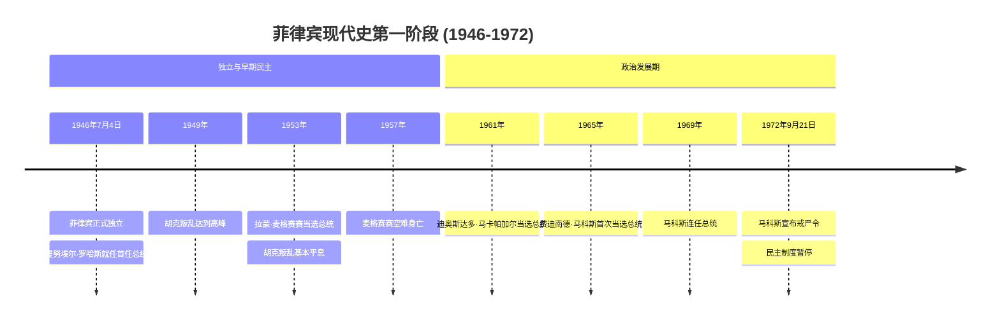
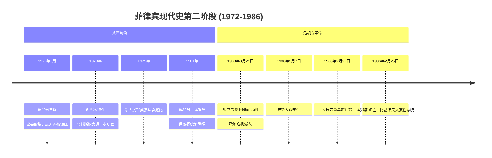
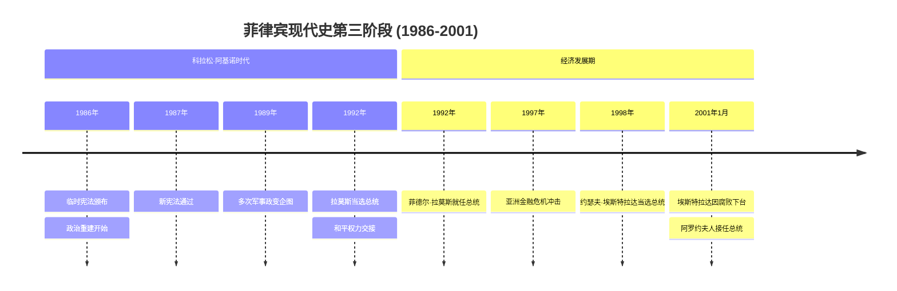
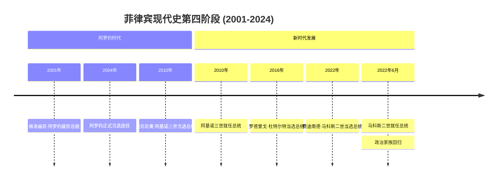
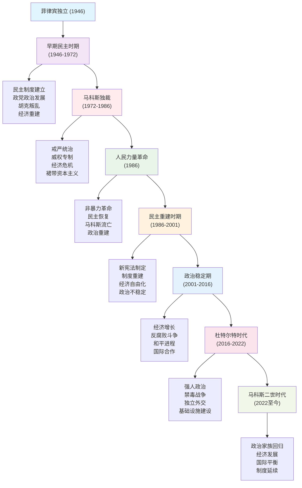

# 菲律宾现代史：从独立到新时代的发展历程

菲律宾，这个位于西太平洋的千岛之国，拥有着7641个岛屿和丰富多彩的历史文化。从1946年独立到2024年，菲律宾经历了民主建国、独裁专制、人民革命、政治转型和现代化发展的曲折历程。作为东南亚重要的民主国家和美国的传统盟友，菲律宾在冷战、后冷战时代以及当前大国博弈中都扮演着独特角色。其发展轨迹既体现了后殖民国家建设的共同挑战，也展现了岛国政治经济发展的特殊性。

## 菲律宾现代史发展脉络图解

为了更好地理解菲律宾复杂的现代史发展过程，以下图表展示了从1946年到2024年的关键历史节点和发展阶段：

### 关键事件时间线

#### 第一阶段：独立建国与民主巩固（1946-1972）

#### 第二阶段：马科斯独裁与人民力量革命（1972-1986）

#### 第三阶段：民主恢复与制度重建（1986-2001）

#### 第四阶段：政治稳定与现代发展（2001-2024）

### 历史发展阶段图

这些图表清晰地展示了菲律宾现代史的发展脉络：

- **四阶段时间线图**：按历史时期分组，突出了每个阶段的关键事件和转折点
- **历史发展阶段图**：展示了八个主要历史发展阶段及其特征和相互关系
- 通过分阶段的可视化方式，读者可以更清晰地理解菲律宾政治发展的复杂性和独特性

**阶段划分说明**：
- **第一阶段（1946-1972）**：从独立建国到民主发展，是制度建设和政治成熟时期
- **第二阶段（1972-1986）**：从戒严统治到人民革命，是威权专制和民主抗争时期
- **第三阶段（1986-2001）**：从民主恢复到制度重建，是政治转型和经济自由化时期
- **第四阶段（2001-2024）**：从政治稳定到现代发展，是经济增长和国际合作时期

接下来让我们深入了解每个历史时期的详细情况：

## 独立建国与早期民主发展（1946-1972年）

### 从美国殖民到独立建国

#### 独立的历史背景

菲律宾的独立进程与其他亚洲国家有所不同。作为美国的殖民地，菲律宾在二战前就已经获得了美国承诺的独立时间表。1935年《菲律宾独立法》确定了1946年为独立日期，尽管二战的爆发推迟了这一进程。

**战后重建与独立准备**：
- **1945年**：日本投降后，美国恢复对菲律宾的统治
- **1946年4月**：举行独立前的最后一次大选
- **1946年7月4日**：菲律宾正式宣布独立，曼努埃尔·罗哈斯就任首任总统
- **1946年7月**：与美国签署《贸易协定》和《军事基地协定》

独立初期的菲律宾面临着战争创伤的修复、政治制度的建立和经济重建的三重挑战。美国在独立过程中发挥了重要作用，不仅提供了政治框架，还给予了大量经济和军事援助。

#### 政治制度的建立

独立后的菲律宾采用了美式的总统制民主制度：
- **总统制**：总统既是国家元首又是政府首脑
- **两院制议会**：参议院和众议院
- **联邦制倾向**：虽然名义上是单一制，但地方自治权较大
- **三权分立**：行政、立法、司法相互制衡

这种制度设计反映了美国殖民期间的政治传统，也适应了菲律宾多岛屿、多民族的地理和社会特点。然而，这种制度在实践中也面临着种种挑战。

### 胡克叛乱与内部安全危机

#### 胡克运动的兴起

胡克叛乱（Huk Rebellion）是独立后菲律宾面临的最严重内部安全挑战。"胡克"是"抗日人民军"（Hukbalahap）的简称，这支力量在二战期间曾与美菲联军合作抗击日军。

**叛乱的根源**：
- **土地问题**：大地主制度导致农民贫困
- **政治排斥**：战后政府拒绝承认胡克的合法地位
- **社会不公**：独立后经济恢复缓慢，社会矛盾尖锐
- **意识形态因素**：受到共产主义思想影响

**叛乱的发展**：
- **1946-1949年**：从政治抗议转向武装斗争
- **1949-1951年**：叛乱达到高峰，控制了吕宋岛中部大片地区
- **活动范围**：主要在中央吕宋的农业区
- **支持基础**：贫困农民和佃农

#### 政府的反叛乱策略

面对胡克叛乱，菲律宾政府采取了军事打击和政治改革相结合的策略：

**军事行动**：
- 美国提供军事援助和训练
- 改革军队指挥结构，提高作战效率
- 实施战略村计划，切断叛军与民众联系

**政治改革**：
- 推进土地改革，改善农民生活条件
- 加强地方政府建设，扩大政治参与
- 实施农村发展项目，提供就业机会

### 麦格赛赛的改革与胡克叛乱的平息

#### 麦格赛赛的崛起

拉蒙·麦格赛赛在反胡克斗争中崭露头角。作为国防部长，他改革了军队，提高了部队的战斗力和纪律性。更重要的是，他倡导"以民为本"的反叛乱策略，强调通过改善民生来消除叛乱的社会根源。

**军事改革**：
- 整顿军队纪律，减少军民冲突
- 改善情报收集，提高作战针对性
- 加强与美军的合作，获得先进装备

**政治策略**：
- 实施大赦政策，鼓励叛军投降
- 推进土地分配，减少农村贫困
- 加强基层政权建设，扩大政府影响

#### 1953年总统大选

麦格赛赛在1953年总统大选中获胜，这被视为菲律宾民主政治成熟的重要标志：

**选举特点**：
- 竞争激烈但过程和平
- 选民投票率高，参与度广泛
- 媒体自由报道，监督公开透明
- 结果得到各方认可

**麦格赛赛的胜利意义**：
- 代表了改革派的胜利
- 体现了民众对变革的渴望
- 证明了民主制度的有效性
- 为胡克叛乱的最终解决创造了条件

#### 胡克叛乱的最终平息

在麦格赛赛的领导下，胡克叛乱在1950年代中期基本平息：

**成功因素**：
- **军事压力**：有效的军事行动削弱了叛军实力
- **政治改革**：土地改革和农村发展项目减少了不满
- **国际支持**：美国提供了关键的军事和经济援助
- **领导能力**：麦格赛赛的个人魅力和政治技巧

**长远影响**：
- 巩固了菲律宾的民主制度
- 证明了政治改革解决社会矛盾的有效性
- 为后来的发展奠定了稳定基础
- 成为冷战时期反共斗争的成功范例

### 1950-1960年代的经济发展

#### 进口替代工业化策略

独立后的菲律宾采取了进口替代工业化策略，试图通过发展本国工业来减少对进口的依赖：

**政策特点**：
- **高关税保护**：对进口工业品征收高额关税
- **外汇管制**：限制外汇使用，优先保障关键进口
- **国内投资鼓励**：为本土工业提供税收优惠
- **技术引进**：鼓励外国投资带来先进技术

**主要成就**：
- 纺织、食品加工等轻工业快速发展
- 城市化进程加速，马尼拉成为重要工业中心
- 中产阶级规模扩大，消费市场发展
- 就业机会增加，生活水平提高

#### 农业现代化与土地改革

农业仍然是菲律宾经济的重要支柱，政府推行了一系列农业现代化措施：

**绿色革命**：
- 引进高产水稻品种
- 推广现代农业技术
- 建设农田水利设施
- 提供农业信贷支持

**土地改革**：
- 《农业土地改革法》的颁布
- 地主土地的有偿征收
- 向佃农分配土地
- 建立农业合作社

**效果与限制**：
- 农业产量显著提高
- 农民收入有所增加
- 但土地分配不均问题依然严重
- 大地主的政治影响力仍然强大

### 政治发展与民主制度的完善

#### 政党政治的发展

1950-1960年代，菲律宾的政党政治逐步成熟：

**主要政党**：
- **自由党**：代表改革派和中产阶级利益
- **国民党**：代表传统精英和保守派
- **其他小党**：代表特定地区或利益集团

**政党政治特点**：
- 竞争激烈但相对温和
- 政策分歧不大，主要是人事之争
- 地方势力和家族政治影响显著
- 选举相对自由公正

#### 新闻自由与公民社会

这一时期菲律宾享有相对充分的新闻自由和公民社会发展：

**媒体发展**：
- 报纸、广播、电视媒体蓬勃发展
- 新闻报道相对自由，监督政府
- 媒体成为公共讨论的重要平台
- 培养了民主文化和公民意识

**公民社会**：
- 各种非政府组织兴起
- 工会、农会等利益集团活跃
- 宗教组织（特别是天主教会）发挥重要作用
- 知识分子和学生运动参与政治讨论

### 1960年代的政治危机萌芽

#### 社会矛盾的积累

尽管取得了显著成就，但1960年代菲律宾也积累了一些严重的社会矛盾：

**经济问题**：
- 进口替代策略的局限性开始显现
- 收入分配不均加剧
- 通胀压力增大
- 外债负担加重

**政治问题**：
- 腐败问题日益严重
- 家族政治和地方势力过度膨胀
- 政府效率低下
- 社会公正诉求增强

**社会问题**：
- 城乡差距扩大
- 教育资源分配不均
- 青年就业问题突出
- 传统价值观受到冲击

#### 激进运动的兴起

1960年代末，菲律宾出现了一些激进的政治运动：

**学生运动**：
- 大学校园成为政治活动中心
- 学生对社会不公提出批评
- 要求更彻底的政治和经济改革
- 受到国际学生运动的影响

**左翼组织**：
- 菲律宾共产党重新组建
- 新人民军开始武装活动
- 毛主义思想的传播
- 农村革命根据地的建立

这些发展为后来马科斯的威权统治提供了借口，也预示着菲律宾政治将面临新的挑战。

## 马科斯独裁与戒严统治（1972-1986年）

### 马科斯的政治崛起

#### 早期政治生涯

费迪南德·马科斯的政治生涯始于1950年代。作为一名律师出身的政治家，他展现了出色的政治才能和野心：

**政治起步**：
- **1949年**：当选伊洛戈斯省众议员，开始政治生涯
- **1959年**：当选参议员，进入国家政治舞台
- **1963年**：担任参议院议长，政治影响力扩大
- **1965年**：转投自由党，获得总统候选人提名

**1965年总统大选胜利**：
马科斯在1965年总统大选中击败了现任总统迪奥斯达多·马卡帕加尔，这次胜利的关键因素包括：
- 出色的演讲能力和个人魅力
- 对基础设施建设的承诺
- 妻子伊梅尔达的政治价值
- 有效的竞选组织和资金支持

#### 首个任期的成就

马科斯的第一个总统任期（1965-1969）取得了一些显著成就：

**经济发展**：
- GDP增长率保持在较高水平
- 大规模基础设施建设项目
- 工业化进程加速
- 出口多元化取得进展

**政治形象**：
- 被视为改革派和现代化推动者
- 在国际舞台上提升菲律宾影响力
- 加强与美国的同盟关系
- 在越南战争中支持美国

### 1969年连任与政治野心

#### 历史性的连任

1969年，马科斯成为菲律宾历史上第一位成功连任的总统。这次连任具有重要意义：

**连任的成功因素**：
- 第一任期的政绩支持
- 有效的政治机器
- 对手的分裂和弱势
- 大量选举资金投入

**连任的争议**：
- 选举过程中的暴力事件
- 对选举公正性的质疑
- 政府资源的过度使用
- 债务融资的选举支出

#### 宪法限制与政治困境

根据1935年宪法，总统只能连任一次，这意味着马科斯在1973年必须下台。面对这一宪法限制，马科斯开始谋划突破：

**政治环境的恶化**：
- **学生运动**：1970年代初学生抗议活动频繁
- **经济困难**：通胀上升，社会不满增加
- **左翼威胁**：新人民军活动加剧
- **政治对立**：反对派批评声音增强

**寻求解决方案**：
- 考虑修改宪法延长任期
- 探索宣布紧急状态的可能性
- 准备应对各种政治挑战
- 巩固军方和警方的支持

### 1972年戒严令的实施

#### 戒严令的宣布

1972年9月21日，马科斯签署了第1081号总统令，宣布在全国实施戒严令。这一决定改变了菲律宾的政治格局：

**官方理由**：
- 面临共产主义叛乱威胁
- 穆斯林分离主义活动加剧
- 社会秩序急剧恶化
- 民主制度无法有效应对危机

**实际动机**：
- 规避宪法对总统任期的限制
- 消除政治反对派
- 巩固个人权力
- 推行经济发展计划

#### 戒严令的具体措施

戒严令实施后，菲律宾的政治制度发生了根本性变化：

**政治控制**：
- **议会解散**：国会被解散，立法权集中于总统
- **政党禁止**：所有政党活动被禁止
- **媒体控制**：新闻媒体被严格审查或关闭
- **反对派镇压**：政治反对派领袖被逮捕

**法律变革**：
- **新宪法**：1973年通过新宪法，确立总统制
- **军事法庭**：民事案件转由军事法庭审理
- **紧急权力**：总统获得广泛的紧急权力
- **人身保护令暂停**：公民基本权利被限制

### 威权统治体系的建立

#### 权力集中机制

马科斯建立了一套高度集中的威权统治体系：

**个人独裁**：
- 总统集行政、立法、司法权于一身
- 重要决策完全由马科斯个人决定
- 建立了庞大的总统府机构
- 妻子伊梅尔达也获得重要权力

**军警控制**：
- 军队成为政权的主要支柱
- 警察力量大幅扩张
- 建立了广泛的情报网络
- 军官成为政府重要职位的候选人

**地方控制**：
- 任命忠诚的地方官员
- 建立地方民兵组织
- 控制地方政治和经济资源
- 压制地方自治和反对声音

#### 裙带资本主义的发展

戒严期间，马科斯建立了以家族和亲信为核心的经济体系：

**垄断企业**：
- 在关键行业建立垄断企业
- 马科斯亲信控制主要经济部门
- 通过政府许可和特权获得经济利益
- 国外投资项目的利益分配

**腐败体系**：
- 政府合同和项目的利益输送
- 通过银行和金融机构转移资金
- 建立复杂的海外资产网络
- 利用国家资源满足个人需求

### 经济政策与发展策略

#### "新社会"计划

马科斯提出了"新社会"（Bagong Lipunan）发展战略：

**经济目标**：
- 实现工业化和现代化
- 发展出口导向型经济
- 改善基础设施和公共服务
- 提高国民收入和生活水平

**政策措施**：
- **土地改革**：在部分地区实施土地分配
- **绿色革命**：推广高产农业技术
- **工业发展**：建立出口加工区和工业园
- **基础设施**：大规模交通和能源项目

#### 经济成就与问题

戒严初期，菲律宾经济确实取得了一些成就：

**积极方面**：
- GDP增长率在1970年代中期较高
- 基础设施建设取得显著进展
- 制造业和出口部门发展
- 旅游业和服务业兴起

**潜在问题**：
- 大量外债积累
- 收入分配更加不均
- 经济过度依赖外资
- 环境污染问题严重

### 社会控制与文化政策

#### 媒体控制

马科斯政权对媒体实施了严格控制：

**控制措施**：
- 关闭独立报纸和电台
- 建立政府控制的媒体机构
- 对新闻内容进行严格审查
- 逮捕和迫害批评记者

**宣传策略**：
- 美化马科斯夫妇的形象
- 宣传"新社会"的成就
- 强调稳定和发展的重要性
- 淡化或掩盖腐败和人权问题

#### 教育和文化政策

**教育改革**：
- 调整教育课程内容
- 强化爱国主义教育
- 限制政治敏感话题讨论
- 控制大学和学术机构

**文化控制**：
- 推广官方文化价值观
- 限制批评性艺术创作
- 控制文化活动和节庆
- 利用传统文化为政权服务

### 反对派的抵抗与镇压

#### 武装反抗

戒严期间，多支武装力量对马科斯政权进行抵抗：

**新人民军（NPA）**：
- 菲律宾共产党的武装力量
- 在农村地区开展游击战争
- 获得部分农民和知识分子支持
- 成为政权面临的主要安全威胁

**摩洛民族解放阵线（MNLF）**：
- 南部穆斯林地区的分离主义组织
- 要求建立独立的穆斯林国家
- 得到部分伊斯兰国家支持
- 与政府军发生长期冲突

#### 和平抗议与地下活动

**政治反对派**：
- 被监禁的政治领袖及其支持者
- 地下政治组织和网络
- 海外流亡政治人士
- 人权组织和活动家

**宗教抵抗**：
- 天主教会的批评立场
- 基层神职人员的人权倡导
- 宗教组织的社会服务
- 教会网络的信息传播

### 国际关系与外交政策

#### 与美国的关系

戒严期间，菲美关系经历了复杂变化：

**初期支持**：
- 美国政府最初支持马科斯的戒严统治
- 冷战背景下的反共考量
- 军事基地协议的维持
- 经济和军事援助的继续

**后期摩擦**：
- 人权问题引起美国国会关注
- 民主价值观与现实利益的冲突
- 马科斯寻求多元化外交
- 双边关系出现紧张

#### 地区外交

**东盟参与**：
- 1967年成为东盟创始成员
- 在地区事务中发挥积极作用
- 利用东盟平台提升国际形象
- 与邻国保持相对稳定关系

**对外经济关系**：
- 扩大与日本和欧洲的经济合作
- 寻求多元化的投资来源
- 参与国际经济组织
- 推动南南合作

## 经济危机与政治动荡（1980-1986年）

### 1980年代经济危机

#### 债务危机的爆发

1980年代初，菲律宾面临严重的债务危机：

**危机的成因**：
- **过度借贷**：1970年代大量举借外债支持发展项目
- **石油冲击**：两次石油危机增加了进口成本
- **利率上升**：国际利率上升增加了偿债负担
- **出口困难**：世界经济衰退影响了出口收入

**危机的规模**：
- 外债总额超过250亿美元
- 债务服务比率超过政府收入的30%
- 外汇储备急剧下降
- 经济增长率转为负值

#### 国际货币基金组织的介入

面对债务危机，菲律宾不得不寻求国际货币基金组织（IMF）的帮助：

**援助条件**：
- 实施紧缩的财政政策
- 削减政府支出和补贴
- 货币贬值以促进出口
- 推进经济自由化改革

**社会影响**：
- 失业率大幅上升
- 通胀率居高不下
- 生活水平普遍下降
- 社会不满情绪加剧

### 贝尼尼奥·阿基诺遇刺事件

#### 阿基诺的政治生涯

贝尼尼奥·"尼诺"·阿基诺是马科斯最主要的政治对手：

**早期从政**：
- 出身政治世家，父亲是参议员
- 1960年代当选参议员
- 成为自由党的重要领袖
- 被视为马科斯的主要挑战者

**戒严期间**：
- 1972年戒严令实施时被逮捕
- 被控以颠覆罪和谋杀罪
- 在狱中度过了7年多时间
- 成为反对派的象征人物

#### 流亡与回国

**美国流亡**：
- 1980年赴美国进行心脏手术
- 在哈佛大学担任研究员
- 继续进行政治活动
- 成为海外反马科斯运动的领袖

**决定回国**：
- 1983年决定回国参与政治
- 明知面临生命危险
- 希望推动和平政治变革
- 获得广泛的国际关注

#### 1983年8月21日遇刺

**遇刺经过**：
- 阿基诺乘坐中华航空班机回国
- 飞机在马尼拉国际机场降落
- 阿基诺被军方带离飞机
- 在机场跑道上被枪杀

**官方说法与质疑**：
- 政府声称是共产党刺客所为
- 指控罗兰多·加尔曼为凶手
- 但公众普遍不相信官方说法
- 广泛认为是政府策划的暗杀

### 政治危机的全面爆发

#### 民众抗议与反政府运动

阿基诺遇刺引发了前所未有的政治危机：

**葬礼示威**：
- 阿基诺的葬礼吸引了数百万民众参与
- 成为反马科斯政权的大规模示威
- 黄色成为反对派的象征颜色
- 天主教会公开表达不满

**持续抗议**：
- 定期举行反政府示威
- 各阶层民众参与政治活动
- 商界开始疏远马科斯政权
- 国际社会加强对人权的关注

#### 经济信心的崩溃

政治危机进一步恶化了经济状况：

**投资撤离**：
- 外国投资者信心丧失
- 资本大量流出
- 比索汇率持续下跌
- 银行挤兑现象出现

**经济指标恶化**：
- GDP连续负增长
- 失业率创历史新高
- 通胀率超过50%
- 政府财政收入锐减

### 马科斯政权的应对策略

#### 政治让步与改革姿态

面对危机，马科斯试图通过有限的政治让步来维持统治：

**调查委员会**：
- 成立阿加瓦委员会调查阿基诺遇刺案
- 委员会最终认定军方高层涉案
- 但对真相的揭露有限
- 无法恢复政府的信誉

**政治开放**：
- 1981年正式解除戒严令
- 但保留了大部分威权措施
- 允许有限的政治活动
- 承诺进行选举改革

#### 军方内部的分化

政治危机也导致了军方内部的分化：

**改革派军官**：
- 以拉莫斯、恩里莱为代表的改革派
- 对马科斯的统治方式提出质疑
- 主张政治改革和军队专业化
- 与反对派建立了秘密联系

**忠诚派势力**：
- 继续支持马科斯的军官集团
- 主要由马科斯的亲信构成
- 控制了关键的军事单位
- 负责政权的安全保卫

### 反对派的重新组织

#### 统一反对派的形成

阿基诺遇刺后，分散的反对派力量开始联合：

**政治联盟**：
- 各反对党派摒弃分歧
- 形成统一的政治纲领
- 协调反政府活动
- 推举共同的领导人

**社会动员**：
- 工会、学生组织积极参与
- 宗教团体提供支持
- 商界精英转向反对派
- 海外菲律宾人社区响应

#### 科拉松·阿基诺的崛起

贝尼尼奥·阿基诺的遗孀科拉松·阿基诺成为反对派的新领袖：

**政治合法性**：
- 作为殉道者的遗孀具有道德权威
- 象征着和平反对与民主理想
- 获得广泛的民众同情和支持
- 国际社会也表示认可

**政治理念**：
- 坚持非暴力抗争
- 倡导民主改革
- 强调国家和解
- 反对独裁和腐败

## 1986年人民力量革命

### 1986年提前大选

#### 马科斯的政治豪赌

面对日益严重的政治和经济危机，马科斯决定举行提前的总统大选：

**决定的背景**：
- 美国国会对马科斯政权的压力
- 国内反对派力量的不断壮大
- 经济危机造成的社会不满
- 军方内部出现分化迹象

**政治考量**：
- 通过选举恢复政权合法性
- 分化和削弱反对派力量
- 向国际社会展示民主形象
- 为继续统治赢得时间

#### 选举过程中的操控

1986年2月7日举行的总统大选存在严重的舞弊行为：

**选举舞弊**：
- **选民名册操控**：虚报选民人数，排除反对派支持者
- **投票站控制**：在支持马科斯的地区设置更多投票站
- **计票作弊**：篡改选票统计结果
- **恐吓威胁**：对反对派支持者进行威胁

**国际监督**：
- 美国派遣选举观察团
- 国际媒体广泛关注
- 天主教会积极参与监督
- 民间组织自发监督计票过程

### 选举争议与政治僵局

#### 选举结果的争议

选举结果公布后，双方都宣称获胜：

**官方结果**：
- 选举委员会宣布马科斯获胜
- 得票率约为53%
- 但过程充满争议
- 国际观察员质疑结果真实性

**反对派质疑**：
- 科拉松·阿基诺宣布真正获胜
- 提供了大量舞弊证据
- 要求重新计票或承认败选
- 发起"民众胜利"运动

#### 计票员的抗议

选举过程中发生了重要的象征性事件：

**COMELEC计票员起义**：
- 30多名计票员公开抗议舞弊
- 在电视直播中离开计票现场
- 寻求教会庇护
- 成为舞弊的有力证据

**国际反应**：
- 美国国会谴责选举舞弊
- 国际媒体广泛报道
- 欧洲国家表示关切
- 要求进行公正调查

### 军方起义与政治危机

#### 2月22日军方起义

1986年2月22日，政治危机达到顶点：

**起义的发起**：
- 国防部长胡安·恩里莱宣布起义
- 副参谋长拉莫斯表示支持
- 占领国防部和军营
- 要求马科斯下台

**起义的背景**：
- 军方改革派对马科斯失去信心
- 选举舞弊引发军官不满
- 担心被马科斯清洗
- 受到反对派秘密联络影响

#### 枢机主教辛海梅的呼吁

马尼拉枢机主教海梅·辛发挥了关键作用：

**广播呼吁**：
- 通过天主教广播电台呼吁民众支持起义军官
- 要求民众前往EDSA大道保护起义者
- 强调这是争取自由和民主的关键时刻
- 呼吁进行和平抗争

**宗教权威**：
- 天主教会在菲律宾的巨大影响力
- 辛枢机主教的道德权威
- 教会网络的快速动员能力
- 非暴力抗争的宗教理念

### EDSA革命的展开

#### 民众的响应

辛枢机主教的呼吁得到了民众的热烈响应：

**大规模集会**：
- 数十万民众涌向EDSA大道
- 用人墙保护起义的军官
- 各行各业民众参与
- 和平示威的壮观场面

**非暴力抗争**：
- 民众向政府军士兵献花
- 修女跪在坦克前祈祷
- 分享食物和饮水
- 唱歌祈祷表达和平诉求

#### 政府军的分化

面对民众示威，政府军内部出现严重分化：

**倒戈现象**：
- 越来越多军官宣布支持人民
- 基层士兵拒绝向民众开火
- 军事单位成建制转向
- 马科斯的军事基础动摇

**关键转折**：
- 空军司令宣布中立
- 海军高层表示支持革命
- 总统卫队出现分化
- 马科斯失去军事控制

### 马科斯政权的垮台

#### 2月25日的最终时刻

1986年2月25日，马科斯政权走向终结：

**双重就职典礼**：
- 上午：马科斯举行就职典礼，但出席者寥寥
- 下午：科拉松·阿基诺举行就职典礼，民众热烈支持
- 形成了两个政府并存的局面
- 国际社会明确支持阿基诺

**美国的最后通牒**：
- 美国政府要求马科斯和平移交权力
- 威胁停止一切援助
- 承诺为马科斯提供安全离境
- 明确承认阿基诺政府

#### 马科斯的流亡

**离开马拉卡南宫**：
- 马科斯一家在美军护送下离开总统府
- 乘坐美军直升机前往克拉克空军基地
- 随后乘专机飞往夏威夷
- 结束了20年的威权统治

**革命的胜利**：
- 科拉松·阿基诺正式就任总统
- 人民力量革命和平成功
- 民主制度得以恢复
- 成为世界民主化浪潮的重要里程碑

### 人民力量革命的历史意义

#### 国内影响

**政治制度重建**：
- 恢复了民主制度和法治
- 重建了三权分立体系
- 保障了公民基本权利
- 建立了新的政治秩序

**社会变革**：
- 激发了公民的政治参与意识
- 增强了民间社会的力量
- 促进了新闻自由和言论自由
- 推动了社会正义事业

#### 国际影响

**民主化示范**：
- 成为非暴力民主革命的典范
- 影响了其他威权国家的民主化进程
- 证明了人民力量的巨大潜能
- 为后来的颜色革命提供了经验

**冷战背景**：
- 在冷战末期展现了民主的活力
- 影响了美国对威权盟友的政策
- 推动了国际社会对人权的关注
- 成为冷战后民主化浪潮的先声

## 科拉松·阿基诺政府与民主重建（1986-1992年）

### 临时政府与制度重建

#### 革命政府的建立

科拉松·阿基诺就任总统后，首要任务是重建民主制度：

**临时宪法**：
- 颁布《临时自由宪法》
- 确立基本民主原则
- 保障公民基本权利
- 为制定新宪法奠定基础

**政府重组**：
- 解散马科斯时期的贝恬尼扬（国民议会）
- 任命新的内阁成员
- 清理政府机构中的马科斯亲信
- 建立革命政府委员会

#### 政治犯释放与和解

**大赦政策**：
- 释放所有政治犯
- 允许流亡人员回国
- 停止对政治反对派的迫害
- 推动国家和解进程

**人权恢复**：
- 恢复人身保护令
- 保障新闻自由和言论自由
- 解除对政治活动的限制
- 建立人权委员会

### 新宪法的制定

#### 制宪委员会的工作

1986年7月，阿基诺任命了48人组成的制宪委员会：

**委员会构成**：
- 来自各行各业的代表
- 包括法律专家、学者、商界人士
- 体现了广泛的社会代表性
- 确保制宪过程的民主性

**制宪原则**：
- 恢复民主制度
- 防止威权专制复辟
- 保障人权和公民自由
- 建立有效的制衡机制

#### 1987年宪法的特点

1987年2月11日，新宪法通过全民公投获得批准：

**政治制度设计**：
- **总统制**：总统为国家元首和政府首脑
- **任期限制**：总统只能任职一届，任期6年
- **两院制议会**：参议院和众议院组成国会
- **司法独立**：确立司法部门的独立地位

**权力制衡机制**：
- 总统权力受到显著限制
- 国会拥有强大的监督权
- 司法审查制度的建立
- 地方自治权的保障

**人权保障**：
- 详细规定公民基本权利
- 设立人权委员会
- 保障新闻自由和学术自由
- 禁止酷刑和非法拘禁

### 经济重建与改革

#### 债务危机的处理

阿基诺政府面临严重的经济挑战：

**债务负担**：
- 外债总额超过280亿美元
- 债务服务负担沉重
- 外汇储备严重不足
- 经济增长乏力

**处理策略**：
- 与国际债权人重新谈判
- 寻求债务重组和延期
- 争取国际金融机构支持
- 实施结构调整计划

#### 经济自由化改革

**贸易自由化**：
- 降低进口关税
- 消除贸易壁垒
- 鼓励出口导向型工业
- 吸引外国直接投资

**金融改革**：
- 放松对银行业的管制
- 允许外资银行进入
- 发展资本市场
- 改革汇率制度

**私有化进程**：
- 出售国有企业股份
- 引入私人资本参与
- 提高经济效率
- 减少政府财政负担

### 政治挑战与军事政变企图

#### 军方内部的不满

尽管军方在人民力量革命中发挥了重要作用，但阿基诺政府仍面临军方挑战：

**不满的根源**：
- 对文官政府的不信任
- 军队内部的派系斗争
- 对共产主义叛乱的担忧
- 经济困难影响军队待遇

**政变企图**：
- 1987年8月：胡安·恩里莱参与的政变企图
- 1989年12月：格兰戈中校领导的最严重政变
- 多次小规模兵变和起义
- 造成政治不稳定

#### 新人民军的挑战

**武装叛乱**：
- 菲律宾共产党及其武装力量新人民军继续活动
- 在农村地区建立根据地
- 进行游击战争
- 威胁政府统治

**政府对策**：
- 军事打击与政治解决并重
- 推进土地改革削弱叛军基础
- 开展和平谈判
- 寻求国际支持

### 土地改革计划

#### 综合农业改革计划（CARP）

1988年，阿基诺政府启动了综合农业改革计划：

**改革目标**：
- 重新分配农村土地
- 改善农民生活条件
- 提高农业生产效率
- 促进农村社会稳定

**主要内容**：
- 征收大地主的土地
- 向无地农民分配土地
- 提供技术和信贷支持
- 建立农民合作社

**实施困难**：
- 地主阶级的强烈反对
- 资金不足影响进度
- 执行机制不完善
- 法律程序复杂冗长

### 对外关系的重新定位

#### 与美国关系的调整

**军事基地问题**：
- 重新谈判美军基地协议
- 民族主义情绪的上升
- 1991年参议院拒绝延长基地协议
- 美军最终撤离苏比克湾和克拉克基地

**经济合作**：
- 美国提供经济援助
- 支持菲律宾的结构调整
- 扩大贸易和投资关系
- 技术转移合作

#### 地区外交

**东盟合作**：
- 积极参与东盟事务
- 推动地区经济一体化
- 在柬埔寨问题上发挥作用
- 加强与邻国关系

### 1992年总统大选与权力交接

#### 平和的权力交接

1992年总统大选标志着菲律宾民主制度的成熟：

**选举过程**：
- 多位候选人参与竞争
- 选举过程相对公正透明
- 国际观察员监督
- 结果得到各方认可

**拉莫斯的胜利**：
- 菲德尔·拉莫斯当选总统
- 得票率仅为23.6%，但符合法律要求
- 实现了民主制度下的和平权力交接
- 证明了民主制度的稳定性

**阿基诺的历史地位**：
- 成功恢复了民主制度
- 建立了新的政治秩序
- 推进了经济自由化
- 为后续发展奠定了基础

## 经济发展与政治稳定（1992-2001年）

### 拉莫斯政府的改革与发展（1992-1998年）

#### 政治稳定的巩固

菲德尔·拉莫斯作为马科斯时期的军官，在人民力量革命中站在了正确一边，这使他具有独特的政治地位：

**军方关系**：
- 利用在军队中的威望平息政变威胁
- 改革军队指挥结构
- 提高军官待遇和专业化水平
- 确保军队服从文官政府

**政治联盟**：
- 建立广泛的政治联盟
- 与不同党派进行合作
- 推动政治和解
- 维护国家统一

#### "菲律宾2000"发展计划

拉莫斯提出了雄心勃勃的"菲律宾2000"计划：

**发展目标**：
- 到2000年使菲律宾成为新兴工业化国家
- 实现可持续的经济增长
- 消除贫困和改善民生
- 在国际舞台上发挥更大作用

**重点领域**：
- **基础设施建设**：电力、交通、通信
- **工业发展**：制造业和高技术产业
- **服务业**：金融、旅游、商务服务
- **农业现代化**：提高农业生产率

#### 经济自由化的深化

**放松管制**：
- 电信业自由化改革
- 银行业开放外资参与
- 航空业引入竞争
- 能源部门私有化

**外贸促进**：
- 进一步降低关税
- 简化出口程序
- 建立出口加工区
- 促进外国直接投资

**金融市场发展**：
- 股票市场扩容
- 债券市场发展
- 外汇管制放松
- 金融监管现代化

### 亚洲金融危机的冲击（1997-1998年）

#### 危机的传导机制

1997年爆发的亚洲金融危机对菲律宾产生了重大影响：

**危机的起源**：
- 泰铢贬值引发连锁反应
- 投机资本大量撤离
- 地区经济信心崩溃
- 传染效应蔓延整个亚洲

**对菲律宾的影响**：
- **货币贬值**：比索对美元大幅贬值
- **股市下跌**：股票价格暴跌
- **银行危机**：部分银行出现流动性困难
- **投资减少**：外国投资大幅下降

#### 政府的应对措施

**货币政策**：
- 央行提高利率以稳定汇率
- 动用外汇储备干预市场
- 寻求国际金融机构支持
- 加强对资本流动的监管

**财政政策**：
- 削减政府支出
- 提高税收以增加收入
- 推迟部分基础设施项目
- 维护财政纪律

**结构改革**：
- 加快银行业改革
- 推进企业重组
- 改善投资环境
- 加强金融监管

### 埃斯特拉达政府的短暂统治（1998-2001年）

#### 民粹主义的兴起

约瑟夫·埃斯特拉达的当选反映了民众对精英政治的不满：

**选举胜利**：
- 以压倒性优势赢得1998年总统大选
- 获得穷人和下层民众的广泛支持
- 承诺关注贫困和社会公正
- 体现了民粹主义政治的兴起

**政治承诺**：
- 为穷人提供更多机会
- 打击腐败和特权
- 推进土地改革
- 改善社会服务

#### 治理危机的爆发

**腐败指控**：
- 2000年开始面临严重腐败指控
- 被指控从非法赌博中获利
- 卷入朋党资本主义
- 公信力急剧下降

**政治危机**：
- 国会启动弹劾程序
- 军方和商界失去信心
- 天主教会表示反对
- 民众示威要求下台

#### 第二次人民力量革命

2001年1月，菲律宾爆发了第二次人民力量革命：

**引爆点**：
- 参议员在弹劾审判中拒绝开启关键证据
- 民众对司法公正失去信心
- 大规模抗议活动爆发
- 要求埃斯特拉达辞职

**权力转移**：
- 军方和警方撤回对埃斯特拉达的支持
- 副总统格洛丽亚·阿罗约宣誓就任总统
- 埃斯特拉达被迫下台
- 最高法院确认权力转移的合法性

## 21世纪的政治稳定与发展（2001-2024年）

### 阿罗约政府的经济发展（2001-2010年）

#### 宏观经济政策

格洛丽亚·阿罗约作为经济学博士，注重经济发展和财政稳定：

**财政整顿**：
- 削减政府赤字
- 提高税收征收效率
- 控制政府支出
- 改善债务结构

**货币政策**：
- 维护汇率稳定
- 控制通胀率
- 建立充足的外汇储备
- 加强金融监管

**结构改革**：
- 推进税制改革
- 改善投资环境
- 加强基础设施建设
- 促进出口多元化

#### 服务业的崛起

阿罗约政府期间，菲律宾服务业特别是BPO（商务流程外包）产业快速发展：

**BPO产业发展**：
- 利用英语优势发展呼叫中心
- 吸引国际企业外包业务
- 创造大量就业机会
- 成为重要外汇来源

**旅游业发展**：
- 推广菲律宾旅游品牌
- 改善旅游基础设施
- 简化签证程序
- 发展生态旅游

**金融服务**：
- 银行业现代化
- 资本市场发展
- 保险业扩张
- 微金融创新

### 阿基诺三世政府的改革（2010-2016年）

#### "正道治理"理念

贝尼尼奥·阿基诺三世继承了母亲的政治遗产，推行"正道治理"（Daang Matuwid）：

**反腐败斗争**：
- 建立透明的政府采购制度
- 加强对政府官员的监督
- 推进司法改革
- 建立问责机制

**制度建设**：
- 加强民主制度
- 保护新闻自由
- 推进地方自治
- 改善公共服务

#### 经济持续增长

**宏观经济表现**：
- GDP年均增长率超过6%
- 通胀率保持稳定
- 外汇储备充足
- 主权信用评级提升

**包容性增长**：
- 推进条件性现金转移计划
- 改善教育和医疗服务
- 支持中小企业发展
- 促进农村发展

#### 南海问题的国际仲裁

**中菲南海争端**：
- 2013年菲律宾就南海争端提起国际仲裁
- 2016年海牙仲裁庭做出有利于菲律宾的裁决
- 中国拒绝承认仲裁结果
- 成为阿基诺政府的重要外交遗产

### 杜特尔特时代的变革（2016-2022年）

#### 强人政治的回归

罗德里戈·杜特尔特的当选标志着菲律宾政治风格的重大转变：

**政治特征**：
- 强调法律和秩序
- 采用争议性的政治语言
- 直接面对民众的沟通方式
- 对传统政治精英的批评

**治理风格**：
- 中央集权倾向加强
- 对反对派的压力增加
- 军警力量地位提升
- 民粹主义色彩浓厚

#### 禁毒战争

杜特尔特政府最具争议的政策是大规模禁毒战争：

**政策实施**：
- 在全国范围内开展禁毒行动
- 鼓励警方和民众举报毒贩
- 对毒品犯罪采取零容忍态度
- 实施"奥普兰·双巴雷尔"行动

**争议和批评**：
- 法外处决现象严重
- 人权组织强烈批评
- 国际社会表示关切
- 造成大量平民伤亡

**支持和效果**：
- 获得大部分民众支持
- 毒品相关犯罪确有下降
- 改善了部分地区治安
- 但根本问题未得到解决

#### 基础设施建设计划

**"建设，建设，建设"计划**：
- 投资数万亿比索改善基础设施
- 建设高速公路、机场、港口
- 改善城市交通系统
- 推进数字基础设施

**重大项目**：
- 马尼拉地铁建设
- 新克拉克城开发
- 高速公路网络扩建
- 机场和港口现代化

#### 独立外交政策

**对华关系改善**：
- 搁置南海争议，专注经济合作
- 接受中国的基础设施投资
- 参与"一带一路"倡议
- 平衡对华关系与传统盟友关系

**多元化外交**：
- 与俄罗斯发展关系
- 加强与东盟合作
- 保持与美国的联盟关系
- 寻求外交政策的独立性

### 马科斯二世的政治回归（2022年至今）

#### 政治家族的复出

费迪南德·马科斯二世的当选标志着马科斯家族的政治回归：

**选举胜利**：
- 在2022年总统大选中获得压倒性胜利
- 得票率超过58%
- 获得社交媒体一代的支持
- 体现了对马科斯时代的重新评价

**政治联盟**：
- 与杜特尔特家族结盟
- 萨拉·杜特尔特担任副总统
- 建立了强大的政治联盟
- 巩固了南北政治合作

#### 政策延续与调整

**经济政策**：
- 延续前政府的基础设施建设
- 推进数字化转型
- 发展可再生能源
- 促进外国投资

**外交政策**：
- 在中美之间保持平衡
- 维护与传统盟友的关系
- 在南海问题上采取务实态度
- 推进地区合作

## 大国影响与地缘政治博弈

### 美国对菲律宾的历史影响

#### 殖民统治的深远影响

美国对菲律宾的影响始于1898年美西战争后的殖民统治：

**制度移植**：
- **政治制度**：移植美式民主制度和法律体系
- **教育体系**：建立英语教育体系
- **行政管理**：美式政府管理模式
- **文化价值**：西方民主价值观的传播

**经济结构塑造**：
- 殖民地经济模式的建立
- 原材料出口导向
- 与美国市场的深度联系
- 美元本位的货币体系

#### 冷战时期的同盟关系

**军事合作**：
- **《共同防御条约》（1951年）**：建立军事同盟关系
- **军事基地协议**：苏比克湾和克拉克基地
- **军事援助**：提供武器装备和训练
- **联合军演**：定期举行双边军事演习

**经济援助**：
- 大规模经济援助计划
- 贸易优惠和市场准入
- 技术转移和投资
- 国际金融机构支持

**政治支持**：
- 在国际组织中的相互支持
- 对菲律宾政府的政治背书
- 在地区事务中的协调
- 民主价值观的推广

#### 后冷战时代的关系调整

**基地撤离与关系重定义**：
- 1991年美军基地协议到期
- 菲律宾参议院拒绝延长协议
- 美军撤离苏比克湾和克拉克基地
- 双边关系从基地依赖转向合作伙伴关系

**反恐合作**：
- 9/11后在反恐领域的合作
- 在南部棉兰老岛的反恐行动
- 军事顾问和训练支持
- 情报共享与协调

**重返亚太战略**：
- 奥巴马政府的"重返亚太"战略
- 加强在菲律宾的军事存在
- 《增强防务合作协议》（2014年）
- 应对中国崛起的战略需要

### 中国在菲律宾的影响扩大

#### 经济合作的快速发展

**贸易关系**：
- 中国成为菲律宾最大贸易伙伴
- 双边贸易额快速增长
- 贸易结构的多元化
- 农产品和制成品的双向贸易

**投资合作**：
- **基础设施投资**：参与大型基础设施项目
- **一带一路倡议**：菲律宾积极参与
- **能源合作**：在电力和可再生能源领域合作
- **制造业投资**：中国企业在菲设厂

**金融合作**：
- 人民币国际化在菲律宾的推进
- 中菲货币互换协议
- 中国金融机构在菲业务扩展
- 数字支付合作

#### 南海争端的管控

**争端的演变**：
- **历史争端**：对南海岛礁和水域的主权争议
- **2012年黄岩岛对峙**：双边关系紧张
- **仲裁案**：2013-2016年海牙仲裁案
- **关系缓和**：杜特尔特时期的务实处理

**管控机制**：
- 双边磋商机制的建立
- 搁置争议、共同开发的探索
- 海上事件的预防和管控
- 在多边框架内的协调

#### 软实力影响

**文化交流**：
- 孔子学院在菲律宾的建立
- 中文教育的推广
- 文化节庆和艺术交流
- 华人社区的桥梁作用

**教育合作**：
- 留学生交流项目
- 学术合作与研究
- 职业技术培训
- 奖学金计划

### 其他大国的作用

#### 日本的重要影响

**经济合作**：
- 长期的发展援助伙伴
- 在制造业的重要投资
- 技术转移和管理经验
- 基础设施建设支持

**发展模式影响**：
- 东亚发展模式的借鉴
- 制造业发展经验
- 质量管理和企业文化
- 环境保护技术

#### 欧盟的发展援助

**经济合作**：
- 重要的贸易伙伴
- 发展援助和技术支持
- 人权和民主价值观推广
- 环境保护合作

#### 地区大国的影响

**澳大利亚**：
- 在太平洋地区的合作
- 安全领域的协调
- 经济投资和贸易
- 教育文化交流

**韩国**：
- 文化软实力的影响
- 经济投资和技术合作
- 韩流文化的传播
- 发展经验的分享

### 地缘政治博弈中的菲律宾

#### 大国竞争的焦点

**战略地位**：
- 控制重要海上通道
- 连接太平洋和印度洋
- 第一岛链的关键环节
- 东南亚地区的战略要地

**平衡外交策略**：
- 在大国间保持平衡
- 最大化国家利益
- 避免选边站队
- 维护战略自主性

#### 挑战与机遇

**挑战**：
- 大国竞争的压力
- 南海争端的复杂性
- 经济依赖的风险
- 国内政治的影响

**机遇**：
- 地缘优势的发挥
- 多元化合作的可能
- 经济发展的推动
- 国际地位的提升

## 菲律宾共产党历史与影响

### 菲律宾共产党的历史发展

#### 早期建立与发展（1930-1950年）

**1930年成立**：
- 由安东尼奥·德·洛斯·桑托斯等人创建
- 受到国际共产主义运动影响
- 主要活动在工人和农民中间
- 提出土地改革和民族独立主张

**二战期间的活动**：
- 组建抗日人民军（胡克军）
- 与美菲联军合作抗击日军
- 在吕宋岛建立根据地
- 积累了武装斗争经验

#### 胡克叛乱时期（1946-1954年）

**战后政治斗争**：
- 1946年参与国会选举但被取消资格
- 转向武装斗争道路
- 在中央吕宋开展游击战
- 最高峰时控制大片农村地区

**叛乱的平息**：
- 麦格赛赛政府的反叛乱策略
- 军事打击与政治改革并重
- 胡克领导人路易斯·塔鲁克投降
- 1954年叛乱基本结束

#### 重建与分裂（1960-1970年代）

**1968年重建**：
- 何塞·马利亚·西森重建菲律宾共产党
- 采用毛泽东思想指导
- 1969年成立新人民军（NPA）
- 确立农村包围城市战略

**快速发展**：
- 在农村地区建立根据地
- 发展武装力量
- 建立影子政府
- 在大学校园发展组织

### 新人民军的武装斗争

#### 战略战术特点

**毛主义路线**：
- 农村包围城市战略
- 人民战争理论
- 建立农村根据地
- 进行游击战争

**组织结构**：
- 政治委员制度
- 军政一体化
- 群众组织网络
- 秘密党组织

#### 鼎盛时期（1980年代）

**实力达到顶峰**：
- 武装人员达到2.6万人
- 活动范围遍及73个省
- 影响人口数百万
- 建立了数百个游击前线

**政治影响**：
- 成为马科斯政权的重要威胁
- 在农村地区有一定民众基础
- 参与反马科斯斗争
- 影响了政治发展进程

#### 衰落与分化（1990年代至今）

**衰落的原因**：
- 冷战结束的影响
- 民主政府的合法性
- 内部分歧和清洗
- 政府和平攻势的效果

**当前状况**：
- 武装力量大幅减少
- 活动范围缩小
- 主要在偏远农村地区
- 与政府断续进行和谈

### 和平进程的探索

#### 历届政府的和平努力

**拉莫斯政府**：
- 制定《和平、进步与发展国家统一战略》
- 与共产党进行秘密谈判
- 建立和平谈判框架
- 取得有限进展

**阿罗约政府**：
- 重启和平谈判
- 在海外进行正式会谈
- 签署了一些协议
- 但缺乏实质性突破

**阿基诺三世政府**：
- 继续和平进程
- 讨论社会经济改革
- 在一些议题上达成共识
- 但停火协议反复破裂

**杜特尔特政府**：
- 初期表现积极
- 任命共产党人进入内阁
- 后因冲突升级而中断谈判
- 将共产党列为恐怖组织

#### 和平进程的困难

**核心分歧**：
- 对现行政治制度的根本看法不同
- 土地改革的深度和广度
- 美菲军事同盟的存在
- 政治犯释放问题

**相互不信任**：
- 历史恩怨难以化解
- 停火协议频繁破裂
- 暴力事件影响谈判
- 政治意愿不足

### 历史影响与评价

#### 对菲律宾社会的影响

**积极方面**：
- 推动了土地改革议程
- 提高了农民政治意识
- 促进了社会公正讨论
- 影响了左翼政治发展

**消极影响**：
- 造成大量人员伤亡
- 影响农村地区发展
- 增加了社会不稳定
- 消耗了国家资源

#### 在国际共产主义运动中的地位

**特殊性**：
- 长期坚持武装斗争
- 采用毛主义理论指导
- 在民主制度下的活动
- 与合法左翼政党的关系

**当代意义**：
- 反映了社会不公问题
- 说明了政治整合的重要性
- 展示了和平解决的必要性
- 为研究政治暴力提供案例

## 总结与展望

### 菲律宾现代史的特点

#### 民主制度的韧性

**制度的延续性**：
菲律宾虽然经历了马科斯的威权统治，但民主制度显示出强大的韧性。1986年人民力量革命的成功，以及此后民主制度的恢复和巩固，证明了民主价值观在菲律宾社会的深厚根基。

**公民社会的作用**：
天主教会、媒体、学生组织和各种民间团体在政治变革中发挥了重要作用，体现了公民社会对民主制度的支撑作用。

#### 政治家族政治的持续

**家族政治的特点**：
菲律宾政治长期以来被少数政治家族主导，从阿基诺家族到马科斯家族，家族政治成为菲律宾政治的重要特征。这既体现了政治精英的延续性，也反映了政治权力的集中化。

**民主与寡头的结合**：
菲律宾实现了程序民主，但实质民主仍受到精英政治的限制。选举是自由的，但候选人主要来自传统政治家族。

#### 外部影响的深刻性

**美国影响的持续**：
从殖民时期到今天，美国对菲律宾的影响是深刻而持久的。政治制度、法律体系、教育制度、文化价值都深受美国影响。

**大国博弈的舞台**：
菲律宾在中美战略竞争中处于重要地位，如何在大国间保持平衡成为重要挑战。

### 当前面临的主要挑战

#### 经济发展挑战

**结构性问题**：
- **收入不平等**：贫富差距依然很大，影响社会稳定
- **产业升级**：需要从劳动密集型向技术密集型转型
- **基础设施建设**：交通、能源、通信基础设施仍需改善
- **人力资源开发**：教育质量和技能培训有待提高

**外部环境挑战**：
- **全球化冲击**：需要应对全球经济变化
- **气候变化**：作为岛国面临严重环境威胁
- **地区竞争**：在东南亚地区面临激烈竞争
- **技术革命**：需要适应数字化转型

#### 政治发展挑战

**民主质量**：
- **腐败问题**：仍然是影响政府效能的重要因素
- **法治建设**：司法独立和法治水平有待提高
- **政治参与**：需要扩大政治参与的社会基础
- **制度创新**：需要适应新时代的制度改革

**社会整合**：
- **地区差异**：不同地区发展水平差异很大
- **宗教多元**：基督教与伊斯兰教的关系需要协调
- **民族融合**：多民族社会的和谐发展
- **代际冲突**：不同代际的价值观差异

#### 安全挑战

**内部安全**：
- **恐怖主义威胁**：南部地区的恐怖主义活动
- **分离主义运动**：穆斯林地区的自治诉求
- **共产主义叛乱**：新人民军的持续活动
- **毒品问题**：毒品贸易和相关犯罪

**外部安全**：
- **南海争端**：与中国的领土争议
- **海上安全**：海盗和走私问题
- **网络安全**：数字时代的新威胁
- **气候安全**：自然灾害的威胁

### 未来发展趋势

#### 政治发展趋势

**制度巩固**：
菲律宾的民主制度预计将继续巩固，但需要解决质量问题。政治竞争将更加制度化，但家族政治可能依然存在。

**政治参与扩大**：
随着教育水平提高和中产阶级扩大，政治参与将更加广泛。社交媒体等新技术将改变政治沟通方式。

**地方自治发展**：
地方政府的权力和责任将进一步扩大，地方自治将得到加强。

#### 经济发展趋势

**服务业主导**：
菲律宾经济将继续向服务业主导转型，特别是BPO、旅游、金融等行业将继续快速发展。

**数字化转型**：
数字经济将成为重要增长点，电子商务、数字支付、在线教育等领域将快速发展。

**区域一体化**：
菲律宾将更深度参与东盟经济一体化，区域贸易和投资将进一步增长。

#### 社会发展趋势

**城市化加速**：
城市化进程将继续加速，马尼拉等大都市区将进一步扩张。

**人口结构变化**：
人口红利将逐渐消失，老龄化问题开始显现，但年轻人口仍占相当比例。

**文化多元化**：
在全球化影响下，菲律宾文化将更加多元化，传统文化与现代文化的融合将继续。

### 对国际社会的启示

#### 民主转型的经验

**非暴力革命**：
人民力量革命为世界提供了非暴力民主转型的成功范例，证明了公民社会和国际社会在推动政治变革中的重要作用。

**制度建设的重要性**：
菲律宾的经验表明，民主转型成功后，制度建设和民主巩固同样重要。

#### 发展道路的多样性

**适合国情的发展道路**：
菲律宾的发展经验表明，每个国家都需要根据自己的历史传统、文化背景和现实条件选择适合的发展道路。

**外部援助的作用**：
国际社会的支持对发展中国家很重要，但不能替代国内的努力和改革。

#### 地区合作的价值

**东盟经验**：
菲律宾在东盟中的作用说明了地区合作对小国的重要性，通过地区一体化可以增强在全球化中的竞争力。

### 结语

菲律宾的现代史是一部追求独立、民主和发展的历史。从1946年独立到今天，菲律宾经历了民主建国、威权统治、民主革命、制度重建和现代发展的曲折历程。这段历史既有成功的经验，也有失败的教训。

菲律宾的民主制度虽然不完美，但显示出了强大的韧性。人民力量革命证明了民众的力量和民主价值观的深厚根基。然而，政治家族政治、腐败问题、社会不平等等挑战依然存在。

在经济发展方面，菲律宾从农业社会转向现代服务业社会，取得了显著成就。但收入分配不均、基础设施不足、产业结构单一等问题仍需解决。

在国际关系方面，菲律宾在大国博弈中寻求平衡，既要维护与传统盟友美国的关系，也要发展与新兴大国中国的合作。如何在复杂的地缘政治环境中维护国家利益，是菲律宾面临的重要挑战。

展望未来，菲律宾需要在以下几个方面继续努力：深化民主制度改革，提高治理质量；推进经济结构转型，实现包容性增长；加强社会整合，促进民族团结；积极参与地区合作，提升国际地位。

菲律宾的发展经验对其他发展中国家具有重要的参考价值。在全球化深入发展的今天，各国应该相互学习、相互借鉴，共同推进人类文明的进步。菲律宾作为一个重要的发展中国家和地区大国，其未来发展不仅关系到菲律宾人民的福祉，也关系到亚太地区的和平、稳定与繁荣。
