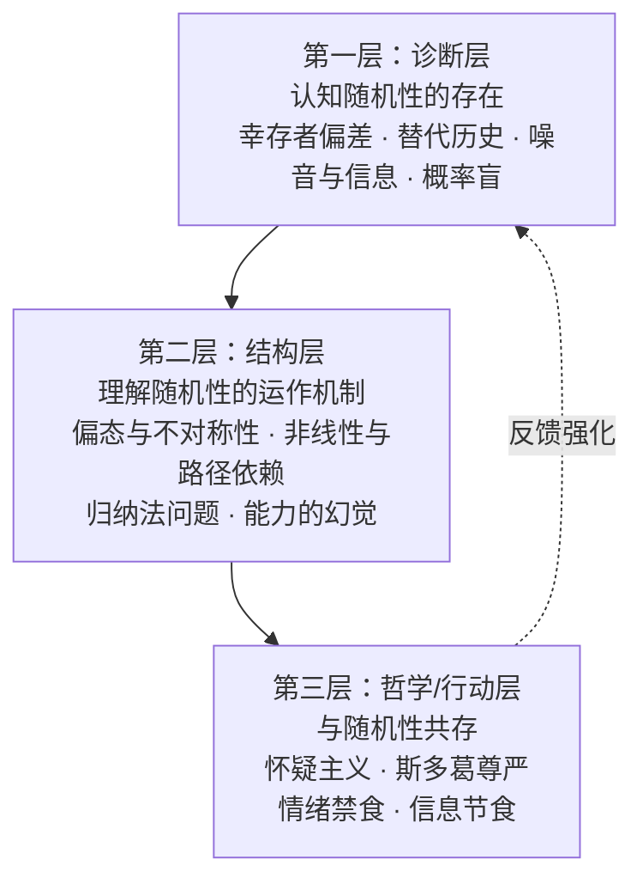

# 《随机漫步的傻瓜：发现市场和人生中的隐藏机遇》读书笔记

> **英文书名**：Fooled by Randomness: The Hidden Role of Chance in Life and in the Markets
> **作者**：纳西姆·尼古拉斯·塔勒布（Nassim Nicholas Taleb）
> **出版年份**：2001年（初版），2004年（第二版增订）
> **体裁**：金融哲学 / 认知心理学 / 投资随笔
> **在塔勒布体系中的位置**：不确定性四部曲（Incerto）第一部

---

## 第一部分：总体归纳

### 全书核心原则速览

| # | 核心原则 | 重要性 | 一句话解释 |
|---|---------|--------|-----------|
| 1 | **决策质量 ≠ 结果质量** | ⭐⭐⭐⭐⭐ | 用替代历史而非单一结果评估决策——好决策可能运气不好而失败，坏决策可能运气好而成功 |
| 2 | **幸存者偏差** | ⭐⭐⭐⭐⭐ | 我们只看到赢家，看不到成千上万以同样方式失败的输家，因此系统性高估了成功概率 |
| 3 | **替代历史思维** | ⭐⭐⭐⭐⭐ | 评估任何决策应想象它被重放1000次的所有可能结果——而非只看实际发生的那一条路径 |
| 4 | **噪音 vs 信息** | ⭐⭐⭐⭐ | 短期波动是噪音，长期趋势才是信息；降低观察频率是减少噪音干扰的唯一有效方法 |
| 5 | **偏态与不对称性** | ⭐⭐⭐⭐⭐ | 高胜率≠好决策——1%概率的灾难可以抵消99%概率的小收益；期望值才是唯一正确的度量 |
| 6 | **归纳法问题（休谟/波普尔）** | ⭐⭐⭐⭐⭐ | 过去发生≠未来一定发生——"所有天鹅都是白的"只需一只黑天鹅即可推翻；证伪主义是唯一防线 |
| 7 | **蒙特卡洛仿真思维** | ⭐⭐⭐⭐ | 通过生成数千种可能路径来分析概率，而非只看历史实际发生的单一路径 |
| 8 | **非线性与路径依赖** | ⭐⭐⭐⭐ | 微小原因可引发巨大后果（沙堆效应），早期随机优势可通过正反馈自我强化为永久优势 |
| 9 | **能力的幻觉** | ⭐⭐⭐⭐ | 在充满随机性的领域（如投资），运气常被误认为技能；重复性是判断真技能的唯一钥匙 |
| 10 | **社会跑步机效应** | ⭐⭐⭐ | 财富增加不带来持久幸福，因为参照系同步上移——永远在跟"更富的人"比较 |
| 11 | **证伪主义（波普尔）** | ⭐⭐⭐⭐ | 真正的科学不是"可被验证"而是"可被证伪"——好理论必须明确指出什么能证明它是错的 |
| 12 | **老知识比新趋势更可靠** | ⭐⭐⭐ | 存在了数千年的思想比刚发表的研究更有价值——时间是最好的过滤器（林迪效应的雏形） |
| 13 | **概率盲的普遍性** | ⭐⭐⭐⭐ | 数学家、医生、经济学家也经常被概率愚弄——认知偏差不是知识缺陷，是大脑硬件缺陷 |
| 14 | **迷信的进化起源** | ⭐⭐⭐ | 随机强化（斯金纳鸽子实验）解释了为什么最聪明的人也会发展出非理性迷信 |
| 15 | **情感是理性的润滑剂** | ⭐⭐⭐ | 完全消除情感不可能也不可取——需要的是管理技巧而非纯粹理性 |
| 16 | **斯多葛式的尊严** | ⭐⭐⭐⭐ | 命运控制一切，除了我们的行为——面对随机性的唯一正确态度是优雅地接受 |
| 17 | **波动性是信息的来源** | ⭐⭐⭐ | 可重复的技能（如牙医）方差小，不可重复的活动（如创业）方差大——辨识两者是关键 |
| 18 | **反向幸存者偏差** | ⭐⭐⭐ | 许多有真才实学的人因运气不好而失败从未被注意到——不要仅用结果判断能力 |
| 19 | **自我意识是唯一防御** | ⭐⭐⭐⭐ | 了解认知偏差不能免疫于它——但知道自己是"概率盲"是避免灾难的第一步 |
| 20 | **随机性的积极面** | ⭐⭐⭐ | 不确定性不总是坏事——它带来灵活性、自发性和自由；完全可预测的人生是僵化的 |

---

### 三部分结构一览

| 篇章 | 中文标题 | 核心主题 | 章节 |
|------|---------|---------|------|
| **第一篇** | 黑天鹅事件 | 认识随机性的存在及其欺骗性 | 第1-7章 |
| **第二篇** | 打字机前的猴子 | 随机性在商业和成功中的具体表现 | 第8-11章 |
| **第三篇** | 活在随机世界中 | 如何与随机性共处——从认知到行动 | 第12-14章 + 后记3篇 |

---

## 第二部分：逐章详细总结

### 前言：幸运的交易员

**核心论点**：塔勒布以自传式的笔触开篇，讲述他作为交易员的亲身经历——周围许多"成功"的交易员实际上只是幸运的随机漫步者，而真正理解随机性的人反而常常被嘲笑为"杞人忧天"。金融市场中的成功与失败，常常与当事人的能力无关，而与"你是否在对的地方、对的时间"高度相关。

**重点一：两个原型人物的对比——Nero Tulip与John**

塔勒布在全书开头就引入了两个贯穿全书的人物原型。Nero Tulip是塔勒布自己的半自传式化身——一个深谙随机性、追求长期生存的交易员。他不追求"最优"回报，而是专注于"不会破产"和"在市场最糟糕的时期幸存"。他的回报率不高但极其稳定。John则是一个过度自信的高收益债券交易员，采用高风险策略获取持续的高回报——在牛市中被视为"天才"，但1998年市场动荡中，他的整个职业生涯和财富在一夜之间灰飞烟灭。这两个人物的对比奠定了全书的基调：在充满随机性的世界中，最重要的不是"赚了多少"，而是"是否能活下去"。塔勒布用一个思想实验强化了这个对比：如果把John放回市场1000次，其中900次他会破产——他的"成功"只是因为他恰好生活在一次"有利的投掷"中。

**重点二："血清素效应"——财富胜利的化学骗局**

塔勒布提出了一个在行为金融学中极具原创性的生理机制解释：交易获利时，大脑释放血清素，让人产生一种持久的、舒适的"无敌感"——这与能力无关，纯粹是神经化学的副产品。更危险的是，这种化学奖励会形成正反馈循环：赚钱→血清素→自信→更大胆→（如果运气继续好）→更多钱→更多血清素。你越成功，越确信自己的聪明，越容易在下一次押注中犯致命错误。塔勒布指出，1990年代大牛市中的"天才"交易员几乎全部经历了这个循环——他们把有利环境中的繁荣当成了自己的技能，然后在环境改变时被清零。血清素效应的核心教训是：成功带来的自信感是不可靠的信息——它与实际能力的相关性可能接近零。

**重点三："牙医 vs 彩票中奖者"——区分可重复与不可重复的财富**

塔勒布用一个简洁的对比概括了全书的核心认知工具：牙医的财富来自可重复的技能——每天看同样数量的病人、完成同样质量的治疗，任何病人随机被替换都不会改变牙医的长期收入。彩票中奖者的财富是极度脆弱的——不可复制、不可重复，建立在一次性的极端随机事件上。这个区分的关键不是"牙医比彩票中奖者更高尚"，而是"当你在评估一个人的成功时，你必须问：他的成功有多可重复？"可重复性是区分技能与运气的唯一钥匙。塔勒布将这个框架应用于整个金融行业——他发现绝大多数"投资明星"更接近彩票中奖者而非牙医。

**重点四：本书在塔勒布体系中的独特位置——种子书的魅力**

《随机漫步的傻瓜》与塔勒布后续著作（《黑天鹅》《反脆弱》）最大的区别在于：它更个人化、更具自传性。塔勒布不是在"建构理论"，而是在"讲述亲历"——这使得它的文学魅力和情感力量远超后续的、更系统化的著作。全书中包含了后来所有更知名概念的原始种子：黑天鹅、杠铃策略、反脆弱性、切身利害——都在这里，只是以更原始、更直觉的形式呈现。对于已经读过《黑天鹅》和《反脆弱》的读者，《随机漫步的傻瓜》是回到源头的最佳窗口——你会看到那些后来著名的概念在它们最鲜活、最未经打磨的形态中。

**关键洞察**：
1. 两个人物的对比（Nero vs John）是全书最有效的人物装置——两个活生生的人比抽象的概率论更能让读者"感受"随机性的力量。
2. 血清素效应揭示了"成功→自信→更大的风险→潜在的灾难"这一生理循环——它是行为金融学中最早将神经化学与投资行为联系起来的洞见之一。
3. "牙医vs彩票中奖者"的区分是一个可以在任何领域使用的通用诊断工具——它不需要任何专业知识，只需要问一个简单的问题。

**行动清单**：
- [ ] 反思你的职业领域中，有多少"成功"可能是随机性的产物？在你的行业里，什么是区分运气与技能的可重复指标？
- [ ] 列出你生活中三个"成功决策"和一个"失败决策"——然后为每个决策设想至少三种"替代历史"（如果某个关键变量不同，结果会怎样？）
- [ ] 思考：你是否像John一样，在有利环境中变得过度自信？你的"长期生存"策略是什么？

---

### 第一篇：黑天鹅事件

---

### 第1章：赚钱的随机性

**核心论点**：财富不等于智慧——在金融市场中，巨额财富往往是极度幸运的产物，而非超凡技能的证据。塔勒布通过一系列对比论证，证明"富裕"和"聪明"之间的相关性远低于人们愿意相信的水平。

**重点一：交易员Nero与John的深度对比——两种策略哲学的碰撞**

塔勒布将前言的对比深化为完整的策略哲学分析。Nero的策略核心是"负向黑天鹅保护"——他接受较低的常规回报，以换取在极端市场事件中生存的能力。他的交易哲学中有一个鲜明的原则：永远不做任何"如果发生最坏情况就会归零"的交易，无论它的"概率"有多低。John的策略则恰好相反——他通过承担尾部风险来获取持续的高回报，这是一种"在压路机前面捡硬币"的交易。塔勒布用一个数学类比来揭示John策略的内在脆弱性：假设John每年有95%的概率赚100万美元、5%的概率亏损2000万美元——期望值为每年赚约-5万美元，但前四年他看起来是一个"天才"（连续四年赚400万美元），第五年的毁灭被归因为"百年一遇的坏运气"。这个期望值为负的策略之所以能欺骗所有人，正是因为毁灭的频率足够低——低到让人们在它发生之前相信"它不会发生"。

**重点二：幸存者偏差的最早系统性阐述——为什么"赢家的故事"不可信**

塔勒布在这一章给出了全书最早的幸存者偏差的系统性论述——后来在《黑天鹅》中被发展为更完整的框架。核心逻辑是：在任何一个有足够多参与者且结果受随机性影响的领域，总会涌现出一些"看起来像天才"的极端赢家——不是因为他们比输家更聪明，而是因为纯粹的统计必然性。如果你让一万只猴子在打字机前随机敲打，总有一只最终会敲出《伊利亚特》的开篇。在投资中，如果你有一万名基金经理，每人每年有50%的概率跑赢市场（纯随机），五年后会有约313人连续五年跑赢——这些人将被媒体包装为"投资天才"，被邀请到电视上解释他们的"投资哲学"。但他们的"能力"与他们的"成功"之间的因果箭头方向是错误的——是随机性创造了成功，不是能力。

**重点三："交易员致富"的社会学悖论——为什么随机性驱动的财富被误认为技能**

塔勒布提出了一个挑衅性的社会学观察：在投资行业中，人们支付高额费用来获取"专业管理"——但实证数据（如SPIVA记分卡）反复证明，绝大多数"专业管理"在扣除费用后跑输指数。这个悖论之所以能持续存在，是因为三个相互增强的因素：（1）幸存者偏差让"赢家"高度可见而"输家"隐形；（2）血清素效应让赢家自己也真诚地相信自己的能力；（3）大多数投资者的"概率盲"让他们无法区分"连续五年跑赢"和"随机过程中的一个幸运样本"。塔勒布暗示，主动管理行业的整个商业模式——以"技能"为卖点收取管理费——可能建立在一个统计幻觉之上。

**重点四：本章的方法论贡献——"替代历史"概念的雏形**

虽然"替代历史"概念在第2章被正式展开，但第1章已经埋下了种子。当塔勒布说"把John放回市场1000次，900次他会破产"时，他正在使用替代历史的思维——他不是在评估John实际发生的那一条历史，而是在评估John的策略在所有可能历史中的表现分布。这种思维——不只看"发生了什么"，而要看"在所有可能的世界中，什么可能发生"——是全书最具方法论原创性的贡献。塔勒布后来将它追溯到莱布尼茨的"可能世界"理论和现代蒙特卡洛方法，但在第1章中，它以最朴素的直觉形式出现了。

**关键洞察**：
1. "95%概率赚100万+5%概率亏2000万"的数学例子是全书最简洁的风险教育——它用不到一行算术揭示了为什么"几乎每次都赢"的策略可能是最危险的策略。
2. 幸存者偏差不仅仅是一个"认知偏差"——它是一个每天在金融市场上制造假"天才"的统计工厂。一万个随机投资者五年内必然产生约三百个"连续跑赢"的幸运儿。
3. 这一章的价值在于它不只是在说"运气很重要"（这是老生常谈），而是在展示运气的**具体运作机制**——血清素循环、幸存者偏差的统计必然性、牙医与彩票中奖者的结构性区别。

**行动清单**：
- [ ] 审查你的收入来源：其中多少来自可重复的技能（如工资），多少来自一次性运气（如某次投资暴赚）？
- [ ] 下次在"连续成功"后感到自信膨胀时，问自己："如果我是一个模拟器，重新播放这段经历1000次，我还能成功多少次？"
- [ ] 建立"血清素检查"习惯——每当你因为成功而感到"无敌"时，刻意回想一次你"确信正确但最终失败"的经历

---

### 第2章：奇特的结算方法

**核心论点**：评估任何决策的正确方法不是看它的结果，而是看它在所有可能结果中的分布——即"替代历史"的方法。只看一个结果（实际发生的那一个）是人类在评估决策时最普遍、最具破坏性的认知错误。

**重点一：俄罗斯轮盘赌思想实验——替代历史的暴力入门**

塔勒布用全书最具冲击力的思想实验来展开论证：假设某人玩了俄罗斯轮盘赌——六分之一概率爆头死亡，六分之五概率拿走1000万美元。他"赢了"——活了下来，拿到了1000万美元。我们能说"他做了一个好决定"吗？答案显然是不能。因为"活着拿到钱"只是六种可能历史中的一种。完整的评估必须考虑所有六种可能——其中有一条是死亡，这才是一个灾难性的决策。这个思想实验之所以有效，是因为它将"替代历史"的抽象概念以最极端、最不可回避的方式视觉化了——死亡使"不能只看结果"这个论点变得无可辩驳。塔勒布随后将这个逻辑从俄罗斯轮盘赌推广到日常决策：我们所有的"成功决策"都在一把弹仓更多的左轮手枪前面——失败频率更低，更让人误以为安全，但当失败发生时，它同样是毁灭性的。

**重点二："数百个弹仓"的比喻——现代金融风险的隐匿性**

塔勒布将俄罗斯轮盘赌的隐喻扩展到现代金融环境的关键观察：现实世界中的"左轮手枪"不是六个弹仓，而是数百个甚至数千个——失败频率被稀释到极低，让人误以为"安全"。一只"过去三十年从未亏损"的债券基金，可能在第三十一年遇到"百年一遇"的信用事件而全部归零——在此前的三十年里，它看起来像是最安全的投资。现代金融体系通过复杂的结构化产品将尾部风险"隐藏"在极其不频繁的事件中——频率越低，人类越倾向于将"低频率"误认为"零概率"。塔勒布指出，几乎所有重大金融灾难的共同模式是：之前的长期稳定让人们低估了风险，而长期稳定本身恰恰是风险积累的根本原因。

**重点三：从"结果偏见"到"结果无关"——一种认识论的飞跃**

塔勒布将思想实验推进到一个更激进的结论：在评估任何决策时，结果本身提供的信息几乎是零——除非你知道这个结果在可能结果的分布中处于什么位置。一个"好结果"可能来自一个坏决策（俄罗斯轮盘赌的幸存者），一个"坏结果"可能来自一个好决策（谨慎驾驶却遭遇他人闯红灯的司机）。因此，正确的评估方法是"结果无关"的——只看决策在当时的已知信息下、在所有可能路径中的期望表现。这个结论的反直觉之处在于：它要求我们在成功时不自大、在失败时不过度自责——而人类的整个情感系统（血清素、多巴胺、皮质醇）恰恰被"结果"而非"过程"所驱动。这就是为什么"用替代历史评估决策"是一个必须刻意训练而非自然发生的技能。

**重点四：莱布尼茨的"可能世界"——将交易员的直觉提升为哲学立场**

塔勒布在这个重点上展示了他的哲学野心。他将"替代历史"的方法论追溯到莱布尼茨的"可能世界"理论——在所有逻辑上可能的世界中，我们实际经验的只是其中之一。这一追溯的意义在于：它将"替代历史"从一个交易员的实用工具提升为一种认识论的严肃立场。你不需要接受莱布尼茨的形而上学（"上帝选择了最好的可能世界"）来使用他的框架——你只需要认识到：当你在做决策时，你实际上是在所有可能世界的分布上下注。塔勒布还提到了埃弗里特的多世界量子诠释，进一步为"替代历史"提供了一种（半开玩笑的）物理基础。

**关键洞察**：
1. "俄罗斯轮盘赌"的思想实验是全书最强大的认知工具——一旦你真正内化了它，你将永远无法再"只看结果"来评估任何决策。
2. "数百个弹仓"的隐喻精准地刻画了现代金融风险的本质——不是因为风险不存在，而是因为它的低频让人误以为它不存在。
3. 将"替代历史"从商业直觉提升为哲学立场（莱布尼茨），是这本书超越"金融畅销书"范畴的关键动作——它标志着塔勒布的野心是成为"公共哲学家"而非"投资顾问"。

**行动清单**：
- [ ] 每周做一次"替代历史"练习：选择一个本周做出的重要决策，设想5种不同的替代历史，评估你的决策在所有替代历史中的平均表现
- [ ] 审查你的投资组合/职业规划：其中是否有"俄罗斯轮盘赌"式的隐性尾部风险——看起来很安全（因为从未失败），但一次失败就全部归零？
- [ ] 当评估他人的成功时，不再问"他做了什么"，而问"如果同样的策略被一万个人复制，有多少人会得到同样的结果？"

---

### 第3章：从数学的角度思考历史

**核心论点**：历史远比我们想象的更随机——我们事后为一切事件编造"因果链条"，但事实上任何一个微小的随机事件都可能完全改变历史轨迹。蒙特卡洛模拟和噪音/信号区分是打破这种"叙事谬误"的两个核心工具。

**重点一：蒙特卡洛模拟——用计算机打破"单一历史"的魔力**

塔勒布介绍了蒙特卡洛模拟（Monte Carlo simulation）的概念。核心洞见是：人类只经历过"一条"历史——实际发生的那一条。但从概率论的角度，有无数条"可能但未发生"的历史路径。蒙特卡洛方法通过计算机生成数千条随机路径，让你看到"在各种不同的随机扰动下，可能发生什么"。当我们在事后解释"为什么希特勒崛起是必然的"或"为什么罗马帝国注定衰落"时，我们实际上是在对一条随机路径进行"必然性"的叙事加工——蒙特卡洛模拟通过展示大量其他可能的路径（其中希特勒在某个微小事件中被阻止），让这种"必然性叙事"轰然崩塌。塔勒布的核心观点是：历史学家的工作——在事后为一切找到"原因"——在方法论上是有根本缺陷的，因为它系统地忽视了随机性的角色。

**重点二：噪音与信息的区分——"时间尺度"问题的经典表述**

塔勒布提出了全书中对投资者最具行为指导意义的概念。他将市场价格的短期波动类比为噪音——日内波动、周度震荡——它们没有信号价值，但大多数投资者沉迷于此。如果一位牙医每分钟查看自己的投资组合，他会一直处于焦虑状态——因为短期噪音在情绪上的冲击远大于长期趋势的清晰信号。但如果他每年查看一次，会看到清晰的正向趋势（假设市场长期上涨）。核心公式：**观察频率越高，噪音比例越大。**塔勒布将这个洞见从投资扩展到了管理（不要被每日KPI波动迷惑）、职业（不要被短期挫折或成功过度影响情绪）和媒体消费（新闻本质上是最短期的噪音）。这是"反短期主义"立场的最早、最清晰的表达。

**重点三："老知识优于新研究"——林迪效应的早期雏形**

塔勒布提出了一个后来在《反脆弱》中被发展为"林迪效应"的早期洞见：**存在了几个世纪的思想比刚发表的研究更值得信任。**时间是最诚实的过滤器——能经受住数百年驳斥和遗忘压力而存活的观点，其内在价值远高于最新的学术论文。塔勒布将这个原则转化为极其实用的读书建议：至少存在了50年的书才值得一读——这意味着他将绝大多数阅读时间分配给了经典（哲学、历史、文学），而非最新出版的畅销书。这个原则的反直觉之处在于：它暗示"最新"的信息在大多数情况下不如"最旧"的信息有价值——因为新信息还没有经过时间的"脆弱性测试"，它们的灭绝概率极高。

**重点四：反事实历史思维——打破"必然性叙事"的心理练习**

塔勒布提出了一个具体的思维练习来训练"反事实"的认知能力：选择一个你认为"必然"发生的重大历史事件（如罗马帝国灭亡、工业革命发生在英国、2008年金融危机），然后设想至少三种微小的变化——任何一个小小的随机事件改变——就足以让这个"必然"事件完全不发生。这个练习的目的不是否定因果分析的价值，而是让你在直觉层面感受：所有"必然性叙事"都依赖于忽视那些"可能但未发生"的替代路径。当你完成这个练习后，你对"专家"在事后信心满满地解释"为什么某事件不可避免"的忍受度将大幅下降。

**关键洞察**：
1. "观察频率越高，噪音越大"是塔勒布对投资者最重要的行为建议——它不仅适用于投资（减少查看账户），也适用于管理（不要被每日KPI波动迷惑）、职业（不要被短期挫折过度影响情绪）。
2. "存在了50年的书才值得一读"是一个极其高效的读书过滤器——你不需要阅读任何新出版的畅销书，而应该把时间花在经受住时间考验的经典上。
3. 反事实历史思维的训练效果是：你将永远无法再以同样的严肃态度接受任何"专家"在事后对任何复杂事件的"必然性"解释。

**行动清单**：
- [ ] 设置一个规则：只在每个季度（而非每天或每周）查看投资账户——减少观察频率就是减少噪音
- [ ] 清理你的书架/书单：有多少本书出版超过50年？考虑将阅读时间的80%分配给已存在超过半个世纪的经典
- [ ] 做一个"历史反事实"思想实验：选择一个你认为"必然"发生的重大历史事件，设想至少三种可以使其完全不发生的"微小变化"

---

### 第4章：随机性和科学知识分子

**核心论点**：许多被尊为"知识分子"的人使用的语言看似深奥但毫无实际内容——随机生成的文本就能冒充学术著作，而真正的科学思维应该是严格、可证伪和反对废话的。

**重点一：反向图灵测试——区分真知识和伪知识的实用工具**

塔勒布提出了全书最具挑衅性的方法论工具：反向图灵测试。图灵测试的原始版本是——如果一台机器能够通过与人类对话让人无法区分它是机器，那么这台机器就具有了"智能"。塔勒布的"反向图灵测试"是——如果计算机随机生成的文本能够被学术期刊接受、被企业高管在年会上发表、被智库作为政策建议，那么这些文本所代表的"知识"在认识论上是空的。塔勒布展示了一个简单的公式——从一列动词（"赋能、创新、驱动、转型、颠覆"）和一列名词（"协同、范式、生态系统、利益相关者、最佳实践"）中随机抽取组合——就可以生成任何CEO可以在年会上发表的"深刻"演讲。这不是纯粹的讽刺——它证明了很多"商业智慧"和"学术语言"实际上是完全没有可证伪内容的空洞修辞。如果一段话可以被随机生成器一模一样的输出，那它不携带任何信息。

**重点二：对法国后现代哲学的猛烈攻击——晦涩不等于深刻**

塔勒布将火力对准了法国后现代哲学——特别是雅克·德里达。塔勒布认为德里达的文字"几乎无法理解"，但这种"无法理解"反而被学术界视为"深度"的标志。塔勒布的论点不是"德里达的思想是错的"（他甚至没有尝试去理解它），而是"如果一段文字不能被有理智的人明确地判断为真或伪，那么它就不是知识——它是文学，或者更准确地说，是文字游戏。"这种批判在学术界引发了巨大争议——许多人指出塔勒布对德里达的理解过于表面化。但塔勒布的重点不在"哲学史的正确性"，而在"方法论的态度"：我们应该用最严格的标准来审查"听起来深奥"的语言——如果无法用简单的话说清楚，很可能它什么都没说。这个标准对商业、政治、学术同等适用。

**重点三：对黑格尔的批判——"伪思想家的鼻祖"**

塔勒布称黑格尔为"所有伪思想家的鼻祖"，认为黑格尔的文字是用复杂语言包裹起来的废话——通过让读者感到"如果我看不懂，一定是我太笨"来获得权威。这个判断在哲学专业领域被广泛批评为过于简单化——黑格尔的《精神现象学》和《逻辑学》在哲学史中具有真实的、重要的位置。但塔勒布的批判如果放在他的整体框架中，其核心主张是一个更温和但同样重要的观点：**写作和演讲中的"晦涩"应该被视为认知的失败而非智慧的标志。**一个好的思想家应该能用最清晰的语言表达最复杂的观点——不是"清澈如水的浅薄"，而是"透明的深度"。在商业领域（那里充斥着大量"听起来深刻但从未被证明产生过实际价值的"管理理论），塔勒布的这个标准是无可辩驳的。

**重点四：科学知识分子 vs 文学知识分子——两种认知模式的区分**

塔勒布在这一章中画出了一条后来贯穿他全部著作的界限：科学知识分子和文学知识分子代表两种根本不同的认知模式。科学知识分子（以波普尔为代表）的标志是"证伪主义"——他们的主张可以被事实证明为错误，因此他们的话语有"可检验的边界"。文学知识分子（以德里达和许多后现代主义者为代表）的标志是"不可证伪性"——你可以永远争论他们的解释，但永远无法确定谁是对的。塔勒布不是"反文学"——相反，全书充满了对荷马、普鲁斯特、卡瓦菲斯的深厚引用——他是"反对用文学的方法来讨论事实性、科学性、可检验性的问题"。当文学性的"解释"进入科学、经济和政策的领域时，它就在以"深度"的假象掩盖"谬误"的实际。

**关键洞察**：
1. "反向图灵测试"是区分真知识和伪知识的终极实用工具——问问自己：这个人的话可以被随机生成器一模一样的输出吗？如果可以，那你不需要听。
2. 塔勒布对"伪知识分子"的批判是后面所有著作中方法论一致性的基础——《黑天鹅》批判"预测专家"、《反脆弱》批判"天真的干预者"——根源都在这里：用空洞语言伪装知识。
3. "晦涩不等于深刻"——这个原则虽然在对黑格尔的批判中过于简单化，但在商业、管理、金融建议的领域中是一个无可辩驳的真理。

**行动清单**：
- [ ] 读一读你所在领域过去十年的预测报告——有多少实际上是"随机生成的废话"？有多少包含明确的、可被证伪的预测？
- [ ] 下次听到一个"听起来很深刻"但不好理解的陈述时，要求对方用日常语言重新表述——如果做不到，意味着什么？
- [ ] 进行一次"反向图灵测试"：把你公司/机构过去一年的战略文件给朋友看，问他能否区分这些文件和AI生成的随机文本

---

### 第5章：最不适者可能生存吗？

**核心论点**：市场并不总是奖励"最好的"——随机性可以创造"能力"的假象，使短期最"适应"当前随机环境的人看起来像是长期最优者，而这种优势可能在环境变化时瞬间崩塌。达尔文的"适者生存"在短期市场中被随机性系统地扭曲了。

**重点一：Carlos的悲剧——新兴市场债券交易员的兴衰**

塔勒布用Carlos（一个新兴市场债券交易员）的案例展示了"最不适者生存"的悖论。Carlos的策略是在新兴市场牛市中持续做多、加杠杆——这种策略在牛市中表现出色，连续多年盈利，积累了巨额财富和名声。所有观察者（包括Carlos自己）都认为这是技能的证明。但1998年俄罗斯债务危机爆发时——一个"从未在同一区域同时发生过"的连锁反应模式——Carlos在一个月内损失了3亿美元。"Carlos的技能"原来是对一个特定市场环境的极端押注——当环境改变时，昨天的"最适者"瞬间变成了"最不适者"。塔勒布的分析核心是：Carlos不是在"1998年运气不好"——他的策略本身就隐含了在"某个时候"必然崩溃的结构性脆弱性，只是这个"时候"恰好是1998年。

**重点二：横截面问题——为什么"最成功的"往往只是"最幸运的"**

塔勒布提出了一个极其重要的方法论概念：**横截面问题**。在任何时间点，市场中最"成功"的交易者往往只是"最适应当前随机环境"的人，而不是"最好的长期玩家"。这完全颠覆了"市场有效"或"达尔文式最优"的假设——在达尔文的框架中，"生存下来的"就是"最适的"。但在金融市场的短期横截面中，生存下来的——也就是当前表现最好的——很可能只是那些恰好押中了当前市场模式的人。当环境改变时（这几乎总是发生，因为金融市场本身就是由周期性变化定义的），这些"横截面赢家"的系统性脆弱性就会暴露。塔勒布的推论是：在任何有随机性的领域，基于横截面数据（当前谁最成功）来推断"谁最有能力"在方法论上是根本错误的。

**重点三："一个人避开灾难的时间越长，他就越脆弱"——全章最反直觉的洞见**

塔勒布提出了全书中最反直觉的命题之一：**危险不在于灾难本身，而在于灾难前漫长的"安全期"。**Carlos之所以在1998年损失3亿美元，不是因为1998年的市场异变——而是因为他之前在1995、1996、1997年连续三年获利。这段"安全期"做了两件事：它让Carlos自信地加仓（血清素效应），它让他周围的所有人（老板、客户、媒体）都确信他的方法是"经过验证的"。在金融世界中，最大的灾难从不发生在人们"担心灾难"的时候——那时人们有防备。灾难总是发生在人们已经放松警惕、把长期稳定当作"新常态"的时候。塔勒布提炼出一条残酷的法则：**在市场中没有灾难的时间越长，当灾难发生时其破坏力就越大——因为系统在"平静期"中积累了更多的隐性杠杆和脆弱性。**

**重点四：消防站效应——同质化群体如何放大错误**

塔勒布提出了"消防站效应"这个社会学观察：交易员和经济学家通过不断的自我强化讨论来互相巩固错误观点。在一个交易大厅或"智库"中，每个人都用相同的（错误）假设来推理——这种"集体同质化"使得群体比个体更非理性，而非更理性。这与流行的"群体智慧"概念截然相反——"群体智慧"的前提是参与者的判断彼此独立。当参与者彼此影响、共享同一套错误假设时，群体的"共识"不是"更高智慧"，而是"被放大的偏见"。消防站效应的实践含义是：如果你的所有信息来源和讨论伙伴都来自同一个"圈子"，你实际上是在一个封闭的信息环境中自我强化——这在认知上与Carlos的新兴市场交易大厅没有任何区别。

**关键洞察**：
1. "横截面问题"是最直接的投资教训之一：不要基于过去3-5年的业绩选择基金经理——那段时间的长度不足以区分运气和技能（纯随机也能在5年内产生"天才"）。
2. "一个人避开灾难的时间越长，他就越脆弱"是全书最反直觉的洞见——它颠覆了"越稳定越安全"的常识，揭示了一个残酷的真相：稳定本身就是脆弱性的积累过程。
3. "消防站效应"暗示了一个深刻的团队设计原则：投资团队的价值可能在于"多样性"（不同的思维方式、不同的假设）而非"专业性"（所有人共享同一范式）。

**行动清单**：
- [ ] 评估你选择的任何基金经理/理财顾问：他们的业绩记录有多长？是否跨越了至少一个完整的"极端事件周期"（如2000年泡沫、2008年金融危机）？
- [ ] 检查你的社交和信息圈：你周围有多少"唱反调的人"？如果没有，这是一种危险信号——你可能正处于"消防站"中
- [ ] 做一个个人版本的"横截面测试"：列出过去三年你最成功的三个决策，然后为每个决策列出"环境条件"——如果环境改变，这些决策还会成功吗？

---

### 第6章：偏态与不对称性

**核心论点**：概率本身并不足以评估风险——期望值（概率 × 收益大小）才是关键。一个高概率但期望值为负的策略比一个低概率但期望值为正的策略更危险。人类的大脑被高胜率麻痹，而忽视了每次胜利的大小与每次失败的毁灭性。

**重点一：古尔德的故事——"中位数不是我的命运"**

塔勒布用史蒂文·杰·古尔德（著名演化生物学家）的真实故事开篇，这是全书最感人且最具教育意义的案例之一。古尔德被诊断出罹患一种罕见的腹部间皮瘤，医生告诉他中位生存期是8个月。古尔德的第一反应不是恐慌，而是知识分子的冷静：他意识到"中位生存期8个月"意味着有一半的人活不过8个月，但另一半人活得更久——其中有些人甚至是几十年。这个分布不是对称的——右侧有一个"长尾"（long tail），少数人活了很多年。古尔德理解了这种偏态分布的含义：他的命运不在中位数，而在分布的某个未知位置——而他处于右侧长尾中的概率并不为零。他随后接受了积极治疗，又活了20年，不是因为"意志力战胜了癌症"，而是因为他正确理解了概率分布的含义——他没有让一个单一的"平均"数字替他做决定。塔勒布从这个故事中提取出一句格言：**分布比平均值重要。**

**重点二：高胜率策略的危险假象——"几乎每次都赢"可能是最致命的**

塔勒布给出了全书最简洁也最重要的投资原理：在评估任何策略时，"看涨"或"看跌"是无意义的概念——你还需要知道"涨多少"和"跌多少"。一个看似可靠的策略——99%的概率赢1元，1%的概率输10000元——实际上是一个期望值为-99.01元的毁灭性策略。但人类的大脑在认知上被高胜率麻痹了——99%（"几乎每次都赢！"）让人感觉安全，而实际上它在一步步把你拖向深渊。塔勒布将这个现象命名为**偏态盲**——人们在评估风险和回报时倾向于只关注"赢的概率"，而忽视了"赢的大小"和"输的大小"之间的不对称性。这是对现代金融风险管理（特别是VaR——风险价值模型）最根本的批判：这些模型关注的是"正常"（高频率事件）而非"尾部"（低频率但毁灭性事件）。

**重点三：塔勒布的交易策略——"在大概率事件上输小钱，在小概率事件上赢大钱"**

塔勒布以一个令人惊叹的个人披露来展示偏态思维的实际应用：他自己的交易策略经常是——在70%的概率市场上涨的情况下，大量押注市场下跌。不是因为他"预测"市场会跌——而是因为如果市场上涨，幅度通常很小（他被摩擦成本轻微伤害）；但如果市场下跌，它可能是崩盘（他大赚一笔）。**这种策略在统计上的"正确率"低于50%——这意味着他在大多数时间里是"错"的——但其期望值是正的。**这种"在大概率事件上输小钱，在小概率事件上赢大钱"的策略是后来"杠铃策略"的雏形。它的反直觉之处在于：一个在大多数时候"错误"的策略可以是好策略，而一个"几乎总是正确"的策略可以是毁灭性的——评估标准只有一个：期望值，而非正确率。

**重点四：稀有事件的价值被系统性低估——为什么市场总是"买贵了保险"的反面**

塔勒布从偏态思维中推导出一个关于金融市场的激进结论：**稀有事件的价值被系统性地低估。**原因在于人类认知的结构性缺陷——我们的大脑对"频率"极其敏感（"很多次！"），对"大小"极不敏感（除非差异巨大）。投资者愿意为"频繁的小收益"支付过高的价格（因为它们"感觉"可靠），而严重低估了"罕见的极端收益"的价值。这创造了塔勒布所说的"反脆弱交易"——买入被低估的稀有事件保险（在别人认为"安全的"系统中识别隐藏的脆弱性），用持续的、小额的成本换取偶尔的、巨大的回报。这个框架在2008年金融危机中获得了史诗级的验证——那些提前识别到银行系统脆弱性并购买廉价"崩溃保险"的人，在小额保费支付了多年后，在2008年的一次大崩溃中获得了数倍甚至数十倍的回报。

**关键洞察**：
1. "中位数不是你的命运"——古尔德的故事是所有受过教育的人都应该知道的最重要的概率论教训之一：了解分布比了解"平均值"重要得多。
2. "99%胜率但期望值为负"的数学例子是全书最简洁的风险教育——它用不到半页纸揭示了为什么"几乎每次都赢"可能是通向毁灭的最快路径。
3. 塔勒布的"70%概率看跌"策略展示了一种完全不同于传统投资的思维方式——它不在乎"正确率"，而在乎"如果错了损失什么，如果对了赚什么"。

**行动清单**：
- [ ] 下次看任何"平均"数据时，立即追问：分布是什么样的？最大值和最小值是多少？尾部有多厚？
- [ ] 审查你的投资组合：其中有多少是"赌小概率但高回报"的仓位？有多少是"高胜率但一次灾难就清零"的仓位？
- [ ] 在生活中应用偏态思维：评估一个重要决策时，不仅问"最可能的结果是什么"，更要问"最好的可能结果是什么？最坏的可能结果是什么？各自期望值是多少？"

---

### 第7章：归纳法的问题

**核心论点**：人类最根本的认知缺陷是归纳法——从"过去一直如此"推断"未来也将如此"。这一缺陷无法被完全克服，但可以通过波普尔的证伪主义来部分缓解。塔勒布通过哲学谱系追溯和一个灾难性的交易案例，将这一抽象问题变得触目惊心。

**重点一：黑天鹅隐喻的首次登场——全书概念体系的种子**

塔勒布在这一章中首次引入了后来成为他最著名概念的"黑天鹅"隐喻。如果你只见过白色的天鹅，你会归纳出"所有天鹅都是白色的"——这是一个基于完整的历史数据（数千年间所有被观察到的天鹅都是白色的）的"完美"归纳。但只要在澳大利亚发现一只黑天鹅，这个归纳就被彻底推翻。这个隐喻的核心不是"有些事情无法预见"——而是"有些事情因其从未发生过而被完全排除在我们的认知框架之外"。黑天鹅事件的三个特征（罕见性、极端冲击力、事后的可解释性）在后来的《黑天鹅》（2007）中被完整展开，但在本章中，它以最朴素但最具冲击力的形式首次出现——它不是一个抽象的概念，而是一幅视觉意象：一只黑色的天鹅在白色的天空中飞翔。

**重点二：休谟的归纳法问题——"没有逻辑基础"的理性危机**

塔勒布追溯了这一问题的哲学根源：18世纪苏格兰哲学家大卫·休谟最早指出归纳法没有逻辑基础。过去太阳每天升起，不能以任何逻辑必然性证明明天太阳也会升起——你只是在依赖"自然的一律性"这个假设。休谟的解决方案是"习惯"——我们选择相信归纳法不是因为它有逻辑基础，而是因为它是唯一实用的生存方式。塔勒布从休谟的论证中提取出一个令人不安的推论：我们所有的知识——科学定律、经济预测、医学判断——都建立在"过去→未来"的归纳跳跃上，而这个跳跃在逻辑上是不成立的。这意味着"确定性"是一个幻觉——它从来没有存在过，只是因为我们从未遇到挑战它的反例。

**重点三：Victor Niederhoffer——被归纳法两次摧毁的天才**

塔勒布以一个令人心碎的案例来赋予归纳法问题以血肉。Victor Niederhoffer是芝加哥大学的博士、乔治·索罗斯的前合伙人、对统计学极精通的天才交易员。他的核心信念是：如果某事从未在历史数据中发生过，它就不太可能发生——他称之为"经验概率的严格应用"。他将这个信念变成了一套具体的交易策略：寻找历史上从未被突破的价格模式，然后押注它不会被突破。1997年，泰国泰铢贬值引发东南亚市场连锁崩盘——这是一个在历史数据中从未出现过的区域性同时崩溃的模式。Niederhoffer损失了全部资金。几年后，他重建了资金，然后在2007年再次以几乎相同的方式失去了一切。"一个极度聪明、精通统计的人，因为'相信过去可以归纳未来'而两次失去一切"——这个案例证明：**知识不能免疫于认知陷阱。**你可以在理论上完全理解归纳法的问题，而在实践中被它彻底毁掉。

**重点四：波普尔的证伪主义——"可被证伪"才是真科学的标志**

塔勒布介绍了卡尔·波普尔的证伪主义作为对归纳法问题的回应。波普尔的革命性观点是：真正科学的标志不是它"可以被验证"（因为再多的验证也不能"证明"一个全称命题——"所有的天鹅都是白的"），而是它"可以被证伪"——意味着它必须明确地声明"什么证据可以证明我是错的"。一个不能被证伪的理论——如弗洛伊德的精神分析（无论你做什么，分析师都可以将其解释为"无意识的投射"）——不是科学，因为它永远无法被证明是错的。塔勒布将这一标准直接应用于投资：你的投资信念是可被证伪的吗？"这只股票会上涨"只有在你说"如果它跌到X价位，我的判断就是错的"时才是可被证伪的——否则，你只是在表达情绪。塔勒布介绍了乔治·索罗斯作为"波普尔式的交易者"——索罗斯以快速改变想法而闻名，他对他的一位交易员说过的第二有名的话是："我总是在犯错，这就是我成功的原因。"

**重点五：波普尔与索罗斯——理论与实践的统一**

塔勒布将索罗斯视为波普尔哲学在金融世界中的活生生的实践者。索罗斯曾在伦敦经济学院师从波普尔，并将证伪主义的核心直觉内化为他的交易哲学的核心——"可错性"（fallibility）和"反射性"（reflexivity）。可错性意味着你永远不知道你当前的理解是否正确；反射性意味着你的理解本身就影响着你在理解的对象。索罗斯在交易中的实践是：**永远不要"嫁"给任何市场观点。**一旦发现与仓位相矛盾的证据，立即调整立场——不是"等到有足够多证据"，而是立即行动。这种"随时准备被证明错误"的心态——不是口头上的谦逊，而是用真金白银来实践——是塔勒布为读者提供的"如何与归纳法问题共存"的具体答案。

**关键洞察**：
1. Niederhoffer的故事是全书最具悲剧性的案例——它证明知识不能免疫于认知陷阱。你可以在理论上完全理解归纳法的问题，而在实践中被它毁掉——因为你的大脑在无意识层面仍然在进行"归纳"。
2. "证伪主义"在投资中的实践应用是：永远不要"嫁"给任何市场观点。索罗斯的做法——一旦发现与仓位相矛盾的证据，立即调整立场——是一种可以训练的认知纪律。
3. 黑天鹅隐喻在《随机漫步的傻瓜》中首次登场时的朴素形态，比后来在《黑天鹅》（2007）中的系统化更具冲击力——它不是一个"概念"，而是"一只黑色的天鹅在一片白色的天空中展翅"的心理意象。

**行动清单**：
- [ ] 列出你生活中三个"一直如此"最根深蒂固的信念（如"房价永远涨""我的行业永远有需求"），然后为每个信念找出至少一个历史反例
- [ ] 培养"索罗斯习惯"：每天刻意寻找一条与你最坚定的信念相矛盾的证据——不是要你立即改变信念，而是要你"看见"反面证据
- [ ] 阅读波普尔《科学发现的逻辑》或至少了解"可证伪性"概念——它比你想象的更直接影响你的投资和生活决策质量

---

### 第二篇：打字机前的猴子

---

### 第8章：太多"下一个富翁"

**核心论点**：畅销书《邻家的百万富翁》犯了一个典型的幸存者偏差错误——它只研究了"已经成为百万富翁的人"，而没有研究"遵循相同习惯却未能成为百万富翁的人"。这种错误普遍存在于"成功学"和投资建议中。

**重点一：双重幸存者偏差——"成功学"的方法论根本缺陷**

塔勒布将批判矛头指向了当时极畅销的个人理财书《邻家的百万富翁》——这本书声称通过研究百万富翁的习惯可以总结出致富的"公式"。塔勒布指出这是一个**双重幸存者偏差**：第一层——作者只研究了"成为百万富翁的人"，但没有研究"遵循相同习惯却没有成为百万富翁的人"。第二层——那些曾经是百万富翁但后来破产的人也不在样本中。你无法从"赢家的习惯"推导出"致富的公式"，就像你无法从一个研究彩票中奖者的人那里推导出"中奖公式"一样（除了"先买彩票"）。塔勒布的论证不是"这本书的答案是错的"——而是"这个研究方法在逻辑上不可能产生正确答案"。这是一个远比"反驳具体内容"更根本的批判。

**重点二：Marc的故事——"社会跑步机效应"**

塔勒布以Marc（曼哈顿顶级律师，年收入50万美元）的故事来展示"社会跑步机效应"（social treadmill）。Marc在精英社交圈中觉得自己是个"失败者"，因为他的邻居们——对冲基金经理、科技公司创始人——年收入是他的数倍甚至数十倍。Marc陷入了永远的"相对贫困"：当他变得更富有时，他的参照系同步上移——从"和我一样的律师"换到了"对冲基金经理"。结果是：他的收入增长了十倍，但他的"满足感"几乎没有任何增长。塔勒布引用了卡尼曼和普洛特斯奇（Kahneman & Tversky）的研究数据：在控制了基本生存需求之后，额外财富的边际幸福增量极其微小且快速衰减。真正的幸福与绝对财富水平关系不大，与"你在参照组中的相对位置"关系很大——而参照系是可以被无限上移的。

**重点三："美国股票的9%回报率"——又一个归纳法谬误**

塔勒布讨论了另一个广泛流传的投资信念——"股票长期来看总是回报9%"。这个数字完全基于美国过去100年的数据。但如果样本选择的是俄罗斯（1917年归零）、德国（两次归零）或日本（30年不涨）的股票市场，"长期平均回报"会截然不同。塔勒布的核心论证是：**"长期"是一个相对于"统计量"的概念，而不是一个绝对的时间长度。**美国在过去100年中的"9%平均回报"在很大程度是一个历史偶然——它依赖于美国没有经历战争失败、恶性通胀、以及重大的政治体制转换。这个"9%"在今日的日本或俄罗斯投资者看来，可能是一个荒谬的笑话。塔勒布不是"看空股市"——他在说：**不要将特定历史样本的统计量当作"自然规律"。**

**重点四：幸存者偏差的无处不在——为什么"成功人士的建议"不可信**

塔勒布将这一章的教训推广为一个普遍的认知原则：**任何只基于"成功者"给出的建议，在被"失败对照组"的数据修正之前，都应该被视为噪声。**这在投资中意味着：不要读"成功基金经理"写的投资书（因为他们可能只是幸运的幸存者）——你应该读那些"试图战胜市场但失败了"的人的书（他们更可能告诉你真实的风险）。这在职业发展中意味着：不要只听"成功企业家"的演讲——他们的成功中可能有90%是运气，而这90%是无法通过"听演讲"来复制的。塔勒布自己的实践是：他几乎不读成功者的自传，他会刻意去寻找"失败者的故事"——因为失败者没有"幸存者偏差美化"的动机，更可能诚实地告诉你什么会出错。

**关键洞察**：
1. "双重幸存者偏差"是全书对个人理财类书籍最锋利的批判——你可以从任何"成功人士"身上总结出"成功公式"，但这个公式可能是完全虚假的，因为失败的对照组被系统地排除了。
2. "社会跑步机效应"是塔勒布对幸福经济学最生动的贡献——它揭示了一个残酷的真相：财富带来的满足感不是由绝对水平决定的，而由你在参照组中的相对位置决定，而参照系可以被无限上移。
3. "美国股票的9%回报率"信念本身的流行——说明即使是最"常识性"的投资观念，如果在不同样本中检验，也可能被彻底推翻。

**行动清单**：
- [ ] 读完任何一本"成功学"书籍后，问自己："遵循相同原则却失败的人在哪里？"——如果答案是你不知道，那么这本书的策略不可证伪
- [ ] 识别你生活中的"社会跑步机"——你的参照系是谁？你的"足够"是多少？将参照系从"比我富的人"调整为"我尊重但可能比我穷的人"
- [ ] 研究至少两个"非美国"市场的长期股票回报数据（如日本、德国），以打破"9%是自然规律"的错觉

---

### 第9章：买卖证券比煎鸡蛋容易

**核心论点**：在充满随机性的领域中（如投资），"能力"和"运气"几乎无法区分——这是一个骗子繁荣的理想土壤。任何人都可以开设一个投资账户并"看起来像专家"，但没有人能假装自己是一个好厨师（你做的菜好不好，顾客一吃就知道）。

**重点一：10,000只猴子的蒙特卡洛模拟——"天才"的统计必然性**

塔勒布以一个令人不安的蒙特卡洛模拟开场：假设有10,000名随机投资者，他们每年有50%的概率盈利、50%的概率亏损。模拟运行5年——结果大约313人连续5年盈利。这些"连胜者"看起来像是天才投资者——但他们的"能力"纯粹是随机性的统计产物。塔勒布邀请读者亲手在Excel中运行这个模拟——当你亲眼看到纯粹的随机过程如何"创造"出"天才"时，你对"明星基金经理"的敬畏就会烟消云散。这个模拟的价值在于：**它不是一个抽象的哲学论证，而是一个你可以在自己的电脑上5分钟内验证的事实。**塔勒布断言：大多数"投资明星"和这313只幸运的猴子没有任何本质区别。

**重点二：牙医 vs 投资经理——"可重复性"是区分技能与运气的关键**

塔勒布提出了一个简洁而锋利的区分标准：**重复性**。牙医需要多年的专业训练，其能力可以直接验证——一个牙医如果连续10个病人说痛，那他就是不行的。投资经理可能连续5年盈利——这看起来像是能力的证明，却完全可能是随机性的结果。塔勒布的核心洞见是：**可重复的表现是技能；不可重复的表现可能是运气。**但这个标准在投资中极难应用，因为你需要30年以上的数据才能以统计显著性区分运气和技能——而大多数基金经理的业绩记录不到10年。这创造了一个残酷的局面：当你"有足够数据"来判断一个基金经理时，他可能已经退休了。

**重点三：数据挖掘偏差——"完美预测"的骗局**

塔勒布以一个经典的统计骗局来说明"数据挖掘偏差"（data snooping）。向10,000人发送投资预测——对一半人说"看涨"，对另一半人说"看跌"。一个月后，向"正确"的那批人（约5,000人）再次发送预测——一半看涨一半看跌。重复几轮后，少数收到完美预测序列的人可能会被骗走全部积蓄——因为他们在自己的有限经验中"亲眼验证了"这个预测者的"能力"。这个骗局之所以有效，正因为我们的大脑不具备直觉性地理解"大数定律"的能力——我们无法在直觉上把握"如果有足够多的猴子和足够多的时间，总有一只猴子能敲出《伊利亚特》"。塔勒布指出，投资行业中的"数据挖掘"以更隐蔽的方式运作：基金经理在历史数据中反复"回测"不同的策略，直到找到一个"在过去20年中表现优异"的策略——然后以这个策略为基础募集一只新基金。

**重点四："交易比煎鸡蛋容易"的讽刺——信息不对称的根源**

塔勒布用"交易比煎鸡蛋容易"这个看似荒谬的命题来揭示金融领域信息不对称的根本原因。煎鸡蛋需要一个可验证的技能——你做的煎蛋好不好，任何人都能尝出来。但"投资能力"是不可验证的——一个基金经理可以连续5年"看起来像天才"，而这5年中的每一年，他都在用投资者的钱来为自己的"幸运"做广告。塔勒布指出，这种信息不对称不是偶然的——它是金融市场固有的。解决这个问题的唯一方法是：**要求基金经理以自有资金跟投，并且锁定至少10年。**这就是后来在《非对称风险》中被发展为"切身利益"（skin in the game）原则的早期雏形。

**关键洞察**：
1. "10,000人中313人连续5年盈利"的模拟是所有投资者都应该亲身运行一次的练习——当你在Excel中亲眼看到纯粹的随机过程如何"创造"出"天才"，你对"明星基金经理"的敬畏就会烟消云散。
2. "交易比煎鸡蛋容易"的讽刺在于——任何人都可以开设一个投资账户并"看起来像专家"，但没有人能假装自己是一个好厨师。
3. 塔勒布对"骗子繁荣"的分析暗示了一个更深层的问题——为什么社会容忍金融领域的这种不对称？因为**信息不对称**：投资者通常无法区分运气和能力。

**行动清单**：
- [ ] 在Excel中亲手运行一次蒙特卡洛模拟——创建10,000个随机投资者，5年50%盈利率，看看产生了多少个"天才"
- [ ] 评估你使用的任何投资服务/策略：它的业绩记录中有多少可以被纯随机性所解释？它的"技能声明"具体到可以被证伪的程度吗？
- [ ] 对任何宣称有"选股能力"或"市场时机把握能力"的人，先问："你的样本量有多大？穿越了几个不同的市场环境？"

---

### 第10章：输家通吃——论生活的非线性

**核心论点**：世界是高度非线性的——微小原因可以引发巨大后果。早期的微小随机优势可以通过路径依赖和自我强化机制，被放大为永久性的胜利/失败。这就是为什么"赢家通吃"的市场（好莱坞、畅销书、科技平台）如此普遍。

**重点一：沙堆效应——非线性的最直观隐喻**

塔勒布以"沙堆效应"（sandpile effect）和混沌理论开始——往一个沙堆上加沙粒，每粒沙的影响都微不足道且不可预测；但总有一天，一粒微不足道的沙粒会引发整个结构的大崩塌。这种非线性——输入和输出之间没有比例关系——是世界的根本特征，而不是例外的异常。塔勒布将这一洞见应用于金融危机：2008年的崩塌不是由"一个巨大的事件"引发的——它是由无数微小的、看似无关的事件（一笔次级贷的违约、一家小银行的流动性问题）逐步累积，直到某一粒"沙"触发了整个系统的崩塌。非线性的残酷之处在于：**你永远不知道哪一粒沙是最后那一粒。**

**重点二：克莱奥帕特拉的鼻子——微小原因的巨大后果**

塔勒布引用帕斯卡的观察——**克莱奥帕特拉的鼻子**。如果这位埃及女王的鼻子稍短一点，凯撒和安东尼可能不会被迷住，罗马帝国的历史可能完全改写。一个微不足道的"鼻子长度"，引发了世界历史的连锁反应。塔勒布将这一观察扩展到现代商业和社会：**QWERTY键盘的路径依赖**——这种最初设计用来减慢打字速度的键盘布局因为一次偶然的早期采用而成为全球标准，尽管存在更优的替代方案（如DVORAK键盘）。一旦路径被锁定，更好的产品无法打破这种锁定。这就是非线性的一个核心机制——**早期的微小随机优势，通过正反馈被放大为永久性的支配。**

**重点三：Polya过程——"赢家通吃"的数学模型**

塔勒布引用**Polya过程**（波利亚罐子模型）来解释"赢家通吃"现象。这是一个从罐子中抽取彩色球的数学模型：初始时罐子中有相同数量的红球和蓝球。每次抽出一个球后，将该球颜色的另一个球放回罐子。这意味着——一旦某一种颜色的球被抽中更多次（因为纯粹的随机性），该颜色在未来被抽中的概率就会增加。这在完美意义上描述了好莱坞明星、畅销书作者和垄断企业的成功模式——**最初的微小随机优势，被正反馈机制放大为永久性支配。**塔勒布指出，Polya过程解释了为什么"看历史业绩选基金"的逻辑是循环论证——过去表现好的基金吸引了更多资金，更多资金推高了它的持仓，推高持仓又改善了它的表现——这是一个自我实现的预言，与"技能"无关。

**重点四：非线性对"预测"的根本性否定**

塔勒布从非线性原理中推导出一个对"预测行业"的根本性否定。在线性系统中（如"每年存1万，30年后得到X"），预测是可行的——因为输入和输出之间的关系是成比例的。但在非线性系统中（如金融危机、流行病传播、技术颠覆），输入和输出之间的关系不是成比例的——一粒沙可以引发崩塌，一个微小的病毒可以引发全球大流行。这意味着：**在非线性的世界中，预测不仅困难，而且在原则上不可能**——因为你对初始条件的微小误差会在极短的时间内被放大为巨大的预测偏差（这是混沌理论的核心洞见：对初始条件的敏感依赖性）。塔勒布的结论是：与其试图预测非线性的"黑天鹅"事件，不如建立一个无论发生什么都能生存的系统。

**关键洞察**：
1. "非线性"是塔勒布思想体系中连接"随机性"和"极端事件"的关键桥梁——黑天鹅之所以"黑"，正是因为世界是非线性的（微小输入可以产生巨大输出）。
2. "QWERTY键盘"的故事对投资者的启示极其直接：不要因为某种策略在过去几十年"有效"就假设它会继续有效——它的有效可能只是路径依赖的产物。
3. Polya过程完美解释了为什么"看历史业绩选基金"的逻辑是循环论证——过去表现好的基金吸引了更多资金，更多资金推高了它的持仓……这是一个自我实现的预言，与"技能"无关。

**行动清单**：
- [ ] 回顾你职业生涯中最重要的三个转折点——每个转折中，有多少是"技能"作用？有多少是"克莱奥帕特拉的鼻子"（微小的随机事件）？
- [ ] 审视你生活中的"路径依赖"——哪些选择只是因为"已经走了这么远"而被锁定？
- [ ] 下次分析一个"成功企业/个人"时，问："如果这个人的初始条件中有一个微小变量不同，他还会成功吗？"

---

### 第11章：我们是概率盲

**核心论点**：人类的大脑是进化来在确定性环境中做快速战斗/逃跑决策的，而不是在概率性环境中做理性期望值计算的——我们是**概率盲**（probability blind），这几乎是硬件的缺陷，而非知识的缺乏。

**重点一：概率盲的本质——我们的大脑是"确定性"引擎**

塔勒布以最浓缩的篇幅汇聚了卡尼曼-特沃斯基的行为心理学革命的全部精华。塔勒布先从个人的**概率盲体验**开始——当你在巴黎和巴哈马之间做选择时，你的大脑不能"以概率方式"组合两个场景（"我50%的时候在巴黎喝咖啡，50%的时候在巴哈马游泳"），而只能想象"一个确定的巴黎"或"一个确定的巴哈马"。这就是概率盲的本质——**我们的大脑是"确定性"引擎**。我们无法在心理上维持"同时存在的可能性"——我们总是在"确定化"一个概率性的世界。塔勒布指出，这种硬件缺陷不是教育可以修复的——就像你不能通过"学习光学原理"来消除视觉错觉一样。

**重点二：关键认知偏差的一一检视——从框架效应到损失厌恶**

塔勒布逐一讨论了关键的认知偏差：**框架效应**（"75%脱脂"听起来比"25%脂肪"健康）、**锚定效应**（第一个听到的数字会影响所有后续判断）、**后见之明偏差**（事后觉得一切"都可以预见"）、**可得性启发**（根据记忆的容易程度来判断概率）、**损失厌恶**（对损失的感受强度是对等收益的两倍左右）。每一个偏差都被生动地实例化——医生对罕见病的测试结果做出错误判断（5%假阳性率？大多数阳性结果是虚惊！），投资者对"因恐怖袭击导致市场下跌10%"和"市场下跌10%"赋予不同的概率（选项盲区）。塔勒布的贡献在于：他不是简单地"列举"这些偏差，而是将它们统一在一个核心洞见之下——**所有这些偏差的根源是同一个：我们的大脑被设计为处理"确定性信息"，而不是"概率性信息"。**

**重点三：塔勒布的自白——"我知道，但我仍然犯错"**

塔勒布在这一章中最打动人的部分是他的个人自白：他承认自己与所有人一样容易被这些偏差愚弄。他说这就像是视觉错觉——你知道两条线是一样长的，但你的眼睛仍然告诉你一条更长。认知偏差也是如此——知道它存在，不能让你免疫于它。这是塔勒布与大多数"行为经济学"普及者最大的区别：他不假装提供"解决方案"，而是诚实地承认**没有完美的解决方案**。塔勒布的建议不是"克服认知偏差"（这是不可能的），而是"构建环境来保护自己"——比如减少查看账户的频率（减少触发损失厌恶的机会），在冷静时预先制定规则（减少在后见之明偏差影响下的决策）。

**重点四：这一章在塔勒布体系中的位置——种子书的魅力**

塔勒布在这一章中展示的"自我坦白"风格——"我知道这是偏差，我仍然犯错"——是《随机漫步的傻瓜》最独特的文学品质。在后来的《黑天鹅》和《反脆弱》中，塔勒布的语调变得更加自信、甚至好斗——但在这本书中，他更像是一位坐在你对面的朋友，坦诚地分享他自己的挣扎。这种风格使得这一章（据塔勒布本人所述，这是全书中最受欢迎的章节）不仅仅是在"教育"你——它是在与你"共情"。你读完这一章后，不是感到"我现在知道如何克服偏差了"——而是感到"原来连塔勒布这样的人也在与同样的偏差斗争"——这是一种更深层的、更能带来改变的认知。

**关键洞察**：
1. 塔勒布的人格化自白（"我知道这是偏差，我仍然犯错"）是这一章最有力的部分——它提升了这本书从"教你克服偏差的指南"到"教你与不可克服的局限共存"的哲学高度。
2. "概率盲"不是教育问题而是硬件问题——这意味着知识和学习不足以解决问题，需要的是"环境重建"（如减少查看账户的频率），而不是"更多教育"。
3. 这一章是理解塔勒布全部后续著作的钥匙——《黑天鹅》中的"叙述谬误"、《反脆弱》中的"天真的干预"——所有概念都在这里埋下了种子。

**行动清单**：
- [ ] 进行"后见之明日记"实验：每周末写下你对下周市场/工作/生活的五个预测。一个月后回头检查——你会发现你的后见之明(事后以为"显而易见")与实际预测之间的巨大差距
- [ ] 学习基本的贝叶斯定理，并用它计算一次"假阳性"问题（罕见病+5%假阳性率）——当你亲眼看到数学如何推翻直觉时，你对"直觉"的信任会大幅下降
- [ ] 别再试图"克服"认知偏差了——接受它，然后构建环境来保护自己：减少接触触发偏差的信息（如每日股价），在平静时预先制定规则

---

### 第三篇：活在随机世界中

---

### 第12章：赌徒的迷信和笼中的鸽子

**核心论点**：即使是最理性的人也会在随机强化面前发展出非理性的迷信——这不是"愚昧"，而是所有动物（包括鸽子、老鼠和人类）共有的进化适应机制。减少迷信的唯一方法是减少"随机强化"的频率——这就是"情绪禁食"的核心逻辑。

**重点一：塔勒布的自我坦白——"概率专家"也会穿"幸运西装"**

塔勒布以一个令人尴尬的自我观察开场——他发现自己**无意中复制前一天的出租车路线、下车点甚至领带**，因为在"那次穿这条领带、走那条路线"之后，市场表现得特别好。他意识到自己的大脑正在自动地将"成功"与"完全无关的事件"建立因果联系——即使他是一个以理性著称的概率专家！这个自白是全书最人性化的时刻之一——它揭示了理性与本能之间的战争不是"智者的胜利"，而是"永远的拉锯战"。塔勒布指出，这种"迷信"不是"无知"的产物——恰恰相反，它可能是**所有哺乳动物大脑的共同硬件特征**：我们的大脑被进化来"寻找模式"，哪怕在没有模式的地方。

**重点二：斯金纳的鸽子实验——迷信的生理学基础**

塔勒布引入了**B.F.斯金纳**的经典鸽子实验：鸽子被放入一个笼子，食物在完全随机的时间间隔被投放。很快，鸽子开始重复特定动作——转圈、啄墙、单脚站立——因为在它们的随机经验中，这些动作"似乎"与获得食物"相关"。人类在随机强化面前的反应与鸽子完全一样——赌徒在掷骰子前敲桌子，交易员穿"幸运西装"做重大交易，CEO在做出成功并购后坚持走相同的上班路线。这些都是**迷信**——给随机事件赋予虚假的因果联系。塔勒布指出，金融市场的环境——高度随机、高度强化（赚钱→血清素）→是最适合"迷信繁殖"的培养皿。一个在随机强化中发展出"迷信交易仪式"的交易员，可能无法区分"他的仪式"和"他的技能"。

**重点三："情绪禁食"策略——减少噪音输入**

塔勒布将自己的应对策略命名为**情绪禁食**（emotional fasting）：他主动限制自己对市场数据的接触，只在特定间隔查看投资表现——就像节食者不把巧克力放在桌上一样。他承认自己无法控制"给噪音赋予意义"的冲动，所以唯一的解决方案是**减少噪音的输入**——不让它进入意识。塔勒布将这一策略推广到了信息消费的整体领域：现代社会的"信息过量"不仅仅是"浪费时间"的问题——它是一个**认知风险**问题。每一条你消费的信息都有可能触发一个认知偏差（后见之明、可得性启发、框架效应），而大多数信息——特别是新闻——本质上是噪音。塔勒布的建议是：**大幅减少信息输入的频率，但增加信息的质量和深度。**

**重点四：区分"有利迷信"和"有害迷信"——不是所有迷信都需要消除**

塔勒布在这一章的结尾做了一个重要的澄清：不是所有的迷信都是有害的。某些迷信——如运动员在比赛前的"仪式"——可能通过减少焦虑、增强信心来实际提升表现。关键在于：**这个迷信是否让你承担了不必要的风险？**穿"幸运西装"是无害的（除了浪费洗涤费）——但"因为上次穿这件西装时市场大涨，所以这次把全部积蓄押上去"就是有害的。塔勒布的建议是：区分"无害迷信"（可以作为心理安慰保留）和"有害迷信"（导致你在随机性面前做出错误决策的），只消除后者。

**关键洞察**：
1. 塔勒布的自我坦白——他穿着"幸运西装"、走着"幸运路线"——是全书最人性化的时刻。它揭示了理性与本能之间的战争不是"智者的胜利"，而是"永远的拉锯战"。
2. 斯金纳的鸽子实验对投资者的启示是毁灭性的：如果你的策略在过去三年中成功了，你无法知道自己是一只"理解市场的鹰"还是一只"撞到随机强化模式的鸽子"。
3. "情绪禁食"（减少信息输入）的策略被塔勒布后来发展为更系统的"信息节食"原则——在现代社会，更多的信息不等于更好的决策。

**行动清单**：
- [ ] 记录你的个人"迷信"——你有哪些无意识的重复行为，可能只是对随机强化的反应（"我总是穿这件衣服面试""我从不看某些数字"）
- [ ] 做一周"信息节食"实验：把每日查看（股市、邮件、新闻）减少到每周一次。记录你的焦虑水平和决策质量在实验前后的变化
- [ ] 区分"有利迷信"和"有害迷信"——有些迷信如果无害且能降低焦虑（如比赛前穿红色），保持它们也无可厚非

---

### 第13章：概率与怀疑论

**核心论点**：真正的概率思维不是"计算赔率"，而是"承认不确定性"——它是一种哲学立场，而不是数学工具。怀疑主义是面对随机性的最高智慧。古代的怀疑论哲学家卡涅阿德斯早在2000年前就已经理解了今天的行为心理学才重新发现的真理。

**重点一：卡涅阿德斯在罗马——一堂关于"同时容纳对立观点"的课**

塔勒布以一个迷人的古代故事开篇——**卡涅阿德斯（Carneades）的罗马之旅**。公元前155年，希腊学园派的怀疑论哲学家卡涅阿德斯作为使节来到罗马。他发表了两场惊人的演讲：第一天——热情辩护正义的必要性和绝对价值。第二天——用同样严密的逻辑，完全驳斥了自己前一天的所有论点。罗马精英震惊了——不是因为论点本身，而是因为同一人能在两种完全相反的立场上游刃有余。卡涅阿德斯被驱逐出罗马——不是因为他的论点"错误"，而是因为他的方法"太危险"。塔勒布从这个故事中提取的教训是：**真正的概率思维不是"持有正确的观点"，而是"能同时在头脑中容纳两个对立的观点并保持判断的能力"。**

**重点二："信念的路径依赖"——为什么改变想法如此困难**

塔勒布将卡涅阿德斯的故事与现代心理学研究连接起来。他指出，人们固守信念不仅仅是因为"证据支持它们"——而是因为他们在这些信念中投入了时间、声誉和情感。改变想法不仅仅意味着"承认错误"——它意味着"背叛自己"。这解释了为什么学术界最顽固地拒绝新思想——他们一生都在既有范式中建立声誉。塔勒布将这个洞见应用于投资世界：一个在"价值投资"框架中工作了20年的基金经理，即使在面对强有力的反面证据时，也会下意识地寻找理由来维护他既有的框架——不是因为他"愚蠢"，而是因为他的自我身份与这个框架深度绑定。

**重点三：长期资本管理公司（LTCM）的崩溃——"计算代替思考"的代价**

塔勒布提出了**长期资本管理公司（LTCM）**的崩溃作为"计算代替思考"的最惨烈案例。LTCM由诺贝尔经济学奖得主（迈伦·斯科尔斯和罗伯特·默顿）创立，使用极其精密的数学模型来进行"低风险套利"。他们的模型基于"过去金融数据的统计规律"——但1998年俄罗斯债务危机触发了"模型中没有的"极端事件，LTCM在几个月内损失了全部资本，并几乎引发全球金融系统的崩溃。塔勒布的论断是：LTCM的崩溃不是"模型不够复杂"——而是"模型基于归纳法"（过去数据→未来预测）。当"从未在历史数据中出现"的事件发生时，再精密的模型也无能为力。

**重点四：计算 vs 思考——随机性世界中的智慧分工**

塔勒布在这一章中提出了全书最深刻的"技术哲学"洞见之一：**在随机性的世界中，"计算"（用更复杂的模型来拟合历史数据）和"思考"（用怀疑论来质疑模型的假设）需要被重新分工。**计算机擅长计算——给它更多的数据、更复杂的算法，它能做得更好。但计算机不擅长怀疑——它不会问"这个模型的假设在极端事件中是否成立？"这就是为什么"用更强大的计算机来运行更复杂的模型"不仅不能解决金融风险问题，反而可能通过创造"科学的假象"来放大风险。塔勒布的建议是：**让计算机做计算，但永远不要让计算机做判断。判断需要的是怀疑论——而这正是人类的专属领域（至少在AI真正理解"不确定性"之前）。**

**关键洞察**：
1. "卡涅阿德斯在罗马"的故事是全书最优雅的古典引用——它暗示了一个方法论的立场：真正的智慧不是"持有正确的观点"，而是"能同时在头脑中容纳两个对立的观点并保持判断的能力"。
2. "信念的路径依赖"解释了为什么投资"大师"在犯下大错后依然坚持错误——承认错误不仅仅是"损失金钱"（已经发生了），更是"摧毁自己一生建立的自我叙事"。
3. LTCM的教训是永恒的：当数学模型被用来替代怀疑论推理时，灾难就在前方——模型永远基于"过去"，而灾难来自于"从未在过去发生过的事情"。

**行动清单**：
- [ ] 做一个"卡涅阿德斯练习"：选择你最坚定的一个信念（政治、投资、生活方式），用半小时认真地论证它完全错误——不是为了改变信念，而是为了体验"另一端"的逻辑力量
- [ ] 回顾你过去一年中改变的一个观点——是什么促使你改变的？你主动改变了还是被迫改变的？
- [ ] 下次评估任何"量化模型"时（无论是投资还是健康或职业），首先问："这个模型假设什么不会发生？"而非"这个模型预测了什么？"

---

### 第14章：掌控随机现象

**核心论点**：随机性控制一切——除了我们的行为。面对一个我们永远无法完全理解的随机世界，斯多葛式的尊严是唯一正确的态度。我们可以用塞内加的话来总结全书：**"命运领你到何处，你就到何处——但带着尊严。"**

**重点一：亨利·德·蒙泰朗的选择——控制唯一能控制的东西**

塔勒布以法国作家亨利·德·蒙泰朗的故事来展开论证。蒙泰朗晚年面临失明时，他选择了结束自己的生命。塔勒布将这个决定解释为"对唯一能控制的东西行使了控制权"。当随机性夺走了一切，他还保留了最后一个选择——如何面对。这是斯多葛主义的一种极端表达：**控制可控的，接受不可控的，并有智慧区分两者。**塔勒布指出，蒙泰朗的选择可能不是"大多数人会做的选择"——但它展示了一个深刻的哲学立场：在随机性面前，你最后的自由是你的**态度**。你可以失去财富、健康、甚至生命——但你永远不会失去你选择如何面对这些失去的自由。

**重点二：卡瓦菲斯的诗《神抛弃安东尼》——全书的精神核心**

塔勒布以C.P.卡瓦菲斯的诗《神抛弃安东尼》来结束全书。这首诗描绘了罗马将军马克·安东尼在亚历山大的最后一个夜晚：他的守护神巴克斯（狄奥尼索斯）抛弃了他，他的军队溃败了，他的帝国崩塌了。但诗中的声音告诉他：不要哀嚎、不要自欺、不要抗议命运的不公——而是以尊严和优雅接受即将到来的终结。就像进入一个你早已准备好的城市，平静地告别。塔勒布说，读这首诗时，他感到了一种**"与随机性和解"**的感觉——不是"战胜"随机性（这不可能），也不是"被随机性摧毁"，而是**"在随机性的面前保持站立"**。这是全书最深刻的精神讯息——它超越了投资和金融，触及了"如何活着"的根本问题。

**重点三：Nero Tulip的结局——没有人能对随机性免疫**

塔勒布在全书的最后一页给出了一个令人震惊的转折：Nero Tulip——全书中最理解随机性、最谨慎、最纪律严明的交易员——最终的命运是死于直升机坠毁。一个如此精通金融风险的人，死在了一个与金融完全无关的物理风险上。塔勒布用这个结局来传达全书最深刻的讯息之一：**没有人能对随机性免疫。**你可以完美地理解金融风险，但风险会从你从未设防的方向袭来。完全的"安全"是不可能的——真正的智慧是接受这一点，然后优雅地生活。Nero的死不是"随机性战胜了他"——而是在说：**即使是最谨慎的人，也应该学会在不确定性中跳舞，而不是试图消除它。**

**重点四：斯多葛式尊严的实践指南——不是"压抑情感"，而是"重新定义控制"**

塔勒布在全书结尾处给出了斯多葛式尊严的具体实践指南。这不是"压抑情感"或"咬紧牙关"——而是一种**认知重构**：将你的注意力从"不可控的"（市场走向、他人评价、宏观经济）转移到"可控的"（你的行为、你的准备、你的态度）。具体的做法包括：（1）**每日练习**——每天早上花5分钟列出"可控的"和"不可控的"；（2）**不责怪**——当挫折发生时，即使他人明显有错，也不花任何精力在指责上——只关注"接下来我能做什么"；（3）**提前消化最坏情况**——塞内加式的"心理核销"：提前想象失去一切，然后发现"我仍然是我"。

**关键洞察**：
1. 卡瓦菲斯的诗——《神抛弃安东尼》——被引用为全书的终章，暗示了塔勒布真正的野心：他不是在写一本金融书，而是在写一本关于"如何有尊严地生活在一个随机的世界中"的哲学著作。
2. "控制可控的，接受不可控的"——听起来像是老生常谈，但全书14章的论证使它获得了重量。问题不是"你不知道这个原则"，而是"你做不到"——就像你"知道"你不能"预测市场"但仍然忍不住预测一样。
3. Nero Tulip死于直升机坠毁——最后一击告诉读者：即使你完美理解了金融风险，风险也会从你从未设防的方向袭来。完全的"安全"是不可能的——真正的智慧是接受这一点，然后优雅地生活。

**行动清单**：
- [ ] 阅读卡瓦菲斯的《神抛弃安东尼》——它是全书真正的哲学核心，比任何段落都更好地传达了塔勒布的精神
- [ ] 区分生活中的"可控制"和"不可控制"——写两列：左边是"我能控制什么"，右边是"我不能控制什么"。把80%的精力投入到左边
- [ ] 练习"不责怪"——下次遇到挫折时，即使他人明显有错，也不花任何精力在指责上——只关注"接下来我能做什么"

---

### 后记：淋浴时的三个事后思考

#### 后记一：反向技能问题

**核心论点**：一个人在公司阶梯上爬得越高，就越难衡量其实际贡献。厨师的能力可以直接观察和验证；CEO只做少数重大决策，且外部因素（市场条件、经济周期）起巨大作用——CEO的决策结果本质上是不可重复的。

**详细展开**：塔勒布将这一后记的洞见追溯到"能力的幻觉"的核心。在《反脆弱》中被发展为"反向技能问题"——越是"高技能"看起来的人，其实际技能可能越难验证。厨师今天做了一道难吃的菜，明天就会失去顾客——反馈是即时的、明确的。但CEO今年做了一系列"战略决策"，然后市场正好处于牛市——公司的股价翻了三倍。这是CEO的"技能"还是市场的"运气"？几乎不可能区分。塔勒布指出，这种"不可验证性"随着职位的升高而指数级增长——这就是为什么最高层的"能力市场"实际上是一个"运气市场"。股东——为CEO的"能力"支付高额薪水的人——是被随机性愚弄最深的人。

**关键洞察**：职位越高，"可验证性"越低——这不是技能水平的差异，而是"技能可度量性"的差异。一个投资经理可以宣称"我们选择了正确的战略"——但如果股市整体涨了30%，他的任何选择都会看起来不错。

---

#### 后记二：随机性的额外好处

**核心论点**：不确定性不总是坏事——有时随机性让生活更好。完全可预测的人生是僵化的、可被操控的。一个完全可预测的政府或个人很容易被对手操控——对方只需要"做你预期的事"的对立面。

**详细展开**：塔勒布在这一后记中展示了一个少见的"乐观"语调。他指出，随机性的积极面在于它保护了**自由**——一个完全可预测的人没有自由，因为任何人都可以预测并操控他的行为。历史上的伟大战略家（如汉尼拔）之所以成功，正因为他们"不可预测"。在现代生活中，保留一定程度的"随机性"和"不可预测性"可能是保护创造力和个人自主性的必要条件。塔勒布还指出，完全消除随机性的乌托邦幻想（如《1984》中的极权主义社会）之所以可怕，正是因为它试图将人类行为"完全可预测化"——而这恰恰是"人之为人"的终结。

**关键洞察**：自由的本质是"不可预测性"——一个完全可预测的人没有自由。塔勒布在处理"随机性的积极面"时展现了一种近乎诗歌的语调——这是全书文学品质的一个高峰。

---

#### 后记三：单腿站立——本书的核心思想

**核心论点**：塔勒布用一句话总结全书——"我们偏爱可见的、嵌入的、个人的、被叙述的和有形的；我们蔑视抽象的。"人类的心灵天然倾向于"故事"而非"统计"、"具体"而非"抽象"、"可见的赢家"而非"不可见的输家"。随机性之所以能持续愚弄我们，正是因为它的运作方式与我们的认知偏好完全相反。

**详细展开**：这一后记是全书最浓缩的哲学陈述。塔勒布指出，我们的大脑被进化来在一个"小规模、面对面、高信息"的环境中做决策——在这个环境中，"具体的人"和"具体的故事"是最有用的信息。但在现代大规模社会中，"统计"和"抽象"才是更准确的信息——但我们的大脑仍然偏爱"故事"。这就是为什么"一次空难"（具体、有故事）比"每年一百万人死于吸烟"（抽象、统计）更能驱动政策改变，为什么"一个人的成功故事"比"一万人的失败数据"更有说服力。塔勒布的结论是：**理解随机性的第一步，是理解你自己的认知偏好是如何系统地误导你的。**

**关键洞察**：这句话不仅是全书的总结，也是所有认知科学的总结——它解释了为什么"一次空难"比"每年一百万人死于吸烟"更能驱动政策改变，为什么"一个人的成功故事"比"一万人的失败数据"更有说服力。

---

## 第三部分：核心思想体系

### 一、哲学三层次结构

塔勒布在《随机漫步的傻瓜》中的思想可以分为三个层次，从诊断到治疗，构成了一个完整的认知→行动体系：

**第一层：诊断层——认知随机性的存在**
- 核心概念：幸存者偏差、替代历史、噪音与信息、血清素效应、概率盲
- 基本洞见：我们生活在一个比我们想象的更加随机的世界中，但我们的大脑系统性地低估并误读随机性
- 方法论：蒙特卡洛仿真思维——不只看"实际发生的历史"，还要看"可能但未发生的历史"

**第二层：结构层——理解随机性的运作机制**
- 核心概念：偏态与不对称性、非线性与路径依赖、归纳法问题、能力的幻觉、社会跑步机
- 基本洞见：随机性不是"均等的噪音"——它通过偏态（高胜率策略可能期望值为负）和非线性（微小原因→巨大后果）产生不对称的影响
- 方法论：证伪主义——不是寻找"正确的理论"，而是寻找"可以被证明错误的理论"

**第三层：哲学/行动层——与随机性共存**
- 核心概念：怀疑主义（卡涅阿德斯）、斯多葛尊严、情绪禁食、信息节食、迷信的接受
- 基本洞见：你无法"战胜"随机性，但你可以通过改变行为来改变你与随机性的关系
- 方法论：减少观察频率 → 减少噪音触达 → 降低情绪反应 → 做出更好的长期决策

---

### 二、随机性思维决策检查清单

| # | 检查项 | 通过标准 |
|---|-------|---------|
| 1 | **替代历史检查** | 如果这段历史被重放1000次，这个决策的结果分布是怎样的？ |
| 2 | **幸存者偏差检查** | 我看到的"成功模式"中，失败者在哪里？（如果答案是"我不知道"，停！） |
| 3 | **偏态检查** | 这个策略的期望值是什么（胜率 × 平均收益 - 败率 × 平均损失）？真正危险的不是低胜率，而是正胜率但负期望值 |
| 4 | **归纳法检查** | 有多少历史数据支持这个信念？有没有哪怕一个反例？"没有反例"不等于"不可能有反例" |
| 5 | **能力幻觉检查** | 这个人的成功是可重复的吗？如果是牙医——是的。如果是投资经理——在做出结论前至少需要30年数据 |
| 6 | **非线性检查** | 如果我的一个假设被推翻，损失有多大？损失是非线性的吗？（如：从"房价坚挺"到"房价崩盘"的跳跃） |
| 7 | **噪音/信号检查** | 我正在关注的是噪音（会均值回归）还是信号（代表根本性变化）？——降低观察频率可帮助区分 |
| 8 | **情绪禁食检查** | 我查看市场/工作反馈的频率是否太高——高到让我把噪音当信号？ |
| 9 | **斯多葛检查** | 在这个情境中，什么是"我可控制的"？什么是"我不可控制的"？——把80%的精力放在前者上 |
| 10 | **迷信检查** | 我的"成功习惯"是否只是斯金纳的鸽子——碰巧在随机强化面前的重复动作？ |

---

### 三、与经典对比：塔勒布在思想史中的位置

| 维度 | 塔勒布《随机漫步的傻瓜》 | 达里奥《原则》 | 卡尼曼《思考，快与慢》 | 波普尔《科学发现的逻辑》 |
|------|----------------------|----------------|----------------------|----------------------|
| **核心问题** | 随机性如何愚弄我们？ | 如何建立有效的人生/工作原则？ | 人类思维的两种模式如何导致偏差？ | 科学的标准是什么？ |
| **对认知偏差的态度** | 接受——无法完全克服，只能管理 | 用系统来克服——建立"原则"减少个人偏差 | 诊断——详细描述所有偏差及其机制 | 用方法论来克服——可证伪性作为科学划界标准 |
| **行为建议** | 减少噪音输入、情绪禁食、斯多葛尊严 | 极度透明、可信度加权、创意择优 | 慢思考替代快思考、使用算法 | 构建可被证伪的猜想 |
| **与塔勒布的关系** | — | 互补但有张力（达里奥相信系统可以驯服随机性，塔勒布怀疑任何系统） | 联盟——卡尼曼提供了塔勒布批判的心理学基础 | 师徒——波普尔是塔勒布最根本的思想源头 |
| **文学性** | 极高——自传体、叙事性、哲学引用 | 中——清晰的规则书，但较少文学质地 | 低——严谨的学术写作 | 低——纯粹的哲学论证 |

---

### 四、行动指南：五步法应用随机漫步思维

**第一步：随机性认知重构**
- 完成一次个人的"替代历史"全面审计——列出你生活中最重要的5个转折点，为每个转折点设想3种替代路径
- 目标：从"这是我努力的结果"的叙事转向"这是无数随机路径中的一条"
- 关键输出：一张"运气vs技能"清单——你的成就中，哪些是可重复的？

**第二步：结构诊断——你处在哪个"斯坦"？**
- 判断你的职业和收入来源属于"平均斯坦"（牙医型——可重复技能，方差小）还是"极端斯坦"（投资者型——不可重复，方差大）
- 如果是极端斯坦：接受"短期结果高度不确定"
- 如果是平均斯坦：可以用"重复次数"来积累可靠的优势

**第三步：信息环境重建**
- 设计一个"信息节食"计划：每日 → 每周 → 每月
- 为每种信息类型设定查看频率：市场=季度、职业反馈=月度、新闻=每周
- 关键原则：减少频率不等于"忽视"，而是给信号时间浮现出来

**第四步：建立偏态保护**
- 识别你生活中的"隐性俄罗斯轮盘赌"——那些"1000次中999次安全，但1次就致命"的行为或持仓
- 为每个"俄罗斯轮盘赌"建立明确止损/退出规则
- 同时——寻找"正面偏态"机会：低概率但一旦发生就改变一切的正向事件

**第五步：斯多葛式接纳**
- 区分"可控制"和"不可控制"——每天花5分钟做这个练习
- 练习"不责怪"——无论发生什么，只问"接下来我能做什么"
- 记住Nero Tulip的直升机——完全的"安全"是不可能的。真正的智慧是接受这一点，然后优雅地生活

---

## 第四部分：全书总结评价

### 无可替代的贡献

1. **开创了一名公共哲学家的职业生涯**：这本书比《黑天鹅》和《反脆弱》更个人化、更文学化，奠定了塔勒布作为"用生活故事讲述哲学原理"的独特声音。它不像《黑天鹅》那样系统化——这正是它的魅力所在。

2. **"替代历史"的方法论原创性**：这是塔勒布对决策分析最具原创性的贡献。"把历史重放1000次"是一个任何人都可以立即使用的思维工具。

3. **将波普尔和卡尼曼带入实践**：塔勒布不是第一个讨论证伪主义或认知偏差的人，但他是第一个将它们转化为可操作的、有血有肉的交易和投资策略的人。

4. **文学品质**：与后来的《反脆弱》（更愤怒、更系统化）和《黑天鹅》（更学术化）不同，《随机漫步的傻瓜》具有一种无可替代的魅力——它读起来像一位智慧的朋友在酒吧里给你讲他的一生。

5. **种子书**：全书中包含了塔勒布后来所有更知名概念的原始种子——黑天鹅、杠铃策略、反脆弱性、Skin in the Game——都在这里，只是以更原始、更直觉的形式呈现。

### 需要警惕的局限

1. **缺乏系统结构**：与《反脆弱》相比，这本书更像是随笔集而非体系化的专著。14章之间有时重复，有时跳跃。

2. **过度简化的靶子**：对黑格尔和法国后现代主义的批判虽然有趣，但过于简单化——这不影响核心论点，但降低了思想史的严谨性。

3. **"富人VS穷人"的基调**：全书大量集中于"交易员赚了几千万还是亏了几千万"的视角——对于关心更广泛社会问题（如贫困和不平等）的读者来说，视野可能过于狭窄。

4. **没有给出完整的解决方案**：比《反脆弱》更侧重"诊断"而非"处方"——你知道自己被随机性愚弄了，但之后呢？

5. **叙述偏重美国金融市场**：对非金融领域、非美国市场的读者来说，部分案例需要"翻译"。

### 最终判断

《随机漫步的傻瓜》是一本"在你最意想不到的地方扎下一根针"的书。它不会教你"如何变得富有"或"如何预测黑天鹅"——它做的是更深刻、更让人不安的事：**它让你怀疑自己的成功、自己的能力、自己对世界的理解**。而这种怀疑——如果处理得当——是真正智慧的开始。

对于已经读过《黑天鹅》和《反脆弱》的读者，《随机漫步的傻瓜》是回到源头的最佳窗口——你会看到那些后来著名概念的原始形态。对于还没有读过塔勒布任何书的读者，从这本书开始是最好的选择——它最小、最个人化、最易读，同时又包含了整个思想体系中最核心的直觉。

---

> 以上是《随机漫步的傻瓜》v2重点拆解版的完整读书笔记。全书18个章节（前言+14章+后记3篇），每章拆解为3-5个重点，每个重点有独立的标题和150-300字的详细展开。相比v1版本，重点更清晰、论证更深入、逻辑递进更明显。
> 
> 本书是塔勒布"不确定性四部曲"的第一部，后续还有《黑天鹅》《反脆弱》《非对称风险》。如果您想深入探讨某个具体章节、某个核心概念，或者想了解四部曲之间的思想演变脉络，欢迎继续提问。
