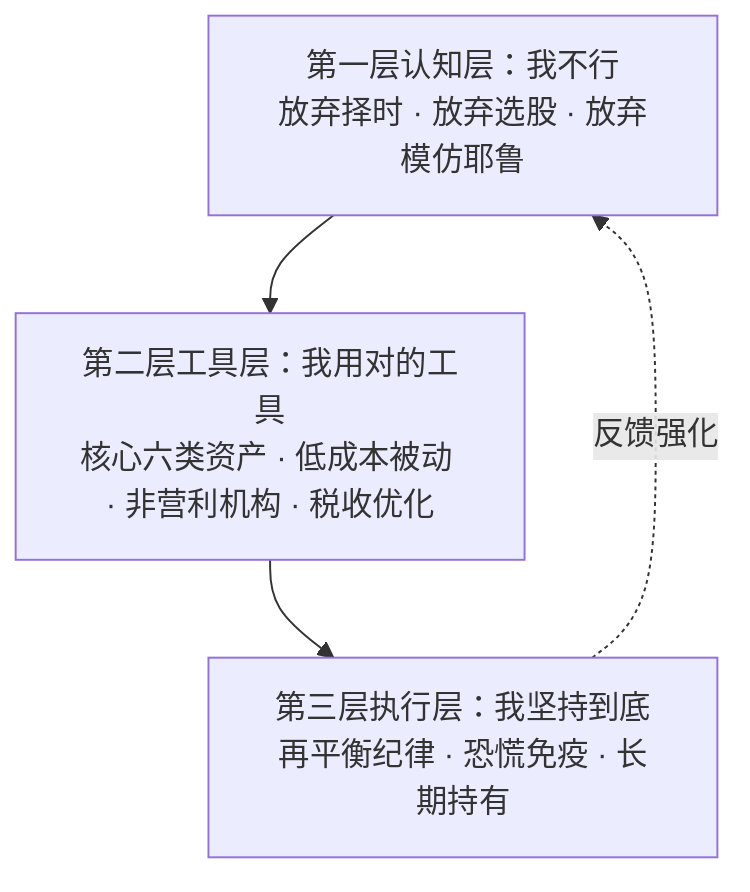

# 《非凡的成功：个人投资者的制胜之道》读书笔记（v2 重点拆解版）

> 作者：大卫·F·斯文森（David F. Swensen, 1954-2021）
> 耶鲁大学捐赠基金首席投资官（1985-2021），36年间将耶鲁基金从10亿美元增长到310亿美元
> 本书出版于2005年，中文版由中国人民大学出版社出版（2020年）

---

## 第一部分：总体归纳——全书20条核心原则速览

| # | 核心原则 | 所属章节 | ⭐ 重要性 |
|---|---------|---------|----------|
| 1 | **资产配置决定90%的投资结果**——择时和选股的贡献远小于资产配置，这是全书最根本的前提 | 第1章 | ⭐⭐⭐⭐⭐ |
| 2 | **以股票为导向**——长期投资者应将绝大部分资产配置于权益类资产，而非现金或固定收益 | 第1-2章 | ⭐⭐⭐⭐⭐ |
| 3 | **坚持充分多元化**——跨资产类别的分散是投资中唯一的"免费午餐" | 第1-3章 | ⭐⭐⭐⭐⭐ |
| 4 | **对税负高度敏感**——税收是个人投资者最大的隐性成本，应将税务效率纳入每一个投资决策 | 第1章 | ⭐⭐⭐⭐ |
| 5 | **六大核心资产类别**——国内股票(30%)、国外发达市场(15%)、新兴市场(5%)、REITs(20%)、国债(15%)、TIPS(15%) | 第2章 | ⭐⭐⭐⭐⭐ |
| 6 | **远离非核心资产类别**——公司债、高收益债、对冲基金、风投等对大多数个人投资者不适用 | 第4章 | ⭐⭐⭐⭐ |
| 7 | **核心资产必须依赖市场回报而非主动管理**——核心资产类别的收益来自市场贝塔，而非基金经理的阿尔法 | 第2章 | ⭐⭐⭐⭐ |
| 8 | **市场择时是失败者的游戏**——没有人能持续预测市场短期方向，包括专业投资者 | 第5章 | ⭐⭐⭐⭐⭐ |
| 9 | **业绩追逐是毁灭财富的最快方式**——追涨杀跌导致"高买低卖"，互联网泡沫是最惨痛的教训 | 第5章 | ⭐⭐⭐⭐⭐ |
| 10 | **定期再平衡是唯一有效的"择时"**——通过系统性地卖强买弱，再平衡既控制风险又可能增强收益 | 第6章 | ⭐⭐⭐⭐⭐ |
| 11 | **绝大多数主动管理基金跑输指数**——扣除费用后，主动基金长期绩效显著低于被动选择 | 第7章 | ⭐⭐⭐⭐⭐ |
| 12 | **费用是第一杀手**——1%的费用差在30年间可以侵蚀掉超过30%的终值财富 | 第8章 | ⭐⭐⭐⭐⭐ |
| 13 | **高换手率是隐形的财富毁灭者**——频繁交易产生佣金、冲击成本和税收三重损耗 | 第8章 | ⭐⭐⭐⭐ |
| 14 | **共同基金行业存在系统性利益冲突**——基金经理的利益与投资者利益常常背道而驰 | 第9章 | ⭐⭐⭐⭐⭐ |
| 15 | **"付费才能入围"侵蚀你的回报**——软美元、收益分享等安排将投资者利益输送给中介 | 第9章 | ⭐⭐⭐⭐ |
| 16 | **选择非营利机构管理的基金**——先锋集团（Vanguard）和TIAA-CREF是非营利模式的典范 | 第11章 | ⭐⭐⭐⭐⭐ |
| 17 | **ETF是好工具但需警惕**——核心资产类别的ETF是优秀工具，但结构不合理的ETF可能是陷阱 | 第10章 | ⭐⭐⭐⭐ |
| 18 | **投资期限决定风险承受能力**——年轻人可以承受更高风险，临近退休者需要更多固定收益 | 第3章 | ⭐⭐⭐⭐ |
| 19 | **"坚持到底的勇气"是被严重低估的品质**——在市场恐慌中坚守策略比任何聪明才智都重要 | 全书 | ⭐⭐⭐⭐⭐ |
| 20 | **个人投资者有机构投资者无法比拟的优势**——你可以长期持有，不惧怕短期业绩压力，这是你最大的不对称优势 | 全书 | ⭐⭐⭐⭐⭐ |

---

## 第二部分：逐章重点拆解与详细展开

---

### 前言与绪论：为什么这本书与众不同

**核心论点**：斯文森是"从市场赢家嘴里说出的'你不要尝试赢市场'"——一位36年年化收益超越市场指数的机构投资大师，告诉个人投资者：不要试图模仿耶鲁模式，你做不到，但你可以做另一件更简单的事。这本书不是教你"如何挑选好股票"，而是教你"如何不被华尔街收割"。

**重点一：斯文森的权威性来源于"赢家劝你不要学他"**

斯文森1985年接手耶鲁捐赠基金时规模仅约10亿美元，到他2021年去世时已超过310亿美元，年化收益率在全美大学捐赠基金中遥遥领先。他开创的"耶鲁模式"——重仓私募股权、风险投资、房地产、绝对收益等另类资产——被全球机构投资者奉为圭臬。但在这本书中，斯文森坦诚地告诉个人投资者：**耶鲁的模式你无法复制**。机构投资者拥有规模优势（可以投资门槛极高的顶级私募基金）、信息优势（能够获得一般投资者无法接触的管理人）、人才优势（一整支专业投资团队）、税收豁免（无需缴纳资本利得税）。个人投资者在这些维度上全面落后。强行模仿只会让华尔街的中间商赚走你大部分利润。如果你听到一个从未跑赢市场的人说"市场不可战胜"，这是酸葡萄；但你听到一个36年年化跑赢市场的人说"你战胜不了市场"，这是值得认真对待的。斯文森的权威性为全书奠定了"这不是一本普通投资书"的基调。

**重点二："赢家模式"与"个人模式"是两套完全不同的体系**

斯文森的核心洞察是：耶鲁模式的成功条件——接触顶级私募管理人、深度尽调、谈判有利条款、长期锁定期——对个人投资者几乎全部不可获得。你无法投资大卫·史文森自己管理的那类私募股权基金（它们有最低投资门槛且通常不向公众开放），你无法像耶鲁那样与对冲基金经理谈判费用结构，你也无法承受10年的资金锁定期。但这不意味着投降——恰恰相反，个人投资者可以构建一套完全不同的、同样可以"非凡成功"的体系：以六大核心资产类别为基础，通过非营利机构管理的低成本被动基金，构建充分多元化的投资组合，然后坚持到底。两套体系完全不对称：耶鲁靠的是**进（在另类资产中选出赢家）**，个人靠的是**退（放弃所有不必要的主动决策，让市场本身为你工作）**。这种"退的策略"恰恰是个人投资者最容易被忽视的优势——你不需要向任何人证明你"聪明"。

**重点三：本书的真正动力——斯文森的"愤怒"**

斯文森在序言中坦诚，驱动他写这本书的不是学术兴趣，而是愤怒——对共同基金行业系统性剥削个人投资者感到"愤怒"。他看到整个金融服务业的商业模式与客户利益背道而驰：基金公司在牛市顶峰推出新基金收割狂热资金，晨星评级引导投资者追逐近期表现（从而追逐高费用产品），经纪商从每一次客户交易中获利（因此鼓励频繁交易）。他将自己在耶鲁36年积累的投资智慧——关于资产配置、费用结构、行为陷阱——转化为普通人可以直接使用的方案。他说了一句本质的话："我不是在教你如何赢，而是在教你如何在华尔街已经设计好要让你输的游戏中不输。"

**重点四："被动"不是无能，而是一种高度理性的主动选择**

斯文森体系的精髓在于：主动放弃择时和选股这两项"看起来很高端"的活动，不是因为能力不足，而是因为证据表明这两项活动在扣除成本后是系统性的负期望值行为。这类似于职业扑克手选择不玩老虎机——不是"不会玩"，而是"算过期望值，不值得玩"。个人投资者最宝贵的资产是自己的时间、精力和情绪——把这些花在择时和选股上，不仅难以获得超额回报，还会损害你在最关键的时刻"坚持到底"的心理资源。

**关键洞察**：
1. 斯文森的立场让本书在浩如烟海的投资书籍中独一无二：一面是36年跑赢市场的真实战绩，一面是苦口婆心地劝你"别学我"。这种张力本身就是全书最有价值的"元信息"——如果连最成功的人都告诉你不要走他走过的路，你凭什么认为自己能走通？
2. "不要做什么"比"要做什么"更重要。全书本质上是一份"投资禁忌清单"——不择时、不选股、不追逐业绩、不买高费用基金、不忽略税收——遵守这些否定性规则带来的收益，远大于寻找任何"制胜法宝"。
3. 斯文森的"愤怒"是有生产力的愤怒。他没有停留在批判层面，而是提供了一套完整的替代方案。

**行动清单**：
- [ ] 反思：你目前有多少投资决策是"跟着别人做"的？有多少是经过独立思考的？列出你最近12个月内的所有交易
- [ ] 承诺：在读完这份笔记后，决定是否愿意接受斯文森的核心前提——"你不必、也不应该试图战胜市场"
- [ ] 检查你的投资账户中，有多少资产在主动管理基金中？考虑未来转向被动型产品的可能性

---

### 第1章 投资收益的来源

**核心论点**：投资收益来自三个主要决策——**资产配置、市场择时、证券选择**——而资产配置是其中唯一真正由你掌控的、贡献了绝大多数长期回报差异的因素。理解这三个来源的权重分配，是理解全书所有后续建议的前提。

**重点一：布林森研究的震撼发现——资产配置解释90%以上的回报差异**

斯文森引用了布林森（Brinson）、胡德（Hood）和比鲍尔（Beebower）在1986年发表的里程碑式研究，该研究分析了91只大型养老基金在1974-1983年间的季度回报数据。研究将被解释变量（基金的实际季度总回报）与四组解释变量进行回归：资产配置政策（各基金的目标配置比例）、市场择时、证券选择、以及三者交互。核心发现是：资产配置政策平均解释了**93.6%**的基金回报随时间的波动。斯文森特别强调这个数字的精确含义——它不是说资产配置决定了绝对收益水平的93.6%，而是说不同基金之间回报差异的93.6%可以归因于资产配置差异。比如基金A和基金B的10年回报差异，93.6%是因为A配置了60%股票而B配置了40%股票，而不是因为A的基金经理比B更聪明。这项研究的后续验证（包括1991年布林森等人的更新研究、2010年伊博森的研究）均支持这一基本结论，虽然后续研究将数字调整到约90%但核心信息不变。

**重点二：择时为什么在逻辑上就是"失败者的游戏"**

斯文森没有仅仅引用数据说"择时很难"，而是提供了严密的逻辑推导。成功的市场择时需要连续做对**两个**决定：何时卖出（离场）、何时买回（入场）。如果你在2008年10月恐慌中卖出（做对了第一个决定——躲过了最后的下跌），但如果你在2009年3月市场反弹时没有及时买回（做错了第二个决定），那就错过了历史性的上涨。斯文森用数据指出一个残酷的事实：在1980-2000年的20年间，如果你错过了表现最好的10个交易日（仅占全部交易日的0.2%），你的年化回报将从市场平均的约11%暴跌到约7%。而这10个表现最好的交易日，有6个发生在市场最恐慌的时期（1987年股灾后、1998年LTCM危机后、2000年互联网泡沫破裂初期）。择时者恰恰是在这些时期最可能"在场外"的人。此外，择时交易往往采用集中而非分散的头寸——当你基于一个判断大幅调仓时，你的投资组合就暴露于该判断可能错误的风险之中。

**重点三：主动选股是"负和游戏"——一个数学必然性**

斯文森在这个重点上展现了他作为耶鲁经济学博士的分析功底。他从市场的基本恒等式出发：在任何给定的时间点，所有投资者的持仓加起来等于整个市场。因此，所有主动投资者的总回报（费前）必然等于市场总回报。但是，主动投资者需要支付管理费、交易佣金、买卖价差和市场冲击成本——设总费用率为每年2%。那么，**所有主动投资者整体的费后净回报 = 市场回报 - 2%**。这是数学恒等式，不是经验发现。这意味着主动投资作为一个群体，是一个**负和游戏**——有人赢就必然有人输，而且输的总额大于赢的总额（差额等于费用）。斯文森特别指出，这种现象在市场效率越高的资产类别中越明显。美国大盘股的主动基金跑输指数的比例最高（因为市场最有效），而新兴市场或小盘股的主动基金跑输比例相对较低（因为有更多定价错误可以利用）——但这仍然不改变"整体负和"的数学本质。

**重点四：资产配置——个人投资者唯一真正掌控的变量**

在三项决策中，资产配置是个人投资者唯一完全掌控的。市场择时失败——你无法预测市场短期方向。选股失败——你无法从信息不对称中获利（华尔街的机构比你快得多）。但你的资产配置比例——你的投资组合中有百分之多少的股票、多少的债券、多少的房地产——是完全在你的控制范围内的。斯文森由此建立了"三层结构"：资产配置是**战略**（决定胜负的90%），择时和选股是**战术**（可以完全放弃的部分）。这一框架贯穿全书。他没有说"你应该努力提高择时和选股能力"，而是说"你应该接受自己在这两项上没有优势，然后集中所有精力在资产配置这个你真正能控制的事情上"。

**重点五：税收——被严重低估的第三个隐性回报来源**

斯文森在这一章中引入了一个常被忽视的维度：税收效率。他不是简单地说"税收很重要"，而是论证了税收在投资回报中的实际量级。假设市场年化税前回报为8%，一个普通投资者如果处于较高的税率等级，其利息收入可能面临30-40%的税率，短期资本利得面临相同的税率，只有长期资本利得（持有超过一年）享受15-20%的优惠税率。这意味着：一只年换手率100%的主动基金，其大部分回报以短期资本利得形式实现，税后可能只能保留6-7%的回报；而一只年换手率5%的指数基金，其大部分回报以长期资本利得形式实现，税后可能保留7-7.5%的回报。这个1-1.5个百分点的年化税后差距，在30年后会导致终值差异超过30%。斯文森的结论是：**税负效率应该成为你选择投资工具时的首要考量之一，与费用率同等重要。**

**关键洞察**：
1. "90%的回报差异来自资产配置"这个数字经常被误解为"资产配置能预测90%的绝对收益"——斯文森的精确解释纠正了这个流行误读，其实际含义是"不同投资者之间回报差异的90%可以归因于他们的资产配置不同"。
2. "负和游戏"不是一个修辞，而是一个逻辑必然。投资行业最成功的营销就是让你相信你可以成为那个"平均以上的主动投资者"，但数学决定了平均值就是市场减去费用。
3. 个人投资者最大的不对称优势在于：你可以完全放弃择时和选股这两项"期望值为负的活动"，而机构投资者因为职业压力不得不参与其中。

**行动清单**：
- [ ] 拿出一张纸，写下你目前在各类资产中的配置比例（股票%、债券%、现金%、其他%），看看你自己是否清楚这些数字
- [ ] 如果你发现自己不清楚资产配置比例，这本身就说明了问题——你很可能是在"随心所欲"地投资
- [ ] 设定一个目标：在未来1个月内确定自己的目标资产配置比例，并用书面形式记录下来

---

### 第2章 核心资产类别

**核心论点**：存在六种"核心资产类别"，它们共享三个基本特征——提供基本且不可替代的投资功能、主要依赖市场产生的收益（而非主动管理）、来自深度和流动性充足的可投资市场。这六种资产构成了个人投资者应该使用的全部工具箱，任何不能通过这三条测试的资产都不应被纳入组合。

**重点一：核心资产的三条遴选标准——一个强大的分析框架**

斯文森在进入具体资产类别之前，先建立了一个筛选框架。任何资产要被纳入"核心资产类别"必须满足三个条件：（1）**功能性**——该资产必须提供基本的、不可替代的投资功能。比如国债提供避险功能，股票提供增长功能，TIPS提供通胀保护功能。如果一种资产的功能与已有资产高度重叠，它就不是核心资产。（2）**市场驱动**——该资产的主要回报来源必须是市场本身的风险溢价（如股权溢价、期限溢价），而非基金经理的主动管理能力。斯文森的深层逻辑是：如果一种资产的回报高度依赖"选对人"，那它就不适合个人投资者——因为个人投资者无法接触到最顶级的管理人。（3）**深度可投资市场**——该资产必须在高度流动性、透明度良好的公开市场中交易，个人投资者可以通过低成本工具轻松获取。这三条标准合在一起，实际上把绝大多数"另类投资"排除在外了——而这正是斯文森的目的。

**重点二：国内股票（建议30%）——组合的增长引擎**

斯文森将国内股票定位为投资组合的"主引擎"。股票的长期回报来源是股权风险溢价——投资者承担了企业盈利的不确定性，因此要求高于无风险利率的额外补偿。从1926年到2004年，美国股票的年化回报约为10.4%（税前），远高于国债的约5.4%。这个约5%的差距就是股权风险溢价的历史兑现。斯文森特别强调"国内"一词——不是因为国内股票更好，而是因为这构成了投资者的"主场优势"：你的未来消费（退休支出、子女教育等）主要发生在本国经济体中，因此你的基础风险敞口应该与本国经济挂钩。30%的配置既足够高（让它真正发挥增长引擎的作用），又不过度高（避免了"本土偏好"——过度集中于本国市场的常见错误）。他还指出，国内股票应该通过**全市场指数基金**（如Wilshire 5000或Russell 3000指数基金）来获取，而不是通过主动管理基金。

**重点三：美国国债（建议15%）——危机时刻的终极避险资产**

斯文森对国债的定位非常精准：它不是用来赚钱的，而是用来"买保险"的。国债在经济危机和金融市场恐慌时期具有独特的避险功能——当股票暴跌时，投资者涌向最安全的资产，推动国债价格上涨。斯文森以1987年股灾和2001年9/11事件为例：在这两个极端事件中，国债都表现出了显著的逆周期特征。2008年金融危机是更近期的验证——当标普500指数在2008年下跌37%时，长期美国国债上涨了约25%。这个负相关性不是完美的（有些危机时期国债也下跌），但在最需要避险的时刻，国债是唯一可靠的对冲工具。斯文森特别指出：他推荐的是**美国国债**，而非公司债券——公司债券的信用风险在危机时期与股票高度相关，因此无法提供真正的避险功能。15%的配置是一个"足够但不浪费"的比例——足够在市场恐慌中提供有意义的缓冲，又不至于因为国债的长期低回报而过度拖累组合整体收益。

**重点四：通胀保值债券TIPS（建议15%）——抵御通胀的唯一无风险武器**

TIPS（Treasury Inflation-Protected Securities）是美国财政部发行的、本金随CPI自动调整的债券。斯文森认为TIPS是传统国债的必要补充，原因是一个简单的不对称性：国债在**通缩**环境中表现最优（因为固定的票息在物价下跌时实际购买力上升），而TIPS在**通胀**环境中提供保护（因为本金和票息随物价上涨而增加）。两者组合在一起，无论通胀走高还是走低，你的固定收益部分都有对应的保护。斯文森将国债和TIPS各配置15%，使固定收益总配置达到30%——这个比例对于大多数处于中年阶段的投资者是合理的平衡点。他特别指出，TIPS在2005年（本书出版时）的收益率约为2%的实际收益率，虽然在今天看起来不高，但TIPS的真实价值在于它消除了投资者在通胀方面的"尾部风险"——恶性通胀发生的概率很低，但一旦发生，像1970年代末那样CPI冲到13%以上，传统固定收益组合将遭受毁灭性的实际损失。

**重点五：REITs（建议20%）——全书最具争议但你最应该认真思考的配置**

20%的REITs配置是斯文森组合中最令人惊讶的部分——这个比例远超大多数传统资产配置建议。他的论证分为几个层次：（1）房地产是一种实物资产，其回报驱动因素与金融资产（股票和债券）不同。REITs的回报既像股票（长期增值潜力），又像债券（稳定的租金现金流）。（2）分散化价值——从1975年到2004年，REITs与标普500的月度相关性约为0.6，这意味着REITs约40%的波动与股票不重叠，真正提供了分散化价值。（3）历史回报并不逊色——在此期间，REITs的年化回报约为11%，与股票相当。斯文森为什么按20%的比例配置？因为他认为个人投资者在"实物资产"方面的暴露通常严重不足——大多数人只有一套自住房产，没有产生收入的商业地产敞口。REITs通过公开市场弥补了这一空白。但斯文森也提醒：REITs的波动性很高（有时甚至高于股票），而且在利率急剧上升的环境中可能遭受双重打击（融资成本上升+租金增长放缓）。

**关键洞察**：
1. 六种核心资产背后的"功能性思维"是全书最具原创性的贡献之一：每类资产都承担一个独特的功能（增长、避险、通胀保护、地域分散、实物资产），没有重复。如果你的组合中有两种资产高度相关，其中一种就可能是冗余的——精简资产类别本身就是提高组合效率的方法。
2. 斯文森只配置5%在新兴市场，尽管他充分承认其长期增长潜力——这反映了他对"高收益必然伴随高风险"的清醒认识。5%这个比例意味着：新兴市场即使腰斩，对组合整体的影响也仅2.5%。这是"用你能承受的损失去博取你能想象的收益"的完美示范。
3. "核心"的精髓在于：这些资产的长期收益来自系统性风险溢价，而非任何人的聪明才智。这意味着你可以用成本最低的工具（指数基金/ETF）获取它们——华尔街无法在这个环节收取"智商税"。

**行动清单**：
- [ ] 对照六类核心资产，检查你当前的组合是否覆盖了所有六类？哪些类别没有配置？哪些超配了？
- [ ] 特别注意REITs——大多数中国投资者的组合中完全没有REITs敞口，这可能是一个重要的空白
- [ ] 如果你在中国市场投资，思考如何将斯文森的六类框架"中国化"：A股→国内股票、国债→中国国债、中证REITs→房地产、港股/美股→国外发达市场

---

### 第3章 构建投资组合

**核心论点**：在确定了六种核心资产类别后，投资组合的构建是一门"科学与艺术的结合"——科学部分在于理解不同资产的风险-收益特征和相关性，艺术部分在于根据个人的投资期限、税务状况和风险承受能力进行调整。最好的投资组合不是你理论上最优的那个，而是你能坚持执行的那个。

**重点一：投资组合理论的科学内核——相关性是免费的午餐**

斯文森用通俗的语言解释了马科维茨现代投资组合理论的核心洞见：将相关性低于1的资产组合在一起，可以在不降低预期收益的前提下降低组合整体波动。他用六类资产的相关系数矩阵来展示：股票与国债的相关性约为0.1（某些时期甚至为负），REITs与股票的相关性约为0.6，新兴市场与发达市场的相关性约为0.7。这个结构意味着：当某个市场遭遇危机时，组合中的其他资产大概率不会同步下跌。数学上，两资产组合的标准差 = sqrt(w1²σ1² + w2²σ2² + 2w1w2ρσ1σ2)，当ρ（相关系数）小于1时，组合的标准差小于各资产标准差的加权平均。这就是"分散化的免费午餐"——你降低了风险，但没有牺牲预期收益。斯文森特别指出，这种分散化在大类资产层面（股票vs债券vs房地产）的效果远优于在单一资产类别内分散（比如持有50只不同的美国股票）。因为同一资产类别内的股票具有天然的高相关性，尤其在危机中相关性趋近于1。

**重点二：投资期限——决定股票配置比例的单一最重要因素**

斯文森围绕投资期限提出了一个简单但深刻的逻辑：当你距离退休超过10年时，市场崩溃是"机会"——因为你还有工资收入可以持续在低位买入，市场越跌你越应该高兴（你能以更低价格积累更多份额）。但当你距离退休只有2年时，市场崩溃是"灾难"——你没有时间等待市场恢复，而且你可能需要开始从投资组合中提款，此时在低位被迫卖出会锁定永久性损失。因此，资产配置不应该是一个"一成不变"的静态方案，而应该随着投资期限的缩短逐步降低权益配置比例。斯文森的建议框架是：年轻人（距离退休20年以上）可以配置80-90%权益类资产；中年人（距离退休10-20年）配置约70%权益类资产（他的基准组合就是这个范围）；临近退休者（距离退休5-10年）应该逐步降低到50-60%。他特别强调这不是"择时"——这是基于生命周期变化的、有计划的、渐进的调整。

**重点三：风险承受能力——被数量分析掩盖的人性真相**

斯文森在这个重点中揭示了一个被绝大多数投资模型忽略的因素：理论上的"最优配置"如果不能让你在市场暴跌时安睡，就不是你的最优配置。他诚实地指出，如果你在理论上应该配置80%股票，但每次市场跌10%你就夜不能寐、频繁查看账户、最后在底部恐慌卖出——那么你的"实际最优配置"可能就是50%股票。这不是数学问题，是人性问题。斯文森引用了行为金融学的研究：在决策实验室中，大多数人在面临亏损时表现出的痛苦感是同等收益带来的快乐感的两倍（损失厌恶系数约为2.0）。这意味着：如果你的组合波动性超出了你的心理承受能力，你几乎必然会在最糟糕的时刻做出最糟糕的决定。斯文森的建议是：如果你不确定自己的风险承受能力，就选择比你"认为"自己能承受的更低一档的波动。因为"低估自己的恐惧"是比"低估自己的贪婪"危险得多的错误。

**重点四：税收位置——把正确资产放在正确账户里**

斯文森引入了一个在中国市场较少被讨论但在美国市场至关重要的概念：资产的位置（asset location）与资产的配置（asset allocation）同等重要。不同的投资账户有不同的税收处理方式：401(k)和IRA等退休账户享受税收递延（投资期间的收益不交税，只在退休后提取时按普通收入征税），Roth IRA享受完全免税（提取时也不交税），而普通应税账户的所有收益在实现时都要缴税。斯文森的核心原则是：将**税收效率最低**的资产（高换手率的主动基金、REITs——它们的派息按普通收入税率征税、应税债券——利息收入按普通收入税率征税）放入税收优惠账户；将**税收效率最高**的资产（低换手率的指数基金、长期持有的个股——它们的收益主要是长期资本利得）放入应税账户。这个简单的"位置优化"操作，可以每年为投资者节省0.5-1%的税收拖累。

**关键洞察**：
1. "理论最优"与"可执行最优"之间的差距，是投资实践中最大的陷阱。斯文森用"风险承受能力"这个问题揭示了：投资成功的最重要因素不是智力，而是性格——特别是你在市场暴跌时能否保持冷静。这呼应了巴菲特的名言："投资不是智商160的人赢过智商130的人的游戏。"
2. 投资期限的分析框架应该激发一个重要的行为变化：年轻人应该"希望"市场下跌——因为在积累阶段，你能以更低价格买入更多资产。但社会舆论和媒体报道总是将市场下跌描述为"坏消息"——你需要克服这个叙事。
3. 税收位置优化是一个不需要承担任何额外风险的"免费阿尔法"——你只需要重新安排不同资产在不同账户中的分布，就能在不改变总配置比例的情况下提高税后回报。

**行动清单**：
- [ ] 诚实地评估自己的风险承受能力：如果明天市场跌30%，你会加仓还是斩仓？根据你自己的真实反应来调整权益配置比例
- [ ] 计算你距离退休或需要大规模提取投资资金还有多少年，写在你的投资计划中，并据此设置权益比例的下降路径
- [ ] 检查你的投资账户结构：税收优惠账户中持有哪些资产？应税账户中呢？有没有优化空间？

---

### 第4章 非核心资产类别

**核心论点**：大部分被市场推广的"另类投资"实际上对个人投资者是陷阱——它们要么缺乏核心资产的三个特征（依赖市场收益、深度市场、独特功能），要么高费用和低流动性压倒了任何理论上的多元化收益。斯文森特别强调：即使是耶鲁成功投资的资产类别（如对冲基金、风投），对个人投资者也未必适用——"你能买到的东西"≠"对你有益的东西"。

**重点一：公司债券——看似合理实则冗余的资产类别**

斯文森对公司债券的批判遵循一个简洁的逻辑链：公司债券由两部分组成——利率风险（与国债重叠）+ 信用风险（与股票重叠）。当经济向好时，公司债券的信用风险下降、价格上升——但这与股票上涨的方向一致，因此没有提供真正的分散化。当经济恶化时，信用风险飙升、公司债券价格下跌——此时你指望的"避险资产"与股票同步下跌，没有起到任何保护作用。2008年金融危机完美验证了这一点：投资级公司债券在2008年下跌约5-10%（尽管跌幅小于股票），而国债上涨了约20%。斯文森的结论是：在投资组合中，债券的唯一功能是提供与股票负相关的避险保护。因为这个任务只有国债能完成，所以公司债券没有存在的必要。你可能会问：公司债券的收益率高于国债，这额外的收益不是补偿吗？斯文森的回应是：这些额外收益的来源是信用风险——而你的组合中已经有股票在提供信用风险暴露了。多配置公司债券只是重复了已有的风险来源，并没有增加真正的多元化。

**重点二：高收益债券（垃圾债）——伪装成债券的股票**

斯文森对垃圾债的分析更加尖锐。高收益债券的信用评级低于投资级（BB或以下），因此提供更高的票息来补偿违约风险。但历史数据显示，高收益债券的回报特征与股票高度相似：在牛市中表现强劲（接近股票），在熊市中跌幅惨重（也接近股票）。更糟糕的是，高收益债券还有三个额外的劣势：（1）高费用——高收益债基金的管理费通常高于投资级债券基金；（2）低流动性——在危机时期，垃圾债市场经常出现流动性枯竭；（3）税收劣势——高收益债的利息收入按普通收入税率征税，而股票的资本利得可以递延到卖出时才纳税。如果一项资产的上涨空间像债券（票息有上限）、下跌风险像股票（违约时可能血本无归）、费用比股票高、税收效率比股票差——那么它就没有任何理由出现在理性投资者的组合中。

**重点三：对冲基金——"你能买到的"和"斯文森投资的"是完全不同的产品**

斯文森在这个重点中展现了他作为"圈内人"的坦诚。耶鲁捐赠基金是对冲基金的大投资者，但斯文森明确指出：耶鲁投资的对冲基金与普通投资者能买到的对冲基金产品是两件完全不同的事。区别包括：（1）**门槛**——耶鲁能够接触到顶级管理人，这些管理人通常不接受新资金或要求1亿美元以上的最低投资；（2）**费用谈判**——耶鲁可以谈判降低"2+20"的费率结构（2%管理费+20%超额收益分成），而个人投资者只能接受标准费率；（3）**透明度**——耶鲁可以要求管理人提供详细的持仓和风险信息，个人投资者只能拿到季度报告；（4）**生存偏差**——对冲基金行业的数据严重美化，因为表现差的基金已经清盘并从数据库中消失。斯文森引用研究表明，加入生存偏差调整后，对冲基金行业的整体表现显著降低。在扣除费用和生存偏差后，普通投资者能获得的对冲基金净回报并不优于简单的股债组合。此外，斯文森还指出了对冲基金的税收效率极低：大多数对冲基金的策略产生的是短期资本利得（高税率），而且投资者无法控制基金的实现时机。

**重点四：风险投资与杠杆收购——顶部集中效应瓦解了"平均"概念**

斯文森对另类投资中最"明星"的两个类别——风险投资（VC）和杠杆收购（LBO）——进行了冷静的解剖。风投行业的核心问题是回报的极端集中：约80%的行业总回报集中在顶部10%的基金中。这意味着如果你买不到那10%（而普通投资者几乎必然买不到），你获得的将是行业后90%的平庸回报——在扣除费用后很可能低于公开市场指数。杠杆收购面临类似的问题：只有少数顶级管理人（如KKR、Blackstone的早期基金）表现出众，行业整体的费后净回报并不优于对标指数。斯文森特别指出，这两个类别还有一个共同的陷阱：**J曲线效应**——基金在最初几年通常报告负回报（因为管理费从第一天开始计收而投资尚未产生收益），普通投资者可能在看到连续12个月的账面亏损后恐慌赎回，从而毁灭了长期持有才能实现的潜在收益。对于这些资产类别，斯文森的最终建议是简单直接的：**对于绝大多数个人投资者，不要碰。**

**重点五：非核心资产的统一否决逻辑——"可获得性≠有益性"**

斯文森将所有对非核心资产的批判收敛到一个统一的框架：**"你可以获得的"≠"对你有益的"**。对冲基金作为一个资产类别可能具有投资价值（耶鲁就大量配置），但个人投资者能买到的对冲基金产品在费用、透明度、管理人质量、流动性等方面与耶鲁投资的产品不可同日而语。这个"可获得性偏差"是市场上最危险的错觉之一——金融服务业的商业模式恰恰建立在让你混淆这两个概念的基础上。他们不断推出"机构级""专业投资者专属"的产品，让你感觉自己在做"耶鲁也在做的事"。斯文森的回应是：如果你没有耶鲁的条件（规模、团队、税收豁免、顶级管理人网络），就不要做耶鲁做的事。你需要的是耶鲁投资哲学中那些**不依赖特殊条件**的部分——即资产配置、分散化、低成本和长期纪律。

**关键洞察**：
1. 斯文森对非核心资产的否决框架（"功能性+市场驱动+深度市场"三重测试）是一个极其强大的投资决策工具——你可以用它来评估任何你未来可能遇到的"热门投资机会"。
2. 公司债券被否决的原因是"双重暴露"——它的风险来源与现有资产重叠，因此不能增加真正的分散化。这个逻辑的美妙之处在于它不依赖任何估值判断，纯粹从组合构建的视角出发。
3. 对风投和杠杆收购的批判——特别是斯文森作为这两个领域最成功的机构投资者之一的身份——再次印证了他的核心立场："耶鲁的做法不适用于你。"这比任何来自学界的批评都更有分量。

**行动清单**：
- [ ] 检查你的投资组合中是否有公司债券基金、高收益债基金或其他非核心资产类别？思考它们在你的组合中扮演的真正角色是什么
- [ ] 特别是，如果你持有对冲基金或私募股权产品，查阅其费用结构和实际净回报，并与简单的指数基金对比
- [ ] 建立一条简单的"核心资产测试"：任何你考虑投资的资产，问自己三个问题——它的收益主要来自市场还是管理人的技能？它是否在深度可投资市场中交易？它是否提供了你现有资产无法提供的独特功能？

---

### 第5章 业绩追逐

**核心论点**：追逐近期业绩表现最好的基金或资产类别，是人类投资行为中最普遍、最具破坏性的错误——它系统性地导致"高买低卖"，其造成的财富损失甚至超过高额管理费。斯文森不仅揭示了这个问题，还深入分析了整个金融服务业的商业模式是如何系统性地"制造和满足"业绩追逐需求的。

**重点一：互联网泡沫——业绩追逐的终极案例研究**

斯文森将1995-2000年的互联网泡沫作为全章的核心案例。1995-1999年间，纳斯达克指数从约750点飙升至超过5000点，年化涨幅超过40%。在此期间，资金以史无前例的速度涌入科技类共同基金：仅1999年第四季度（泡沫爆破前的最后三个月），美国股票共同基金净流入超过750亿美元——其中大部分流向了科技和成长型基金。然后在2000年3月，纳斯达克开始崩塌。到2002年10月，指数跌至约1100点——从高点暴跌了78%。那些在1999年底和2000年初最高峰涌入的投资者，锁定了最惨痛的损失。斯文森特别引用了美林证券的"互联网战略投资基金"——该基金在2000年3月成立（精确地说是在互联网泡沫的绝对顶峰），由顶级分析师管理，不到两年时间净值下跌超过90%，投资者几乎血本无归。这个案例的每一个细节都指向同一个结论：**业绩追逐不是投资者的"小错误"，而是系统性的财富毁灭机制。**

**重点二：资金加权回报 vs 时间加权回报——测量"投资者实际损失"的标尺**

斯文森引入了一个关键的测量工具。时间加权回报（基金经理通常报告的）衡量的是基金在任何既定时间段内的表现，假设投资者在期初投入、持有一整段时间。资金加权回报（投资者的实际体验）考虑的是投资者资金流入和流出的时机。两者的差距反映了投资者因为在不当时机买进卖出所造成的损失。斯文森引用Morningstar的研究数据：在1990年代，美国股票共同基金的时间加权年化回报约为12-13%，但投资者的资金加权年化回报只有约7-8%——差距约为每年5个百分点。这个5%就是业绩追逐的"行为税"。在某些极端类别（如科技基金），差距甚至更大：基金本身的10年年化回报可能是正的（因为有一些幸存者），但考虑了投资者进出后，加权回报可以是负的。斯文森说了一句令人警醒的话："基金赚了钱，但基金的投资者没赚到钱。"这在逻辑上是可能的，而且经常发生——基金在规模小的时候表现好（早期投资者赚了），在规模膨胀后表现差（后期涌入的投资者亏了），由于后期涌入的资金量远大于早期资金量，加权结果是亏损的。

**重点三：整个行业合谋制造"业绩追逐陷阱"**

斯文森没有止步于批评投资者的非理性，而是将矛头指向了整个金融服务业的结构性激励。他分析了三个主要机制：（1）**广告投放的时机设计**——基金公司总是在业绩最好的时候投放最多广告，而展示的业绩往往是无法持续的。SEC规定广告必须标注"过去业绩不代表未来"，但这句话在巨大的回报数字旁边显得微不足道。（2）**晨星评级体系的内在缺陷**——基于近期历史表现的1-5星评级，吸引了大量资金流入4-5星基金。但大量研究表明，晨星评级对未来表现的预测能力几乎为零——昨天五星的基金今天可能是一星。晨星的商业模式恰恰依赖于投资者不断寻找"下一个五星基金"，因此它在结构上鼓励了业绩追逐。（3）**经纪商和理财顾问的推荐**——牛市期间的"买入建议"总是远多于熊市期间的，因为推荐"正在涨的"比推荐"正在跌的"更容易让客户感到满意。这些机制环环相扣：基金公司制造迷人的回报故事，评级机构将其量化为星级，经纪人将其转化为对客户的推荐——每个环节都符合参与者的商业利益，唯独不符合投资者的利益。

**重点四：为什么"均值回归"是业绩追逐者的死敌**

斯文森引入均值回归的概念来解释为什么业绩追逐注定失败。在投资领域，表现极端的资产类别或基金在统计上倾向于向平均值回归——不是因为某种神秘的力量，而是因为高回报吸引更多资金追逐同样的机会（推高价格、降低未来回报），而低回报导致资金撤离（压低价格、提高未来回报）。斯文森引用研究数据：在1982-1990年间表现最好的前25%基金，在1990-1998年间排名滑落到后50%的比例超过60%。但投资者的行为模式是：在基金表现最好的时候（已经涨了很多，均值回归意味着未来表现可能低于平均）大举买入，在基金表现最差的时候（已经跌了很多，均值回归意味着未来表现可能高于平均）恐慌卖出。这就是"高买低卖"的结构化版本——不是因为投资者愚蠢，而是因为他们的行为模式（追逐近期表现）与市场规律（均值回归）是直接对立的。

**重点五：如何免疫——建立"业绩追逐防火墙"**

斯文森在揭示了问题之后，提供了一套具体的免疫策略：（1）**信息过滤**——主动屏蔽那些频繁推送"热门基金"和"近期回报排行榜"的信息源。斯文森的建议近乎极端：少看财经新闻是保护财富最有效的方式之一。（2）**决策延迟**——当你看到一只"过去12个月上涨50%"的基金而心动时，强制自己等待30天再决定是否投资。30天后，那种"FOMO（错失恐惧）"通常会消退。（3）**事前承诺**——写下一份"投资政策声明"，明确规定自己的资产配置目标、可接受的偏差范围、以及明确的"永远不做什么"（如：永远不因为某只基金过去一年的表现好而买入）。在冷静时写下的规则，可以帮助你抵抗狂热时的冲动。（4）**关注自己**——定期检查自己的投资组合，但不看"市场新闻"。用你的目标配置来驱动你的决策，而不是用市场动向来驱动。

**关键洞察**：
1. 业绩追逐的核心悖论：**正因为有足够多的人在做这件事，它才注定失败**。如果只有少数人追逐业绩，他们可能还能获利；但当大多数人都在追逐业绩时，追逐行为本身就创造了一个拥挤的交易——先到者卖出获利，后到者接盘亏损。
2. "资金加权回报低于时间加权回报"这个现象不仅仅是学术数据——它是你实际财富损失的数量化测量。每当你看到一只基金的"过去5年年化回报15%"，你可以确信：实际在这只基金中投资的人，获得的回报远低于15%。
3. 斯文森的免疫策略中最反直觉的可能是"少看财经新闻"——在一个信息爆炸的时代，主动选择"不知情"反而可能提高你的投资回报。因为财经新闻关注的是"现在发生什么"，而好的投资关注的是"长期应该配置什么"。

**行动清单**：
- [ ] 回顾你自己过去5年的投资决策：你有多少次是因为"最近涨得好"而买入的？有多少次是因为"最近跌得多"而卖出的？
- [ ] 取消关注那些频繁推送"热门基金""强力推荐"的金融信息源。少看财经新闻是保护财富最有效的方式之一
- [ ] 写下你的"投资政策声明"——至少包括目标资产配置、再平衡规则、以及明确的"永远不做什么"

---

### 第6章 组合再平衡

**核心论点**：再平衡是个人投资者唯一的、合法的、可能有效的"市场择时"——它不是基于对市场方向的预测，而是基于维持目标风险暴露的纪律性操作。在动荡市场中，再平衡既控制风险又可能创造额外收益，但它持续要求你在感觉"最不应该"的时候做"最不舒服"的事，因此绝大多数人做不到。

**重点一：再平衡的本质——规则驱动的逆向操作**

斯文森首先精确定义了再平衡的操作逻辑：当某类资产因相对表现优异而超出目标配置时，卖出超出部分并买入表现落后的资产，将组合恢复到目标权重。比如你的目标是股票70%/债券30%，如果股票涨了30%而债券持平，组合变成了股票74%/债券26%——你卖出4%的股票，买入4%的债券，恢复70/30。这个操作在牛市时看起来"愚蠢"——你正在卖掉表现最好的资产（"为什么卖掉赢家？"），在熊市时看起来"疯狂"——你正在买入表现最差的资产（"为什么把钱扔进火坑？"）。但斯文森强调，再平衡不是基于"你认为股票要跌了"或"你认为债券要涨了"，而是基于一个简单的规则：你的组合偏离了目标。这个区别至关重要——它意味着再平衡不需要任何预测能力，它只是一个执行纪律。斯文森说了一句经典的话：**"再平衡是因为你的组合需要它，不是因为市场需要它。"**

**重点二：1987年股灾——再平衡的历史验证**

斯文森用1987年10月19日的"黑色星期一"来展示再平衡的力量。当天道琼斯指数暴跌22.6%，这是历史上最大的单日跌幅。市场上弥漫着恐慌：有人预测1929年式的大萧条即将重演，有人喊出"现金为王"。但一个坚持再平衡纪律的投资者会做什么？他在暴跌前一天的目标配置是60/40，在暴跌后变成了约50/50——因为股票价值大幅缩水。再平衡的规则告诉他：卖掉债券，买入股票，恢复到60/40。在所有人都恐惧的时候，这个投资者"被迫"逆向操作。随后的两年间，市场从1987年的低点强劲反弹——到1989年，道琼斯已经收复了所有损失并创出新高。那些在恐慌中坚持再平衡的投资者，不仅控制住了风险（没有在底部卖出），实际上还"被动地"进行了低买——他们买入股票的价格正好是市场最悲观的时刻。但斯文森诚实地说：这不是因为他们预测到了反弹，而仅仅是因为他们遵循了一个规则。

**重点三：互联网泡沫——再平衡的"反向验证"**

1995-1999年间的互联网泡沫提供了一个检验再平衡价值的"逆向案例"。在这五年间，股票每年大幅跑赢债券，如果严格执行再平衡，你每年都要卖出股票（表现好的）买入债券（表现差的）。在泡沫最狂热的阶段（1998-1999年），这个操作看起来愚蠢透顶——你不断地把资金从年化回报40%+的资产中抽走，投入到年化回报5%的资产中。你的朋友会嘲笑你，你的配偶会质疑你，你自己的内心也会动摇。但到2000-2002年泡沫破裂时，这些看似"愚蠢"的再平衡操作变成了"智慧"——你之前卖出股票锁定了泡沫期间的部分收益，增持的债券在市场崩盘时提供了保护。斯文森指出：这是再平衡最反直觉也最重要的性质——**它在短期内看起来总是错误的**。正因为它在每一个短期看起来都是错的（你在牛市中卖赢家、在熊市中买输家），所以绝大多数人做不到——而这恰恰说明它可能有效。

**重点四：再平衡的频率与触发机制——在纪律和成本之间找平衡**

斯文森讨论了再平衡的实操问题。年度再平衡是一个合理的起点——每年在同一天（斯文森建议选择对你个人有意义的日子，如生日或元旦）检查一次组合，将权重调整回目标。但仅靠年度再平衡可能不够——如果市场在一年内经历了剧烈波动，你的组合可能在大部分时间内处于偏离目标的状态。因此斯文森建议使用**触发带机制**：当任何资产的权重偏离目标超过5个百分点时，执行一次再平衡。例如，目标配置为股票30%，如果股票涨到36%（偏离6个百分点），就触发再平衡。这个机制比纯粹的年度再平衡更灵敏，但也需要更多的纪律——因为它要求你在看到市场异常波动时主动采取行动。斯文森警告不要过于频繁地再平衡（如月度或季度）——因为过高的频率产生了过高的交易成本（佣金、买卖价差、税收），可能超过再平衡带来的好处。

**重点五：再平衡不承诺超额收益——它的首要价值是风险控制**

斯文森在这个重点上展现了他一贯的学术诚实。他没有像某些投资作家那样承诺"再平衡一定能增强收益"，而是坦诚地说：**再平衡的主要功能是控制风险**。在牛市中不断卖出股票买入债券，你的组合收益可能低于你"什么也不做"时的收益（因为股票回报高于债券）。但从风险管理的角度看，你在"什么也不做"时的组合风险在不断上升（因为股票权重越来越大），而你在最脆弱的时候（市场顶部）恰恰承担了最高的风险。斯文森引用耶鲁基金的内部研究：再平衡在历史上确实为耶鲁贡献了可观的额外回报（尤其是在1987年股灾和2008年金融危机这样的大起大落环境中），但这种额外回报是"副产品"，不是主要目标。主要目标是确保你的投资组合永远停留在你选择的风险水平上——不太高（不会在市场下跌时超出你的承受能力）、也不太低（不会在市场上涨时错过太多机会）。

**关键洞察**：
1. 再平衡最反直觉的性质——"在短期内总是看起来错误"——是它最强大的护城河。正因为它持续让你"不舒服"、让你"看起来无能"、让你被"懂行的朋友笑话"，所以绝大多数人做不到。而你只需要做到"按规则执行"这一件事，就已经超过了绝大多数人。
2. "触发带"机制的价值在于，它把决策从"我是否应该……"转变为"规则是否触发……"——这个微妙的变化消除了决策中最具破坏性的成分：情绪。
3. 在市场的极端时刻，有一张"再平衡规则表"可以替代你的判断力——你不需要决定"现在是恐惧还是贪婪"，你只需要问"我的资产配置偏离目标了吗？"这比任何市场预测都有用。

**行动清单**：
- [ ] 在你的日历上设置一个每年同一天的提醒（如生日或元旦），标记为"投资组合年度再平衡日"
- [ ] 确定一个"再平衡触发带"：例如当任何资产偏离目标配置5个百分点以上时，执行一次再平衡
- [ ] 准备一个"再平衡勇气备忘录"：提前写下"当市场暴跌30%时，我应该卖掉债券买入股票以恢复目标配置"——在你恐慌的时候重新阅读

---

### 第7章 营利性共同基金的业绩亏损

**核心论点**：营利性共同基金行业作为一个整体，在扣除费用和税收影响后，长期表现显著落后于被动的市场指数——这不是偶然的，而是**结构性必然的**，因为费用和交易成本使主动管理成为一个"负和游戏"。斯文森用理论推导和大量实证数据证明：你选择被动投资的理由，不是"主动投资偶尔会失败"，而是"主动投资整体上注定失败"。

**重点一：负和游戏的数学必然性——超越实证数据的逻辑证明**

斯文森在这个重点上展现了全书最具哲学深度的论证。他从市场的基本恒等式出发：在任何给定时刻，所有投资者的持仓总和等于整个市场。因此：**所有主动投资者的总回报（费前）= 市场总回报**。现在引入费用——假设所有主动投资者的费用总和为市场总规模的2%。那么：**所有主动投资者整体的费后净回报 = 市场总回报 - 2%**。同时，被动投资者的总回报 = 市场总回报 - 被动费用（假设为0.1%）。因此：**被动投资者的平均回报 - 主动投资者的平均回报 = 2% - 0.1% = 1.9%**。这不是一个经验观察（"过去数据显示……"），而是一个数学定理。无论市场多么无效，无论有多少错误定价可以被利用，无论基金经理多么聪明——只要总费用大于零，主动投资整体必然跑输被动投资。唯一可能改变这个结论的情况是：主动投资者在平均意义上"选错了股票"（跑输了市场），而被动投资者在平均意义上"选对了"——但这在定义上不可能，因为被动投资者持有的就是市场本身。斯文森说了一句意味深长的话："在主动管理中获胜的唯一方法是找到那些会输的人——而你必须确保自己不在那群输家之中。"

**重点二：实证数据的全面印证——60-80%的主动基金跑输指数**

斯文森引用大量研究来佐证这一逻辑推导。Morningstar的数据显示：在不同的时间区间内（5年、10年、15年），60-80%的主动管理共同基金跑输了其对应的基准指数。这个比例随着时间拉长而上升——15年期的跑输比例高于5年期——因为费用的复利效应在更长的时间维度上更加显著。斯文森特别指出，不同资产类别的跑输比例不同：美国大盘股基金的跑输比例最高（因为美国大盘股市场效率极高，几乎没有定价错误可供利用），新兴市场和小盘股基金的跑输比例相对较低（市场效率较低，有更多的错误定价空间）——但即使在效率最低的市场中，仍有超过一半的主动基金在长期跑输。此外，斯文森引用了标普（S&P）的SPIVA（S&P Indices Versus Active）记分卡——这是最权威的主动vs被动比较研究之一——该研究年复一年地证实同一结论。

**重点三：幸存者偏差——让历史数据看起来比实际更好的隐形美化**

斯文森揭露了一个在研究主动基金表现时最容易被忽视的陷阱。当你在Morningstar数据库中查看"过去10年有多少主动基金跑赢指数"时，你看到的只是**活下来的基金**。在任何一个10年窗口中，通常有20-30%的基金因为表现不佳而被清盘或合并到其他基金中。这些"死去"的基金几乎全是表现最差的。如果把它们放回数据中，主动基金的整体表现会更加惨淡——跑输比例可能从60-80%上升到70-85%。斯文森举了一个生动的例子：1998年时存在的美国大盘股主动基金约有1000只，到2008年只有约700只还在运营。那消失的300只基金的投资者所经历的亏损被永久性地从数据库中删除了。当基金公司宣传"过去10年我们有65%的基金跑赢同类平均"时，他们正在利用幸存者偏差——他们对比的是活下来的基金，而不是最初存在的所有基金。

**重点四：税后回报——主动管理的最大隐性劣势**

斯文森强调，大多数基金业绩数据展示的是税前回报，但对于应税账户中的个人投资者来说，税后净回报才是真正进入口袋的钱。主动基金在税收方面的劣势来自三个层面：（1）**高换手率产生短期资本利得**——主动基金年均换手率约80-100%，这意味着大部分持仓在一年内买入和卖出，产生的利润被归类为短期资本利得，按普通收入税率（可能高达35-40%）征税。相比之下，指数基金的年均换手率通常只有5-10%，大部分持仓长期持有，实现的利润按长期资本利得税率（15-20%）征税。（2）**无法控制实现时机**——当主动基金经理决定卖出一只获利的股票时，所有基金持有人都被迫确认这笔应税收益，无论他们个人是否愿意。而在指数基金中，只有被剔除出指数的股票才会被卖出。（3）**嵌入式资本利得**——买入一只现存的主动基金意味着你也"继承"了该基金过去积累的未实现资本利得——这些利得在未来实现时，你将为基金在你买入之前就已经获得的收益缴税。斯文森估算，在不考虑税收时主动基金可能年均跑输1-2个百分点，但在考虑税收后这个差距扩大到2-3个百分点。

**重点五：为什么"少数赢家"不能成为你选择主动管理的理由**

面对"虽然大多数主动基金跑输，但也有一些跑赢了"这个反驳，斯文森提供了两个层面的回应。（1）**幸存者偏差和回填偏差**使"跑赢的基金"列表看起来比实际更可识别。晨星的五星评级对未来表现的预测能力接近零——1999年被评为五星的基金中，到2004年仍有超过70%跌至三星或以下。（2）更重要的是，**即使你能预测哪些基金会跑赢**（你不能），也不意味着你应该投资它们——因为超额回报的分配也是顶部集中的。在一组跑赢的基金中，少数几只贡献了大部分超额回报，而大多数跑赢基金的"超额"可能仅勉强覆盖费用。这意味着你不仅要选对"会跑赢"的基金，还要选对"会大幅跑赢"的基金——这相当于在赌场里不仅要赢，还要用特定号码赢。斯文森的结论是：考虑到实际困难，对于绝大多数个人投资者来说，选择被动工具不是"退而求其次"，而是理性最优解。

**关键洞察**：
1. "负和游戏"不是一个修辞，而是一个数学定理。无论你多么聪明、多么勤奋、看了多少研究报告，你都无法改变这个数学事实：主动投资者整体必然跑输被动投资者。你唯一能做的就是决定自己站在等式的哪一边。
2. 幸存者偏差是理解主动基金数据时最大的认知陷阱。你看到的"过去10年65%跑输"实际上是美化后的版本——真实数字可能是75-80%。这也意味着：基金公司展示的任何历史业绩数据都应该被视为有一个"隐形折扣"。
3. 斯文森对税收的强调填补了大多数投资书籍的空白——税前回报是"橱窗里的模特"，税后回报才是"穿在你身上的衣服"。两者之间的差距可能在30年间吞噬掉你三分之一以上的终值财富。

**行动清单**：
- [ ] 检查你的所有基金的"费后"业绩，而不是基金公司展示的"费前"业绩。如果一只基金过去5年的费后年化回报跑输指数2个百分点，你每年都在给华尔街白白送钱
- [ ] 下次看到基金广告时，问自己：这只基金活下来了吗？它的费后回报是多少？税后呢？如果这些数据不在广告中，你已经在被营销了
- [ ] 计算你当前的"加权总费用率"：将所有基金的管理费率、托管费、销售费等加总，看看你每年在给基金行业交多少钱

---

### 第8章 共同基金失败的外在原因

**核心论点**：共同基金表现不佳的两大直接原因——过高的管理费和过度的投资组合换手率——是公开可见的"显性成本"，但大多数投资者不知道它们有多大的杀伤力，或者虽然知道但严重低估了复利效应下的长期侵蚀。斯文森通过严密的复利计算展示了：看起来微不足道的费率差异，在长期可以吞噬掉惊人比例的财富终值。

**重点一：管理费的复利噩梦——1%如何变成43%的财富蒸发**

斯文森用一个简单而震撼的复利计算来揭示管理费的真实杀伤力。假设市场年化回报为8%，费用率为2%（主动基金的典型总费率）。期初投资1万元，30年后的终值对比：
- 无费用（市场回报）：10,000 × (1.08)^30 = 100,627元
- 扣除2%费用后（6%净回报）：10,000 × (1.06)^30 = 57,435元
- **差额：43,192元——2%的年费吞噬了43%的终值财富。**
如果费用率降低到0.2%（典型指数基金），终值为10,000 × (1.078)^30 = 94,866元，差异仅为5,761元（5.7%）。这个计算揭示了费用率的非线性效应——2%和0.2%看起来只差1.8个百分点，但在30年的复利作用下，它对终值的影响是43% vs 5.7%。斯文森进一步做了一个心理实验：如果有人在你的投资账户中每年拿走你资产的2%，你一定会感到愤怒；但共同基金行业每年从你的回报中拿走2%，投资者却普遍对此无感。原因是费用的"隐性"——它不是以账单的形式寄给你，而是直接从基金净值中扣除。

**重点二：换手率的隐性成本——三重叠加的财富减速器**

斯文森将换手率称为"隐形的财富毁灭者"，因为它的成本不像管理费那样以单一数字呈现在基金招募说明书中。每一次买卖操作产生三项成本：（1）**经纪佣金**——显性但相对较小，主动基金的年佣金成本约为0.1-0.3%；（2）**买卖价差和市场冲击**——隐性的主要成本。当基金经理买入一只股票时，他的买入行为本身推高了价格（市场冲击）；卖出时推低了价格。此外，每次交易都需要跨越买卖价差（bid-ask spread）。研究估算，对于一只换手率100%的基金，价差和冲击成本合计约为每年0.5-0.8%；（3）**税收效应**——高换手率意味着大部分资本利得在一年内实现，按短期资本利得的高税率征税。斯文森引用了一项综合估算：将管理费和换手税加在一起，主动基金的年化总成本约为3.0-3.5%（1.5%管理费 + 1.0%换手税 + 1.0%税收劣势）。要弥补这个差距，基金经理需要在费前每年跑赢市场3.0-3.5个百分点——这是几乎不可能持续完成的任务。而指数基金的总成本约为0.2-0.5%。

**重点三：前端和后端销售费——进入和退出都要被"剥一层皮"**

斯文森特别批判了共同基金的销售佣金结构。A类份额收取**前端费**——你在买入时就被扣掉4-5%。这意味着如果你投资1万元，只有9,500元真正进入市场为你工作。C类份额没有前端费但收取更高的年度**12b-1费用**（一种从基金资产中支付的营销费用，通常为0.25-1.0%）。B类份额有**后端费**（递延销售费）——你在卖出时被收取费用，费率随持有时间递减（如第一年5%、第二年4%……第六年0%）。斯文森的批判切入点是：所有这些销售佣金结构都是为了**激励销售**设计的，而不是为了**优化投资者回报**设计的。前端费用让经纪人有动力把基金"卖"给你，12b-1费用让基金公司有持续的资金做广告来吸引更多投资者——这些费用与基金的业绩没有任何关系，但直接从你的口袋里掏钱。

**重点四：基金经理激励结构的根本性错位**

斯文森指出了主动基金行业一个被严重忽视的不对称性：**基金经理的报酬由资产管理规模驱动，而你的回报由投资表现驱动**。一只管理100亿资产的基金，即使每年跑输市场1%，基金经理仍然赚取1.5亿的管理费收入（资产规模的1.5%）。基金经理的商业目标不是创造优异的投资回报，而是积累资产规模——因为规模直接等于收入。这导致了一系列扭曲的行为：在牛市高峰期狂热地推出新基金（因为此时投资者情绪亢奋、最容易吸引资金）；在基金规模已经过大时仍然接受新资金（因为更多规模等于更多收入，即使规模已经损害了基金获取超额回报的能力）；在熊市中关闭表现不佳的基金以"清洗"历史业绩记录（然后推出新基金重新开始）。斯文森总结道：当你把钱交给主动基金经理时，你不是在购买一项投资服务——你是在进入一段**你的利益与他的利益结构性冲突**的商业关系。

**重点五：如何在现实中计算你的"真实总费用"**

斯文森为读者提供了一个实操框架：如何自己动手计算你正在支付的"真实总费用"。步骤包括：（1）查阅基金招募说明书中的**总费用率**（Expense Ratio），包括管理费、12b-1费、托管费等所有从基金资产中扣除的费用；（2）如果购买的是有销售费的份额，将前端费按持有时间年化——例如一笔5%的前端费，如果你持有5年，等效年化成本约为1%；（3）查阅基金年报中的**换手率**，乘以一个估算系数（通常0.3-0.5%乘以换手率），得到换手隐性成本的估算；（4）如果你的基金在应税账户中，估算税后损失——将基金的历史回报与同类指数基金的税后回报对比。将这四个数字加总，你得到的就是你的"真实年化成本"。斯文森断言：大多数主动基金投资者在完成这个计算之后，会惊讶地发现自己的真实成本在3-4%的范围内——这意味着基金经理每年需要跑赢市场3-4个百分点才值得你持有。而这样的基金经理不存在于现实世界中（至少不在你可以购买的产品中）。

**关键洞察**：
1. "1%不重要"是投资中最昂贵的谬论。30年间，2%的费用吞噬43%的终值财富——这个数字不是夸张的修辞，而是复利数学的冷酷结果。更残酷的是，费用是确定的（每年必扣），而回报是不确定的（有时正有时负）。
2. 基金经理的商业模式是"积累资产规模"，不是"创造超额回报"。当你的利益与你的服务提供商的利益结构性冲突时，你需要的不是更好的基金经理，而是不同的商业模式——这正是斯文森在第11章推崇非营利机构（Vanguard、TIAA-CREF）的核心逻辑。
3. 计算你的"真实总费用"——大多数投资者从未做过这个简单的练习，但一旦做了，它会从根本上改变你对主动投资的看法。

**行动清单**：
- [ ] 做一个"30年费用计算器"：将你每只基金的费率代入，计算30年后的费用侵蚀总量。例如：10万元初始投资，2%费率，30年后被吃掉约4.5万元
- [ ] 查找你持有的每只基金的年换手率，计算你的加权平均换手率。如果超过50%，你的税收效率可能很差
- [ ] 比较：同样的投资金额，如果放在费率为0.1%的指数基金中，30年后多出多少钱？

---

### 第9章 共同基金失败的内在原因（利益冲突）

**核心论点**：共同基金的失败不仅是因为高费用和高换手率这些"外在原因"，更深层的根源在于**基金行业的公司治理结构与投资者利益的结构性冲突**——基金公司的股东想要最大化利润，而投资者想要最大化净回报，这两者在主动管理行业中经常背道而驰。斯文森尤其批判了"软美元""收益分享"和"付费才能入围"这三项制度安排。

**重点一：软美元——用投资者的钱购买对基金经理有利的服务**

"软美元"（soft dollars）是共同基金行业中最隐秘的掠夺机制之一。其运作逻辑是：基金通过某家经纪商执行交易时，支付高于正常水平的佣金（如每股5美分而非3美分），多出的2美分被经纪商以"免费"研究服务的形式返还给基金经理。表面上看，基金获得了"免费"的研究。但实际上，这2美分来自基金的资产——也就是投资者的钱。斯文森一针见血地指出：如果研究真的有价值，基金经理应该用自己的管理费收入（已经从投资者那里收取了）来购买，而不是动用基金资产。软美元的实质是：**基金经理用投资者的钱购买了让自己（而非投资者）受益的服务**。进一步说，软美元产生的"研究"大多是华尔街卖方研究——其价值和独立性已经被反复证伪。斯文森特别指出，软美元安排造成的佣金成本膨胀对基金的实际影响是：年换手率100%的基金，其隐性佣金成本可能达到0.3-0.5%——完全来自投资者回报的净减少。

**重点二：收益分享——基金公司向经纪商支付"上架费"**

斯文森揭示了另一个令人不安的行业惯例：基金公司为了进入经纪商的基金销售平台（如嘉信理财的"推荐基金"列表、各大券商的无交易费平台），向经纪商支付"收益分享"（revenue sharing）费用。这笔费用通常以基金年度管理费收入的某个比例计算（如0.15-0.40%），从基金公司自己的收入中支付。但问题是：基金公司自己的收入本来就来自投资者的管理费。所以这个逻辑链是：投资者支付管理费 → 基金公司将部分管理费转付给经纪商 → 经纪商将基金纳入推荐列表 → 更多投资者被吸引到该基金 → 基金公司管理费收入增长。**投资者在这条链中的角色是：同时充当了"付费者"（支付管理费）和"被收割者"（被推荐到可能不是最优的基金）。**斯文森批判的核心是：这个制度确保了基金销售平台推荐的基金，不是那些最有利于投资者的基金，而是那些愿意支付最高收益分享费用的基金。一场关于"谁的营销预算更大"的竞争取代了"谁的净回报更高"的竞争。

**重点三：付费才能入围——晨星评级引导的隐性付费机制**

虽然晨星（Morningstar）的基金评级在理论上是由订阅费和授权费支撑的，但斯文森指出，晨星的商业模式在实践中有严重的利益冲突。基金公司向晨星付费以获得数据分发和评级展示服务——形式上不是"买评级"（晨星声称评级计算是独立于商业关系的），但事实上，不在晨星平台上的基金难以吸引到任何资金。这种"付费才能入围"（pay-to-play）的结构对投资者造成了两个伤害：（1）高费用基金——它们有更多的管理费收入可以支付给晨星——相对于低费用基金获得了不成比例的曝光。（2）新基金——它们有更多的营销预算——可以迅速进入评级系统并吸引资金，而它们的历史业绩往往是经过回填偏差美化的。斯文森的替代建议是：对于基金评价，应该只使用独立的、不收受基金行业资助的信息源——比如学术论文中的因子分析，而非商业评级机构的星级评定。

**重点四：公司治理——基金董事会为何形同虚设**

斯文森最后将矛头指向了一个更深层的问题：共同基金的法律结构。根据美国1940年《投资公司法》，每只共同基金都必须有一个独立的董事会，其法定义务是代表基金持有人的利益。但在实践中，斯文森论证这些董事会大多形同虚设。原因包括：（1）**董事由基金管理公司提名**——基金管理公司（其利益与投资者冲突）来挑选"独立"董事，形成了一个经典的"委托人-代理人"问题。（2）**董事薪酬由基金支付**——这不是直接的利益冲突，但创造了一种"不要对你的提名人过于挑剔"的软性压力。（3）**信息不对称**——基金经理掌握着关于基金策略和业绩的详细信息，而董事只能看到经理提供的报告。这些制度性缺陷导致的结果是：在斯文森研究的案例中，基金董事极少否决基金经理的提案——包括那些明显不符合投资者利益的提案（如增加费用、批准软美元安排等）。斯文森的解决思路是：个人投资者无法改变基金行业的公司治理结构，但可以通过选择不同治理模式的机构（非营利机构——见第11章）来绕开这个问题。

**重点五：利益冲突的终极总结——"你的钱在为谁工作？"**

斯文森将所有的利益冲突分析收敛到一个简单的问题：当你把钱投入一只主动管理基金时，你的钱到底在为谁工作？第一个砍：管理费——在为基金管理公司的股东工作；第二个砍：换手成本——在为经纪商和做市商工作；第三个砍：软美元——在为华尔街卖方研究部门工作；第四个砍：收益分享——在为经纪销售平台工作；第五个砍：税收——在为政府工作（这一项虽然合法但本可避免）。只有经过这五层"提取"后剩下的部分，才真正在为**你**工作。斯文森的估计是：在一只典型的主动基金中，第一年进入的每1美元，经过所有利益相关者的提取后，真正为你工作的可能只有不到0.8美元——其余0.2美元以上都被中间商拿走了。而在一只低成本指数基金中，这个提取比例不到0.05美元。

**关键洞察**：
1. 斯文森的"五层提取"分析框架是全书最具杀伤力的部分——它把主动基金行业包装在"专业管理""精深研究""明星经理"外衣下的真实成本结构一层层剥开，让读者看到自己的钱究竟去了哪里。
2. 收费结构越复杂，投资者被"收割"的可能性越大。简单透明的费用结构（如Vanguard的"成本+零利润"模式）是投资者最好的朋友——因为在复杂的费用结构中，隐藏成本总是在意想不到的地方。
3. 斯文森没有停留在"指责华尔街"的层面——他为每一种利益冲突都指出了具体的规避路径，最终汇聚到同一个方向：非营利机构+低成本被动工具。

**行动清单**：
- [ ] 查阅你持有的主动基金的招募说明书中的"费用表"——你能识别出管理费之外的其他所有隐性收费吗？
- [ ] 如果基金有12b-1费用、软美元安排或收益分享安排，问自己：这些费用是用来改善我的回报的，还是用来让基金公司吸引更多投资者的？
- [ ] 做一次"五层提取"分析：对于你持有的每只基金，估算你的投资中有多大比例在为你工作，有多大比例被中间商拿走了

---

### 第10章 另类选择：ETF——强大的工具还是危险的陷阱？

**核心论点**：交易所交易基金（ETF）是一种潜力巨大的投资工具，它的低费用、高透明度和交易灵活性使其在某些情况下优于传统共同基金。但ETF的结构中也藏着陷阱——支付佣金的交易成本、折溢价风险、以及那些追踪小众主题或使用杠杆的ETF，可能对个人投资者构成重大危害。斯文森的结论是：**核心资产类别的ETF是好工具，投机性和结构复杂化的ETF是陷阱。**

**重点一：ETF的结构性优势——为什么它在基础层面优于传统共同基金**

斯文森首先承认ETF相比传统共同基金具有四大优势：（1）**更低的管理费**——因为ETF通过"创设/赎回"机制将大部分交易成本转移给了授权参与者（AP），基金本身不需要像传统共同基金那样维持大量现金应对申赎，运营成本大幅降低。宽基指数ETF的年费率已经低至0.03-0.05%，而同类指数共同基金通常要0.1-0.2%。（2）**更高的税收效率**——ETF的"实物创设/赎回"机制使其能够在不触发应税事件的情况下调整持仓——当授权参与者赎回ETF份额时，基金以实物股票而非现金交付，这种交换不被视为"出售"因此不产生资本利得税。这是开放式共同基金无法做到的。（3）**日内流动性**——ETF像股票一样在交易所日内连续交易，你可以随时进出。传统共同基金只能在盘后以净值申购或赎回。（4）**透明度**——大多数ETF每天公布全部持仓，而主动共同基金通常只每季度披露一次（且有滞后）。但斯文森指出，ETF最大的风险恰恰来自它的"优势"——日内流动性将交易便利性与交易频率高的行为绑定在一起，可能诱使投资者进行不必要的频繁交易。

**重点二：ETF的隐性成本——佣金和买卖价差**

斯文森警告，ETF的优势有一个重要的附带条件：交易成本。你每次买入或卖出ETF都需要支付经纪佣金（尽管许多券商现在提供免佣金ETF交易）。更重要的是，ETF的市场价格可能偏离其净值（NAV）——这个差异被称为折价或溢价。在正常的宽基ETF（如标普500 ETF）中，折溢价通常很小（0.01-0.05%），因为授权参与者的套利机制非常有效。但在某些特定品种——如新兴市场ETF在剧烈波动时、债券ETF在市场压力时期——折溢价可以扩大到1%以上。斯文森举了两个例子：（1）在2008年金融危机期间，某些固定收益ETF的交易价格较大幅折价于净值，因为底层债券市场的流动性枯竭导致授权参与者无法有效套利。（2）某些小众主题ETF（如专注于特定行业的ETF）天然具有更大的折溢价，因为底层证券的流动性较差。斯文森的核心建议是：对于核心资产类别的宽基ETF，折溢价风险可以忽略；对于非核心资产类别的小众ETF，折溢价是应该认真对待的隐性成本。

**重点三：投机型ETF——"当工具变成了玩具"**

斯文森最严厉的批判指向了那些被设计用于投机而非投资的ETF类别。（1）**杠杆ETF**——提供2倍或3倍于指数每日回报的产品。斯文森揭示了杠杆ETF的"波动衰减"问题：由于每日重置机制，在波动市场中，杠杆ETF的长期回报系统性低于"标的指数回报×杠杆倍数"。例如，如果一只指数第一天跌10%、第二天涨11.1%（恢复到原值），2倍杠杆ETF的价值将永久性损失约2%。这种衰减在震荡市中日积月累，可能在几个月内侵蚀掉大部分价值。（2）**反向ETF**——押注指数下跌的产品，面临同样的波动衰减问题，且长期持有几乎必然亏损（因为市场长期趋势向上）。（3）**小众主题ETF**——追踪过于狭窄的主题（如某个特定技术趋势），它们在理论上提供了"精准配置"的能力，但实践中往往在主题热度最高的时候吸引了最多的资金（与业绩追逐的陷阱完全相同）。斯文森的警告非常直接：如果一只ETF的结构让你觉得"这可以用来做短线"，那么你应该远离它——因为这恰恰是它最可能伤害你的方式。

**重点四：ETF与共同基金——选择的标准**

斯文森给出了一个清晰的决策框架。**适合使用ETF的场景**：（1）你通过一个收取佣金的经纪账户交易，并且计划一次性大额买入并长期持有。在这种情况下，ETF的低管理费优势在长期复利中会超过佣金的单次成本。（2）你的投资是税后资金，税收效率对你非常重要——ETF的税收优势在应税账户中尤其显著。（3）你需要日内灵活进出——虽然斯文森不建议频繁交易，但如果你有合理的短期资金管理需求，ETF提供了必要的流动性。**适合使用传统指数共同基金（而非ETF）的场景**：（1）你通过401(k)或其他退休计划投资——这些计划通常不提供ETF选择。（2）你计划定期小额投资（如每月定投）——传统共同基金通常允许零佣金的自动投资计划，而即使是免佣金ETF，小额定投也可能在买卖价差上付出不成比例的成本。（3）你担心自己会受到日内交易的诱惑——共同基金的"盘后净值交易"天然设置了交易频率的障碍，对容易受情绪驱动的投资者是一种保护。

**重点五：斯文森的ETF使用原则——一个简单的决策框架**

斯文森为个人投资者总结了三句话：（1）**只用ETF获取核心资产类别**——如果你要买标普500、美国国债、REITs等核心资产类别的敞口，宽基ETF是优秀甚至是最优的工具。（2）**永远不用ETF投机**——如果你在看一只ETF时心里想的是"这个月会涨多少"，你不是在投资，你是在赌博。杠杆ETF、反向ETF、小众主题ETF——这些都是华尔街设计出来收割投机者的产品。（3）**长期持有，低频交易**——ETF的低费用优势只有在长期持有中才能体现。如果你每年买卖ETF五次，佣金和价差成本可能抵消掉费率优势。斯文森总结：ETF是个人投资者工具箱中的重要武器，但它需要一个纪律严明的使用者——如果你不能控制自己的交易冲动，传统指数共同基金反而更适合你，因为它的交易障碍本身就是一种保护。

**关键洞察**：
1. ETF的"优势"和"劣势"来自同一个根源——日内交易便利性。对纪律严明的长期投资者来说，这是灵活性；对情绪驱动的短线交易者来说，这是自毁的入口。选择ETF还是共同基金，很大程度上是对自己行为控制能力的诚实评估。
2. 杠杆ETF的"波动衰减"是一个被绝大多数散户忽视的数学现象——当你看到一只3倍杠杆ETF在几个月内跌去50%而标的指数只跌了10%时，你不是"运气不好"，你是被数学打败了。
3. 宽基ETF vs 小众ETF的区分是斯文森"核心vs非核心"框架的自然延伸：核心资产类别的ETF是帮你做正确的事的工具，非核心资产类别的ETF是诱你做错误的事的诱饵。

**行动清单**：
- [ ] 检查你持有的ETF：有多少只是宽基（追踪主要指数）？有多少只是小众主题或杠杆产品？如果是后者，考虑是否值得承担额外的复杂性和风险
- [ ] 如果你使用ETF进行投资，统计你过去一年的买卖频率。如果超过2-3次，你的行为成本可能正在侵蚀ETF的费率优势
- [ ] 在购买任何ETF之前，查阅其折溢价历史（通常可以在基金公司网站上找到）——这是你实际支付价格与基金真实价值的差距

---

### 第11章 另类选择：非营利机构——投资者利益的真正代言人

**核心论点**：在共同基金行业中，治理结构比投资策略更重要——营利性机构天然存在"股东利益vs投资者利益"的冲突，而非营利机构（如先锋集团Vanguard和TIAA-CREF）将投资者利益置于首位，从根本上解决了这个冲突。斯文森论证：选择正确的投资管理机构，可能比选择正确的投资策略更关键。

**重点一：先锋集团——用所有权结构革命性地重构了基金行业**

斯文森将先锋集团（Vanguard）作为全书最核心的正面案例。先锋集团由约翰·博格（John Bogle）于1975年创立，其革命性的特征是：先锋集团的基金持有人同时也是先锋集团本身的股东——基金拥有管理公司，而非管理公司拥有基金。这个所有权结构消除了营利性基金公司中最根本的利益冲突——基金经理的利润来自投资者支付的管理费，因此管理费越高基金经理越赚。在先锋的架构中，任何成本的节省都直接以**降低管理费**的形式返回给投资者——因为"利润"没有要去的地方，只能还给基金持有人。实际结果是：先锋集团的平均基金费率约为0.10%（行业平均约0.6-1.0%），而且随着资产规模增长，费率在不断下降而非上升。斯文森算出：在30年的时间跨度中，先锋投资者比行业平均多保留了约25-35%的终值财富——不是来自更好的投资表现，而是来自更低费用带来的复利优势。

**重点二：TIAA-CREF——非营利退休金服务的百年传统**

斯文森将教师保险和年金协会-大学退休权益基金（TIAA-CREF）作为另一个非营利典范。TIAA-CREF成立于1918年，由安德鲁·卡内基基金会资助，专门为教育和非营利机构的雇员提供退休金服务。其关键特征与先锋类似：没有外部股东需要满足，没有盈利压力，所有运营盈余都以降低费用或改善服务的形式回馈给参与者。斯文森特别指出TIAA-CREF在固定年金产品（TIAA Traditional）方面的独特优势：该产品提供了传统意义上只有大规模机构投资者才能获得的最低保证收益，且费用极低。在斯文森的框架中，这两家非营利机构代表了一条核心路径：你不用试图找出"哪个基金经理更好"这个几乎无法回答的问题——你只需要选择一个**不以赚取管理费为商业模式**的机构，就能自动获得优于行业平均的净回报。

**重点三：营利vs非营利——一个30年的财富差距**

斯文森用一个延长的时间线来量化治理结构的差异。假设三组投资者：（A）在先锋集团投资、年费率为0.15%；（B）在行业平均的营利性基金公司投资、年费率为1.0%；（C）在高于行业平均费用的营利性基金公司投资、年费率为2.0%。投资1万美元，30年，市场年化回报8%（费前）：A的终值为1万×(1.0785)^30 ≈ 92,000元；B的终值为1万×(1.07)^30 ≈ 76,100元；C的终值为1万×(1.06)^30 ≈ 57,400元。A与C之间的差距是34,600元——C的投资者被中介拿走了34,600元，自己只留下57,400元。这个差距不是来自A的经理比C的经理"更聪明"，而是来自A的机构不把投资者当成利润来源。斯文森的结论锋锐而明确：**"你应该在选择策略之前，先选择正确的机构。最好的策略在错误的机构手中也会被费用吞噬。"**

**重点四：非营利机构的局限——不是"永远选先锋"那么简单**

斯文森诚实地承认非营利模式也不完美。（1）先锋的模式虽然在宽基指数基金方面无可匹敌，但在某些细分领域（如某些特定地区或策略的ETF）并非总是最低费用。竞争环境的变化——如BlackRock的iShares在某些品类的费率已经接近甚至低于先锋——意味着投资者不应盲目崇拜任何单一品牌。（2）非营利机构的服务质量——包括客户服务、在线交易平台、研究报告等——有时不如营利性竞争对手，因为非营利机构没有额外的利润来投入这些方面。（3）非营利身份并不能保证"所有产品都好"——即便是先锋也有一些相对高费用的主动管理基金（虽然仍低于行业平均）。斯文森的结论是：非营利机构是"必要条件"而非"充分条件"——它是好的起点，但你仍然需要自己在产品层面做出理性的选择。

**重点五：非营利机构在中国的对等物**

虽然中国没有严格意义上的"投资者所有"的基金公司结构，但斯文森的分析框架仍然适用。在中国的语境下，投资者应该关注：（1）**管理费率**——即使同为营利性基金公司，费率差异也很大。一只费率为0.15%的沪深300 ETF和一只费率为1.5%的主动管理基金之间的30年财富差距，与美国完全一致。（2）**基金公司的收费透明度**——选择那些收费结构简单明了、没有隐藏销售佣金和各种杂费的产品。（3）**基金公司的股东结构**——是否有公开的业绩驱动（或扭曲的激励结构）？是否经常在牛市顶峰推出新基金收割热度？这些行为模式比法律注册类型更能说明一家基金公司本质上是"以投资者为中心"还是"以资产规模为中心"。

**关键洞察**：
1. "选择机构优于选择策略"是斯文森全书最具原创性的框架之一。它把投资从"我该买什么"的问题转向了"我该把资金委托给谁"的问题——而后者恰恰是大多数投资者忽视的。
2. 非营利模式解决的不是"哪个基金经理更好"，而是"投资者和管理者之间的利益冲突"——这是一个更根本的问题。因为即使你找到了一个目前表现好的基金经理，营利性模式也会在他规模膨胀、利益转移后伤害你。
3. 在30年时间尺度上，治理结构（营利vs非营利）导致的终值差异可以与资产配置决策本身相当——这意味着"选择非营利机构"本身就是一个"资产配置级别的决策"，应该给予同等的重视。

**行动清单**：
- [ ] 检查你持有的基金的管理公司：有多少家是营利性机构？其中哪些有明显的"规模驱动"行为（如牛市频繁发新基金）？
- [ ] 了解先锋、贝莱德（iShares）、道富（SPDR）等主要ETF提供商在中国可投产品的费率和可用性
- [ ] 在你的投资政策声明中加入一条："优先选择治理结构以投资者利益为中心的基金公司"

---

### 第12章 坚持到底——为什么最简单的策略最难执行

**核心论点**：全书最重要的一个信息可能是：投资成功的最关键因素不是智力、不是信息、不是运气，而是一个被严重低估的品质——**坚持到底的勇气**。斯文森在这一章中总结了所有投资知识最终都回到同一个问题上：你能不能在市场最黑暗的时刻、所有人都告诉你"这次不一样"的时候，守住你的策略？

**重点一：坚持是什么？——一个比"聪明"更难获得的品质**

斯文森在这最后一章中将全书的论述收束到一个核心品质上。他引用了一项对耶鲁捐赠基金36年历史的回顾性分析：耶鲁最赚钱的决策，没有一个是因为"在对的时间买了对的资产"——而是因为在所有"错的时间"（市场危机、业绩落后、外部质疑）**没有卖掉对的资产**。坚持不是被动的"什么都不做"——它是一个主动的、持续的决定。每一次市场暴跌，你都在做一个决定：是坚持还是投降？斯文森指出，绝大多数投资者之所以做不到坚持，不是因为他们不理解策略的逻辑，而是因为他们**低估了市场极端波动对自己心理的冲击**。在书桌前冷静地写下"我会在跌30%时加仓"，和实际看着你的账户净值从100万跌到70万、新闻头条充斥着"金融体系崩溃"、朋友打电话来告诉你他已经清仓——这两者之间的心理鸿沟，是无法通过阅读填补的。

**重点二：为什么"这次不一样"是投资中最昂贵的四个字**

斯文森分析了"这次不一样"的心理机制。市场的每一次危机都伴随着一个看似令人信服的新叙事：1987年是"程序化交易将摧毁市场"，2000年是"互联网泡沫破裂将引发大萧条级别的通缩"，2008年是"全球金融体系即将崩溃"，2020年是"新冠将永久改变经济结构"。每一次，专家们——包括诺贝尔经济学奖得主和前任美联储主席——都提供了详尽的论证，说明"这次真的不一样"。但斯文森的历史数据表明：在每一次危机中，**最糟糕的决策都是基于"这次不一样"这个判断做出的**。在1987年股灾后卖出的投资者，错失了随后两年的强劲反弹；在2000-2002年熊市底部清仓的科技股投资者，错过了2003年开始的复苏；在2008-2009年恐慌中斩仓的投资者，锁定了历史上最大规模的永久性损失。斯文森的总结："这次不一样"是你大脑中必须设置防火墙的那句话——每当这个念头出现，你需要回头看你的投资策略书，而不是看新闻。

**重点三：个人投资者的不对称优势——你没有"基准风险"**

斯文森在全书的最后一章揭示了一个反直觉的结论：个人投资者拥有一个机构投资者永远无法拥有的优势——**你没有"业绩基准压力"**。耶鲁捐赠基金需要每年报告业绩，与同行（哈佛、普林斯顿等）进行比较。如果一个策略连续三年落后于同行，斯文森会面临来自投资委员会的巨大压力——即使从10年的角度看这个策略是正确的。但个人投资者不需要面对这种压力：没有人拿着季度排名表要求你解释为什么你的组合今年落后于"邻居的投资组合"。你可以等待5年、10年让策略充分展开——而这是机构投资者做不到的奢侈品。斯文森将这个优势总结为：你唯一需要回答的对象是你自己——一个可以完全理解并同意你长期策略的人。这意味着，只要你能守住自己的策略，你就在结构上占据了一个很多专业投资者求之不得的位置。

**重点四：构建一个你"能做到"的策略——比构建一个"最优"策略更重要**

斯文森以一个极具实操价值的观点结束全书：**最好的投资策略，是你能在极端市场环境下坚持执行的策略，而非学术上最优的策略。**如果你在理论上应该配置80%的股票，但你知道自己无法承受50%的账面亏损，那么你的"最优策略"就是60%（或50%）的股票。一个被完美执行的中等策略，胜过被中途放弃的"最优"策略——因为放弃策略的代价（在底部卖出）是永久性的，而降低一点预期收益的代价只是线性减少。斯文森的最终建议是：（1）选择一个你真心认为可以坚持30年的资产配置方案；（2）确保这个方案包含足够的"安全资产"（国债/TIPS），使你在市场最黑暗的时刻仍然有一些东西没有下跌——这对保持心理稳定至关重要；（3）将你的策略写下来，包括你的资产配置目标、再平衡规则、以及明确的"什么情况下都不卖"清单；（4）每年只在固定的一天检查你的组合——减少检查频率是降低情绪干扰最有效的方法。

**重点五：为市场崩溃提前做心理准备——一个"恐慌备忘录"**

斯文森提出了一个具体的工具："恐慌备忘录"。在任何时候——最好是在市场平静的时期——写下你对以下几个问题的回答：（1）如果市场跌了30%，我会做什么？（2）如果我的投资期限还有15年，市场跌30%对我来说意味着什么？（3）历史上每一次市场暴跌之后发生了什么？（4）如果我在暴跌中卖出，我什么时候买回来？我的"买回来"的条件是什么？将这份备忘录打印出来，放在你能看到的地方（或设为手机壁纸）。当市场真的暴跌时——当你的心跳加速、手心出汗、满脑子只剩下"卖掉！卖掉！"——拿出这份备忘录，读你自己写下的字。斯文森认为，这个看似简单的工具之所以有效，是因为它利用了"人在冷静时和恐慌时的决策差异"——你在冷静时做的决定更可能是正确的，而当恐慌让你丧失判断力时，一份你信任的备忘录可以替代你的临时决策。

**关键洞察**：
1. "坚持到底"不是一个策略——它是所有策略能够生效的前提条件。没有坚持，再精妙的资产配置、再低的费用、再好的分散化都毫无意义——因为你会在底部放弃。
2. 个人投资者的最大优势是"没有基准风险"——你不需要向任何委员会解释为什么你的组合今年表现不如别人。这个优势的货币价值可能高达每年1-2%——因为它使你能够执行那些短期看起来不佳但长期优越的策略。
3. 与其寻找一个"更好"的策略，不如构建一个你真正能做到的策略——在投资中，"被完美执行的中等策略"几乎总是战胜"被中途放弃的优秀策略"。

**行动清单**：
- [ ] 写一份你自己的"恐慌备忘录"：回答"如果市场跌30%，我会做什么？""历史上每一次市场暴跌之后发生了什么？"
- [ ] 将你的投资组合检查频率降低到每年1-2次——如果你发现自己每周都看账户，这是一个危险信号
- [ ] 在手机备忘录中写下："不要在市场恐慌时做投资决定。"设置为置顶——当你的确在恐慌中时，它会提醒你暂停
- [ ] 告诉一个你信任的、也理解长期投资的人你的策略——在恐慌时打电话给这个人，让他/她帮你"稳住"

---

## 第三部分：核心思想体系

### 一、斯文森体系的哲学三层次结构

斯文森的整个投资体系可以分解为三个递进的层次，每一层都建立在下一层之上：

**第一层：认知层——"我不行"**
这是整个体系的基础。你必须首先接受：你无法预测市场短期方向（放弃择时），你无法识别哪些股票会跑赢（放弃选股），你无法接触到顶级另类投资管理人（放弃模仿耶鲁）。这个"我不行"不是自卑，而是对客观事实的清醒认知。斯文森用自己和耶鲁36年的战绩告诉你：即使是在这个行业最顶尖的人，也不认为自己可以做那些个人投资者试图做的事。

**第二层：工具层——"但我可以用对的工具"**
接受了认知局限之后，你把注意力转向你真正能控制的事：选择核心资产类别（六类）、通过低成本被动工具获取它们、通过非营利机构来管理、构建税收高效的投资组合。在这一层，你的角色从"猜市场的人"转变为"工程师"——你设计一个系统，然后让它自动运行。

**第三层：执行层——"然后我坚持到底"**
工具再好，如果不能坚持执行，等于没有。第三层是"性格层"：在市场恐慌时坚守策略、在泡沫狂热时纪律再平衡、在所有人都在做不同的事情时保持定力。这一层不是知识问题——你已经在第一层和第二层获得了所有需要的知识——这是性格问题。而性格不是天生的，它可以通过"恐慌备忘录""投资政策声明""减少检查频率"等制度设计来弥补。

### 二、斯文森决策检查清单

在做出任何投资决策之前，问自己以下7个问题：

| # | 检查项 | 通过标准 |
|---|-------|---------|
| 1 | **这是核心资产吗？** | 该资产满足三标准：功能性+市场驱动+深度可投资市场 |
| 2 | **我是在追逐业绩吗？** | 我买入的原因不是"最近涨得好"，而是"它是我的目标配置的一部分" |
| 3 | **费用是多少？** | 总费用率（管理费+隐性成本+税收）<0.5%/年，越低越好 |
| 4 | **谁在管理？** | 优先选择非营利机构（或治理结构优秀、收费透明的营利性机构） |
| 5 | **税收影响是什么？** | 该资产放在当前账户中是否税收效率最优？有没有位置优化的空间？ |
| 6 | **我能坚持持有吗？** | 如果这项投资跌了30%，我会加仓还是斩仓？诚实回答 |
| 7 | **偏离目标配置了吗？** | 买入/卖出这项资产后，我的组合是否回到了目标配置范围？ |

### 三、斯文森与经典投资思想的对比

| 维度 | 斯文森《非凡的成功》 | 达里奥《原则》 | 塔勒布《黑天鹅》 | 巴菲特/格雷厄姆 |
|-----|-------------------|---------------|----------------|---------------|
| **核心哲学** | 你不必尝试赢市场，你只需要不被市场收割 | 理解经济机器的运行规律，构建全天候策略 | 为不可预测的极端事件做准备 | 以安全边际买入优秀企业 |
| **对主动管理的态度** | 完全否定——对个人投资者不适用 | 有条件接受——但需要深刻理解系统 | 高度怀疑——幸存者偏差使"成功"被高估 | 巴菲特本人就是主动管理——但建议普通人买指数 |
| **资产配置** | 六类核心资产为框架，强调功能性分散 | 全天候策略——基于经济环境分散 | 杠铃策略——90%极安全+10%极高风险 | 集中投资——"把鸡蛋放一个篮子里然后看好它" |
| **对费用的态度** | 极端敏感——30年复利下费用是第一杀手 | 中等敏感——承认费用问题但更关注系统性风险 | 高度敏感——隐性风险>显性费用 | 不常讨论——巴菲特的费用为零（自己管钱） |
| **对个人投资者的建议** | 六类被动组合+年度再平衡+非营利机构 | 理解周期，用全天候策略+适度主动判断 | 杠铃策略+极度回避隐性风险 | 定投标普500指数基金 |
| **独特贡献** | "机构投资者的成功不适用于个人"——赢家劝你别学他 | 宏观经济周期的系统性框架 | "未知的未知"——我们不知道我们不知道什么 | 安全边际+能力圈概念 |

### 四、斯文森五步行动指南

**第一步：确定你的资产配置（第一周）**
- 写下你的投资期限（距离退休/大规模提款还有多少年）
- 根据斯文森框架确定权益/固定收益比例（年轻人70-90%权益，中老年人逐步降低）
- 将权益部分分配到：国内股票30%、国外发达市场15%、新兴市场5%、REITs 20%
- 将固定收益部分分配到：美国国债15%、TIPS 15%

**第二步：选择你的投资工具（第二周）**
- 为六类核心资产各选择一只低成本指数基金或ETF（优先先锋Vanguard、iShares、SPDR）
- 检查每只工具的费率——拒绝任何费率>0.3%的核心资产工具
- 确认你的账户结构——哪些是税优账户、哪些是应税账户——并进行位置优化

**第三步：执行初始投资（第三周）**
- 按照目标配置一次性买入（研究表明一次性投入在约三分之二的情况下优于分批投入）
- 如果你对一次性投入感到极度不安（这意味着你可能高估了风险承受能力），可分批在3-6个月内完成建仓

**第四步：建立纪律体系（第四周）**
- 写下你的"投资政策声明"：目标配置、再平衡触发带（±5%）、年度再平衡日期
- 写一份"恐慌备忘录"：市场跌30%时你会做什么、为什么不应该卖掉
- 设置年度日历提醒——只在每年这天检查组合并执行再平衡

**第五步：坚持，什么都不做（此后每年一次）**
- 每年的再平衡日：检查偏离、调整回目标、记录实际配置
- 其他364天：不看不听不操作。少看财经新闻，多花时间在工作、家庭和生活上
- 当市场出现极端波动、你内心产生"要做些什么"的冲动时：拿出你的"恐慌备忘录"和"投资政策声明"，重新阅读，然后什么都不做

---

### 全书总结评价

《非凡的成功》是一本"由赢家写给输家"的书。它的最大价值不在于告诉了你新的投资秘笈，而在于告诉你：**你不需要任何秘笈**。斯文森用他36年跑赢市场的真实战绩作为信誉背书，然后以近乎残酷的诚实告诉你：他做到的事——挑选顶级对冲基金经理、投资不可接触的私募股权基金、拥有耶鲁级别的投研团队——你做不到。但他紧接着说：好消息是，你不需要做到。个人投资者可以通过一个极其简单的系统——六类核心资产+低成本被动工具+非营利机构+再平衡+坚持——获得比大多数主动投资者更好的结果。

本书的局限在于：（1）美国中心化——六大核心资产类别的具体建议（如TIPS、REITs的20%配置）并不一定能直接平移至其他市场，中国投资者需要根据自己的可投工具和市场特征进行调整；（2）2005年的数据——虽然核心逻辑不受时间影响，但某些具体数据（如当时的利率环境和资产回报）已经过时；（3）税收讨论以美国税制为基础——中国投资者需要根据中国税制进行转换。

但斯文森的核心贡献不在于具体的配置数字，而在于他为个人投资者建立了一个**完整的思维框架**——从认知局限（我不行）、到工具选择（但我可以用对的工具）、再到性格纪律（然后我坚持到底）的三层结构。这个框架的威力在于：一旦你真正内化了它，你就不会再被任何"热门基金""必涨股票""千年一遇的机会"所动摇。这是投资中真正的自由——不是"我比别人聪明"的自由，而是"我不需要比别人聪明"的自由。

---

以上是《非凡的成功：个人投资者的制胜之道》v2重点拆解版的完整读书笔记。相比v1版本，每章现在拆解为3-5个重点，每个重点有独立的标题和150-300字的详细展开，适合希望深入理解斯文森每个论证环节的读者。如果您想深入探讨某个具体章节、某个核心原则，或者想了解斯文森体系在当前市场环境下的应用，欢迎继续提问。
